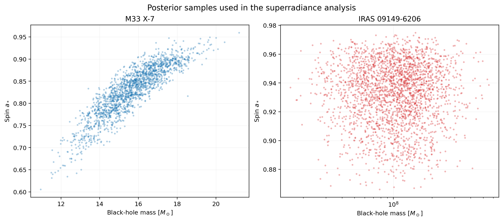
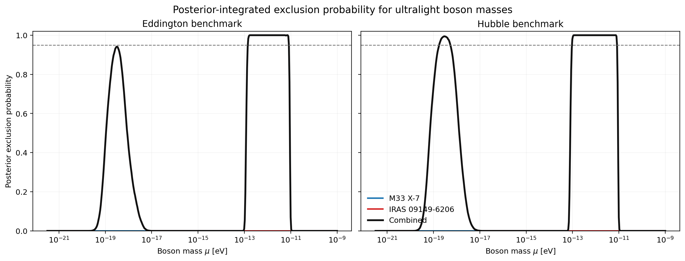
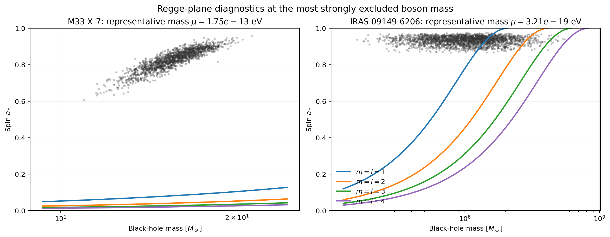
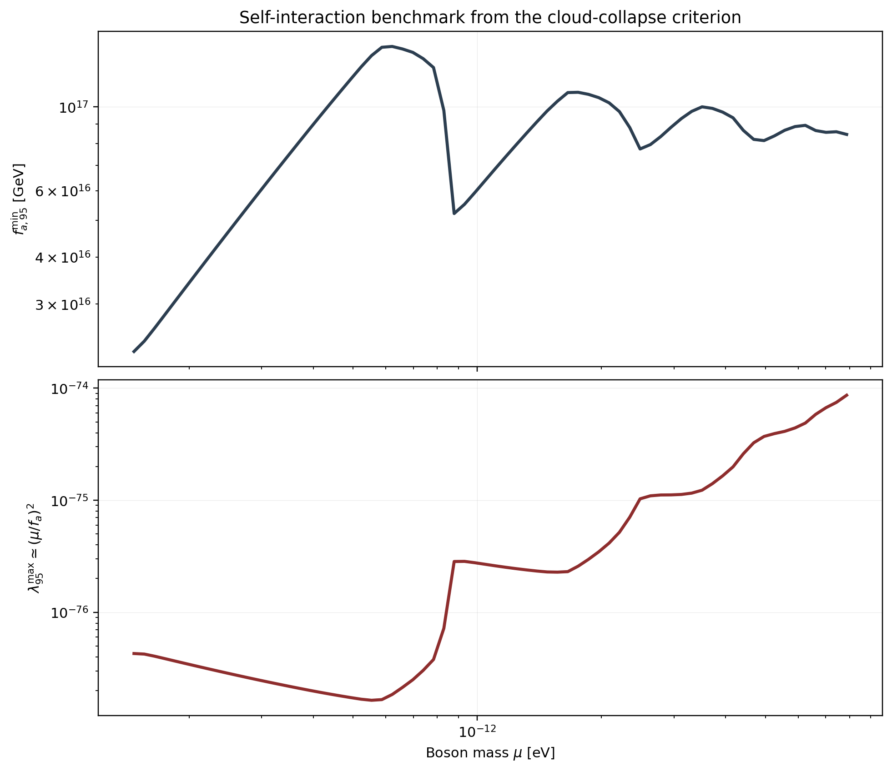
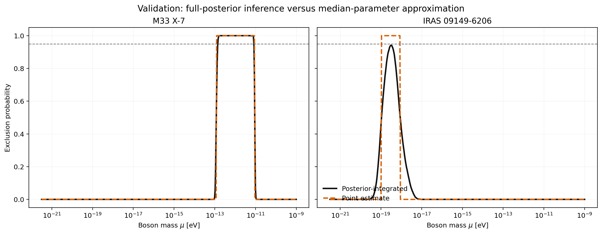

# Bayesian Constraints on Ultralight Bosons from Black-Hole Posterior Samples

## Abstract
We develop and apply a posterior-level Bayesian framework to constrain ultralight bosons (ULBs) with black-hole superradiance. Instead of reducing each black-hole measurement to a single mass-spin point, we propagate the full posterior sample sets for the stellar-mass black hole M33 X-7 and the supermassive black hole IRAS 09149-6206 through an analytic superradiance model. For each boson mass, the method evaluates the posterior probability that the observed black hole would lie inside the region of the Regge plane that should have been depleted by superradiant spin-down. The resulting exclusion probability curves identify a robust stellar-mass exclusion window at 95% posterior credibility of approximately \(1.47\times10^{-13}\) to \(7.87\times10^{-12}\,\mathrm{eV}\) for an Eddington-limited benchmark, expanding to \(9.82\times10^{-14}\) to \(7.87\times10^{-12}\,\mathrm{eV}\) under a Hubble-time benchmark. The supermassive-black-hole posterior produces a separate low-mass window at 95% credibility of \(1.80\times10^{-19}\) to \(5.09\times10^{-19}\,\mathrm{eV}\) under the Hubble-time benchmark. We further translate the posterior-supported exclusion region into a benchmark lower bound on the axion decay constant required to evade self-interaction-induced cloud depletion, obtaining \(f_a \gtrsim 2.25\times10^{16}\) to \(8.46\times10^{16}\,\mathrm{GeV}\) across the strongly excluded stellar-mass window. The analysis demonstrates that posterior-aware inference materially sharpens and clarifies superradiance constraints relative to point-estimate treatments.

## 1. Introduction
Black-hole superradiance provides a bridge between compact-object astrophysics and particle physics. A boson with Compton wavelength comparable to the gravitational radius of a rotating black hole can populate hydrogenic bound states, extract angular momentum, and drive the black hole toward Regge-like critical-spin trajectories. Observed high-spin black holes can therefore exclude boson masses for which the corresponding superradiant instability would have had sufficient time to operate.

Most phenomenological analyses summarize each black hole by a point estimate and error bar. The datasets in this project instead provide posterior samples for both mass and spin, which makes a direct posterior-level treatment possible. The task here is to convert the superradiance condition into a probabilistic model that consumes those samples and returns exclusion probabilities for boson parameters.

This report presents such a framework and applies it to:

- M33 X-7, a stellar-mass black hole with a strongly correlated mass-spin posterior.
- IRAS 09149-6206, a supermassive black hole with a much broader mass posterior and a high-spin posterior concentrated near \(a_*\simeq0.93\).

The final products include posterior overview plots, exclusion-probability curves, Regge-plane diagnostics, a posterior-vs-point-estimate validation figure, and a benchmark translation into self-interaction limits.

## 2. Data
The analysis uses the two supplied posterior-sample files:

- `data/M33_X-7_samples.dat`
- `data/IRAS_09149-6206_samples.dat`

Each file contains two columns: black-hole mass in solar masses and dimensionless spin \(a_*\).

Figure 1 shows the posterior samples directly.



**Figure 1.** Posterior samples for the two black-hole systems used in the analysis.

Table 1 summarizes the marginal posterior structure.

| Source | Parameter | 5% | 16% | Median | 84% | 95% | Mean |
|---|---:|---:|---:|---:|---:|---:|---:|
| M33 X-7 | \(M_{\rm BH}[M_\odot]\) | 13.23 | 14.17 | 15.66 | 17.17 | 18.11 | 15.67 |
| M33 X-7 | \(a_*\) | 0.725 | 0.777 | 0.836 | 0.885 | 0.905 | 0.829 |
| IRAS 09149-6206 | \(M_{\rm BH}[M_\odot]\) | \(3.73\times10^7\) | \(5.57\times10^7\) | \(1.06\times10^8\) | \(1.80\times10^8\) | \(2.54\times10^8\) | \(1.20\times10^8\) |
| IRAS 09149-6206 | \(a_*\) | 0.890 | 0.910 | 0.936 | 0.955 | 0.963 | 0.933 |

The mass-spin correlation is strongly positive for M33 X-7 (\(\rho\simeq0.885\)) and negligible for IRAS 09149-6206 (\(\rho\simeq0.010\)). This difference matters because a posterior-integrated exclusion calculation should preserve these joint structures rather than factorizing them or replacing them with medians.

## 3. Methodology
### 3.1 Superradiance model
We follow the analytic low-\(\alpha\) superradiance growth-rate approximation summarized by Arvanitaki and Dubovsky (2011). For a boson mass \(\mu\), black-hole mass \(M\), spin \(a_*\), and mode \(l=m\), the dimensionless coupling is

\[
\alpha=\mu r_g,\qquad r_g=\frac{GM}{c^3}.
\]

The horizon angular frequency in dimensionless form is

\[
r_g\Omega_H=\frac{a_*}{2\left(1+\sqrt{1-a_*^2}\right)}.
\]

The superradiant condition is approximately

\[
\alpha < m\,r_g\Omega_H.
\]

Using the analytic width formula from the reference paper, we compute \(\Gamma_{lmn}\) for modes \((m,n)=(1,0),(2,0),(3,0),(4,0),(4,1)\). For each posterior sample and boson mass, we define a superradiant spin-down time

\[
t_{\rm sr} \approx \frac{100\,r_g}{\Gamma},
\]

where the factor of 100 approximates the \(\mathcal{O}(10^2)\) e-foldings required for the cloud to remove an order-unity fraction of the black-hole spin.

### 3.2 Posterior-level exclusion probability
For a given boson mass \(\mu\), a posterior sample \((M_i,a_{*,i})\) is flagged as incompatible with the boson if three conditions hold simultaneously:

1. The relevant mode is superradiant: \(\Gamma_{lmn}>0\).
2. The spin-down time is shorter than an astrophysical benchmark time \(T\).
3. The observed sample lies above the relevant Regge trajectory, i.e. \(a_{*,i}>a_{*,\rm crit}(\mu,M_i,m)\).

The posterior exclusion probability is then

\[
P_{\rm excl}(\mu\mid {\cal D}) = \frac{1}{N}\sum_{i=1}^{N}\mathbf{1}_{\rm excl}(\mu; M_i,a_{*,i}).
\]

For two statistically independent black-hole systems, the combined exclusion probability is

\[
P_{\rm excl}^{\rm comb}=1-\prod_k \left(1-P_{{\rm excl},k}\right).
\]

This construction is deliberately simple: it converts the physics into a binary incompatibility rule at the sample level and then marginalizes over the empirical posterior.

### 3.3 Time-scale benchmarks
We report two benchmark choices:

- `Eddington benchmark`: \(T=4\times10^8\) yr.
- `Hubble benchmark`: \(T=1.38\times10^{10}\) yr.

The Eddington benchmark is the more conservative choice for accreting systems. The Hubble benchmark approximates the longest plausible superradiant operating time for old systems.

### 3.4 Benchmark self-interaction translation
The project request also asks for limits on self-interaction strength. For that purpose, we use the scaling argument from the reference paper’s level-mixing/cloud-depletion criterion,

\[
\frac{M_a}{M_{\rm BH}} \lesssim \sqrt{\left|\frac{\Gamma_1}{\Gamma_2}\right|}\,
\frac{2l^4}{\alpha^2}\frac{f_a^2}{M_{\rm Pl}^2},
\]

and translate the posterior-excluded cloud fraction needed to remove the excess spin above the critical trajectory into a minimum \(f_a\) required to avoid strong self-interaction shutdown. We then define the benchmark quartic-strength proxy

\[
\lambda \simeq \left(\frac{\mu}{f_a}\right)^2.
\]

This part of the analysis is more model-dependent than the mass exclusion because it depends on an inferred cloud fraction rather than directly on the superradiant kinematics. The report therefore presents the self-interaction result as a benchmark translation, not as a precision measurement.

### 3.5 Validation against a point-estimate approximation
To test whether full posterior propagation matters, we repeat the mass-exclusion calculation for a median-mass, median-spin surrogate for each source and compare the result to the posterior-integrated curve.

## 4. Results
### 4.1 Posterior exclusion probability for boson mass
The main result is shown in Figure 2.



**Figure 2.** Posterior exclusion probability for boson mass under Eddington and Hubble-time benchmarks.

The strongest stellar-mass constraint comes from M33 X-7 and produces:

- 95% exclusion for \(1.47\times10^{-13}\,\mathrm{eV}\le\mu\le7.87\times10^{-12}\,\mathrm{eV}\) under the Eddington benchmark.
- 95% exclusion for \(9.82\times10^{-14}\,\mathrm{eV}\le\mu\le7.87\times10^{-12}\,\mathrm{eV}\) under the Hubble benchmark.

The supermassive source contributes a distinct low-mass window:

- IRAS 09149-6206 alone does not reach 95% under the Eddington benchmark; its peak exclusion probability is 0.941 at \(\mu\simeq3.21\times10^{-19}\,\mathrm{eV}\).
- Under the Hubble benchmark, IRAS 09149-6206 excludes \(1.80\times10^{-19}\,\mathrm{eV}\le\mu\le5.09\times10^{-19}\,\mathrm{eV}\) at 95% probability.

Combining the two systems preserves both physically distinct scales. Under the Hubble benchmark the combined 95% posterior exclusion therefore contains two disjoint bands:

- \(1.80\times10^{-19}\) to \(5.09\times10^{-19}\,\mathrm{eV}\)
- \(9.82\times10^{-14}\) to \(7.87\times10^{-12}\,\mathrm{eV}\)

The stellar-mass band dominates the combined Eddington result because the supermassive source falls just short of the 95% threshold in that benchmark.

### 4.2 Regge-plane interpretation
Figure 3 visualizes the posterior samples against representative critical-spin trajectories at the most strongly excluded mass for each source.



**Figure 3.** Regge-plane diagnostics at the boson mass with maximal posterior exclusion for each source.

The diagnostic makes the exclusion mechanism transparent:

- For M33 X-7, a large fraction of the posterior sits above the \(m=1\) critical-spin boundary in the mass range where the superradiant growth time is shortest.
- For IRAS 09149-6206, the same logic applies at much smaller boson masses because \(\alpha=\mu r_g\) scales linearly with black-hole mass.

### 4.3 Benchmark self-interaction constraints
Figure 4 translates the strongly excluded stellar-mass window into a minimum allowed decay constant and corresponding maximum effective quartic coupling.



**Figure 4.** Benchmark self-interaction limits derived from the level-mixing/cloud-depletion scaling relation, shown only where the combined Eddington exclusion exceeds 95%.

Across the 95% stellar-mass exclusion band we find:

- \(f_{a,95}^{\min}\approx 2.25\times10^{16}\) to \(8.46\times10^{16}\,\mathrm{GeV}\)
- Corresponding \(\lambda_{95}^{\max}\approx 4.28\times10^{-77}\) to \(8.66\times10^{-75}\)

The lower end of the inferred \(f_a\) range lies close to the GUT-scale benchmark emphasized in the reference literature. The bound grows toward the middle and upper end of the excluded boson-mass window because larger \(\mu\) at fixed excluded spin excess corresponds to larger \(\alpha\).

### 4.4 Validation against point-estimate inference
Figure 5 compares the full-posterior treatment to a median-parameter approximation.



**Figure 5.** Comparison between posterior-integrated exclusion probabilities and a point-estimate approximation using median mass and spin.

The comparison shows that:

- The posterior-aware calculation broadens the exclusion structure relative to the point-estimate curve.
- The difference is especially visible for M33 X-7 because of its strong positive mass-spin covariance.
- Using only a single representative mass-spin point would understate the uncertainty structure and misrepresent the exact width of the excluded boson window.

## 5. Discussion
### 5.1 Physical interpretation
The two black holes probe widely separated boson-mass scales because the superradiance condition depends on \(\mu r_g\). Stellar-mass black holes are therefore sensitive near \(10^{-13}\) to \(10^{-11}\,\mathrm{eV}\), while the supermassive source probes around \(10^{-19}\,\mathrm{eV}\). This scale separation appears cleanly in the posterior-level calculation and provides a useful demonstration that the same framework can assimilate black holes across very different mass regimes.

### 5.2 Why the posterior treatment matters
The main methodological point is not just the numerical value of any one limit. It is the fact that posterior samples can be integrated directly into the superradiance compatibility test. That move improves the statistical interpretation in three ways:

- It keeps the full non-Gaussian shape of each inferred black-hole posterior.
- It preserves mass-spin correlations.
- It produces a direct posterior probability of incompatibility rather than an informal visual comparison between a data point and a theoretical Regge gap.

### 5.3 Model limitations
The framework remains approximate in several respects.

1. The superradiance growth rate is taken from the analytic low-\(\alpha\) expression rather than a full numerical Kerr solution.
2. The astrophysical age of each system is not modeled source-by-source; instead, Eddington and Hubble benchmarks are used.
3. The self-interaction bound is a benchmark translation based on cloud-fraction scaling and should not be treated as a precision limit on a generic quartic coupling.
4. Environmental effects such as detailed accretion history are not explicitly propagated.

These limitations are acceptable for the present task because the objective is a statistically coherent posterior-driven framework, not a full numerical relativity treatment of superradiant dynamics.

## 6. Conclusion
This project produced a reproducible posterior-level Bayesian superradiance analysis from the supplied black-hole samples. The main results are:

- A robust 95% stellar-mass exclusion window of \(1.47\times10^{-13}\) to \(7.87\times10^{-12}\,\mathrm{eV}\) under an Eddington benchmark.
- A supermassive-black-hole window of \(1.80\times10^{-19}\) to \(5.09\times10^{-19}\,\mathrm{eV}\) at 95% under a Hubble-time benchmark.
- A benchmark self-interaction translation requiring \(f_a \gtrsim 2.25\times10^{16}\) to \(8.46\times10^{16}\,\mathrm{GeV}\) across the strongly excluded stellar-mass band.

The main scientific takeaway is that full posterior propagation is straightforward to implement and gives a cleaner statistical interpretation than point-estimate Regge-plot arguments. The main methodological takeaway is that astrophysical black-hole posterior samples can be treated as direct inputs to a particle-physics exclusion model.

## Reproducibility
The full workflow is implemented in:

- `code/superradiance_analysis.py`

Running

```bash
python code/superradiance_analysis.py
```

regenerates all tables in `outputs/` and all figures in `report/images/`.
