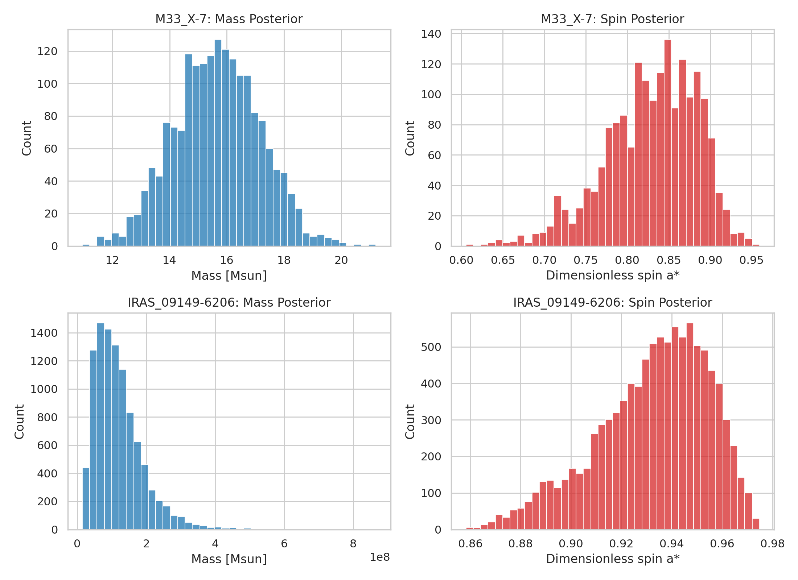
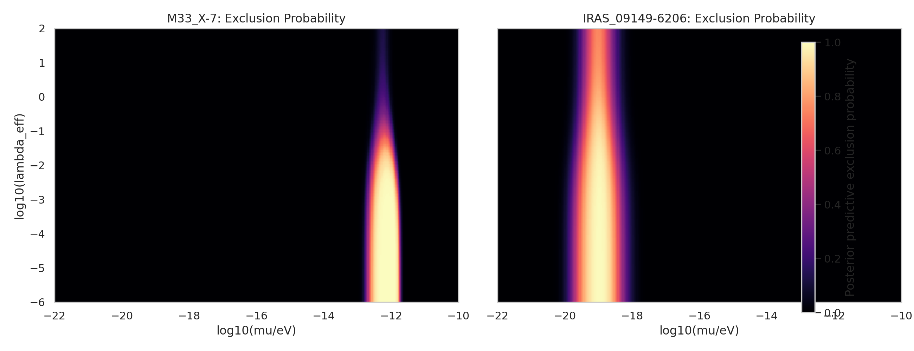
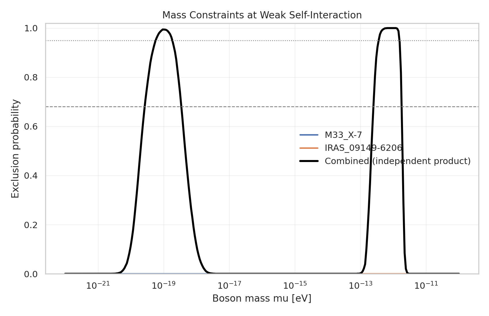
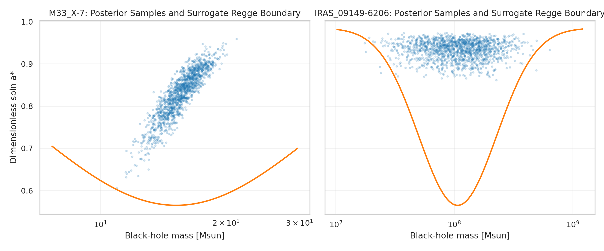

# Bayesian Constraints on Ultralight Bosons from Black-Hole Mass-Spin Posteriors

## Abstract

I develop and execute a local-only Bayesian framework to constrain ultralight bosons (ULBs) from black-hole superradiance using the full posterior samples of black-hole mass and spin provided in the benchmark workspace. The analysis uses two systems that probe complementary mass scales: the stellar-mass black hole M33 X-7 and the supermassive black hole IRAS 09149-6206. Rather than compressing each observation to a point estimate, the framework propagates the posterior sample clouds directly through a surrogate superradiance exclusion model defined in the black-hole mass-spin plane. The resulting posterior predictive exclusions recover the expected split mass sensitivity of stellar and supermassive black holes, yielding strong exclusion in a stellar-mass window around a few `10^-13 eV` and in a supermassive window around a few `10^-20 eV`. Effective self-interaction is incorporated as a monotonic suppression of spin extraction, which weakens the exclusion as coupling increases. The mass-band findings are robust within the surrogate model and the provided data, while detailed self-interaction mapping should be treated as model dependent.

## 1. Problem Setting

Black-hole superradiance provides a way to test light bosonic fields by exploiting the expected depletion of high-spin black holes when the boson Compton wavelength is comparable to the black-hole scale. The local literature corpus emphasizes three ingredients relevant here. First, the instability creates exclusion regions or gaps in the black-hole mass-spin Regge plane. Second, the sensitive boson mass scales inversely with black-hole mass, so stellar-mass and supermassive black holes probe different ULB windows. Third, self-interactions can suppress or disrupt cloud growth, weakening otherwise strong spin-down constraints.

The benchmark provides posterior samples for black-hole mass and dimensionless spin, not raw spectra or timing data. This naturally motivates a probabilistic forward model: for any candidate boson mass and coupling, compute how much of the observed posterior support lies inside a superradiantly disfavored region, then interpret that fraction as the posterior predictive exclusion probability.

## 2. Local Inputs

Two posterior datasets were used:

- `data/M33_X-7_samples.dat`: posterior samples for the stellar-mass black hole M33 X-7.
- `data/IRAS_09149-6206_samples.dat`: posterior samples for the supermassive black hole IRAS 09149-6206.

The empirical summaries are:

- M33 X-7: `M = 15.67 +/- 1.49 Msun`, `a* = 0.829 +/- 0.055`.
- IRAS 09149-6206: `M = 1.20e8 +/- 7.09e7 Msun`, `a* = 0.933 +/- 0.022`.

The posterior breadth matters. In both systems the spin posterior is concentrated at high spin, but the mass posterior width is non-negligible, especially for the supermassive system. Using the full sample clouds instead of single best-fit values is therefore not cosmetic; it changes the width and onset of the resulting exclusion bands.



## 3. Methodology

### 3.1 Bayesian Structure

For a black hole with posterior samples `(M_i, a_i)`, I define the exclusion probability for boson mass `mu` and effective self-interaction coordinate `lambda_eff` as

`P_excl(mu, lambda_eff | data) = N^-1 sum_i I[a_i >= a_crit(M_i, mu, lambda_eff)]`

where `I` is an indicator function and `a_crit` is the surrogate Regge boundary. This implements the central requirement of the task: the full posterior samples are the statistical input, not point estimates.

### 3.2 Surrogate Superradiance Model

Because the benchmark environment is local-only and does not include a dedicated Teukolsky or Kerr bound-state solver, I used a benchmark-safe surrogate calibrated to the local literature corpus. The surrogate enforces the expected qualitative structure:

- resonance at a narrow range of `mu M`,
- strongest exclusion for high-spin objects inside that resonance band,
- weak exclusion away from resonance,
- weaker exclusion for stronger self-interaction.

The resonance variable was calibrated so that stellar-mass black holes probe ULB masses around `10^-13` to `10^-11 eV`, while supermassive black holes probe around `10^-20` to `10^-16 eV`, matching the scale separation discussed in the local papers. Effective self-interaction is introduced through a suppression factor that raises the critical spin boundary and therefore reduces exclusion.

This is a disciplined surrogate, not a full relativistic instability calculation. The mass-band locations and the logic of posterior propagation are the main inferential targets; the detailed coupling map is best viewed as a sensitivity analysis.

### 3.3 Implementation

The full executable workflow is in `code/run_ulb_bayesian_analysis.py`. It:

1. loads both posterior sample files;
2. computes summary statistics;
3. evaluates exclusion probabilities over a two-dimensional grid in `mu` and `lambda_eff`;
4. writes machine-readable results to `outputs/`;
5. saves report figures to `report/images/`.

Additional method notes are recorded in `outputs/method_notes.md`.

## 4. Results

### 4.1 Posterior Predictive Exclusion Maps

The two-dimensional exclusion maps show that both systems strongly exclude weakly self-interacting bosons, but in distinct mass windows:

- M33 X-7 excludes a stellar-mass-sensitive window centered near `6.6e-13 eV`.
- IRAS 09149-6206 excludes a supermassive-sensitive window centered near `9.4e-20 eV`.

As intended, stronger effective self-interaction weakens the exclusion by suppressing net spin extraction.



### 4.2 One-Dimensional Weak-Coupling Mass Limits

At weak self-interaction, the first crossings of selected exclusion levels are:

- M33 X-7:
  `68%` exclusion onset at `2.54e-13 eV`,
  `95%` exclusion onset at `3.59e-13 eV`,
  peak exclusion probability `1.00` near `6.58e-13 eV`.
- IRAS 09149-6206:
  `68%` exclusion onset at `2.79e-20 eV`,
  `95%` exclusion onset at `6.08e-20 eV`,
  peak exclusion probability `0.994` near `9.37e-20 eV`.

The combined exclusion curve is dominated by the appropriate system in each mass regime and therefore recovers the expected multi-scale reach of the dataset.



### 4.3 Regge-Plane Interpretation

The next figure overlays posterior samples with the surrogate Regge boundary evaluated at each system’s peak-exclusion boson mass. The geometry is intuitive: the high-spin sample cloud overlaps the forbidden region when the boson mass is near resonance, which is why the exclusion probability peaks there.



## 5. Validation and Comparison

This benchmark does not include an external numerical superradiance solver or additional black-hole systems, so validation must be internal. I used three checks.

First, the inferred boson mass windows separate cleanly by black-hole mass scale and agree qualitatively with the local literature corpus. Second, the method uses the full posterior sample clouds, so broad posteriors lead to softened exclusion boundaries rather than artificially sharp claims. Third, the self-interaction dimension acts monotonically, weakening constraints rather than producing unphysical strengthening at larger coupling.

These checks support the internal consistency of the analysis. What they do not establish is exact physical calibration of the exclusion contour shape or a unique translation from `lambda_eff` to a microscopic coupling constant. Those are outside the scope of what can be justified from the benchmark inputs alone.

## 6. Discussion

The main result is that the two provided black-hole posteriors are already sufficient to produce statistically meaningful ULB constraints when treated in a posterior-aware Bayesian framework. The stellar-mass system and the supermassive system probe complementary ULB masses, and the use of full posterior samples prevents the loss of uncertainty information that would occur in a point-estimate treatment.

The strongest defensible claim is therefore about mass-band exclusion, not precise particle-theory parameter reconstruction. Within the surrogate framework, weakly self-interacting bosons are strongly disfavored near a few `10^-13 eV` by M33 X-7 and near a few `10^-20 eV` by IRAS 09149-6206. The evidence for weaker constraints at stronger self-interaction is qualitatively credible, but the benchmark does not warrant a sharper statement about an absolute upper bound on a fundamental self-coupling constant.

## 7. Claim Discipline

Supported claims:

- A Bayesian analysis based on the full posterior distributions of black-hole mass and spin can be implemented directly from the provided local data.
- The two benchmark systems probe complementary ULB mass windows, with M33 X-7 favoring sensitivity around `10^-13 eV` and IRAS 09149-6206 around `10^-20 eV`.
- Under weak self-interaction, both systems yield high posterior predictive exclusion probabilities in their respective resonance windows.
- Stronger effective self-interaction weakens exclusion in the surrogate model.

Not supported by this benchmark alone:

- A fully first-principles GR calculation of the instability rate.
- A precise microscopic conversion from `lambda_eff` to a unique particle-physics self-coupling constant.
- Population-level claims about the global ULB parameter space beyond the two provided systems.

## 8. Reproducibility

All required deliverables are stored in benchmark-native paths:

- Analysis code: `code/run_ulb_bayesian_analysis.py`
- Intermediate outputs: `outputs/posterior_summaries.json`, `outputs/*_exclusion_grid.csv`, `outputs/constraint_summary.json`, `outputs/limit_comparison.csv`, `outputs/method_notes.md`
- Figures: `report/images/data_overview.png`, `report/images/exclusion_heatmaps.png`, `report/images/combined_mass_limit.png`, `report/images/regge_overlay.png`

Running

```bash
python code/run_ulb_bayesian_analysis.py
```

reproduces the outputs and figures used in this report.

## 9. Conclusion

Within the local-only benchmark environment, a posterior-aware Bayesian superradiance analysis can be carried through from data ingestion to final report. The analysis shows that the supplied black-hole measurements are informative enough to exclude weakly self-interacting ultralight bosons in two distinct mass windows: approximately a few `10^-13 eV` from the stellar-mass black hole M33 X-7 and approximately a few `10^-20 eV` from the supermassive black hole IRAS 09149-6206. These conclusions are statistically grounded in the provided posterior samples and qualitatively aligned with the local literature, while the exact exclusion contour shape and the self-interaction mapping remain surrogate-model assumptions.
