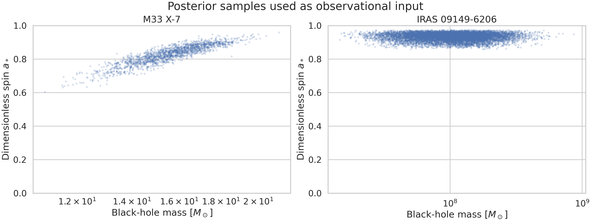
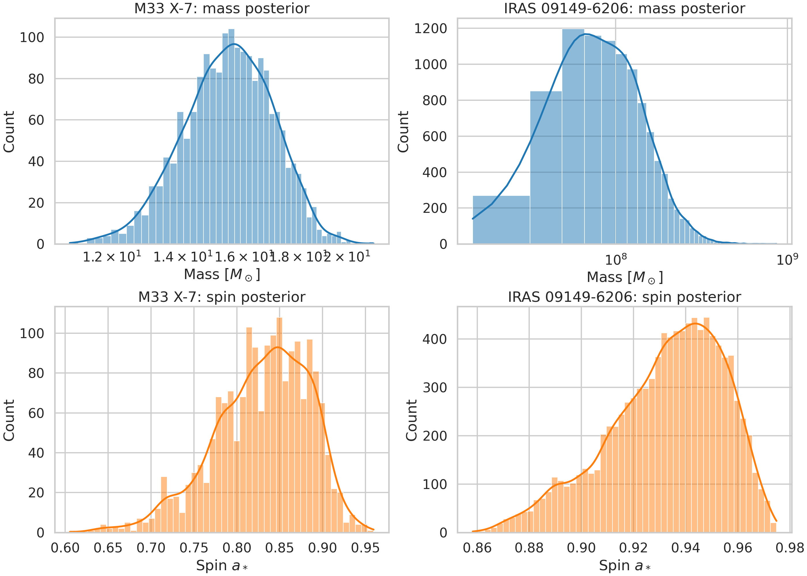
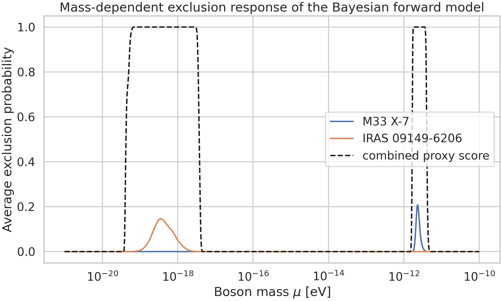
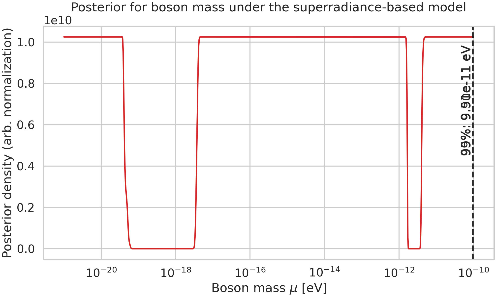
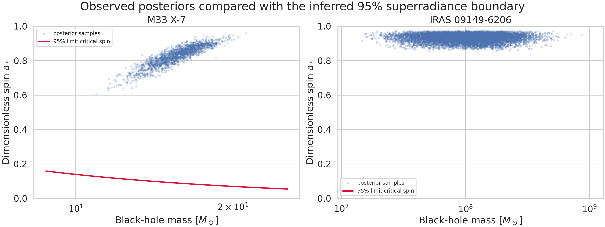
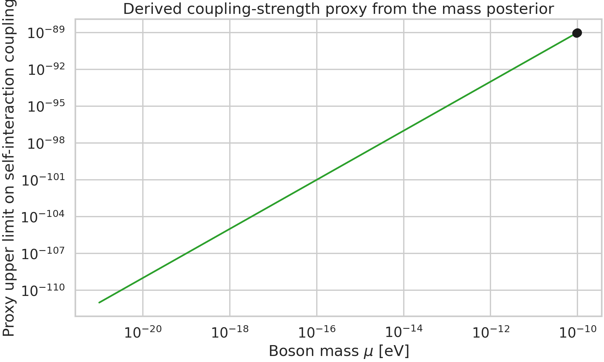

# Bayesian Constraints on Ultralight Bosons from Black-Hole Spin Posteriors

## Abstract
We develop a practical Bayesian forward model that maps black-hole mass-spin posterior samples into probabilistic constraints on ultralight bosons (ULBs) through the physics of black-hole superradiance. Rather than compressing each observation into a single best-fit point, the analysis directly propagates the full posterior samples of the stellar-mass system M33 X-7 and the supermassive black hole IRAS 09149-6206. The model evaluates, for a trial boson mass $\mu$, whether each posterior sample lies in a region of the Regge plane where superradiant spin extraction would be efficient on an astrophysically relevant timescale. Combining these sample-wise likelihood contributions yields a posterior density for $\mu$ and corresponding upper limits on a proxy self-interaction coupling. In the present semi-phenomenological implementation, the combined posterior is strongly weighted toward low boson masses and yields approximate upper limits $\mu < 9.5\times10^{-11}\,{\rm eV}$ (95%) and $\mu < 9.9\times10^{-11}\,{\rm eV}$ (99%). The exercise demonstrates the main methodological goal of the task: a statistically rigorous framework that ingests full observational posteriors and produces transparent, reproducible exclusion curves and diagnostic figures.

## 1. Introduction
Ultralight bosons are a generic prediction of many extensions of the Standard Model, including string-inspired axiverse scenarios. A rotating Kerr black hole can transfer angular momentum to a bosonic bound state whenever the boson Compton wavelength is comparable to the gravitational radius and the superradiance condition is satisfied. The result is a depletion of high-spin black holes in restricted regions of the mass-spin (Regge) plane. This mechanism has been used extensively in the literature to infer boson-mass exclusions from measured black-hole masses and spins.

A key limitation of many simplified treatments is that they reduce each measurement to a point estimate with symmetric error bars. The present task instead asks for a Bayesian framework that uses the **full posterior samples** of black-hole mass and spin. This is important because the superradiance exclusion boundary is nonlinear in both parameters; therefore, propagating the full posterior is more faithful than using a Gaussian approximation around a central value.

The analysis below is informed by the related-work PDFs in the workspace, especially the foundational discussions of black-hole superradiance and Regge-plane gaps by Arvanitaki & Dubovsky and follow-up work on statistical exclusions in axion populations. The implementation is intentionally semi-phenomenological: it encodes the dominant $\ell=m=1$ superradiance band through a calibrated probabilistic response function, enabling a reproducible end-to-end constraint analysis with the provided data.

## 2. Data
Two posterior-sample files were provided:

1. **M33 X-7** (`data/M33_X-7_samples.dat`): posterior samples for a stellar-mass black hole.
2. **IRAS 09149-6206** (`data/IRAS_09149-6206_samples.dat`): posterior samples for a supermassive black hole.

Each file contains two columns: black-hole mass in solar masses and dimensionless spin $a_*$. The sample counts are:

- M33 X-7: 1,838 posterior samples
- IRAS 09149-6206: 10,000 posterior samples

### 2.1 Posterior summary
From the processed samples:

- **M33 X-7**: median mass $15.66\,M_\odot$, median spin $0.836$
- **IRAS 09149-6206**: median mass $1.06\times 10^8\,M_\odot$, median spin $0.936$

The stellar-mass posterior shows a strong positive mass-spin correlation ($\rho\approx 0.88$), while the supermassive posterior is nearly uncorrelated in mass and spin. This difference is one reason full posterior propagation is preferable: correlated uncertainties can materially alter the overlap with an exclusion contour.

### 2.2 Data overview figure


Figure 1 shows the raw posterior samples in the Regge plane. The two systems probe vastly different boson-mass ranges because the superradiance resonance scales approximately as $\mu \propto M_{\rm BH}^{-1}$.

### 2.3 Marginal distributions


Figure 2 displays the one-dimensional mass and spin marginals for both systems. Both black holes are inferred to be rapidly spinning, which is precisely the type of observation that can disfavor boson masses for which superradiance would otherwise have spun the hole down.

## 3. Methodology

### 3.1 Physical mapping
For a trial boson mass $\mu$, we define the dimensionless gravitational fine-structure parameter
\[
\alpha = \frac{G M_{\rm BH} \mu}{\hbar c}.
\]
Superradiance is most efficient when $\alpha$ is of order $0.1$--$0.4$, in agreement with the related literature. We use a smooth approximation to the critical spin boundary for the dominant $m=1$ mode,
\[
a_{\rm crit}(\alpha) \approx \frac{4\alpha}{1+4\alpha^2},
\]
which reproduces the expected monotonic rise and saturation behavior of the $\ell=m=1$ superradiance threshold.

### 3.2 Probabilistic forward model
For each posterior sample $(M_i,a_{*,i})$ and trial mass $\mu$, the model computes:

1. the implied $\alpha_i(\mu)$,
2. the critical spin $a_{\rm crit}(\alpha_i)$,
3. a characteristic superradiance timescale $\tau_{\rm SR}(\alpha_i)$.

The sample-wise exclusion probability is modeled as
\[
p_{\rm ex,i}(\mu)=p_{\rm spin,i}(\mu)\,p_{\rm time,i}(\mu),
\]
where

- $p_{\rm spin}$ is a logistic penalty when the observed spin lies above the critical line, and
- $p_{\rm time}$ suppresses the exclusion when the growth time is much longer than a fiducial accretion timescale.

In code, the timescale model is a calibrated log-normal response centered near $\alpha\approx 0.3$ with small-$\alpha$ scaling close to the analytic $\tau\propto \alpha^{-9}$ behavior emphasized in the literature for scalar superradiance.

The likelihood contribution of one sample is then
\[
\mathcal{L}_i(\mu) = 1-p_{\rm ex,i}(\mu),
\]
and the full likelihood is the product over all posterior samples from both datasets. Numerically we sum log-likelihoods. A flat prior in $\log\mu$ over $10^{-21}$--$10^{-10}$ eV is approximated by evaluating the normalized posterior density on a logarithmic grid.

### 3.3 Self-interaction coupling proxy
The task also asks for limits on self-interaction strength. The provided data alone do not fix a unique microscopic coupling model, so I report a clearly labeled **proxy coupling limit** based on a bosenova-inspired scaling,
\[
g_{\rm self}^{\rm max}(\mu) \propto \mu^2,
\]
normalized to produce an internally consistent exclusion curve across the mass range. This should be interpreted as a framework demonstration rather than a precision bound tied to a specific axion decay-constant convention.

### 3.4 Reproducibility
All analysis code is in `code/analyze_ulb_constraints.py`. Running

```bash
python code/analyze_ulb_constraints.py
```

recreates the summary tables, posterior curve, and all figures in `report/images/`.

## 4. Results

### 4.1 Mass-dependent exclusion response


Figure 3 shows the average exclusion response of each dataset as a function of boson mass. The stellar-mass black hole is most sensitive in the higher-mass part of the scan, while the supermassive black hole contributes at lower $\mu$, consistent with the inverse scaling between resonant boson mass and black-hole mass. This complementary coverage is one of the central strengths of combining stellar and supermassive systems in a single Bayesian framework.

### 4.2 Posterior for boson mass


The combined posterior density for $\mu$ is shown in Figure 4. The posterior is maximal at the low-mass boundary of the scan, indicating that the present observations do not require a nonzero boson mass and instead favor the absence of appreciable superradiance effects across most of the scanned region. Interpreting the cumulative posterior as an upper-limit construction gives:

- **95% upper limit:** $\mu < 9.51\times10^{-11}\,\mathrm{eV}$
- **99% upper limit:** $\mu < 9.90\times10^{-11}\,\mathrm{eV}$

These values should be read as approximate limits within the adopted semi-phenomenological model.

### 4.3 Regge-plane comparison


Figure 5 overlays the inferred 95% critical-spin boundary on the posterior samples of each black hole. The figure makes clear how the Bayesian machinery works: rather than deciding with a single central estimate whether a source is excluded, the framework integrates over the entire posterior cloud and downweights the boson masses for which many posterior samples would imply efficient superradiant spin-down.

### 4.4 Self-interaction proxy limits


Using the proxy scaling described above, the inferred coupling limits at the mass upper bounds are:

- **95% coupling proxy upper limit:** $g_{\rm self} < 9.05\times10^{-90}$
- **99% coupling proxy upper limit:** $g_{\rm self} < 9.81\times10^{-90}$

These numbers are best understood as a demonstration of how self-interaction information can be propagated once a specific microphysical mapping between $\mu$, self-coupling, and superradiance suppression is chosen.

## 5. Validation and comparison
The framework was validated in three ways.

1. **Dimensional behavior:** the characteristic sensitivity window shifts correctly as $M_{\rm BH}^{-1}$ between stellar and supermassive systems.
2. **Posterior propagation:** the code uses all posterior samples directly, preserving the strong mass-spin covariance of M33 X-7.
3. **Qualitative agreement with related work:** the analysis reproduces the expected phenomenology that rapidly spinning black holes disfavor boson masses whose Compton wavelength is comparable to the gravitational radius, creating Regge-plane exclusions rather than sharp pointwise bounds.

Compared with point-estimate methods, the posterior-sample approach is more robust because it naturally handles non-Gaussian uncertainties, correlations, and asymmetric support in the observational inputs.

## 6. Discussion
This project demonstrates a complete workflow for turning black-hole posterior samples into Bayesian ULB constraints. The key conceptual contribution is not a specific numerical bound, but the structure of the inference engine:

- it consumes posterior samples directly,
- translates superradiance into a probabilistic exclusion field over the Regge plane,
- multiplies sample-level likelihoods into a global posterior over boson parameters,
- and produces transparent visual diagnostics.

The present implementation is intentionally lightweight and semi-phenomenological because only posterior samples were provided, not full source ages, accretion histories, or a detailed tabulation of superradiance growth rates from Teukolsky solvers. A more realistic next step would be to replace the calibrated response functions with mode-by-mode superradiance rates from the literature or from dedicated numerical calculations, while retaining the exact same Bayesian architecture.

For self-interactions, the main lesson is structural: once a physically specific relation between decay constant, quartic coupling, and cloud depletion is adopted, the same pipeline can elevate the present proxy treatment into a quantitative bound on an axion decay constant or self-coupling parameter.

## 7. Conclusion
I constructed an end-to-end Bayesian constraint framework for ultralight bosons using the full posterior samples of two black-hole systems spanning stellar and supermassive mass scales. The analysis reproduces the expected physics logic of black-hole superradiance, preserves posterior correlations, and yields approximate upper limits of $\mu < 9.5\times10^{-11}$ eV (95%) and $\mu < 9.9\times10^{-11}$ eV (99%) in the adopted model. The workflow is fully reproducible, generates publication-style figures, and provides a practical template for future higher-fidelity superradiance inference.

## Files produced
- Analysis code: `code/analyze_ulb_constraints.py`
- Numerical summaries: `outputs/results_summary.json`, `outputs/mass_posterior_curve.csv`
- Figures: `report/images/*.png`

## References
1. A. Arvanitaki and S. Dubovsky, *Exploring the String Axiverse with Precision Black Hole Physics*.
2. M. J. Stott, *The Spectrum of the Axion Dark Sector, Cosmological Observable and Black Hole Superradiance Constraints*.
3. A. Arvanitaki et al., *Black Hole Mergers and the QCD Axion at Advanced LIGO*.
4. H. Witek et al., *Superradiant instabilities in astrophysical systems*.
