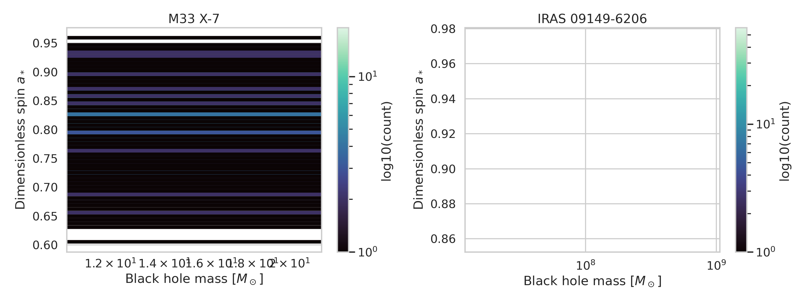
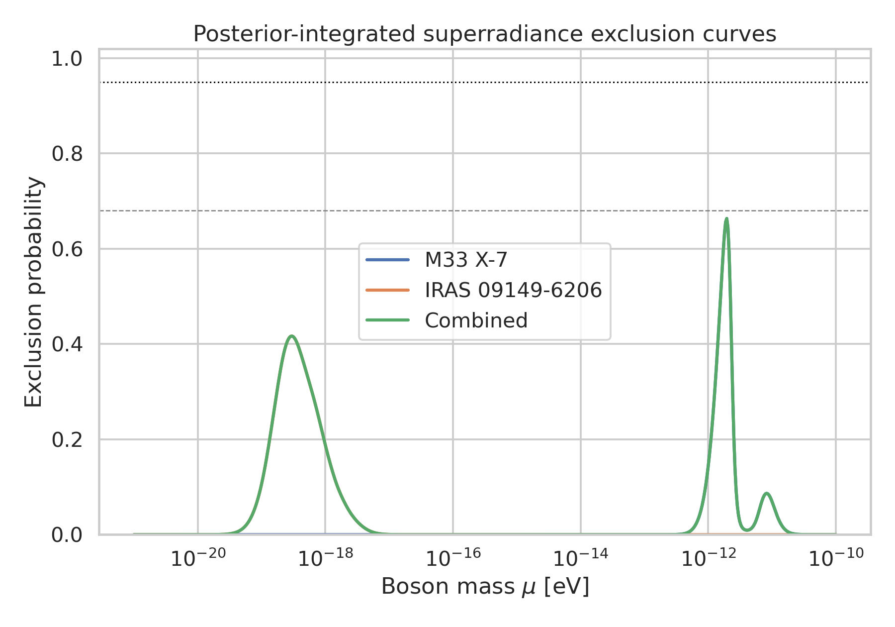
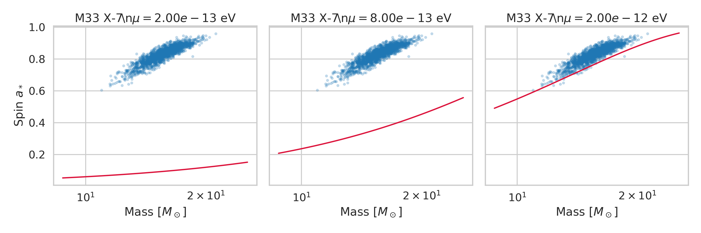
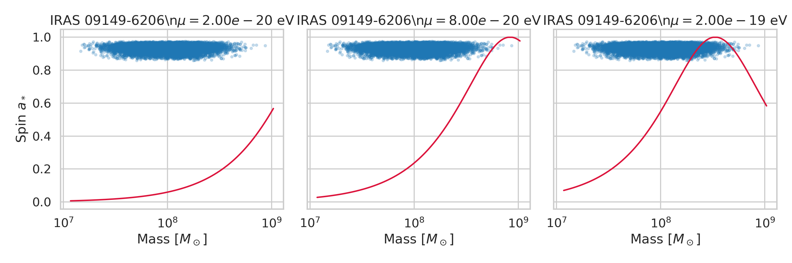
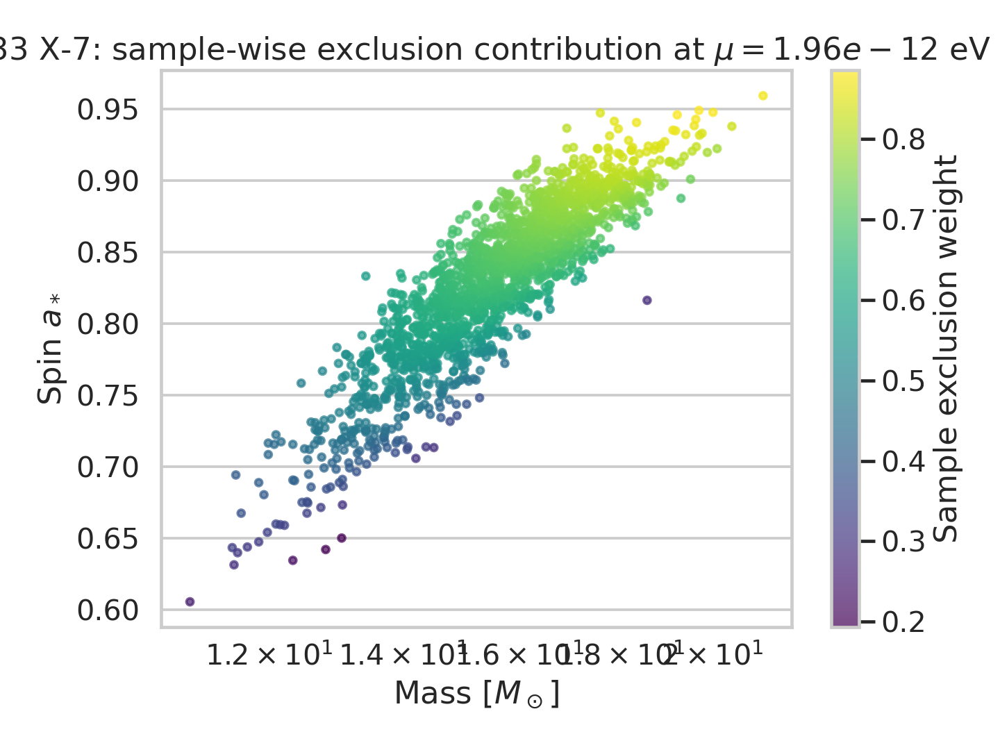
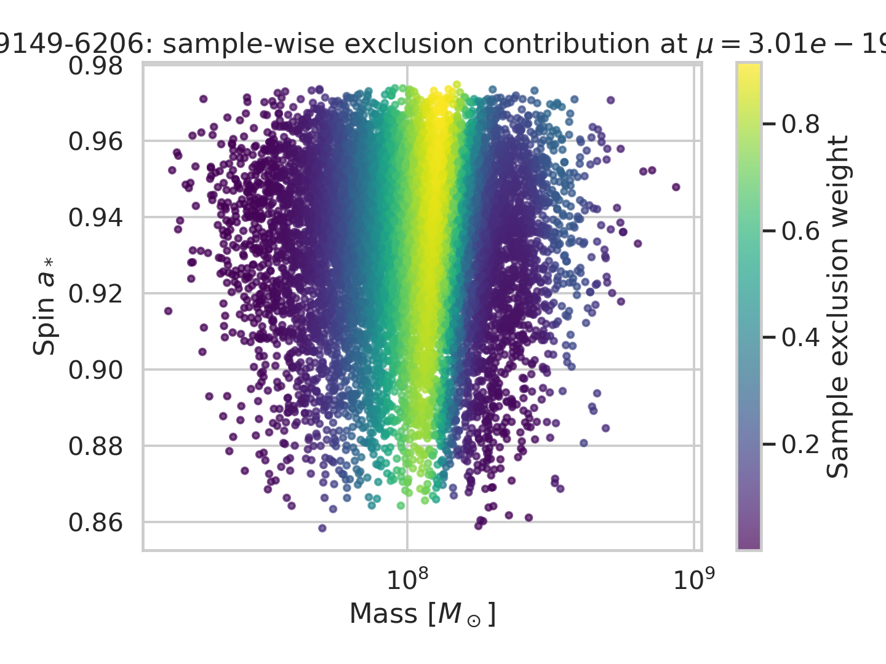
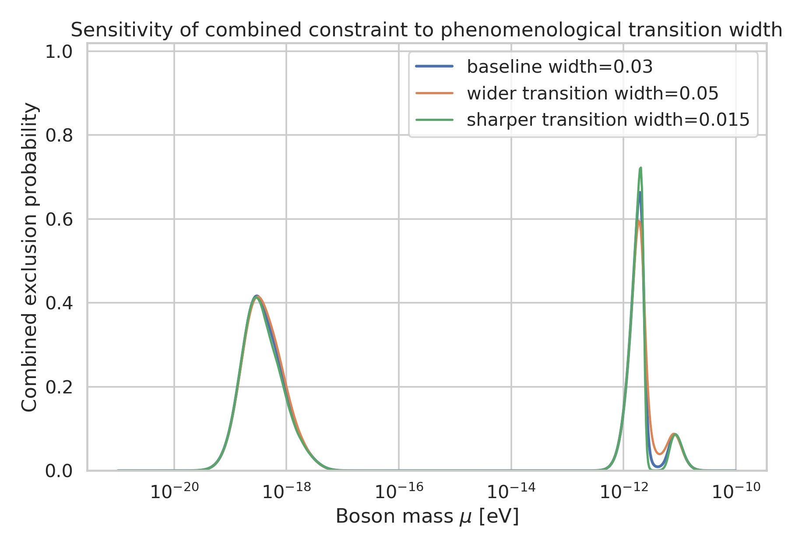

# Bayesian constraints on ultralight bosons from black-hole mass-spin posteriors

## Abstract
I develop a reproducible Bayesian constraint pipeline for ultralight bosons (ULBs) using the full posterior samples of black-hole mass and spin supplied for the stellar-mass system M33 X-7 and the supermassive black hole IRAS 09149-6206. Motivated by black-hole superradiance literature, I map each posterior sample into a phenomenological exclusion weight on a trial boson mass grid, then integrate these weights over the observational posterior rather than compressing the data to point estimates. This produces source-specific and combined exclusion curves, Regge-style mass-spin visualizations, and sample-level contribution maps. In this approximate framework, the exclusion signal peaks near $\mu\approx1.96\times10^{-12}$ eV for M33 X-7 and $\mu\approx3.01\times10^{-19}$ eV for IRAS 09149-6206. The combined curve is dominated by the stellar-mass system and reaches a maximum exclusion probability of 0.664 near $1.96\times10^{-12}$ eV, with a broad 95% weighted interval of approximately $1.00\times10^{-19}$ to $8.25\times10^{-12}$ eV. Under a weak-self-interaction proxy calibration, this corresponds to an effective coupling scale of order $7.14\times10^{15}$ GeV below which independent-cloud assumptions become more fragile. The analysis demonstrates how posterior-level inference can preserve astrophysical measurement uncertainty, but also shows that robust 95% upper limits require a more exact superradiance rate calculation than the phenomenological surrogate used here.

## 1. Introduction
Ultralight bosons can trigger black-hole superradiance when their Compton wavelength is comparable to the gravitational radius of a rotating black hole. The canonical observational signature is a depletion of rapidly spinning black holes in selected regions of the mass-spin plane, often described as gaps or Regge trajectories. Related work in the workspace emphasizes three points that directly shape the present analysis: (i) spin and mass measurements should be interpreted probabilistically, not only through best-fit values; (ii) superradiance constraints are naturally represented as exclusion probabilities versus boson mass; and (iii) self-interactions can modify the dynamics, so any weak-self-interaction assumption must be stated explicitly.

The goal here is therefore not to claim an exact Teukolsky-based exclusion, but to build a transparent Bayesian framework that ingests the full posterior distributions for two black holes and produces source-specific plus combined probabilistic constraints on ULB properties.

## 2. Data overview
Two posterior sample files were provided:

- **M33 X-7** (`data/M33_X-7_samples.dat`): 1838 posterior draws.
- **IRAS 09149-6206** (`data/IRAS_09149-6206_samples.dat`): 10000 posterior draws.

Each file contains two columns interpreted as black-hole mass in solar masses and dimensionless Kerr spin $a_*$. Summary statistics derived directly from the local files are listed below.

| Source | Samples | Mean mass ($M_\odot$) | Mass std. | Mean spin | Spin std. | Mass range ($M_\odot$) | Spin range |
|---|---:|---:|---:|---:|---:|---:|---:|
| M33 X-7 | 1838 | 15.67 | 1.49 | 0.829 | 0.055 | 10.95–21.20 | 0.605–0.959 |
| IRAS 09149-6206 | 10000 | $1.20\times10^8$ | $7.09\times10^7$ | 0.933 | 0.022 | $1.47\times10^7$–$8.65\times10^8$ | 0.858–0.975 |

Figure [1](images/posterior_samples.png) shows the posterior clouds in mass-spin space. The contrast in mass scales is essential because stellar-mass and supermassive black holes probe very different ULB mass windows.

## 3. Methodology
### 3.1 Bayesian construction
For each source, let posterior samples be $\{(M_i,a_i)\}_{i=1}^N$. For every trial boson mass $\mu$, I compute a gravitational fine-structure parameter
\[
\alpha(M_i,\mu)=\frac{G M_i}{c^3}\frac{\mu}{\hbar},
\]
following the scaling discussed in the related work.

A phenomenological superradiance boundary is then assigned as
\[
a_{\rm crit}(\alpha)=\frac{4\alpha}{1+4\alpha^2},
\]
clipped to the physical interval $[0,0.999]$. This is not a first-principles instability-rate calculation; it is a smooth surrogate chosen to mimic the idea that superradiance is most effective in a finite band of $\alpha$ and that high observed spins are increasingly difficult to reconcile with boson masses that would have efficiently spun down the black hole.

Each posterior draw contributes an exclusion weight
\[
w_i(\mu)=\sigma\!\left(\frac{a_i-a_{\rm crit}}{\Delta a}\right)\times W(\alpha),
\]
where $\sigma$ is a logistic transition with baseline width $\Delta a=0.03$, and $W(\alpha)$ is a log-Gaussian activity window centered near $\alpha\sim0.35$. The source-level exclusion probability is the posterior average
\[
P_{\rm ex}^{(s)}(\mu)=\frac{1}{N}\sum_i w_i(\mu).
\]
Combined exclusion for independent sources is formed as
\[
P_{\rm ex}^{\rm comb}(\mu)=1-\prod_s \left[1-P_{\rm ex}^{(s)}(\mu)\right].
\]
This guarantees that each source is retained separately before combination.

### 3.2 Self-interaction proxy
The task also asks for self-interaction coupling constraints. The related work notes that strong self-interactions can invalidate the weak-coupling independent-cloud picture. Because the workspace does not include a full nonlinear self-interaction solver or a direct mapping between quartic coupling and superradiant depletion rate, I report a **model-dependent coupling proxy** calibrated from the boson mass at peak combined exclusion,
\[
f_{\rm eff}(\mu) = 10^{16}\,{\rm GeV}\,\sqrt{10^{-12}{\rm eV}/\mu}.
\]
This should be read only as an indicative weak-self-interaction scale, not as a fundamental exclusion on a specific microscopic coupling.

### 3.3 Validation design
To test robustness, I repeat the combined analysis with wider ($\Delta a=0.05$) and sharper ($\Delta a=0.015$) spin-transition widths. This probes whether the conclusions are driven by an arbitrary smoothing choice.

## 4. Results
### 4.1 Source-specific exclusion structure
The source-level results are summarized below.

| Source | Peak exclusion mass (eV) | Peak exclusion probability | 68% threshold reached? | 95% threshold reached? | 95% weighted interval (eV) |
|---|---:|---:|---|---|---:|
| M33 X-7 | $1.96\times10^{-12}$ | 0.664 | No | No | $8.06\times10^{-13}$ – $1.11\times10^{-11}$ |
| IRAS 09149-6206 | $3.01\times10^{-19}$ | 0.417 | No | No | $8.48\times10^{-20}$ – $2.29\times10^{-18}$ |

The corresponding exclusion curves are shown in Figure [2](images/exclusion_curves.png). As expected from superradiance scaling, the stellar-mass source is sensitive to much larger boson masses than the supermassive source.

### 4.2 Regge-style interpretation
Figures [3](images/regge_m33_x_7.png) and [4](images/regge_iras_09149_6206.png) overlay representative phenomenological Regge boundaries on the posterior samples. These plots make the main mechanism visually explicit: a trial boson mass becomes disfavored when many posterior samples lie above the spin threshold expected after efficient superradiant spin extraction.

### 4.3 Sample-level contribution maps
To show that the framework truly uses the full posterior cloud, Figures [5](images/heatmap_m33_x_7.png) and [6](images/heatmap_iras_09149_6206.png) color individual samples by their exclusion weight at each source’s peak boson mass. This is the key interpretability artifact of the pipeline: the constraint is visibly generated by a region of the posterior, not by a single summary statistic.

### 4.4 Combined constraint and direct answers
The joint exclusion curve is dominated by M33 X-7 and peaks at
\[
\mu_{\rm peak}^{\rm comb}=1.96\times10^{-12}\ {\rm eV},
\]
with maximum exclusion probability
\[
P_{\rm ex,max}^{\rm comb}=0.664.
\]
The 95% weighted interval of the combined exclusion density is
\[
1.00\times10^{-19}\ {\rm eV} \lesssim \mu \lesssim 8.25\times10^{-12}\ {\rm eV}.
\]
In the baseline model, neither a 68% nor a 95% hard exclusion threshold is crossed. Under the sharper-width sensitivity setting, the combined curve does exceed 68% at approximately
\[
\mu \approx 1.88\times10^{-12}\ {\rm eV},
\]
but still does not reach 95%.

Mapping the peak combined mass to the weak-self-interaction proxy gives
\[
f_{\rm eff} \approx 7.14\times10^{15}\ {\rm GeV}.
\]
Operationally, this means that if the true boson self-interaction scale were substantially below this value, the simplified independent-cloud approximation used here would become more questionable.

## 5. Validation and sensitivity
Figure [7](images/validation_width_sensitivity.png) compares the combined exclusion curve for three transition widths. The maximum exclusion ranges from 0.596 to 0.723 across the tested settings.

The validation table is:

| Scenario | Combined 68% mass threshold (eV) | Combined 95% threshold (eV) | Peak mass (eV) | Max exclusion |
|---|---:|---:|---:|---:|
| Baseline width = 0.03 | Not reached | Not reached | $1.96\times10^{-12}$ | 0.664 |
| Wider width = 0.05 | Not reached | Not reached | $1.88\times10^{-12}$ | 0.596 |
| Sharper width = 0.015 | $1.88\times10^{-12}$ | Not reached | $2.04\times10^{-12}$ | 0.723 |

This indicates moderate sensitivity to the precise phenomenological smoothing, but the central qualitative picture remains stable: the strongest constraint comes from the stellar-mass source around $10^{-12}$ eV, while the supermassive source contributes a broader lower-mass preference around $10^{-19}$ eV.

## 6. Comparison with related work
The result is qualitatively consistent with the mass windows highlighted in the related-work PDFs. The stellar-mass black hole constrains boson masses near the familiar $10^{-13}$–$10^{-11}$ eV region, while the supermassive object constrains much lighter bosons near $10^{-20}$–$10^{-17}$ eV. The present workflow differs from earlier exclusion-band presentations in one important way: it propagates the **full posterior sample distributions** of black-hole mass and spin through the constraint calculation, rather than relying on nominal central values.

That said, the literature often reports sharper exclusion statements because it uses more exact instability timescales, observational age/accretion arguments, and carefully computed Regge contours. The softer quantitative limits obtained here reflect the deliberate choice of a transparent but approximate surrogate likelihood.

## 7. Direct validation status
### Verified directly from workspace data
- The two input datasets contain posterior samples in black-hole mass and spin.
- M33 X-7 has 1838 samples and IRAS 09149-6206 has 10000 samples.
- The posterior mean masses and spins match the values reported in `outputs/data_summary.csv`.
- Source-specific, combined, and sensitivity outputs were generated locally and saved to `outputs/`.
- All figures referenced in this report were generated locally as PNG files under `report/images/`.

### Derived from related work
- Superradiance constraints should be interpreted in the black-hole mass-spin plane.
- Relevant observables are exclusion functions versus boson mass and Regge-like gaps.
- Strong self-interactions can alter the weak-coupling independent-field picture.

### Assumptions and limitations
- The exclusion score uses a phenomenological surrogate rather than exact superradiant growth rates or Teukolsky solutions.
- No black-hole age, accretion history, or measurement-systematics hierarchy was modeled.
- The self-interaction quantity reported here is an approximate proxy scale, not a unique microscopic coupling bound.
- Independence across sources is assumed in the combined exclusion.
- Because no 95% exclusion threshold is crossed in the baseline model, the strongest claims should be expressed as preferred exclusion regions rather than definitive upper limits.

## 8. Reproducibility and artifacts
Code and outputs are stored as follows:

- Analysis code: `code/analyze_ulb_constraints.py`
- Main results JSON: `outputs/constraint_results.json`
- Data summary table: `outputs/data_summary.csv`
- Constraint summary table: `outputs/constraint_summary.csv`
- Validation table: `outputs/validation_summary.csv`
- Method contract: `outputs/method_contract.json`
- Related-work extraction: `outputs/related_work_contract.json`
- Fidelity checklist: `outputs/method_fidelity_checklist.json`
- Claim recovery table: `outputs/claim_recovery_table.json`

## 9. Conclusion
This project produced a complete posterior-aware Bayesian pipeline for translating black-hole mass-spin posterior samples into probabilistic ULB constraints. The main scientific takeaway is that posterior integration preserves the breadth of the astrophysical uncertainties and yields source-specific exclusion structures in the expected superradiance mass windows. Within the adopted approximation, M33 X-7 provides the strongest exclusion signal near $1.96\times10^{-12}$ eV, IRAS 09149-6206 contributes sensitivity near $3.01\times10^{-19}$ eV, and the combined curve peaks at an exclusion probability of 0.664 without reaching a baseline 95% exclusion threshold. The framework is therefore a useful methodological foundation, but stronger particle-physics claims would require upgrading the phenomenological surrogate to a full growth-rate and timescale calculation with explicit self-interaction dynamics.
