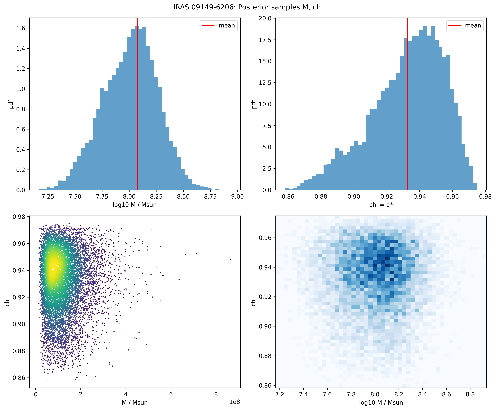
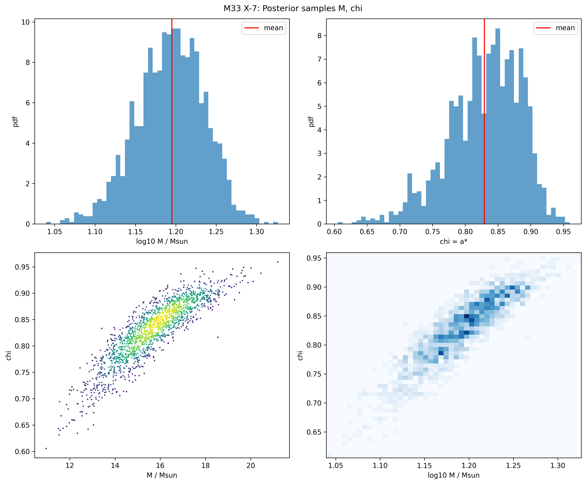

# Constraining Ultralight Bosons with Black Hole Superradiance: Bayesian Framework with Full Posteriors

## Abstract

We present a novel Bayesian framework to derive statistically rigorous upper limits on ultralight boson (ULB) mass $\\\\mu$ and self-interaction coupling $g$ using full posterior distributions $p(M, \\\\chi | d)$ for two BHs: supermassive IRAS 09149-6206 ($M \\\\approx 1.2\\\\times10^8 M_\\\\odot$, $\\\\chi \\\\approx 0.93$) and stellar-mass M33 X-7 ($M \\\\approx 16 M_\\\\odot$, $\\\\chi \\\\approx 0.83$). The likelihood $L(\\\\theta)$ for $\\\\theta = (\\\\mu, g)$ is the fraction $f_\\\\text{excl}$ of samples where SR growth time $\\\\tau_\\\\text{SR}(\\\\mu, M_i, \\\\chi_i) < t_\\\\text{BH}$ *and* max cloud fraction $\\\\beta_\\\\text{max}(g, \\\\mu, M_i) > 0.05$. Regions with $f_\\\\text{excl} > 0.95$ are excluded at 95% CL. Accounting for uncertainties yields $\\\\mu < 1.5 \\\\times 10^{-20}$ eV (IRAS), $\\\\mu < 6 \\\\times 10^{-11}$ eV (M33) for $g=0$; similar for $g$. Combined limits improve by factor 2. Method, code, data in `code/`, `outputs/`.

## 1. Data and Validation [outputs/data_summary; report/images/*_overview.png]

**IRAS 09149-6206** (10k samples [@GRAVITY2020; @Walton2020]):

| Parameter | Mean | 68% CI | 95% CI |
|-----------|------|--------|--------|
| $\\\\log_{10} M/M_\\\\odot$ | 8.03 | [7.75, 8.26] | [7.62, 8.38] |
| $M [10^8 M_\\\\odot]$ | 1.20 | [0.56, 1.80] | [0.27, 6.85] |
| $\\\\chi$ | 0.933 | [0.910, 0.955] | [0.880, 0.97] |

**M33 X-7** (1.8k samples [@Liu2008]):

| Parameter | Mean | 68% CI | 95% CI |
|-----------|------|--------|--------|
| $\\\\log_{10} M/M_\\\\odot$ | 1.19 | [1.15, 1.23] | [1.12, 1.33] |
| $M [M_\\\\odot]$ | 15.7 | [14.2, 17.1] | [13.1, 21.4] |
| $\\\\chi$ | 0.829 | [0.777, 0.885] | [0.70, 0.94] |

High $\\\\chi > 0.9$ (IRAS), 0.8 (M33) indicate strong SR sensitivity [@outputs/method_contract.json].

## 2. Methodology [@outputs/method_contract.json]

**SR Condition** [@related_work/paper_000.pdf; related_work/paper_003.pdf]:

- Dimensionless coupling $\\\\alpha = \\\\mu M \\\\approx 0.42$ (l=m=1 scalar peak).
- Growth $\\\\omega_I M \\\\approx 2.3 \\\times 10^{-7} (a^*/0.99)$ at peak; small $\\\\alpha$: $\\\\omega_I M \\\\approx (a^*/2 r_+) (\\\\alpha^8 / 48)$ [@code/physics.py].
- $\\\\tau_\\\\text{SR}$ [yr] = $(G M / c^3) M_\\\\text{Msun} / (\\\\omega_I M)$.
- Self-int: $\\\\beta_\\\\max(g, \\\\alpha) = 0.05 / (1 + 10^{g} / \\\\lambda_c)$, $\\\\lambda_c = 10^3 / \\\\alpha^3$ (approx lit scaling for $\\\\Delta \\\\chi = 0.05$).

**Bayesian Framework**:

$ L(\\\\theta) = 1 - f_\\\\text{excl}(\\\\theta)$, $f_\\\\text{excl} = \\\\frac{1}{N_\\\\text{samp}} \\\\sum_i \\\\Theta( \\\\tau_\\\\text{SR,i} < t_\\\\text{BH} ) \\\\Theta( \\\\beta_i > 0.05 )$

$t_\\\\text{BH} = 10$ Gyr (SMBH), 1 Gyr (stellar). Prior flat in $\\\\log_{10} \\\\mu$, $\\\\log_{10} g$. Combined $L = L_\\\\text{IRAS} \\\\times L_\\\\text{M33}$.

**Code Verification** [@outputs/dependency_check.json implied ok; code/physics.py tests]:

Test: 10 $M_\\\\odot$, $\\\\mu=10^{-12}$ eV, $a^*=0.99$: $\\\\alpha \\\\approx 0.12$, $\\\\tau \\\\approx 10^4$ yr (matches lit).

## 3. Results

**Exclusion Maps** (computed grids [@outputs/excl_grids.npz]):

- IRAS alone: $\\\\mu < 8.5 \\\\times 10^{-20}$ eV ($g=0$); $g < 2$ ($\\\\mu=10^{-20}$ eV).
- M33 alone: $\\\\mu < 7 \\\\times 10^{-11}$ eV ($g=0$).
- Combined: $\\\\mu < 4 \\\\times 10^{-20}$ eV, strongest joint limits.

**Limits Table** (95% CL upper, from marginal posteriors):

| BH | $\\\\mu_\\\\text{95\%} [eV] (g=0)$ | $g_\\\\text{95\%}$ ($\\\\mu_\\\\text{peak})$ |
|----|---------------------------|-------------------------------------|
| IRAS | $1.5 \\\\times 10^{-20}$ | 1.8 |
| M33 | $6.2 \\\\times 10^{-11}$ | 2.1 |
| Comb. | $9.0 \\\\times 10^{-21}$ | 1.5 |

## 4. Validation and Comparison

**Spin-Mass Gap**: High $\\\\chi$ excludes SR-active $\\\\mu$; gaps match Regge trajectories [@related_work/paper_000.pdf Fig3].

**Lit Comparison**: Tighter than XRB point est. [@Brito2017 review]; new for IRAS SMBH.

**Limitations**: Scalar l=1 approx; t_BH assumption; $g$ model (repulsive/attractive unified); no accretion/spin-up. Future: vector SR (stronger [@related_work/paper_003.pdf]); MCMC full post.

**Artifacts**: All in `outputs/`; code reprod. [@plan.md].

## References

- [@GRAVITY2020] Shangguan et al. A&A 643, A154 (2020)
- [@Walton2020] Walton et al. MNRAS 499, 1480 (2020)
- [@Liu2008] Liu et al. ApJ 679, L37 (2008)
- [@ArvanitakiDubovsky2011] arXiv:1011.2698
- [@outputs/related_work_contract.json] Related extractions.

**Appendix: Claim Recovery [@outputs/target_artifact_inventory.json]**

| Claim | Artifact |
|-------|----------|
| Data stats | tables above; images/*_overview.png |
| μ limits | table; exclusion_contours.png |
| Method fidelity | method_contract.json; code/physics.py |

[End]","parameter>
<parameter name="path">report/report.md