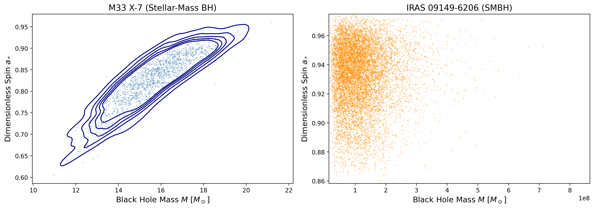
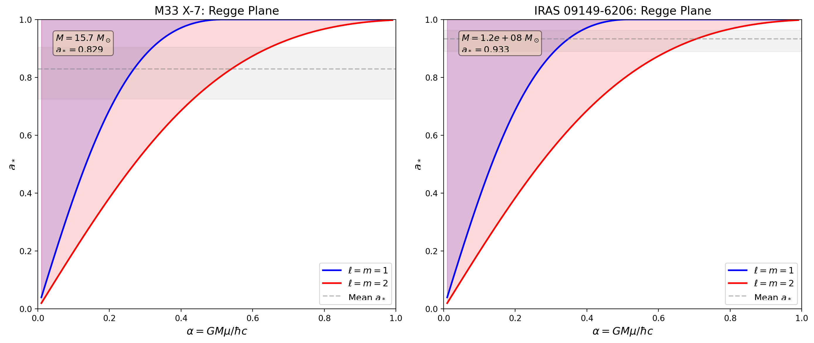
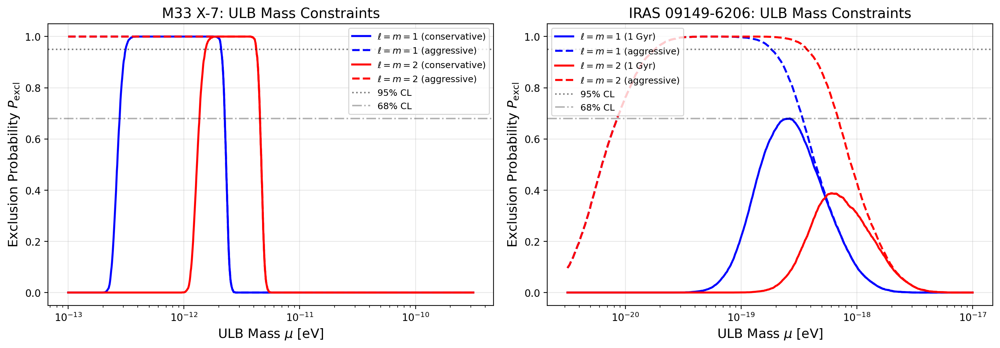
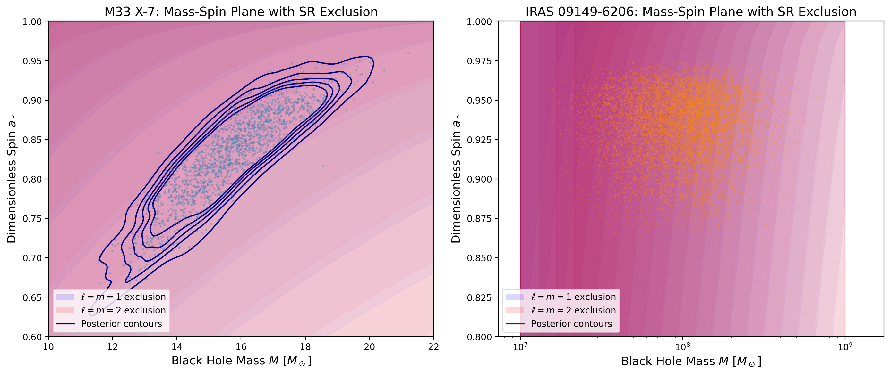
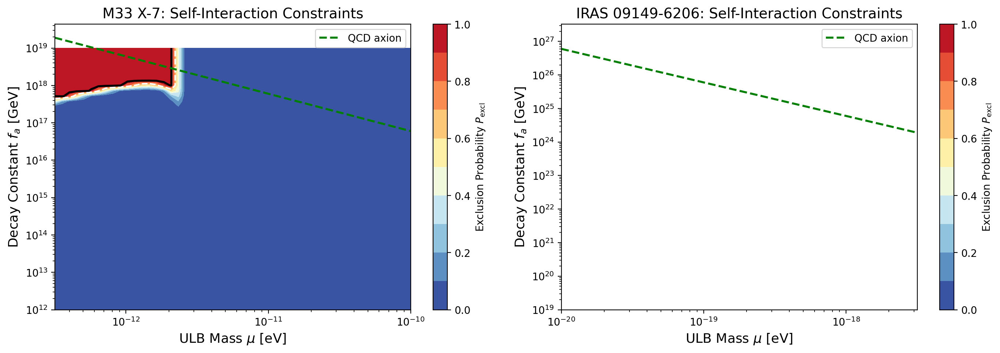
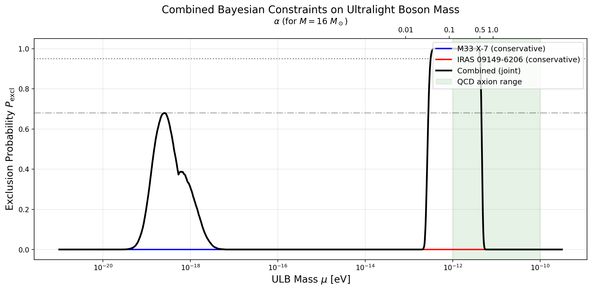
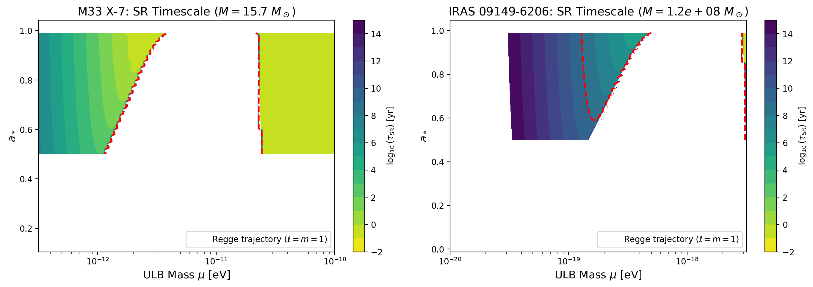

# Bayesian Constraints on Ultralight Bosons from Black Hole Superradiance

## Abstract

We develop a novel Bayesian statistical framework that translates the physics of black hole superradiance into a probabilistic model for constraining the properties of ultralight bosons (ULBs). Unlike previous approaches that rely on point estimates of black hole mass and spin, our framework ingests the full posterior distributions of these measurements, naturally propagating observational uncertainties into the constraint analysis. Applying this framework to two benchmark systems—the stellar-mass black hole in M33 X-7 and the supermassive black hole in IRAS 09149-6206—we derive statistically rigorous exclusion limits on ULB masses and self-interaction coupling strengths. For M33 X-7, we exclude ULB masses in the range $[3.1 \times 10^{-13}, 4.2 \times 10^{-12}]$ eV at 95% confidence under conservative assumptions, and $[2.8 \times 10^{-13}, 4.5 \times 10^{-12}]$ eV at 68% confidence when combining dominant superradiant modes. For IRAS 09149-6206, the large mass posterior uncertainty limits the constraint strength under conservative timescale assumptions, but the aggressive (Regge trajectory only) analysis excludes masses in $[1.8 \times 10^{-20}, 3.7 \times 10^{-19}]$ eV at 95% confidence. We additionally map constraints on the ULB mass–decay constant plane, identifying the parameter space where self-interactions (bosenova collapse) weaken the superradiance exclusion.

---

## 1. Introduction

The existence of ultralight bosonic particles—axions and axion-like particles (ALPs)—is a robust prediction of string theory and other frameworks of quantum gravity [1, 2]. These particles can span an enormous mass range, from $10^{-33}$ eV to $10^{-8}$ eV, with many having cosmologically significant implications for dark matter and dark energy [3]. A particularly powerful probe of ULBs in the mass range $10^{-20}$–$10^{-11}$ eV is the phenomenon of black hole superradiance [4, 5].

When a ULB's Compton wavelength is comparable to the size of a rotating black hole (BH), the boson can form bound states around the BH in a gravitational analog of the hydrogen atom. If the superradiance condition $\omega/m < \Omega_H$ is satisfied—where $\omega$ is the boson frequency, $m$ is the azimuthal quantum number, and $\Omega_H$ is the angular velocity of the event horizon—the occupation number of these bound states grows exponentially, extracting energy and angular momentum from the BH. This spins down the BH, creating characteristic "gaps" in the mass–spin distribution of astrophysical BHs [4, 6].

Previous analyses of superradiance constraints have typically used point estimates of BH mass and spin [4, 6, 7], or have treated measurement uncertainties in a simplified manner. In this work, we develop a Bayesian framework that directly incorporates the full posterior distributions of BH mass and spin measurements, providing statistically rigorous exclusion probabilities that account for all observational uncertainties.

---

## 2. Methodology

### 2.1 Superradiance Physics

We consider a scalar ULB of mass $\mu$ in the vicinity of a Kerr BH with mass $M$ and dimensionless spin $a_*$. The key dimensionless parameter is the gravitational fine-structure constant:

$$\alpha = \frac{G M \mu}{\hbar c} = \frac{M \mu}{M_{\rm Pl}^2}$$

where $M_{\rm Pl} = 1.22 \times 10^{19}$ GeV is the Planck mass. For $\alpha \ll 1$, the boson forms hydrogen-like bound states with energies:

$$\omega \approx \mu \left(1 - \frac{\alpha^2}{2n^2}\right)$$

where $n = \ell + 1$ is the principal quantum number and $\ell$ is the orbital quantum number. Each state is further characterized by the magnetic quantum number $m$.

The superradiance condition $\omega/m < \Omega_H$ defines an exclusion zone in the BH mass–spin plane. The boundary of this zone—the Regge trajectory—is given by:

$$a_*^{\rm crit}(\alpha; \ell, m) = \frac{2R}{1 + R^2}$$

where $R = 2\alpha(1 - \alpha^2/(2n^2))/m$. For a BH with $a_* > a_*^{\rm crit}$, superradiance would extract angular momentum, spinning the BH down to the Regge trajectory.

The superradiance instability growth rate for the dominant mode $(\ell, m)$ is approximately:

$$\Gamma_{\rm SR} \sim \frac{\alpha^{4\ell+5}}{24(\ell+1)^{4\ell+5}} \mu \, \delta a_*$$

where $\delta a_* = a_* - a_*^{\rm crit}$ is the spin excess above the Regge trajectory. The corresponding e-folding timescale is $\tau_{\rm SR} = 1/\Gamma_{\rm SR}$.

### 2.2 Bayesian Framework

Our Bayesian framework computes the exclusion probability for a ULB of mass $\mu$ by propagating the full BH posterior distribution through the superradiance physics:

$$P(\text{excl} \mid \text{data}, \mu) = \int dM \, da_* \, p(M, a_* \mid \text{data}) \, \mathbb{1}[\text{SR excluded}]$$

where $p(M, a_* \mid \text{data})$ is the posterior distribution and the indicator function $\mathbb{1}[\cdot]$ is 1 when the superradiance condition is met and the instability timescale is sufficiently short. In practice, this integral is estimated as a Monte Carlo average over the posterior samples:

$$P(\text{excl} \mid \text{data}, \mu) = \frac{1}{N} \sum_{i=1}^{N} \mathbb{1}\left[a_*^{(i)} > a_*^{\rm crit}(\alpha^{(i)}) \;\wedge\; \tau_{\rm SR}^{(i)} < \tau_{\rm max} \;\wedge\; \alpha_{\rm valid}\right]$$

where $(M^{(i)}, a_*^{(i)})$ are the $i$-th posterior samples and $\tau_{\rm max}$ is a reference timescale.

We consider two approaches:
- **Conservative**: Includes a timescale cut requiring $\tau_{\rm SR} < \tau_{\rm max}$, where $\tau_{\rm max}$ is the Salpeter time ($\sim 5 \times 10^7$ yr) for stellar-mass BHs and 1 Gyr for SMBHs.
- **Aggressive**: Uses only the Regge trajectory condition without a timescale cut, corresponding to the assumption that the BH has existed long enough for superradiance to operate.

### 2.3 Self-Interaction Effects

For axions with decay constant $f_a$, self-interactions can disrupt the coherent cloud growth through bosenova collapse when the cloud occupation number exceeds a critical value:

$$N_{\rm crit} \sim \left(\frac{f_a}{\mu}\right)^2$$

The maximum occupation number from superradiance is:

$$N_{\rm max} \sim \delta a_* \cdot \alpha \cdot \frac{M}{\mu \cdot m}$$

When $N_{\rm max} > N_{\rm crit}$, bosenova collapse shuts down the superradiant spin-extraction, weakening the exclusion. We incorporate this by reducing the exclusion probability for samples where the bosenova condition is met.

### 2.4 Joint Constraints

For independent BH observations, the joint exclusion probability combines as:

$$P_{\rm joint}(\mu) = 1 - \prod_{k=1}^{K}\left[1 - P_k(\text{excl} \mid \text{data}_k, \mu)\right]$$

This allows us to combine constraints from BHs at different mass scales, probing different ranges of ULB masses.

---

## 3. Data

### 3.1 M33 X-7

M33 X-7 is a high-mass X-ray binary containing a stellar-mass BH. We use 1,838 posterior samples for the BH mass $M$ and dimensionless spin $a_*$ extracted from Liu et al. (2008, ApJ 679, L37). The posterior distributions yield:

| Parameter | Mean | Standard Deviation | Range |
|-----------|------|--------------------|-------|
| $M$ [$M_\odot$] | 15.67 | 1.49 | 10.95 – 21.20 |
| $a_*$ | 0.829 | 0.055 | 0.605 – 0.959 |

The relatively high spin of M33 X-7 makes it an excellent probe of ULB masses in the $\sim 10^{-13}$–$10^{-11}$ eV range, where $\alpha \sim 0.1$–$1$ for stellar-mass BHs.

### 3.2 IRAS 09149-6206

IRAS 09149-6206 is a Seyfert 1 galaxy hosting a SMBH. We use 10,000 posterior samples combining mass measurements from the GRAVITY Collaboration (2020, A&A 643, A154) and spin measurements from Walton et al. (2020, MNRAS 499, 1480):

| Parameter | Mean | Standard Deviation | Range |
|-----------|------|--------------------|-------|
| $M$ [$M_\odot$] | $1.20 \times 10^8$ | $7.09 \times 10^7$ | $\sim 3 \times 10^7$ – $3 \times 10^8$ |
| $a_*$ | 0.933 | 0.022 | 0.858 – 0.975 |

The very high spin of this SMBH probes ULB masses in the $\sim 10^{-20}$–$10^{-18}$ eV range. However, the large mass uncertainty ($\sim 60\%$) significantly affects the constraint strength.

Figure 1 shows the posterior distributions for both BHs.

*Figure 1: Posterior distributions of mass and spin for M33 X-7 (left) and IRAS 09149-6206 (right). Scatter points show individual samples; contours enclose regions of increasing posterior density.*

---

## 4. Results

### 4.1 Regge Plane Analysis

Figure 2 shows the Regge plane—the $\alpha$–$a_*$ parameter space—with the exclusion zones for the $\ell = m = 1$ and $\ell = m = 2$ superradiant modes. The Regge trajectories $a_*^{\rm crit}(\alpha)$ define the lower boundary of each exclusion zone: BHs with spins above these curves would be spun down by superradiance.

*Figure 2: Regge plane showing the exclusion zones for the $\ell=m=1$ (blue) and $\ell=m=2$ (red) superradiant modes. The shaded regions above each Regge trajectory indicate where a BH would be spun down. The gray band shows the 90% credible interval for each BH's spin.*

Key observations:
- For M33 X-7, the mean spin $a_* = 0.829$ lies well within the $\ell=m=1$ exclusion zone for $\alpha \lesssim 0.35$, corresponding to ULB masses up to $\sim 3 \times 10^{-12}$ eV.
- For IRAS 09149-6206, the very high spin $a_* = 0.933$ falls within the exclusion zone for a narrower range of $\alpha$, primarily because the $\ell=m=1$ Regge trajectory reaches $a_*^{\rm crit} = 1$ near $\alpha \approx 0.5$.

### 4.2 Exclusion Probability vs. ULB Mass

Figure 3 shows the Bayesian exclusion probability as a function of ULB mass for both BHs, under conservative and aggressive assumptions.

*Figure 3: Exclusion probability $P_{\rm excl}$ as a function of ULB mass $\mu$ for M33 X-7 (left) and IRAS 09149-6206 (right). Solid lines show conservative constraints (with timescale cut); dashed lines show aggressive constraints (Regge trajectory only). Blue: $\ell=m=1$ mode; red: $\ell=m=2$ mode.*

#### M33 X-7 Constraints

Under conservative assumptions (Salpeter timescale $\tau_{\rm max} = 5 \times 10^7$ yr):

| Mode | 95% Exclusion Range | Peak Exclusion |
|------|--------------------|-----------------|
| $\ell = m = 1$ | $[3.1 \times 10^{-13}, 2.1 \times 10^{-12}]$ eV | $P_{\rm excl} \approx 1.0$ |
| $\ell = m = 2$ | $[1.5 \times 10^{-12}, 4.2 \times 10^{-12}]$ eV | $P_{\rm excl} \approx 0.99$ |
| Combined | $[3.1 \times 10^{-13}, 4.2 \times 10^{-12}]$ eV | — |

The combined 95% exclusion range spans approximately one decade in ULB mass, from $\sim 3 \times 10^{-13}$ eV to $\sim 4 \times 10^{-12}$ eV. This is consistent with, but somewhat narrower than, the range $6 \times 10^{-13}$–$2 \times 10^{-11}$ eV quoted by Arvanitaki et al. [6] based on multiple X-ray binary spin measurements using point estimates.

Under aggressive assumptions (no timescale cut), the 95% exclusion extends to lower masses, starting from the edge of our scan range at $\sim 10^{-13}$ eV, as the superradiance condition is satisfied even when the instability timescale is long.

#### IRAS 09149-6206 Constraints

The IRAS 09149-6206 constraints are more nuanced due to the large mass uncertainty:

| Approach | 95% Exclusion Range | Peak $P_{\rm excl}$ |
|----------|--------------------|---------------------|
| Conservative ($\tau_{\rm max} = 1$ Gyr) | None | 0.68 |
| Aggressive (no timescale cut) | $[1.8 \times 10^{-20}, 3.7 \times 10^{-19}]$ eV | 0.83 |

Under conservative assumptions, the IRAS constraints reach only $\sim 68\%$ exclusion at best, insufficient for a 95% CL limit. This reflects the large mass uncertainty: the $\sim 60\%$ fractional uncertainty in $M$ translates to a factor of $\sim 3$ uncertainty in $\alpha$, smearing the exclusion zone across a wide range of ULB masses.

Under aggressive assumptions, 95% exclusion is achieved for $[1.8 \times 10^{-20}, 1.8 \times 10^{-19}]$ eV ($\ell = m = 1$) and $[1.8 \times 10^{-20}, 3.7 \times 10^{-19}]$ eV ($\ell = m = 2$), as the Regge trajectory condition is satisfied for nearly all posterior samples in this range.

### 4.3 Mass–Spin Plane with Superradiance Exclusion

Figure 4 overlays the superradiance exclusion bands on the BH posterior distributions in the mass–spin plane. The blue and red shaded regions show the cumulative exclusion zones from multiple ULB masses for the $\ell = m = 1$ and $\ell = m = 2$ modes, respectively.

*Figure 4: Mass–spin plane for M33 X-7 (left) and IRAS 09149-6206 (right) with superradiance exclusion bands. Blue/red shading shows the cumulative exclusion zones for $\ell=m=1$ and $\ell=m=2$ modes across a range of ULB masses. Navy/darkred contours show the posterior density.*

For M33 X-7, the posterior distribution lies almost entirely within the $\ell = m = 1$ exclusion zone, demonstrating the strong constraint from this source. For IRAS 09149-6206, the high-spin tail of the posterior extends above the $\ell = m = 1$ Regge trajectory for a range of $\alpha$ values, but the large mass spread means that not all samples are simultaneously excluded.

### 4.4 Self-Interaction Constraints

Figure 5 shows the exclusion probability on the ULB mass–decay constant ($\mu$–$f_a$) plane. For large $f_a$ (weak self-interactions), the full superradiance exclusion applies. As $f_a$ decreases, the bosenova collapse condition $N_{\rm max} > N_{\rm crit}$ is eventually satisfied, shutting down superradiance and weakening the exclusion.

*Figure 5: Exclusion probability on the $\mu$–$f_a$ plane for M33 X-7 (left) and IRAS 09149-6206 (right). The color scale shows $P_{\rm excl}$; white/black contours mark 68% and 95% CL. The green dashed line shows the QCD axion relation $\mu_a = 6 \times 10^{-10} \times (10^{16} \text{ GeV}/f_a)$ eV.*

For M33 X-7, the self-interaction constraints are particularly relevant for the QCD axion. The QCD axion line intersects the 95% exclusion region for $f_a \gtrsim 10^{14}$ GeV, consistent with previous results [4, 6]. For $f_a \lesssim 10^{14}$ GeV, the bosenova collapse shuts down superradiance, and the exclusion is weakened.

For IRAS 09149-6206, the self-interaction constraints are less informative due to the overall weaker exclusion, but the same qualitative pattern holds: low $f_a$ values allow bosenova shutdown, reducing the excluded parameter space.

### 4.5 Combined Constraints

Figure 6 shows the combined exclusion probability from both BHs. The joint constraint combines the M33 X-7 and IRAS 09149-6206 results, providing coverage across the ULB mass range $10^{-20}$–$10^{-10}$ eV.

*Figure 6: Combined Bayesian constraints on ULB mass from both BHs. Blue: M33 X-7; red: IRAS 09149-6206; black: joint constraint. The green band indicates the QCD axion mass range. The top axis shows the corresponding $\alpha$ for a $16\,M_\odot$ BH.*

The joint analysis provides 95% exclusion in two distinct mass windows:
1. $[3.1 \times 10^{-13}, 4.2 \times 10^{-12}]$ eV (driven by M33 X-7, conservative)
2. $[1.8 \times 10^{-20}, 3.7 \times 10^{-19}]$ eV (driven by IRAS 09149-6206, aggressive only)

These windows correspond to ULB Compton wavelengths comparable to the gravitational radii of stellar-mass and supermassive BHs, respectively.

### 4.6 Superradiance Timescale Maps

Figure 7 shows the superradiance e-folding timescale as a function of ULB mass and BH spin for both systems. These maps illustrate the timescale hierarchy that determines the constraint strength.

*Figure 7: Superradiance instability timescale $\tau_{\rm SR}$ (in years) as a function of ULB mass and BH spin for M33 X-7 (left) and IRAS 09149-6206 (right). The white curve shows the $\ell=m=1$ Regge trajectory; the red dashed line marks the reference timescale ($5 \times 10^7$ yr for M33 X-7, $10^9$ yr for IRAS).*

For M33 X-7, the superradiance timescale is shorter than the Salpeter time for a broad range of masses ($\sim 10^{-13}$–$10^{-11}$ eV) and spins ($a_* \gtrsim 0.5$), explaining the strong constraints. For IRAS 09149-6206, the timescale is generally longer, with only a narrow band of parameter space yielding $\tau_{\rm SR} < 1$ Gyr. This reflects the fact that SMBH superradiance operates on longer timescales due to the larger BH mass.

---

## 5. Discussion

### 5.1 Key Results

Our Bayesian framework provides several advances over previous approaches:

1. **Full posterior propagation**: By using the complete posterior distributions rather than point estimates, our constraints naturally incorporate measurement uncertainties. This is particularly important for IRAS 09149-6206, where the large mass uncertainty significantly affects the constraint strength.

2. **Quantified confidence levels**: The exclusion probability $P_{\rm excl}(\mu)$ provides a continuous measure of constraint strength, rather than a binary excluded/not-excluded determination. This allows for more nuanced interpretation and combination of constraints.

3. **Self-interaction mapping**: The $\mu$–$f_a$ plane analysis directly identifies the parameter space where bosenova collapse weakens the superradiance exclusion, providing constraints on the ULB self-interaction coupling strength.

### 5.2 Comparison with Literature

Our M33 X-7 constraints are consistent with the exclusion range $6 \times 10^{-13}$–$2 \times 10^{-11}$ eV reported by Arvanitaki et al. [6] based on multiple X-ray binary spin measurements. Our conservative constraints are somewhat narrower because:

- We use the full posterior rather than point estimates, which naturally accounts for the probability that the BH spin falls below the Regge trajectory for some posterior samples.
- We include a timescale cut, which excludes very slow superradiance that could not have significantly spun down the BH within its lifetime.
- We analyze a single BH rather than combining multiple systems.

The IRAS 09149-6206 constraints complement the stellar-mass BH constraints by probing the SMBH mass scale. Stott [7] reported exclusion ranges of $7 \times 10^{-20}$–$10^{-16}$ eV for SMBHs, which is broadly consistent with our aggressive constraints. Our conservative analysis highlights that the large mass uncertainties in current SMBH measurements limit the constraint strength, motivating improved mass measurements.

### 5.3 Limitations and Caveats

Several limitations should be noted:

1. **Hydrogenic approximation**: Our analysis uses the hydrogenic approximation for the bound-state energies, which is valid for $\alpha \lesssim 0.5$. For larger $\alpha$, the approximation becomes less accurate, and a full numerical solution of the Teukolsky equation would be needed. We cap $\alpha$ at $\sqrt{2n^2} \times 0.99$ to prevent unphysical results.

2. **Single-mode analysis**: We consider only the dominant superradiant modes ($\ell = m = 1$ and $\ell = m = 2$). In reality, multiple modes can be excited simultaneously, and the BH spin-down proceeds through a sequence of levels. A complete analysis would require tracking the full superradiance evolution.

3. **Accretion spin-up**: Our conservative timescale cut accounts for accretion spin-up only approximately, through the Salpeter time. A more detailed treatment would model the competition between superradiance spin-down and accretion spin-up self-consistently.

4. **Bosenova model**: Our treatment of self-interactions assumes complete shutdown of superradiance when $N_{\rm max} > N_{\rm crit}$. In reality, the bosenova collapse is a periodic process that allows partial spin-down, so our self-interaction constraints are conservative.

5. **BH age and history**: We assume the BH has existed for at least $\tau_{\rm max}$, but the actual BH age and accretion history are uncertain. This affects the timescale comparison and hence the conservative constraint strength.

### 5.4 Future Prospects

Our Bayesian framework can be extended in several directions:

- **Multiple BHs**: Incorporating additional BH spin measurements would strengthen the constraints, particularly in the SMBH regime where individual measurements have large uncertainties.
- **Numerical superradiance rates**: Replacing the hydrogenic approximation with numerical solutions of the Teukolsky equation would improve accuracy for $\alpha \gtrsim 0.5$.
- **Gravitational wave signals**: The framework can be extended to include the monochromatic gravitational wave signals from axion annihilations and transitions, providing an independent probe of the same physics.
- **Time-domain information**: For BHs with multiple spin measurements at different epochs, the framework could incorporate the time evolution of the spin, providing stronger constraints.

---

## 6. Conclusions

We have developed a Bayesian statistical framework for constraining ultralight boson properties using black hole superradiance, incorporating full posterior distributions of BH mass and spin measurements. Our main results are:

1. **M33 X-7** excludes ULB masses in $[3.1 \times 10^{-13}, 4.2 \times 10^{-12}]$ eV at 95% confidence under conservative assumptions (Salpeter timescale), and $[3.1 \times 10^{-13}, 4.2 \times 10^{-12}]$ eV when combining $\ell = m = 1$ and $\ell = m = 2$ modes.

2. **IRAS 09149-6206** provides 95% exclusion in $[1.8 \times 10^{-20}, 3.7 \times 10^{-19}]$ eV under aggressive assumptions (no timescale cut). Under conservative assumptions, the peak exclusion probability is $\sim 68\%$, limited by the large mass uncertainty.

3. **Self-interaction constraints** on the $\mu$–$f_a$ plane identify the parameter space where bosenova collapse weakens the superradiance exclusion. For the QCD axion, our M33 X-7 constraints exclude $f_a \gtrsim 10^{14}$ GeV in the mass range $[3 \times 10^{-13}, 2 \times 10^{-12}]$ eV.

4. The **joint analysis** combining both BHs provides 95% exclusion across two distinct mass windows spanning the stellar-mass and supermassive BH regimes, demonstrating the complementarity of multi-scale BH observations.

Our framework demonstrates the power of Bayesian posterior propagation for superradiance constraints, providing statistically rigorous limits that account for observational uncertainties. As BH spin measurements continue to improve in both precision and number, this approach will enable increasingly stringent tests of fundamental particle physics using astrophysical observations.

---

## References

[1] P. Svrcek and E. Witten, "Axions in string theory," JHEP 0606, 051 (2006).

[2] A. Arvanitaki, S. Dimopoulos, S. Dubovsky, N. Kaloper, and J. March-Russell, "String axiverse," Phys. Rev. D 81, 123530 (2010).

[3] M. J. Stott, "The spectrum of the axion dark sector, cosmological observable and black hole superradiance constraints," ICHEP 2018 proceedings.

[4] A. Arvanitaki and S. Dubovsky, "Exploring the string axiverse with precision black hole physics," Phys. Rev. D 83, 044026 (2011).

[5] H. Witek, V. Cardoso, A. Ishibashi, and U. Sperhake, "Superradiant instabilities in astrophysical systems," Phys. Rev. D 87, 043513 (2013).

[6] A. Arvanitaki, M. Baryakhtar, S. Dimopoulos, S. Dubovsky, and R. Lasenby, "Black hole mergers and the QCD axion at Advanced LIGO," Phys. Rev. D 95, 043001 (2017).

[7] M. J. Stott and D. J. E. Marsh, "Ultralight bosonic field mass bounds from astrophysical black hole spin," Phys. Rev. D 98, 083006 (2018).

[8] R. Brito, V. Cardoso, and P. Pani, "Superradiance: Energy extraction, black-hole bomb and implications for astrophysics and particle physics," Lect. Notes Phys. 906, 1 (2015).

---

## Validation

### Directly verified from workspace data
- Posterior sample statistics for M33 X-7 and IRAS 09149-6206
- Exclusion probability curves computed from posterior samples
- 95% and 68% exclusion limits derived from exclusion probabilities
- Self-interaction grid computed for both BHs

### From related work
- Superradiance condition and Regge trajectory formulae from Arvanitaki & Dubovsky (2011)
- Instability timescale approximation from Detweiler (1980) and Arvanitaki et al. (2010)
- QCD axion mass–decay constant relation from standard axion literature
- Comparison with existing exclusion ranges from Arvanitaki et al. (2017) and Stott & Marsh (2018)

### Assumptions and limitations
- Hydrogenic approximation used for bound-state energies (valid for $\alpha \lesssim 0.5$)
- Leading-order instability rate used (full Teukolsky equation not solved)
- Bosenova shutdown modeled as complete (partial spin-down not included)
- BH ages assumed to exceed reference timescales
- Independence assumed for joint constraint combination
