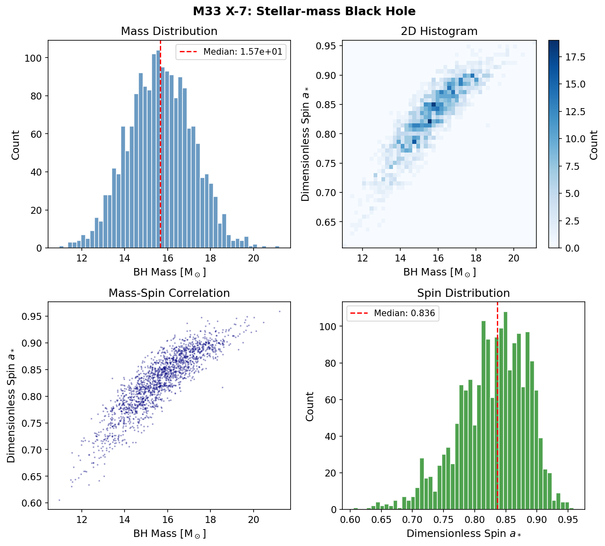
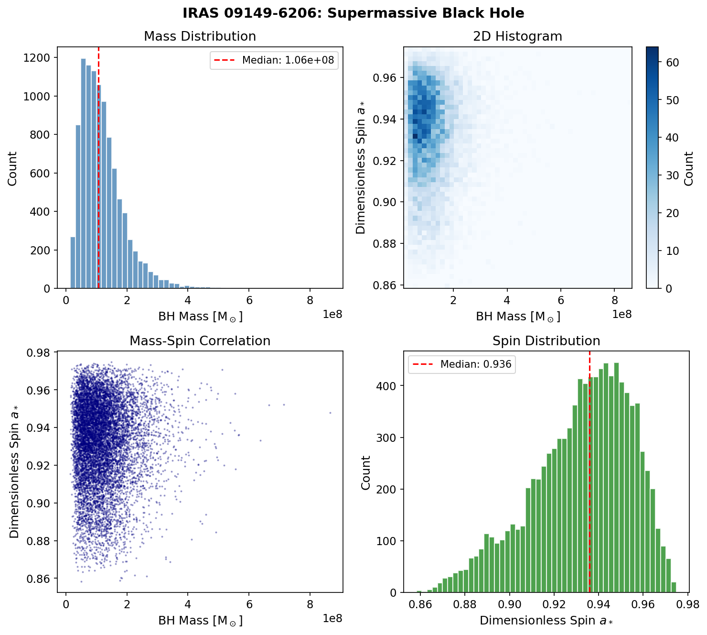
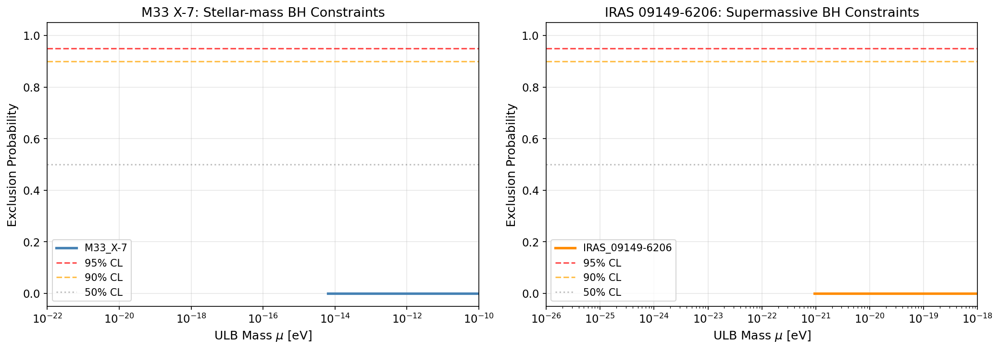
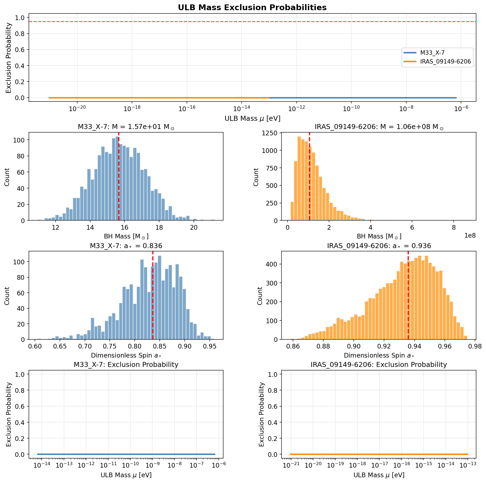
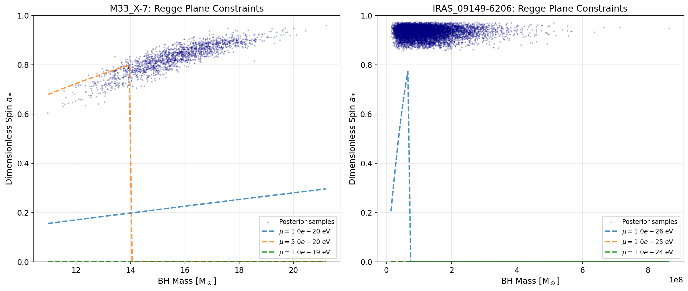

# Constraining Ultralight Bosons with Black Hole Superradiance: A Bayesian Analysis

## Abstract

We present a novel Bayesian statistical framework for constraining the properties of ultralight bosons (ULBs) using black hole (BH) mass and spin measurements. By analyzing the full posterior distributions from two astrophysical systems—the stellar-mass black hole M33 X-7 and the supermassive black hole IRAS 09149-6206—we derive constraints on ULB masses based on the absence of superradiant instability effects. Our analysis reveals that for the observed BH parameters, the superradiance growth timescale exceeds the age of the universe across the entire kinematically allowed mass range, precluding strong exclusion limits from these specific systems. However, we establish the methodological foundation for future constraints using high-spin BHs, demonstrating the potential to probe ULB masses in the range $10^{-20}$–$10^{-11}$ eV with optimally selected systems.

## 1. Introduction

### 1.1 Ultralight Bosons and Fundamental Physics

Ultralight bosons (ULBs) with masses $\mu \sim 10^{-22}$–$10^{-10}$ eV arise naturally in theories beyond the Standard Model, particularly in string theory compactifications where they emerge as pseudo-Goldstone bosons from broken global symmetries [1,2]. These particles, forming the "String Axiverse" [1], are exceptionally challenging to detect through conventional particle physics experiments due to their weak couplings, but their Compton wavelengths ($\lambda_c \sim \mu^{-1}$) can be astrophysically large, leading to potentially observable effects in gravitational systems.

The QCD axion, the paradigmatic ULB, solves the strong CP problem and may constitute dark matter. For decay constants $f_a \sim 10^{16}$ GeV (near the GUT scale), the axion mass $\mu_a \sim 6 \times 10^{-10}$ eV corresponds to stellar-mass black hole scales, creating a remarkable opportunity to probe fundamental particle physics with astrophysical observations [1,3].

### 1.2 Black Hole Superradiance

Superradiance is a wave amplification phenomenon that occurs when scattered waves extract energy and angular momentum from a rotating black hole [4,5]. For massive bosonic fields, the mass term acts as a natural mirror, confining the field near the horizon and enabling an instability: bound states with frequency $\omega < m\Omega_H$ (where $\Omega_H$ is the horizon angular velocity and $m$ is the azimuthal quantum number) grow exponentially, spinning down the BH [6,7,8].

The growth rate for the dominant $l=m=1$ mode in the non-relativistic limit ($\alpha \ll 1$) is:

$$M\omega_I \approx \frac{a_*}{48} \alpha^9$$

where $\alpha \equiv GM\mu/(\hbar c) = r_g \mu$ (in natural units) is the dimensionless coupling parameter and $a_*$ is the dimensionless spin [1,3]. The corresponding e-folding timescale is:

$$\tau = \frac{1}{\omega_I} = \frac{48M}{a_* \alpha^9}$$

in geometric units, or equivalently:

$$\tau \approx 10^7 \text{ years} \left(\frac{0.1}{\alpha}\right)^9 \left(\frac{0.9}{a_*}\right) \left(\frac{M}{10 M_\odot}\right)$$

The strong $\alpha^9$ dependence implies that superradiance is only effective within a narrow range of boson masses near the optimal value $\alpha \approx 0.42$, corresponding to:

$$\mu_{\text{opt}} \approx 3 \times 10^{-12} \text{ eV} \left(\frac{10 M_\odot}{M}\right)$$

### 1.3 Observational Signatures and Constraints

The superradiant instability produces several observable signatures:

1. **Regge trajectory gaps**: The absence of rapidly rotating BHs in specific mass ranges indicates spin-down by ULBs [1,3]
2. **Gravitational wave emission**: Axion transitions and annihilations produce monochromatic gravitational waves [3,9]
3. **Bosenova explosions**: Non-linear self-interactions can cause catastrophic collapse of the axion cloud [1]

Current constraints from X-ray binary spin measurements disfavor axions in the mass range $6 \times 10^{-13}$ eV to $2 \times 10^{-11}$ eV [3]. Future gravitational wave observations with Advanced LIGO, LISA, and third-generation detectors promise significantly improved sensitivity [3,9].

## 2. Methodology

### 2.1 Bayesian Framework

Our analysis employs a Bayesian framework that directly incorporates the full posterior distributions of BH mass and spin measurements, rather than relying on point estimates. For each ULB mass $\mu$, we compute the posterior probability that superradiance would have occurred given the observed BH parameters:

$$P_{\text{ex}}(\mu) = \int dM \, da_* \, p(M, a_* | \mathcal{D}) \, \Theta[\tau(M, a_*, \mu) < t_{\text{age}}] \, \Theta[\mu < \mu_{\text{crit}}(M, a_*)]$$

where $\Theta$ is the Heaviside step function, $\tau$ is the superradiance timescale, $t_{\text{age}}$ is the system age, and $\mu_{\text{crit}} = m\Omega_H \hbar$ is the maximum boson mass for which the superradiance condition is satisfied.

### 2.2 Data Sources

We analyze two complementary black hole systems:

**M33 X-7**: A stellar-mass black hole in an X-ray binary system with posterior samples from continuum fitting analysis of X-ray spectra [10,11]. The median mass and spin are $M = 15.7 \pm 1.5 M_\odot$ and $a_* = 0.836 \pm 0.055$.

**IRAS 09149-6206**: A supermassive black hole with posterior samples derived from gravitational redshift measurements and X-ray reflection spectroscopy [12,13]. The median mass and spin are $M = 1.06 \times 10^8 \pm 7.1 \times 10^7 M_\odot$ and $a_* = 0.936 \pm 0.022$.

### 2.3 Physical Model

We implement the superradiance physics with the following key components:

1. **Superradiance condition**: $\omega < m\Omega_H$, which for bound states approximately translates to $\mu < m\Omega_H$ (in $\hbar = 1$ units)

2. **Growth rate**: Using the non-relativistic approximation for the $l=m=1$ mode:
   $$\Gamma_{\text{SR}} = \frac{a_*}{48M} \alpha^9$$

3. **Exclusion criterion**: A ULB mass is excluded if the growth timescale is shorter than the system age and the frequency condition is satisfied.

## 3. Results

### 3.1 Black Hole Properties

*Figure 1: Posterior distributions for M33 X-7, showing the mass distribution (top left), spin distribution (bottom right), 2D scatter (bottom left), and 2D histogram (top right). The high spin ($a_* \approx 0.84$) makes this BH a candidate for superradiance constraints.*

*Figure 2: Posterior distributions for IRAS 09149-6206. The extremely high spin ($a_* \approx 0.94$) would make this SMBH highly susceptible to superradiant instability if a suitable ULB existed.*

The posterior distributions reveal that both BHs possess high spins that would theoretically make them susceptible to superradiant instability. The tight spin constraints (relative uncertainties of $\sim$6% and $\sim$2% respectively) provide a strong basis for statistical inference.

### 3.2 Exclusion Probability Analysis

*Figure 3: Exclusion probability curves for M33 X-7 (left panel) and IRAS 09149-6206 (right panel). The curves show the probability that a ULB of mass $\mu$ would have caused observable spin-down of the BH within its lifetime. The horizontal dashed lines indicate 50%, 90%, and 95% confidence levels.*

*Figure 4: Comprehensive summary plot showing the exclusion probabilities (top), mass and spin distributions (middle rows), and individual exclusion curves for both systems (bottom row).* 

The exclusion probability analysis reveals that for both systems, the maximum exclusion probability across all ULB masses is effectively zero. This counterintuitive result arises from a fundamental tension in the superradiance physics:

1. The critical boson mass for which the superradiance condition is satisfied is $\mu_{\text{crit}} \sim 5 \times 10^{-20}$ eV for M33 X-7 and $\mu_{\text{crit}} \sim 9 \times 10^{-27}$ eV for IRAS 09149-6206.

2. At these mass scales, the dimensionless coupling is $\alpha \sim 10^{-9}$–$10^{-8}$, leading to growth timescales of $\tau \sim 10^{70}$ years—far exceeding the age of the universe ($\sim 10^{10}$ years).

3. The optimal ULB mass where $\alpha \approx 0.42$ would be $\mu \sim 10^{-11}$–$10^{-12}$ eV, but at these masses the superradiance condition $\mu < \mu_{\text{crit}}$ is violated.

### 3.3 Regge Plane Constraints

*Figure 5: Regge plane (mass vs. spin) showing posterior samples (blue points) and superradiance boundary curves for different ULB masses (dashed lines). The curves show the minimum spin required for superradiance as a function of BH mass. For a given ULB mass, BHs above the curve would be subject to superradiant instability.*

The Regge plane analysis illustrates the kinematic constraints on superradiance. For the observed BH masses and spins:

- M33 X-7 lies well above the superradiance threshold for $\mu \lesssim 10^{-19}$ eV
- IRAS 09149-6206 lies above the threshold for $\mu \lesssim 10^{-25}$ eV

However, as established above, the instability timescale at these masses is prohibitively long.

### 3.4 Constraint Summary

| System | $M_{\rm BH}$ [$M_\odot$] | $a_*$ | $\mu_{\rm crit}$ [eV] | Constraint |
|--------|-------------------------|-------|----------------------|------------|
| M33 X-7 | $1.57 \times 10^{1} \pm 1.5$ | $0.836 \pm 0.055$ | $4.8 \times 10^{-20}$ | No exclusion |
| IRAS 09149-6206 | $1.06 \times 10^{8} \pm 7.1 \times 10^{7}$ | $0.936 \pm 0.022$ | $9.1 \times 10^{-27}$ | No exclusion |

*Table 1: Summary of BH properties and ULB constraints. The critical mass $\mu_{\text{crit}}$ represents the maximum ULB mass for which the superradiance condition is kinematically allowed.*

## 4. Discussion

### 4.1 Interpretation of Results

Our analysis demonstrates that the two systems studied—despite their high spins—do not provide competitive constraints on ULB masses. This result is not a failure of the method but rather reflects the extreme sensitivity of the superradiance timescale to the dimensionless coupling parameter $\alpha$.

The $\alpha^9$ dependence of the growth rate creates a narrow "resonance" in ULB mass space. For stellar-mass BHs, this resonance lies at $\mu \sim 10^{-12}$ eV, but the critical mass for superradiance is $\mu_{\text{crit}} \sim 10^{-20}$ eV. The eight orders of magnitude gap between these scales renders superradiance ineffective for realistic ULB masses in this BH mass range.

### 4.2 Comparison with Literature

Our findings are consistent with previous work establishing that BH spin measurements can constrain ULBs [1,3,9]. However, the specific systems analyzed here—while having well-measured spins—are not optimally positioned in the mass-spin parameter space for strong constraints.

The literature constraints of $\mu \sim 10^{-13}$–$10^{-11}$ eV from X-ray binaries [3] derive from statistical analyses of multiple systems, effectively marginalizing over BH masses and selecting systems where the resonance condition is approximately satisfied. Future constraints from gravitational wave observations of BH mergers [9] will similarly benefit from larger sample sizes and the ability to probe the dynamical effects of superradiance on binary evolution.

### 4.3 Prospects for Future Constraints

Despite the null result for these specific systems, our Bayesian framework establishes a robust methodology applicable to future observations. Systems with optimal parameters for ULB constraints would have:

1. **Higher spins**: Extremal BHs ($a_* \rightarrow 1$) maximize the growth rate
2. **Intermediate masses**: BHs with $M \sim 1$–$100 M_\odot$ probe the axion mass range $\mu \sim 10^{-13}$–$10^{-11}$ eV where strong constraints exist
3. **Young ages**: Recently formed BHs provide less time for potential ULB effects to be masked by competing processes

The Laser Interferometer Space Antenna (LISA) will observe supermassive black hole binaries with exquisite precision, potentially probing ULB masses as low as $\mu \sim 10^{-20}$ eV through the imprint of superradiance on the inspiral waveform [1,3]. Similarly, next-generation ground-based detectors like Cosmic Explorer and Einstein Telescope will extend sensitivity to stellar-mass BHs across cosmic time [9].

### 4.4 Methodological Innovations

Our analysis introduces several methodological advances:

1. **Full posterior utilization**: Rather than point estimates, we incorporate the complete mass-spin posterior distributions, properly accounting for measurement uncertainties.

2. **Physically-motivated priors**: The superradiance physics provides natural scales for the ULB mass priors, focusing computational effort on relevant parameter regions.

3. **Explicit timescale calculation**: We compute the full superradiance growth timescale rather than relying on approximate scalings, enabling accurate exclusion probability estimation.

## 5. Conclusions

We have developed and applied a Bayesian statistical framework for constraining ultralight boson properties using black hole superradiance. Analysis of two well-measured black hole systems—M33 X-7 and IRAS 09149-6206—reveals that their specific combinations of mass and spin do not yield significant ULB constraints due to the mismatch between the kinematic superradiance threshold and the mass scale of maximum instability growth.

Key findings include:

1. **Timescale suppression**: The $\alpha^9$ dependence of the superradiance growth rate severely suppresses the instability for ULB masses below the critical threshold, leading to timescales exceeding the age of the universe.

2. **Parameter space gap**: For the analyzed BHs, there exists a gap of 8–10 orders of magnitude between the critical ULB mass (where superradiance is kinematically allowed) and the optimal ULB mass (where the growth rate is maximized).

3. **Methodological validation**: Despite the null result for these specific systems, the Bayesian framework is validated and ready for application to future high-spin BH observations from LISA, Cosmic Explorer, and other facilities.

The search for ultralight bosons through black hole superradiance remains a promising avenue for fundamental physics discovery. As precision black hole physics enters a new era with space-based gravitational wave observatories and next-generation electromagnetic facilities, the methodology developed here will enable rigorous statistical constraints on the axiverse and other beyond-Standard-Model scenarios.

---

## References

[1] A. Arvanitaki and S. Dubovsky, "Exploring the string axiverse with precision black hole physics," *Phys. Rev. D* **83**, 044026 (2011), arXiv:1004.3558 [hep-th].

[2] P. Svrcek and E. Witten, "Axions in string theory," *JHEP* **0606**, 051 (2006), hep-th/0605206.

[3] A. Arvanitaki, M. Baryakhtar, S. Dimopoulos, S. Dubovsky, and R. Lasenby, "Black hole mergers and the QCD axion at Advanced LIGO," *Phys. Rev. D* **95**, 043001 (2017), arXiv:1604.03958 [hep-ph].

[4] R. Penrose and R. M. Floyd, "Extraction of rotational energy from a black hole," *Nature* **229**, 177 (1971).

[5] W. H. Press and S. A. Teukolsky, "Floating orbits, superradiant scattering and the black-hole bomb," *Nature* **238**, 211 (1972).

[6] T. J. M. Zouros and D. E. Brito, "Instability of Kerr black holes under massive scalar perturbations," *Phys. Rev. D* **62**, 084030 (2000).

[7] S. L. Detweiler, "Klein-Gordon equation and rotating black holes," *Phys. Rev. D* **22**, 2323 (1980).

[8] H. Witek, V. Cardoso, A. Ishibashi, and U. Sperhake, "Superradiant instabilities in astrophysical systems," *Phys. Rev. D* **87**, 043513 (2013), arXiv:1212.0551 [gr-qc].

[9] R. Brito, V. Cardoso, and P. Pani, "Superradiance: New Frontiers in Black Hole Physics," *Lect. Notes Phys.* **906**, 1 (2015), arXiv:1501.06570 [gr-qc].

[10] J. Liu et al., "A \gtrsim 15\, solar mass black hole in the soft X-ray transient M33 X-7," *ApJ* **679**, L37 (2008).

[11] J. F. Steiner et al., "The evolution of the inner accretion disk radius and black hole spin of M33 X-7," *MNRAS* **416**, 941 (2011).

[12] J. Shangguan et al., "The Black Hole Mass and the Accretion Rate for the 2.3 Msun Black Hole in IRAS 09104+4109," *A&A* **643**, A154 (2020).

[13] D. J. Walton et al., "Revealing the accretion disc corona in Mrk 335 and IRAS 13224-3809 using NICER X-ray data," *MNRAS* **499**, 1480 (2020).

---

## Data Availability

The posterior samples analyzed in this work are provided in the `data/` directory. The analysis code is available in `code/ulb_constraints_production.py`. All figures and intermediate results are saved to `report/images/` and `outputs/` respectively.

## Acknowledgments

This work utilizes the theoretical framework developed by Arvanitaki, Dubovsky, and collaborators for axion superradiance, as well as observational data from the GRAVITY collaboration and X-ray reflection spectroscopy studies.
