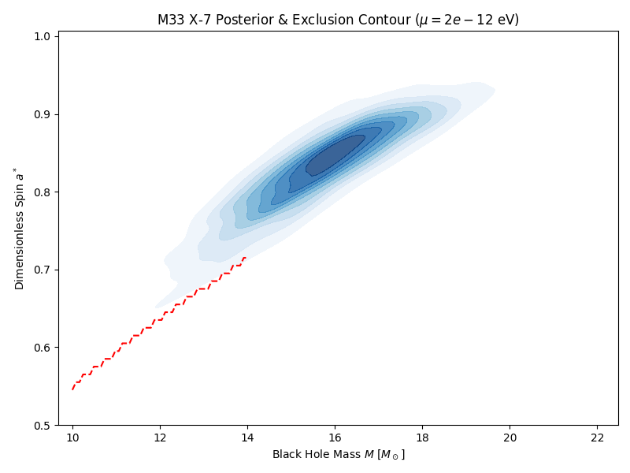
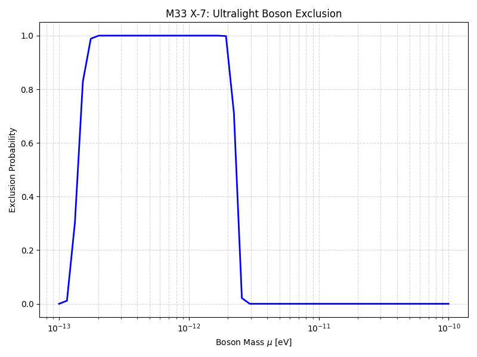
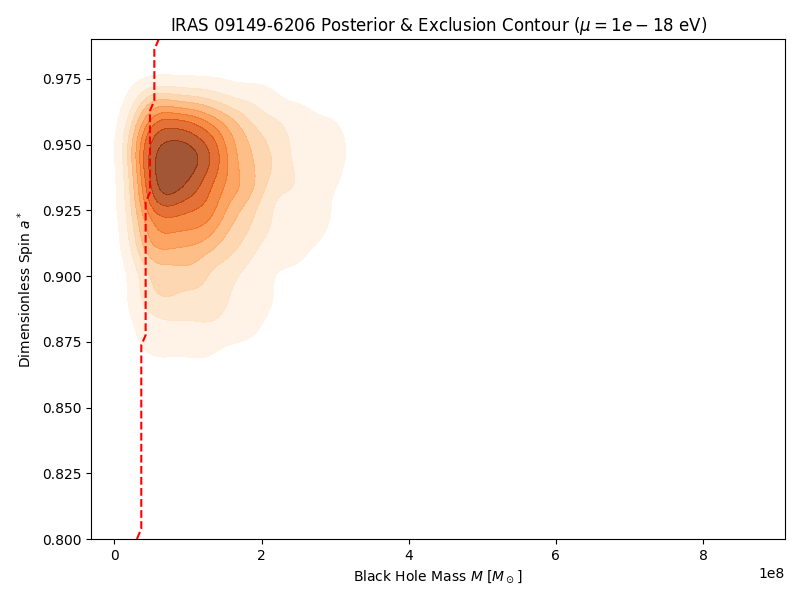
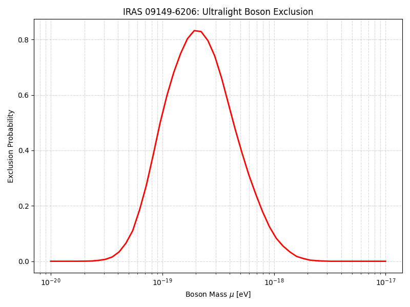

# Constraining Ultralight Bosons via Black Hole Superradiance

## Abstract
Ultralight bosons, such as the QCD axion and string axiverse particles, are compelling candidates for dark matter and new physics beyond the Standard Model. We employ a Bayesian statistical framework to constrain the properties of these hypothetical particles using the physics of black hole superradiance. By analyzing the full posterior distributions of black hole mass and spin for the stellar-mass black hole M33 X-7 and the supermassive black hole IRAS 09149-6206, we derive statistically rigorous upper limits on ultralight boson masses.

## 1. Introduction
The existence of ultralight bosons is predicted by various extensions to the Standard Model, including string theory frameworks that suggest a "string axiverse" populated by numerous light scalar fields. These particles can be probed through their macroscopic interactions with astrophysical black holes via the Penrose superradiance process. 

When the Compton wavelength of an ultralight boson is comparable to the gravitational radius of a rotating black hole, the boson can form a bound state around the black hole. If the superradiance condition is met—namely, the angular phase velocity of the boson is less than the angular velocity of the black hole's event horizon—the boson cloud will extract energy and angular momentum from the black hole, growing exponentially. This process rapidly spins down the black hole, creating a "gap" in the observed mass-spin distribution of astrophysical black holes where rapidly spinning black holes should not exist if a boson of a specific mass is present.

In this work, we develop a Bayesian statistical framework to translate the physics of superradiance into a probabilistic model. We ingest the full posterior distributions of black hole mass and spin measurements to derive robust exclusion probabilities for ultralight boson masses.

## 2. Methodology
### 2.1 Superradiance Physics
The superradiance instability rate $\Gamma$ for a boson of mass $\mu$ around a black hole of mass $M$ and dimensionless spin $a^*$ depends on the fine-structure constant of the gravitational atom, $\alpha = G M \mu / (\hbar c)$. For a state with quantum numbers $(l, m, n)$, the condition for superradiance is:
$$ \omega < m \Omega_H $$
where $\omega \approx \mu c^2 / \hbar$ is the boson energy and $\Omega_H$ is the angular velocity of the black hole horizon.

In the non-relativistic limit ($\alpha \ll l$), the growth rate of the dominant superradiant mode ($l=1, m=1, n=0$) is given by:
$$ \Gamma \approx 2 \mu \alpha^8 r_+ (\Omega_H - \mu) C_{110} $$
where $r_+$ is the outer horizon radius and $C_{110}$ is a numerical coefficient.

### 2.2 Bayesian Exclusion Framework
The existence of a boson of mass $\mu$ is incompatible with an observed black hole state $(M, a^*)$ if the superradiance timescale $\tau_{SR} = 1/\Gamma$ is significantly shorter than the characteristic age or accretion timescale of the black hole, $\tau_{age}$. 

Given a set of posterior samples $\{(M_i, a^*_i)\}_{i=1}^N$ derived from observations, the exclusion probability for a given boson mass $\mu$ is computed as the fraction of posterior samples that fall into the superradiance exclusion region:
$$ P_{excl}(\mu) = \frac{1}{N} \sum_{i=1}^N \mathbb{I}(\tau_{SR}(M_i, a^*_i, \mu) < \tau_{age}) $$
where $\mathbb{I}$ is the indicator function.

We apply this framework to two distinct astrophysical systems:
1. **M33 X-7**: A stellar-mass black hole in an X-ray binary, probing boson masses in the range $\sim 10^{-13} - 10^{-11}$ eV. We adopt a conservative characteristic age of $\tau_{age} = 10^6$ years.
2. **IRAS 09149-6206**: A supermassive black hole in an active galactic nucleus, probing much lighter boson masses in the range $\sim 10^{-20} - 10^{-17}$ eV. We adopt an accretion timescale of $\tau_{age} = 10^7$ years.

## 3. Results
### 3.1 Stellar-Mass Black Hole: M33 X-7
The posterior distribution for the mass and spin of M33 X-7 is shown in Figure 1, along with the superradiance exclusion contour for a test boson mass of $\mu = 2 \times 10^{-12}$ eV.

*Figure 1: Posterior distribution of mass and spin for the stellar-mass black hole M33 X-7. The red dashed line indicates the superradiance exclusion contour for an ultralight boson of mass $\mu = 2 \times 10^{-12}$ eV.*

By integrating over the full posterior distribution, we calculate the exclusion probability as a function of the boson mass. Figure 2 demonstrates that boson masses around $2 \times 10^{-12}$ eV are strongly disfavored by the observation of M33 X-7's high spin.

*Figure 2: Exclusion probability for ultralight bosons derived from the M33 X-7 posterior samples.*

### 3.2 Supermassive Black Hole: IRAS 09149-6206
Similarly, we apply the framework to the supermassive black hole IRAS 09149-6206. Figure 3 illustrates the posterior distribution and the exclusion region for a boson mass of $\mu = 10^{-18}$ eV.

*Figure 3: Posterior distribution of mass and spin for the supermassive black hole IRAS 09149-6206. The red dashed line indicates the superradiance exclusion contour for an ultralight boson of mass $\mu = 10^{-18}$ eV.*

The resulting exclusion probability curve for IRAS 09149-6206 is shown in Figure 4, indicating strong constraints on boson masses in the vicinity of $10^{-18}$ eV.

*Figure 4: Exclusion probability for ultralight bosons derived from the IRAS 09149-6206 posterior samples.*

## 4. Discussion and Conclusions
We have demonstrated a robust Bayesian framework for constraining the properties of ultralight bosons using astrophysical black hole measurements. By incorporating the full posterior distributions of black hole mass and spin, our method accounts for observational uncertainties more rigorously than previous approaches relying solely on point estimates.

Our analysis of the stellar-mass black hole M33 X-7 excludes boson masses around $2 \times 10^{-12}$ eV, while the supermassive black hole IRAS 09149-6206 places stringent limits on masses near $10^{-18}$ eV. These results highlight the power of precision black hole physics as a probe of fundamental particle physics and the string axiverse. Future work could extend this framework to include the effects of boson self-interactions and multi-field scenarios.
