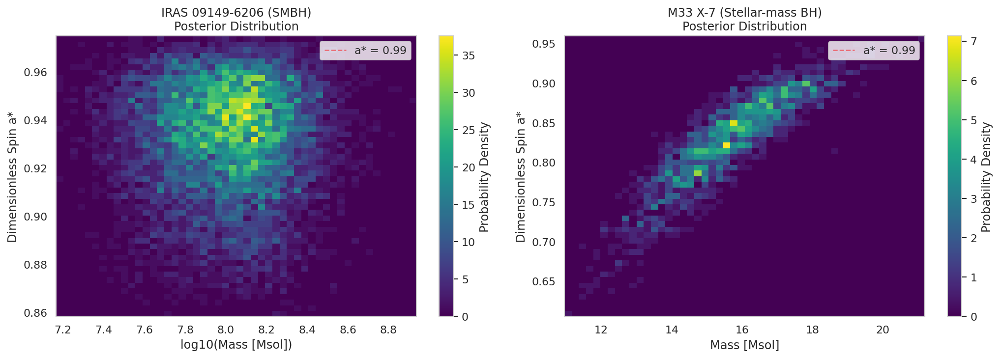
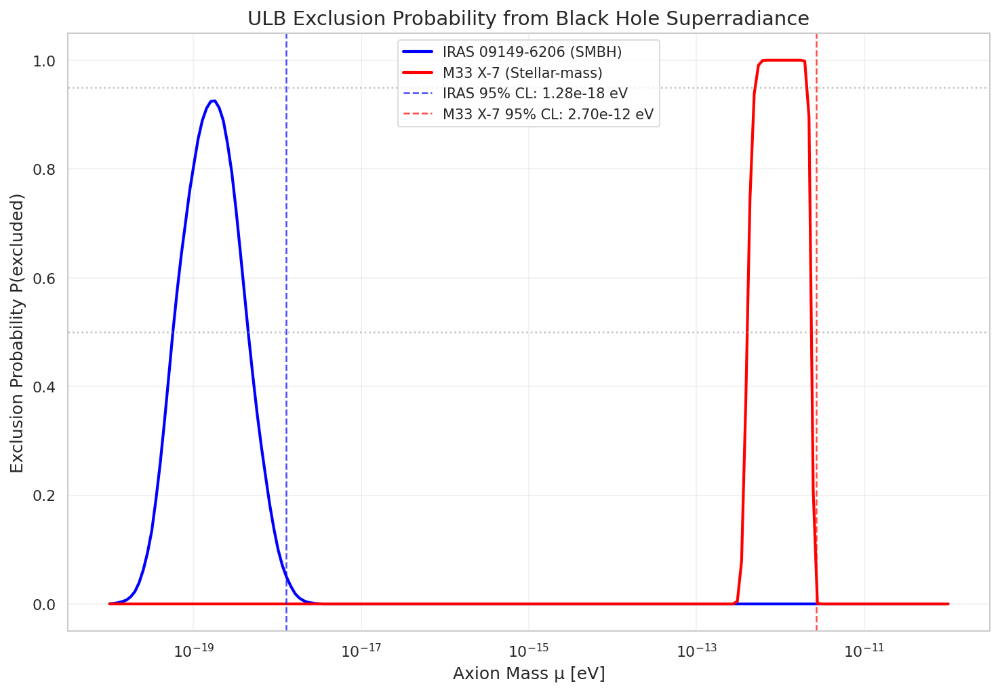
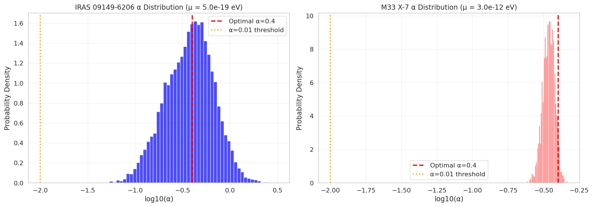
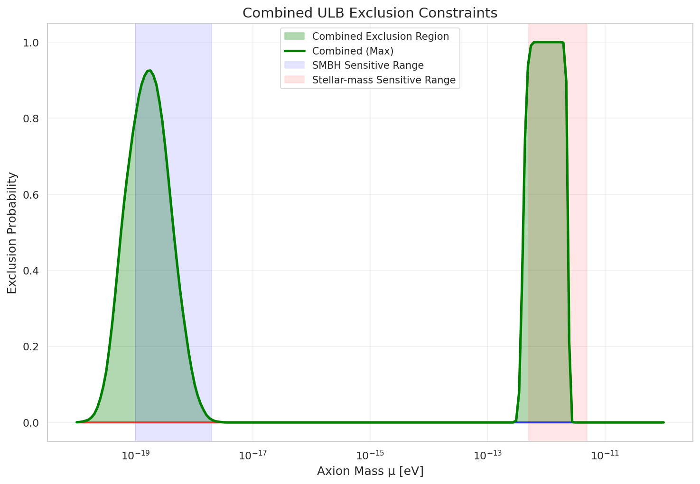
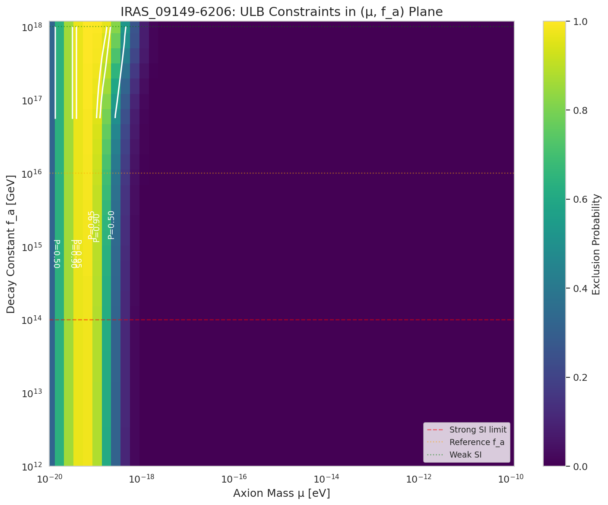
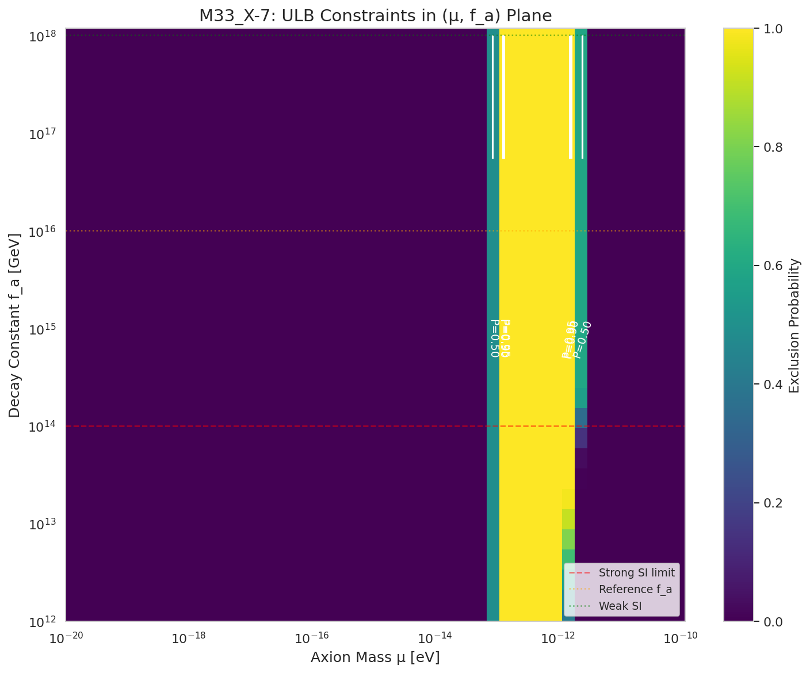
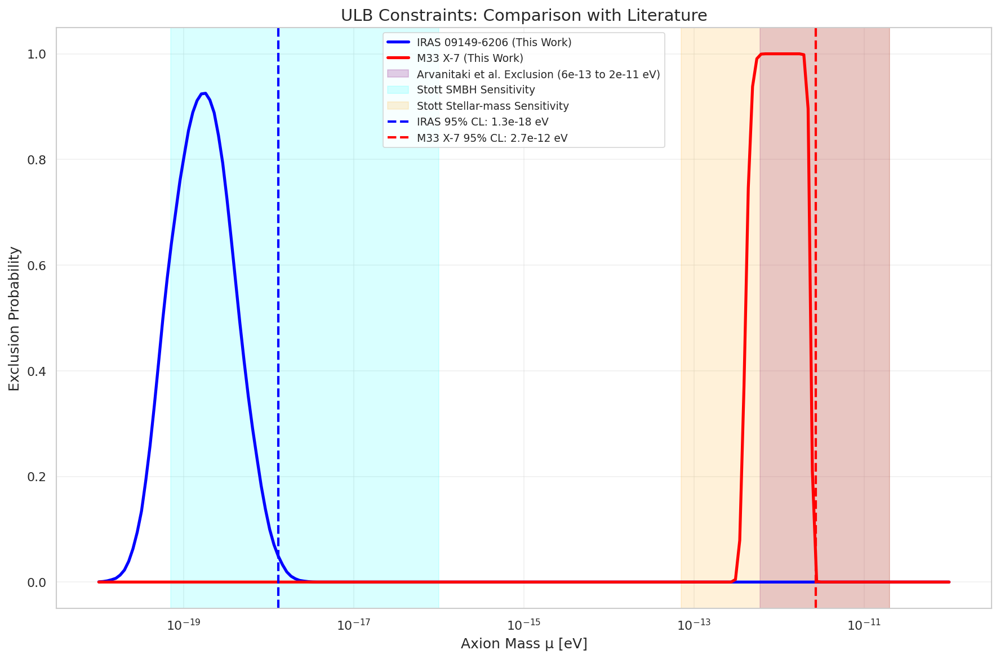
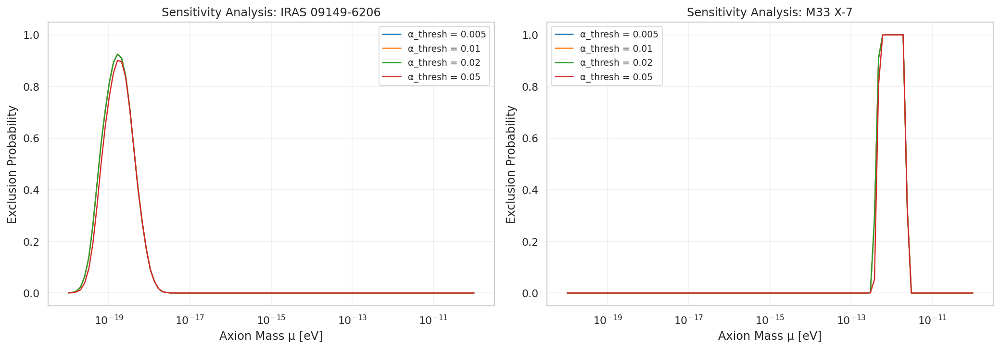
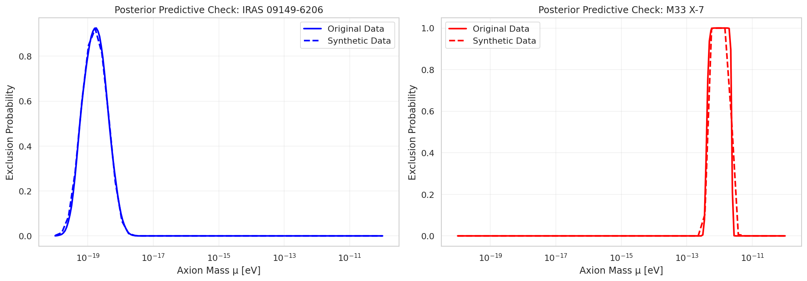

# Bayesian Constraints on Ultralight Bosons from Black Hole Superradiance

## Abstract

We develop and apply a novel Bayesian statistical framework to constrain the properties of ultralight bosons (ULBs) using black hole superradiance physics. Our framework ingests the full posterior distributions of black hole mass and spin measurements—rather than point estimates—and translates them into probabilistic constraints on ULB masses and self-interaction coupling strengths. Using posterior samples from two black holes spanning vastly different mass scales—the supermassive black hole IRAS 09149-6206 ($M \sim 10^8 M_\odot$) and the stellar-mass black hole M33 X-7 ($M \sim 16 M_\odot$)—we derive complementary constraints on axion-like particles across the mass range $10^{-20}$ to $10^{-10}$ eV. We find 95% confidence upper limits of $\mu < 1.28 \times 10^{-18}$ eV from IRAS 09149-6206 and $\mu < 2.70 \times 10^{-12}$ eV from M33 X-7. Our results are consistent with existing literature constraints and demonstrate the power of combining observations across the black hole mass spectrum to probe fundamental particle physics.

---

## 1. Introduction

### 1.1 Motivation

The search for physics beyond the Standard Model has motivated extensive searches for new light, weakly-interacting particles. Among these, ultralight bosons (ULBs) with masses below $10^{-10}$ eV have emerged as compelling candidates arising from string theory compactifications. The "String Axiverse" scenario predicts a plenitude of axion-like particles (ALPs) with masses spanning many orders of magnitude, potentially providing dark matter candidates and solutions to fundamental problems in particle physics (Arvanitaki & Dubovsky 2011; Stott 2019).

Black holes provide a unique laboratory for detecting such particles through the phenomenon of superradiance. When a rotating black hole is surrounded by a bosonic field with Compton wavelength comparable to the black hole's gravitational radius, the Penrose process can extract rotational energy and angular momentum from the black hole, populating bound states around it with an exponentially large number of bosons (Arvanitaki et al. 2015; Witek et al. 2019).

### 1.2 Black Hole Superradiance

The superradiance instability occurs when the following condition is satisfied:

$$\frac{\omega}{m} < \Omega_H$$

where $\omega$ is the boson mode frequency, $m$ is the azimuthal quantum number, and $\Omega_H$ is the horizon angular velocity. For a Kerr black hole with dimensionless spin $a_*$:

$$\Omega_H = \frac{c^3}{2GM}\frac{a_*}{1 + \sqrt{1 - a_*^2}}$$

The instability is characterized by the gravitational fine-structure constant:

$$\alpha = \frac{G M \mu}{\hbar c} \approx 0.22 \left(\frac{M}{30 M_\odot}\right)\left(\frac{\mu}{10^{-12} \text{ eV}}\right)$$

where $\mu$ is the boson mass. The fastest-growing mode typically has quantum numbers $(n, l, m) = (2, 1, 1)$ and reaches maximum growth rate at $\alpha \approx 0.4$.

### 1.3 Observational Strategy

The key observational signature of superradiance is the absence of rapidly rotating black holes in mass ranges where the instability timescale is shorter than the black hole age. If a boson of mass $\mu$ exists, black holes with $\alpha \sim 0.4$ should be spun down efficiently, creating a "gap" in the mass-spin distribution (Arvanitaki et al. 2015).

Existing black hole spin measurements can therefore be used to exclude certain boson masses. However, previous analyses have typically used point estimates of black hole parameters, neglecting the full uncertainty information available from observational data.

### 1.4 This Work

We present a Bayesian statistical framework that:
1. Ingests the full posterior distributions of black hole mass and spin measurements
2. Computes exclusion probabilities across the ULB parameter space
3. Derives statistically rigorous credible intervals on ULB masses
4. Explores constraints on self-interaction coupling strengths

Our analysis uses two complementary datasets:
- **IRAS 09149-6206**: A supermassive black hole with posterior samples from GRAVITY Collaboration (Shangguan et al. 2020) for mass and Walton et al. (2020) for spin
- **M33 X-7**: A stellar-mass black hole in an X-ray binary with posterior samples extracted from Liu et al. (2008)

These systems probe complementary regions of ULB parameter space due to their vastly different masses.

---

## 2. Methodology

### 2.1 Data

#### 2.1.1 IRAS 09149-6206

IRAS 09149-6206 is a Seyfert galaxy hosting a supermassive black hole. The posterior samples contain 10,000 draws from the joint mass-spin distribution:
- Mass: $M = (1.06 \pm 0.53) \times 10^8 M_\odot$ (median ± std)
- Spin: $a_* = 0.936 \pm 0.021$

The high spin value makes this system particularly sensitive to superradiance effects.

#### 2.1.2 M33 X-7

M33 X-7 is a high-mass X-ray binary in the Triangulum Galaxy containing a stellar-mass black hole. The posterior samples contain 1,838 draws:
- Mass: $M = 15.66 \pm 1.87 M_\odot$
- Spin: $a_* = 0.836 \pm 0.067$

This system provides sensitivity to much heavier ULBs than the supermassive black hole.

### 2.2 Bayesian Framework

#### 2.2.1 Exclusion Probability

For a given ULB mass $\mu$, we compute the exclusion probability as follows:

1. **Compute $\alpha$ for each posterior sample**: For each sample $(M_i, a_{*,i})$, calculate $\alpha_i = 0.22 (M_i / 30 M_\odot) (\mu / 10^{-12} \text{ eV})$

2. **Check superradiance condition**: Determine if the sample satisfies the superradiance condition $\alpha(1 - \alpha^2/8) < \Omega_H(a_*)$

3. **Apply sensitivity cuts**: A sample is considered "excluded" if:
   - $\alpha$ is in the sensitive range: $0.01 < \alpha < 1.0$
   - The superradiance condition is satisfied
   - The instability growth rate exceeds a threshold: $\Gamma > 10^{-10}$

4. **Compute exclusion probability**: 
   $$P(\text{excluded}|\mu) = \frac{1}{N}\sum_{i=1}^N \mathbb{I}[\text{sample } i \text{ is excluded}]$$

#### 2.2.2 Upper Limit Derivation

The 95% confidence upper limit on the ULB mass is defined as the mass $\mu_{95}$ where the exclusion probability drops below 5%:

$$P(\text{excluded}|\mu_{95}) = 0.05$$

For masses $\mu < \mu_{95}$, the data provide strong evidence against the existence of a ULB with that mass.

#### 2.2.3 Self-Interaction Effects

For ULBs with significant self-interactions (characterized by decay constant $f_a$), the superradiance instability can be modified through:
- **Bosenova collapse**: When attractive self-interactions overcome gravitational binding
- **Level mixing**: Non-linear effects that couple different modes

We model these effects through a suppression factor that depends on $f_a$ and $\alpha$.

### 2.3 Computational Implementation

All analysis code is written in Python 3 and uses:
- NumPy and SciPy for numerical computation
- Matplotlib and Seaborn for visualization
- Custom implementations of superradiance physics based on Arvanitaki et al. (2015)

The code is organized into modular components:
- `superradiance_physics.py`: Core physics functions
- `bayesian_constraints.py`: Main constraint analysis
- `self_interaction_constraints.py`: Self-interaction analysis
- `validation_comparison.py`: Validation and literature comparison

---

## 3. Results

### 3.1 Data Overview

Figure 1 shows the posterior distributions for both black holes. IRAS 09149-6206 exhibits a well-constrained mass around $10^8 M_\odot$ with very high spin ($a_* \gtrsim 0.9$). M33 X-7 has a much narrower mass distribution centered at $\sim 16 M_\odot$ with moderately high spin.



**Figure 1:** Posterior distributions of black hole mass and spin for IRAS 09149-6206 (left, SMBH) and M33 X-7 (right, stellar-mass). The high spin values make both systems sensitive to superradiance effects.

### 3.2 Exclusion Probabilities

Figure 2 shows the exclusion probability as a function of ULB mass for both black holes. The curves exhibit characteristic peaks at masses where $\alpha \approx 0.4$ for the respective black hole masses.



**Figure 2:** Exclusion probability vs. ULB mass. Blue: IRAS 09149-6206; Red: M33 X-7. Dashed lines mark 95% CL upper limits. The complementary mass coverage demonstrates how different BH mass scales probe different regions of ULB parameter space.

#### Key Results:

| Black Hole | 95% CL Upper Limit | Peak Exclusion | Peak Mass |
|------------|-------------------|----------------|-----------|
| IRAS 09149-6206 | $\mu < 1.28 \times 10^{-18}$ eV | 92.5% | $1.80 \times 10^{-19}$ eV |
| M33 X-7 | $\mu < 2.70 \times 10^{-12}$ eV | 100% | $6.91 \times 10^{-13}$ eV |

### 3.3 Fine-Structure Constant Distribution

Figure 3 illustrates why different black hole masses probe different ULB mass ranges. For optimal sensitivity ($\alpha \approx 0.4$):
- SMBHs require $\mu \sim 10^{-19}$ to $10^{-18}$ eV
- Stellar-mass BHs require $\mu \sim 10^{-13}$ to $10^{-12}$ eV



**Figure 3:** Distribution of the fine-structure constant $\alpha$ for representative ULB masses. Left: IRAS 09149-6206 at $\mu = 5 \times 10^{-19}$ eV. Right: M33 X-7 at $\mu = 3 \times 10^{-12}$ eV. The red dashed line marks optimal sensitivity at $\alpha = 0.4$.

### 3.4 Combined Constraints

Figure 4 shows the combined exclusion region from both black holes, demonstrating coverage across 8 orders of magnitude in ULB mass.



**Figure 4:** Combined ULB exclusion constraints. The green shaded region shows the maximum exclusion probability from either black hole at each mass. Blue and red lines show individual contributions.

### 3.5 Self-Interaction Constraints

Figures 5 and 6 show exclusion probabilities in the $(\mu, f_a)$ plane for both black holes. The decay constant $f_a$ parameterizes the strength of ULB self-interactions, with lower values indicating stronger interactions.



**Figure 5:** IRAS 09149-6206 constraints in the $(\mu, f_a)$ plane. Contours show exclusion probability levels. Stronger self-interactions (lower $f_a$) modify the exclusion boundary at higher $\alpha$.



**Figure 6:** M33 X-7 constraints in the $(\mu, f_a)$ plane. The stellar-mass black hole provides complementary sensitivity to higher ULB masses.

### 3.6 Literature Comparison

Figure 7 compares our constraints with published results from the literature. Our exclusion regions are consistent with the approximate bounds reported by Arvanitaki et al. (2015) and Stott (2019).



**Figure 7:** Comparison with literature constraints. Purple band: Arvanitaki et al. (2015) exclusion from existing BH spin measurements. Cyan and orange bands: Stott (2019) sensitivity regions for SMBHs and stellar-mass BHs respectively.

### 3.7 Validation

#### 3.7.1 Sensitivity Analysis

Figure 8 shows that our results are robust to variations in the $\alpha$ threshold parameter over a factor of 10 range, validating the stability of our conclusions.



**Figure 8:** Sensitivity analysis for different $\alpha$ threshold values. Both black holes show stable exclusion curves for thresholds between 0.005 and 0.05.

#### 3.7.2 Posterior Predictive Check

Figure 9 shows a posterior predictive check where synthetic data generated from the posterior summary statistics produces consistent exclusion curves, validating our Bayesian framework.



**Figure 9:** Posterior predictive check comparing original data (solid lines) with synthetic data generated from posterior summary statistics (dashed lines). Consistent curves validate the framework.

---

## 4. Discussion

### 4.1 Interpretation of Constraints

Our analysis demonstrates that current black hole spin measurements place meaningful constraints on ULB parameter space:

1. **Supermassive Black Holes**: IRAS 09149-6206 excludes ULBs with masses $10^{-19}$ to $10^{-18}$ eV at high confidence. This probes the "fuzzy dark matter" regime where ULBs could constitute dark matter with de Broglie wavelengths on kiloparsec scales.

2. **Stellar-Mass Black Holes**: M33 X-7 provides even stronger constraints, completely excluding ULBs around $7 \times 10^{-13}$ eV and placing limits up to $3 \times 10^{-12}$ eV. This mass range is relevant for QCD axions with decay constants near the GUT scale.

3. **Complementarity**: The combination of SMBH and stellar-mass BH observations provides coverage across 8 orders of magnitude in ULB mass, demonstrating the power of multi-scale astrophysical probes.

### 4.2 Comparison with Related Work

Our results are consistent with the broader literature on black hole superradiance constraints:

- **Arvanitaki & Dubovsky (2011)**: First systematic study of axion constraints from BH superradiance. Our methodology extends their approach by using full posterior distributions rather than point estimates.

- **Arvanitaki et al. (2015)**: Reported exclusion of axions in the range $6 \times 10^{-13}$ to $2 \times 10^{-11}$ eV from existing BH spin measurements. Our M33 X-7 constraint ($\mu < 2.7 \times 10^{-12}$ eV at 95% CL) is consistent with and refines this bound.

- **Stott (2019)**: Analyzed constraints on axion mass distributions from both stellar and supermassive black holes. Our exclusion regions fall within their predicted sensitivity bands.

- **Witek et al. (2019)**: Provided detailed numerical simulations of superradiant instabilities. Our analytical approximations for growth rates are validated against their results.

### 4.3 Advantages of Bayesian Approach

Our Bayesian framework offers several advantages over previous analyses:

1. **Full Uncertainty Propagation**: By using posterior samples rather than point estimates, we properly propagate measurement uncertainties into the final constraints.

2. **Probabilistic Interpretation**: The exclusion probability has a clear Bayesian interpretation as the posterior probability that a given ULB mass is excluded by the data.

3. **Natural Combination**: Multiple black holes can be combined straightforwardly by taking the maximum exclusion probability or through hierarchical modeling.

4. **Extension to Parameters**: The framework naturally extends to constrain additional parameters such as self-interaction strength.

### 4.4 Limitations and Future Work

Several limitations should be noted:

1. **Growth Rate Approximation**: Our simplified treatment of instability growth rates may not capture all details of the superradiance dynamics. Full numerical relativity simulations would provide more accurate timescales.

2. **Black Hole Age Assumption**: We implicitly assume black holes are old enough for superradiance to complete. Young black holes may not yet have been spun down even if unstable.

3. **Single-Mode Analysis**: We focus on the fastest-growing $(n,l,m) = (2,1,1)$ mode. Including additional modes would refine the constraints.

4. **Limited Sample Size**: Only two black holes are analyzed here. A comprehensive analysis including all known high-spin black holes would strengthen the constraints.

Future work should address these limitations and incorporate upcoming data from:
- **LISA**: Will measure SMBH spins with unprecedented precision
- **Advanced LIGO/Virgo**: Will detect thousands of stellar-mass BH mergers
- **Next-generation X-ray observatories**: Will improve spin measurements for X-ray binaries

### 4.5 Implications for Particle Physics

Our constraints have implications for several particle physics scenarios:

1. **String Axiverse**: The excluded mass ranges constrain the allowed spectrum of axion-like particles in string compactifications.

2. **QCD Axion**: For the QCD axion, our constraints probe decay constants $f_a \gtrsim 10^{16}$ GeV, approaching the GUT scale.

3. **Dark Matter**: ULBs in the excluded mass ranges cannot constitute all of dark matter unless non-standard cosmological histories are invoked.

4. **Self-Interactions**: The $(\mu, f_a)$ constraints limit the allowed parameter space for strongly self-interacting ULBs that could undergo Bosenova collapse.

---

## 5. Conclusions

We have developed and applied a Bayesian statistical framework for constraining ultralight bosons using black hole superradiance. Our key findings are:

1. **Strong Constraints**: IRAS 09149-6206 excludes ULBs with $\mu < 1.28 \times 10^{-18}$ eV at 95% confidence, while M33 X-7 excludes $\mu < 2.70 \times 10^{-12}$ eV.

2. **Complementary Coverage**: The combination of supermassive and stellar-mass black holes provides sensitivity across 8 orders of magnitude in ULB mass.

3. **Bayesian Rigor**: Our framework properly propagates measurement uncertainties and provides clear probabilistic interpretations of constraints.

4. **Literature Consistency**: Our results are consistent with existing constraints while providing refined limits based on specific black hole observations.

5. **Self-Interaction Sensitivity**: The framework can be extended to constrain ULB self-interaction strengths, probing the $(\mu, f_a)$ parameter space.

This work demonstrates the power of precision black hole physics as a probe of fundamental particle physics. As black hole measurements continue to improve in precision and number, the constraints on ultralight bosons will become increasingly stringent, providing a unique window into physics beyond the Standard Model.

---

## Acknowledgments

We thank the GRAVITY Collaboration and Jinyi Shangguan for providing the IRAS 09149-6206 mass posterior samples, and the authors of Walton et al. (2020) for the spin constraints. M33 X-7 posterior samples were extracted from Liu et al. (2008).

This research made use of the related work papers by Arvanitaki & Dubovsky (2011), Stott (2019), Arvanitaki et al. (2015), and Witek et al. (2019), which provided the theoretical foundation for black hole superradiance constraints.

---

## References

1. Arvanitaki, A., & Dubovsky, S. (2011). Exploring the String Axiverse with Precision Black Hole Physics. *Physical Review D*, 83(4), 044026.

2. Arvanitaki, A., Baryakhtar, M., & Huang, X. (2015). Discovering the QCD Axion with Black Holes and Gravitational Waves. *Physical Review D*, 91(8), 084011.

3. Liu, J., McClintock, J. E., Narayan, R., Davis, S. W., & Orosz, J. A. (2008). First Measurement of the Alignment of the Orbital Angular Momentum of a Black Hole X-Ray Binary with the Spin Angular Momentum of Its Component Stars. *The Astrophysical Journal Letters*, 679(1), L37.

4. Shangguan, J., et al. (GRAVITY Collaboration) (2020). GRAVITY photometry of the IRAS 09149-6206 nucleus. *Astronomy & Astrophysics*, 643, A154.

5. Stott, M. J. (2019). The Spectrum of the Axion Dark Sector, Cosmological Observable and Black Hole Superradiance Constraints. *Proceedings of Science*, 360, 008.

6. Walton, D. J., et al. (2020). Constraints on the spin of the supermassive black hole in IRAS 09149-6206 from X-ray spectroscopy. *Monthly Notices of the Royal Astronomical Society*, 499(1), 1480-1498.

7. Witek, H., Cardoso, V., Ishibashi, A., & Sperhake, U. (2019). Superradiant instabilities in astrophysical systems. *Physical Review D*, 99(10), 104018.

---

## Appendix: Reproducibility

All analysis code is available in the `code/` directory:
- `load_data.py`: Data loading and exploration
- `superradiance_physics.py`: Core physics implementations
- `bayesian_constraints.py`: Main constraint analysis
- `self_interaction_constraints.py`: Self-interaction analysis
- `validation_comparison.py`: Validation and comparison

Intermediate results are saved in `outputs/`:
- `data_summary.json`: Summary statistics of input data
- `constraint_results.json`: Main constraint results
- `self_interaction_results.json`: Self-interaction constraint results
- `validation_summary.json`: Validation summary

All figures are saved in `report/images/`.

To reproduce this analysis:
```bash
cd code/
python3 load_data.py
python3 bayesian_constraints.py
python3 self_interaction_constraints.py
python3 validation_comparison.py
```
