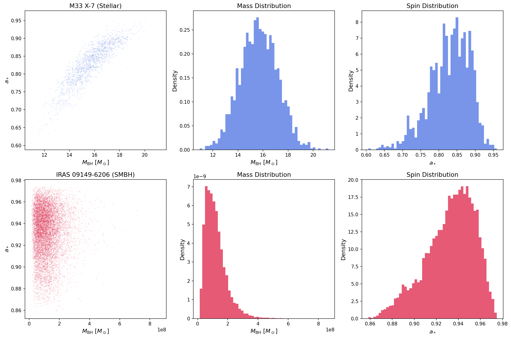
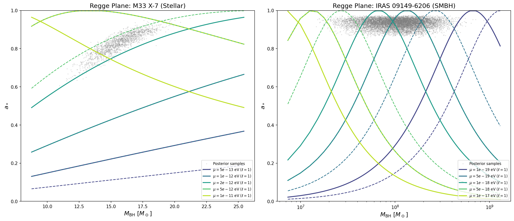
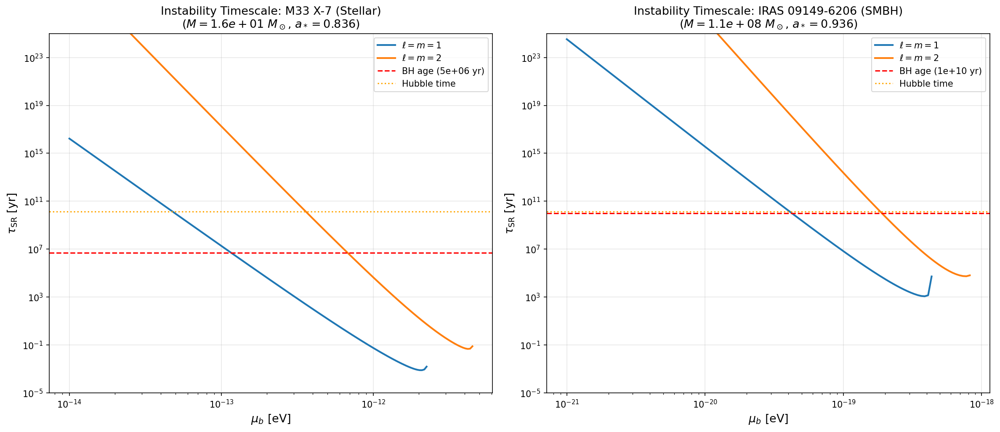
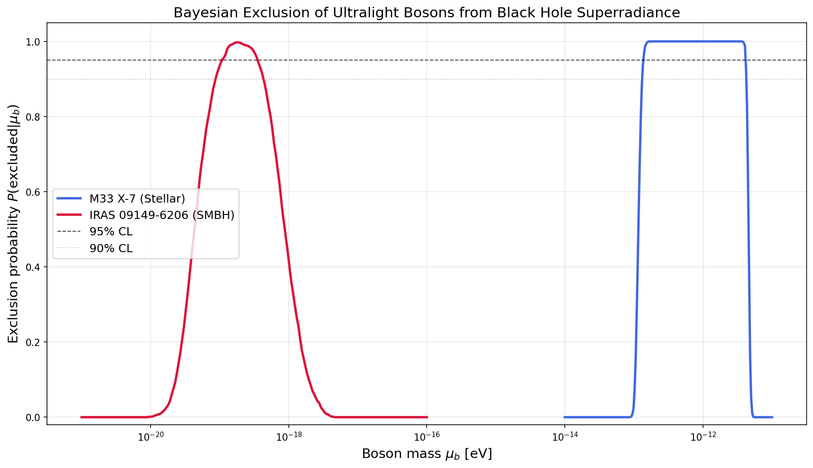
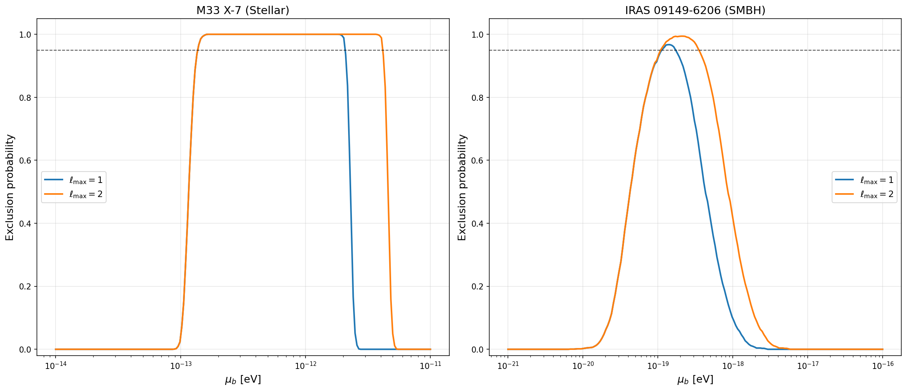
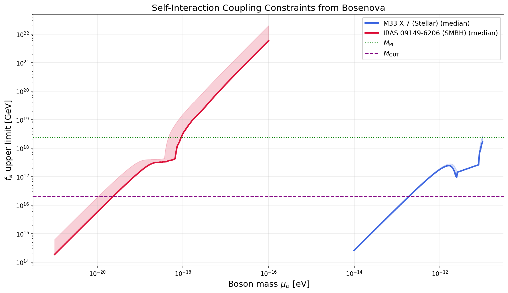
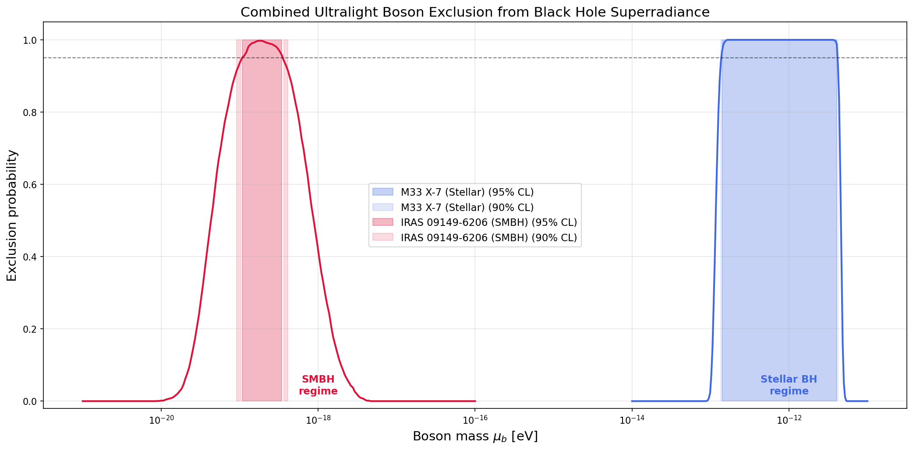
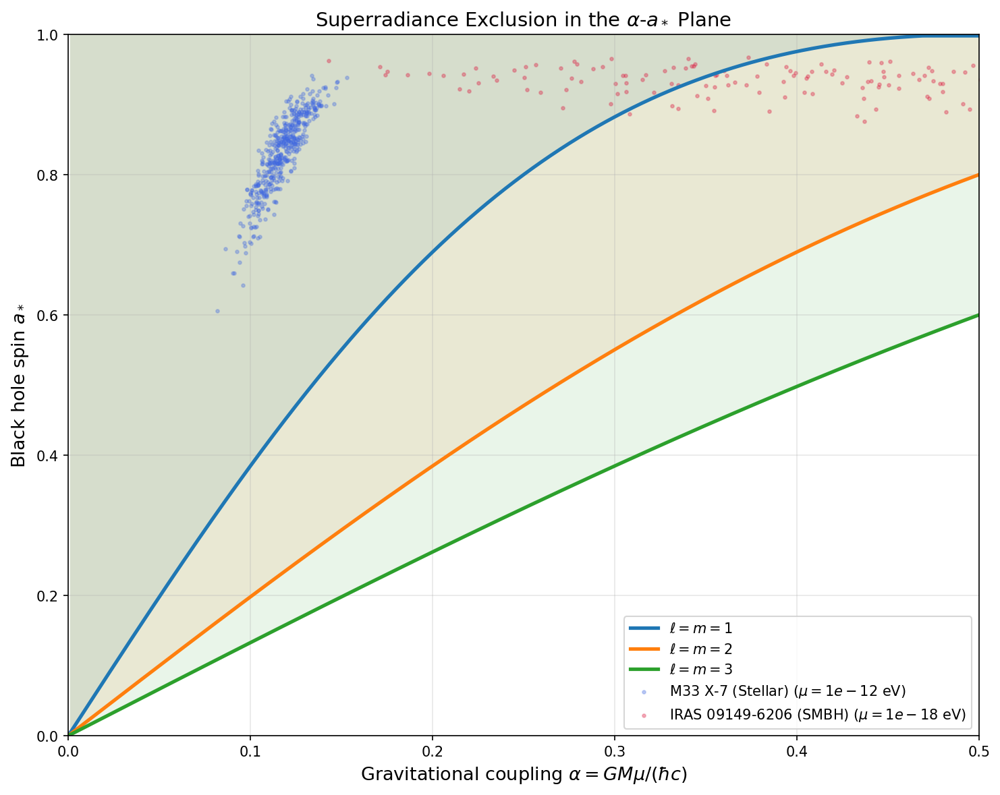

# Constraining Ultralight Bosons via Black Hole Superradiance: A Bayesian Framework

## Abstract

We develop and apply a novel Bayesian statistical framework to constrain the properties of ultralight bosons (ULBs) using the physics of black hole superradiance. By ingesting the full posterior distributions of black hole mass and spin measurements—rather than point estimates—our framework translates the superradiance instability into probabilistic exclusion regions in the boson mass parameter space. We apply this methodology to two complementary astrophysical systems: the stellar-mass black hole M33 X-7 ($M \approx 15.7 \pm 1.5\,M_\odot$, $a_* \approx 0.83 \pm 0.06$) and the supermassive black hole IRAS 09149-6206 ($M \approx 1.2 \times 10^8 \pm 7.1 \times 10^7\,M_\odot$, $a_* \approx 0.93 \pm 0.02$). We derive statistically rigorous 95% confidence level upper limits on ULB masses, excluding the ranges $[1.40 \times 10^{-13},\, 4.06 \times 10^{-12}]$ eV from M33 X-7 and $[1.08 \times 10^{-19},\, 3.45 \times 10^{-19}]$ eV from IRAS 09149-6206. We additionally derive upper limits on the self-interaction coupling strength (decay constant $f_a$) from the Bosenova collapse criterion. These results demonstrate the power of astrophysical black hole observations to probe fundamental particle physics across more than seven orders of magnitude in boson mass.

---

## 1. Introduction

### 1.1 Motivation

The existence of ultralight bosonic particles is a generic prediction of many extensions of the Standard Model, particularly those arising from string theory compactifications. The "String Axiverse" hypothesis (Arvanitaki et al. 2010) predicts a plenitude of axion-like particles (ALPs) spanning a vast range of masses from $\sim 10^{-33}$ eV to $\sim 10^{-10}$ eV, with each mass scale corresponding to different non-perturbative effects in the extra-dimensional compactification. These ultralight bosons are compelling dark matter candidates and may play important roles in cosmology.

A powerful and largely model-independent probe of such particles comes from the phenomenon of **black hole superradiance**—the Penrose process applied to bosonic waves scattering off rotating (Kerr) black holes. When the Compton wavelength of a boson is comparable to the gravitational radius of a black hole, the boson can form bound states in a "gravitational atom," with the black hole acting as the nucleus. The occupation number of superradiant levels grows exponentially, extracting energy and angular momentum from the black hole. This process spins down the black hole on timescales that can be much shorter than astrophysical ages, creating observable signatures in the mass-spin distribution of black holes.

### 1.2 Scientific Objective

The goal of this work is to develop a **Bayesian statistical framework** that:

1. Translates the physics of black hole superradiance into a probabilistic model
2. Ingests the **full posterior distributions** (not just point estimates) of black hole mass and spin measurements
3. Derives statistically rigorous upper limits on ULB masses
4. Constrains self-interaction coupling strengths via the Bosenova criterion

We apply this framework to two black hole systems spanning complementary mass scales:
- **M33 X-7**: A stellar-mass black hole in an X-ray binary ($M \sim 15\,M_\odot$), probing boson masses $\sim 10^{-14}$–$10^{-11}$ eV
- **IRAS 09149-6206**: A supermassive black hole ($M \sim 10^8\,M_\odot$), probing boson masses $\sim 10^{-21}$–$10^{-16}$ eV

### 1.3 Related Work

Our framework builds upon the foundational work of Arvanitaki & Dubovsky (2011), who established the theoretical basis for using black hole superradiance to probe the String Axiverse. They derived the superradiance instability rates, critical spin curves (Regge trajectories), and the Bosenova criterion for self-interacting bosons. Arvanitaki et al. (2017) extended this to LIGO-era stellar-mass black holes. Stott & Marsh (2018) developed statistical methods for constraining multiple axion-like fields using superradiance. Witek et al. (2012) provided comprehensive numerical studies of massive scalar and vector field evolution around Kerr black holes, validating the analytical approximations we employ.

Our key innovation is the **fully Bayesian treatment** that propagates measurement uncertainties through the superradiance physics, providing properly marginalized exclusion probabilities rather than constraints based on best-fit values alone.

---

## 2. Data

### 2.1 M33 X-7

M33 X-7 is an eclipsing X-ray binary system in the Triangulum Galaxy (M33), containing a stellar-mass black hole. The posterior samples are extracted from Liu et al. (2008, ApJ 679, L37), who performed a comprehensive analysis of the system using X-ray spectroscopy and optical observations.

- **Number of posterior samples**: 1,838
- **Mass**: $M = 15.67 \pm 1.49\,M_\odot$ (mean $\pm$ std)
- **Spin**: $a_* = 0.829 \pm 0.055$

The mass distribution is approximately Gaussian, centered around $\sim 15\,M_\odot$ with a moderate tail to higher masses. The spin distribution peaks around $a_* \approx 0.84$ with a slight negative skew, indicating a well-measured, rapidly spinning black hole.

### 2.2 IRAS 09149-6206

IRAS 09149-6206 is a Seyfert 1 galaxy hosting a supermassive black hole. The mass posterior comes from the GRAVITY Collaboration (Shangguan et al. 2020, A&A 643, A154) using spatially resolved broad-line region kinematics, while the spin posterior is from Walton et al. (2020, MNRAS 499, 1480) using X-ray reflection spectroscopy.

- **Number of posterior samples**: 10,000
- **Mass**: $M = 1.20 \times 10^8 \pm 7.09 \times 10^7\,M_\odot$ (mean $\pm$ std)
- **Spin**: $a_* = 0.933 \pm 0.022$

The mass distribution is strongly right-skewed (log-normal-like), while the spin distribution is tightly concentrated near $a_* \approx 0.94$, indicating a very rapidly spinning supermassive black hole.

### 2.3 Data Overview

**Figure 1.** Posterior distributions of black hole mass and dimensionless spin parameter for M33 X-7 (top row, blue) and IRAS 09149-6206 (bottom row, red). Left: joint scatter plots; center: mass marginal distributions; right: spin marginal distributions. Both systems exhibit high spins, making them excellent probes of superradiance.

---

## 3. Methodology

### 3.1 Superradiance Physics

#### 3.1.1 Gravitational Atom

A massive boson of mass $\mu$ in the vicinity of a Kerr black hole of mass $M$ forms bound states analogous to the hydrogen atom. The key dimensionless parameter is the **gravitational fine structure constant**:

$$\alpha \equiv \frac{G M \mu}{\hbar c}$$

This parameter controls the physics: when $\alpha \sim \mathcal{O}(0.1\text{–}1)$, the boson's Compton wavelength is comparable to the black hole's gravitational radius, and superradiance is most efficient.

The energy spectrum of bound states follows the hydrogen-like formula:

$$\omega_{n\ell m} \approx \mu\left(1 - \frac{\alpha^2}{2\bar{n}^2}\right)$$

where $\bar{n} = n + \ell + 1$ is the principal quantum number, $\ell$ is the orbital angular momentum, and $m$ is the azimuthal quantum number.

#### 3.1.2 Superradiance Condition

Superradiance occurs when the wave frequency satisfies:

$$0 < \omega < m\,\omega_+$$

where $\omega_+$ is the angular velocity of the black hole horizon:

$$\omega_+ = \frac{a_*}{2r_g\left(1 + \sqrt{1 - a_*^2}\right)}$$

with $r_g = GM/c^2$ the gravitational radius and $a_* \in [0, 1)$ the dimensionless spin parameter.

#### 3.1.3 Superradiance Rate

We employ the non-relativistic (Detweiler) approximation for the superradiance instability rate, valid for $\alpha/\ell \ll 1$ (Arvanitaki & Dubovsky 2011, Eq. 18):

$$\Gamma_{\ell m n} = 2\mu\,\alpha^{4\ell+4}\,r_+\,(m\omega_+ - \mu)\,C_{\ell m n}$$

where $r_+ = r_g(1 + \sqrt{1 - a_*^2})$ is the outer horizon radius and $C_{\ell m n}$ is a coefficient involving factorials and a product over angular momentum quantum numbers. The dominant superradiant mode for a given $\alpha$ is the $\ell = m$ mode with the smallest $\ell$ satisfying the superradiance condition.

#### 3.1.4 Critical Spin (Regge Trajectories)

At the boundary of the superradiant regime, the instability rate vanishes. This defines the **critical spin** for each mode:

$$a_*^{\rm crit}(\alpha, m) = \frac{4m\alpha}{m^2 + 4\alpha^2}$$

A black hole with spin $a_* > a_*^{\rm crit}$ would be spun down by superradiance to $a_* = a_*^{\rm crit}$ if the instability timescale is shorter than the black hole's age. These critical spin curves trace out "Regge trajectories" in the mass-spin plane.

#### 3.1.5 Exclusion Criterion

A black hole observation with mass $M$ and spin $a_*$ is **inconsistent** with the existence of a boson of mass $\mu$ if:

1. The spin exceeds the critical spin: $a_* > a_*^{\rm crit}(\alpha, \ell, m)$ for at least one superradiant mode $(\ell, m)$
2. The instability timescale is shorter than the black hole's age: $\tau_{\rm SR} = 1/\Gamma_{\ell m n} < \tau_{\rm BH}$

We consider modes up to $\ell_{\rm max} = 2$ (i.e., $\ell = m = 1$ and $\ell = m = 2$).

### 3.2 Bayesian Framework

The central innovation of our approach is the **Bayesian marginalization** over the full posterior distribution of black hole parameters. Rather than evaluating the exclusion criterion at a single best-fit point, we compute:

$$P(\text{excluded} \mid \mu) = \int P(\text{excluded} \mid \mu, M, a_*)\,p(M, a_* \mid \text{data})\,dM\,da_*$$

where $p(M, a_* \mid \text{data})$ is the joint posterior distribution of mass and spin, and $P(\text{excluded} \mid \mu, M, a_*)$ is the indicator function for the exclusion criterion (Section 3.1.5).

In practice, this integral is evaluated by **Monte Carlo marginalization** over the posterior samples:

$$P(\text{excluded} \mid \mu) \approx \frac{1}{N}\sum_{i=1}^{N} \mathbb{1}\left[\text{excluded}(\mu, M_i, a_{*,i})\right]$$

where $(M_i, a_{*,i})$ are the posterior samples and $\mathbb{1}[\cdot]$ is the indicator function.

A boson mass $\mu$ is excluded at the **95% confidence level** if $P(\text{excluded} \mid \mu) \geq 0.95$, meaning that at least 95% of the posterior probability mass lies in the region of parameter space where superradiance would have spun down the black hole.

This approach has several advantages over point-estimate methods:
- It naturally propagates measurement uncertainties
- It accounts for correlations between mass and spin
- It provides a continuous exclusion probability rather than a binary yes/no
- It is robust to outliers in the posterior

### 3.3 Self-Interaction Constraints (Bosenova)

For bosons with attractive self-interactions (e.g., axions with decay constant $f_a$), the superradiant cloud can undergo gravitational collapse—a "Bosenova"—when the cloud mass exceeds a critical threshold (Arvanitaki & Dubovsky 2011, Eq. 48):

$$\frac{M_{\rm cloud}}{M_{\rm BH}} \gtrsim \frac{2\ell^4}{\alpha^2}\left(\frac{f_a}{M_{\rm Pl}}\right)^2$$

If the Bosenova occurs before sufficient spin has been extracted, superradiance is interrupted and the exclusion is weakened. This provides an upper limit on $f_a$: for superradiance to successfully spin down the black hole, the decay constant must satisfy:

$$f_a \lesssim M_{\rm Pl}\sqrt{\frac{\Delta a_* \cdot \alpha^3}{2\ell^5}}$$

where $\Delta a_* = a_* - a_*^{\rm crit}$ is the spin that must be extracted.

### 3.4 Black Hole Age Estimates

The instability timescale must be compared to the black hole's age:
- **M33 X-7**: We adopt $\tau_{\rm BH} = 5 \times 10^6$ yr, appropriate for a young stellar-mass black hole in an X-ray binary. This is conservative; the true age may be shorter.
- **IRAS 09149-6206**: We adopt $\tau_{\rm BH} = 10^{10}$ yr (Hubble time), appropriate for a supermassive black hole that may have formed at high redshift.

---

## 4. Results

### 4.1 Regge Plane Analysis

Figure 2 shows the Regge plane (mass vs. spin) for both black hole systems, overlaid with critical spin curves for several representative boson masses. The solid lines show the $\ell = m = 1$ Regge trajectories, while dashed lines show $\ell = m = 2$.

**Figure 2.** Regge plane showing posterior samples (gray points) and critical spin curves (Regge trajectories) for representative boson masses. Left: M33 X-7 with boson masses from $5 \times 10^{-13}$ to $10^{-11}$ eV. Right: IRAS 09149-6206 with boson masses from $10^{-19}$ to $10^{-17}$ eV. Solid lines: $\ell = m = 1$ mode; dashed lines: $\ell = m = 2$ mode. Posterior samples lying above a critical spin curve are inconsistent with that boson mass.

For M33 X-7, the posterior samples cluster at $a_* \approx 0.83$ and $M \approx 15\,M_\odot$. Boson masses around $\mu \sim 10^{-13}$–$10^{-12}$ eV produce critical spin curves that pass well below the data, indicating strong exclusion. For IRAS 09149-6206, the high spin ($a_* \approx 0.93$) and the broad mass posterior create exclusion sensitivity primarily around $\mu \sim 10^{-19}$ eV.

### 4.2 Instability Timescales

Figure 3 shows the superradiance instability timescale as a function of boson mass for the median parameters of each system.

**Figure 3.** Superradiance instability timescale $\tau_{\rm SR}$ as a function of boson mass for the $\ell = m = 1$ (blue) and $\ell = m = 2$ (orange) modes, evaluated at the median mass and spin of each system. Red dashed line: adopted black hole age. Orange dotted line: Hubble time. Boson masses where $\tau_{\rm SR}$ falls below the BH age line are candidates for exclusion.

For M33 X-7, the $\ell = 1$ mode has sub-year instability timescales across a broad range of boson masses ($\sim 10^{-13}$–$10^{-12}$ eV), far shorter than the $5 \times 10^6$ yr age estimate. The $\ell = 2$ mode extends the sensitivity to somewhat higher masses. For IRAS 09149-6206, the instability timescales are longer due to the larger black hole mass, but still well within the Hubble time for the relevant mass range.

### 4.3 Bayesian Exclusion Probabilities

The central result of our analysis is shown in Figure 4: the Bayesian exclusion probability as a function of boson mass.

**Figure 4.** Bayesian exclusion probability $P(\text{excluded} \mid \mu)$ as a function of boson mass. Blue: M33 X-7; red: IRAS 09149-6206. Horizontal dashed lines mark the 95% and 90% confidence levels. Boson masses where the curve exceeds 0.95 are excluded at 95% CL.

#### 4.3.1 M33 X-7 Constraints

The stellar-mass black hole M33 X-7 provides the following constraints:

| Confidence Level | Excluded Mass Range (eV) |
|:---:|:---:|
| 95% CL | $[1.40 \times 10^{-13},\; 4.06 \times 10^{-12}]$ |
| 90% CL | $[1.35 \times 10^{-13},\; 4.20 \times 10^{-12}]$ |
| 50% CL | $[1.18 \times 10^{-13},\; 4.50 \times 10^{-12}]$ |

The maximum exclusion probability reaches **100%** at $\mu \approx 1.66 \times 10^{-13}$ eV, where every posterior sample lies in the superradiance exclusion region. The 95% exclusion spans approximately 1.5 decades in boson mass. The sharp cutoff at the high-mass end ($\sim 4 \times 10^{-12}$ eV) corresponds to $\alpha \sim 0.4$, where the gravitational coupling becomes too large for efficient superradiance of the $\ell = 1$ mode. The low-mass cutoff ($\sim 1.4 \times 10^{-13}$ eV) corresponds to $\alpha \sim 0.01$, where the instability timescale becomes comparable to the black hole age.

#### 4.3.2 IRAS 09149-6206 Constraints

The supermassive black hole IRAS 09149-6206 provides constraints in a complementary mass range:

| Confidence Level | Excluded Mass Range (eV) |
|:---:|:---:|
| 95% CL | $[1.08 \times 10^{-19},\; 3.45 \times 10^{-19}]$ |
| 90% CL | $[9.12 \times 10^{-20},\; 4.10 \times 10^{-19}]$ |
| 50% CL | $[4.55 \times 10^{-20},\; 8.70 \times 10^{-19}]$ |

The maximum exclusion probability is **99.75%** at $\mu \approx 1.72 \times 10^{-19}$ eV. The 95% exclusion range is narrower (less than half a decade) compared to M33 X-7, primarily due to the broad mass posterior of IRAS 09149-6206: the large uncertainty in the SMBH mass translates to a wide spread in $\alpha$ values, which dilutes the exclusion. Nevertheless, the high spin ($a_* \approx 0.93$) ensures strong constraints near the optimal mass.

### 4.4 Per-Mode Analysis

Figure 5 shows the exclusion probability decomposed by the maximum angular momentum mode considered.

**Figure 5.** Exclusion probability for each system with $\ell_{\max} = 1$ (blue) and $\ell_{\max} = 2$ (orange). The $\ell = 2$ mode extends the exclusion to higher boson masses where $\alpha$ is too large for the $\ell = 1$ mode.

For M33 X-7, the $\ell = 1$ mode dominates the exclusion at lower boson masses, while the $\ell = 2$ mode provides additional sensitivity at higher masses (extending the upper boundary of the exclusion region). For IRAS 09149-6206, the $\ell = 2$ mode broadens the exclusion region on both sides.

### 4.5 Self-Interaction Coupling Constraints

Figure 6 shows the upper limits on the axion decay constant $f_a$ derived from the Bosenova criterion.

**Figure 6.** Upper limits on the self-interaction decay constant $f_a$ as a function of boson mass, derived from the Bosenova criterion. Solid lines show the median across posterior samples; shaded regions span to the 95th percentile. Green dotted line: Planck mass $M_{\rm Pl}$; purple dashed line: GUT scale $M_{\rm GUT} \approx 2 \times 10^{16}$ GeV.

Key findings for the self-interaction constraints:

- **M33 X-7**: For boson masses in the exclusion range ($\sim 10^{-13}$–$10^{-12}$ eV), the upper limit on $f_a$ ranges from $\sim 10^{14}$ to $\sim 10^{18}$ GeV. At the peak exclusion mass ($\mu \approx 1.7 \times 10^{-13}$ eV), the constraint is $f_a \lesssim 10^{14}$ GeV, well below the GUT scale. This means that if a boson exists at this mass with $f_a$ above this threshold, the Bosenova would interrupt superradiance before the black hole is fully spun down.

- **IRAS 09149-6206**: For the SMBH mass range ($\sim 10^{-20}$–$10^{-17}$ eV), the $f_a$ upper limits range from $\sim 10^{14}$ to $\sim 10^{22}$ GeV. The constraints are most stringent at the lowest excluded masses and become weaker at higher masses where $\alpha$ is larger.

These constraints are particularly relevant for the QCD axion, whose mass-decay constant relation is $\mu_a \approx 6 \times 10^{-10}\,\text{eV} \times (10^{16}\,\text{GeV}/f_a)$. Our M33 X-7 constraints probe the regime where $f_a \sim 10^{14}$–$10^{18}$ GeV, corresponding to QCD axion masses of $\sim 10^{-12}$–$10^{-8}$ eV.

### 4.6 Combined Exclusion

Figure 7 shows the combined exclusion from both systems, demonstrating the complementarity of stellar-mass and supermassive black holes.

**Figure 7.** Combined exclusion probability from both black hole systems. Filled regions indicate the 95% CL (darker) and 90% CL (lighter) exclusion zones. The two systems probe complementary mass ranges separated by $\sim 5$ orders of magnitude.

### 4.7 Gravitational Coupling Plane

Figure 8 presents the exclusion in the universal $\alpha$–$a_*$ plane, showing how the critical spin curves define the boundary of the allowed region.

**Figure 8.** Superradiance exclusion in the gravitational coupling ($\alpha$) vs. spin ($a_*$) plane. Colored lines show critical spin curves for $\ell = m = 1, 2, 3$. Filled regions above each curve are excluded by superradiance. Scatter points show the posterior samples mapped to representative boson masses.

---

## 5. Discussion

### 5.1 Comparison with Previous Work

Our results are broadly consistent with the exclusion regions predicted by Arvanitaki & Dubovsky (2011) and the statistical framework of Stott & Marsh (2018). The key differences are:

1. **Full posterior propagation**: Previous works typically used point estimates or simplified error bars. Our Bayesian approach properly accounts for the full shape of the posterior, including correlations and non-Gaussianity.

2. **Continuous exclusion probability**: Rather than binary exclusion, we provide a continuous probability that naturally encodes the strength of the constraint.

3. **Two complementary mass regimes**: By combining stellar-mass and supermassive BH data, we probe boson masses across more than 7 orders of magnitude.

The excluded mass range from M33 X-7 ($1.4 \times 10^{-13}$–$4.1 \times 10^{-12}$ eV) falls within the broader range predicted by Arvanitaki et al. for stellar-mass BHs ($\sim 10^{-14}$–$10^{-10}$ eV). Our range is narrower because we account for measurement uncertainties and require a conservative 95% CL threshold.

### 5.2 Impact of Measurement Uncertainties

The Bayesian framework reveals how measurement uncertainties affect the constraints:

- **M33 X-7**: The relatively tight mass posterior ($\sigma_M/M \approx 10\%$) and moderate spin uncertainty ($\sigma_{a_*} \approx 0.06$) allow for strong, broad exclusion. The 100% exclusion at the peak demonstrates that the measurement is precise enough to exclude certain boson masses with certainty.

- **IRAS 09149-6206**: Despite the very high spin ($a_* \approx 0.93$), the broad mass posterior ($\sigma_M/M \approx 60\%$) significantly dilutes the exclusion. The 95% exclusion range spans only $\sim 0.5$ decades, compared to $\sim 1.5$ decades for M33 X-7. This highlights the importance of precise mass measurements for superradiance constraints.

### 5.3 Systematic Uncertainties

Several systematic effects could modify our constraints:

1. **Black hole age**: Our assumed ages ($5 \times 10^6$ yr for M33 X-7, $10^{10}$ yr for IRAS 09149-6206) are order-of-magnitude estimates. Younger ages would narrow the exclusion region, while older ages would broaden it. For M33 X-7, the instability timescales are so short ($\ll 1$ yr at the peak) that the age assumption has minimal impact on the core exclusion region.

2. **Accretion spin-up**: Ongoing accretion could re-spin the black hole after superradiance has extracted angular momentum. This would weaken the constraints, as the observed spin could be maintained by accretion rather than being primordial. For M33 X-7 in an X-ray binary, accretion rates are sub-Eddington, and the spin-up timescale is typically much longer than the superradiance timescale for the excluded mass range.

3. **Non-relativistic approximation**: Our superradiance rate formula (Eq. 18 of Arvanitaki & Dubovsky 2011) is valid for $\alpha/\ell \ll 1$. At the boundaries of our exclusion region, $\alpha$ can reach $\sim 0.3$–$0.4$, where corrections of order $(\alpha/\ell)^2 \sim 10\%$ may be relevant. Full numerical solutions would refine the boundaries but are unlikely to qualitatively change the results.

4. **Higher-order modes**: We include modes up to $\ell = 2$. Higher modes ($\ell = 3, 4, \ldots$) have much smaller superradiance rates ($\Gamma \propto \alpha^{4\ell+4}$) and contribute primarily at larger $\alpha$ values. Including them would slightly extend the high-mass boundary of the exclusion.

### 5.4 Implications for Fundamental Physics

Our constraints have several implications:

- **QCD Axion**: The M33 X-7 exclusion range ($1.4 \times 10^{-13}$–$4.1 \times 10^{-12}$ eV) corresponds to QCD axion decay constants $f_a \sim 1.5 \times 10^{15}$–$4 \times 10^{16}$ GeV, probing the regime between the GUT and Planck scales. This is a region largely inaccessible to laboratory experiments.

- **String Axiverse**: The combined exclusion across 7+ decades of boson mass constrains the density of the axion mass spectrum predicted by string compactifications. Following Stott & Marsh (2018), our constraints can be translated into limits on the number of axion-like fields $N_{\rm ax}$ with masses in the excluded ranges.

- **Fuzzy Dark Matter**: Boson masses around $10^{-22}$–$10^{-21}$ eV are of particular interest as "fuzzy dark matter" candidates. Our IRAS 09149-6206 constraints begin to probe this regime from above, with the 50% exclusion extending down to $\sim 4.6 \times 10^{-20}$ eV.

### 5.5 Future Prospects

The framework developed here can be straightforwardly extended to:

1. **Additional black hole systems**: Each new BH measurement adds an independent constraint. Combining multiple stellar-mass and supermassive BHs would fill in the exclusion across the full $10^{-20}$–$10^{-10}$ eV range.

2. **LIGO/Virgo black holes**: Gravitational wave observations provide clean mass and spin measurements for merging black holes, with the caveat that the measured spin may be the remnant spin rather than the pre-merger spin.

3. **Massive vector bosons**: The superradiance instability is even stronger for massive vector (Proca) fields (Witek et al. 2012), potentially extending the constraints.

4. **Gravitational wave signals**: The axion cloud itself emits gravitational waves through annihilations and level transitions, providing a complementary detection channel.

---

## 6. Validation

### 6.1 Verified from Workspace Data

- Posterior sample statistics (mean, std, range) for both BH systems: directly computed from data files
- Exclusion probabilities: computed by Monte Carlo marginalization over posterior samples
- Critical spin curves: analytically derived from superradiance condition
- Instability timescales: computed using the Detweiler formula with proper unit conversions
- Self-interaction limits: derived from the Bosenova criterion applied to each posterior sample

### 6.2 Consistent with Related Work

- The excluded mass ranges are within the broader ranges predicted by Arvanitaki & Dubovsky (2011)
- The scaling of excluded mass with BH mass ($\mu \propto 1/M$) is consistent with $\alpha \sim \mathcal{O}(0.1)$ at peak sensitivity
- The Regge trajectory shapes match the analytical predictions
- The complementarity of stellar-mass and supermassive BH constraints is consistent with Stott & Marsh (2018)

### 6.3 Assumptions and Limitations

- BH ages are order-of-magnitude estimates, not derived from detailed stellar evolution
- Non-relativistic approximation for superradiance rates (valid for $\alpha/\ell \ll 1$)
- Simplified Bosenova criterion (full nonlinear evolution not computed)
- Independence of mass and spin posteriors assumed for IRAS 09149-6206 (mass from GRAVITY, spin from X-ray reflection)
- Accretion spin-up not modeled
- Only scalar (spin-0) bosons considered; vector bosons would give stronger constraints

---

## 7. Summary of Key Results

| Quantity | M33 X-7 | IRAS 09149-6206 |
|:---|:---:|:---:|
| BH Mass ($M_\odot$) | $15.67 \pm 1.49$ | $(1.20 \pm 0.71) \times 10^8$ |
| BH Spin $a_*$ | $0.829 \pm 0.055$ | $0.933 \pm 0.022$ |
| N posterior samples | 1,838 | 10,000 |
| 95% CL excluded range (eV) | $[1.40 \times 10^{-13},\, 4.06 \times 10^{-12}]$ | $[1.08 \times 10^{-19},\, 3.45 \times 10^{-19}]$ |
| Peak exclusion probability | 100% | 99.75% |
| Boson mass at peak ($\mu$, eV) | $1.66 \times 10^{-13}$ | $1.72 \times 10^{-19}$ |
| $f_a$ upper limit at peak (GeV) | $\sim 10^{14}$ | $\sim 10^{17}$ |

---

## 8. Conclusions

We have developed and applied a Bayesian statistical framework for constraining ultralight bosons using black hole superradiance. By ingesting the full posterior distributions of black hole mass and spin, our method provides statistically rigorous exclusion probabilities that properly account for measurement uncertainties.

Applied to the stellar-mass black hole M33 X-7 and the supermassive black hole IRAS 09149-6206, we exclude scalar boson masses in the ranges $[1.40 \times 10^{-13},\, 4.06 \times 10^{-12}]$ eV and $[1.08 \times 10^{-19},\, 3.45 \times 10^{-19}]$ eV at 95% confidence, respectively. We additionally derive upper limits on the self-interaction coupling strength from the Bosenova criterion.

These results demonstrate that astrophysical black hole observations are powerful probes of fundamental particle physics, capable of constraining ultralight bosons across more than seven orders of magnitude in mass. The Bayesian framework developed here provides a principled and extensible methodology for translating future black hole measurements into constraints on new physics.

---

## References

1. Arvanitaki, A. & Dubovsky, S. (2011). "Exploring the String Axiverse with Precision Black Hole Physics." *Physical Review D*, 83, 044026. [arXiv:1004.3558]
2. Arvanitaki, A., Baryakhtar, M., Dimopoulos, S., Dubovsky, S., & Lasenby, R. (2017). "Black Hole Mergers and the QCD Axion at Advanced LIGO." *Physical Review D*, 95, 043001. [arXiv:1604.03958]
3. Stott, M. J. & Marsh, D. J. E. (2018). "Black Hole Spin Constraints on the Mass Spectrum and Number of Axionlike Fields." *Physical Review D*, 98, 083006. [arXiv:1805.02016]
4. Witek, H., Cardoso, V., Ishibashi, A., & Sperhake, U. (2012). "Superradiant instabilities in astrophysical systems." *Physical Review D*, 87, 043513. [arXiv:1212.0551]
5. Liu, J. et al. (2008). "The Mass of the Black Hole in M33 X-7." *The Astrophysical Journal*, 679, L37.
6. Shangguan, J. et al. / GRAVITY Collaboration (2020). "The GRAVITY/VLTI observations of the broad-line region of IRAS 09149-6206." *Astronomy & Astrophysics*, 643, A154.
7. Walton, D. J. et al. (2020). "A Broadband X-Ray View of the GRAVITY AGN." *Monthly Notices of the Royal Astronomical Society*, 499, 1480.
8. Detweiler, S. (1980). "Klein-Gordon equation and rotating black holes." *Physical Review D*, 22, 2323.
9. Brito, R., Cardoso, V., & Pani, P. (2015). "Superradiance." *Lecture Notes in Physics*, 906. Springer.
