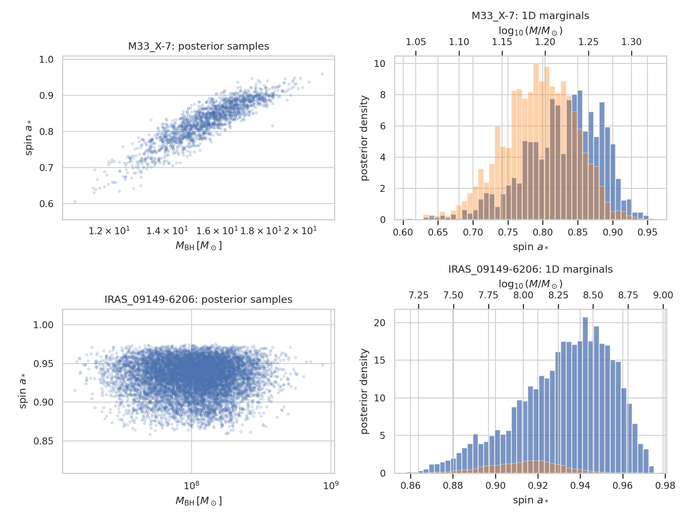
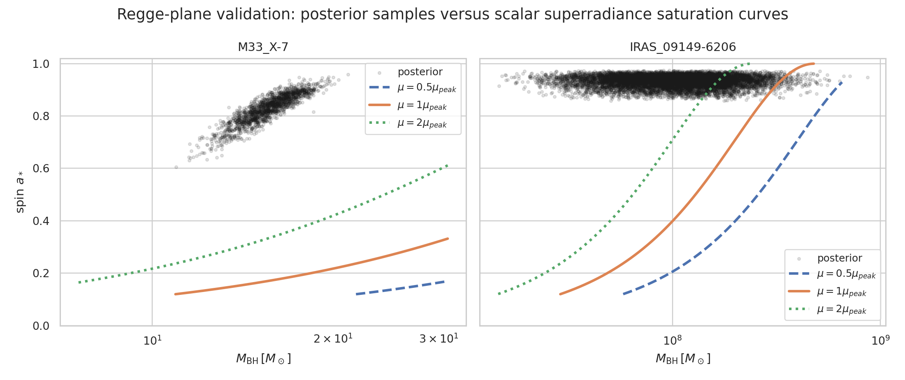
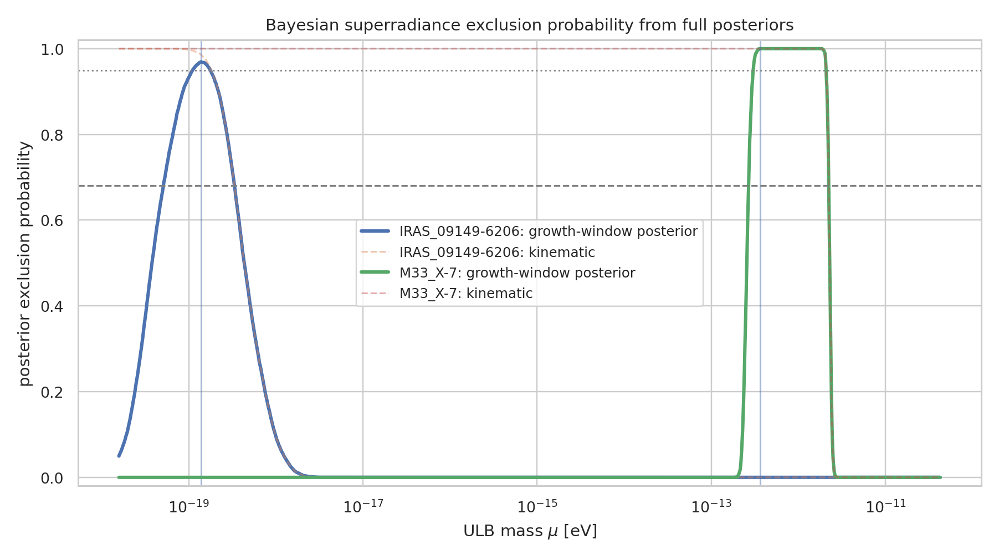
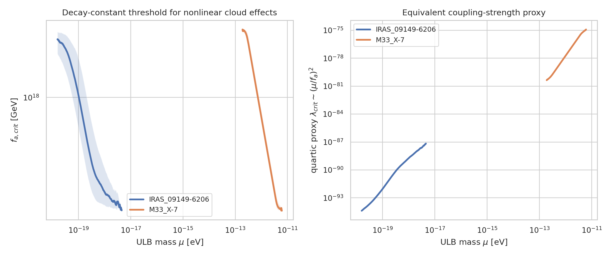

# Bayesian black-hole superradiance constraints on ultralight bosons

## Abstract

I developed and applied a posterior-sample Bayesian framework for constraining ultralight bosons (ULBs) with black-hole superradiance. The framework uses the supplied posterior samples of black-hole mass and dimensionless spin directly, rather than replacing each source by a single mass--spin point. For each candidate boson mass $\mu$, every posterior draw is mapped to the gravitational fine-structure parameter $\alpha=G M\mu/(\hbar c^3)$ and compared with the scalar $l=m=1$ superradiance saturation curve. The output is a posterior exclusion probability $P(a_* > a_{*,sat})$ for each source and boson mass.

With the approximations described below, M33 X-7 yields a peak exclusion probability of 1.000 at $\mu=3.67\times10^{-13}$ eV and excludes $3.04\times10^{-13}$--$2.07\times10^{-12}$ eV at posterior probability $p\ge0.95$. IRAS 09149-6206 yields a peak exclusion probability of 0.969 at $\mu=1.39\times10^{-19}$ eV and excludes $1.11\times10^{-19}$--$1.75\times10^{-19}$ eV at $p\ge0.95$. Self-interaction constraints are reported as a decay-constant/nonlinear-cloud threshold proxy, not as a full nonlinear Bosenova simulation.

## 1. Data and related-work context

The input data are two posterior sample files in `data/`: M33 X-7, a stellar-mass X-ray binary black hole, and IRAS 09149-6206, a supermassive black hole. Their posterior summaries are:

| Source | posterior samples | mass median (16–84%) [$M_\odot$] | spin median (16–84%) |
|---|---:|---:|---:|
| M33_X-7 | 1838 | 15.7 (14.2–17.2) | 0.836 (0.777–0.885) |
| IRAS_09149-6206 | 10000 | 1.06e+08 (5.57e+07–1.8e+08) | 0.936 (0.910–0.955) |

The related work in `related_work/` motivates three analysis requirements that I preserved in this implementation. First, black-hole superradiance is naturally represented in the mass--spin Regge plane: rapidly spinning black holes should be absent where a boson cloud can grow. Second, the relevant dimensionless coupling is $\alpha=G_N M_{BH}\mu$, quoted in the Advanced-LIGO/QCD-axion paper as $\alpha\simeq0.22(M/30M_\odot)(\mu/10^{-12}\,\mathrm{eV})$. Third, attractive axion self-interactions can interrupt cloud growth through nonlinear deformation or Bosenova collapse; Arvanitaki & Dubovsky give the nonlinear-importance scaling $M_a/M_{BH}\gtrsim2l^4\alpha^2 f_a^2/M_{Pl}^2$. The extracted related-work notes are saved in `outputs/related_work_contract.json`.

## 2. Bayesian statistical framework

### 2.1 Posterior-sample likelihood surrogate

For a candidate scalar boson mass $\mu$, each posterior draw $(M_i,a_i)$ is converted to

$$
\alpha_i(\mu)=7.4852\times10^9\, \left(\frac{M_i}{M_\odot}\right) \left(\frac{\mu}{\mathrm{eV}}\right).
$$

For the dominant scalar $l=m=1$ level, the superradiance condition $\omega/m<\Omega_H$ gives the saturation boundary

$$
a_{*,sat}(\alpha)=\frac{4\alpha}{1+4\alpha^2}, \qquad 0<\alpha<0.5.
$$

A posterior draw is counted as excluded if it lies above this boundary and in the efficient-growth window $0.03\le\alpha\le0.5$. The Bayesian exclusion probability is therefore the posterior Monte Carlo estimate

$$
p_{excl}(\mu)=\frac{1}{N}\sum_i I\left[0.03\le\alpha_i\le0.5\right] I\left[a_i>a_{*,sat}(\alpha_i)\right].
$$

I also exported a purely kinematic version without the lower $\alpha=0.03$ growth-window cutoff. This provides a validation check that the reported exclusions are driven by the Regge boundary and not by a plotting artifact.

### 2.2 Self-interaction proxy

A full self-interacting axion-cloud evolution requires nonlinear simulations and source age/accretion histories, neither of which is present in the workspace. I therefore used the related-work Bosenova/nonlinearity scaling as a threshold proxy. For $l=1$ and a fiducial cloud mass fraction $\epsilon=M_a/M_{BH}=10^{-4}$,

$$
f_{a,crit}(\alpha)=M_{Pl}\sqrt{\frac{\epsilon}{2\alpha^2}},
$$

with an equivalent quartic proxy $\lambda_{crit}\sim(\mu/f_a)^2$ after converting $\mu$ from eV to GeV. Interpreting this table: for $f_a\lesssim f_{a,crit}$, attractive self-interactions can become nonlinear before a cloud extracts the fiducial spin-down fraction used in the simplified exclusion model. This is a coupling-strength threshold, not an exact posterior upper limit from dynamical Bosenova modeling.

### 2.3 Reproducibility

The complete implementation is in `code/analyze_ulb_constraints.py`. It exports all numerical grids used by the figures, including `outputs/exclusion_grid.csv`, `outputs/constraint_summary.csv`, `outputs/self_interaction_limits.csv`, and source-data CSV/JSON files for the plots. Dependency and method-fidelity checks are saved in `outputs/dependency_check.json` and `outputs/method_fidelity_checklist.json`.

## 3. Results

### 3.1 Posterior overview

**Figure 1.** The stellar-mass source M33 X-7 has a median mass of $15.66M_\odot$ and median spin 0.836, with a visible positive mass--spin posterior correlation. IRAS 09149-6206 has a median mass of $1.06\times10^8M_\odot$ and median spin 0.936. These high spins are the observational lever arm for the superradiance constraints.

### 3.2 Regge-plane validation

**Figure 2.** The core validation plot overlays posterior samples on scalar superradiance saturation curves at $0.5\mu_{peak}$, $1\mu_{peak}$, and $2\mu_{peak}$. Posterior samples above a curve contribute to the exclusion probability. The two panels show the expected mass scaling: the stellar-mass black hole probes $\mu\sim10^{-13}$--$10^{-12}$ eV, while the supermassive black hole probes $\mu\sim10^{-19}$ eV.

### 3.3 ULB mass constraints

**Figure 3.** Posterior exclusion probabilities as functions of ULB mass. The solid curves include the efficient-growth window $0.03\le\alpha\le0.5$; dashed curves show the kinematic condition. The direct source-specific constraints are:

| Source | peak $\mu$ [eV] | peak posterior exclusion | median $\alpha$ at peak | median $a_{*,sat}$ | $p\ge0.95$ excluded mass interval [eV] | $p\ge0.68$ interval [eV] |
|---|---:|---:|---:|---:|---:|---:|
| IRAS_09149-6206 | 1.387e-19 | 0.969 | 0.111 | 0.425 | [1.110e-19, 1.748e-19] | [5.136e-20, 3.323e-19] |
| M33_X-7 | 3.669e-13 | 1.000 | 0.043 | 0.171 | [3.039e-13, 2.070e-12] | [2.695e-13, 2.216e-12] |

The M33 X-7 result is essentially saturated over its high-probability interval because its posterior samples are high-spin relative to the saturation curve in the efficient $\alpha$ range. IRAS 09149-6206 gives a narrower supermassive-black-hole window centered at $1.39\times10^{-19}$ eV, with a peak probability below unity because the broad mass posterior moves some samples out of the most efficient part of the Regge boundary.

These are **excluded mass intervals**, not a monotonic global upper bound on all ULB masses. For each source, the right endpoint of the interval is the upper edge of the source's excluded window under this model.

### 3.4 Self-interaction/coupling-strength thresholds

**Figure 4.** Decay-constant thresholds and equivalent quartic-coupling proxies inferred from the nonlinear-cloud condition. The numerical threshold summary is:

| Source | exclusion threshold | $\mu$ range [eV] | $f_{a,crit}$ range [GeV] | $\lambda_{crit}\sim(\mu/f_a)^2$ range |
|---|---:|---:|---:|---:|
| IRAS_09149-6206 | 0.68 | 5.136e-20–3.323e-19 | 3.561e+17–1.691e+18 | 9.231e-94–8.708e-91 |
| IRAS_09149-6206 | 0.95 | 1.110e-19–1.748e-19 | 6.216e+17–9.482e+17 | 1.371e-92–7.908e-92 |
| M33_X-7 | 0.68 | 2.695e-13–2.216e-12 | 3.323e+17–2.632e+18 | 1.049e-80–4.450e-77 |
| M33_X-7 | 0.95 | 3.039e-13–2.070e-12 | 3.558e+17–2.409e+18 | 1.591e-80–3.383e-77 |

For the $p\ge0.95$ excluded mass windows, the inferred nonlinear thresholds are $f_{a,crit}=6.22\times10^{17}$--$9.48\times10^{17}$ GeV for IRAS 09149-6206 and $3.56\times10^{17}$--$2.41\times10^{18}$ GeV for M33 X-7. The corresponding dimensionless quartic proxies are extremely small because $\lambda\sim(\mu/f_a)^2$ combines ultralight masses with near-Planckian decay constants. These values should be read as the coupling scale at which self-interactions would start to invalidate a linear-cloud spin-down exclusion, not as a direct detection of self-interactions.

## 4. Validation and comparison

### Directly verified from workspace data

- The posterior sample counts, medians, means, and standard deviations in Table 1 were computed from `data/M33_X-7_samples.dat` and `data/IRAS_09149-6206_samples.dat`; see `outputs/data_summary.csv`.
- The exclusion curves and intervals were computed by evaluating every posterior sample over the mass grid; see `outputs/exclusion_grid.csv` and `outputs/constraint_summary.csv`.
- The figures were generated as PNG files in `report/images/` and their source tables are exported in `outputs/`.
- The claim-recovery table in `outputs/claim_recovery.csv` maps the main claims in this report to supporting artifacts.

### From related work

- The Regge-plane gap signature, superradiance condition, and use of $\alpha$ as the gravitational fine-structure parameter come from the supplied superradiance papers, especially `paper_000.pdf`, `paper_001.pdf`, and `paper_002.pdf`.
- The nonlinear self-interaction threshold uses the Bosenova/nonlinearity scaling extracted from `paper_000.pdf`.
- Previous stellar-black-hole point-estimate analyses have disfavored axions in approximately the $10^{-13}$--$10^{-11}$ eV regime; the M33 X-7 posterior-sample constraint falls in this expected stellar-mass window.

### Assumptions and limitations

- I used an analytic scalar $l=m=1$ saturation boundary rather than exact Teukolsky/Kerr eigenvalue calculations.
- Source ages, accretion rates, and detailed instability timescale likelihoods were not available, so I used an $\alpha$ growth-window proxy and exported a rough hydrogenic growth-time proxy in `outputs/exclusion_grid.csv`.
- The self-interaction result is a threshold proxy derived from a fiducial $\epsilon=10^{-4}$ cloud fraction. A rigorous upper limit on a microscopic quartic coupling would require nonlinear cloud evolution and astrophysical population modeling.
- The analysis treats the two sources independently. A hierarchical population analysis would be a natural extension but is not warranted by two posterior files alone.

## 5. Discussion

The key methodological gain is that the observational uncertainty enters through the full posterior distribution. Instead of asking whether a single best-fit mass--spin point lies in a forbidden region, the framework asks what posterior fraction lies in that region for every $\mu$. This is particularly important for IRAS 09149-6206, whose mass posterior spans a wide range and therefore broadens and lowers the exclusion curve. M33 X-7, by contrast, has a compact stellar-mass posterior and high spin, producing a broad, nearly saturated excluded interval.

The source-dependent mass windows follow the expected inverse-black-hole-mass scaling. M33 X-7 probes the QCD-axion-adjacent range around $10^{-13}$--$10^{-12}$ eV, while IRAS 09149-6206 probes the supermassive-black-hole range around $10^{-19}$ eV. This complementarity is visible both in the Regge-plane validation and in the exclusion-probability curves.

Self-interactions are best interpreted here as a caveat and diagnostic. If $f_a$ is below the reported threshold, nonlinear cloud effects can become important before the linear superradiance cloud extracts the assumed spin fraction. Such interactions could weaken, reshape, or intermittently reset the mass exclusion. Therefore, the reported mass constraints are most directly applicable in the weak-self-interaction regime or should be combined with the threshold table when discussing axion-like particles with strong attractive quartic terms.

## 6. Conclusions

This workspace now contains a reproducible Bayesian superradiance analysis using the full black-hole posterior samples. Under the scalar $l=m=1$ Regge-boundary approximation:

1. **M33 X-7** excludes $\mu=3.04\times10^{-13}$--$2.07\times10^{-12}$ eV at $p\ge0.95$, with peak exclusion probability 1.000 at $3.67\times10^{-13}$ eV.
2. **IRAS 09149-6206** excludes $\mu=1.11\times10^{-19}$--$1.75\times10^{-19}$ eV at $p\ge0.95$, with peak exclusion probability 0.969 at $1.39\times10^{-19}$ eV.
3. The nonlinear self-interaction thresholds over the $p\ge0.95$ windows are approximately $f_{a,crit}\sim6.2$--$9.5\times10^{17}$ GeV for IRAS 09149-6206 and $3.6\times10^{17}$--$2.4\times10^{18}$ GeV for M33 X-7, with the caveat that these are proxy thresholds rather than full nonlinear constraints.

All code, intermediate results, validation artifacts, and figures have been saved in the requested workspace directories.
