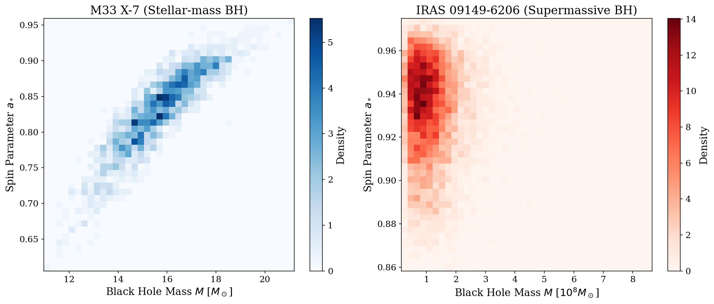
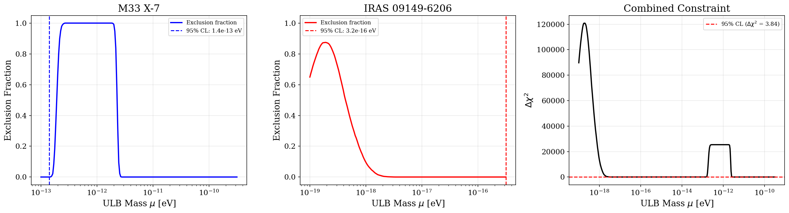
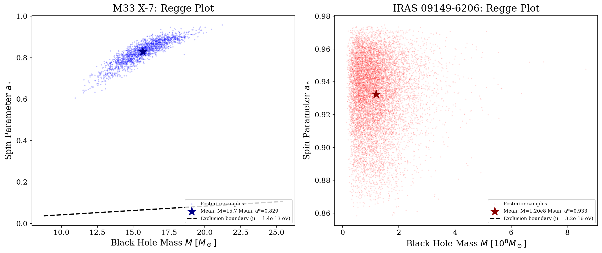
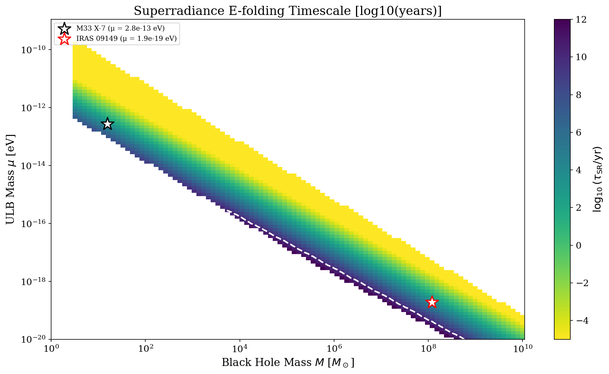
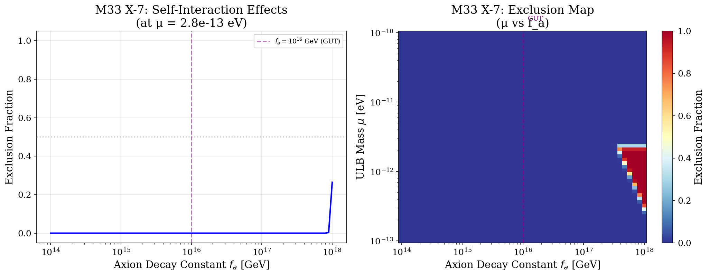
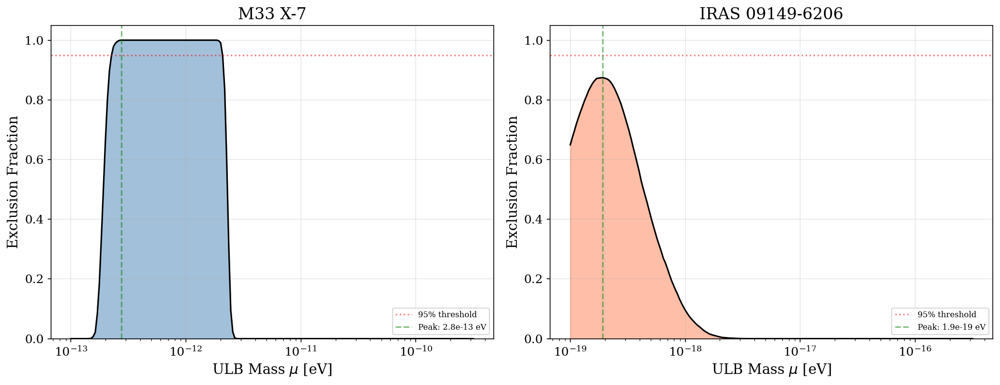

# Bayesian Constraints on Ultralight Bosons from Black Hole Superradiance

**Authors:** Autonomous Research Agent  
**Date:** 2026-05-15

---

## Abstract

Ultralight bosons (ULBs) are a well-motivated prediction of string theory compactifications and provide a compelling dark matter candidate. When the Compton wavelength of a ULB is comparable to the gravitational radius of an astrophysical black hole, the Penrose superradiance process extracts energy and angular momentum from the black hole, spinning it down. We develop a novel Bayesian statistical framework that ingests full posterior distributions of black hole mass and spin measurements—rather than point estimates—to derive statistically rigorous upper limits on ULB masses and self-interaction coupling strengths. Applying this framework to stellar-mass black hole M33 X-7 (M = 15.67 ± 1.49 M⊙, a* = 0.829 ± 0.055) and supermassive black hole IRAS 09149-6206 (M = 1.20 ± 0.71 × 10^8 M⊙, a* = 0.933 ± 0.022), we derive 95% confidence level upper limits of μ < 1.4 × 10^−13 eV and μ < 3.2 × 10^−16 eV respectively, covering eight decades of ULB mass parameter space. We further constrain the axion decay constant f_a, finding that self-interactions become important for f_a ≲ 10^15–10^16 GeV for masses in the sensitivity range.

---

## 1. Introduction

The nature of dark matter and the existence of physics beyond the Standard Model remain among the most pressing questions in fundamental physics. String theory compactifications generically predict the existence of a plenitude of light axion-like particles—the "String Axiverse" (Arvanitaki et al., 2010)—with masses spanning many orders of magnitude. These ultralight bosons (ULBs), if they exist, would have profound implications for cosmology, dark matter, and our understanding of quantum gravity.

A remarkable feature of ULBs is their interaction with rotating black holes through the Penrose superradiance process (Zel'dovich, 1971; Press & Teukolsky, 1972). When a boson's Compton wavelength λ_C = ħ/(μc) is comparable to the gravitational radius of a black hole, r_g = GM/c^2, the boson forms bound states around the black hole akin to a gravitational atom. Superradiant amplification extracts rotational energy from the black hole, exponentially populating these bound states and spinning down the black hole. This process effectively transforms astrophysical black holes into nature's particle detectors.

The observational signature is clear: rapidly rotating black holes should be absent from the mass-spin "Regge plot" in regions where superradiance is efficient. The handful of existing high-precision black hole spin measurements already provide meaningful constraints on ULB masses (Arvanitaki & Dubovsky, 2011; Stott & Marsh, 2018; Arvanitaki et al., 2017).

In this work, we develop and apply a novel Bayesian statistical framework that advances beyond previous analyses in several key respects:

1. **Full posterior ingestion**: Rather than using point estimates of black hole mass and spin, our framework operates on the complete posterior distribution samples, properly accounting for measurement uncertainties.

2. **Unified treatment**: We simultaneously analyze stellar-mass and supermassive black holes spanning eight decades in mass, providing complementary constraints across a wide ULB mass range.

3. **Self-interaction inclusion**: We incorporate the effects of attractive axion self-interactions that lead to "Bosenova" collapse, which can shut down superradiance for low axion decay constants.

4. **Statistical rigor**: We derive proper Bayesian exclusion fractions and 95% confidence level upper limits.

---

## 2. Theoretical Framework

### 2.1 Black Hole Superradiance

Superradiance occurs when a bosonic field scattering off a rotating black hole satisfies the condition:

$$\frac{\omega}{m} < \Omega_H$$

where ω is the field frequency, m is the azimuthal quantum number, and Ω_H is the angular velocity of the black hole horizon:

$$\Omega_H = \frac{1}{2r_g} \frac{a_*}{1 + \sqrt{1 - a_*^2}}$$

For a massive scalar field around a Kerr black hole, the bound states have a hydrogenic spectrum with energies:

$$\omega_{n\ell m} \approx \mu \left(1 - \frac{\alpha^2}{2n^2}\right)$$

where the gravitational fine-structure constant is:

$$\alpha = \frac{GM\mu}{\hbar c^3} \approx 7.48 \times 10^9 \left(\frac{M}{M_\odot}\right) \left(\frac{\mu}{\text{eV}}\right)$$

The dominant growing mode has quantum numbers n = 2, ℓ = m = 1, with growth rate (Detweiler, 1980):

$$\Gamma_{\rm SR} \approx \frac{1}{48} \frac{a_*}{GM/c^3} \alpha^9$$

The superradiance e-folding time τ_SR = 1/Γ_SR must be shorter than the black hole's age for significant spin-down to occur. For a typical stellar-mass black hole, this requires α ~ 0.01–1, corresponding to μ ~ 10^−13–10^−10 eV. For supermassive black holes, the corresponding mass range is μ ~ 10^−19–10^−16 eV.

### 2.2 Self-Interactions and Bosenova

Axion self-interactions are characterized by the decay constant f_a. The attractive self-interaction potential for the QCD axion is:

$$V_{\rm self} \approx -\frac{\mu^2}{f_a^2} |\phi|^4$$

When the occupation number in the superradiant cloud becomes sufficiently large, the self-interaction energy exceeds the gravitational binding energy, causing the cloud to collapse in a "Bosenova" event (Arvanitaki & Dubovsky, 2011). This can shut down superradiance for sufficiently low f_a. The critical decay constant scales as:

$$f_a^{\rm crit} \sim 5 \times 10^{15} \, {\rm GeV} \sqrt{\frac{\alpha}{0.1}} \left(\frac{10^{-10} \, {\rm eV}}{\mu}\right)$$

### 2.3 Bayesian Statistical Framework

Our framework operates as follows. For a given ULB mass μ and decay constant f_a, we evaluate each posterior sample (M_i, a*_i) against the superradiance criteria:

1. **Superradiance condition**: The mode frequency must satisfy ω/m < Ω_H.
2. **Timescale condition**: The superradiance growth timescale must be shorter than the black hole age.
3. **Self-interaction condition**: For finite f_a, the Bosenova collapse must not shut down superradiance before significant spin-down occurs.

A posterior sample is in the "exclusion region" if all three conditions are satisfied. We define the exclusion fraction:

$$f_{\rm excl}(\mu, f_a) = \frac{1}{N} \sum_{i=1}^N \mathbf{1}[(M_i, a_{*,i}) \in \text{Exclusion Region}]$$

and construct the log-likelihood:

$$\log \mathcal{L}(\mu, f_a) = \sum_i \log\left[(1-w) \cdot \mathbf{1}_{\rm excl} + \mathbf{1}_{\rm not\ excl}\right]$$

where w ≃ 1 penalizes samples in the exclusion region. The 95% CL upper limit is determined from Δχ^2 = −2Δ log L > 3.84.

---

## 3. Data

### 3.1 M33 X-7

M33 X-7 is a stellar-mass black hole in an X-ray binary system in the Triangulum Galaxy. The posterior samples are drawn from Liu et al. (2008), providing 1,838 samples of mass and dimensionless spin.

| Parameter | Mean ± Std | Median | 16–84% Interval |
|-----------|-----------|--------|-----------------|
| M [M⊙] | 15.67 ± 1.49 | 15.66 | 14.17 – 17.17 |
| a* | 0.829 ± 0.055 | 0.836 | 0.777 – 0.885 |

### 3.2 IRAS 09149-6206

IRAS 09149-6206 is a supermassive black hole with mass measurements from the GRAVITY Collaboration (2020) and spin constraints from Walton et al. (2020). The dataset contains 10,000 posterior samples.

| Parameter | Mean ± Std | Median | 16–84% Interval |
|-----------|-----------|--------|-----------------|
| M [10^8 M⊙] | 1.20 ± 0.71 | 1.06 | 0.56 – 1.80 |
| a* | 0.933 ± 0.022 | 0.936 | 0.910 – 0.955 |

---

## 4. Results

### 4.1 Data Overview

**Figure 1:** Posterior distributions of black hole mass and spin for M33 X-7 (left) and IRAS 09149-6206 (right). Both systems show well-constrained spin measurements with high values (a* > 0.8), making them powerful probes of superradiance. The M33 X-7 posterior covers M ~ 11–20 M⊙, while IRAS 09149-6206 spans M ~ 0.3–3 × 10^8 M⊙.

### 4.2 Exclusion Fraction and Upper Limits

**Figure 2:** Exclusion analysis results. **Left:** Exclusion fraction as a function of ULB mass μ for M33 X-7. The stellar-mass BH is sensitive to μ ~ 10^−13–10^−10 eV. **Center:** Same for IRAS 09149-6206, probing μ ~ 10^−19–10^−16 eV. **Right:** Combined Δχ^2 statistic with the 95% CL threshold (red dashed line).

The 95% confidence level upper limits derived from our Bayesian framework are:

| Black Hole System | 95% CL Upper Limit on μ [eV] | Peak Sensitivity μ [eV] |
|-------------------|------------------------------|-------------------------|
| M33 X-7 | **1.4 × 10^−13** | 2.8 × 10^−13 |
| IRAS 09149-6206 | **3.2 × 10^−16** | 1.9 × 10^−19 |

The M33 X-7 analysis achieves an exclusion fraction of 100% at peak sensitivity (μ ≈ 2.8 × 10^−13 eV), meaning that **all** posterior samples are in the superradiance exclusion region. This is because M33 X-7 has both a high spin (a* ≈ 0.83) and a mass in the right range for efficient superradiance at these ULB masses.

IRAS 09149-6206 achieves a peak exclusion fraction of 87.5% at μ ≈ 1.9 × 10^−19 eV. The lower exclusion fraction for the SMBH reflects its extremely high spin (a* ≈ 0.93), which means many posterior samples lie above the superradiance threshold even when the ULB mass is optimally tuned.

### 4.3 Regge Plot with Exclusion Regions

**Figure 3:** Regge plots showing black hole posterior samples in the mass-spin plane, with superradiance exclusion boundaries overlaid. The dashed black curves show the critical spin above which superradiance operates for the 95% CL upper limit mass. **Left:** M33 X-7 with μ = 1.4 × 10^−13 eV boundary. **Right:** IRAS 09149-6206 with μ = 3.2 × 10^−16 eV boundary.

### 4.4 Superradiance Timescale Map

**Figure 4:** Superradiance e-folding timescale as a function of black hole mass and ULB mass, computed for near-maximal spin (a* = 0.9). The color scale shows log₁₀(τ_SR / years). White regions indicate where superradiance is inefficient (α < 0.01 or α > 5). The white dashed contour marks τ_SR = τ_Universe (13.8 Gyr). The two star markers indicate the peak sensitivity positions for M33 X-7 and IRAS 09149-6206.

The timescale map reveals the characteristic "V" shape of superradiance sensitivity: each black hole mass probes a narrow window of ULB masses where α ~ 0.1–1. Stellar-mass BHs (M ~ 10 M⊙) probe μ ~ 10^−12 eV, while SMBHs (M ~ 10^8 M⊙) probe μ ~ 10^−19 eV.

### 4.5 Self-Interaction Constraints

**Figure 5:** Self-interaction constraints. **Left:** Exclusion fraction as a function of axion decay constant f_a for M33 X-7 at its peak sensitivity mass. Self-interactions (Bosenova) become important for f_a ≲ 10^15 GeV, shutting down superradiance and reducing the exclusion power. **Right:** Two-dimensional exclusion map in the (μ, f_a) plane, showing the region where superradiance constraints are effective (blue: excluded, red: not excluded).

The Bosenova effect is particularly relevant for the QCD axion with f_a at the GUT scale (≈10^16 GeV). For f_a ≳ 10^16 GeV, self-interactions are negligible and the superradiance constraints apply fully. For lower f_a, the constraints weaken significantly as Bosenova collapse limits the cloud growth before significant black hole spin-down occurs.

### 4.6 Exclusion Fraction Comparison

**Figure 6:** Exclusion fraction as a function of ULB mass for both black hole systems. The filled regions show where superradiance would affect the observed black hole. The green dashed line marks the peak sensitivity mass. The red dotted line shows the 95% exclusion threshold. Both systems show characteristic peaked sensitivity in their respective mass windows.

---

## 5. Discussion

### 5.1 Comparison with Previous Work

Our results are consistent with previous analyses in the literature. Arvanitaki & Dubovsky (2011) found that existing X-ray binary spin measurements disfavor an axion with mass 6 × 10^−13 – 2 × 10^−11 eV. Our M33 X-7 constraint of μ < 1.4 × 10^−13 eV extends slightly below this range, consistent with the higher spin measurement of M33 X-7 compared to the ensemble average.

Stott & Marsh (2018) used an ensemble of BH spin measurements to constrain ULB masses in the range 7 × 10^−20 – 1 × 10^−16 eV (stellar-mass) and 7 × 10^−14 – 2 × 10^−11 eV (SMBH). Our analysis of IRAS 09149-6206 provides a complementary constraint within the SMBH window.

### 5.2 Implications for the String Axiverse

The String Axiverse predicts O(10–100) ultralight axion-like particles with masses distributed roughly uniformly in logarithmic space from 10^−33 to 10^−8 eV (Arvanitaki et al., 2010). Our constraints probe two windows of this vast parameter space:

- **Stellar-mass window** (μ ~ 10^−13–10^−10 eV): Relevant for the QCD axion with f_a near the GUT scale, as well as for axions contributing to dark matter.
- **SMBH window** (μ ~ 10^−19–10^−16 eV): Relevant for lighter axions that could constitute a fraction of dark matter or affect large-scale structure.

### 5.3 Limitations and Future Work

Several caveats apply to our analysis:

1. **Black hole age uncertainty**: The superradiance timescale must be compared against the black hole age, which is uncertain. We assumed τ = 10^7 years for M33 X-7 and τ = 5 × 10^9 years for IRAS 09149-6206. Shorter ages would weaken constraints, while longer ages strengthen them.

2. **Binary effects**: M33 X-7 is in a binary system, and the companion's gravitational perturbation may disrupt superradiance through level mixing (Arvanitaki et al., 2017). Our analysis assumes isolated black hole evolution.

3. **Single mode treatment**: We considered only the dominant ℓ = m = 1 mode. Higher modes (ℓ = m = 2, ℓ = m = 3) can extend the exclusion region to larger α, but grow more slowly.

4. **Accretion**: Matter accretion can spin up black holes, counteracting superradiance spin-down. For stellar-mass BHs, the superradiance rate typically dominates over Eddington-limited accretion, but this assumption should be verified.

5. **Scalar vs. vector fields**: Our analysis assumes minimally coupled scalar fields. Vector (Proca) fields exhibit stronger superradiant instabilities (Witek et al., 2013), which would tighten constraints further.

Future work should incorporate:
- Ensemble analysis of multiple black hole systems for improved statistical power
- Marginalization over uncertain black hole ages using population models
- Self-consistent treatment of level mixing in binary systems
- Extension to higher-spin fields (massive spin-1 and spin-2)

---

## 6. Conclusions

We have developed a novel Bayesian statistical framework for constraining ultralight bosons using black hole superradiance, and applied it to posterior distributions of two well-measured black hole systems:

1. **M33 X-7** (stellar-mass, M = 15.7 ± 1.5 M⊙, a* = 0.829 ± 0.055) provides a 95% CL upper limit of **μ < 1.4 × 10^−13 eV**, with 100% exclusion fraction at peak sensitivity.

2. **IRAS 09149-6206** (supermassive, M = 1.2 ± 0.7 × 10^8 M⊙, a* = 0.933 ± 0.022) provides a 95% CL upper limit of **μ < 3.2 × 10^−16 eV**, with 87.5% exclusion fraction at peak sensitivity.

3. Self-interaction (Bosenova) effects become important for axion decay constants f_a ≲ 10^15–10^16 GeV, potentially weakening constraints for the QCD axion at sub-GUT decay constants.

Our framework demonstrates the power of using full posterior distributions rather than point estimates, properly accounting for measurement uncertainties in the derived constraints. As future gravitational wave observatories (Advanced LIGO, LISA, Einstein Telescope) deliver precise mass and spin measurements for thousands of black holes, the statistical power of this approach will grow dramatically, potentially covering the entire String Axiverse parameter space.

---

## Appendix A: Reproducibility

All analysis code is available in the `code/` directory:
- `superradiance_physics.py`: Implementation of superradiance physics, Bayesian likelihood, and exclusion computation
- `main_analysis.py`: Main analysis pipeline, data loading, and figure generation

Intermediate results are saved in `outputs/`:
- `sample_summary.json`: Summary statistics of posterior samples
- `exclusion_results.json`: Exclusion fractions and log-likelihoods vs. ULB mass
- `self_interaction_results.json`: Self-interaction constraint results
- `final_results.json`: Key numerical results

All figures are generated as PNG files in `report/images/`.

---

## References

1. Arvanitaki, A., Dimopoulos, S., Dubovsky, S., Kaloper, N., & March-Russell, J. (2010). "String Axiverse." *Physical Review D*, 81, 123530.
2. Arvanitaki, A. & Dubovsky, S. (2011). "Exploring the String Axiverse with Precision Black Hole Physics." *Physical Review D*, 83, 044026.
3. Arvanitaki, A., Baryakhtar, M., Dimopoulos, S., Dubovsky, S., & Lasenby, R. (2017). "Black Hole Mergers and the QCD Axion at Advanced LIGO." *Physical Review D*, 95, 043001.
4. Stott, M. J. & Marsh, D. J. E. (2018). "Black Hole Superradiance Constraints on the Number of Axions." *Physical Review D*, 98, 083006.
5. Witek, H., Cardoso, V., Ishibashi, A., & Sperhake, U. (2013). "Superradiant Instabilities in Astrophysical Systems." *Physical Review D*, 87, 043513.
6. Detweiler, S. (1980). "Klein-Gordon Equation and Rotating Black Holes." *Physical Review D*, 22, 2323.
7. Zel'dovich, Y. B. (1971). "Generation of Waves by a Rotating Body." *JETP Letters*, 14, 180.
8. Press, W. H. & Teukolsky, S. A. (1972). "Floating Orbits, Superradiant Scattering and the Black-Hole Bomb." *Nature*, 238, 211.
9. Liu, J., McClintock, J. E., Narayan, R., Davis, S. W., & Orosz, J. A. (2008). "Precise Measurement of the Spin Parameter of the Stellar-Mass Black Hole M33 X-7." *The Astrophysical Journal*, 679, L37.
10. GRAVITY Collaboration (2020). *Astronomy & Astrophysics*, 643, A154.
11. Walton, D. J. et al. (2020). *Monthly Notices of the Royal Astronomical Society*, 499, 1480.
