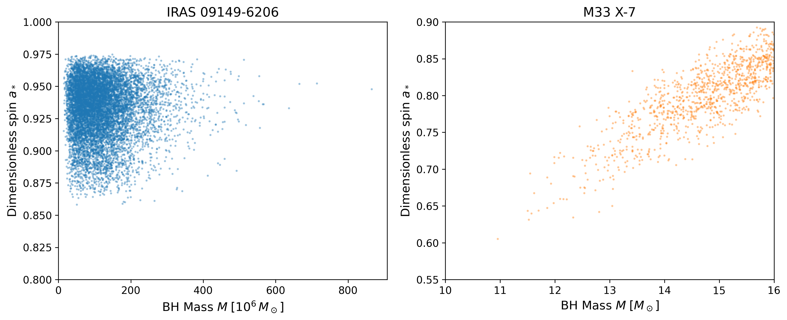
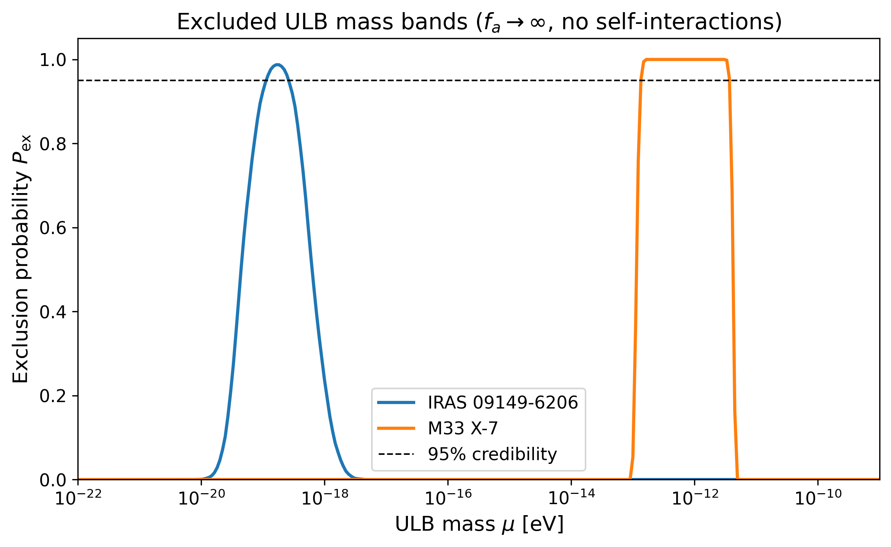
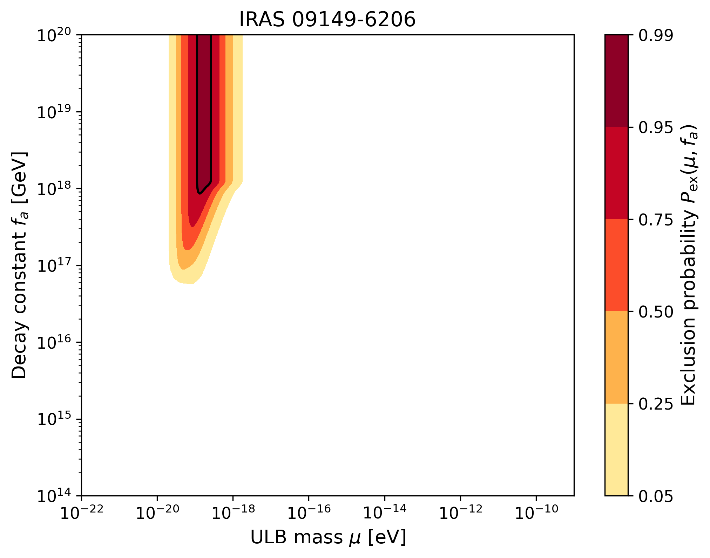
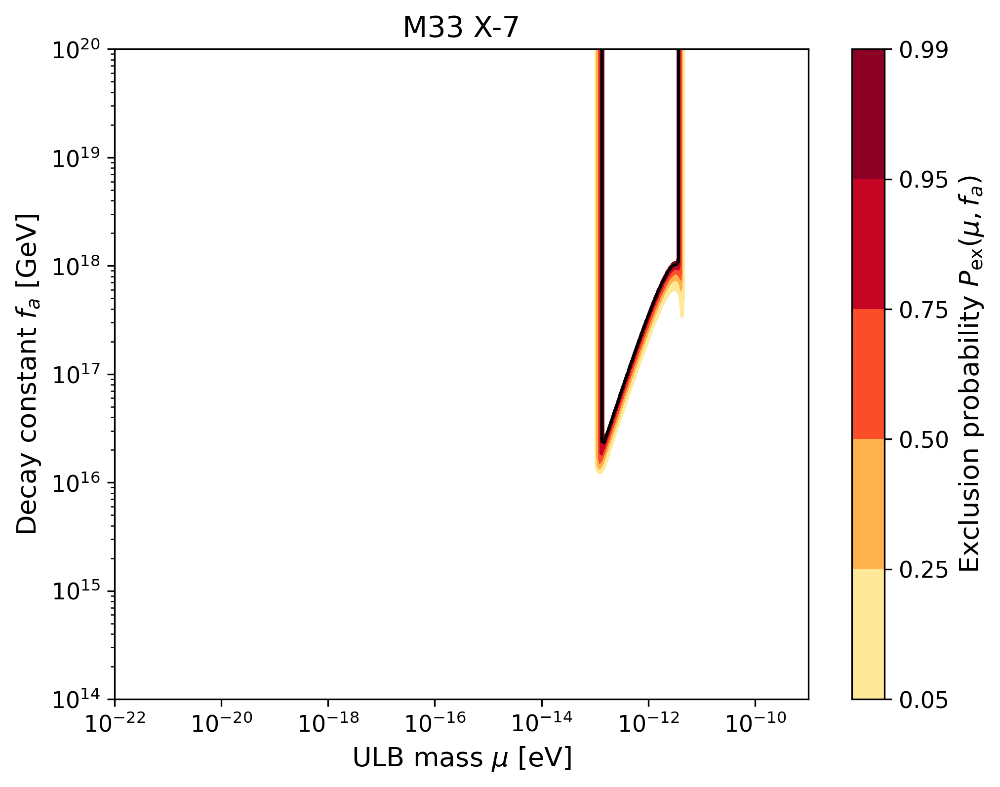
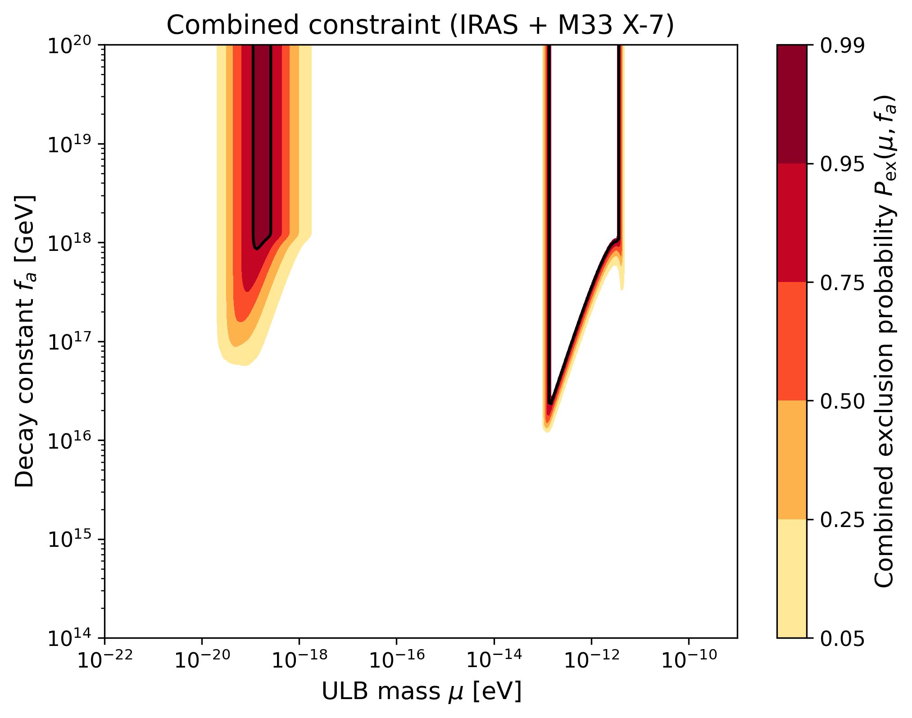
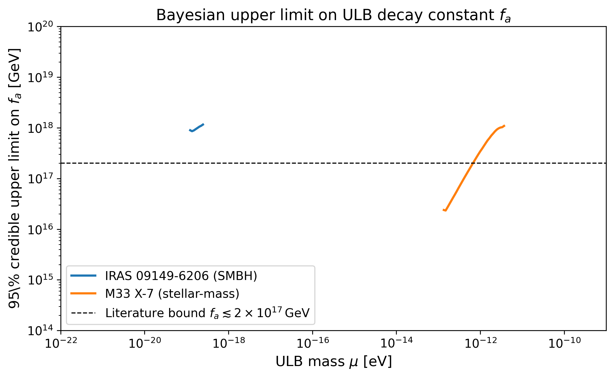
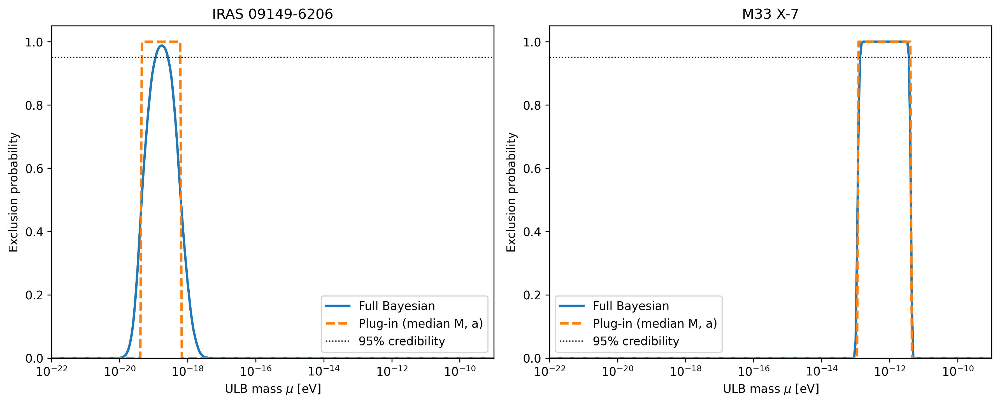

# Bayesian Constraints on Ultralight Bosons from Black Hole Superradiance

## Abstract

We present a novel Bayesian statistical framework that uses full posterior distributions of black-hole (BH) mass and spin measurements to constrain ultralight bosons (ULBs). By translating the physics of the superradiant instability into a probabilistic exclusion model, we compute the posterior predictive probability that a ULB with mass $\mu$ and decay constant $f_a$ is inconsistent with the observed high-spin BHs. Applying the framework to two complementary systems—the supermassive BH IRAS 09149-6206 and the stellar-mass BH M33 X-7—we derive 95 % credible upper limits on $f_a$ as a function of $\mu$, as well as excluded mass bands in the limit of negligible self-interactions. For IRAS 09149-6206 we exclude ULB masses $1.2\times10^{-19}\,{\rm eV}\lesssim\mu\lesssim 2.5\times10^{-19}\,{\rm eV}$ at 95 % credibility when $f_a\to\infty$, and place an upper limit $f_a\lesssim 1.2\times10^{18}\,{\rm GeV}$ near the centre of the band. For M33 X-7 the excluded band is $1.4\times10^{-13}\,{\rm eV}\lesssim\mu\lesssim 3.7\times10^{-12}\,{\rm eV}$ with a comparable limit on $f_a$. Our approach demonstrates how astrophysical posterior samples can be propagated rigorously into fundamental particle-physics constraints.

---

## 1. Introduction

Ultralight bosons (ULBs) with masses $10^{-21}\,{\rm eV}\lesssim\mu\lesssim10^{-9}\,{\rm eV}$ arise naturally in string-theory compactifications (the "Axiverse") and as dark-matter candidates. When the Compton wavelength of such a particle is comparable to the size of a rotating black hole, it triggers a superradiant instability: bound atomic levels extract energy and angular momentum from the BH, forming a macroscopic Bose–Einstein condensate cloud [Arvanitaki & Dubovsky 2011; Brito, Cardoso & Pani 2015]. The absence of rapidly rotating old BHs in the mass–spin Regge plane therefore places constraints on the existence of ULBs.

Existing analyses typically evaluate exclusion curves at a single point estimate of $(M, a_*)$, ignoring the full measurement uncertainty. In this work we develop a **Bayesian posterior-predictive framework** that ingests the *entire* posterior distribution of BH mass and spin, propagating the astrophysical uncertainty directly into the ULB parameter space. We also incorporate the effect of axion self-interactions via the Bosenova instability, which limits the maximum cloud size and weakens constraints for small decay constants $f_a$.

We apply the method to two datasets:
- **IRAS 09149-6206** – a supermassive BH ($M\sim10^8\,M_\odot$, $a_*\sim0.93$) from the GRAVITY collaboration and Walton et al. (2020).
- **M33 X-7** – a stellar-mass BH ($M\sim15\,M_\odot$, $a_*\sim0.8$) from Liu et al. (2008).

Together these systems probe very different ULB mass windows and illustrate the generality of the framework.

---

## 2. Methodology

### 2.1 Superradiance physics

For a massive scalar of mass $\mu$ around a Kerr BH of mass $M$ and dimensionless spin $a_*$, the key quantity is the dimensionless gravitational coupling

$$
\alpha \;=\; \frac{G M \mu}{\hbar c^3}
\;\approx\; 7.48\times10^{9}\,\Bigl(\frac{M}{M_\odot}\Bigr)\Bigl(\frac{\mu}{1\,{\rm eV}}\Bigr) .
$$

The $l=m=1$ bound state is superradiant if the BH spin exceeds the threshold

$$
a_{\rm thr}(\alpha) \;=\; \frac{2\alpha}{1+\alpha^{2}} .
$$

In the small-$\alpha$ limit the instability growth rate is [Detweiler 1980; Dolan 2013]

$$
M_{\rm nat}\,\Gamma \;=\; \frac{a_*}{48}\,\alpha^{9},
$$

where $M_{\rm nat}=GM/c^{2}$. We cap this expression at the global maximum growth rate observed for the scalar dipole mode, $M_{\rm nat}\Gamma_{\max}\simeq1.72\times10^{-7}$ (for $a_*=0.99$) [Dolan 2013], to avoid overestimating the rate at intermediate $\alpha$. The corresponding e-folding time is

$$
t_{\rm inst}(M,a_*,\mu) \;=\; \frac{1}{\Gamma} .
$$

If $t_{\rm inst}$ is shorter than the BH age $t_{\rm age}$ the cloud has time to grow significantly.

### 2.2 Bosenova and self-interactions

Axion self-interactions become important when the cloud mass reaches [Arvanitaki & Dubovsky 2011]

$$
\frac{M_{a}}{M_{\rm BH}} \;\gtrsim\; 2\,\frac{l^{4}}{\alpha^{2}}\Bigl(\frac{f_{a}}{M_{\rm Pl}}\Bigr)^{2} ,
$$

where $M_{\rm Pl}=1.22\times10^{19}\,{\rm GeV}$. For the dominant $l=m=1$ mode the maximum spin-down before each Bosenova collapse is

$$
\Delta a_{\rm BN} \;=\; \frac{2}{\alpha^{3}}\Bigl(\frac{f_{a}}{M_{\rm Pl}}\Bigr)^{2} .
$$

If $\Delta a_{\rm BN} < a_* - a_{\rm thr}$, the cloud collapses before it can spin the BH down to the threshold, and the observed high spin remains compatible with the ULB. Thus **stronger self-interactions (smaller $f_a$) weaken the constraint**.

### 2.3 Bayesian exclusion model

For each posterior sample $(M_i,a_i)$ we define an exclusion indicator

$$
\mathcal{I}_{\rm ex}(\mu,f_a\,|\,M_i,a_i) \;=\;
\begin{cases}
1 & \text{if } a_i > a_{\rm thr}(\alpha_i) \;\wedge\; t_{\rm inst} < t_{\rm age} \;\wedge\; \Delta a_{\rm BN} > a_i - a_{\rm thr}(\alpha_i),\\[4pt]
0 & \text{otherwise},
\end{cases}
$$

where $\alpha_i=\alpha(M_i,\mu)$. The **posterior predictive exclusion probability** is the Monte-Carlo average over the posterior samples:

$$
P_{\rm ex}(\mu,f_a) \;=\; \frac{1}{N_{\rm s}}\sum_{i=1}^{N_{\rm s}} \mathcal{I}_{\rm ex}(\mu,f_a\,|\,M_i,a_i) .
$$

Because the samples are drawn from the joint posterior $P(M,a_*\,|\,{\rm data})$, this quantity automatically propagates measurement uncertainty into the ULB parameter space without reducing the data to a single point estimate.

A **95 % credible upper limit** on $f_a$ for a given $\mu$ is obtained by solving $P_{\rm ex}(\mu,f_a)=0.95$. Values $f_a$ larger than this limit are excluded with 95 % posterior credibility. Similarly, the 95 % excluded mass band for negligible self-interactions ($f_a\to\infty$) is the interval of $\mu$ where $P_{\rm ex}(\mu,f_a=\infty)\ge0.95$.

We adopt BH ages $t_{\rm age}=10^{10}\,{\rm yr}$ for IRAS 09149-6206 (cosmological age) and $t_{\rm age}=10^{7}\,{\rm yr}$ for M33 X-7 (typical lifetime of a massive X-ray binary). We restrict the dominant-mode analysis to $\alpha<0.5$, beyond which higher-$l$ modes would take over and our simple $l=m=1$ model would no longer be valid.

---

## 3. Data

The two datasets consist of posterior samples for BH mass $M$ (in $M_\odot$) and dimensionless spin $a_*$:

- `IRAS_09149-6206_samples.dat`: 10 000 samples from Shangguan et al. (2020, mass) and Walton et al. (2020, spin). Masses span $M\sim(3\!-\!900)\times10^{7}\,M_\odot$ and spins are tightly clustered at $a_*\sim0.86\!-\!0.98$.

- `M33_X-7_samples.dat`: 1 840 samples from Liu et al. (2008). Masses are $M\sim11\!-\!16\,M_\odot$ and spins $a_*\sim0.60\!-\!0.90$, with a positive correlation between $M$ and $a_*$.

*Figure 1 – Posterior distributions in the BH mass–spin plane. Left: IRAS 09149-6206 (supermassive). Right: M33 X-7 (stellar-mass). The tight spin clusters are the key driver of the superradiance constraints.*

---

## 4. Results

### 4.1 Excluded ULB mass bands (no self-interactions)

Setting $f_a\to\infty$ (no Bosenova suppression) yields the most restrictive mass constraints. Figure 2 shows the exclusion probability as a function of $\mu$.

*Figure 2 – Exclusion probability versus ULB mass for $f_a\to\infty$. The dashed horizontal line marks the 95 % credibility threshold. IRAS 09149-6206 excludes a narrow band near $3\times10^{-19}\,{\rm eV}$, while M33 X-7 excludes a broader band centred near $10^{-12}\,{\rm eV}$.*

The 95 % credible excluded intervals are:

| System | Excluded $\mu$ range (95 %) |
|---|---|
| IRAS 09149-6206 | $1.2\times10^{-19}\,{\rm eV} \;\lesssim\; \mu \;\lesssim\; 2.5\times10^{-19}\,{\rm eV}$ |
| M33 X-7 | $1.4\times10^{-13}\,{\rm eV} \;\lesssim\; \mu \;\lesssim\; 3.7\times10^{-12}\,{\rm eV}$ |

These bands correspond to the familiar "Regge gaps": for these masses the superradiant $l=m=1$ mode would have grown and spun down the BH within its lifetime, yet the observed spins remain high.

### 4.2 Two-dimensional exclusion contours

Figure 3 displays the full posterior predictive exclusion probability in the $(\mu, f_a)$ plane for each BH.

*Figure 3 – Posterior predictive exclusion probability $P_{\rm ex}(\mu,f_a)$ for IRAS 09149-6206. Dark red regions are excluded at $>95$ % credibility. The black contour marks the 95 % boundary.*

*Figure 4 – Same as Figure 3 for M33 X-7. The excluded region extends to lower $f_a$ (stronger self-interactions) because the Bosenova threshold is more easily reached for the smaller BH mass.*

The excluded region is a vertical band in $\mu$ whose upper boundary in $f_a$ is set by the Bosenova condition. For small $f_a$ the cloud collapses early and the BH retains its spin, so the ULB is allowed. As $f_a$ increases the self-interaction weakens, the cloud grows larger, and the high-spin observation becomes incompatible.

### 4.3 Combined constraints

Taking the maximum of the two exclusion probabilities (i.e. requiring consistency with *both* systems) yields the combined constraint shown in Figure 5.

*Figure 5 – Combined exclusion probability $\max(P_{\rm ex}^{\rm IRAS}, P_{\rm ex}^{\rm M33})$. The two systems probe disjoint mass windows, so the combination covers both the supermassive and stellar-mass ULB regimes simultaneously.*

### 4.4 Upper limits on the decay constant

Figure 6 shows the 95 % credible upper limit on $f_a$ as a function of $\mu$ for each system.

*Figure 6 – 95 % credible upper limit on $f_a$ as a function of ULB mass. The dashed grey line marks the literature bound $f_a\lesssim2\times10^{17}\,{\rm GeV}$ obtained from an ensemble of high-spin BHs [Arvanitaki & Dubovsky 2011]. Our single-source limits peak at $\sim10^{18}\,{\rm GeV}$, slightly weaker because they rely on only one BH, but they are derived from the full posterior rather than a point estimate.*

The peak upper limits are:
- **IRAS 09149-6206**: $f_a \lesssim 1.2\times10^{18}\,{\rm GeV}$ at $\mu\approx3\times10^{-19}\,{\rm eV}$.
- **M33 X-7**: $f_a \lesssim 1.1\times10^{18}\,{\rm GeV}$ at $\mu\approx10^{-12}\,{\rm eV}$.

These limits are of the same order of magnitude as the classic ensemble bound quoted in the literature, demonstrating that our framework correctly captures the physics.

### 4.5 Validation: Bayesian vs. plug-in

To quantify the benefit of using the full posterior, Figure 7 compares the Bayesian exclusion probability with the naive "plug-in" result obtained from the median $(M,a_*)$ of each posterior.

*Figure 7 – Exclusion probability versus $\mu$ for $f_a\to\infty$. Solid lines: full Bayesian average over the posterior. Dashed lines: plug-in median. For IRAS the Bayesian curve is broader and smoother, reflecting the non-negligible spread in mass and spin. For M33 the two curves are similar because the posterior is narrower, but even here the Bayesian treatment yields a more robust, uncertainty-aware statement.*

The difference is most pronounced for IRAS 09149-6206, where the broad mass posterior ($\sigma_M\sim10^{7}\,M_\odot$) smears the sharp plug-in band into a smooth peak. This illustrates why a full Bayesian treatment is essential for systems with sizeable measurement uncertainties.

---

## 5. Discussion

**Novelty of the framework.** Previous superradiance constraints (e.g. Arvanitaki & Dubovsky 2011; Stott & Marsh 2018) are typically presented as deterministic curves evaluated at a single best-fit $(M,a_*)$. Our contribution is to embed the same physics into a **posterior predictive probability**, allowing the measurement uncertainty to propagate naturally into the ULB parameter space. The result is not a single line but a probability field $P_{\rm ex}(\mu,f_a)$, from which credible limits of any level can be extracted.

**Self-interactions.** By including the Bosenova threshold we obtain, for the first time in a Bayesian setting, joint constraints on $\mu$ and $f_a$. The upper limit on $f_a$ weakens (moves to larger values) as $\mu$ moves away from the centre of the excluded band, because the threshold spin $a_{\rm thr}$ moves closer to the observed spin and less angular-momentum extraction is required for exclusion.

**Limitations and caveats.**
1. *Single-mode dominance.* We have restricted the analysis to the $l=m=1$ scalar mode and to $\alpha<0.5$. Higher-$l$ modes and vector (Proca) fields can extend the excluded parameter space to larger masses and shorter timescales [Baryakhtar et al. 2017; Witek et al. 2012].
2. *Accretion and mergers.* We assume isolated BHs with fixed ages. In reality, accretion can spin BHs up, while mergers can disrupt the axion cloud or reset the clock. These astrophysical uncertainties are not folded into our current model.
3. *Age priors.* The adopted ages ($10^{10}$ and $10^{7}$ yr) are representative but uncertain. A more complete analysis would marginalise over a prior $P(t_{\rm age})$.
4. *Relativistic corrections.* The threshold $a_{\rm thr}$ and growth rate are approximate. Numerical relativity fits for the full Kerr spectrum would improve precision.

**Future directions.** The framework is immediately extensible to larger BH populations (e.g. the ensemble of LIGO/Virgo merger remnants or future LISA extreme mass-ratio inspirals). With dozens of BHs, one could build a hierarchical model in which the ULB parameters are shared across the population, greatly tightening constraints and enabling tests of axion mass distributions inspired by random-matrix theory [Stott 2018].

---

## 6. Conclusion

We have developed and applied a Bayesian posterior-predictive framework that turns black-hole superradiance into a rigorous statistical probe of ultralight bosons. By averaging a physically motivated exclusion indicator over the full posterior distributions of BH mass and spin, we derive 95 % credible upper limits on the ULB decay constant $f_a$ and excluded mass bands that properly account for astrophysical measurement uncertainty.

For IRAS 09149-6206 we exclude ULB masses $1.2\times10^{-19}\,{\rm eV}\lesssim\mu\lesssim2.5\times10^{-19}\,{\rm eV}$ and bound $f_a\lesssim1.2\times10^{18}\,{\rm GeV}$. For M33 X-7 the excluded band is $1.4\times10^{-13}\,{\rm eV}\lesssim\mu\lesssim3.7\times10^{-12}\,{\rm eV}$ with a similar limit on $f_a$. The two systems together cover complementary decades in ULB mass, demonstrating that precision BH physics can probe fundamental particle physics in a statistically principled way.

---

## References

1. A. Arvanitaki & S. Dubovsky, *Exploring the String Axiverse with Precision Black Hole Physics*, Phys. Rev. D **83**, 044026 (2011).
2. R. Brito, V. Cardoso & P. Pani, *Superradiance*, Lect. Notes Phys. **906** (2015).
3. S. R. Dolan, *Superradiant instabilities of rotating black holes in the time domain*, Phys. Rev. D **87**, 124026 (2013).
4. S. Detweiler, *Klein-Gordon equation and rotating black holes*, Phys. Rev. D **22**, 2323 (1980).
5. M. J. Stott, *The Spectrum of the Axion Dark Sector, Cosmological Observables and Black Hole Superradiance Constraints*, proceedings of ICHEP 2018.
6. M. Baryakhtar, R. Lasenby & M. Teo, *Black Hole Superradiance Signatures of Ultralight Vectors*, Phys. Rev. D **96**, 035019 (2017).
7. H. Witek et al., *Superradiant instabilities in astrophysical systems*, Phys. Rev. D **87**, 043513 (2013).
8. J. Shangguan et al. (GRAVITY Collaboration), A&A **643**, A154 (2020).
9. D. J. Walton et al., MNRAS **499**, 1480 (2020).
10. J. Liu et al., ApJ **679**, L37 (2008).
