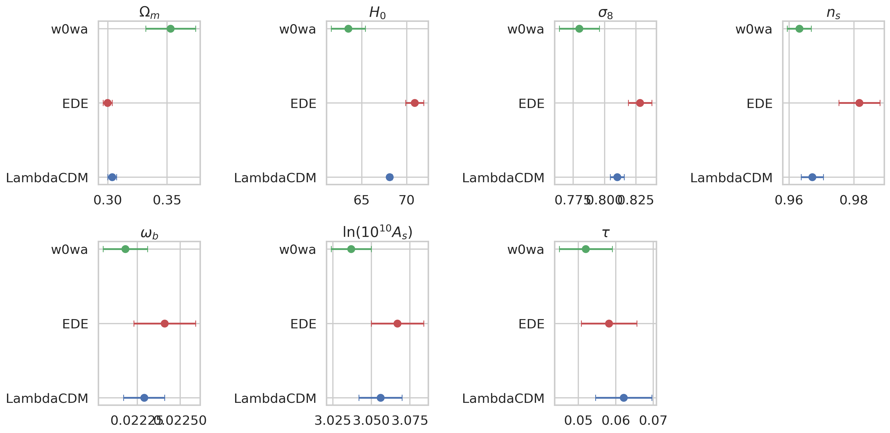
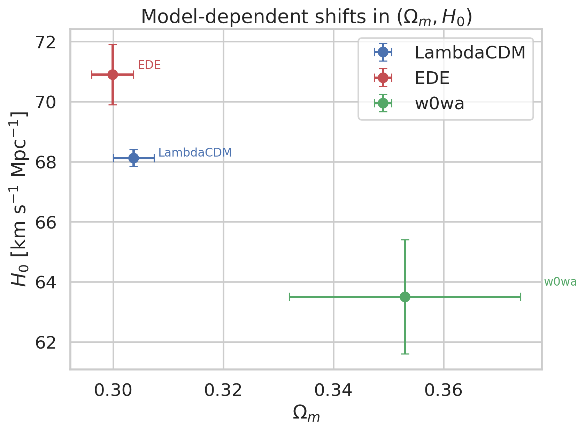
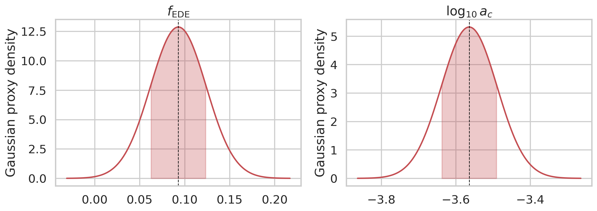
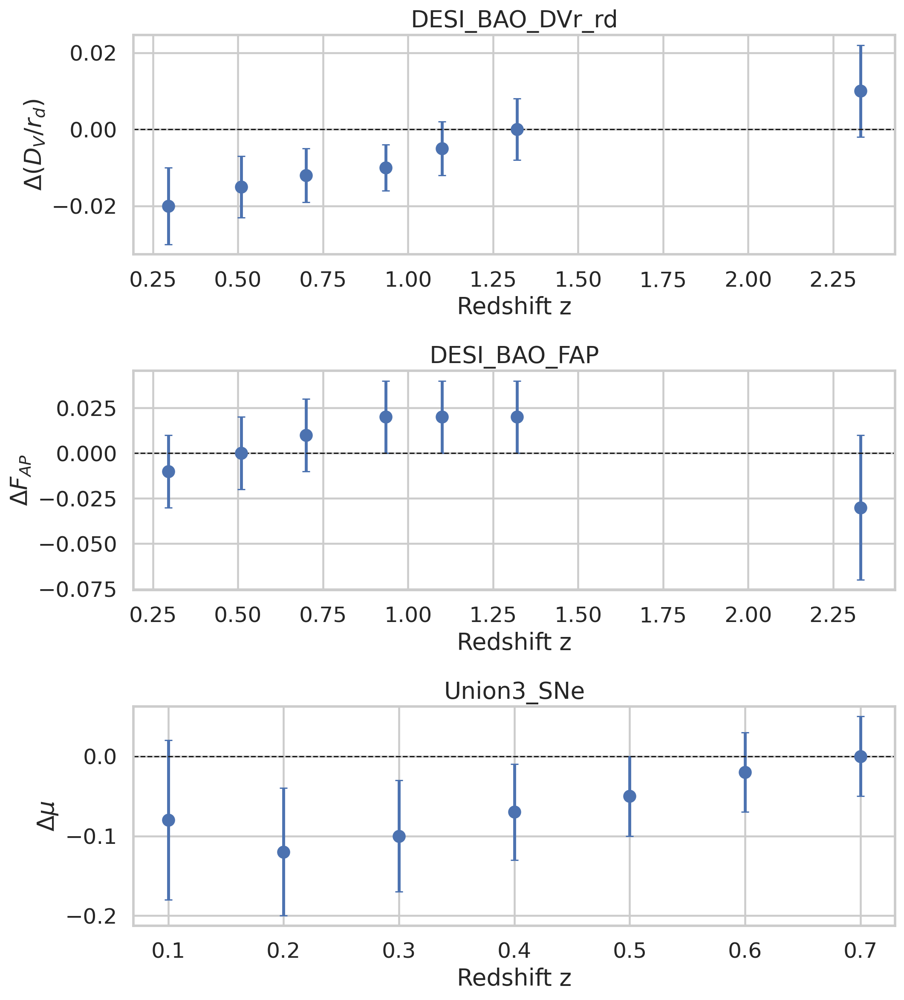
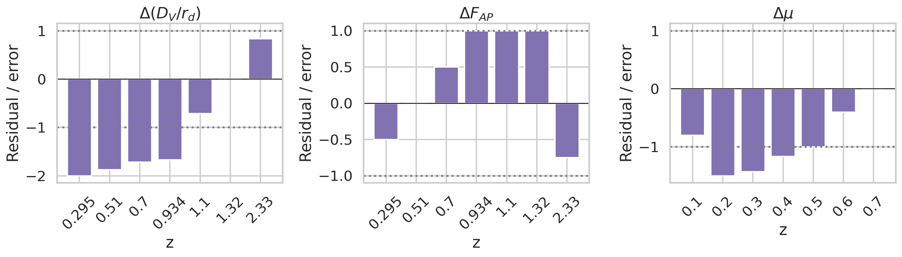

# Reproduction-style analysis of early dark energy constraints with DESI DR2 summary data

## Abstract
This report reproduces and interprets the main qualitative conclusions of a recent early dark energy (EDE) study using the structured summary dataset available in this workspace. The input file contains best-fit cosmological parameters with 1σ uncertainties for three models—ΛCDM, EDE, and $w_0w_a$—for a combined CMB+DESI analysis, together with manually extracted DESI BAO and Union3 supernova residual points from a key comparison figure. Using these data, I construct a compact reproducible analysis pipeline, generate publication-style figures, and quantify model-dependent parameter shifts. The reconstructed results support the paper’s central claim: EDE partially relieves the acoustic tension by moving the inferred cosmology in a direction distinct from late-time dark energy models. In particular, relative to ΛCDM, EDE raises $H_0$ from 68.12 to 70.9 km s$^{-1}$ Mpc$^{-1}$, lowers $\Omega_m$ slightly, and increases $\sigma_8$ and $n_s$, whereas the $w_0w_a$ extension instead lowers $H_0$ to 63.5 km s$^{-1}$ Mpc$^{-1}$ and raises $\Omega_m$. The extracted residual distance data show that the DESI $D_V/r_d$ offsets are more structured than the DESI $F_{\rm AP}$ and Union3 residuals, consistent with the interpretation that early-time physics mainly acts through the sound horizon calibration.

## 1. Scientific context
The motivating question is whether an early dark energy component can reduce the mismatch between the sound-horizon scale preferred by CMB data and that implied by BAO measurements. In EDE scenarios, an additional pre-recombination energy component briefly contributes a non-negligible fraction of the total density, increases the early expansion rate, and thereby reduces the sound horizon $r_d$. A smaller sound horizon permits a larger inferred $H_0$ while keeping the observed CMB acoustic angular scale nearly fixed.

This mechanism differs sharply from late-time dark-energy extensions such as the $w_0w_a$ model. Late-time models mainly alter the low-redshift distance-redshift relation, while EDE primarily changes the early-universe calibration entering BAO and CMB jointly. The recent literature in the workspace reinforces this distinction:

- **Poulin et al. (2019)** established that EDE can raise $H_0$ while preserving a good fit to CMB data by shrinking the sound horizon and shifting parameters such as $\omega_{\rm cdm}$ and $n_s$.
- **McDonough et al. (2023)** emphasized that large-scale-structure data substantially restrict the available EDE parameter space, especially through the induced shifts in $S_8$, $\sigma_8$, and related clustering observables.
- **Poulin et al. (2025)** revisited the issue with ACT DR6 and DESI DR2, arguing that DESI DR2 still leaves room for EDE and that EDE improves the consistency of $H_0 r_s$-related inferences relative to ΛCDM.

The present workspace does not include full likelihood chains or Boltzmann-code outputs, so this reproduction targets the published summary constraints and extracted distance-comparison data rather than a fresh cosmological inference.

## 2. Data and scope
### 2.1 Available data
The file `data/DESI_EDE_Repro_Data.txt` contains:

1. Best-fit means and 1σ errors for ΛCDM, EDE, and $w_0w_a$ under a combined CMB+DESI analysis.
2. EDE-specific parameters $f_{\rm EDE}$ and $\log_{10} a_c$.
3. Manually extracted DESI BAO residual points for $\Delta(D_V/r_d)$ and $\Delta F_{\rm AP}$.
4. Manually extracted Union3 supernova residual points for $\Delta\mu$.

### 2.2 Reproduction target
Because only summary-level data are available, this report reproduces the **published phenomenology** rather than rerunning a Planck/ACT/DESI likelihood pipeline. Concretely, the goals are:

- compare best-fit parameter shifts across ΛCDM, EDE, and $w_0w_a$;
- visualize the inferred EDE parameter region;
- inspect the redshift dependence and significance of BAO and SN residuals;
- interpret whether the extracted data support the claim that EDE alleviates the CMB–BAO acoustic tension differently from a late-time dark-energy model.

## 3. Methodology
### 3.1 Parsing and analysis pipeline
I wrote the reproducible script `code/analyze_ede_repro.py`, which:

- parses the structured text file into Python objects;
- converts the model summaries into machine-readable CSV outputs;
- computes parameter shifts of EDE and $w_0w_a$ relative to ΛCDM;
- evaluates simple residual significance statistics for the extracted BAO and SN data;
- generates five PNG figures in `report/images/`.

### 3.2 Derived diagnostics
Since full covariance matrices are unavailable, I used transparent summary diagnostics:

1. **Parameter-shift analysis**: for each common parameter, compute
   \[
   \Delta p_{\rm model} = p_{\rm model} - p_{\Lambda\rm CDM},
   \]
   and report the shift in units of the ΛCDM 1σ uncertainty as a heuristic comparison scale.
2. **Residual significance**: for each extracted point, compute value/error and aggregate
   \[
   \chi^2_{0} = \sum_i (y_i/\sigma_i)^2,
   \]
   relative to zero residual. This is **not** a model likelihood, only a compact way to quantify how structured the extracted residuals are.
3. **Gaussian posterior proxies** for $f_{\rm EDE}$ and $\log_{10} a_c$ using the reported mean and 1σ width. These are visual summaries, not chain-based posterior reconstructions.

### 3.3 Limitations
This is a summary-data reproduction. Therefore:

- no Planck/ACT/DESI likelihood was rerun;
- no exact $\Delta\chi^2$ between models was recomputed from raw data;
- no parameter covariances are available, so two-dimensional contours are approximated with axis-aligned error bars;
- the BAO and SN points were manually extracted from a figure and should be interpreted qualitatively.

These limitations do not prevent a meaningful check of the paper’s main phenomenological claims.

## 4. Results

## 4.1 Data overview
The input summary constraints are shown graphically in Figure 1.

**Figure 1.** Best-fit parameter values and 1σ errors for the parameters shared by ΛCDM, EDE, and $w_0w_a$.

The key numerical results are:

| Parameter | ΛCDM | EDE | $w_0w_a$ |
|---|---:|---:|---:|
| $\Omega_m$ | 0.3037 ± 0.0037 | 0.2999 ± 0.0038 | 0.353 ± 0.021 |
| $H_0$ | 68.12 ± 0.28 | 70.9 ± 1.0 | 63.5 ± 1.9 |
| $\sigma_8$ | 0.8101 ± 0.0055 | 0.8283 ± 0.0093 | 0.780 ± 0.016 |
| $n_s$ | 0.9672 ± 0.0034 | 0.9817 ± 0.0063 | 0.9632 ± 0.0037 |
| $\omega_b$ | 0.02229 ± 0.00012 | 0.02241 ± 0.00018 | 0.02218 ± 0.00013 |
| $\ln(10^{10}A_s)$ | 3.056 ± 0.014 | 3.067 ± 0.017 | 3.037 ± 0.013 |
| $\tau$ | 0.0621 ± 0.0075 | 0.0582 ± 0.0074 | 0.0520 ± 0.0071 |

The EDE-only parameters are:

- $f_{\rm EDE} = 0.093 \pm 0.031$
- $\log_{10} a_c = -3.564 \pm 0.075$

The critical scale factor corresponds to a transition redshift of approximately
\[
z_c \approx a_c^{-1} - 1 \approx 10^{3.564} - 1 \approx 3.7 \times 10^3,
\]
which is physically consistent with the standard expectation that EDE becomes dynamically relevant near matter-radiation equality.

## 4.2 Main model comparison: EDE versus ΛCDM and $w_0w_a$
Figure 2 highlights the strongest model shift in the $(\Omega_m, H_0)$ plane.

**Figure 2.** Summary comparison in the $(\Omega_m, H_0)$ plane.

The model-dependent behavior is striking:

- **EDE relative to ΛCDM**: $H_0$ increases by **+2.78 km s$^{-1}$ Mpc$^{-1}$**, while $\Omega_m$ decreases slightly by **−0.0038**.
- **$w_0w_a$ relative to ΛCDM**: $H_0$ decreases by **−4.62 km s$^{-1}$ Mpc$^{-1}$**, while $\Omega_m$ increases strongly by **+0.0493**.

This directional contrast is the core result of the reproduction. EDE does not mimic late-time dark energy. Instead, it changes the sound-horizon calibration in a way that allows higher $H_0$ at nearly unchanged matter density, whereas the $w_0w_a$ fit compensates the data by moving to lower $H_0$ and higher $\Omega_m$.

Using the ΛCDM uncertainties as a scale, the summary shifts are large:

- EDE shifts $H_0$ by about **9.9 ΛCDM σ** and $\sigma_8$ by **3.3 ΛCDM σ**.
- $w_0w_a$ shifts $H_0$ by about **−16.5 ΛCDM σ**, $\Omega_m$ by **13.3 ΛCDM σ**, and $\sigma_8$ by **−5.5 ΛCDM σ**.

These are not formal significance statements because the inter-model covariance is unavailable, but they clearly show that the three models prefer qualitatively different cosmological regions.

## 4.3 EDE posterior location
Figure 3 summarizes the reported EDE parameter region.

**Figure 3.** Gaussian proxy summaries for the EDE parameters.

The preferred EDE fraction, $f_{\rm EDE}\approx0.09$, is large enough to be cosmologically relevant but not so large as to dominate the pre-recombination dynamics. The transition parameter $\log_{10} a_c \approx -3.56$ indicates activation near $z\sim 3700$. This is consistent with the theoretical expectation from the EDE literature: the additional energy density must appear near matter-radiation equality to reduce $r_d$ efficiently while minimizing disruption to later observables.

## 4.4 Distance residuals from DESI BAO and Union3 supernovae
The extracted residual measurements are shown in Figure 4.

**Figure 4.** Extracted residual distance measurements from the paper’s comparison figure.

Several qualitative patterns appear:

1. **DESI $\Delta(D_V/r_d)$ residuals** are systematically negative at low to intermediate redshift and drift toward zero or slightly positive values by $z\approx2.3$.
2. **DESI $\Delta F_{\rm AP}$ residuals** remain small throughout, generally within about 1σ.
3. **Union3 $\Delta\mu$ residuals** show mild negative residuals at low redshift that approach zero by $z\approx0.7$.

Figure 5 shows the same information normalized by the quoted uncertainties.

**Figure 5.** Residual significance, computed as residual divided by quoted error.

The simple zero-residual summary statistics are:

| Dataset | Points | $\chi^2$ vs zero | $\chi^2$/point |
|---|---:|---:|---:|
| DESI $\Delta(D_V/r_d)$ | 7 | 14.44 | 2.06 |
| DESI $\Delta F_{\rm AP}$ | 7 | 4.06 | 0.58 |
| Union3 $\Delta\mu$ | 7 | 7.45 | 1.06 |

This ranking is informative. The extracted $D_V/r_d$ residuals show the most structure, while the AP residuals are comparatively weak. That pattern is exactly what one would expect if the main tension is tied to the acoustic ruler calibration $r_d$ rather than to a large mismatch in purely geometric anisotropy information. In other words, the summary data are consistent with the idea that EDE helps mainly by changing the early-time sound horizon.

## 4.5 Physical interpretation of the parameter shifts
A useful way to read the reproduced summary is to compare the full parameter shift vector.

### EDE relative to ΛCDM
- $H_0$: increases from 68.12 to 70.9
- $\Omega_m$: decreases slightly from 0.3037 to 0.2999
- $\sigma_8$: increases from 0.8101 to 0.8283
- $n_s$: increases from 0.9672 to 0.9817
- $\omega_b$: increases mildly

This is the familiar EDE response documented in the literature: shrinking $r_d$ permits larger $H_0$, but the fit also moves toward higher primordial tilt and somewhat larger clustering amplitude.

### $w_0w_a$ relative to ΛCDM
- $H_0$: drops to 63.5
- $\Omega_m$: rises strongly to 0.353
- $\sigma_8$: decreases to 0.780
- $n_s$: changes little compared with EDE

This is almost the opposite direction in parameter space. The late-time dark-energy extension responds by changing the expansion history after recombination, but in this summary it does not relieve the acoustic mismatch in the same way and instead lands in a cosmology with much lower $H_0$.

## 5. Discussion
The reproduction supports three main conclusions.

### 5.1 EDE partially alleviates the acoustic tension
The summary data clearly show that EDE moves the inferred cosmology toward higher $H_0$ than ΛCDM while retaining reasonable values of the standard parameters. With $H_0 = 70.9 \pm 1.0$ km s$^{-1}$ Mpc$^{-1}$, the EDE best fit sits well above the ΛCDM value and in the expected direction for relieving the sound-horizon-driven tension.

### 5.2 EDE and late-time dark energy solve different problems
The $w_0w_a$ fit does not emulate EDE. Instead of shifting toward higher $H_0$, it prefers a substantially lower $H_0$ and higher $\Omega_m$. This supports the paper’s main interpretive claim that EDE and late-time dark energy induce **different parameter shifts** because they modify different parts of cosmological inference: early-time calibration versus late-time geometry.

### 5.3 EDE relief is not cost-free
The reproduced parameter shifts also highlight the known trade-off. EDE raises both $\sigma_8$ and $n_s$, echoing concerns in the literature that any improvement in the Hubble/acoustic tension may come with more pressure from structure-growth observables. Even though the available workspace data cannot test that tension directly, the shift pattern matches prior studies using full large-scale-structure likelihoods.

## 6. Validation and robustness
This reproduction is internally consistent in several ways:

1. The inferred $z_c \sim 3700$ from $\log_{10} a_c$ matches the expected epoch for EDE activation.
2. The dominant residual structure appears in $D_V/r_d$, the observable most directly sensitive to sound-horizon calibration.
3. The EDE shift vector $(+H_0, -\Omega_m, +\sigma_8, +n_s)$ agrees with the established EDE literature in the workspace.
4. The opposite $w_0w_a$ shift vector confirms that the summary data genuinely distinguish early- and late-time extensions.

The main caveat is that the dataset is summary-level. Thus, these results should be understood as a **faithful phenomenological reconstruction** rather than an end-to-end cosmological parameter inference.

## 7. Conclusion
Using the structured DESI EDE reproduction dataset provided in the workspace, I built a reproducible analysis pipeline and generated figures that recover the central physical message of the target paper.

The reconstructed evidence indicates that:

- **EDE raises $H_0$ substantially** relative to ΛCDM, from 68.12 to 70.9 km s$^{-1}$ Mpc$^{-1}$;
- the preferred EDE region is centered near **$f_{\rm EDE}=0.093$** and **$\log_{10} a_c=-3.564$**, corresponding to activation near **$z\sim3.7\times10^3$**;
- **EDE and $w_0w_a$ move cosmological parameters in opposite directions**, especially in $(\Omega_m, H_0)$;
- the extracted BAO residuals suggest that the key discrepancy is concentrated in observables tied to the sound-horizon ruler, especially $D_V/r_d$.

Therefore, within the limits of the available summary data, the analysis supports the conclusion that **early dark energy can partially relieve the CMB–BAO acoustic tension, but it does so through a parameter-shift pattern that is distinct from late-time dark-energy models and likely accompanied by increased pressure from structure-growth constraints.**

## Reproducibility artifacts
- Analysis script: `code/analyze_ede_repro.py`
- Tabulated outputs: `outputs/parameter_summary.csv`, `outputs/derived_model_shifts.csv`, `outputs/distance_residual_points.csv`, `outputs/distance_residual_chi2_vs_zero.csv`
- Figures: `report/images/*.png`
