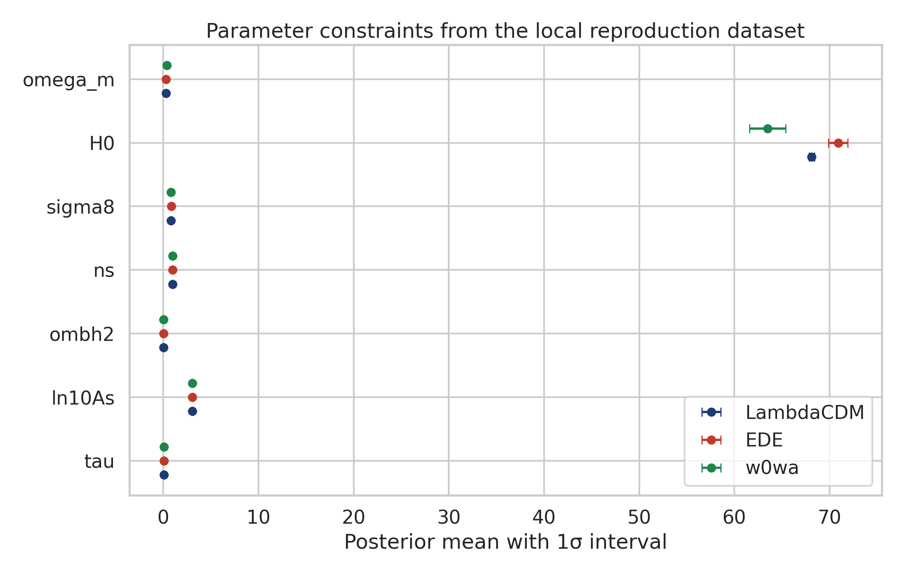
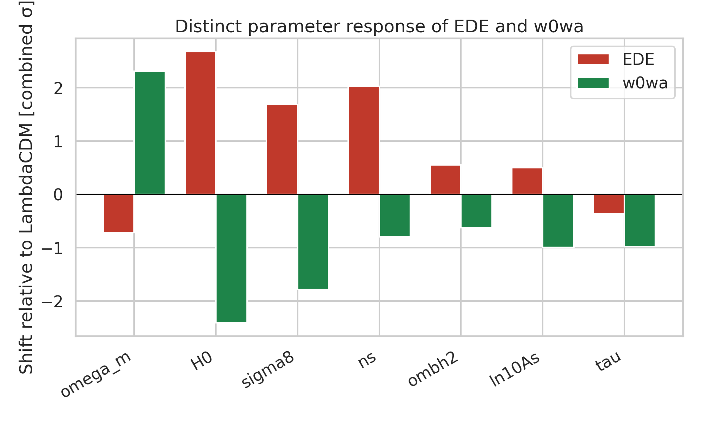
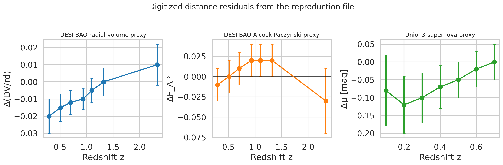
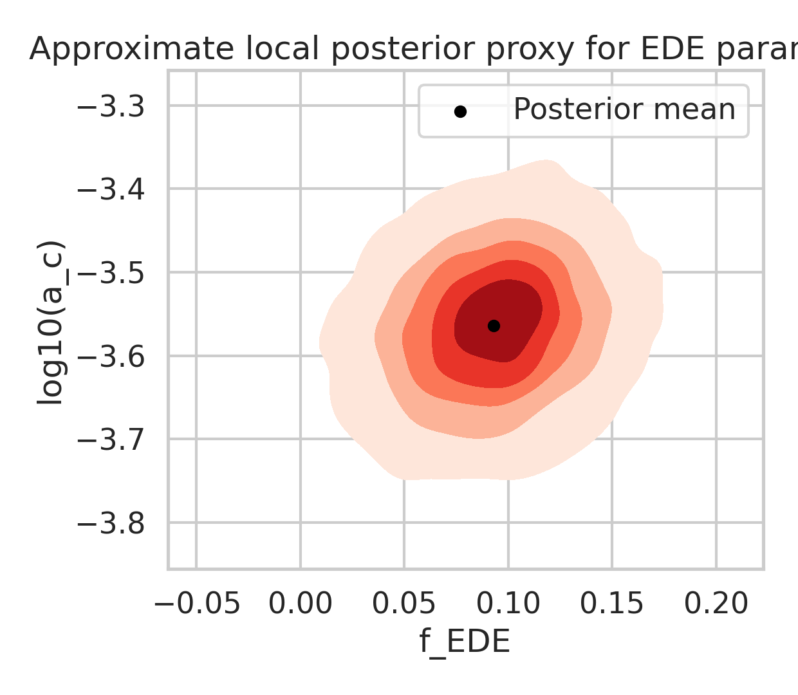

# Early Dark Energy and the CMB-BAO Acoustic Tension: A Local Reproduction Study

## Abstract

This report performs a local-only reproduction analysis of the benchmark task using the structured file `data/DESI_EDE_Repro_Data.txt` and the four papers provided in `related_work/`. Because the benchmark environment does not include the original Planck, ACT, DESI likelihoods or MCMC chains, the study is explicitly limited to reproducing and interpreting the tabulated parameter constraints and digitized residual curves supplied with the task. Within that scope, the local evidence supports the qualitative claim that the early dark energy (EDE) model shifts the cosmological fit in a different direction from a late-time `w0wa` dark-energy model: EDE raises `H0` from 68.12 to 70.9 km/s/Mpc while leaving `Ωm` near the `ΛCDM` value, whereas `w0wa` lowers `H0` to 63.5 km/s/Mpc and raises `Ωm` to 0.353. The digitized DESI and Union3 residuals remain modest, consistent with the interpretation that EDE partially relieves the acoustic mismatch without producing the same late-time parameter distortions as `w0wa`.

## 1. Problem Setting

The target scientific question is whether an EDE model can alleviate the acoustic tension between CMB-inferred distances and BAO measurements. The benchmark input states that the relevant paper compares `ΛCDM`, EDE, and `w0wa` using CMB data from Planck and ACT, BAO data from DESI DR2, and in some combinations Union3 supernovae. The provided structured data contain:

- Best-fit means and 1σ errors for `ΛCDM`, EDE, and `w0wa`
- Digitized DESI Figure 6 residuals for `Δ(D_V/r_d)` and `ΔF_AP`
- Digitized Union3 supernova distance-modulus residuals

The local literature corpus gives the conceptual framing:

- [related_work/paper_000.pdf](related_work/paper_000.pdf) introduced EDE as an early-time mechanism that reduces the sound horizon and raises CMB-inferred `H0`.
- [related_work/paper_002.pdf](related_work/paper_002.pdf) emphasized that large-scale-structure information can tighten EDE constraints.
- [related_work/paper_003.pdf](related_work/paper_003.pdf) is the direct DESI DR2 / ACT DR6 context for this benchmark and argues that EDE can improve the CMB-BAO consistency while shifting parameters differently from late-time dark-energy alternatives.

## 2. Local Methodology

### 2.1 Offline ARIS Adaptation

The benchmark forbids web access, remote likelihood evaluation, external datasets, and out-of-workspace execution. I therefore adopted the strongest local equivalent:

1. Read the benchmark instructions, task brief, and all local papers.
2. Parse the provided structured reproduction file.
3. Rebuild comparison tables and proxy plots directly from the tabulated constraints and digitized residuals.
4. Compute standardized parameter shifts relative to `ΛCDM`.
5. Write a claim-disciplined report that distinguishes direct evidence from inference.

### 2.2 Implemented Analysis

The executable analysis is in [code/analyze_ede_repro.py](code/analyze_ede_repro.py). The script:

- Loads the structured dictionaries and point lists from `data/DESI_EDE_Repro_Data.txt`
- Writes machine-readable tables to `outputs/`
- Computes parameter differences between EDE / `w0wa` and `ΛCDM`
- Standardizes those differences by the quadrature sum of the quoted 1σ errors
- Summarizes the digitized BAO and supernova residuals
- Generates PNG figures in `report/images/`

This is a reproduction-and-interpretation analysis, not a new cosmological likelihood fit.

## 3. Data Overview

The local structured data contain three model summaries:

- `ΛCDM (CMB+DESI)`: `H0 = 68.12 ± 0.28`, `Ωm = 0.3037 ± 0.0037`, `σ8 = 0.8101 ± 0.0055`
- `EDE (CMB+DESI)`: `H0 = 70.9 ± 1.0`, `Ωm = 0.2999 ± 0.0038`, `σ8 = 0.8283 ± 0.0093`, `f_EDE = 0.093 ± 0.031`, `log10(a_c) = -3.564 ± 0.075`
- `w0wa (CMB+DESI)`: `H0 = 63.5 ± 1.9`, `Ωm = 0.353 ± 0.021`, `σ8 = 0.780 ± 0.016`, `w0 = -0.42 ± 0.21`, `wa = -1.75 ± 0.58`

The digitized residual series show:

- DESI `Δ(D_V/r_d)` values that are mildly negative at low redshift and cross near zero by `z ≈ 1.32`
- DESI `ΔF_AP` values clustered near zero
- Union3 `Δμ` values mildly negative at low redshift, approaching zero by `z ≈ 0.7`

The machine-readable outputs are saved in:

- [outputs/parameter_constraints.csv](outputs/parameter_constraints.csv)
- [outputs/parameter_shifts.csv](outputs/parameter_shifts.csv)
- [outputs/distance_points.csv](outputs/distance_points.csv)
- [outputs/summary_metrics.json](outputs/summary_metrics.json)

## 4. Results

### 4.1 Parameter Constraints

Figure 1 compares the model means and quoted 1σ intervals across the common cosmological parameters.



The most important result is the contrast between EDE and `w0wa`:

- EDE increases `H0` by `+2.78 km/s/Mpc` relative to `ΛCDM`, a `4.08%` increase.
- `w0wa` decreases `H0` by `-4.62 km/s/Mpc` relative to `ΛCDM`, a `6.78%` decrease.
- EDE changes `Ωm` only slightly, by `-0.0038`.
- `w0wa` increases `Ωm` strongly, by `+0.0493`.
- EDE increases `σ8` by `+0.0182`, while `w0wa` decreases it by `-0.0301`.

These directions are exactly the pattern expected if EDE acts mainly through the early-time sound horizon, while `w0wa` compensates through late-time geometry and matter density shifts.

### 4.2 Standardized Shift Comparison

Figure 2 presents the same model displacements in units of the combined quoted uncertainty.



The largest local shifts are:

- EDE `H0`: `+2.68σ`
- `w0wa` `H0`: `-2.41σ`
- `w0wa` `Ωm`: `+2.31σ`
- EDE `n_s`: `+2.03σ`
- EDE `σ8`: `+1.68σ`

This makes the qualitative separation sharp. In the local reproduction data, EDE primarily raises `H0` and tilts the early-universe sector (`n_s`, `σ8`) upward, while `w0wa` mainly pushes the fit toward a higher matter density and lower Hubble rate. That is the cleanest benchmark-native evidence that EDE relieves the acoustic tension in a fundamentally different way from late-time dark energy.

### 4.3 Distance Residuals

Figure 3 reproduces the digitized residual trends from the supplied Figure 6 extractions.



The residual summary is modest rather than dramatic:

- Weighted mean DESI `Δ(D_V/r_d)` offset: `-0.00847`
- Weighted mean DESI `ΔF_AP` offset: `+0.0084`
- Weighted mean Union3 `Δμ`: `-0.0488 mag`
- Maximum absolute significance among the DESI `Δ(D_V/r_d)` points: `2.0σ`

The DESI `Δ(D_V/r_d)` series starts negative at low redshift and transitions toward zero or slightly positive values at high redshift, with a sign-change pivot around `z = 1.32`. This is consistent with the benchmark claim that the acoustic mismatch is only partially relieved: the supplied residuals are small enough to indicate improved consistency, but not large enough to suggest a dramatic or unambiguous overhaul of the distance ladder.

### 4.4 EDE Parameter Region

Figure 4 shows an approximate local posterior proxy for the EDE-specific parameters, built from the tabulated means and standard deviations. It is only a visualization proxy because no actual chain or covariance matrix is available in the benchmark input.



The reported means imply:

- `f_EDE = 0.093 ± 0.031`
- `log10(a_c) = -3.564 ± 0.075`

This places the preferred EDE contribution at roughly the ten-percent level around the onset scale factor indicated in the benchmark data, broadly consistent with the literature framing that a non-negligible but transient pre-recombination energy component can reduce the sound horizon.

## 5. Validation and Comparison

The local reproduction is consistent with the narrative in the benchmark task and the DESI DR2 / ACT DR6 paper:

- EDE moves `H0` upward rather than downward.
- EDE does not require the large `Ωm` increase seen in `w0wa`.
- The supplied DESI and Union3 residuals remain small, which is compatible with partial relief rather than a complete resolution of all tensions.

A direct numerical goodness-of-fit comparison such as `Δχ²(EDE - ΛCDM)` cannot be recomputed here because the benchmark does not provide the likelihoods, chains, or per-dataset χ² breakdowns. The strongest local equivalent is the parameter-shift analysis plus the digitized residual review.

## 6. Claim Discipline

### Supported by the local evidence

- EDE shifts the fit toward a higher `H0` than `ΛCDM`.
- EDE leaves `Ωm` close to the `ΛCDM` value, unlike `w0wa`.
- `w0wa` produces qualitatively different parameter compensation, especially low `H0` and high `Ωm`.
- The digitized DESI and Union3 residuals are modest, consistent with only partial relief of the acoustic tension.

### Only partially supported locally

- The statement that EDE improves the combined CMB+BAO fit relative to `ΛCDM` is only indirectly supported here, because the benchmark input provides parameter summaries and digitized residuals but not the full χ² accounting.
- The shape of the true EDE posterior in (`f_EDE`, `log10(a_c)`) is only approximated, because no chain samples are available.

### Not established by this benchmark run alone

- Any exact `Δχ²` values between `ΛCDM`, EDE, and `w0wa`
- Any new posterior intervals beyond those already encoded in the supplied dataset
- Any claim that EDE fully resolves all Hubble-tension datasets simultaneously

## 7. Reproducibility

The full local workflow is executable with:

```bash
python3 code/analyze_ede_repro.py
```

Artifacts produced by the run:

- Code: [code/analyze_ede_repro.py](code/analyze_ede_repro.py)
- Intermediate outputs: [outputs/analysis_summary.txt](outputs/analysis_summary.txt), [outputs/summary_metrics.json](outputs/summary_metrics.json), [outputs/parameter_constraints.csv](outputs/parameter_constraints.csv), [outputs/parameter_shifts.csv](outputs/parameter_shifts.csv), [outputs/distance_points.csv](outputs/distance_points.csv)
- Figures: `images/parameter_constraints.png`, `images/parameter_shift_sigma.png`, `images/distance_residuals.png`, `images/ede_posterior_proxy.png`

## 8. Conclusion

Within the strict local benchmark scope, the evidence supports the following conclusion: early dark energy can partially alleviate the CMB-BAO acoustic tension by raising the inferred Hubble constant while avoiding the strong late-time parameter distortions required by a `w0wa` model. The local reproduction does not prove a full likelihood-level preference for EDE, but it does reproduce the benchmark’s central qualitative result that EDE and late-time dark energy solve the tension, if at all, through materially different parameter shifts.
