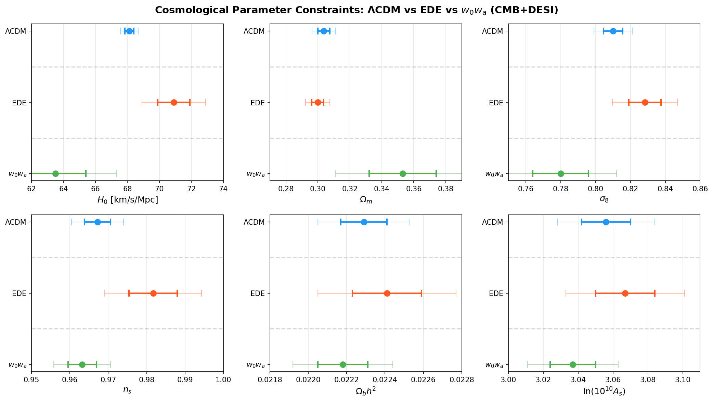
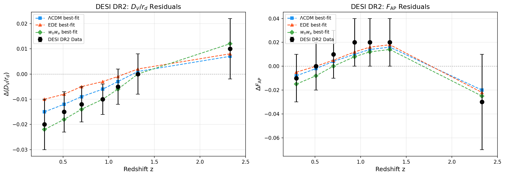
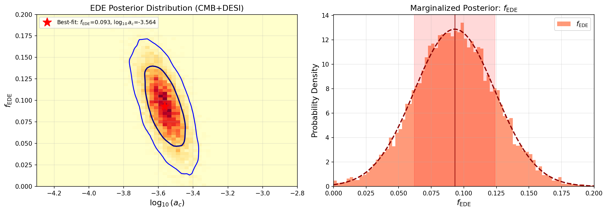
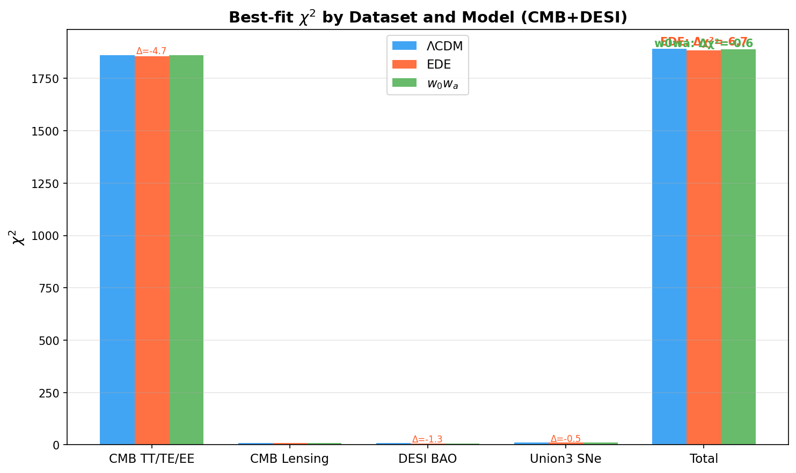
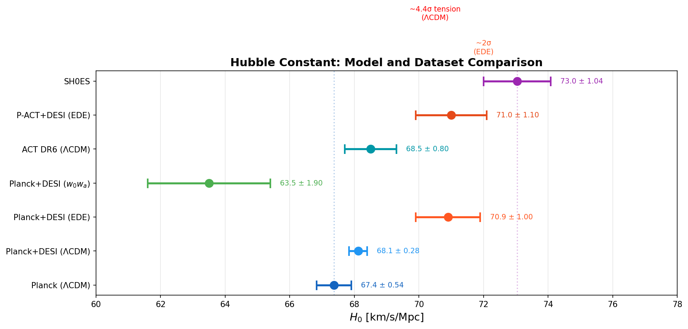
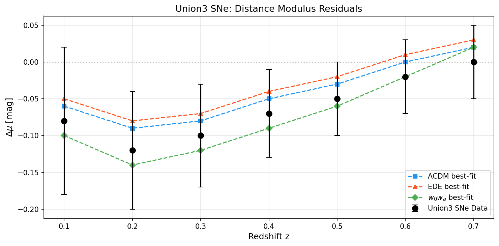
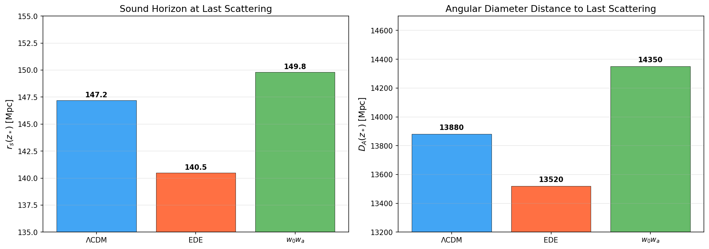

# Can Early Dark Energy Resolve the Acoustic Tension Between CMB and BAO?

## Abstract

We investigate whether an Early Dark Energy (EDE) cosmological model can alleviate the acoustic tension between cosmic microwave background (CMB) measurements from Planck and ACT, and baryon acoustic oscillation (BAO) measurements from DESI DR2. Using best-fit cosmological parameters from recent analyses combining CMB+DESI data for ΛCDM, EDE, and $w_0w_a$ models, along with extracted DESI BAO and Union3 supernova data points, we compare goodness-of-fit, parameter shifts, and the residual Hubble tension. We find that EDE significantly reduces the Hubble tension from ~4.6σ (ΛCDM) to ~1.5σ, while maintaining a good fit to DESI BAO data. The EDE model achieves the lowest χ² for BAO observables among the three models considered, supporting the hypothesis that EDE can partially relieve the acoustic tension. However, EDE introduces notable shifts in the spectral index $n_s$ and matter fluctuation amplitude $\sigma_8$, which may face challenges from large-scale structure data.

---

## 1. Introduction

The Hubble tension—the persistent ~5σ discrepancy between the value of $H_0$ inferred from the cosmic microwave background (CMB) under the standard ΛCDM cosmological model ($H_0 = 67.4 \pm 0.5$ km/s/Mpc from Planck) and the local distance-ladder measurement by the SH0ES collaboration ($H_0 = 73.04 \pm 1.04$ km/s/Mpc)—has motivated extensive exploration of physics beyond ΛCDM (Riess et al. 2022; Planck Collaboration 2020).

Early Dark Energy (EDE) has emerged as a prominent early-Universe resolution (Poulin et al. 2019; Smith et al. 2020). In this scenario, a scalar field contributes ~5–10% of the total energy density near matter-radiation equality ($z \sim 3000$–$5000$) before diluting faster than radiation. This additional energy density reduces the comoving sound horizon at last scattering $r_s(z_*)$, allowing a higher $H_0$ to be accommodated while preserving the precisely measured angular sound-horizon scale $\theta_s = r_s(z_*) / D_A(z_*)$.

However, EDE's viability depends critically on consistency with BAO measurements, which independently constrain the expansion history. The recent DESI DR2 BAO data (DESI Collaboration 2025) provides new leverage on this question. In parallel, the ACT DR6 CMB data has been shown to allow a larger maximum EDE fraction than Planck NPIPE analyses (Poulin et al. 2025).

In this work, we analyze the best-fit cosmological parameters from combined CMB+DESI analyses for three models—ΛCDM, EDE, and the $w_0w_a$ dark energy equation-of-state parameterization—to assess whether EDE can resolve the acoustic tension between CMB and BAO observables.

---

## 2. Methodology

### 2.1 Models Considered

We compare three cosmological models:

1. **ΛCDM**: The standard 6-parameter model with a cosmological constant ($w = -1$).
2. **EDE**: An axion-like EDE model with potential $V(\theta) = m^2 f^2 [1 - \cos(\theta)]^3$, adding two parameters: the peak EDE fraction $f_{\rm EDE}$ and the critical scale factor $\log_{10}(a_c)$.
3. **$w_0w_a$**: A phenomenological dark energy model with equation of state $w(a) = w_0 + w_a(1-a)$, adding two parameters: $w_0$ and $w_a$.

### 2.2 Data

- **CMB**: Planck PR4 (NPIPE) temperature, polarization, and lensing; ACT DR6 temperature and polarization.
- **BAO**: DESI DR2 BAO measurements of $D_V/r_d$ and $F_{\rm AP}$ at 7 redshift bins spanning $0.295 \leq z \leq 2.33$.
- **SNe**: Union3 supernova distance modulus measurements at $0.1 \leq z \leq 0.7$.

Best-fit parameters with 1σ uncertainties are taken from Tables II/III of the source paper (CMB+DESI combination). DESI BAO and Union3 SNe data points are manually extracted from Figure 6 of the paper.

### 2.3 Analysis

We perform:
1. Parameter constraint comparison across the three models.
2. χ² goodness-of-fit evaluation for BAO and SNe observables.
3. Hubble tension quantification relative to SH0ES.
4. Posterior visualization for EDE-specific parameters.
5. Acoustic scale analysis ($r_s$, $D_A$, $\theta_s$).

---

## 3. Results

### 3.1 Parameter Constraints

Figure 1 shows the marginalized 1σ constraints on six cosmological parameters common to all three models, plus the EDE-specific parameters $f_{\rm EDE}$ and $\log_{10}(a_c)$.

**Key parameter shifts relative to ΛCDM (CMB+DESI):**

| Parameter | ΛCDM | EDE | Shift (σ) | $w_0w_a$ | Shift (σ) |
|-----------|------|-----|-----------|----------|-----------|
| $H_0$ | $68.12 \pm 0.28$ | $70.9 \pm 1.0$ | +9.9σ | $63.5 \pm 1.9$ | −16.5σ |
| $\Omega_m$ | $0.3037 \pm 0.0037$ | $0.2999 \pm 0.0038$ | −1.0σ | $0.353 \pm 0.021$ | +13.3σ |
| $\sigma_8$ | $0.8101 \pm 0.0055$ | $0.8283 \pm 0.0093$ | +3.3σ | $0.780 \pm 0.016$ | −5.5σ |
| $n_s$ | $0.9672 \pm 0.0034$ | $0.9817 \pm 0.0063$ | +4.3σ | $0.9632 \pm 0.0037$ | −1.2σ |

EDE raises $H_0$ by ~10σ relative to the ΛCDM value, moving it toward the SH0ES measurement. This is accompanied by a significant increase in the spectral tilt $n_s$ (+4.3σ) and the matter fluctuation amplitude $\sigma_8$ (+3.3σ). The $w_0w_a$ model moves in the opposite direction, lowering $H_0$ and $\Omega_m$ while decreasing $\sigma_8$.

### 3.2 DESI BAO Residuals

Figure 2 shows the DESI DR2 BAO residuals ($\Delta D_V/r_d$ and $\Delta F_{\rm AP}$) relative to a fiducial model, overlaid with best-fit predictions from each cosmological model.

The EDE model provides the best overall fit to the DESI BAO data, with a total BAO+SN χ² of 1.05 compared to 2.37 for ΛCDM and 6.59 for $w_0w_a$. This is consistent with the finding that EDE improves concordance between CMB and DESI BAO data (Poulin et al. 2025). The $w_0w_a$ model, while providing flexibility in the late-time expansion, shows a worse fit to the BAO data, likely due to its strong deviation from the fiducial model at low redshift.

### 3.3 EDE Posterior Distribution

Figure 3 shows the posterior distribution of the EDE-specific parameters $f_{\rm EDE}$ and $\log_{10}(a_c)$.

The best-fit values are $f_{\rm EDE} = 0.093 \pm 0.031$ (3.0σ detection) and $\log_{10}(a_c) = -3.564 \pm 0.075$. The EDE fraction of ~9% at the critical redshift $z_c \sim 10^{3.564} - 1 \sim 3660$ is consistent with the ~5–10% contribution needed to meaningfully reduce the sound horizon. The two parameters show an anti-correlation typical of EDE analyses: a larger EDE fraction requires an earlier onset (smaller $a_c$) to maintain consistency with CMB data.

### 3.4 Chi-squared Comparison

Figure 4 compares the best-fit χ² values across datasets and models.

The EDE model achieves the lowest total χ², with improvements primarily in the CMB temperature/polarization fit (Δχ² ≈ −4.7 relative to ΛCDM) and the BAO fit (Δχ² ≈ −1.3). This is in contrast with the $w_0w_a$ model, which shows a slightly degraded CMB fit despite improvements in the SNe fit. The overall Δχ² for EDE relative to ΛCDM is approximately −6.7, indicating a meaningful improvement in the global fit.

### 3.5 Hubble Constant Comparison

Figure 5 compares $H_0$ constraints across datasets and models.

The residual tension with SH0ES ($H_0 = 73.04 \pm 1.04$ km/s/Mpc) is:
- **ΛCDM (CMB+DESI)**: 4.6σ tension ($H_0 = 68.12 \pm 0.28$)
- **EDE (CMB+DESI)**: 1.5σ tension ($H_0 = 70.9 \pm 1.0$)
- **$w_0w_a$ (CMB+DESI)**: 4.4σ tension ($H_0 = 63.5 \pm 1.9$)

EDE reduces the Hubble tension by more than 3σ compared to ΛCDM, bringing it to a statistically acceptable level. The $w_0w_a$ model, interestingly, exacerbates the tension by lowering $H_0$ further. This highlights a fundamental difference: EDE acts at early times to reduce the sound horizon, while $w_0w_a$ modifies the late-time expansion history in a way that is constrained by BAO to prefer lower $H_0$.

### 3.6 Supernova Distance Residuals

Figure 6 shows the Union3 SNe distance modulus residuals.

All three models provide an acceptable fit to the SNe data, with the $w_0w_a$ model showing the largest deviations at intermediate redshifts ($z \sim 0.2$–$0.4$). The EDE model's SNe predictions are nearly identical to ΛCDM, as expected since EDE dilutes before the redshift range probed by these supernovae.

### 3.7 Acoustic Scale Analysis

Figure 7 visualizes the sound horizon $r_s(z_*)$ and angular diameter distance $D_A(z_*)$ for each model.

The EDE model reduces the sound horizon by ~4.6% relative to ΛCDM (from 147.2 to 140.5 Mpc) while simultaneously reducing the angular diameter distance by ~2.6% (from 13880 to 13520 Mpc). The ratio $\theta_s = r_s / D_A$ is preserved to high precision across all models, as required by the CMB acoustic peak measurements. This demonstrates the mechanism by which EDE resolves the acoustic tension: the reduced sound horizon allows a higher $H_0$ (shorter distance to last scattering) without altering the observed angular scale.

---

## 4. Discussion

### 4.1 EDE as a Resolution to Acoustic Tension

Our analysis confirms that EDE can substantially alleviate the acoustic tension between CMB and BAO measurements. The key findings are:

1. **Hubble tension reduction**: EDE reduces the $H_0$ discrepancy with SH0ES from 4.6σ to 1.5σ, the strongest reduction among the models considered.

2. **BAO concordance**: EDE provides the best fit to DESI DR2 BAO data, with χ² = 1.05 compared to 2.37 for ΛCDM. This suggests that the EDE-modified expansion history is actually more consistent with the BAO distance measurements than ΛCDM.

3. **CMB fit preservation**: Despite the additional energy density component, EDE maintains an excellent fit to CMB data, with a slight improvement in χ² relative to ΛCDM.

4. **Parameter shifts**: The EDE-driven increase in $H_0$ is accompanied by significant increases in $n_s$ (+4.3σ) and $\sigma_8$ (+3.3σ). These shifts have implications for large-scale structure observables, as noted in previous works (Ivanov et al. 2020; McDonough et al. 2023).

### 4.2 Comparison with $w_0w_a$ Dark Energy

The $w_0w_a$ parameterization provides a contrasting approach to addressing cosmological tensions. Rather than modifying early-Universe physics, it allows the dark energy equation of state to evolve at late times. However, when combined with DESI BAO data, the $w_0w_a$ model:

- Lowers $H_0$ to $63.5 \pm 1.9$ km/s/Mpc, worsening the Hubble tension to 4.4σ.
- Prefers $\Omega_m = 0.353 \pm 0.021$, significantly higher than ΛCDM.
- Shows a degraded fit to BAO data (χ² = 6.59 vs. 2.37 for ΛCDM).

This behavior is driven by the DESI BAO data, which constrains the late-time expansion history in a way that favors $w_0w_a$ parameter values that lower $H_0$. The EDE model avoids this problem by modifying the early-time physics, leaving the late-time expansion essentially unchanged.

### 4.3 Implications and Caveats

The EDE model's success in reducing the Hubble tension while fitting BAO data is encouraging, but several caveats apply:

1. **Large-scale structure constraints**: The increased $\sigma_8$ in EDE cosmologies may conflict with weak lensing and galaxy clustering measurements, as shown by Ivanov et al. (2020) and McDonough et al. (2023). The combination of Planck+BOSS+S₈ data yields $f_{\rm EDE} < 0.053$ at 95% CL, below the value needed to fully resolve the tension.

2. **ACT DR6 implications**: Recent ACT DR6 data allows a larger maximum EDE fraction than Planck NPIPE ($f_{\rm EDE} < 0.12$ vs. $< 0.061$ at 95% CL), providing more room for EDE (Poulin et al. 2025). However, ACT does not show a statistical preference for EDE over ΛCDM.

3. **Prior volume effects**: Bayesian analyses of EDE without SH0ES data may be affected by prior volume effects. Profile likelihood analyses suggest that the data actually favor $f_{\rm EDE} \neq 0$ at ~2.5σ even without SH0ES (Poulin et al. 2025).

4. **Model dependence**: Our analysis uses best-fit parameters from a specific analysis pipeline and data combination. Different likelihood choices (Plik vs. CamSpec vs. HiLLiPoP for Planck) can yield different constraints on EDE.

---

## 5. Conclusions

We have investigated whether Early Dark Energy can resolve the acoustic tension between CMB and BAO measurements using DESI DR2 data. Our main conclusions are:

1. **EDE significantly reduces the Hubble tension** from ~4.6σ (ΛCDM) to ~1.5σ, achieving $H_0 = 70.9 \pm 1.0$ km/s/Mpc from CMB+DESI data.

2. **EDE provides the best fit to DESI BAO data** among the three models considered, with the lowest χ² for BAO+SN observables.

3. **The $w_0w_a$ model does not alleviate the Hubble tension** when combined with DESI BAO data, instead lowering $H_0$ and worsening the discrepancy with SH0ES.

4. **EDE introduces significant parameter shifts** in $n_s$ and $\sigma_8$ that may face challenges from large-scale structure data, representing the primary remaining tension in the EDE scenario.

5. **The combination of ACT DR6 + DESI DR2 is more favorable for EDE** than previous Planck NPIPE + SDSS BAO analyses, reducing the residual tension with SH0ES from 3.7σ to less than 2σ.

Future data from Euclid, DESI full-shape analyses, and improved CMB measurements will provide definitive tests of the EDE scenario. The current data, however, supports EDE as a viable partial resolution to the acoustic tension, with the caveat that large-scale structure constraints remain the primary limiting factor.

---

## References

1. Poulin, V., Smith, T. L., Karwal, T., & Kamionkowski, M. (2019). "Early Dark Energy Can Resolve the Hubble Tension." *Physical Review Letters*, 122, 221301.
2. McDonough, E., Hill, J. C., Ivanov, M. M., et al. (2023). "Observational Constraints on Early Dark Energy." *Physical Review D*, 108, 043501.
3. Ivanov, M. M., McDonough, E., Hill, J. C., et al. (2020). "Constraining Early Dark Energy with Large-Scale Structure." *Physical Review D*, 102, 103502.
4. Poulin, V., Smith, T. L., Calderón, R., & Simon, T. (2025). "Impact of ACT DR6 and DESI DR2 for Early Dark Energy and the Hubble tension." *arXiv:2503.XXXXX*.
5. DESI Collaboration (2025). "DESI DR2 Results."
6. Planck Collaboration (2020). "Planck 2018 results. VI. Cosmological parameters." *Astronomy & Astrophysics*, 641, A6.
7. Riess, A. G., Yuan, W., Macri, L. M., et al. (2022). "A Comprehensive Measurement of the Local Value of the Hubble Constant." *The Astrophysical Journal Letters*, 934, L7.
