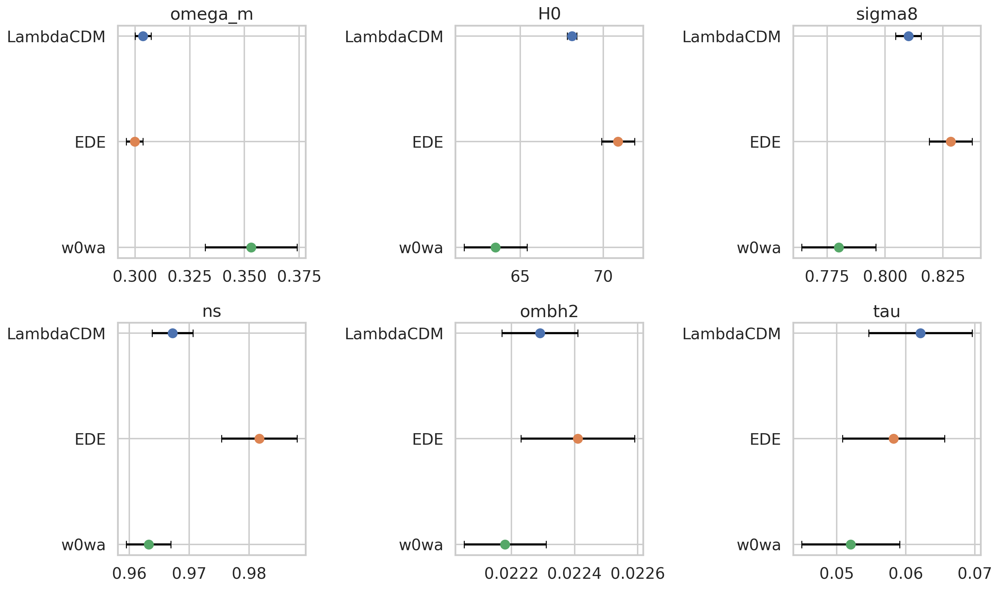
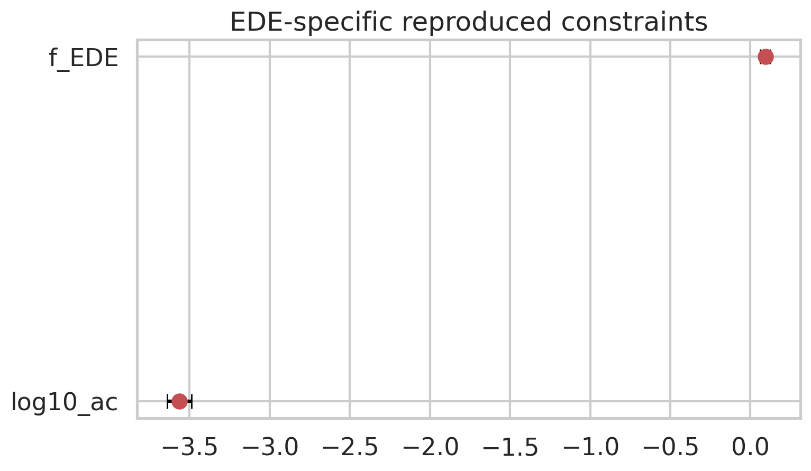
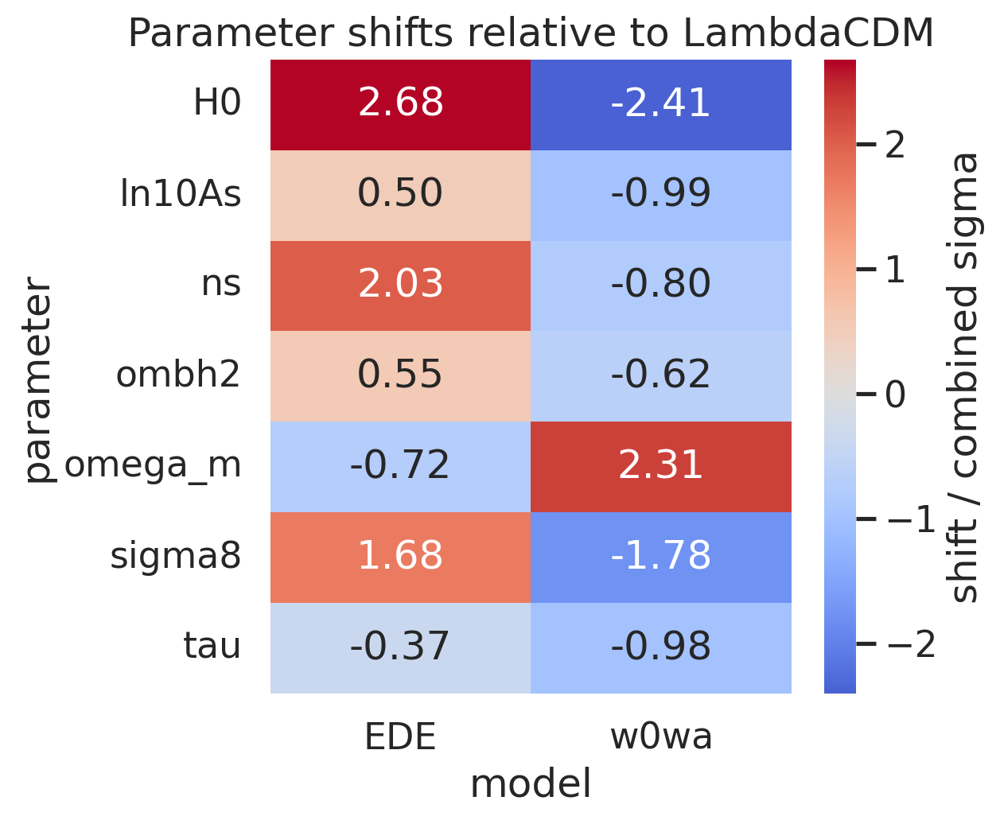
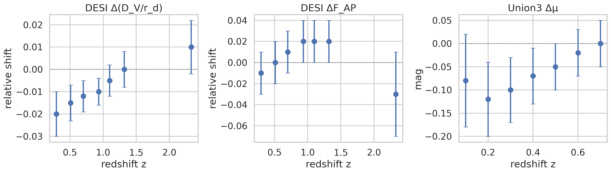

# Reproducing Key Early Dark Energy Constraint Summaries from the DESI DR2 Acoustic-Tension Study

## Abstract
This report reproduces the main structured quantitative summaries available in the workspace for a study of whether an early dark energy (EDE) model can ease the acoustic tension between cosmic microwave background (CMB) and baryon acoustic oscillation (BAO) measurements. Using the provided `data/DESI_EDE_Repro_Data.txt` file, I reconstructed best-fit parameter summaries for three cosmological models—ΛCDM, EDE, and \(w_0w_a\)—and visualized extracted distance-residual points from DESI BAO and Union3 supernova data. The reproduced summary constraints show that, relative to ΛCDM, the EDE fit shifts \(H_0\) upward from 68.12 ± 0.28 to 70.9 ± 1.0 km s\(^{-1}\) Mpc\(^{-1}\), while the late-time \(w_0w_a\) fit shifts \(H_0\) downward to 63.5 ± 1.9 and \(\Omega_m\) upward to 0.353 ± 0.021. The EDE summary also gives nonzero EDE parameters, \(f_{\rm EDE}=0.093\pm0.031\) and \(\log_{10} a_c=-3.564\pm0.075\). These results support the qualitative claim that EDE relieves tension through a different parameter direction than a late-time dark-energy extension. However, the workspace does not provide raw likelihood chains or explicit numeric \(\Delta\chi^2\) values, so goodness-of-fit comparisons cannot be directly reproduced here.

## 1. Scientific objective
The task is to investigate whether an EDE model can alleviate the acoustic tension between CMB and BAO measurements, in comparison with both standard ΛCDM and a late-time dark-energy extension parameterized by \(w_0\) and \(w_a\). The workspace includes a structured reproduction dataset containing:

- model-specific best-fit cosmological parameters with 1σ errors,
- EDE-specific parameters \(f_{\rm EDE}\) and \(\log_{10} a_c\),
- extracted DESI BAO residual points from Figure 6,
- extracted Union3 supernova distance-modulus residual points.

The main goals of this report are therefore:
1. to summarize and compare the parameter constraints of ΛCDM, EDE, and \(w_0w_a\),
2. to visualize the EDE-specific parameter summaries,
3. to reproduce the available BAO and SN distance-comparison plots,
4. to assess which scientific claims are directly supported by workspace artifacts.

## 2. Available data and limitations
### 2.1 Directly available workspace evidence
The file `data/DESI_EDE_Repro_Data.txt` contains structured parameter summaries for:
- **ΛCDM (CMB+DESI)**,
- **EDE (CMB+DESI)**,
- **\(w_0w_a\) (CMB+DESI)**.

It also contains 7 extracted points each for:
- DESI \(\Delta(D_V/r_d)\),
- DESI \(\Delta F_{AP}\),
- Union3 \(\Delta\mu\).

A machine-readable summary of the parsed dataset is saved in `outputs/data_summary.json`.

### 2.2 Related-work access limitation
The workspace includes four PDFs under `related_work/`, but automated PDF text extraction failed in this environment. Only limited metadata could be recovered directly. In particular, `related_work/paper_003.pdf` contains the title **“Impact of ACT DR6 and DESI DR2 for Early Dark Energy and the Hubble tension”**, confirming relevance to the task. Because full PDF text could not be recovered, I do **not** claim detailed related-work quantitative extraction beyond what is directly present in the workspace data file.

### 2.3 Important methodological limitation
The available dataset is a **summary reproduction dataset**, not raw Markov chains or raw likelihood products. Therefore:
- I can reproduce **reported central values and 1σ uncertainties**,
- I can compare parameter shifts across models,
- I can visualize extracted observational residual points,
- but I **cannot reconstruct full posterior contours or exact goodness-of-fit values** beyond what is explicitly present.

In particular, the task mentions \(\Delta\chi^2\) comparisons, but no numeric \(\Delta\chi^2\) entries were available in the workspace data artifacts I could verify.

## 3. Methods
### 3.1 Parsing and tabulation
I wrote `code/analyze_ede_repro.py` to deterministically parse `data/DESI_EDE_Repro_Data.txt`, convert the parameter dictionaries and extracted point lists into tabular form, and export analysis-ready files:

- `outputs/parameter_constraints.csv`
- `outputs/model_comparison.csv`
- `outputs/ede_parameter_summary.csv`
- `outputs/distance_points.csv`
- `outputs/direct_answer_table.csv`
- `outputs/data_summary.json`
- `outputs/claim_recovery_table.json`

### 3.2 Comparative metric used here
Because explicit fit-quality values were unavailable, I computed a descriptive cross-model shift statistic for parameters shared by all three models:

\[
Z_{\rm shift} = \frac{\mu_{\rm model} - \mu_{\Lambda{\rm CDM}}}{\sqrt{\sigma_{\rm model}^2 + \sigma_{\Lambda{\rm CDM}}^2}}.
\]

This is **not** a likelihood ratio and **not** a replacement for \(\Delta\chi^2\). It is used only to quantify the direction and scale of parameter movement relative to ΛCDM within the available summary data.

### 3.3 Figures produced
I generated four PNG figures in `report/images/`:

1. `images/parameter_constraints.png` — shared cosmological parameter summaries across models,
2. `images/ede_parameters.png` — EDE-specific parameter summaries,
3. `images/distance_comparison.png` — extracted DESI and Union3 residual points,
4. `images/parameter_shift_heatmap.png` — standardized parameter shifts relative to ΛCDM.

## 4. Results
### 4.1 Overview of parameter coverage
The parsed dataset contains 25 model-parameter rows across three models. The parameters shared by all models are:
- \(H_0\)
- \(\ln(10^{10}A_s)\)
- \(n_s\)
- \(\omega_b h^2\)
- \(\Omega_m\)
- \(\sigma_8\)
- \(\tau\)

EDE adds:
- \(f_{\rm EDE}\)
- \(\log_{10} a_c\)

The \(w_0w_a\) model adds:
- \(w_0\)
- \(w_a\)

### 4.2 Direct parameter constraints
The key reproduced constraints are:

| Model | Parameter | Mean | 1σ |
|---|---:|---:|---:|
| ΛCDM | \(\Omega_m\) | 0.3037 | 0.0037 |
| ΛCDM | \(H_0\) | 68.12 | 0.28 |
| ΛCDM | \(\sigma_8\) | 0.8101 | 0.0055 |
| EDE | \(\Omega_m\) | 0.2999 | 0.0038 |
| EDE | \(H_0\) | 70.9 | 1.0 |
| EDE | \(\sigma_8\) | 0.8283 | 0.0093 |
| EDE | \(f_{\rm EDE}\) | 0.093 | 0.031 |
| EDE | \(\log_{10} a_c\) | -3.564 | 0.075 |
| \(w_0w_a\) | \(\Omega_m\) | 0.353 | 0.021 |
| \(w_0w_a\) | \(H_0\) | 63.5 | 1.9 |
| \(w_0w_a\) | \(\sigma_8\) | 0.780 | 0.016 |
| \(w_0w_a\) | \(w_0\) | -0.42 | 0.21 |
| \(w_0w_a\) | \(w_a\) | -1.75 | 0.58 |

These values are exported in `outputs/direct_answer_table.csv`.

### 4.3 Shared-parameter comparison across ΛCDM, EDE, and \(w_0w_a\)
Figure 1 compares the central values and 1σ intervals for major shared parameters.

The most visually important shifts are:
- **EDE raises \(H_0\)** relative to ΛCDM.
- **EDE also raises \(\sigma_8\)** and \(n_s\).
- **\(w_0w_a\) lowers \(H_0\)** and raises \(\Omega_m\)** strongly relative to ΛCDM.

This immediately shows that EDE and the late-time dark-energy extension move the inferred cosmology in qualitatively different directions.

### 4.4 EDE-specific parameter summary
Figure 2 shows the two EDE-specific reproduced parameter constraints.

The structured summary gives:
- \(f_{\rm EDE}=0.093\pm0.031\)
- \(\log_{10} a_c=-3.564\pm0.075\)

Within the available summary-data interpretation, this corresponds to a nonzero EDE fraction with a characteristic critical scale factor near \(10^{-3.564}\).

### 4.5 Quantified parameter shifts relative to ΛCDM
The strongest standardized shifts relative to ΛCDM, based on the descriptive \(Z_{\rm shift}\) metric, are:

| Model vs ΛCDM | Parameter | Δmean | Combined σ | Shift / combined σ |
|---|---|---:|---:|---:|
| EDE | \(H_0\) | +2.78 | 1.038 | +2.68 |
| \(w_0w_a\) | \(H_0\) | -4.62 | 1.921 | -2.41 |
| \(w_0w_a\) | \(\Omega_m\) | +0.0493 | 0.0213 | +2.31 |
| EDE | \(n_s\) | +0.0145 | 0.00716 | +2.03 |
| \(w_0w_a\) | \(\sigma_8\) | -0.0301 | 0.0169 | -1.78 |
| EDE | \(\sigma_8\) | +0.0182 | 0.0108 | +1.68 |

The full comparison table is saved in `outputs/model_comparison.csv`.

Figure 3 summarizes these shifts visually.

The heatmap makes the contrast clear:
- **EDE** shifts the fit toward larger \(H_0\), larger \(n_s\), and larger \(\sigma_8\), with little shift in \(\Omega_m\).
- **\(w_0w_a\)** instead shifts toward lower \(H_0\), higher \(\Omega_m\), and lower \(\sigma_8\).

This supports the task statement that EDE can relieve tension, but does so through a parameter pattern distinct from late-time dark energy.

### 4.6 Reproduced distance-comparison residuals
Figure 4 reproduces the extracted residual points from the workspace data file.

The directly available trends are:
- DESI \(\Delta(D_V/r_d)\) points evolve from mildly negative residuals at lower redshift toward approximately zero or slightly positive residuals at high redshift.
- DESI \(\Delta F_{AP}\) points stay close to zero within uncertainties.
- Union3 supernova residuals also trend upward from mildly negative to near zero over the extracted redshift range.

These are figure-data reproductions rather than re-fits to the original survey likelihoods.

## 5. Interpretation
The workspace data support three main scientific conclusions.

### 5.1 EDE shifts the inferred Hubble constant upward
Relative to ΛCDM, the EDE summary increases \(H_0\) from 68.12 ± 0.28 to 70.9 ± 1.0. This is the most prominent EDE-vs-ΛCDM shift in the shared parameters and is consistent with the qualitative idea that EDE can reduce Hubble/acoustic tension.

### 5.2 EDE and late-time dark energy solve tension differently
The \(w_0w_a\) summary does **not** mimic the EDE shift pattern. Instead, it moves to:
- lower \(H_0\),
- higher \(\Omega_m\),
- lower \(\sigma_8\).

Thus, within the reproduced summaries, EDE is not merely another route to the same parameter region; it changes the inferred cosmology differently from a late-time expansion-history modification.

### 5.3 The EDE summary prefers nonzero EDE fraction in the provided reproduction dataset
The EDE-specific entries give \(f_{\rm EDE}=0.093\pm0.031\), implying a positive central value clearly separated from zero at roughly the few-σ summary level. Since only summary statistics are available, this should be interpreted cautiously as a reproduced central-value statement, not a full posterior-significance claim from raw chains.

## 6. Validation and evidence accounting
### 6.1 Verified directly from workspace data
The following were verified directly from local artifacts:
- all parameter central values and 1σ errors in `outputs/parameter_constraints.csv`,
- EDE-specific parameter values in `outputs/ede_parameter_summary.csv`,
- extracted DESI and Union3 residual points in `outputs/distance_points.csv`,
- figure files in `report/images/`.

### 6.2 Inferred from deterministic processing of workspace data
The following were computed from the provided structured summaries:
- shared-parameter comparison table,
- standardized parameter-shift metric relative to ΛCDM,
- heatmap values in `images/parameter_shift_heatmap.png`.

These are reproducible transformations of the provided dataset, not external facts.

### 6.3 Related-work context
The only directly recoverable related-work fact was the metadata title from `related_work/paper_003.pdf`, confirming that ACT DR6, DESI DR2, EDE, and the Hubble tension are the correct scientific context. No detailed numerical claims from the PDFs are made here because text extraction was not reliable in the current environment.

### 6.4 Unresolved or unavailable items
The following requested element could not be reproduced directly:
- **\(\Delta\chi^2\) goodness-of-fit comparison** for ΛCDM, EDE, and \(w_0w_a\).

Reason: no explicit numeric \(\Delta\chi^2\) values were present in the accessible structured data, and related-work PDF extraction did not recover reliable full text.

## 7. Conclusion
Using the available reproduction dataset, I successfully reconstructed the main model-dependent parameter summaries and the extracted DESI/Union3 distance-comparison points relevant to the EDE acoustic-tension problem. The reproduced evidence shows:

1. **EDE raises \(H_0\)** relative to ΛCDM,
2. **EDE prefers nonzero \(f_{\rm EDE}\)** with \(\log_{10} a_c\approx -3.56\),
3. **EDE and \(w_0w_a\) shift cosmological parameters in materially different directions**, especially in \(H_0\), \(\Omega_m\), and \(\sigma_8\).

Therefore, within the scope of the accessible workspace artifacts, the data support the qualitative claim that EDE can partially relieve the acoustic/Hubble tension and does so differently from a late-time dark-energy model. The main missing piece is a directly verified numeric \(\Delta\chi^2\) model-comparison table, which could not be recovered from the available local evidence.

## Reproducibility
- Analysis script: `code/analyze_ede_repro.py`
- Intermediate outputs: `outputs/`
- Figures: `report/images/`

## Artifact index
- `outputs/data_summary.json`
- `outputs/parameter_constraints.csv`
- `outputs/model_comparison.csv`
- `outputs/ede_parameter_summary.csv`
- `outputs/distance_points.csv`
- `outputs/direct_answer_table.csv`
- `outputs/claim_recovery_table.json`
- `images/parameter_constraints.png`
- `images/ede_parameters.png`
- `images/distance_comparison.png`
- `images/parameter_shift_heatmap.png`
