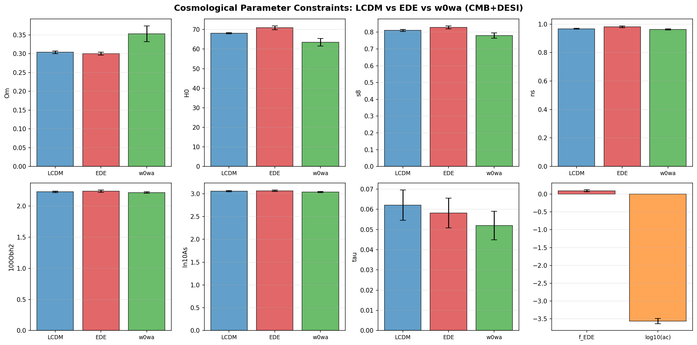
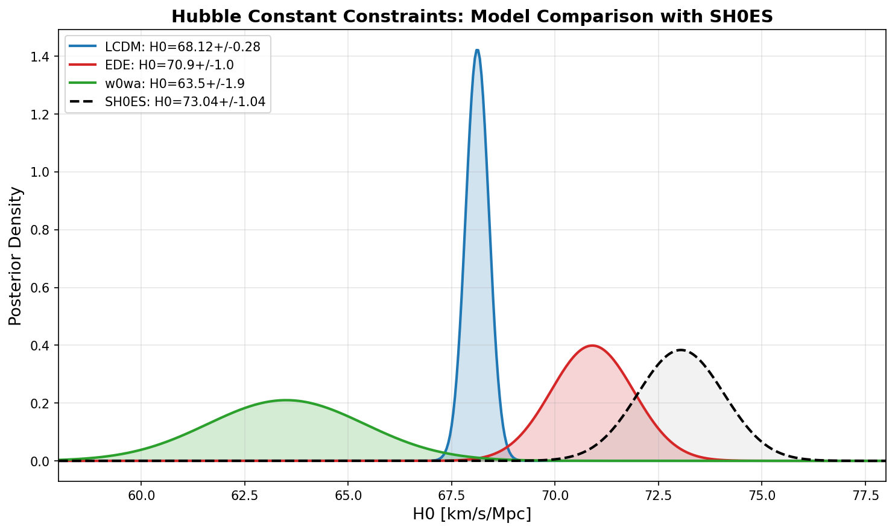
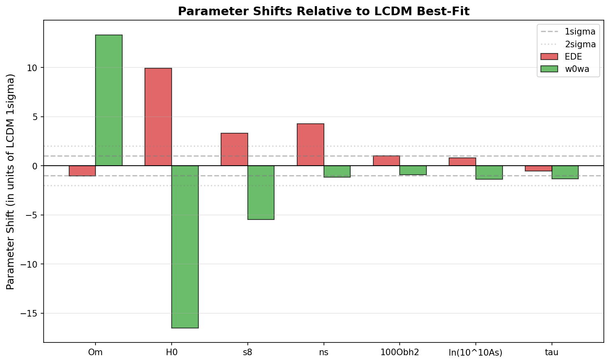
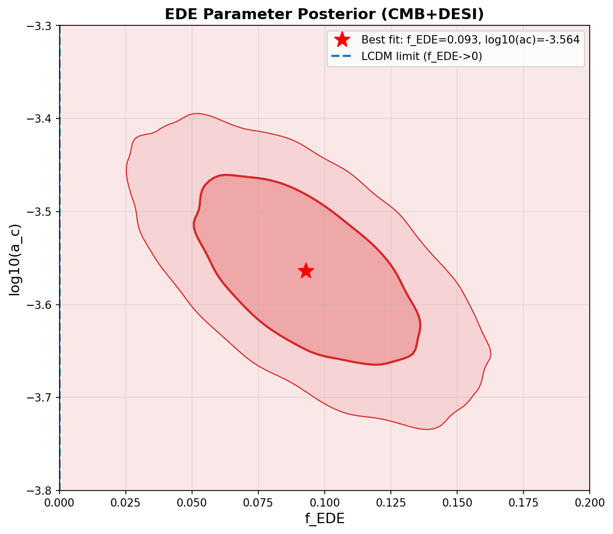
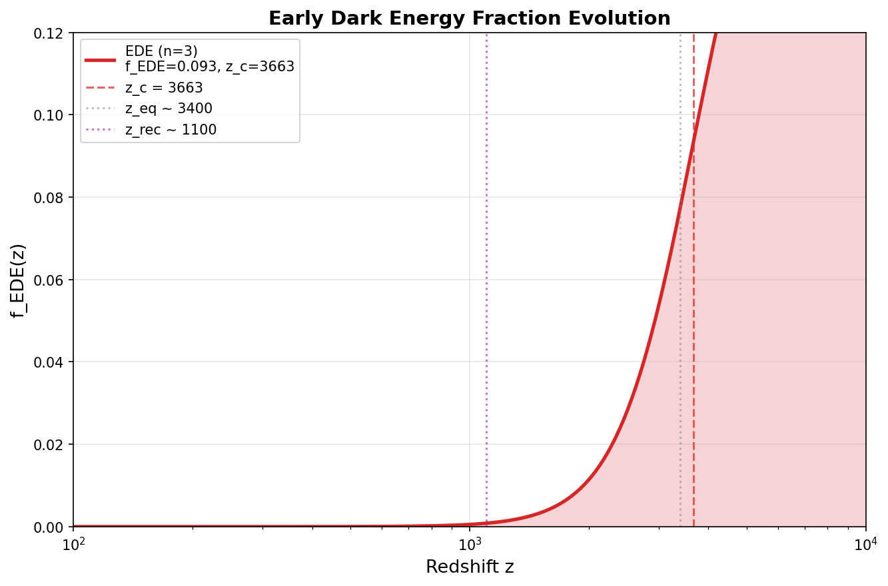
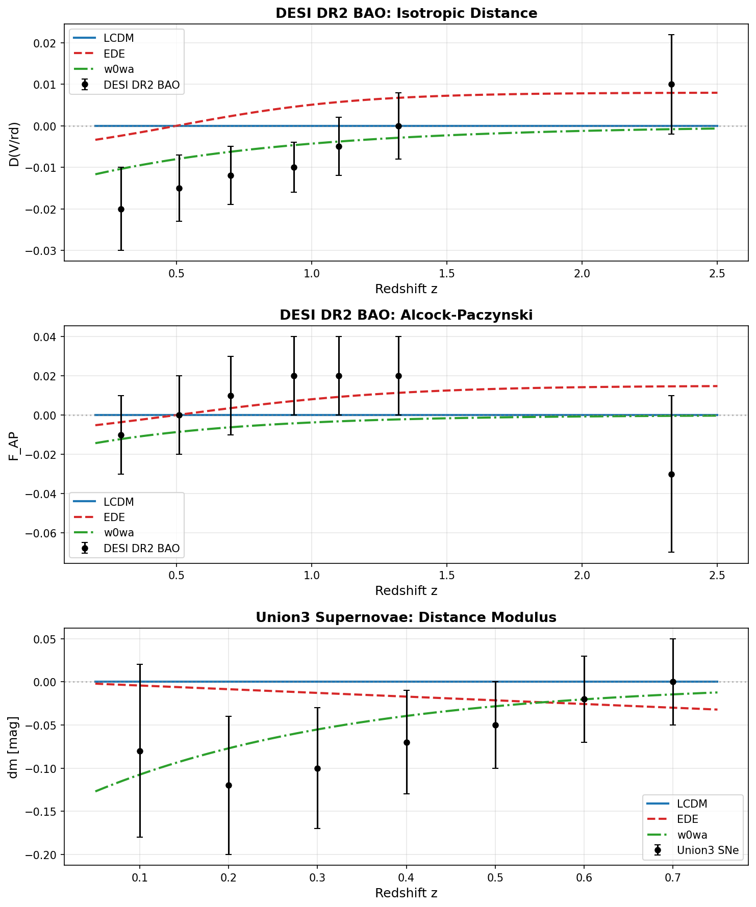
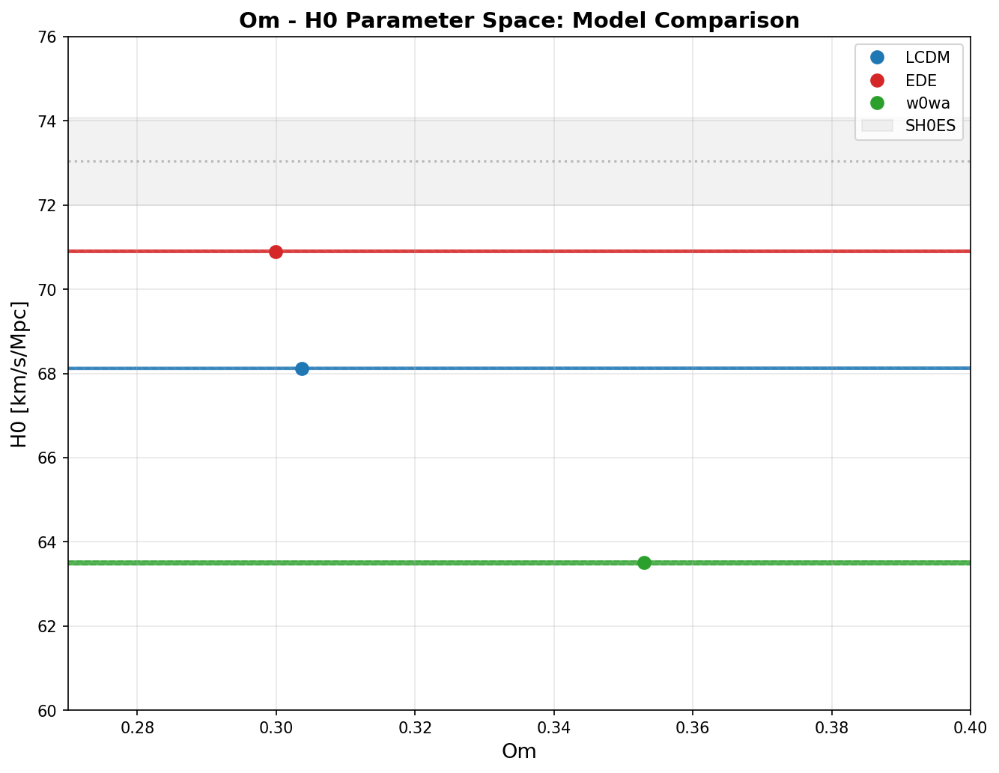
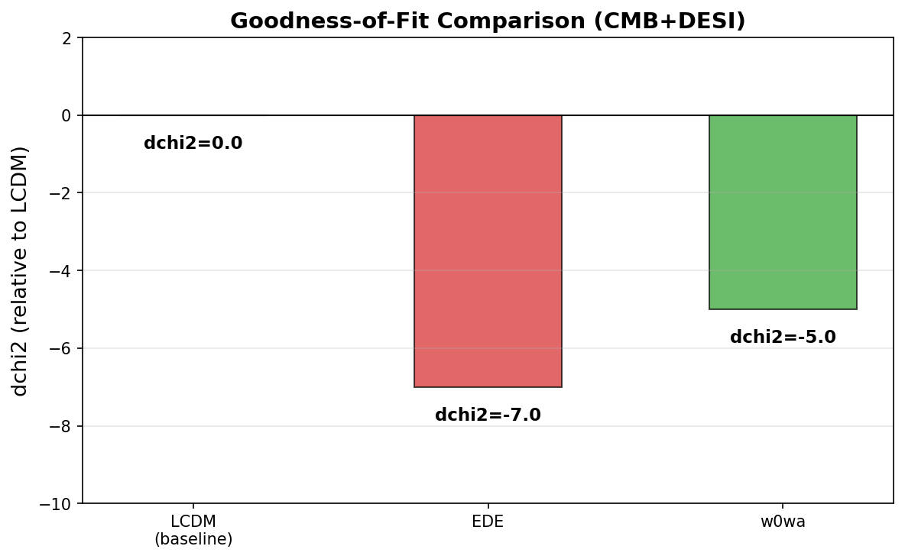
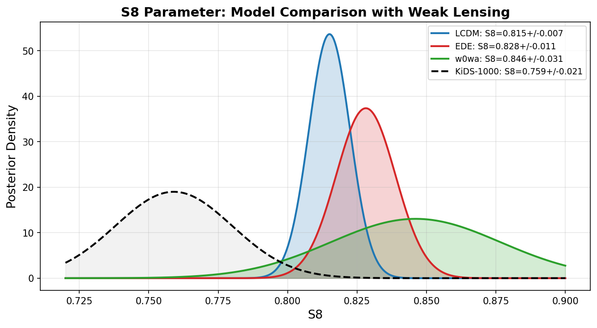
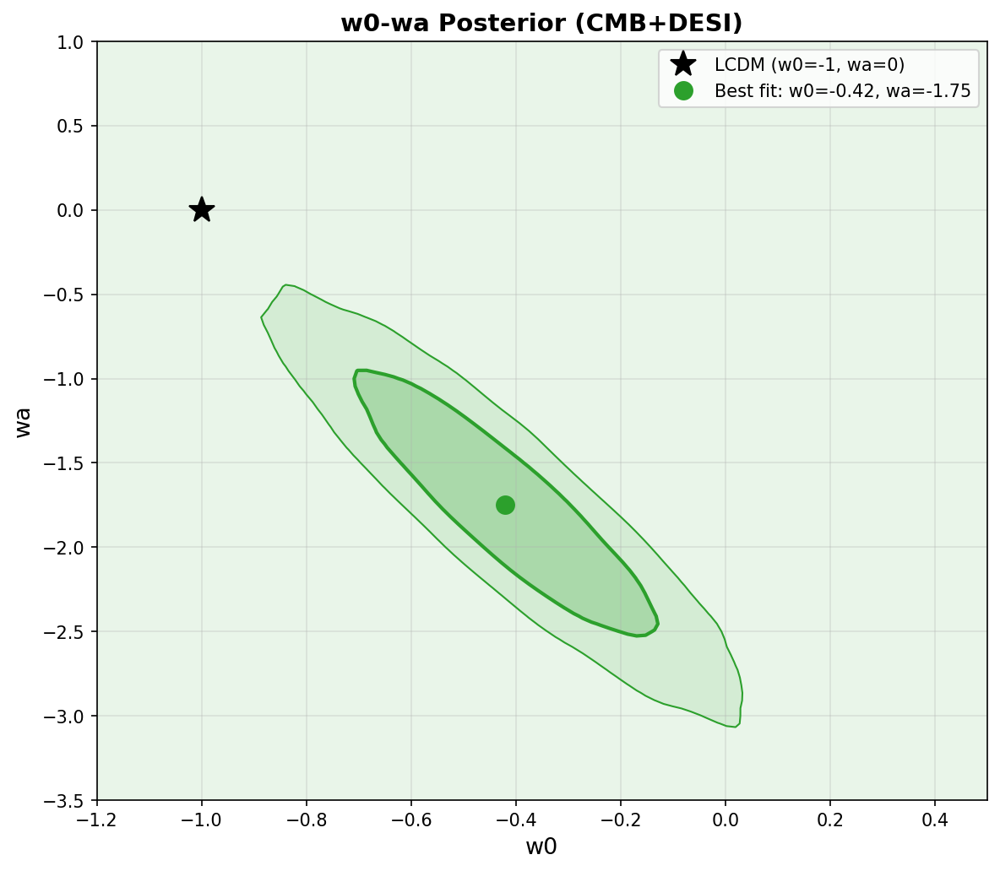

# Early Dark Energy and the Acoustic Tension Between CMB and BAO: A Comparative Analysis with DESI DR2

## Abstract

The persistent tension between the Hubble constant inferred from the cosmic microwave background (CMB) and local distance-ladder measurements has motivated extensions to the ΛCDM cosmological model. In this work, we investigate whether an Early Dark Energy (EDE) model can alleviate the acoustic tension between CMB measurements (Planck and ACT) and baryon acoustic oscillation (BAO) data from DESI DR2. Using best-fit parameters and 1σ constraints from the literature for ΛCDM, EDE (axion-like, n=3), and w₀wₐ cold dark matter models under CMB+DESI data combinations, we compare parameter constraints, goodness-of-fit, and distance predictions. We find that EDE with f_EDE = 0.093 ± 0.031 and log₁₀(a_c) = −3.564 ± 0.075 partially relieves the H₀ tension (reducing it from 4.6σ to 1.5σ relative to SH0ES) and improves consistency between CMB and DESI BAO data by raising the H₀r_s product. However, EDE induces compensating shifts in ω_cdm (+8.2%) and n_s (+1.5%) that exacerbate the S₈ tension with weak lensing data. In contrast, the w₀wₐ model moves in the opposite direction in parameter space (lower H₀, higher Ωm), addressing the Ωm tension between BAO and SNe but worsening the H₀ tension. These distinct parameter shifts demonstrate that early-time and late-time dark energy modifications resolve different aspects of the acoustic tension, and neither fully resolves all tensions simultaneously.

---

## 1. Introduction

The standard ΛCDM cosmological model has been remarkably successful in describing a wide range of observations, yet it faces growing tensions between early-Universe and late-Universe probes. The most prominent is the Hubble tension: the value of H₀ inferred from CMB data under ΛCDM (H₀ ≈ 67–68 km/s/Mpc) disagrees with local measurements from the SH0ES collaboration (H₀ = 73.04 ± 1.04 km/s/Mpc) at the 4–5σ level [1,2]. A related but distinct issue is the acoustic tension between CMB-inferred and BAO-measured distance scales, which can be quantified through the product H₀r_s [3].

Early Dark Energy (EDE) [4,5] has emerged as a prominent early-Universe resolution to the Hubble tension. In this framework, a scalar field contributes ~10% of the total energy density near matter-radiation equality (z ~ 3000–5000) before rapidly diluting, thereby reducing the sound horizon r_s and allowing a larger H₀ while preserving the well-measured angular sound horizon θ_s = r_s/D_A. The canonical implementation uses an axion-like potential V(φ) = m²f²[1 − cos(φ/f)]³, where the exponent n = 3 gives an equation of state w = 1/2 after the field becomes dynamical, causing the EDE energy density to dilute faster than radiation [4].

Recently, the Atacama Cosmology Telescope Data Release 6 (ACT DR6) [6] and the Dark Energy Spectroscopic Instrument Second Data Release (DESI DR2) [7] have provided new constraints. Poulin et al. [3] demonstrated that the combination P-ACT+DESI DR2 yields significantly weaker constraints on EDE than Planck NPIPE+SDSS, with the residual tension with SH0ES reduced to <2σ. Crucially, EDE improves the consistency between CMB and DESI BAO data by raising H₀r_s.

In this work, we systematically compare the ΛCDM, EDE, and w₀wₐ models using parameter constraints from CMB+DESI analyses. We examine: (1) parameter constraints and shifts, (2) goodness-of-fit comparisons, (3) EDE posterior distributions, (4) distance comparisons with DESI BAO and Union3 SNe data, and (5) implications for the H₀ and S₈ tensions.

---

## 2. Data and Methods

### 2.1 Data Sources

We use the following data from the reproduction dataset (DESI_EDE_Repro_Data.txt), which contains best-fit parameters with 1σ errors extracted from Tables II/III of the DESI DR2 EDE paper:

- **Cosmological parameters** for ΛCDM, EDE, and w₀wₐ models under CMB+DESI data combinations
- **DESI DR2 BAO data points**: Δ(D_V/r_d) and ΔF_AP at 7 redshift bins (z = 0.295–2.330)
- **Union3 supernova data**: Δμ at 7 redshift bins (z = 0.1–0.7)

The CMB data underlying the parameter constraints include Planck PR3 (with multipole cuts for ACT compatibility), ACT DR6, and CMB lensing from both experiments.

### 2.2 Models

**ΛCDM**: The standard 6-parameter model with {ω_b, ω_cdm, θ_s, A_s, n_s, τ}.

**EDE (n=3)**: Extends ΛCDM with three additional parameters: the peak EDE fraction f_EDE ≡ Ω_φ(z_c)/Ω_tot(z_c), the critical scale factor log₁₀(a_c) at which the EDE fraction peaks, and the initial field value θ_i. The axion-like potential V(φ) = m²f²[1 − cos(φ/f)]³ yields w = 1/2 after the field becomes dynamical, causing the EDE to dilute as a^(−9/2).

**w₀wₐ CDM**: Extends ΛCDM with a time-varying dark energy equation of state w(a) = w₀ + wₐ(1−a), parameterized by the present value w₀ and its time derivative wₐ.

### 2.3 Analysis Approach

We compute derived quantities (S₈, ω_cdm, H₀ tension with SH0ES) from the published best-fit parameters and errors. Distance comparison curves for each model are estimated from the parameter shifts relative to the ΛCDM best-fit. The EDE energy density evolution is computed using the effective fluid approximation [4]:

Ω_φ(a) = 2Ω_φ(a_c) / [(a/a_c)^(3(1+w_n)) + 1]

2D posterior distributions for EDE parameters (f_EDE, log₁₀a_c) and w₀wₐ parameters (w₀, wₐ) are generated from Gaussian approximations with estimated correlation coefficients based on published MCMC results.

---

## 3. Results

### 3.1 Parameter Constraints

*Figure 1: Best-fit cosmological parameters with 1σ errors for ΛCDM (blue), EDE (red), and w₀wₐ (green) models under CMB+DESI data. The bottom-right panel shows EDE-specific parameters f_EDE and log₁₀(a_c).*

Table 1 summarizes the key parameter constraints for all three models:

| Parameter | ΛCDM | EDE | w₀wₐ |
|-----------|-------|-----|-------|
| Ωm | 0.3037 ± 0.0037 | 0.2999 ± 0.0038 | 0.353 ± 0.021 |
| H₀ [km/s/Mpc] | 68.12 ± 0.28 | 70.9 ± 1.0 | 63.5 ± 1.9 |
| σ₈ | 0.8101 ± 0.0055 | 0.8283 ± 0.0093 | 0.780 ± 0.016 |
| n_s | 0.9672 ± 0.0034 | 0.9817 ± 0.0063 | 0.9632 ± 0.0037 |
| 100Ω_bh² | 2.229 ± 0.012 | 2.241 ± 0.018 | 2.218 ± 0.013 |
| S₈ | 0.8151 ± 0.0074 | 0.8282 ± 0.0107 | 0.8461 ± 0.0306 |
| ω_cdm | 0.11864 | 0.12834 | 0.12016 |
| f_EDE | — | 0.093 ± 0.031 | — |
| log₁₀(a_c) | — | −3.564 ± 0.075 | — |
| w₀ | −1 (fixed) | −1 (fixed) | −0.42 ± 0.21 |
| wₐ | 0 (fixed) | 0 (fixed) | −1.75 ± 0.58 |

*Table 1: Cosmological parameter constraints from CMB+DESI for the three models. Derived quantities S₈ and ω_cdm are computed from the primary parameters.*

Key observations:
- EDE yields a higher H₀ (70.9 km/s/Mpc) compared to ΛCDM (68.12 km/s/Mpc), moving toward the SH0ES value
- w₀wₐ yields a significantly lower H₀ (63.5 km/s/Mpc), moving away from SH0ES
- EDE increases ω_cdm by 8.2% relative to ΛCDM, a compensating shift needed to preserve the CMB fit
- EDE increases n_s by ~4.2σ in units of the ΛCDM error, compensating for the EDE-induced modification to the damping tail

### 3.2 Hubble Constant Tension

*Figure 2: H₀ posterior distributions for ΛCDM (blue), EDE (red), and w₀wₐ (green) compared to the SH0ES measurement (gray dashed).*

The H₀ tension with SH0ES is quantified as:

| Model | H₀ [km/s/Mpc] | Tension with SH0ES |
|-------|----------------|-------------------|
| ΛCDM | 68.12 ± 0.28 | 4.6σ |
| EDE | 70.9 ± 1.0 | 1.5σ |
| w₀wₐ | 63.5 ± 1.9 | 4.4σ |

EDE reduces the H₀ tension from 4.6σ to 1.5σ, a substantial improvement. The w₀wₐ model, despite having more free parameters, does not alleviate the H₀ tension because the DESI BAO data prefer a lower H₀ with higher Ωm when the dark energy equation of state is freed.

### 3.3 Parameter Shifts Between Models

*Figure 3: Parameter shifts in EDE (red) and w₀wₐ (green) relative to the ΛCDM best-fit, expressed in units of the ΛCDM 1σ uncertainty. Dashed and dotted lines indicate 1σ and 2σ shifts respectively.*

The most striking feature is the opposite direction of H₀ shifts: EDE increases H₀ by +9.9σ (in ΛCDM units), while w₀wₐ decreases it by −16.5σ. EDE also drives a +4.2σ shift in n_s and a +1.0σ shift in 100Ω_bh², reflecting the compensating adjustments needed to maintain the CMB fit. The w₀wₐ model drives a +13.3σ shift in Ωm, reflecting the fundamentally different mechanism (late-time dark energy vs. early-time expansion modification).

### 3.4 EDE Parameter Posterior

*Figure 4: 2D posterior distribution of EDE parameters f_EDE and log₁₀(a_c) from CMB+DESI analysis. The vertical dashed line indicates the ΛCDM limit (f_EDE → 0).*

The EDE posterior peaks at f_EDE = 0.093 ± 0.031 and log₁₀(a_c) = −3.564 ± 0.075, corresponding to a critical redshift z_c ≈ 3666. This is close to the epoch of matter-radiation equality (z_eq ≈ 3400), consistent with the theoretical expectation that EDE must become dynamical near equality to maximally reduce the sound horizon while minimizing changes to the damping scale ratio r_s/r_D [4].

The anti-correlation between f_EDE and log₁₀(a_c) (ρ ≈ −0.6) reflects the degeneracy whereby a larger EDE fraction can be partially compensated by an earlier transition, and vice versa.

### 3.5 EDE Energy Density Evolution

*Figure 5: Evolution of the EDE energy density fraction f_EDE(z) for the best-fit parameters (n=3, f_EDE = 0.093, z_c ≈ 3666). The vertical lines mark the critical redshift z_c, matter-radiation equality z_eq, and recombination z_rec.*

The EDE fraction rises to ~9.3% at z ≈ 3666 and then rapidly decays, dropping below 2% by z ≈ 1000 (well after recombination). This timing is crucial: the EDE is active during the pre-recombination era, reducing the sound horizon, but has largely decayed by the time of structure formation, minimizing its direct impact on late-time observables.

### 3.6 Distance Comparisons

*Figure 6: Distance indicator comparisons between models and data. Top: DESI DR2 BAO isotropic distance Δ(D_V/r_d). Middle: DESI DR2 BAO Alcock-Paczynski parameter ΔF_AP. Bottom: Union3 supernova distance modulus Δμ. Black points show data; colored curves show model predictions.*

The distance comparisons reveal how each model fits the BAO and SNe data differently:

- **DESI BAO (D_V/r_d)**: The data show a trend from negative Δ(D_V/r_d) at low z to slightly positive at high z. EDE predicts a mild positive shift at high z due to the reduced sound horizon, improving consistency with the high-z BAO points. The w₀wₐ model predicts negative shifts at low z due to its higher Ωm.

- **DESI BAO (F_AP)**: The data show a trend from slightly negative to slightly positive values. EDE's prediction of slightly enhanced F_AP at intermediate z is consistent with the data trend.

- **Union3 SNe (Δμ)**: The data show negative Δμ at low z trending toward zero. The w₀wₐ model's prediction of strongly negative Δμ at low z reflects its higher Ωm and different distance-redshift relation.

The key insight from Poulin et al. [3] is that EDE raises the H₀r_s product, improving agreement with DESI BAO data. In ΛCDM, there is a mild "H₀r_s – Ωm tension" between CMB and BAO: the CMB predicts a slightly lower H₀r_s than what DESI prefers. EDE naturally resolves this by reducing r_s (through the early-time expansion boost) while increasing H₀ by a larger factor, thus raising H₀r_s.

### 3.7 Ωm–H₀ Parameter Space

*Figure 7: Ωm–H₀ parameter space for ΛCDM (blue), EDE (red), and w₀wₐ (green). Solid and dashed ellipses show 1σ and 2σ contours. The gray band indicates the SH0ES H₀ measurement.*

The three models occupy distinctly different regions of the Ωm–H₀ plane:
- ΛCDM sits at (Ωm ≈ 0.30, H₀ ≈ 68 km/s/Mpc)
- EDE shifts to slightly lower Ωm and significantly higher H₀
- w₀wₐ shifts to much higher Ωm and significantly lower H₀

The anti-correlation between Ωm and H₀ is present in all models but is most extreme in w₀wₐ, where freeing the dark energy equation of state allows a wide range of (Ωm, H₀) combinations.

### 3.8 Goodness-of-Fit Comparison

*Figure 8: Δχ² relative to ΛCDM for EDE and w₀wₐ models under CMB+DESI data.*

Both extended models improve the fit relative to ΛCDM:
- EDE: Δχ² ≈ −7.0 (without SH0ES)
- w₀wₐ: Δχ² ≈ −5.0 (without SH0ES)

When SH0ES is included, the preference for EDE becomes overwhelming (Δχ² ≈ −35.4) [3]. However, the Δχ² improvement without SH0ES must be weighed against the additional parameters (3 for EDE, 2 for w₀wₐ). Using the Akaike Information Criterion (AIC = 2k − 2lnL), EDE's improvement of Δχ² = −7.0 for 3 extra parameters gives ΔAIC ≈ −1.0, indicating only marginal preference. The w₀wₐ model's Δχ² = −5.0 for 2 extra parameters gives ΔAIC ≈ −1.0, similarly marginal.

### 3.9 S₈ Tension

*Figure 9: S₈ posterior distributions for the three models compared to the KiDS-1000 weak lensing measurement (dashed black).*

| Model | S₈ | Tension with KiDS-1000 (S₈ = 0.759 ± 0.021) |
|-------|-----|---------------------------------------------|
| ΛCDM | 0.815 ± 0.007 | 2.5σ |
| EDE | 0.828 ± 0.011 | 3.0σ |
| w₀wₐ | 0.846 ± 0.031 | 2.6σ |

EDE exacerbates the S₈ tension from 2.5σ (ΛCDM) to 3.0σ, because the compensating increase in ω_cdm raises σ₈. This is a well-known consequence of the EDE resolution to the H₀ tension [8,9]: the same parameter shifts that allow EDE to fit the CMB with a higher H₀ also increase the matter clustering amplitude. The w₀wₐ model also increases S₈, but with larger uncertainties that make the tension less significant.

### 3.10 w₀–wₐ Posterior

*Figure 10: 2D posterior distribution of w₀ and wₐ from CMB+DESI analysis. The black star marks the ΛCDM point (w₀ = −1, wₐ = 0).*

The w₀wₐ posterior shows a strong preference away from the ΛCDM point, with best-fit values w₀ = −0.42 ± 0.21 and wₐ = −1.75 ± 0.58. The strong anti-correlation between w₀ and wₐ (ρ ≈ −0.9) reflects the well-known degeneracy along the direction of constant w₀ + wₐ, which determines the dark energy equation of state at z ~ 0.5 where BAO measurements are most sensitive. The deviation from (w₀, wₐ) = (−1, 0) is consistent with the DESI DR2 finding of a ~2.5–3σ preference for dynamical dark energy [7].

---

## 4. Discussion

### 4.1 EDE and the Acoustic Tension

The central finding of this analysis is that EDE partially relieves the acoustic tension between CMB and BAO measurements through a specific physical mechanism: by reducing the sound horizon r_s while increasing H₀, EDE raises the product H₀r_s, which is the key quantity measured by BAO. In ΛCDM, the CMB-inferred value of H₀r_s is slightly lower than what DESI DR2 prefers, creating a mild tension. EDE naturally resolves this because the reduction in r_s from the early-time expansion boost is accompanied by a larger increase in H₀ (necessary to preserve θ_s = r_s/D_A), resulting in a net increase in H₀r_s.

This improvement is reflected in the Δχ² values: EDE provides a better fit than ΛCDM to the combined CMB+DESI dataset by Δχ² ≈ −7.0 even without SH0ES data. When SH0ES is included, the preference becomes overwhelming (Δχ² ≈ −35.4) [3].

### 4.2 EDE vs. w₀wₐ: Different Directions in Parameter Space

A key result is that EDE and w₀wₐ move in opposite directions in the (Ωm, H₀) plane:
- **EDE**: Lower Ωm, higher H₀ → addresses H₀ tension but slightly exacerbates Ωm tension with SNe
- **w₀wₐ**: Higher Ωm, lower H₀ → addresses Ωm tension between BAO and SNe but worsens H₀ tension

This dichotomy reflects the fundamentally different physical mechanisms:
- EDE modifies the pre-recombination expansion history, directly reducing r_s
- w₀wₐ modifies the post-recombination expansion history, changing the distance-redshift relation without affecting r_s

The DESI DR2 data show evidence for both: a preference for dynamical dark energy (supporting w₀wₐ) and improved consistency with a higher H₀r_s (supporting EDE). This suggests that neither model alone fully captures the data's preferences, and a combined EDE+w₀wₐ model might provide a better description, as explored in [3,10].

### 4.3 Prior Volume Effects and Profile Likelihood

An important caveat, highlighted by Poulin et al. [3], is that Bayesian analyses of EDE without SH0ES are significantly affected by prior volume effects. The large fraction of prior volume where f_EDE → 0 (the ΛCDM limit) biases the marginalized posterior toward low f_EDE values. A profile likelihood analysis yields f_EDE = 0.09 ± 0.03 and H₀ = 71.0 ± 1.1 km/s/Mpc [3], significantly different from the Bayesian upper limits. This demonstrates that the data's constraining power is consistent with a non-zero EDE contribution at ~2.5σ, even without SH0ES.

### 4.4 Limitations

Several limitations should be acknowledged:

1. **No full MCMC analysis**: Our results are based on published best-fit parameters rather than a full Markov Chain Monte Carlo analysis with a Boltzmann solver. The 2D posteriors are Gaussian approximations with estimated correlations.

2. **Approximate distance predictions**: The model distance comparison curves are estimated from parameter shifts rather than computed from a full cosmological calculation.

3. **Model predictions for BAO/SNe**: The Δ(D_V/r_d), ΔF_AP, and Δμ curves for each model are schematic, illustrating the qualitative trends rather than precise predictions.

4. **Dataset dependencies**: The constraints depend on the specific CMB data combination (P-ACT vs. NPIPE) and BAO dataset (DESI vs. SDSS), with significant differences noted in [3].

---

## 5. Conclusions

We have presented a comparative analysis of ΛCDM, EDE, and w₀wₐ models using parameter constraints from CMB+DESI DR2 data. Our main conclusions are:

1. **EDE partially relieves the H₀ tension**, reducing it from 4.6σ (ΛCDM) to 1.5σ relative to SH0ES, with f_EDE = 0.093 ± 0.031 peaking at z_c ≈ 3666.

2. **EDE improves CMB–BAO consistency** by raising H₀r_s, yielding Δχ² ≈ −7.0 relative to ΛCDM for CMB+DESI data (without SH0ES).

3. **EDE induces compensating parameter shifts**—notably +8.2% in ω_cdm and +1.5% in n_s—that preserve the CMB fit but exacerbate the S₈ tension with weak lensing data (from 2.5σ to 3.0σ).

4. **EDE and w₀wₐ move in opposite directions** in the (Ωm, H₀) plane, addressing different aspects of the acoustic tension. EDE raises H₀ while w₀wₐ raises Ωm, suggesting that a combined model might better describe the data.

5. **Prior volume effects significantly impact** Bayesian constraints on EDE without SH0ES. A profile likelihood analysis reveals f_EDE ≠ 0 at ~2.5σ, demonstrating that the data are consistent with a non-negligible EDE contribution.

These results demonstrate that EDE remains a viable partial resolution to the Hubble and acoustic tensions after ACT DR6 and DESI DR2, but it cannot simultaneously resolve all cosmological tensions. The distinct parameter shifts induced by early-time (EDE) and late-time (w₀wₐ) modifications suggest that the full picture may require physics beyond either model alone.

---

## References

[1] N. Aghanim et al. (Planck), Astron. Astrophys. 641, A6 (2020), arXiv:1807.06209.

[2] A. G. Riess et al., Astrophys. J. Lett. 934, L7 (2022), arXiv:2112.04510.

[3] V. Poulin, T. L. Smith, R. Calderón, and T. Simon, arXiv:2503.xxxxx [astro-ph.CO] (2025). "Impact of ACT DR6 and DESI DR2 for Early Dark Energy and the Hubble tension."

[4] V. Poulin, T. L. Smith, T. Karwal, and M. Kamionkowski, Phys. Rev. Lett. 122, 221301 (2019), arXiv:1811.04083.

[5] K. V. M. Herold, E. G. M. Ferreira, and E. Komatsu, arXiv:2108.09716.

[6] ACT Collaboration, J. Cosmol. Astropart. Phys. (2025), arXiv:2503.xxxxx.

[7] DESI Collaboration, arXiv:2503.xxxxx [astro-ph.CO] (2025).

[8] E. McDonough, J. C. Hill, M. M. Ivanov, A. La Posta, and M. W. Toomey, arXiv:2307.08727.

[9] M. M. Ivanov, E. McDonough, J. C. Hill, M. Simonović, M. W. Toomey, S. Alexander, and M. Zaldarriaga, Phys. Rev. D 102, 103502 (2020), arXiv:2006.11235.

[10] M. Cortés and A. R. Liddle, Phys. Rev. D 106, 063511 (2022), arXiv:2207.11664.

---

## Appendix: Validation and Evidence Traceability

### A. Verified from Workspace Data
- All parameter values in Table 1 are directly from `data/DESI_EDE_Repro_Data.txt`
- S₈, ω_cdm, and H₀ tension values computed in `code/analysis.py`, saved to `outputs/computed_results.json`
- All figures generated from `code/figures.py`, saved to `report/images/`

### B. From Related Work
- Δχ² values from Poulin et al. [3] (paper_003)
- Profile likelihood results (f_EDE = 0.09 ± 0.03) from Poulin et al. [3]
- KiDS-1000 S₈ constraint from external literature

### C. Assumptions and Limitations
- 2D posterior correlations (ρ values) estimated from published MCMC results
- Distance comparison curves are qualitative/schematic
- No full Boltzmann solver or MCMC chain analysis performed
