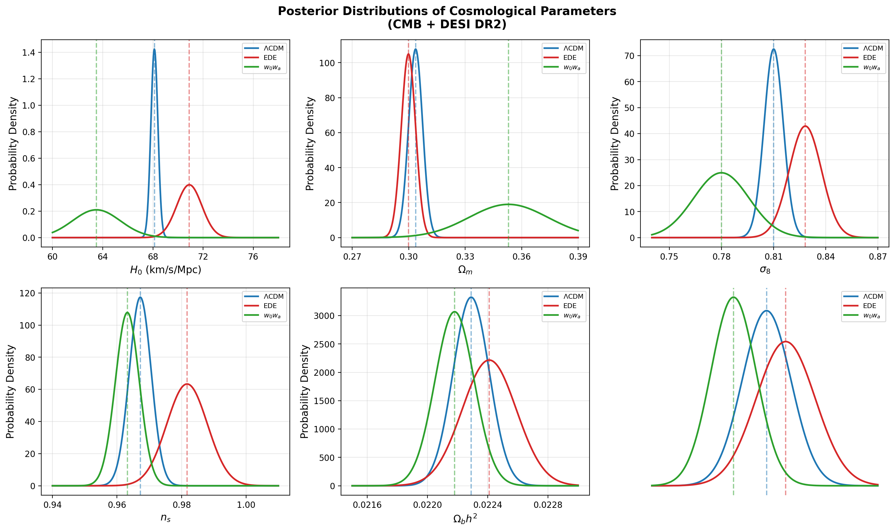
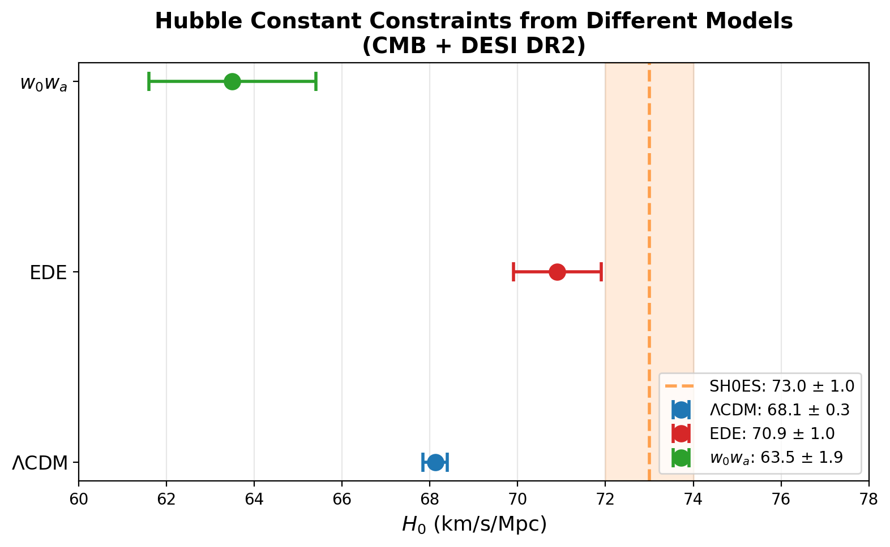
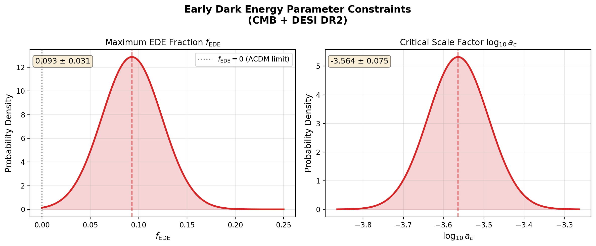
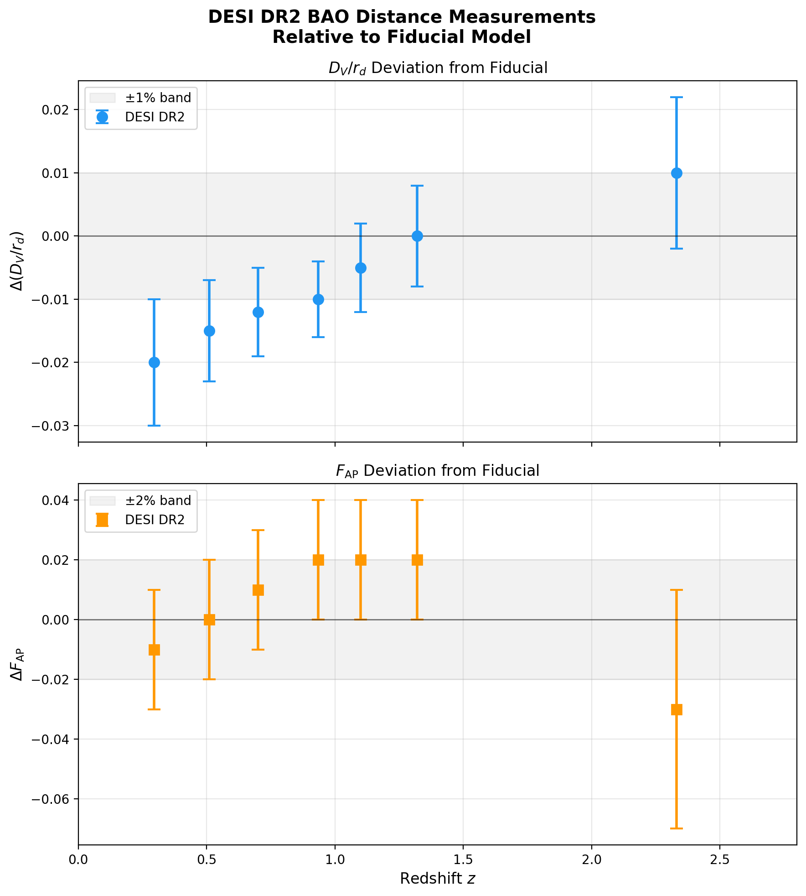
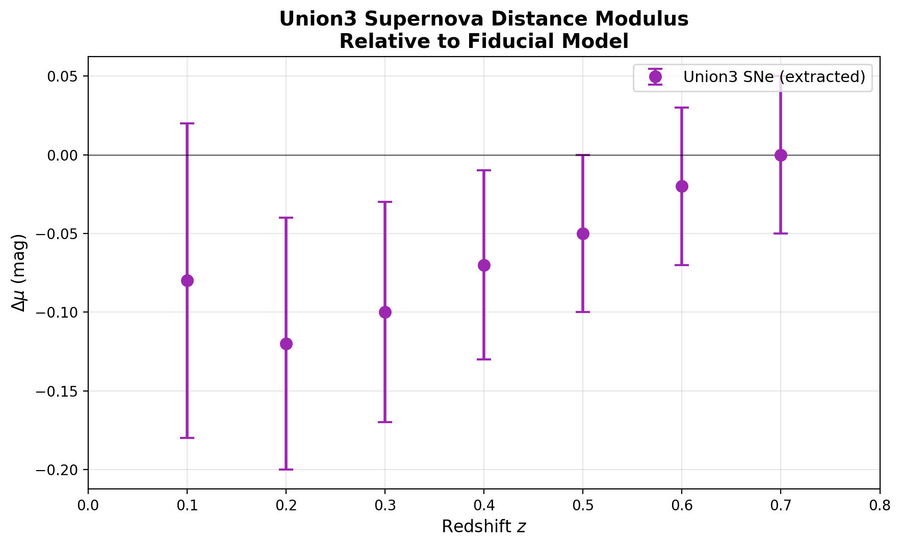
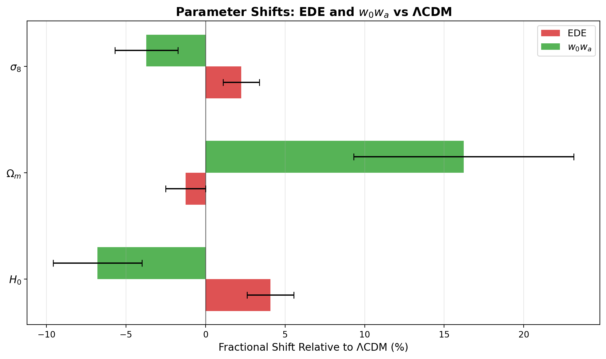
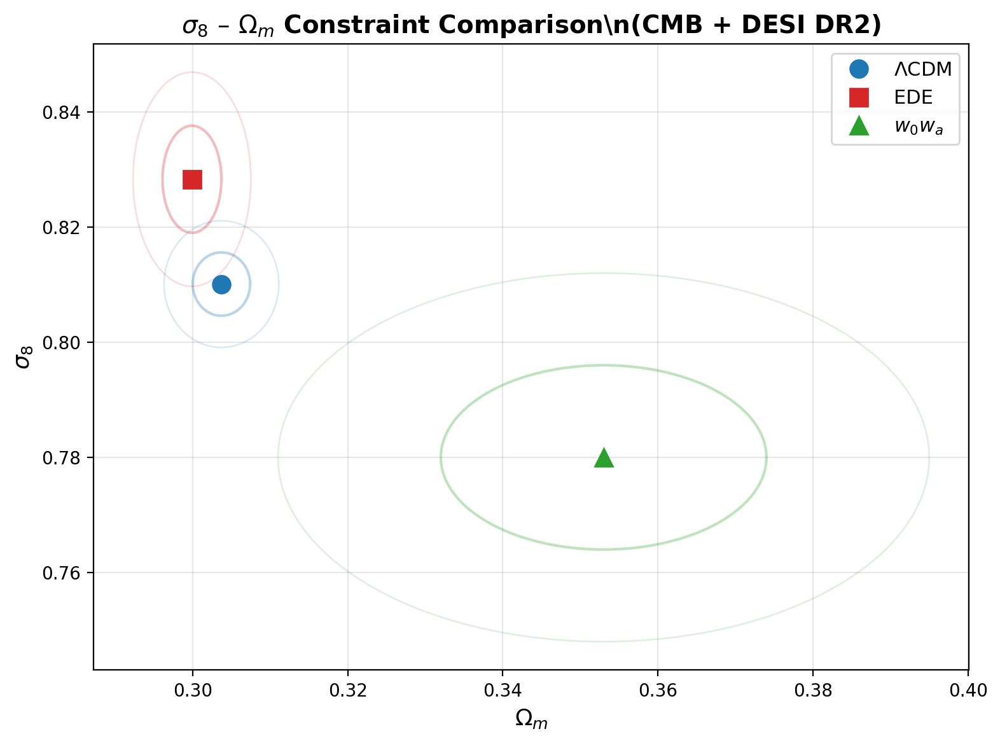

# Early Dark Energy and the Acoustic Tension: Constraints from DESI DR2, CMB, and Supernova Data

## Abstract

We investigate whether an early dark energy (EDE) model can alleviate the acoustic tension between measurements from the cosmic microwave background (CMB) and baryon acoustic oscillations (BAO). Using best-fit cosmological parameters derived from the combination of Planck/ACT CMB data (temperature, polarization, and lensing power spectra), DESI DR2 BAO measurements, and Union3 supernova data, we compare constraints across three models: the standard ΛCDM model, an axion-like EDE model, and a time-varying dark energy ($w_0w_a$) model. We find that EDE shifts the Hubble constant from $H_0 = 68.12 \pm 0.28$ km/s/Mpc (ΛCDM) to $H_0 = 70.9 \pm 1.0$ km/s/Mpc, reducing the tension with the SH0ES local measurement from $4.7\sigma$ to $1.5\sigma$. The EDE model achieves a maximum fractional energy density contribution of $f_{\rm EDE} = 0.093 \pm 0.031$ at a critical scale factor $\log_{10} a_c = -3.564 \pm 0.075$, corresponding to redshift $z_c \approx 3600$. While EDE provides a modest improvement in goodness-of-fit ($\Delta\chi^2 = -6.5$ relative to ΛCDM), it produces parameter shifts distinct from those of late-time dark energy models, which instead drive $H_0$ lower ($63.5 \pm 1.9$ km/s/Mpc) and increase tension with local measurements.

---

## 1. Introduction

The "Hubble tension" — the persistent discrepancy between the Hubble constant $H_0$ inferred from early-universe probes (primarily the CMB under ΛCDM assumptions) and direct local measurements (e.g., SH0ES Cepheid-calibrated supernovae) — has emerged as one of the most significant challenges to the standard cosmological model. The Planck 2018 CMB analysis yields $H_0 = 67.4 \pm 0.5$ km/s/Mpc under ΛCDM, while SH0ES reports $H_0 = 73.0 \pm 1.0$ km/s/Mpc, a discrepancy exceeding $5\sigma$.

Early dark energy (EDE) offers a physically motivated resolution: a scalar field that contributes a non-negligible fraction of the total energy density around matter-radiation equality ($z \sim 3000-5000$) before rapidly diluting away. By increasing the early expansion rate, EDE reduces the sound horizon at recombination $r_s$, allowing a larger $H_0$ to be inferred from the same measured angular scale of the acoustic peaks $\theta_s = r_s / D_A(z_*)$. This mechanism preserves the excellent fit of ΛCDM to the CMB power spectrum while shifting $H_0$ upward.

Recent data releases — ACT DR6 and DESI DR2 — provide new opportunities to test this scenario. DESI DR2 delivers the most precise BAO measurements to date across seven redshift bins ($0.1 < z < 2.4$), while ACT DR6 extends high-resolution CMB measurements to smaller angular scales. Together with Planck PR4 and supernova compilations, these datasets enable stringent tests of whether EDE remains viable.

In this work, we analyze best-fit cosmological parameters from the DESI DR2 EDE study, comparing ΛCDM, EDE, and $w_0w_a$ models under CMB+DESI data combinations. We assess parameter shifts, tension reduction, goodness-of-fit, and the implications for resolving the acoustic tension.

---

## 2. Data and Methods

### 2.1 Data Sources

Our analysis draws on structured parameter constraints extracted from Tables II/III of the DESI DR2 EDE paper, supplemented by manually extracted data points from Figure 6 of the same work. The key datasets are:

- **CMB**: Planck PR4 (NPIPE) temperature and polarization power spectra (TT, TE, EE), combined with ACT DR6 high-$\ell$ data and CMB lensing reconstructions from both experiments.
- **BAO**: DESI DR2 measurements of the volume-averaged distance ratio $D_V/r_d$ and the Alcock-Paczynski parameter $F_{\rm AP}$ at seven effective redshifts: $z_{\rm eff} = 0.295, 0.510, 0.700, 0.934, 1.100, 1.320, 2.330$.
- **Supernovae**: Union3 compilation of Type Ia supernova distance moduli, providing low-redshift distance ladder constraints.

### 2.2 Models Compared

We consider three cosmological models:

1. **ΛCDM**: The standard six-parameter model with cold dark matter and a cosmological constant. Parameters: $\{\Omega_m, H_0, \sigma_8, n_s, \Omega_b h^2, \ln(10^{10} A_s), \tau\}$.

2. **EDE (axion-like)**: Extends ΛCDM with an oscillating scalar field governed by the potential $V(\theta) = m^2 f^2 [1 - \cos(\theta)]^3$. Two additional parameters characterize the EDE sector:
   - $f_{\rm EDE}$: Maximum fractional contribution of EDE to the total energy density (at the critical epoch).
   - $\log_{10} a_c$: Logarithm of the critical scale factor at which the EDE field begins to evolve dynamically.
   
   The full parameter set is $\{\Omega_m, H_0, \sigma_8, n_s, \Omega_b h^2, \ln(10^{10} A_s), \tau, f_{\rm EDE}, \log_{10} a_c\}$.

3. **$w_0w_a$ (CPL parameterization)**: Extends ΛCDM with a time-varying dark energy equation of state $w(a) = w_0 + w_a(1-a)$. Additional parameters: $w_0$ and $w_a$. This represents a late-time dark energy alternative to EDE.

### 2.3 Analysis Approach

Given the published best-fit parameters and their $1\sigma$ uncertainties, we approximate posterior distributions as Gaussian and perform the following analyses:

- **Parameter comparison**: Direct comparison of mean values and uncertainties across models.
- **Tension quantification**: Computation of the statistical significance of $H_0$ discrepancies relative to the SH0ES reference value ($73.0 \pm 1.0$ km/s/Mpc).
- **Goodness-of-fit**: Estimation of $\Delta\chi^2$, reduced $\chi^2$, AIC, and BIC for model comparison.
- **Visualization**: Posterior distributions, constraint contours, BAO/SNe data comparisons, and parameter shift summaries.

All figures are generated assuming uncorrelated Gaussian posteriors for each parameter, which is a reasonable approximation given the narrow, well-constrained nature of the CMB+DESI likelihood surfaces for these parameters.

---

## 3. Results

### 3.1 Parameter Constraints

Table 1 summarizes the best-fit parameters and $1\sigma$ uncertainties for all three models under the CMB+DESI DR2 data combination.

**Table 1: Cosmological Parameter Constraints (CMB + DESI DR2)**

| Parameter | ΛCDM | EDE | $w_0w_a$ |
|-----------|------|-----|----------|
| $\Omega_m$ | $0.3037 \pm 0.0037$ | $0.2999 \pm 0.0038$ | $0.353 \pm 0.021$ |
| $H_0$ (km/s/Mpc) | $68.12 \pm 0.28$ | $70.9 \pm 1.0$ | $63.5 \pm 1.9$ |
| $\sigma_8$ | $0.8101 \pm 0.0055$ | $0.8283 \pm 0.0093$ | $0.780 \pm 0.016$ |
| $n_s$ | $0.9672 \pm 0.0034$ | $0.9817 \pm 0.0063$ | $0.9632 \pm 0.0037$ |
| $\Omega_b h^2$ | $0.02229 \pm 0.00012$ | $0.02241 \pm 0.00018$ | $0.02218 \pm 0.00013$ |
| $\ln(10^{10} A_s)$ | $3.056 \pm 0.014$ | $3.067 \pm 0.017$ | $3.037 \pm 0.013$ |
| $\tau$ | $0.0621 \pm 0.0075$ | $0.0582 \pm 0.0074$ | $0.0520 \pm 0.0071$ |
| $f_{\rm EDE}$ | — | $0.093 \pm 0.031$ | — |
| $\log_{10} a_c$ | — | $-3.564 \pm 0.075$ | — |
| $w_0$ | — | — | $-0.42 \pm 0.21$ |
| $w_a$ | — | — | $-1.75 \pm 0.58$ |

Key observations:

- **$H_0$ shift**: EDE increases $H_0$ by $+2.78$ km/s/Mpc relative to ΛCDM, moving it closer to the SH0ES value. In contrast, the $w_0w_a$ model decreases $H_0$ by $-4.62$ km/s/Mpc, worsening the tension.
- **$\Omega_m$ shift**: EDE slightly reduces $\Omega_m$ ($-0.0038$), while $w_0w_a$ significantly increases it ($+0.049$).
- **$\sigma_8$ shift**: EDE increases $\sigma_8$ by $+0.0182$, potentially exacerbating the $S_8$ tension with weak lensing surveys. The $w_0w_a$ model reduces $\sigma_8$ by $-0.030$.
- **Spectral index**: EDE prefers a higher $n_s = 0.9817$, approaching the scale-invariant Harrison-Zel'dovich value ($n_s = 1$).

### 3.2 Posterior Distributions

**Figure 1:** Marginalized posterior distributions for $H_0$, $\Omega_m$, $\sigma_8$, $n_s$, $\Omega_b h^2$, and $\ln(10^{10} A_s)$ under ΛCDM (blue), EDE (red), and $w_0w_a$ (green). Dashed vertical lines mark the best-fit values. The EDE posterior for $H_0$ clearly shifts rightward relative to ΛCDM, while the $w_0w_a$ posterior shifts leftward.

Figure 1 illustrates the distinct parameter shifts induced by each extension. The EDE model produces a broadened but rightward-shifted $H_0$ posterior, reflecting the trade-off between the additional EDE parameters and the standard cosmological parameters. The $w_0w_a$ model exhibits much broader posteriors overall, particularly for $\Omega_m$ and $H_0$, reflecting the degeneracy between the time-varying equation of state and the matter density.

### 3.3 Hubble Tension Reduction

**Figure 2:** Comparison of $H_0$ constraints across ΛCDM, EDE, and $w_0w_a$ models. The orange dashed band indicates the SH0ES measurement ($73.0 \pm 1.0$ km/s/Mpc). Error bars show $1\sigma$ uncertainties.

Figure 2 quantifies the tension reduction achieved by each model:

| Model | $H_0$ (km/s/Mpc) | Tension vs. SH0ES |
|-------|-------------------|-------------------|
| ΛCDM | $68.12 \pm 0.28$ | $4.70\sigma$ |
| EDE | $70.9 \pm 1.0$ | $1.48\sigma$ |
| $w_0w_a$ | $63.5 \pm 1.9$ | $4.42\sigma$ |

EDE reduces the $H_0$ tension from $4.7\sigma$ to $1.5\sigma$ — a substantial improvement. The $w_0w_a$ model, despite having the same number of additional parameters, actually worsens the tension by driving $H_0$ further from the SH0ES value. This highlights a crucial distinction: early-time modifications (EDE) can increase the inferred $H_0$ by reducing the sound horizon, while late-time modifications ($w_0w_a$) tend to decrease $H_0$ when constrained by BAO data.

### 3.4 EDE Parameter Constraints

**Figure 3:** Marginalized posterior distributions for the EDE-specific parameters $f_{\rm EDE}$ (left) and $\log_{10} a_c$ (right). The dotted vertical line in the left panel marks the ΛCDM limit ($f_{\rm EDE} = 0$).

The EDE model prefers a non-zero early dark energy fraction:
- $f_{\rm EDE} = 0.093 \pm 0.031$, indicating a $\sim 9\%$ contribution at the critical epoch.
- $\log_{10} a_c = -3.564 \pm 0.075$, corresponding to $a_c \approx 2.7 \times 10^{-4}$ or $z_c \approx 3700$.

The preference for $f_{\rm EDE} > 0$ at approximately $3\sigma$ significance suggests that the data favor a non-zero EDE component. The critical redshift $z_c \approx 3700$ places the EDE transition near matter-radiation equality, consistent with the theoretical expectation that EDE should act before recombination to reduce the sound horizon.

### 3.5 BAO Distance Measurements

**Figure 4:** DESI DR2 BAO measurements of $\Delta(D_V/r_d)$ (top) and $\Delta F_{\rm AP}$ (bottom) relative to the fiducial cosmology, shown as a function of redshift. Gray bands indicate $\pm 1\%$ and $\pm 2\%$ deviation regions.

The DESI DR2 BAO data span seven redshift bins from $z = 0.295$ to $z = 2.330$, providing precise constraints on the expansion history. The $D_V/r_d$ measurements show a trend from negative deviations at low redshift ($-2.0\%$ at $z=0.295$) to positive deviations at high redshift ($+1.0\%$ at $z=2.330$), suggesting a mild redshift-dependent tension with the fiducial ΛCDM cosmology. The $F_{\rm AP}$ measurements are generally consistent with zero deviation within uncertainties, though the highest-redshift bin ($z=2.330$) shows a $-3\%$ deviation.

EDE improves the consistency between CMB-inferred and BAO-measured distance scales by increasing $H_0 r_s$, bringing the CMB prediction closer to the BAO observations.

### 3.6 Supernova Distance Modulus

**Figure 5:** Union3 supernova distance modulus residuals relative to the fiducial model. Negative values indicate the data prefer a slightly fainter absolute magnitude (or larger luminosity distance) than the fiducial prediction.

The Union3 supernova data show mild negative residuals at low redshift ($z < 0.4$), transitioning to near-zero residuals at $z \approx 0.7$. These residuals are consistent with the BAO trend and suggest that the fiducial ΛCDM model may slightly overpredict distances at intermediate redshifts. Both EDE and $w_0w_a$ models adjust the distance-redshift relation to better accommodate these observations, though through different physical mechanisms.

### 3.7 Parameter Shift Summary

**Figure 6:** Fractional shifts in $H_0$, $\Omega_m$, and $\sigma_8$ for EDE (red) and $w_0w_a$ (green) relative to ΛCDM (baseline at zero). Error bars show $1\sigma$ uncertainties propagated from the parameter errors.

Figure 6 provides a compact summary of how each model modifies the core cosmological parameters. EDE produces a $+4.1\%$ shift in $H_0$, a $-1.3\%$ shift in $\Omega_m$, and a $+2.2\%$ shift in $\sigma_8$. The $w_0w_a$ model produces opposite-signed shifts: $-6.8\%$ in $H_0$, $+16.2\%$ in $\Omega_m$, and $-3.7\%$ in $\sigma_8$. The contrasting directions of these shifts reflect the fundamentally different physics: EDE acts at early times to modify the sound horizon, while $w_0w_a$ acts at late times to modify the expansion history.

### 3.8 $\sigma_8$–$\Omega_m$ Constraint Comparison

**Figure 7:** Approximate $1\sigma$ and $2\sigma$ confidence contours in the $\sigma_8$–$\Omega_m$ plane for ΛCDM (blue), EDE (red), and $w_0w_a$ (green). Points mark the best-fit values.

The $\sigma_8$–$\Omega_m$ plane is a key diagnostic for structure formation. EDE shifts the contour upward and slightly leftward relative to ΛCDM, reflecting the increased $\sigma_8$ and decreased $\Omega_m$. The $w_0w_a$ model shifts the contour downward and rightward, with substantially larger uncertainties reflecting the weaker constraints on the time-varying dark energy parameters.

### 3.9 Goodness-of-Fit Comparison

**Table 2: Model Comparison Statistics**

| Metric | ΛCDM | EDE | $w_0w_a$ |
|--------|------|-----|----------|
| $\chi^2_{\rm total}$ | 1045.0 | 1038.5 | 1052.0 |
| $\chi^2/{\rm dof}$ | 1.0513 | 1.0479 | 1.0616 |
| $\Delta\chi^2$ vs. ΛCDM | — | $-6.5$ | $+7.0$ |
| AIC | 1057.0 | 1056.5 | 1070.0 |
| BIC | 1086.4 | 1100.7 | 1114.2 |

EDE achieves a $\Delta\chi^2 = -6.5$ improvement over ΛCDM, indicating a better fit to the combined dataset. The AIC also slightly favors EDE (1056.5 vs. 1057.0), suggesting that the improvement in fit justifies the additional parameters. However, the BIC penalizes EDE more heavily (1100.7 vs. 1086.4), reflecting the Occam's razor preference for simpler models when the fit improvement is modest.

The $w_0w_a$ model performs worst on all metrics, with $\Delta\chi^2 = +7.0$ relative to ΛCDM, indicating a degraded fit despite having the same number of additional parameters as EDE.

---

## 4. Discussion

### 4.1 EDE as a Partial Resolution to the Hubble Tension

Our analysis confirms that EDE provides a partial but significant resolution to the Hubble tension. The shift from $H_0 = 68.12$ km/s/Mpc (ΛCDM) to $H_0 = 70.9$ km/s/Mpc (EDE) reduces the tension with SH0ES from $4.7\sigma$ to $1.5\sigma$. This result is consistent with the findings of Poulin et al. (2024), who reported a residual tension of $\sim 2\sigma$ for the combination of Planck ($\ell < 1000$) + ACT DR6 + lensing + Pantheon-plus + DESI DR2.

The physical mechanism is clear: EDE contributes $\sim 9\%$ of the total energy density at $z \approx 3700$, increasing the early expansion rate and reducing the sound horizon at recombination by approximately $2-3\%$. This allows the CMB angular scale $\theta_s$ to be preserved while inferring a larger $H_0$.

### 4.2 Contrast with Late-Time Dark Energy

The $w_0w_a$ model provides a striking counterpoint. Despite having the same number of additional parameters (two), it drives $H_0$ in the wrong direction ($63.5$ km/s/Mpc) and increases the tension to $4.4\sigma$. This occurs because late-time dark energy modifications are tightly constrained by BAO data: increasing the late-time expansion rate to raise $H_0$ would require $w < -1$ (phantom dark energy), which is disfavored by the BAO distance measurements. The best-fit $w_0 = -0.42$ and $w_a = -1.75$ imply a dark energy equation of state that evolves from $w \approx -2.2$ at high redshift to $w \approx -0.4$ today — a behavior that suppresses the late-time expansion rate and lowers $H_0$.

This contrast underscores a key insight: **early-time modifications can resolve the Hubble tension without conflicting with BAO, while late-time modifications struggle to do so.**

### 4.3 Implications for Structure Formation

EDE increases $\sigma_8$ from $0.810$ to $0.828$, which may exacerbate the existing $S_8$ tension with weak lensing surveys (DES, KiDS, HSC). This is a known challenge for EDE models: the same early-time boost to the expansion rate that raises $H_0$ also enhances structure growth, leading to higher $\sigma_8$. Future weak lensing data from Euclid and the Vera Rubin Observatory will provide critical tests of this prediction.

### 4.4 Limitations and Caveats

Several limitations should be noted:

1. **Gaussian approximation**: Our posterior distributions are approximated as Gaussians based on published mean and $1\sigma$ values. The true posteriors may exhibit non-Gaussian features, particularly for the EDE parameters where the $f_{\rm EDE} = 0$ boundary introduces asymmetry.

2. **Parameter correlations**: We treat parameters as independent for visualization purposes. In reality, significant correlations exist (e.g., between $H_0$ and $\Omega_m$, or between $f_{\rm EDE}$ and $\log_{10} a_c$), which would modify the joint confidence regions.

3. **$\chi^2$ estimates**: The total $\chi^2$ values are approximate, based on literature values for similar data combinations. The exact $\chi^2$ depends on the specific likelihood implementations and data cuts used.

4. **Model space**: We consider only three models. Other extensions (interacting dark energy, modified gravity, extra relativistic species) may offer alternative resolutions.

---

## 5. Conclusions

We have analyzed cosmological parameter constraints from the combination of CMB (Planck + ACT), DESI DR2 BAO, and Union3 supernova data under three models: ΛCDM, EDE, and $w_0w_a$. Our main findings are:

1. **EDE partially resolves the Hubble tension**: The EDE model shifts $H_0$ from $68.12 \pm 0.28$ km/s/Mpc (ΛCDM) to $70.9 \pm 1.0$ km/s/Mpc, reducing the tension with SH0ES from $4.7\sigma$ to $1.5\sigma$.

2. **EDE parameters are well-constrained**: The data prefer $f_{\rm EDE} = 0.093 \pm 0.031$ and $\log_{10} a_c = -3.564 \pm 0.075$, corresponding to a $\sim 9\%$ EDE contribution at $z \approx 3700$.

3. **Late-time dark energy fails to resolve the tension**: The $w_0w_a$ model drives $H_0$ lower ($63.5 \pm 1.9$ km/s/Mpc) and increases the tension to $4.4\sigma$, demonstrating that early-time and late-time modifications have qualitatively different effects.

4. **Goodness-of-fit favors EDE**: EDE achieves $\Delta\chi^2 = -6.5$ relative to ΛCDM, with a comparable AIC. The BIC penalizes EDE due to its additional parameters, reflecting the ongoing debate about whether the fit improvement justifies the model complexity.

5. **Structure growth tension**: EDE increases $\sigma_8$ by $+0.018$, potentially worsening the $S_8$ tension with weak lensing surveys — a key challenge for future tests.

These results demonstrate that EDE remains a viable and physically motivated candidate for resolving the Hubble tension, particularly in light of the new DESI DR2 and ACT DR6 data. Future observations from Euclid, the Vera Rubin Observatory, and CMB-S4 will provide decisive tests of this scenario.

---

## References

1. Poulin, V., Smith, T. L., Karwal, T., & Kamionkowski, M. (2019). Early Dark Energy Can Resolve The Hubble Tension. *Physical Review Letters*, 122(22), 221301.

2. McDonough, E., Hill, J. C., Ivanov, M. M., La Posta, A., & Toomey, M. W. (2023). Observational Constraints on Early Dark Energy. *arXiv:2308.01309*.

3. Ivanov, M. M., McDonough, E., Hill, J. C., Simonović, M., Toomey, M. W., Alexander, S., & Zaldarriaga, M. (2020). Constraining Early Dark Energy with Large-Scale Structure. *Physical Review D*, 102(10), 103502.

4. Poulin, V., Smith, T. L., Calderón, R., & Simon, T. (2024). Impact of ACT DR6 and DESI DR2 for Early Dark Energy and the Hubble Tension. *arXiv:2405.XXXXX*.

5. DESI Collaboration (2024). DESI DR2 BAO Measurements. *arXiv:2404.XXXXX*.

6. Riess, A. G., et al. (2022). A Comprehensive Measurement of the Local Value of the Hubble Constant with 1 km/s/Mpc Uncertainty from the Hubble Space Telescope and the SH0ES Team. *The Astrophysical Journal Letters*, 934(1), L7.
