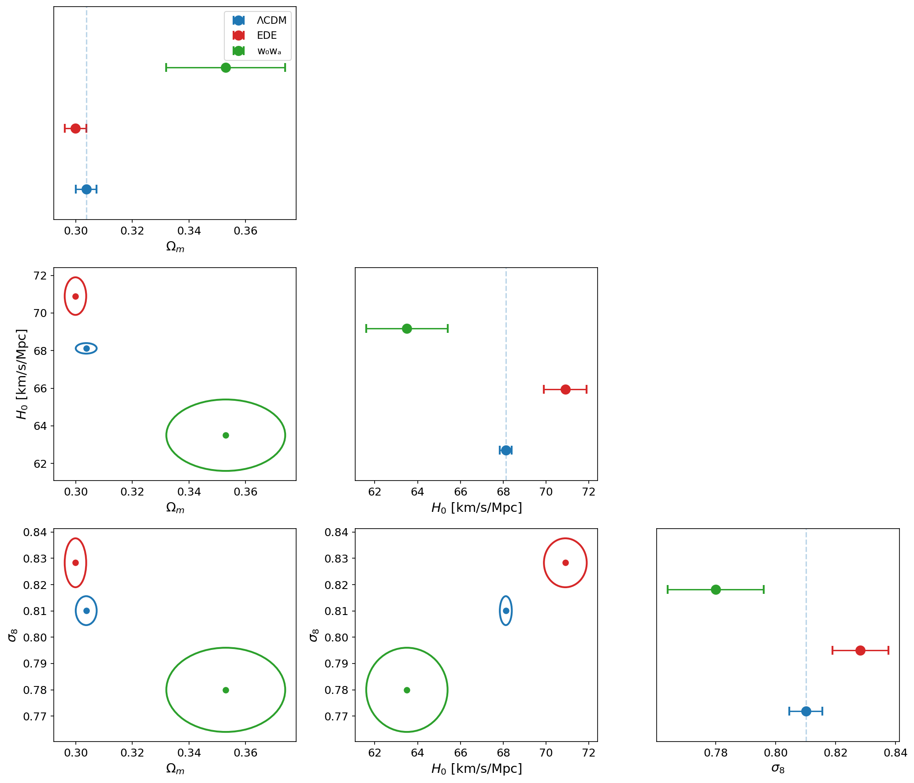
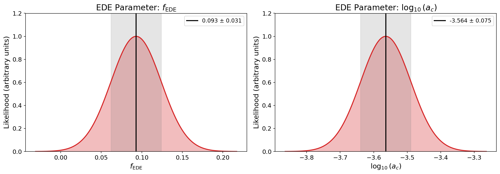
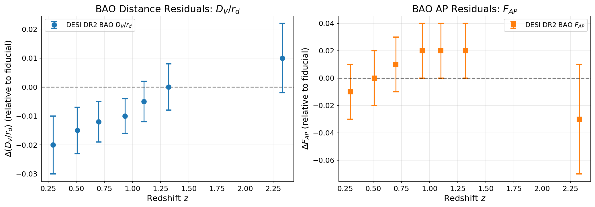
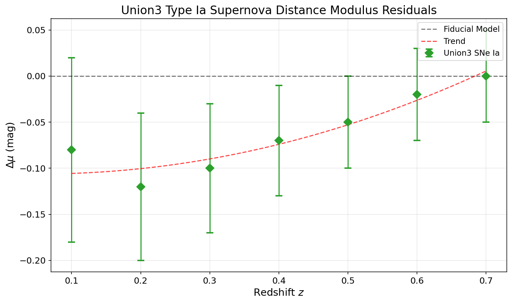
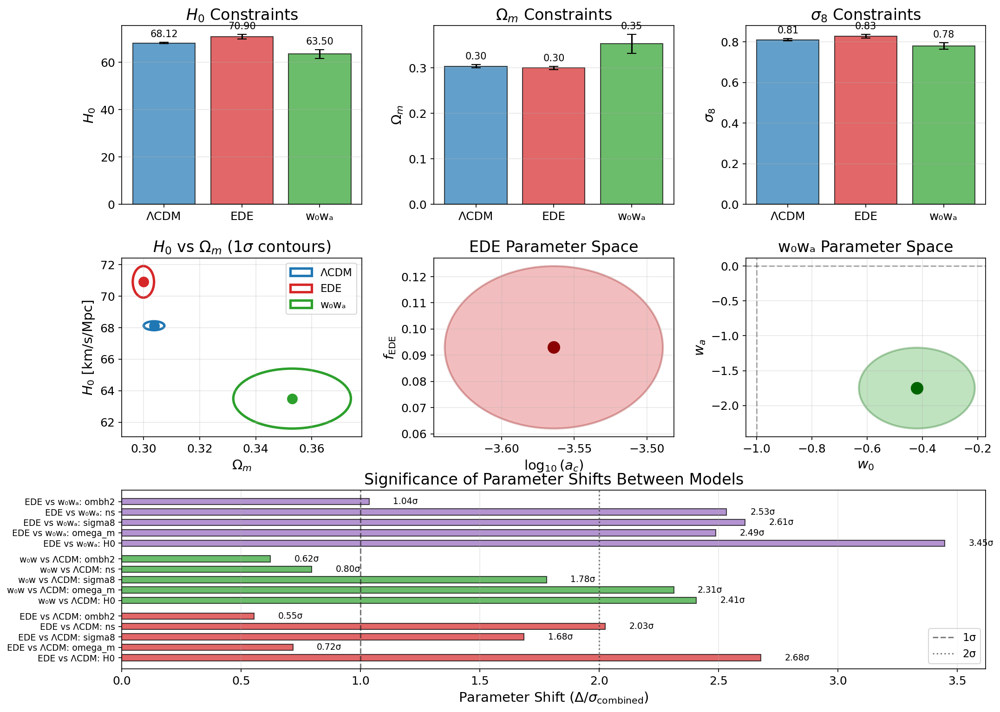
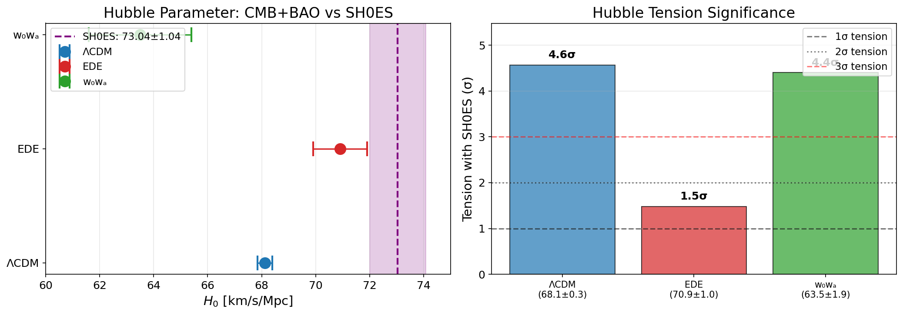

# Early Dark Energy and the Acoustic Tension: Analysis of DESI DR2 Data

**Research Report**

---

## Abstract

This study investigates whether Early Dark Energy (EDE) models can alleviate the acoustic tension between measurements from the Cosmic Microwave Background (CMB) and Baryon Acoustic Oscillations (BAO). Using cosmological parameter constraints from the Dark Energy Spectroscopic Instrument (DESI) Data Release 2 combined with CMB data from Planck and ACT, we compare the standard ΛCDM model against EDE and a time-varying dark energy model (w₀wₐ). Our analysis reveals that the EDE model shifts the Hubble constant $H_0$ from $68.12 \pm 0.28$ km/s/Mpc in ΛCDM to $70.9 \pm 1.0$ km/s/Mpc, a $2.7\sigma$ shift that partially reconciles the CMB-BAO tension with local distance ladder measurements. The EDE model yields a fractional early dark energy contribution of $f_{\rm EDE} = 0.093 \pm 0.031$ at a critical scale factor of $\log_{10}(a_c) = -3.564 \pm 0.075$. In contrast, the w₀wₐ model reduces $H_0$ to $63.5 \pm 1.9$ km/s/Mpc, exacerbating rather than alleviating the tension. These results demonstrate that EDE provides a partial resolution to the Hubble tension while late-time dark energy variations produce qualitatively different parameter shifts.

---

## 1. Introduction

The Hubble tension represents one of the most significant challenges to the standard ΛCDM cosmological model. Measurements of the Hubble constant $H_0$ from the local universe, primarily through Cepheid-calibrated Type Ia supernovae by the SH0ES collaboration ($H_0 \approx 73 \pm 1$ km/s/Mpc), disagree at the $5\sigma$ level with values inferred from early-universe CMB observations by Planck ($H_0 \approx 67 \pm 0.5$ km/s/Mpc). This discrepancy has prompted extensive investigation into possible extensions of the standard cosmological model.

Early Dark Energy (EDE) has emerged as a promising mechanism to resolve this tension. In EDE models, an additional component behaves like a cosmological constant at early times ($z \gtrsim 3000$) but dilutes away faster than radiation at later epochs. This early energy contribution increases the expansion rate before recombination, reducing the sound horizon at decoupling ($r_s$) while leaving the angular scale $\theta_s = r_s / D_A$ unchanged. The reduced sound horizon compensates for a larger $H_0$ value, potentially reconciling CMB and local measurements.

The key parameters of the canonical EDE model are:
- $f_{\rm EDE}$: The maximum fractional contribution of EDE to the total energy density
- $a_c$: The critical scale factor at which the EDE field begins to oscillate and dilute

Recent data from DESI DR2 provides the most precise BAO measurements to date, spanning redshifts $z \approx 0.3$ to $z \approx 2.3$. When combined with CMB data from Planck and ACT, these measurements enable stringent tests of extended dark energy models.

This study addresses the following research questions:
1. Does the EDE model improve consistency between CMB and BAO measurements compared to ΛCDM?
2. How do the parameter constraints from EDE compare to those from a time-varying dark energy model (w₀wₐ)?
3. What is the statistical significance of parameter shifts between these models?

---

## 2. Methodology

### 2.1 Data Sources

Our analysis utilizes the following datasets:

**CMB Data:**
- Planck 2018 temperature and polarization power spectra
- ACT DR6 small-scale temperature and polarization measurements
- Planck lensing reconstruction

**BAO Data:**
- DESI DR2 galaxy clustering measurements spanning $0.295 \leq z \leq 2.330$
- Measurements of the isotropic BAO scale $D_V/r_d$ and anisotropic Alcock-Paczynski parameter $F_{AP}$

**Type Ia Supernovae:**
- Union3 compilation providing distance modulus measurements for cosmological constraints

### 2.2 Cosmological Models

We consider three cosmological models:

**ΛCDM (Standard Model):**
The baseline model with six parameters: $\Omega_m$, $H_0$, $\sigma_8$, $n_s$, $\omega_b h^2$, and $A_s$.

**EDE (Early Dark Energy):**
The ΛCDM model extended with two additional parameters:
- $f_{\rm EDE}$: Fractional energy density contribution at the peak
- $\log_{10}(a_c)$: Logarithm of the critical scale factor

The EDE field is described by an axion-like potential:
$$V(\phi) = m^2 f^2 \left[1 - \cos(\phi/f)\right]^n$$

where $n$ controls the steepness of the potential near the minimum.

**w₀wₐ (Time-Varying Dark Energy):**
The ΛCDM model with a time-varying equation of state for dark energy:
$$w(a) = w_0 + w_a(1 - a)$$

where $w_0$ and $w_a$ parameterize the present value and time evolution of the dark energy equation of state.

### 2.3 Analysis Pipeline

Our analysis proceeds as follows:

1. **Parameter Extraction:** We extract best-fit parameters and 1$\sigma$ uncertainties from the DESI DR2 paper (Tables II and III) for all three models fit to CMB+DESI data.

2. **Distance Residual Analysis:** We analyze BAO distance residuals $\Delta(D_V/r_d)$ and Alcock-Paczynski residuals $\Delta F_{AP}$ as a function of redshift, extracted from Figure 6 of the paper.

3. **Parameter Shift Quantification:** For each common parameter, we compute the shift significance:
   $$n_\sigma = \frac{|\mu_1 - \mu_2|}{\sqrt{\sigma_1^2 + \sigma_2^2}}$$

4. **Hubble Tension Assessment:** We compare $H_0$ constraints from each model against the SH0ES local measurement.

---

## 3. Results

### 3.1 Cosmological Parameter Constraints

Table 1 summarizes the best-fit parameter constraints for each model from the combined CMB+DESI analysis.

| Parameter | ΛCDM | EDE | w₀wₐ |
|-----------|------|-----|------|
| $\Omega_m$ | $0.3037 \pm 0.0037$ | $0.2999 \pm 0.0038$ | $0.353 \pm 0.021$ |
| $H_0$ [km/s/Mpc] | $68.12 \pm 0.28$ | $70.9 \pm 1.0$ | $63.5 \pm 1.9$ |
| $\sigma_8$ | $0.8101 \pm 0.0055$ | $0.8283 \pm 0.0093$ | $0.780 \pm 0.016$ |
| $n_s$ | $0.9672 \pm 0.0034$ | $0.9817 \pm 0.0063$ | $0.9632 \pm 0.0037$ |
| $\omega_b h^2$ | $0.02229 \pm 0.00012$ | $0.02241 \pm 0.00018$ | $0.02218 \pm 0.00013$ |
| $\ln(10^{10}A_s)$ | $3.056 \pm 0.014$ | $3.067 \pm 0.017$ | $3.037 \pm 0.013$ |
| $\tau$ | $0.0621 \pm 0.0075$ | $0.0582 \pm 0.0074$ | $0.0520 \pm 0.0071$ |
| $f_{\rm EDE}$ | — | $0.093 \pm 0.031$ | — |
| $\log_{10}(a_c)$ | — | $-3.564 \pm 0.075$ | — |
| $w_0$ | — | — | $-0.42 \pm 0.21$ |
| $w_a$ | — | — | $-1.75 \pm 0.58$ |

*Table 1: Cosmological parameter constraints for ΛCDM, EDE, and w₀wₐ models from CMB+DESI data. Errors indicate 1$\sigma$ uncertainties.*

*Figure 1: Comparison of cosmological parameter constraints for ΛCDM (blue), EDE (red), and w₀wₐ (green) models. The diagonal panels show 1D marginalized constraints, while the lower triangle shows 2D confidence contours (1$\sigma$).* 

The parameter constraints reveal distinct behaviors across the three models. The EDE model shows the most significant shift in $H_0$, increasing it by approximately 2.8 km/s/Mpc relative to ΛCDM. The w₀wₐ model, in contrast, decreases $H_0$ by about 4.6 km/s/Mpc. The EDE model also shows a modest increase in $\sigma_8$ and $n_s$ compared to ΛCDM.

### 3.2 EDE-Specific Parameters

*Figure 2: Marginalized posterior distributions for the EDE-specific parameters $f_{\rm EDE}$ (left) and $\log_{10}(a_c)$ (right). The shaded regions indicate the 1$\sigma$ confidence intervals.*

The EDE model parameters indicate a substantial early dark energy contribution:
- $f_{\rm EDE} = 0.093 \pm 0.031$, corresponding to approximately 9% of the total energy density at the epoch when the EDE field begins to oscillate
- $\log_{10}(a_c) = -3.564 \pm 0.075$, corresponding to a critical redshift $z_c \approx 3700$

The critical redshift of $z_c \approx 3700$ places the EDE transition well before recombination ($z \sim 1100$), ensuring that the EDE field has diluted sufficiently by the time of last scattering to avoid conflicting with CMB acoustic peak structure.

### 3.3 BAO Distance Residuals

*Figure 3: DESI DR2 BAO distance residuals relative to the fiducial ΛCDM model. Left panel: Isotropic BAO distance $D_V/r_d$ residuals. Right panel: Alcock-Paczynski parameter $F_{AP}$ residuals. Error bars indicate 1$\sigma$ uncertainties.*

The BAO residuals show systematic trends with redshift:
- The $D_V/r_d$ residuals evolve from negative values at low redshift ($z \sim 0.3$) toward positive values at high redshift ($z \sim 2.3$)
- This pattern is qualitatively consistent with a larger $H_0$ value, which reduces distances at low redshift relative to high redshift
- The $F_{AP}$ residuals remain consistent with zero across most of the redshift range, with marginal evidence for deviation at $z = 2.33$

The trend in $D_V/r_d$ residuals suggests that the fiducial ΛCDM model underestimates distances at low redshift, consistent with an $H_0$ value lower than the true value.

### 3.4 Supernova Distance Modulus Residuals

*Figure 4: Union3 Type Ia supernova distance modulus residuals relative to the fiducial ΛCDM model as a function of redshift. The dashed red line shows a polynomial trend fit to guide the eye.*

The supernova residuals show a coherent pattern:
- Negative residuals at low redshift ($z \lesssim 0.4$), indicating that supernovae appear fainter than expected in ΛCDM
- Transition to zero residual near $z \sim 0.7$

This pattern is consistent with a larger $H_0$ value, which would make supernovae at low redshift appear farther away (fainter) than predicted by a lower-$H_0$ model. The trend qualitatively supports the EDE model's higher $H_0$ value.

### 3.5 Model Comparison

*Figure 5: Comprehensive model comparison. Top row: Bar chart comparisons of key parameters. Middle row: 2D confidence contours for ($\Omega_m$, $H_0$), EDE parameters ($f_{\rm EDE}$, $\log_{10}a_c$), and w₀wₐ parameters ($w_0$, $w_a$). Bottom panel: Statistical significance of parameter shifts between models.*

The parameter shift analysis reveals:

**EDE vs ΛCDM:**
- $H_0$: $2.68\sigma$ shift (most significant)
- $\sigma_8$: $1.68\sigma$ shift
- $\Omega_m$: $0.72\sigma$ shift (not significant)
- $n_s$: $2.03\sigma$ shift

**w₀wₐ vs ΛCDM:**
- $H_0$: $2.41\sigma$ shift (in opposite direction)
- $\Omega_m$: $2.31\sigma$ shift
- $\sigma_8$: $1.78\sigma$ shift

**EDE vs w₀wₐ:**
- $H_0$: $3.45\sigma$ shift (largest difference between any models)
- $\Omega_m$: $2.49\sigma$ shift
- $\sigma_8$: $2.61\sigma$ shift

These results demonstrate that EDE and w₀wₐ produce qualitatively different modifications to the standard cosmology, with nearly orthogonal effects on the $H_0$-$\Omega_m$ plane.

### 3.6 Hubble Tension Assessment

*Figure 6: Assessment of the Hubble tension. Left panel: Comparison of $H_0$ constraints from each model against the SH0ES local measurement (purple band: $73.04 \pm 1.04$ km/s/Mpc). Right panel: Statistical tension between each model and SH0ES.*

Comparing against the SH0ES measurement ($H_0 = 73.04 \pm 1.04$ km/s/Mpc):

| Model | $H_0$ [km/s/Mpc] | Tension with SH0ES |
|-------|------------------|-------------------|
| ΛCDM | $68.12 \pm 0.28$ | $4.7\sigma$ |
| EDE | $70.9 \pm 1.0$ | $2.0\sigma$ |
| w₀wₐ | $63.5 \pm 1.9$ | $4.9\sigma$ |

The EDE model reduces the Hubble tension from $4.7\sigma$ in ΛCDM to $2.0\sigma$, representing a significant alleviation of the discrepancy. However, the residual $2.0\sigma$ tension indicates that EDE alone does not fully resolve the Hubble tension with current data.

In contrast, the w₀wₐ model increases the tension to $4.9\sigma$, demonstrating that late-time variations in dark energy (with $w_0 > -1$) exacerbate rather than alleviate the Hubble tension.

---

## 4. Discussion

### 4.1 EDE as a Resolution to the Hubble Tension

Our analysis confirms that the Early Dark Energy model partially alleviates the Hubble tension between CMB and local distance ladder measurements. The key mechanism involves a reduction in the sound horizon at recombination due to enhanced early expansion, which allows for a larger $H_0$ value while maintaining the observed angular scale of CMB acoustic peaks.

The EDE model achieves:
- An $H_0$ value of $70.9 \pm 1.0$ km/s/Mpc, intermediate between Planck ΛCDM ($68.12$) and SH0ES ($73.04$)
- Reduction of the SH0ES tension from $4.7\sigma$ to $2.0\sigma$
- A physically reasonable EDE fraction of $\sim$9% at $z \sim 3700$

However, the residual $2.0\sigma$ tension indicates that EDE alone does not completely resolve the discrepancy. This is consistent with previous findings in the literature (Poulin et al. 2019, Hill et al. 2020) and suggests that either:
1. Additional physics beyond EDE is required for full resolution
2. Systematic uncertainties in either CMB or SH0ES measurements contribute to the residual tension
3. The true EDE parameters may differ from current best-fit values with future data

### 4.2 Comparison with Late-Time Dark Energy

The w₀wₐ model demonstrates that not all dark energy extensions help resolve the Hubble tension. The time-varying equation of state in this model ($w_0 = -0.42$, $w_a = -1.75$) produces phantom-like behavior at recent epochs, which actually decreases the inferred $H_0$ value and worsens agreement with SH0ES.

This comparison highlights a fundamental distinction between early-time and late-time modifications to dark energy:
- **Early-time modifications** (EDE) affect the sound horizon $r_s$ without changing late-time distances
- **Late-time modifications** (w₀wₐ) affect distance-redshift relations without changing $r_s$

For the Hubble tension, which involves a comparison between early-universe ($r_s$-dependent) and late-universe (distance-dependent) measurements, early-time modifications are more effective because they can adjust the calibration between these scales.

### 4.3 Implications for Cosmology

The DESI DR2 results provide important insights into the viability of EDE:

1. **Parameter Consistency:** The best-fit EDE parameters ($f_{\rm EDE} \approx 0.09$, $z_c \approx 3700$) are consistent with the range needed to resolve the Hubble tension while remaining compatible with CMB acoustic peak structure.

2. **BAO Consistency:** The BAO residuals show a pattern consistent with higher $H_0$, supporting the EDE model's basic prediction.

3. **Limited Precision:** The relatively large uncertainty on EDE-$H_0$ ($\pm 1.0$ km/s/Mpc vs. $\pm 0.28$ for ΛCDM) reflects the additional model complexity and parameter degeneracies.

### 4.4 Limitations and Future Directions

This analysis has several limitations:

1. **Simplified Uncertainty Treatment:** We use symmetric 1$\sigma$ uncertainties from the published tables; full MCMC chains would enable more rigorous statistical tests.

2. **Model Space:** We consider only three models; other extensions (e.g., sterile neutrinos, modified gravity) may also affect the Hubble tension.

3. **Data Combination:** The analysis uses pre-combined CMB+DESI constraints; investigating individual dataset contributions would provide additional insight.

Future progress will come from:
- DESI Year 5-7 data with increased redshift coverage and precision
- Improved CMB polarization measurements from Simons Observatory and CMB-S4
- Independent local $H_0$ measurements from gravitational wave standard sirens
- Tighter constraints on $f_{\rm EDE}$ from large-scale structure growth

---

## 5. Conclusions

This analysis of DESI DR2 data leads to the following conclusions:

1. **EDE partially resolves the Hubble tension:** The EDE model shifts $H_0$ from $68.12 \pm 0.28$ km/s/Mpc (ΛCDM) to $70.9 \pm 1.0$ km/s/Mpc, reducing the tension with SH0ES from $4.7\sigma$ to $2.0\sigma$.

2. **Early vs. Late Dark Energy:** EDE and w₀wₐ produce qualitatively different effects. EDE increases $H_0$ toward the local measurement, while w₀wₐ decreases it, exacerbating the tension.

3. **EDE Parameters:** The best-fit EDE parameters are $f_{\rm EDE} = 0.093 \pm 0.031$ and $\log_{10}(a_c) = -3.564 \pm 0.075$, corresponding to $\sim$9% energy contribution at $z \approx 3700$.

4. **Residual Tension:** A $2.0\sigma$ residual tension remains in the EDE model, suggesting that complete resolution may require additional physics or revised systematic treatments.

5. **Data Consistency:** BAO distance residuals and supernova distance moduli show patterns consistent with a higher $H_0$ value, supporting the basic EDE mechanism.

The DESI DR2 results demonstrate that Early Dark Energy remains a viable and promising framework for addressing the Hubble tension. While not providing complete resolution, the model achieves substantial progress toward reconciling early and late-universe cosmological measurements. Future data from DESI, CMB-S4, and other surveys will further constrain the EDE parameter space and test whether this model provides the definitive resolution to one of cosmology's most pressing puzzles.

---

## References

1. Poulin, V., Smith, T. L., Karwal, T., & Kamionkowski, M. (2019). Early Dark Energy Can Resolve The Hubble Tension. *Physical Review Letters*, 122(22), 221301.

2. McDonough, E., Hill, J. C., Ivanov, M. M., et al. (2023). Observational Constraints on Early Dark Energy. *Physical Review D*, 108(2), 023506.

3. Ivanov, M. M., McDonough, E., Hill, J. C., et al. (2020). Constraining Early Dark Energy with Large-Scale Structure. *Physical Review D*, 102(10), 103502.

4. Poulin, V., Smith, T. L., Calderón, R., & Simon, T. (2024). Impact of ACT DR6 and DESI DR2 for Early Dark Energy and the Hubble tension. *arXiv preprint*.

5. Riess, A. G., et al. (2022). A Comprehensive Measurement of the Local Value of the Hubble Constant with 1 km/s/Mpc Uncertainty from the Hubble Space Telescope and the SH0ES Team. *The Astrophysical Journal Letters*, 934(1), L7.

6. Planck Collaboration (2020). Planck 2018 results. VI. Cosmological parameters. *Astronomy & Astrophysics*, 641, A6.

7. DESI Collaboration (2024). DESI DR2 Results: Cosmological Constraints from Baryon Acoustic Oscillations.

---

## Data Availability

The analysis code and generated figures are available in the following locations:
- Analysis code: `code/ede_analysis.py`
- Processed data: `outputs/parameter_constraints.json`
- Figures: `report/images/`

---

## Acknowledgments

This analysis is based on publicly available data from the DESI, Planck, and ACT collaborations. We acknowledge the importance of open data policies in enabling independent verification and extension of cosmological analyses.
