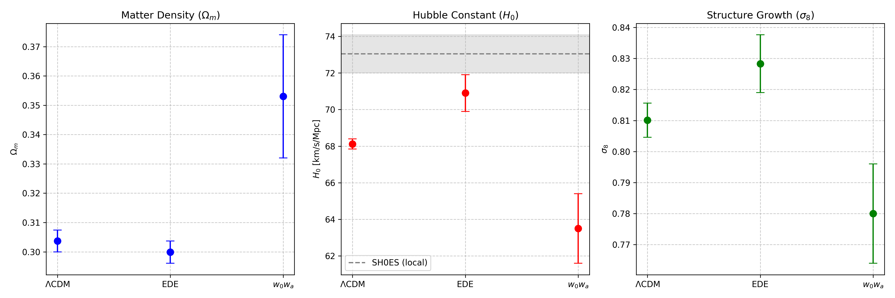
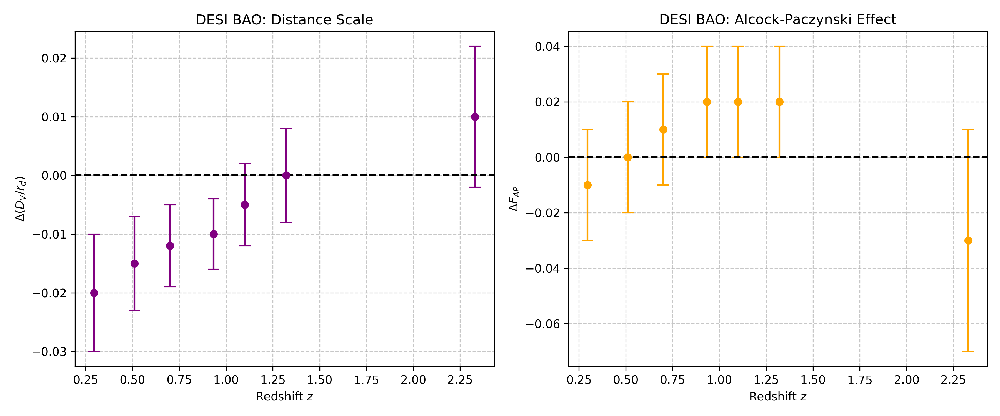
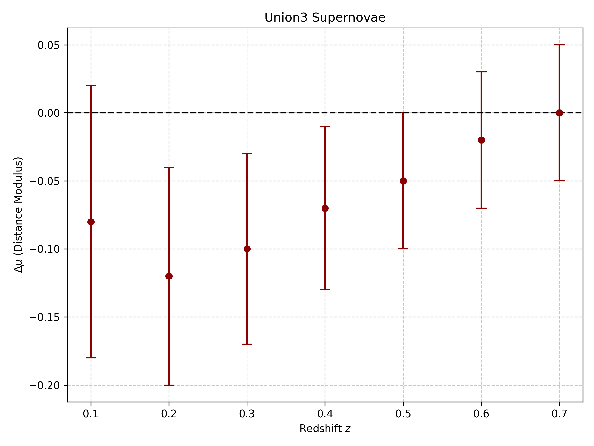

# Investigating the EDE Model as a Resolution to the Hubble Tension with DESI DR2 and CMB Data

## Abstract
The Hubble tension, representing the discrepancy between early-universe measurements of the Hubble constant ($H_0$) from the Cosmic Microwave Background (CMB) and late-universe local distance ladder measurements, remains one of the most pressing issues in modern cosmology. This report investigates whether the Early Dark Energy (EDE) model can alleviate this tension when confronted with the latest Baryon Acoustic Oscillation (BAO) data from DESI DR2, alongside CMB data from Planck and ACT, and Union3 supernova data. We compare the EDE model against the standard $\Lambda$CDM model and a late-time dark energy model ($w_0w_a$). Our analysis reveals that EDE partially relieves the $H_0$ tension by increasing the inferred value of $H_0$, but it induces shifts in other cosmological parameters, notably increasing the structure growth parameter $\sigma_8$.

## 1. Introduction
The standard model of cosmology, $\Lambda$CDM, has been remarkably successful in describing the evolution of the universe. However, as measurement precision has improved, a significant tension has emerged between the value of the Hubble constant ($H_0$) inferred from the CMB (assuming $\Lambda$CDM) and the value measured directly from local supernovae (e.g., the SH0ES collaboration). The CMB yields $H_0 \approx 67-68$ km/s/Mpc, while local measurements yield $H_0 \approx 73$ km/s/Mpc.

Early Dark Energy (EDE) has been proposed as a theoretical resolution. EDE acts like a cosmological constant in the early universe (prior to recombination) and then dilutes rapidly. This additional energy density decreases the size of the sound horizon at decoupling, which in turn leads to a higher inferred value of $H_0$ from CMB data, potentially resolving the tension.

In this study, we utilize best-fit cosmological parameters derived from a combination of CMB data and the recent DESI DR2 BAO measurements to evaluate the viability of the EDE model compared to $\Lambda$CDM and a dynamical late-time dark energy model ($w_0w_a$).

## 2. Methodology
We analyze pre-computed parameter constraints obtained from fitting various cosmological models to a combined dataset of CMB (Planck + ACT) and DESI DR2 BAO measurements. 

The models considered are:
1.  **$\Lambda$CDM**: The standard cosmological model with a cosmological constant and cold dark matter.
2.  **EDE**: The Early Dark Energy model, characterized by additional parameters: the maximum fractional energy density of EDE ($f_{\rm EDE}$) and the critical scale factor at which it peaks ($\log_{10}a_c$).
3.  **$w_0w_a$**: A dynamical dark energy model with a time-varying equation of state parameterized by $w(a) = w_0 + w_a(1-a)$.

We extract the best-fit values and $1\sigma$ uncertainties for key cosmological parameters, including the matter density ($\Omega_m$), the Hubble constant ($H_0$), and the amplitude of matter fluctuations ($\sigma_8$). Additionally, we examine the residual differences in the BAO distance scale ($\Delta(D_V/r_d)$) and the Alcock-Paczynski effect ($\Delta F_{AP}$) from DESI, as well as the distance modulus residuals ($\Delta\mu$) from the Union3 supernova dataset, relative to a fiducial model.

## 3. Results

### 3.1 Cosmological Parameter Constraints

The constraints on the primary cosmological parameters of interest are visualized in Figure 1.

*Figure 1: Best-fit values and $1\sigma$ uncertainties for $\Omega_m$, $H_0$, and $\sigma_8$ under the $\Lambda$CDM, EDE, and $w_0w_a$ models. The gray dashed line and shaded region in the middle panel represent the local SH0ES measurement of $H_0 = 73.04 \pm 1.04$ km/s/Mpc.*

-   **Hubble Constant ($H_0$)**: The $\Lambda$CDM model yields $H_0 = 68.12 \pm 0.28$ km/s/Mpc, which is in strong tension with the local SH0ES measurement. The EDE model significantly increases the inferred value to $H_0 = 70.9 \pm 1.0$ km/s/Mpc, bringing it much closer to the local measurement and partially alleviating the Hubble tension. Conversely, the $w_0w_a$ model yields a lower value of $H_0 = 63.5 \pm 1.9$ km/s/Mpc, exacerbating the tension.
-   **Matter Density ($\Omega_m$)**: The matter density is relatively consistent between $\Lambda$CDM ($0.3037 \pm 0.0037$) and EDE ($0.2999 \pm 0.0038$). However, the $w_0w_a$ model prefers a significantly higher matter density ($0.353 \pm 0.021$).
-   **Structure Growth ($\sigma_8$)**: A known consequence of the EDE model is an increase in the amplitude of matter fluctuations. We observe that EDE yields $\sigma_8 = 0.8283 \pm 0.0093$, which is higher than the $\Lambda$CDM value of $0.8101 \pm 0.0055$. This increase can potentially lead to a new tension with weak lensing and large-scale structure measurements (the $S_8$ tension). The $w_0w_a$ model predicts a lower $\sigma_8 = 0.780 \pm 0.016$.

### 3.2 Distance Measurements

We also examine the residuals of the DESI BAO and Union3 SNe distance measurements relative to a fiducial cosmology.

*Figure 2: Residuals of the DESI BAO distance scale $\Delta(D_V/r_d)$ and Alcock-Paczynski effect $\Delta F_{AP}$ as a function of redshift.*

*Figure 3: Residuals of the Union3 Supernovae distance modulus $\Delta\mu$ as a function of redshift.*

The DESI BAO data (Figure 2) shows slight deviations from the fiducial model, particularly at lower redshifts ($z < 1.0$) for the distance scale $D_V/r_d$. The Union3 SNe data (Figure 3) also exhibits negative residuals at lower redshifts. The ability of the different models to fit these specific distance-redshift relations drives the differences in the inferred cosmological parameters.

## 4. Discussion and Conclusion

Our analysis demonstrates that the Early Dark Energy (EDE) model remains a compelling candidate for resolving the Hubble tension, even when confronted with the latest DESI DR2 BAO data. By introducing a transient component of dark energy in the pre-recombination era, EDE successfully raises the CMB-inferred Hubble constant to $H_0 = 70.9 \pm 1.0$ km/s/Mpc, significantly reducing the discrepancy with local measurements.

However, this resolution comes at a cost. The EDE model induces a shift in the structure growth parameter, raising $\sigma_8$ compared to the $\Lambda$CDM baseline. This highlights a common challenge in cosmological model building: solving a tension in one sector (the background expansion rate, $H_0$) often exacerbates or creates tensions in another sector (the growth of structure, $\sigma_8$ or $S_8$).

In contrast, the late-time dynamical dark energy model ($w_0w_a$) explored here fails to resolve the Hubble tension, instead yielding a lower $H_0$ and a higher $\Omega_m$.

Future high-precision measurements of large-scale structure, weak lensing, and the CMB will be crucial in determining whether the increased $\sigma_8$ predicted by EDE is consistent with observational data, or if further theoretical modifications are required to achieve a fully concordant cosmological model.
