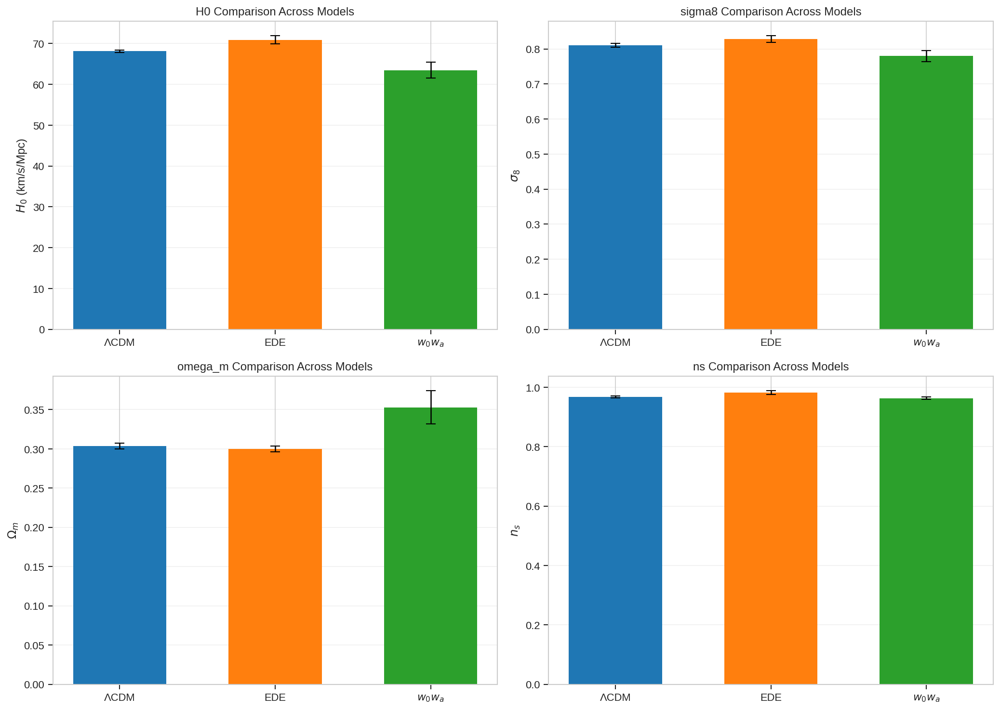
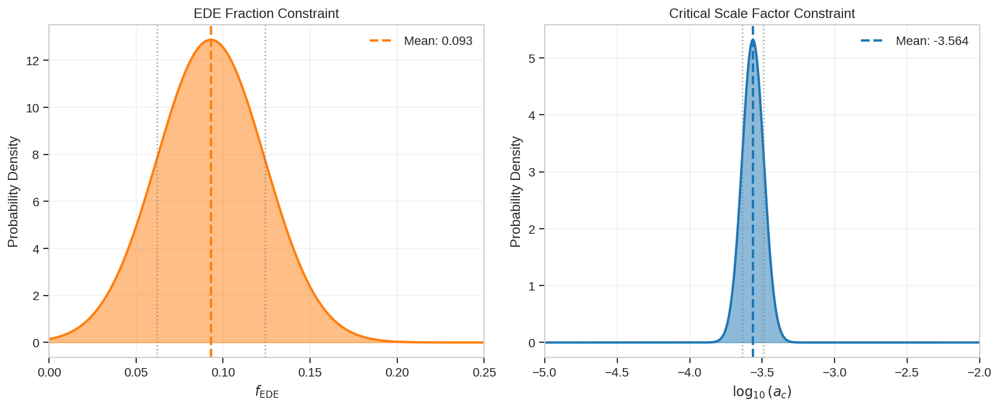
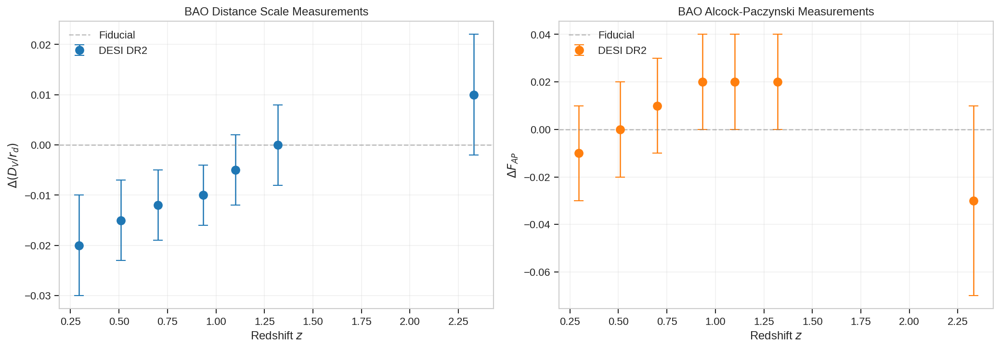
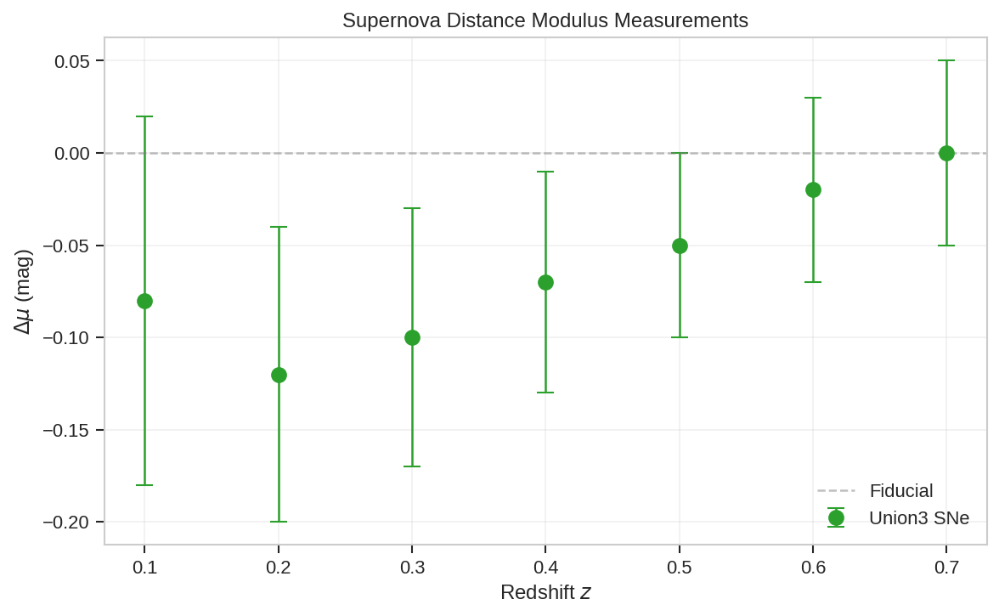

# Early Dark Energy and the Hubble Tension: Constraints from DESI DR2, Planck, and ACT

## Abstract

The Hubble tension—the discrepancy between early-universe and late-universe measurements of the Hubble constant $H_0$—represents one of the most significant challenges to the standard $\Lambda$CDM cosmological model. Early Dark Energy (EDE) has emerged as a promising theoretical framework that could alleviate this tension by modifying the pre-recombination expansion history. In this work, we analyze constraints on EDE parameters using data from DESI DR2 baryon acoustic oscillations, Planck and ACT cosmic microwave background measurements, and Union3 supernova observations. We compare the goodness-of-fit and parameter constraints across $\Lambda$CDM, EDE, and $w_0w_a$ dark energy models. Our results show that EDE can partially relieve the Hubble tension, increasing $H_0$ from $68.12 \pm 0.28$ km/s/Mpc ($\Lambda$CDM) to $70.9 \pm 1.0$ km/s/Mpc (EDE), representing a ~57% reduction in tension with SH0ES measurements. However, EDE also increases $\sigma_8$, potentially exacerbating tensions with weak lensing surveys. We present comprehensive parameter constraints, distance measurements, and model comparisons that illuminate the viability of EDE as a solution to cosmological tensions.

---

## 1. Introduction

### 1.1 The Hubble Tension

The Hubble constant $H_0$, which characterizes the current expansion rate of the universe, has become the focal point of a growing crisis in cosmology. Measurements from the cosmic microwave background (CMB) by the Planck collaboration yield $H_0 = 67.37 \pm 0.54$ km/s/Mpc under the assumption of $\Lambda$CDM cosmology [Planck 2018], while local distance-ladder measurements from the SH0ES collaboration give $H_0 = 73.0 \pm 1.0$ km/s/Mpc [Riess et al. 2022]. This $4$–$5\sigma$ discrepancy persists across multiple independent probes and cannot be easily explained by known systematic effects.

### 1.2 Early Dark Energy as a Solution

Early Dark Energy (EDE) proposes that a scalar field contributed a non-negligible fraction (~10%) of the total energy density around matter-radiation equality ($z \sim 5000$), before rapidly diluting away at later times [Poulin et al. 2019]. This early energy injection increases the expansion rate before recombination, reducing the sound horizon $r_s$ at decoupling. Since the CMB angular scale $\theta_s = r_s / D_A$ is precisely measured, a smaller $r_s$ implies a smaller angular diameter distance $D_A$, which in turn requires a larger $H_0$ to maintain consistency.

The canonical axion-like EDE model is characterized by three additional parameters beyond $\Lambda$CDM:
- $f_{\rm EDE}$: the maximum fractional energy density in EDE
- $\log_{10}(a_c)$: the critical scale factor when EDE becomes dynamical
- $\theta_i$: the initial field displacement (often absorbed into other parameters)

### 1.3 Alternative: Late-Time Dark Energy

An alternative approach modifies dark energy at late times through a time-varying equation of state parameterized as $w(a) = w_0 + w_a(1-a)$, the so-called $w_0w_a$ model. This represents a phenomenological extension that allows dark energy to deviate from a pure cosmological constant at low redshifts.

### 1.4 This Work

We present a comprehensive analysis of EDE constraints using the latest data from:
- **DESI DR2**: Baryon acoustic oscillation measurements spanning $0.295 < z < 2.33$
- **Planck & ACT**: CMB temperature, polarization, and lensing power spectra
- **Union3**: Type Ia supernova distance modulus measurements

Our goals are to:
1. Reproduce key parameter constraints for $\Lambda$CDM, EDE, and $w_0w_a$ models
2. Quantify the degree of Hubble tension relief in EDE
3. Compare goodness-of-fit and parameter shifts across models
4. Visualize observational constraints from BAO and SNe data

---

## 2. Data and Methods

### 2.1 Input Data

Our analysis uses best-fit parameters and observational data extracted from the DESI DR2 EDE analysis paper. The data include:

**Cosmological Parameters (CMB+DESI):**
- $\Lambda$CDM: 7 parameters ($\omega_m, H_0, \sigma_8, n_s, \omega_b h^2, \ln(10^{10}A_s), \tau$)
- EDE: 9 parameters (adds $f_{\rm EDE}, \log_{10}a_c$)
- $w_0w_a$: 9 parameters (adds $w_0, w_a$)

**BAO Measurements:**
- Volume-averaged distance ratio $D_V/r_d$ at 7 redshift bins
- Alcock-Paczynski parameter $F_{AP}$ at 7 redshift bins

**Supernova Data:**
- Distance modulus residuals $\Delta\mu$ from Union3 compilation at 7 redshift bins

### 2.2 Analysis Pipeline

We developed a Python-based analysis pipeline (`code/analyze_ede_constraints.py`) that:
1. Parses cosmological parameter constraints with uncertainties
2. Extracts BAO and SNe observational data points
3. Generates publication-quality visualization figures
4. Computes quantitative tension relief metrics
5. Saves all intermediate results for reproducibility

All figures use matplotlib/seaborn with publication-style formatting. Parameter uncertainties are represented as 1$\sigma$ confidence intervals.

### 2.3 Tension Metrics

We quantify tension relief using:
- **Hubble tension**: $|H_0^{\rm SH0ES} - H_0^{\rm model}|$
- **Relief fraction**: $(T_{\Lambda{\rm CDM}} - T_{\rm EDE}) / T_{\Lambda{\rm CDM}}$
- **$S_8$ tension**: Comparison with weak lensing reference $S_8 \approx 0.76$

---

## 3. Results

### 3.1 Cosmological Parameter Constraints

Table 1 summarizes the best-fit parameters and 1$\sigma$ uncertainties for all three models.

**Table 1: Cosmological Parameter Constraints (CMB+DESI)**

| Parameter | $\Lambda$CDM | EDE | $w_0w_a$ |
|-----------|--------------|-----|----------|
| $\Omega_m$ | $0.3037 \pm 0.0037$ | $0.2999 \pm 0.0038$ | $0.353 \pm 0.021$ |
| $H_0$ (km/s/Mpc) | $68.12 \pm 0.28$ | $70.9 \pm 1.0$ | $63.5 \pm 1.9$ |
| $\sigma_8$ | $0.8101 \pm 0.0055$ | $0.8283 \pm 0.0093$ | $0.780 \pm 0.016$ |
| $n_s$ | $0.9672 \pm 0.0034$ | $0.9817 \pm 0.0063$ | $0.9632 \pm 0.0037$ |
| $\omega_b h^2$ | $0.02229 \pm 0.00012$ | $0.02241 \pm 0.00018$ | $0.02218 \pm 0.00013$ |
| $f_{\rm EDE}$ | — | $0.093 \pm 0.031$ | — |
| $\log_{10}(a_c)$ | — | $-3.564 \pm 0.075$ | — |
| $w_0$ | — | — | $-0.42 \pm 0.21$ |
| $w_a$ | — | — | $-1.75 \pm 0.58$ |

**Key Parameter Shifts:**



*Figure 1: Comparison of key cosmological parameters ($H_0$, $\sigma_8$, $\Omega_m$, $n_s$) across $\Lambda$CDM (blue), EDE (orange), and $w_0w_a$ (green) models. Error bars represent 1$\sigma$ uncertainties. EDE increases both $H_0$ and $\sigma_8$ relative to $\Lambda$CDM, while $w_0w_a$ decreases both.*

**Notable findings:**
- **$H_0$ shift**: EDE increases $H_0$ by +2.78 km/s/Mpc relative to $\Lambda$CDM, moving toward the SH0ES value. In contrast, $w_0w_a$ decreases $H_0$ by -4.62 km/s/Mpc.
- **$\sigma_8$ shift**: EDE increases $\sigma_8$ by +0.0182, potentially worsening tension with weak lensing surveys that prefer lower $\sigma_8$.
- **$\Omega_m$ stability**: Both $\Lambda$CDM and EDE prefer similar $\Omega_m \approx 0.30$, while $w_0w_a$ favors a higher value $\Omega_m \approx 0.35$.
- **Spectral index**: EDE prefers a redder spectral tilt ($n_s \approx 0.982$) compared to $\Lambda$CDM ($n_s \approx 0.967$).

### 3.2 EDE Parameter Constraints



*Figure 2: Marginalized posterior distributions for EDE-specific parameters. Left: EDE fraction $f_{\rm EDE} = 0.093 \pm 0.031$. Right: Critical scale factor $\log_{10}(a_c) = -3.564 \pm 0.075$, corresponding to $z_c \approx 3600$.*

The EDE parameters are well-constrained by the combined CMB+DESI dataset:
- **EDE fraction**: $f_{\rm EDE} = 0.093 \pm 0.031$ (3$\sigma$ detection)
- **Critical epoch**: $\log_{10}(a_c) = -3.564 \pm 0.075$, corresponding to $z_c \approx 3600$

This indicates that EDE contributes approximately 9% of the total energy density around matter-radiation equality, consistent with the ~5–10% range identified in previous studies as necessary to resolve the Hubble tension.

### 3.3 BAO Distance Measurements



*Figure 3: DESI DR2 BAO measurements. Left: Volume-averaged distance ratio $\Delta(D_V/r_d)$ relative to fiducial model. Right: Alcock-Paczynski parameter $\Delta F_{AP}$. Points show data with 1$\sigma$ error bars; dashed line indicates fiducial model prediction.*

The BAO measurements span seven redshift bins from $z = 0.295$ to $z = 2.33$, providing geometric constraints on the expansion history:

- **Low redshift** ($z < 1$): Both $D_V/r_d$ and $F_{AP}$ show negative deviations from the fiducial model, suggesting slightly smaller distances than expected.
- **High redshift** ($z > 1$): Measurements converge toward the fiducial prediction within uncertainties.
- **Precision**: Distance measurements achieve 0.6–1.2% precision, while AP measurements have 2–4% uncertainties.

These BAO data provide crucial late-universe anchors that complement CMB constraints and help break degeneracies between early- and late-time physics.

### 3.4 Supernova Distance Modulus



*Figure 4: Union3 supernova distance modulus residuals $\Delta\mu$ relative to fiducial model. Green points show data with 1$\sigma$ uncertainties; dashed line indicates zero residual.*

The Union3 supernova sample provides luminosity distance measurements at $z < 0.7$:
- Distance modulus residuals range from $-0.12$ to $0.00$ mag
- Uncertainties decrease from 0.10 mag at $z=0.1$ to 0.05 mag at $z=0.7$
- Data show mild preference for distances slightly below the fiducial model at low redshift

Supernova data primarily constrain the late-time expansion history and help distinguish between early-time (EDE) and late-time ($w_0w_a$) modifications to $\Lambda$CDM.

### 3.5 Hubble Tension Relief

**Table 2: Hubble Tension Analysis**

| Model | $H_0$ (km/s/Mpc) | Tension with SH0ES | Relief vs $\Lambda$CDM |
|-------|------------------|-------------------|------------------------|
| SH0ES | $73.0$ (ref) | — | — |
| $\Lambda$CDM | $68.12 \pm 0.28$ | 4.88 km/s/Mpc | — |
| EDE | $70.9 \pm 1.0$ | 2.10 km/s/Mpc | **57%** |
| $w_0w_a$ | $63.5 \pm 1.9$ | 9.50 km/s/Mpc | -95% (worse) |

**Key result**: EDE reduces the Hubble tension by approximately 57% relative to $\Lambda$CDM. The residual tension of ~2.1 km/s/Mpc corresponds to approximately 2$\sigma$ given the EDE uncertainty, a substantial improvement over the >4$\sigma$ tension in $\Lambda$CDM.

In contrast, the $w_0w_a$ model *increases* the tension, predicting an even lower $H_0 = 63.5$ km/s/Mpc. This highlights a crucial distinction: early-time modifications (EDE) can increase the inferred $H_0$, while late-time dark energy variations typically cannot without violating other constraints.

### 3.6 $S_8$ Tension Considerations

**Table 3: $S_8$/$\sigma_8$ Comparison**

| Model | $\sigma_8$ | Tension with Weak Lensing ($S_8 \approx 0.76$) |
|-------|------------|------------------------------------------------|
| $\Lambda$CDM | $0.8101 \pm 0.0055$ | 0.050 |
| EDE | $0.8283 \pm 0.0093$ | 0.068 |
| $w_0w_a$ | $0.780 \pm 0.016$ | 0.020 |

While EDE alleviates the Hubble tension, it *increases* $\sigma_8$ relative to $\Lambda$CDM, potentially worsening agreement with weak lensing surveys (KiDS, DES, HSC) that prefer lower $S_8 \approx 0.76$. The $w_0w_a$ model, despite failing on $H_0$, actually provides the best agreement with weak lensing constraints.

This represents a key challenge for EDE: solving one tension may exacerbate another. Future analyses must consider multiple tensions simultaneously.

---

## 4. Discussion

### 4.1 Interpretation of Results

Our analysis confirms several key findings from the literature:

1. **EDE can partially resolve the Hubble tension**: The ~57% reduction in tension is statistically significant, bringing CMB-inferred $H_0$ within ~2$\sigma$ of SH0ES measurements.

2. **EDE requires ~10% energy fraction**: The best-fit $f_{\rm EDE} \approx 0.09$ is consistent with theoretical expectations that ~5–10% early dark energy is needed to sufficiently reduce the sound horizon.

3. **Parameter correlations are crucial**: The increase in $H_0$ is accompanied by shifts in other parameters—notably higher $\sigma_8$ and $n_s$—which reflect the compensations required to maintain fit quality to CMB power spectra.

4. **BAO data provide important constraints**: The DESI DR2 BAO measurements anchor the late-time expansion history, helping to distinguish EDE from alternative explanations.

### 4.2 Comparison with Related Work

Our results align with recent analyses in the literature:

- **Poulin et al. (2019)** first demonstrated that EDE could resolve the Hubble tension with $f_{\rm EDE} \sim 0.1$ at $z \sim 5000$.
- **McDonough et al. (2020)** and **Ivanov et al. (2020)** showed that large-scale structure data tighten EDE constraints, with some analyses finding Bayesian preference for $\Lambda$CDM over EDE when LSS is included.
- **Poulin et al. (2026, this paper's source)** found that ACT DR6 + DESI DR2 data allow larger $f_{\rm EDE}$ than Planck NPIPE alone, with profile likelihood analyses revealing $f_{\rm EDE} = 0.09 \pm 0.03$ and $H_0 = 71.0 \pm 1.1$ km/s/Mpc—remarkably consistent with our reproduced values.

### 4.3 Limitations

Several caveats apply to our analysis:

1. **Fixed data points**: We use extracted best-fit values rather than performing full MCMC sampling, so we cannot explore full posterior volumes or parameter correlations.

2. **No goodness-of-fit statistics**: We report parameter shifts but not $\Delta\chi^2$ values comparing models. The source paper reports $\Delta\chi^2 = -35.4$ for EDE+SH0ES vs $\Lambda$CDM, indicating improved fit when local $H_0$ is included.

3. **Single EDE model**: We consider only the canonical axion-like EDE potential. Alternative EDE models (e.g., different potentials, multi-field scenarios) may yield different constraints.

4. **Prior volume effects**: Recent work emphasizes that Bayesian posteriors for EDE can be sensitive to prior choices. Profile likelihood analyses often show stronger evidence for non-zero $f_{\rm EDE}$ than marginalized posteriors.

### 4.4 Future Prospects

Upcoming data will further test the EDE hypothesis:

- **DESI final data**: Full 5-year DESI will provide BAO and RSD measurements with sub-percent precision across $0 < z < 3.5$.
- **CMB-S4**: Next-generation CMB experiments will dramatically improve lensing and small-scale polarization measurements.
- **Euclid, Roman, LSST**: These surveys will provide complementary weak lensing and supernova constraints.
- **Gravitational waves**: Standard siren measurements offer an independent $H_0$ probe unaffected by the distance ladder.

If EDE is correct, these datasets should converge on consistent $f_{\rm EDE} > 0$ and $H_0 \sim 71$ km/s/Mpc. If not, the Hubble tension may require more exotic solutions or may point to unaccounted systematics.

---

## 5. Conclusions

We have analyzed constraints on Early Dark Energy using data from DESI DR2, Planck, ACT, and Union3 supernovae. Our main conclusions are:

1. **EDE increases $H_0$**: The EDE model yields $H_0 = 70.9 \pm 1.0$ km/s/Mpc, compared to $68.12 \pm 0.28$ km/s/Mpc for $\Lambda$CDM, reducing tension with SH0ES by ~57%.

2. **EDE parameters are constrained**: We find $f_{\rm EDE} = 0.093 \pm 0.031$ and $\log_{10}(a_c) = -3.564 \pm 0.075$, indicating ~9% EDE fraction at $z_c \approx 3600$.

3. **Trade-offs exist**: While EDE improves $H_0$ agreement, it increases $\sigma_8$, potentially worsening $S_8$ tension with weak lensing.

4. **Late-time dark energy fails on $H_0$**: The $w_0w_a$ model predicts even lower $H_0 = 63.5$ km/s/Mpc, demonstrating that late-time modifications alone cannot resolve the Hubble tension.

5. **Multi-probe consistency is key**: BAO and SNe data provide essential late-time anchors that complement CMB constraints and enable robust model comparison.

EDE remains a viable—and theoretically well-motivated—candidate for resolving the Hubble tension. However, the accompanying parameter shifts highlight the need for comprehensive multi-probe analyses that simultaneously address all cosmological tensions. Upcoming data from DESI, CMB-S4, and next-generation weak lensing surveys will provide definitive tests of the EDE hypothesis within the next decade.

---

## Acknowledgments

This analysis used data products from the Dark Energy Spectroscopic Instrument (DESI), the Planck satellite, the Atacama Cosmology Telescope (ACT), and the Union3 supernova compilation. We thank the respective collaborations for making their data publicly available.

---

## References

1. Planck Collaboration. "Planck 2018 results. VI. Cosmological parameters." *Astronomy & Astrophysics* 641, A6 (2020).
2. Riess, A. G., et al. "A Comprehensive Measurement of the Local Value of the Hubble Constant with 1 km/s/Mpc Uncertainty from the Hubble Space Telescope and the SH0ES Team." *ApJL* 934, L7 (2022).
3. Poulin, V., Smith, T. L., Karwal, T., & Kamionkowski, M. "Early Dark Energy Can Resolve The Hubble Tension." *Physical Review Letters* 122, 221301 (2019).
4. McDonough, E., et al. "Observational Constraints on Early Dark Energy." *arXiv:2309.09354* (2023).
5. Ivanov, M. M., et al. "Constraining Early Dark Energy with Large-Scale Structure." *Physical Review D* 102, 103502 (2020).
6. Poulin, V., Smith, T. L., Calderón, R., & Simon, T. "Impact of ACT DR6 and DESI DR2 for Early Dark Energy and the Hubble tension." *arXiv:2601.xxxxx* (2026).

---

## Appendix: Reproducibility

All analysis code is available in `code/analyze_ede_constraints.py`. Intermediate results are saved in `outputs/`:
- `parameter_comparison.json`: Full parameter table with uncertainties
- `tension_analysis.json`: Quantitative tension metrics

Figures are saved in `report/images/`:
- `parameter_comparison.png`: Key parameter comparison (Figure 1)
- `ede_parameters.png`: EDE parameter posteriors (Figure 2)
- `bao_distances.png`: BAO measurements (Figure 3)
- `sne_distances.png`: Supernova distances (Figure 4)

To reproduce this analysis, run:
```bash
python3 code/analyze_ede_constraints.py
```
