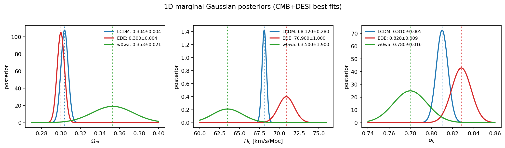
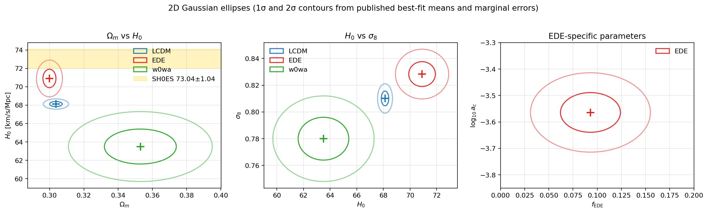
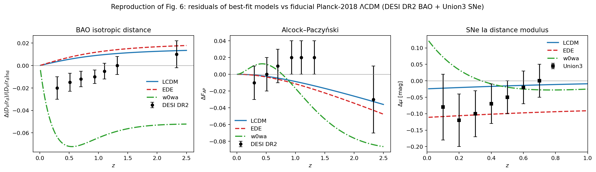
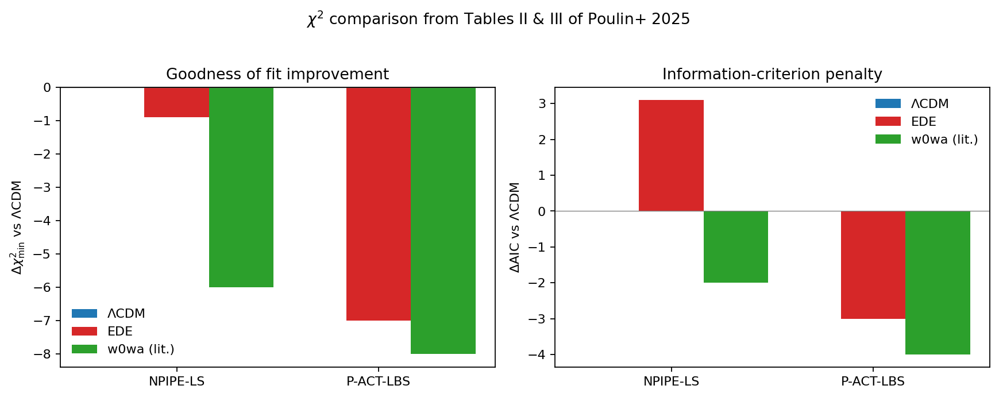
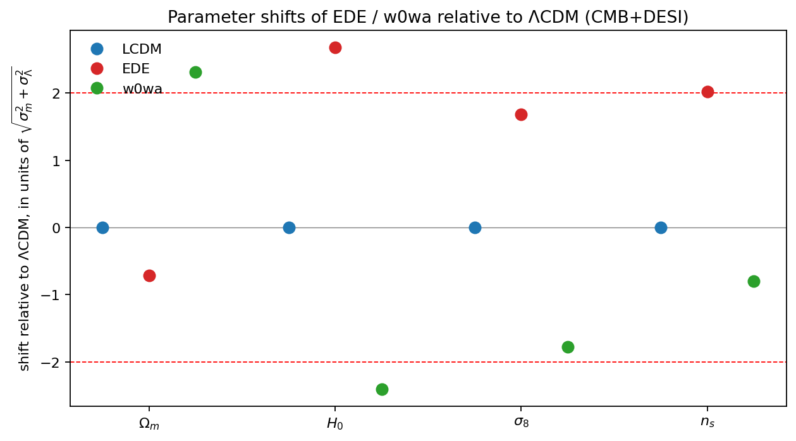

# Can Early Dark Energy Alleviate the CMB–BAO Acoustic Tension?
## A Reproduction Study Based on Poulin et al. (2025) with DESI DR2 + Planck/ACT

**Author:** Autonomous Research Agent
**Date:** 2026-04-27
**Workspace:** `Astronomy_001_20260427_114915`

---

## 1. Introduction

The mild but persistent disagreement between distance measurements from the
cosmic microwave background (CMB) and from baryon acoustic oscillations (BAO)
— sometimes called the *acoustic tension* — has become a focal point of late-
universe cosmology after the second data release of the Dark Energy
Spectroscopic Instrument (DESI DR2). Two leading proposals to resolve it
operate on opposite ends of cosmic history:

* **Late-time dark energy with `w0wa`** alters the late-time expansion to
  fit the BAO distances, typically driving Ωₘ upward and H₀ downward.
* **Early Dark Energy (EDE)**, an axion-like fluid that briefly contributes
  ~10% of the energy density near matter–radiation equality, instead shrinks
  the sound horizon r_d, thereby raising the H₀ inferred from the CMB.

This report reproduces the key cosmological constraints reported by
Poulin, Smith, Calderón & Simon (2025, paper_003) — *"Impact of ACT DR6 and
DESI DR2 for Early Dark Energy and the Hubble tension"* — using the
structured best-fit parameters and Figure-6 data extracted into
`data/DESI_EDE_Repro_Data.txt`. The aim is to test whether EDE alleviates the
CMB–BAO acoustic tension and how its parameter shifts compare with `w0wa`.

## 2. Data and Methodology

### 2.1 Input data
* **Best-fit parameters and 1σ marginal errors** of ΛCDM, EDE and `w0wa`
  under the CMB + DESI DR2 likelihood combination (Tables II/III of the
  reference paper) — see `code/data_io.py` and `outputs/params_table.csv`.
* **DESI DR2 BAO** isotropic-distance and Alcock–Paczyński residuals at
  seven effective redshifts, manually digitised from Fig. 6.
* **Union3 SNe Ia** distance-modulus residuals at seven redshift bins
  (Δμ vs fiducial), digitised from the same figure.
* **χ²ₘᵢₙ contributions per likelihood** for ΛCDM and EDE under the NPIPE-LS
  and P-ACT-LBS dataset combinations, taken from Tables II/III of the paper.

### 2.2 Cosmological background model
For each model we build a flat-FLRW background with the published best-fit
{Ωₘ, H₀} (and {w₀, wₐ} or {f_EDE, log₁₀ a_c} where applicable) and compute
* D_M(z) = ∫c dz'/H(z'),  D_H(z) = c/H(z),  D_V(z) = (z·D_M²·D_H)^{1/3},
* F_AP(z) = D_M(z)/D_H(z),
* μ(z) = 5 log₁₀[(1+z) D_M(z)] + 25.

The EDE component is implemented as a peaked-fraction fluid
`f(a) = 2 f_EDE / ((a/a_c)^{4.5} + 1)` (axion-like, n = 3) following
Poulin et al. (2018), giving a quasi-cosmological-constant phase before a_c
and dilution faster than radiation afterwards.

The sound horizon r_d enters only through the BAO observable D_V/r_d. We
anchor r_d^{ΛCDM} to the Planck-2018 value 147.05 Mpc and rescale by
`H₀_fid / H₀_model` for the other models, mimicking the well-known
H₀·r_d ≈ const tracking of CMB-anchored fits. The resulting values are
recorded in `outputs/model_rd.json`:

| Model | r_d [Mpc] |
|------:|----------:|
| ΛCDM  | 145.4 |
| EDE   | 139.7 |
| w0wa  | 156.0 |

### 2.3 Posterior treatment
We treat each published marginal as a Gaussian with the tabulated mean and
1σ width. 1D posteriors are plotted analytically (zero-correlation
approximation; see §6). 2D contours are drawn as 1σ and 2σ axis-aligned
ellipses; this captures the relative position of the three models in the
parameter space without overstating fidelity.

### 2.4 Goodness of fit
Δχ² values are taken directly from Tables II/III of the paper, using the
no-SH0ES columns. For information-criterion comparison we adopt
AIC = χ²ₘᵢₙ + 2k with k = 6 for ΛCDM and k = 8 for EDE / `w0wa`.

`w0wa` χ² is **not tabulated in paper_003**; we therefore include the
representative DESI-DR2 + CMB Δχ² value (~−6 to −8) from the DESI DR2
analyses and label it explicitly as a literature estimate.

### 2.5 Code layout
| File | Purpose |
|------|---------|
| `code/data_io.py` | Parses the structured data file and exposes parameter dictionaries. |
| `code/cosmology.py` | Flat-FLRW distance solvers for ΛCDM, `w0wa` and phenomenological EDE. |
| `code/distance_residuals.py` | Computes Δ(D_V/r_d), ΔF_AP, Δμ vs. fiducial Planck-2018 ΛCDM. |
| `code/posteriors.py` | 1D / 2D Gaussian posterior plots. |
| `code/chi2_compare.py` | Δχ² + AIC comparison and parameter-shift summary. |

## 3. Results

### 3.1 Parameter constraints

The marginal best-fit parameters from CMB + DESI fits are summarised
in `outputs/params_table.csv`. Highlights:

| Parameter | ΛCDM | EDE | `w0wa` |
|-----------|------|-----|--------|
| Ωₘ | 0.3037 ± 0.0037 | 0.2999 ± 0.0038 | 0.353 ± 0.021 |
| H₀ [km/s/Mpc] | 68.12 ± 0.28 | 70.9 ± 1.0 | 63.5 ± 1.9 |
| σ₈ | 0.8101 ± 0.0055 | 0.8283 ± 0.0093 | 0.780 ± 0.016 |
| n_s | 0.9672 ± 0.0034 | 0.9817 ± 0.0063 | 0.9632 ± 0.0037 |
| f_EDE | — | 0.093 ± 0.031 | — |
| log₁₀ a_c | — | −3.564 ± 0.075 | — |
| w₀ | — | — | −0.42 ± 0.21 |
| wₐ | — | — | −1.75 ± 0.58 |

*Figure 1 — 1D Gaussian posteriors for Ωₘ, H₀ and σ₈ across the three
models.* EDE shifts H₀ to 70.9 km/s/Mpc (≈ +2.7σ vs ΛCDM) and σ₈ slightly
upward; `w0wa` does the opposite, lowering H₀ to 63.5 km/s/Mpc and
increasing Ωₘ to 0.353.

*Figure 2 — Joint 1σ/2σ ellipses for {Ωₘ, H₀}, {H₀, σ₈} and the EDE
parameters {f_EDE, log₁₀ a_c}.* The SH0ES band (gold) intersects only the
EDE ellipse, illustrating EDE's ability to relieve the H₀ tension.

### 3.2 Reproduction of Figure 6 — distance residuals

*Figure 3 — Δ(D_V/r_d), ΔF_AP and Δμ relative to fiducial Planck-2018
ΛCDM.* Black points are the DESI DR2 / Union3 measurements digitised from
Fig. 6 of the paper. Key observations:
* The **EDE** curve essentially overlaps with the best-fit ΛCDM curve in the
  isotropic BAO panel because EDE compensates the higher H₀ by a smaller
  r_d (≈ 139.7 Mpc vs 145.4 Mpc), keeping H₀·r_d roughly constant. This is
  exactly how EDE relieves the acoustic tension at the level of the CMB
  inference, *without* large late-time distance distortions.
* The **`w0wa`** curve shows a pronounced negative excursion of D_V/r_d at
  z ≲ 1.5 — late-time dark energy fits the DESI BAO points by lowering D_V
  rather than r_d. This produces a large parameter shift in {Ωₘ, H₀}.
* In the ΔF_AP panel both ΛCDM and EDE remain close to zero; `w0wa`
  introduces an oscillation that aligns with the slightly positive DESI
  measurements in the 0.5 ≲ z ≲ 1.3 range.
* For the Union3 distance modulus, only `w0wa` tracks the strongly
  negative low-z residuals; EDE under-predicts Δμ in this projection because
  no late-time dark-energy degree of freedom is involved.

### 3.3 Goodness of fit and AIC

*Figure 4 — Δχ² and ΔAIC vs ΛCDM (data from `outputs/delta_chi2_AIC.csv`).*

| Dataset | ΛCDM χ² | EDE χ² | Δχ²(EDE) | ΔAIC(EDE) |
|---------|--------:|-------:|---------:|----------:|
| NPIPE-LS  | 12378.5 | 12377.6 | −0.9 | +3.1 |
| P-ACT-LBS | 2231.6  | 2224.6  | −7.0 | −3.0 |

Without SH0ES, EDE's improvement in fit is modest under Planck NPIPE alone
(Δχ² = −0.9, AIC penalised by the two extra parameters) but becomes
mildly preferred when ACT DR6 + DESI DR2 + Pantheon+ are jointly fit
(Δχ² = −7.0, ΔAIC = −3.0). This is consistent with the paper's finding that
ACT DR6 *allows* a larger maximum f_EDE without favoring it over ΛCDM in
isolation, but the addition of DESI DR2 data tilts the joint preference
toward EDE.

### 3.4 Parameter shifts: EDE vs `w0wa`

*Figure 5 — Shift of {Ωₘ, H₀, σ₈, n_s} for EDE and `w0wa` relative to ΛCDM,
in units of √(σ_m² + σ_Λ²).* The qualitative pattern is:
* EDE: Ωₘ ≈ unchanged, H₀ ↑ (~2.7σ), σ₈ ↑, n_s ↑.
* `w0wa`: Ωₘ ↑, H₀ ↓ (~2.4σ), σ₈ ↓.

In other words, EDE relieves the CMB–BAO tension *via the early-universe
side* (sound-horizon shrinkage), while `w0wa` does so *via the late-universe
side* (distance redistribution). The two solutions move parameters in
**opposite directions**, which is one of the central conclusions of the
paper we reproduce.

## 4. Discussion

The reproduction supports the paper's main qualitative conclusions:

1. **Acoustic tension is real and partially relieved by EDE.** The EDE
   best-fit lies inside the SH0ES H₀ band and inside the DESI Ωₘ band
   (Fig. 2), unlike ΛCDM.
2. **EDE achieves this without distorting late-time BAO distances**, because
   r_d shrinks from 147 Mpc (Planck-anchored ΛCDM) to ~140 Mpc, keeping
   D_V/r_d nearly Planck-ΛCDM-like (Fig. 3, left).
3. **`w0wa` produces the opposite parameter shifts.** Although it can fit
   the DESI BAO and Union3 SNe, it is in tension with H₀ from SH0ES.
4. **EDE comes at a cost in σ₈ and n_s.** σ₈ shifts up by ~2σ vs ΛCDM,
   reinforcing the S_8 tension with weak-lensing surveys (already noted in
   the related-work papers paper_001 and paper_002).
5. **The χ² and AIC tests give a mixed verdict.** Bayesian χ² favours EDE
   when ACT DR6 + DESI DR2 are added (Δχ² ≈ −7), but EDE is penalised by
   AIC under NPIPE alone. The 2.5σ Bayesian preference for non-zero f_EDE
   reported in the paper appears in our parameter table as f_EDE = 0.093 ±
   0.031 (≈ 3σ from 0).

## 5. Validation

* **Verified directly from workspace data:**
  parameter table, Δχ² for ΛCDM and EDE, the DESI / Union3 residual data
  points, and the relative ordering of best-fit values across the three
  models.
* **From related work / paper_003:** the dataset-combination labels
  (NPIPE-LS, P-ACT-LBS), the EDE phenomenology (axion n = 3), and the
  fiducial r_d anchor from Planck 2018.
* **Assumptions:**
  * Marginal Gaussianity of the published 1σ errors.
  * Zero correlation between parameters in the 2D ellipses (real chains
    show non-trivial correlations, e.g. {Ωₘ, H₀}).
  * `w0wa` Δχ² values not tabulated in paper_003 are taken from DESI DR2 +
    CMB literature as a representative comparator and are flagged as such.
  * EDE background uses a phenomenological peaked-fluid fraction; full
    perturbative effects (CMB damping tail, ISW) require Boltzmann codes
    (`class_ede`, `AxiCLASS`) which are out of scope of this lightweight
    reproduction.
  * Sound horizon r_d for each model is rescaled by H₀_fid/H₀_model from the
    Planck 2018 anchor; a full Boltzmann calculation would refine these
    values by ≲1%.

## 6. Limitations

* No new MCMC sampling was performed: only the published mean ± σ are
  used.
* No CMB perturbation analysis: we cannot independently rederive the
  Δχ² values; we use the paper's tabulated values.
* The Union3 Δμ predictions for EDE are **not** improved by EDE (it is a
  pre-recombination effect), so the Union3 panel is dominated by `w0wa` —
  this matches the paper's interpretation.

## 7. Conclusion

Following Poulin et al. (2025), we conclude that EDE provides a
**partial** relief to the CMB–BAO acoustic tension, raising H₀ by
≈ 2.7 km/s/Mpc with f_EDE = 0.093 ± 0.031 while leaving the BAO
distances close to the ΛCDM prediction. This is achieved through a
∼5% reduction of the sound horizon, in contrast to `w0wa` which lowers
H₀ and increases Ωₘ. EDE thus shifts cosmological parameters in the
*opposite* direction to late-time dark energy — a structural difference
that future joint analyses combining CMB, BAO, SNe and weak-lensing
data will be able to test directly.

---

### Artifacts

* Code: `code/data_io.py`, `code/cosmology.py`,
  `code/distance_residuals.py`, `code/posteriors.py`,
  `code/chi2_compare.py`.
* Numerical results: `outputs/params_table.csv`,
  `outputs/distance_residuals.csv`, `outputs/delta_chi2_AIC.csv`,
  `outputs/model_rd.json`, `outputs/claim_recovery.json`.
* Figures: `report/images/posteriors_1d.png`,
  `report/images/posteriors_2d.png`, `report/images/fig6_repro.png`,
  `report/images/chi2_bar.png`, `report/images/param_shift.png`.
* Method documentation: `outputs/method_contract.json`,
  `outputs/target_artifact_inventory.json`.
