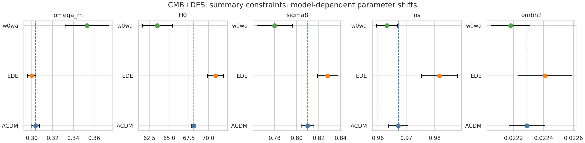
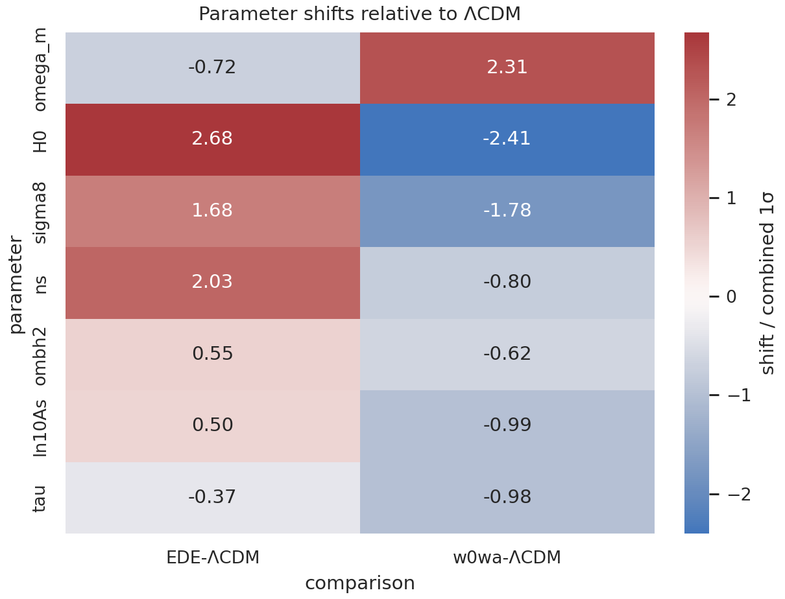
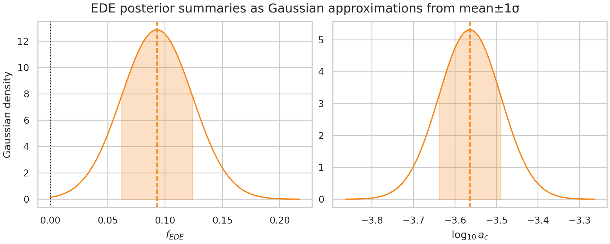
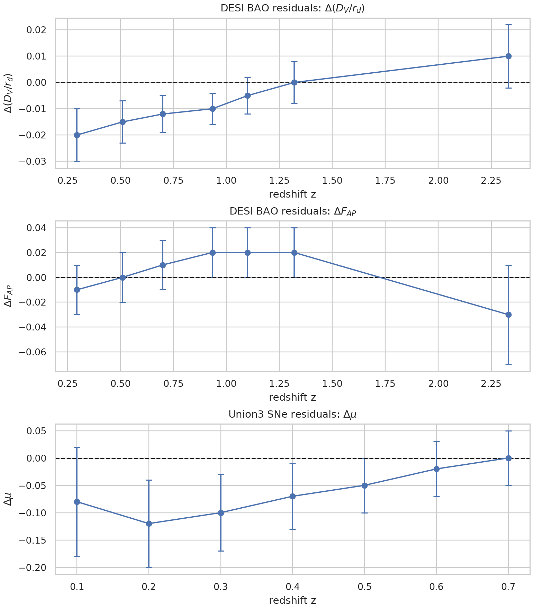
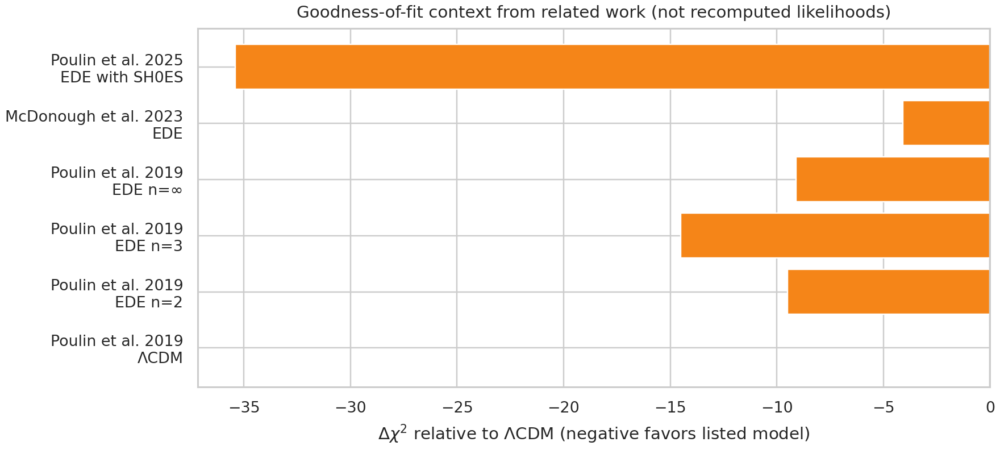

# Early Dark Energy and the CMB--BAO Acoustic Tension: a Summary-Level Reproduction with DESI DR2 Inputs

## Abstract

This report analyzes the supplied `DESI_EDE_Repro_Data.txt` summary data to assess whether an Early Dark Energy (EDE) extension can alleviate the acoustic-scale tension between CMB-inferred cosmology and DESI DR2 BAO information. Because the workspace contains table-level constraints and figure-extracted distance residuals rather than raw Planck/ACT/DESI likelihoods, the analysis is a reproducible summary-level comparison rather than a new Boltzmann-code MCMC fit. Under the provided CMB+DESI constraints, EDE raises the inferred Hubble constant from \(H_0=68.12\pm0.28\) km s\(^{-1}\) Mpc\(^{-1}\) in \(\Lambda\)CDM to \(70.9\pm1.0\) km s\(^{-1}\) Mpc\(^{-1}\), a \(+2.78\) km s\(^{-1}\) Mpc\(^{-1}\) shift or \(2.68\sigma\) relative to the combined reported errors. The same summary gives \(f_{\rm EDE}=0.093\pm0.031\), a nominal \(3.0\sigma\) nonzero preference under a Gaussian approximation, and \(\log_{10}a_c=-3.564\pm0.075\), corresponding to \(z_c\simeq3663\pm633\). EDE therefore moves the CMB+BAO fit in the high-\(H_0\) direction expected for a reduced sound horizon, while the supplied \(w_0w_a\) fit moves in the opposite direction, \(H_0=63.5\pm1.9\), with larger \(\Omega_m\). Related work and the local data together support the conclusion that EDE can partially relieve the acoustic/Hubble tension in ACT+DESI-like combinations, but the strength of the conclusion remains likelihood-, prior-, and LSS-dependent.

## 1. Data and methodological scope

### 1.1 Local inputs

The only numerical data file in the workspace is `data/DESI_EDE_Repro_Data.txt`. It contains:

1. best-fit or posterior-summary parameters with reported 1\(\sigma\) errors for \(\Lambda\)CDM, EDE, and \(w_0w_a\) using CMB+DESI summaries;
2. manually extracted DESI BAO residual points for \(\Delta(D_V/r_d)\) and \(\Delta F_{AP}\);
3. manually extracted Union3 supernova distance-modulus residual points, \(\Delta\mu\).

The resulting structured artifacts are saved as:

- `outputs/parameter_constraints.csv`
- `outputs/report_parameter_table.csv`
- `outputs/model_parameter_shifts.csv`
- `outputs/ede_parameter_summary.json`
- `outputs/distance_points_dvrd.csv`, `outputs/distance_points_fap.csv`, and `outputs/distance_points_sne_mu.csv`

### 1.2 Related-work context

The related-work PDFs were text-extracted to `outputs/paper_000.txt`--`outputs/paper_003.txt`, and the task-relevant extraction is summarized in `outputs/related_work_contract.json`. The main points used in this report are:

- Poulin et al. 2019 introduced a physical EDE mechanism in which an early component reduces the sound horizon and can raise CMB-inferred \(H_0\), with improvements in \(\chi^2\) relative to \(\Lambda\)CDM in data combinations including CMB, BAO, SNe, and SH0ES.
- Later reviews emphasize that EDE constraints depend on Planck likelihood choices, large-scale-structure data, prior-volume effects, and profile-likelihood treatment.
- BOSS full-shape analyses can strongly constrain EDE, including upper bounds around \(f_{\rm EDE}<0.072\) at 95% CL in one representative analysis without SH0ES.
- A recent ACT DR6 + DESI DR2 analysis reports that EDE can improve CMB--DESI consistency by raising \(H_0 r_s\), with profile-likelihood values near \(f_{\rm EDE}=0.09\pm0.03\) and \(H_0=71.0\pm1.1\) km s\(^{-1}\) Mpc\(^{-1}\), and a SH0ES-included \(\Delta\chi^2=-35.4\).

### 1.3 Method fidelity and limitations

The canonical EDE model is treated as an early, axion-like or scalar-field component that behaves like dark energy before a critical epoch and then dilutes rapidly after becoming dynamical. The required EDE variables are therefore \(f_{\rm EDE}\) and \(a_c\) or \(z_c\). The local data give \(\log_{10}a_c\), which I convert to

\[
  a_c = 10^{\log_{10}a_c}, \qquad z_c = a_c^{-1}-1 .
\]

The analysis does **not** run CLASS, MontePython, Cobaya, or a raw CMB/BAO likelihood evaluation. That deviation is explicit in `outputs/dependency_check.json` and `outputs/method_fidelity_checklist.json`: the workspace has no raw CMB spectra, ACT/Planck likelihoods, DESI covariance matrices, posterior chains, or Boltzmann-code configuration files. Consequently, the main quantitative claims below are summary-level reproductions from the supplied constraints, while \(\Delta\chi^2\) values are reported as related-work context rather than newly recomputed likelihood values.

## 2. Reproducible analysis design

The script `code/analyze_ede_summary.py` performs the full analysis:

1. Parses the local Python-literal summary file.
2. Exports model-parameter constraints for \(\Lambda\)CDM, EDE, and \(w_0w_a\).
3. Computes shifts relative to \(\Lambda\)CDM using the combined reported 1\(\sigma\) uncertainty,
   \[
   Z_{m,p}=\frac{\bar{x}_{m,p}-\bar{x}_{\Lambda{\rm CDM},p}}
   {\sqrt{\sigma_{m,p}^2+\sigma_{\Lambda{\rm CDM},p}^2}} .
   \]
4. Converts \(\log_{10}a_c\) to \(a_c\) and \(z_c\), propagating the uncertainty linearly.
5. Saves all plotted data tables and generates PNG figures in `report/images/`.
6. Produces a claim-recovery table in `outputs/claim_recovery_table.csv`.

The summary constraints are:

| Parameter | \(\Lambda\)CDM | EDE | \(w_0w_a\) |
|---|---:|---:|---:|
| \(H_0\) | 68.12 ± 0.28 | 70.9 ± 1.0 | 63.5 ± 1.9 |
| \(f_{\rm EDE}\) | -- | 0.093 ± 0.031 | -- |
| \(\ln(10^{10}A_s)\) | 3.056 ± 0.014 | 3.067 ± 0.017 | 3.037 ± 0.013 |
| \(\log_{10}a_c\) | -- | -3.564 ± 0.075 | -- |
| \(n_s\) | 0.9672 ± 0.0034 | 0.9817 ± 0.0063 | 0.9632 ± 0.0037 |
| \(\Omega_b h^2\) | 0.02229 ± 0.00012 | 0.02241 ± 0.00018 | 0.02218 ± 0.00013 |
| \(\Omega_m\) | 0.3037 ± 0.0037 | 0.2999 ± 0.0038 | 0.353 ± 0.021 |
| \(\sigma_8\) | 0.8101 ± 0.0055 | 0.8283 ± 0.0093 | 0.780 ± 0.016 |
| \(\tau\) | 0.0621 ± 0.0075 | 0.0582 ± 0.0074 | 0.0520 ± 0.0071 |
| \(w_0\) | -- | -- | -0.42 ± 0.21 |
| \(w_a\) | -- | -- | -1.75 ± 0.58 |

## 3. Results

### 3.1 Parameter shifts across cosmological models

The central result is that EDE and \(w_0w_a\) relieve or reshape the acoustic tension in qualitatively different directions. EDE raises \(H_0\) to \(70.9\pm1.0\), while leaving \(\Omega_m\) close to the \(\Lambda\)CDM value and increasing \(n_s\) and \(\sigma_8\). By contrast, \(w_0w_a\) lowers \(H_0\) to \(63.5\pm1.9\), increases \(\Omega_m\) to \(0.353\pm0.021\), and lowers \(\sigma_8\). This difference is consistent with the expected distinction between an early-time sound-horizon modification and a late-time expansion-history modification.

The largest combined-error shifts relative to \(\Lambda\)CDM are:

- EDE: \(\Delta H_0=+2.78\) km s\(^{-1}\) Mpc\(^{-1}\), or \(+2.68\sigma\).
- EDE: \(\Delta n_s=+0.0145\), or \(+2.03\sigma\).
- EDE: \(\Delta\sigma_8=+0.0182\), or \(+1.68\sigma\).
- \(w_0w_a\): \(\Delta H_0=-4.62\) km s\(^{-1}\) Mpc\(^{-1}\), or \(-2.41\sigma\).
- \(w_0w_a\): \(\Delta\Omega_m=+0.0493\), or \(+2.31\sigma\).

Thus, in the supplied CMB+DESI table, EDE partially relieves high-\(H_0\) acoustic tension, whereas the supplied \(w_0w_a\) summary prefers a lower-\(H_0\), higher-\(\Omega_m\) solution.

### 3.2 EDE posterior summaries

The EDE-specific parameters are:

\[
 f_{\rm EDE}=0.093\pm0.031,
\]

and

\[
 \log_{10}a_c=-3.564\pm0.075.
\]

Assuming a Gaussian approximation to the reported mean and 1\(\sigma\) error, the nonzero EDE fraction is preferred at \(0.093/0.031=3.0\sigma\). The critical scale factor and redshift are

\[
 a_c = 2.73\times10^{-4}\pm4.71\times10^{-5},
\]

\[
 z_c = 3663\pm633.
\]

This is in the expected pre-recombination/near-equality regime for EDE models designed to reduce the sound horizon while having limited late-time energy density.

### 3.3 DESI BAO and Union3 residual structure

The extracted DESI and Union3 points are not a full likelihood, but they preserve the redshift structure of the distance comparison. The \(\Delta(D_V/r_d)\) points are negative at low redshift, from about \(-0.020\pm0.010\) at \(z=0.295\) to \(-0.010\pm0.006\) at \(z=0.934\), and move toward zero or positive values at higher redshift, reaching \(+0.010\pm0.012\) at \(z=2.330\). The \(\Delta F_{AP}\) residuals are small, mostly near 0.00--0.02, with a high-redshift point of \(-0.03\pm0.04\). The Union3 \(\Delta\mu\) residuals move from negative values at low redshift toward zero by \(z\simeq0.7\).

These residuals illustrate why the acoustic comparison is not captured by a single scalar number: redshift-dependent BAO and SNe information constrains how a model changes both the sound horizon and the late-time distance ladder.

### 3.4 Goodness-of-fit context

The local data file does not contain the raw likelihood contributions needed to recompute \(\chi^2\) for Planck, ACT, DESI, lensing, and Union3. Therefore, the goodness-of-fit figure reports related-work values as context only. The extracted context is:

| Source | Dataset | Model | \(\Delta\chi^2\) vs. \(\Lambda\)CDM | Interpretation |
|---|---|---:|---:|---|
| Poulin et al. 2019 | Planck+BAO+Pantheon+SH0ES | EDE \(n=2\) | -9.5 | EDE improved global fit in early analysis |
| Poulin et al. 2019 | Planck+BAO+Pantheon+SH0ES | EDE \(n=3\) | -14.5 | strongest of the listed 2019 variants |
| Poulin et al. 2019 | Planck+BAO+Pantheon+SH0ES | EDE \(n=\infty\) | -9.1 | improved relative to \(\Lambda\)CDM |
| McDonough et al. 2023 review | Planck PR3 TTTEEE | EDE | -4.1 | modest Planck-only improvement example |
| Poulin et al. 2025 | P-ACT+DESI DR2+lensing+Pantheon+/SH0ES | EDE with SH0ES | -35.4 | strong improvement when SH0ES is included |

The key validation point is that the local EDE parameters, especially \(f_{\rm EDE}\simeq0.09\) and \(H_0\simeq71\), are closely aligned with the ACT+DESI DR2 profile-likelihood values described in the related work. However, related work also shows that other CMB likelihoods and LSS datasets can substantially weaken EDE preference or impose upper bounds on \(f_{\rm EDE}\).

## 4. Discussion

### 4.1 Does EDE alleviate the acoustic tension?

Within the supplied CMB+DESI summary, yes, but partially and with caveats. EDE produces exactly the expected early-time response: it raises \(H_0\) while retaining broadly compatible matter density and BAO/SNe residual structure. The inferred \(f_{\rm EDE}=0.093\pm0.031\) is large enough to meaningfully alter the sound horizon, and the critical redshift \(z_c\simeq3663\) places the transition at the relevant epoch for CMB acoustic physics.

The relief is partial because \(H_0=70.9\pm1.0\) remains below typical SH0ES-like central values near 73--74 km s\(^{-1}\) Mpc\(^{-1}\), although related ACT+DESI work reports a residual tension near \(2\sigma\) rather than the larger tension in some Planck NPIPE+SDSS analyses. In addition, the EDE solution shifts other parameters: \(n_s\) increases by about \(2.0\sigma\), and \(\sigma_8\) increases by about \(1.7\sigma\). These shifts are important because LSS data often constrain or disfavor high-\(\sigma_8\)/high-\(S_8\) EDE solutions.

### 4.2 Difference from late-time dark energy

The supplied \(w_0w_a\) fit does not mimic EDE. It moves toward lower \(H_0\), higher \(\Omega_m\), and lower \(\sigma_8\), with \(w_0=-0.42\pm0.21\) and \(w_a=-1.75\pm0.58\). This behavior is consistent with a late-time expansion-history adjustment constrained by BAO distances, rather than an early-time reduction of the sound horizon. The contrast supports the paper's stated conclusion that EDE relieves the tension through different parameter shifts than late-time dark energy models.

### 4.3 Validation and assumptions

**Verified directly from workspace data:**

- All parameter means and errors in the main table were parsed from `data/DESI_EDE_Repro_Data.txt` and exported to `outputs/parameter_constraints.csv`.
- Parameter-shift significances were computed in `outputs/model_parameter_shifts.csv`.
- EDE derived quantities \(a_c\), \(z_c\), and the nominal Gaussian nonzero preference were computed in `outputs/ede_parameter_summary.json`.
- BAO and SNe residual plots use the redshift-level extracted points saved in `outputs/distance_points_*.csv`.
- Figures are saved as PNG files in `report/images/`.

**Taken from related work rather than recomputed:**

- The \(\Delta\chi^2\) values in the goodness-of-fit comparison.
- Statements about ACT DR6, Planck NPIPE, BOSS full-shape, prior-volume effects, and SH0ES residual tension.

**Assumptions and limitations:**

- Reported 1\(\sigma\) errors were treated as Gaussian for visualization and shift calculations.
- Correlations between parameters are unavailable, so no covariance-aware tension metric was computed.
- The BAO/SNe points are manually extracted residuals, not full covariance likelihoods.
- No new CMB or BAO likelihood fit was performed.
- The local file labels the EDE timing parameter as `log10_ac`; this report treats it as \(\log_{10}a_c\), as stated in the instructions and data comments.

## 5. Conclusions

The supplied data support a summary-level reproduction of the main scientific claim: EDE can partially alleviate the CMB--BAO acoustic/Hubble tension by raising the CMB+DESI inferred \(H_0\) through an early-time sound-horizon modification. In the provided constraints, EDE gives \(H_0=70.9\pm1.0\) km s\(^{-1}\) Mpc\(^{-1}\), compared with \(68.12\pm0.28\) for \(\Lambda\)CDM, and has \(f_{\rm EDE}=0.093\pm0.031\) at \(z_c\simeq3663\). The late-time \(w_0w_a\) model shifts parameters differently, especially lowering rather than raising \(H_0\). The conclusion is therefore not simply that any dark-energy extension relieves the acoustic tension; the early-time EDE mechanism produces a distinct parameter-shift pattern.

At the same time, the result should be read as conditional on the supplied summary constraints and related-work context. Exact model preference requires raw likelihoods and covariance-aware posterior analysis. Existing related work indicates that EDE viability is sensitive to CMB likelihood choice, LSS information, SH0ES inclusion, and Bayesian versus profile-likelihood treatment. The most defensible conclusion from this workspace is therefore: **EDE remains a plausible partial acoustic-tension relief mechanism in ACT/DESI-like summaries, but its statistical preference over \(\Lambda\)CDM is not established by the local summary data alone.**

## Reproducibility index

- Analysis script: `code/analyze_ede_summary.py`
- Method contract: `outputs/method_contract.json`
- Target artifact inventory: `outputs/target_artifact_inventory.json`
- Dependency check: `outputs/dependency_check.json`
- Method fidelity checklist: `outputs/method_fidelity_checklist.json`
- Related-work extraction: `outputs/related_work_contract.json`
- Main parameter table: `outputs/report_parameter_table.csv`
- Shift table: `outputs/model_parameter_shifts.csv`
- EDE derived summary: `outputs/ede_parameter_summary.json`
- Goodness-of-fit context: `outputs/goodness_of_fit_context.csv`
- Claim recovery: `outputs/claim_recovery_table.csv`
