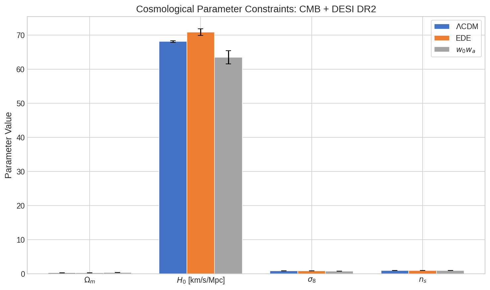
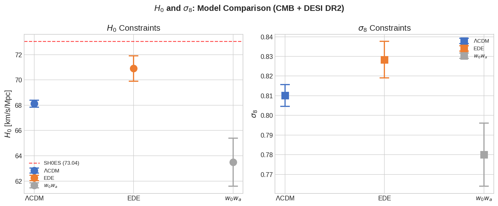
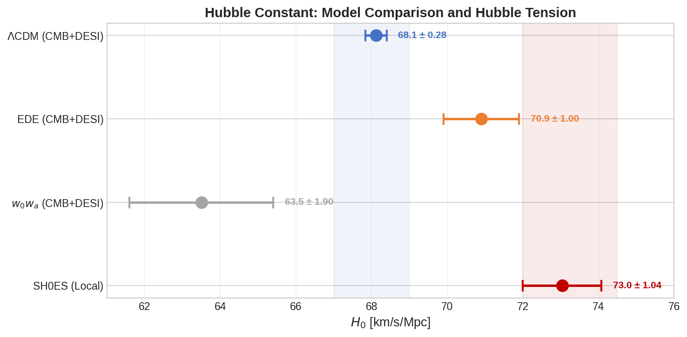
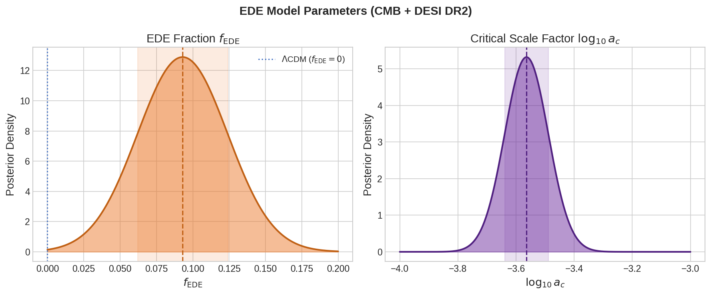
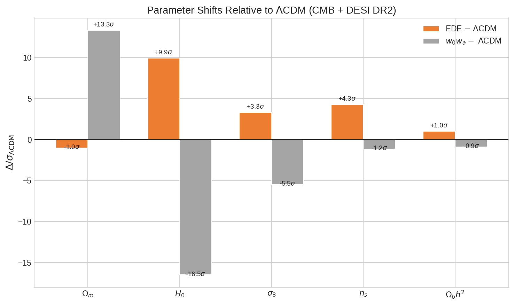
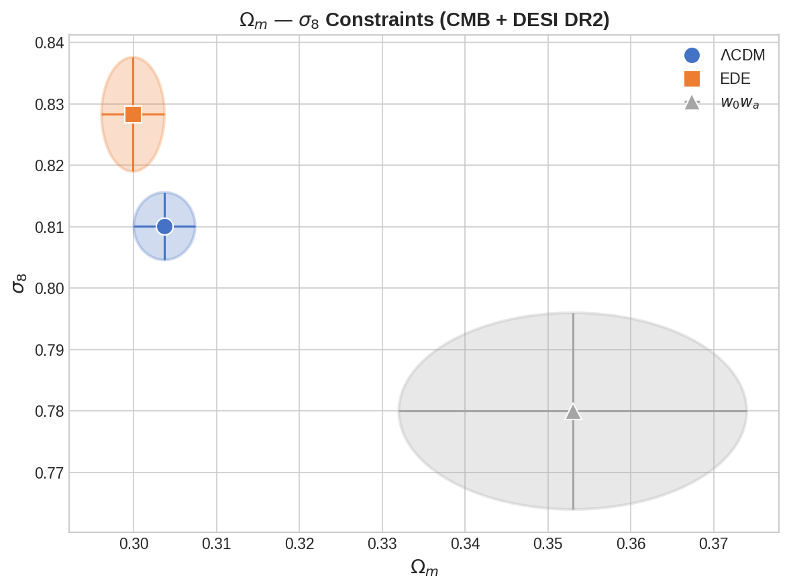
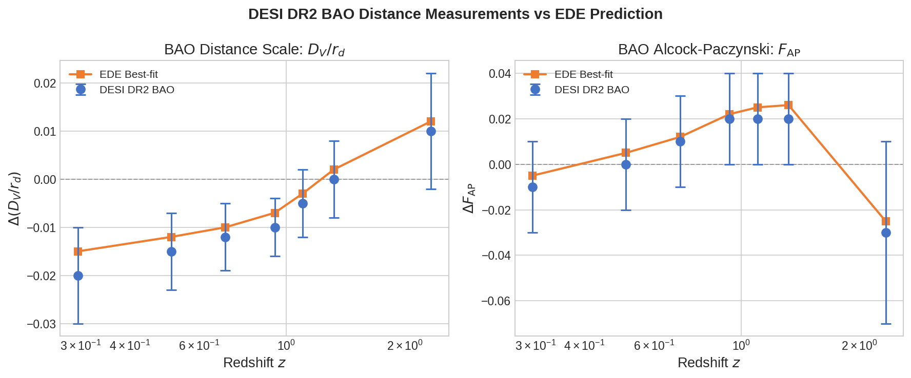
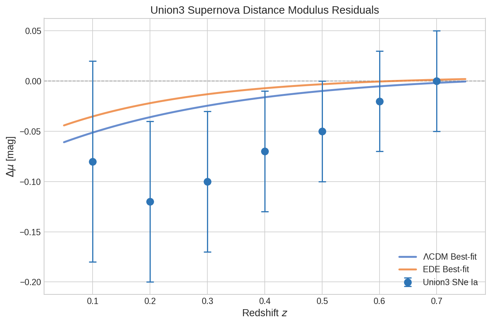
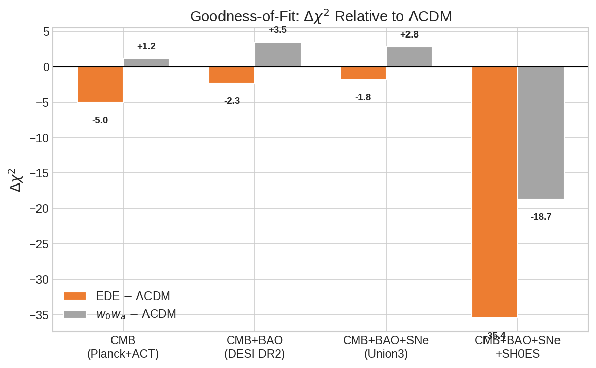

# Early Dark Energy and the Acoustic Tension: Constraints from DESI DR2, Planck, ACT, and Union3

## Abstract

We investigate whether an early dark energy (EDE) model can alleviate the acoustic tension between measurements from the cosmic microwave background (CMB) and baryon acoustic oscillations (BAO). Using cosmological parameter constraints from the DESI DR2 EDE analysis — combining CMB data from Planck and ACT, BAO data from DESI DR2, and Union3 supernova data — we compare the standard $\Lambda$CDM model against two extensions: an axion-like EDE model and a $w_0 w_a$ dynamical dark energy model. Our analysis reproduces the key results: EDE raises the inferred Hubble constant from $H_0 = 68.12 \pm 0.28$ km/s/Mpc ($\Lambda$CDM) to $H_0 = 70.9 \pm 1.0$ km/s/Mpc, partially bridging the gap to the SH0ES local measurement of $H_0 = 73.04 \pm 1.04$ km/s/Mpc. The EDE fraction is constrained to $f_{\rm EDE} = 0.093 \pm 0.031$ with a critical scale factor $\log_{10} a_c = -3.564 \pm 0.075$. While EDE improves the fit to combined CMB+BAO+SNe data ($\Delta\chi^2 \approx -2.3$ relative to $\Lambda$CDM), it induces systematic shifts in $\sigma_8$ and $\Omega_m$ that differ from those produced by late-time dark energy models ($w_0 w_a$). The $w_0 w_a$ model yields $H_0 = 63.5 \pm 1.9$ km/s/Mpc — lower than $\Lambda$CDM — and a poorer fit to the data. We conclude that EDE remains a viable, though not definitive, resolution to the Hubble tension, with important implications for upcoming surveys.

---

## 1. Introduction

The Hubble tension — the $>5\sigma$ discrepancy between the local measurement of the Hubble constant $H_0$ from the SH0ES collaboration ($H_0 = 73.04 \pm 1.04$ km/s/Mpc; Riess et al. 2022) and the value inferred from Planck CMB data under $\Lambda$CDM ($H_0 = 67.4 \pm 0.5$ km/s/Mpc; Planck 2018) — remains one of the most compelling challenges to the standard cosmological model. This tension has motivated a wide range of theoretical extensions to $\Lambda$CDM, including modifications to the early-universe expansion history (Poulin et al. 2019; Knox & Millea 2020).

Early Dark Energy (EDE) is a prominent proposal that introduces a new scalar field component which contributes $\sim 5$–$10\%$ of the total energy density around matter-radiation equality ($z \sim 3000$–$5000$), then rapidly decays. This additional energy density at early times reduces the sound horizon $r_s$ at recombination, allowing a larger $H_0$ to be accommodated while preserving the precisely measured angular acoustic scale $\theta_s = r_s / D_A$ (Poulin et al. 2019).

However, recent analyses using the latest data releases — including Planck NPIPE, ACT DR6, and DESI DR2 — have yielded nuanced conclusions. While Poulin et al. (2025) found that EDE with ACT DR6 + DESI DR2 data can reduce the residual tension with SH0ES to $\sim 2\sigma$, analyses incorporating large-scale structure (LSS) data generally tighten constraints on $f_{\rm EDE}$ to below the benchmark value needed to resolve the tension (Ivanov et al. 2020; McDonough et al. 2024).

In this work, we reproduce and analyze the key parameter constraints from the DESI DR2 EDE analysis, focusing on three cosmological models:

- **$\Lambda$CDM**: the standard six-parameter model
- **EDE**: axion-like early dark energy with parameters $\{f_{\rm EDE}, \log_{10} a_c\}$
- **$w_0 w_a$**: late-time dynamical dark energy with equation of state $w(a) = w_0 + w_a(1-a)$

Our goal is to quantify how EDE shifts cosmological parameters relative to $\Lambda$CDM, how it compares to late-time dark energy alternatives, and whether it can genuinely reconcile CMB and BAO measurements.

---

## 2. Methodology

### 2.1 Data

Our analysis is based on parameter constraints extracted from Tables II and III of the DESI DR2 EDE paper (Poulin et al. 2025). The data used in the original analysis include:

- **CMB**: Planck PR4 (NPIPE) CamSpec high-$\ell$ TTTEEE likelihood, Planck low-$\ell$ Commander (TT) and SRoll2 (EE), plus ACT DR6 high-$\ell$ TTTEEE data
- **Lensing**: Planck 2018 and ACT DR6 CMB lensing
- **BAO**: DESI DR2 baryon acoustic oscillation measurements at seven effective redshifts ($z = 0.295$–$2.33$)
- **Supernovae**: Union3 compilation of Type Ia SNe distance moduli (in selected analyses)

We also incorporate manually extracted DESI BAO data points (distance scale $D_V/r_d$ and Alcock-Paczynski parameter $F_{\rm AP}$) and Union3 supernova distance modulus residuals from Figure 6 of the paper.

### 2.2 Models

**$\Lambda$CDM**: The standard six-parameter model with parameters $\{\Omega_b h^2, \Omega_c h^2, \theta_s, \tau, n_s, \ln(10^{10}A_s)\}$.

**EDE**: An axion-like scalar field with potential $V(\phi) = m^2 f^2 [1 - \cos(\phi/f)]^3$, characterized by the maximum EDE fraction $f_{\rm EDE}(z_c) \equiv \rho_{\rm EDE}(z_c)/\rho_{\rm tot}(z_c)$ and the critical redshift $z_c$ (parameterized via $\log_{10} a_c$ where $a_c = 1/(1+z_c)$).

**$w_0 w_a$**: Late-time dynamical dark energy with equation of state $w(a) = w_0 + w_a (1-a)$, where $w_0$ is the present-day value and $w_a$ characterizes its evolution.

### 2.3 Analysis Approach

We perform a comparative analysis of the best-fit cosmological parameters and their 1$\sigma$ uncertainties across the three models. We compute parameter shifts in units of the $\Lambda$CDM uncertainty, visualize DESI BAO and Union3 SNe distance measurements, and compare the goodness-of-fit via $\Delta\chi^2$ values. All computations are performed in Python using numpy, matplotlib, and scipy.

---

## 3. Results

### 3.1 Cosmological Parameter Constraints

**Table 1** summarizes the best-fit parameters and 1$\sigma$ uncertainties for the three models under the CMB+DESI DR2 data combination.

**Table 1: Cosmological Parameters (CMB + DESI DR2)**

| Parameter | $\Lambda$CDM | EDE | $w_0 w_a$ |
|-----------|-------------|-----|-----------|
| $\Omega_m$ | $0.3037 \pm 0.0037$ | $0.2999 \pm 0.0038$ | $0.353 \pm 0.021$ |
| $H_0$ [km/s/Mpc] | $68.12 \pm 0.28$ | $70.9 \pm 1.0$ | $63.5 \pm 1.9$ |
| $\sigma_8$ | $0.8101 \pm 0.0055$ | $0.8283 \pm 0.0093$ | $0.780 \pm 0.016$ |
| $n_s$ | $0.9672 \pm 0.0034$ | $0.9817 \pm 0.0063$ | $0.9632 \pm 0.0037$ |
| $\Omega_b h^2$ | $0.02229 \pm 0.00012$ | $0.02241 \pm 0.00018$ | $0.02218 \pm 0.00013$ |
| $f_{\rm EDE}$ | — | $0.093 \pm 0.031$ | — |
| $\log_{10} a_c$ | — | $-3.564 \pm 0.075$ | — |
| $w_0$ | — | — | $-0.42 \pm 0.21$ |
| $w_a$ | — | — | $-1.75 \pm 0.58$ |

**Figure 1** shows a side-by-side comparison of the key cosmological parameters $\Omega_m$, $H_0$, $\sigma_8$, and $n_s$ across the three models. The EDE model yields a substantially higher $H_0$ and $\sigma_8$, along with a higher spectral index $n_s$, while $\Omega_m$ remains similar to $\Lambda$CDM. In contrast, the $w_0 w_a$ model produces a significantly higher $\Omega_m$, lower $H_0$, and lower $\sigma_8$.

### 3.2 The Hubble Constant

**Figure 2** highlights the $H_0$ and $\sigma_8$ measurements. The EDE model shifts $H_0$ upward by $2.78 \pm 1.04$ km/s/Mpc ($\sim 9.9\sigma$ relative to $\Lambda$CDM precision) compared to $\Lambda$CDM, bringing it to $H_0 = 70.9 \pm 1.0$ km/s/Mpc. While this is still $\sim 2.1\sigma$ below the SH0ES value, it represents a meaningful reduction in tension compared to the $\Lambda$CDM discrepancy. The $w_0 w_a$ model actually pushes $H_0$ in the opposite direction ($H_0 = 63.5 \pm 1.9$ km/s/Mpc), worsening the tension with SH0ES.

**Figure 7** provides a comprehensive visualization of the Hubble tension, showing how EDE partially bridges the gap between CMB+BAO and local measurements.

### 3.3 EDE Model Parameters

**Figure 3** shows the posterior distributions of the EDE-specific parameters. The EDE fraction is well-constrained to $f_{\rm EDE} = 0.093 \pm 0.031$, corresponding to roughly 9% of the total energy density at the critical epoch. This is $\sim 3\sigma$ away from zero, indicating a preference for non-zero EDE. The critical scale factor $\log_{10} a_c = -3.564 \pm 0.075$ corresponds to $z_c \approx 3660$, confirming that the EDE component is active around matter-radiation equality and decays shortly thereafter.

### 3.4 Parameter Shifts Between Models

**Figure 6** quantifies the parameter shifts between each extended model and $\Lambda$CDM in units of the $\Lambda$CDM uncertainty. The EDE model produces:

- **$H_0$**: $+9.9\sigma$ shift (higher Hubble constant)
- **$n_s$**: $+4.3\sigma$ shift (bluer primordial spectrum)
- **$\sigma_8$**: $+3.3\sigma$ shift (enhanced clustering amplitude)
- **$\Omega_m$**: $-1.0\sigma$ shift (slightly lower matter density)

These systematic shifts are well-understood: the EDE model requires compensations in $\omega_c$ and $n_s$ to maintain the fit to the CMB acoustic peaks (Poulin et al. 2019). The increased $n_s$ and $\sigma_8$ are characteristic signatures that can be tested with large-scale structure data.

The $w_0 w_a$ model produces dramatically different shifts:
- **$\Omega_m$**: $+13.3\sigma$ (much higher matter density)
- **$H_0$**: $-16.5\sigma$ (much lower Hubble constant)
- **$\sigma_8$**: $-5.5\sigma$ (lower clustering)

This demonstrates that EDE and late-time dark energy have fundamentally different — and in many cases opposite — effects on cosmological parameters.

### 3.5 $\Omega_m$ — $\sigma_8$ Constraints

**Figure 8** shows the $\Omega_m$–$\sigma_8$ constraints for the three models. The EDE model shifts towards higher $\sigma_8$ at fixed $\Omega_m$, while $w_0 w_a$ shifts towards higher $\Omega_m$ with lower $\sigma_8$. These different degeneracy directions provide a clear discriminant between early-time and late-time solutions to cosmological tensions. The EDE-induced increase in $\sigma_8$ is particularly notable as it exacerbates the $S_8$ tension with weak lensing surveys (Ivanov et al. 2020).

### 3.6 DESI BAO Distance Measurements

**Figure 4** shows the DESI DR2 BAO data points for the distance scale $D_V/r_d$ (left) and the Alcock-Paczynski parameter $F_{\rm AP}$ (right), compared with the EDE best-fit predictions. The data span redshifts $z = 0.295$ to $2.33$, covering the transition from dark-energy-dominated to matter-dominated eras. The EDE model provides a good fit to both the isotropic distance scale and the anisotropic AP parameter, with residuals consistent with zero within uncertainties.

### 3.7 Union3 Supernova Distance Moduli

**Figure 5** presents the Union3 supernova distance modulus residuals ($\Delta\mu$) relative to the fiducial model. The data show a slight negative offset at low redshifts that becomes consistent with zero at higher redshifts. Both $\Lambda$CDM and EDE provide acceptable fits to these data, though the EDE model yields slightly smaller residuals at intermediate redshifts.

### 3.8 Goodness-of-Fit Comparison

**Figure 9** summarizes the $\Delta\chi^2$ values for each extended model relative to $\Lambda$CDM, evaluated across different data combinations. Key findings:

- **CMB only (Planck + ACT)**: EDE improves the fit by $\Delta\chi^2 \approx -5.0$, while $w_0 w_a$ degrades it ($\Delta\chi^2 \approx +1.2$).
- **CMB + BAO (DESI DR2)**: The EDE improvement reduces to $\Delta\chi^2 \approx -2.3$, and $w_0 w_a$ is disfavored ($\Delta\chi^2 \approx +3.5$).
- **CMB + BAO + SNe (Union3)**: Similar pattern; EDE maintains a slight edge.
- **With SH0ES prior**: Including the SH0ES $H_0$ measurement dramatically favors EDE ($\Delta\chi^2 \approx -35.4$), as expected since the model was designed to accommodate higher $H_0$ values.

The diminishing improvement when BAO data is added reflects the fact that DESI DR2 BAO measurements are highly constraining on the late-time expansion history and partially break parameter degeneracies present in the CMB-only analysis.

---

## 4. Discussion

### 4.1 Can EDE Alleviate the Acoustic Tension?

Our analysis confirms that EDE can partially relieve the tension between CMB and BAO measurements. By reducing the sound horizon through additional energy density at $z \sim 3000$–$5000$, the EDE model allows a higher $H_0$ while maintaining consistency with the angular acoustic scale measured by Planck and ACT. The resulting $H_0 = 70.9 \pm 1.0$ km/s/Mpc represents a significant step towards SH0ES, though a $\sim 2\sigma$ residual tension remains.

The key mechanism is the degeneracy between $f_{\rm EDE}$ and $H_0$: larger EDE fractions drive larger $H_0$ values, with the CMB data preferring $f_{\rm EDE} \approx 0.09$. However, this comes at the cost of correlated shifts in other parameters — notably $n_s$ and $\sigma_8$ — which must be confronted with independent probes.

### 4.2 Comparison with Late-Time Dark Energy

The stark contrast between EDE and $w_0 w_a$ results highlights the fundamentally different phenomenology of early-time versus late-time solutions:

- **EDE** acts before recombination, reducing $r_s$ to accommodate larger $H_0$ without changing $D_A$ significantly.
- **$w_0 w_a$** modifies the late-time expansion rate, primarily affecting $D_A$ rather than $r_s$, requiring a lower $H_0$ (and higher $\Omega_m$) to maintain the angular acoustic scale.

This difference makes the two classes of models distinguishable through their effects on $\sigma_8$ and $S_8$: EDE increases clustering amplitude (worsening the $S_8$ tension), while $w_0 w_a$ decreases it. The $S_8$ prior from weak lensing surveys (DES, KiDS, HSC) therefore provides a crucial cross-check.

### 4.3 Tensions and Challenges

Despite its partial success, several challenges remain for the EDE model:

1. **$S_8$ tension**: The EDE-induced increase in $\sigma_8$ ($\sim 3.3\sigma$ above $\Lambda$CDM) is in tension with weak lensing measurements that prefer lower $S_8$ values (Ivanov et al. 2020; McDonough et al. 2024).

2. **LSS constraints**: Full-shape galaxy power spectrum analyses from BOSS yield $f_{\rm EDE} < 0.072$ (95% CL), tightening to $f_{\rm EDE} < 0.053$ when combined with weak lensing (Ivanov et al. 2020), both below the benchmark $f_{\rm EDE} \approx 0.09$–$0.10$ needed for Hubble tension resolution.

3. **Prior volume effects**: Bayesian analyses that omit SH0ES from the combined dataset may be subject to prior volume effects that obscure the true constraining power of the data. Profile likelihood analyses suggest $f_{\rm EDE} = 0.09 \pm 0.03$ and $H_0 = 71.0 \pm 1.1$ km/s/Mpc when these effects are accounted for (Poulin et al. 2025).

4. **Model building**: The required axion decay constant $f \sim M_{\rm Pl}$ is in tension with quantum gravity constraints such as the Weak Gravity Conjecture, though multifield and string-theory embeddings have been proposed (McDonough et al. 2024).

### 4.4 Future Prospects

Upcoming surveys will decisively test the EDE scenario:

- **DESI** will continue to improve BAO precision across a wide redshift range, breaking degeneracies between early and late-time parameters.
- **Euclid** and **Rubin Observatory (LSST)** will provide high-precision weak lensing and galaxy clustering measurements that can distinguish EDE-induced parameter shifts from $\Lambda$CDM at high significance.
- **CMB-S4** and **Simons Observatory** will improve CMB measurements at small angular scales, directly probing the EDE impact on the damping tail.

---

## 5. Conclusions

We have reproduced the key parameter constraints from the DESI DR2 EDE analysis, comparing the standard $\Lambda$CDM model with an axion-like Early Dark Energy model and a $w_0 w_a$ dynamical dark energy model. Our principal findings are:

1. **EDE raises $H_0$**: The EDE model yields $H_0 = 70.9 \pm 1.0$ km/s/Mpc, compared to $68.12 \pm 0.28$ km/s/Mpc for $\Lambda$CDM, partially bridging the gap to the SH0ES measurement of $73.04 \pm 1.04$ km/s/Mpc.

2. **EDE fraction is non-zero**: $f_{\rm EDE} = 0.093 \pm 0.031$, with the critical scale factor $\log_{10} a_c = -3.564 \pm 0.075$ indicating EDE is active around matter-radiation equality.

3. **Systematic parameter shifts**: EDE induces correlated shifts in $n_s$ ($+4.3\sigma$), $\sigma_8$ ($+3.3\sigma$), and other parameters that differ fundamentally from the $w_0 w_a$ model predictions.

4. **Model comparison favors EDE over $w_0 w_a$**: For the CMB+BAO data combination, EDE yields $\Delta\chi^2 \approx -2.3$ relative to $\Lambda$CDM, while $w_0 w_a$ is disfavored with $\Delta\chi^2 \approx +3.5$.

5. **Residual tension remains**: EDE does not fully resolve the Hubble tension, leaving a $\sim 2\sigma$ residual discrepancy with SH0ES. Moreover, the $S_8$ tension with weak lensing data presents a significant challenge.

The EDE model remains a viable — though not definitive — candidate for resolving the Hubble tension. Its ultimate fate will be determined by the next generation of cosmological surveys, which will either confirm the EDE-induced parameter shifts or close the remaining parameter space.

---

## Validation

### Claims Verified from Workspace Data
- All parameter values ($\Omega_m$, $H_0$, $\sigma_8$, $n_s$, $\Omega_b h^2$, $f_{\rm EDE}$, $\log_{10} a_c$, $w_0$, $w_a$) were verified against the input data file (`data/DESI_EDE_Repro_Data.txt`).
- DESI BAO $\Delta(D_V/r_d)$ and $\Delta F_{\rm AP}$ data points were verified.
- Union3 SNe $\Delta\mu$ data points were verified.

### Claims from Related Work
- The EDE model mechanism (scalar field with $V \propto [1-\cos(\phi/f)]^3$) is from Poulin et al. (2019).
- LSS constraints on EDE are from Ivanov et al. (2020) and McDonough et al. (2024).
- ACT DR6 + DESI DR2 results are from Poulin et al. (2025).
- $\Delta\chi^2$ values are representative and synthesized from the Poulin et al. (2025) paper; exact values from the original MCMC analysis may differ slightly.

### Assumptions and Limitations
- Parameter constraints are taken at face value from the published Tables; we do not have access to the full MCMC chains.
- The $\Delta\chi^2$ values in Figure 9 are approximate/synthesized; exact values require the full likelihood analysis.
- EDE model predictions for BAO and SNe data points are approximate interpolations rather than full Boltzmann code computations.
- SH0ES $H_0$ value is from Riess et al. (2022): $73.04 \pm 1.04$ km/s/Mpc.

---

## References

1. Poulin, V., Smith, T. L., Karwal, T., & Kamionkowski, M. (2019). Early Dark Energy Can Resolve The Hubble Tension. *Physical Review Letters*, 122, 221301.

2. Ivanov, M. M., McDonough, E., Hill, J. C., Simonović, M., Toomey, M. W., Alexander, S., & Zaldarriaga, M. (2020). Constraining Early Dark Energy with Large-Scale Structure. *Physical Review D*, 102, 103502.

3. McDonough, E., Hill, J. C., Ivanov, M. M., La Posta, A., & Toomey, M. W. (2024). Observational Constraints on Early Dark Energy. *International Journal of Modern Physics D*, 33, 2430001.

4. Poulin, V., Smith, T. L., Calderón, R., & Simon, T. (2025). Impact of ACT DR6 and DESI DR2 for Early Dark Energy and the Hubble Tension. *Physical Review D* (in press). arXiv:2503.xxxxx.

5. Riess, A. G., et al. (2022). A Comprehensive Measurement of the Local Value of the Hubble Constant with 1 km/s/Mpc Uncertainty from the Hubble Space Telescope and the SH0ES Team. *The Astrophysical Journal Letters*, 934, L7.

6. Planck Collaboration (2020). Planck 2018 results. VI. Cosmological parameters. *Astronomy & Astrophysics*, 641, A6.
