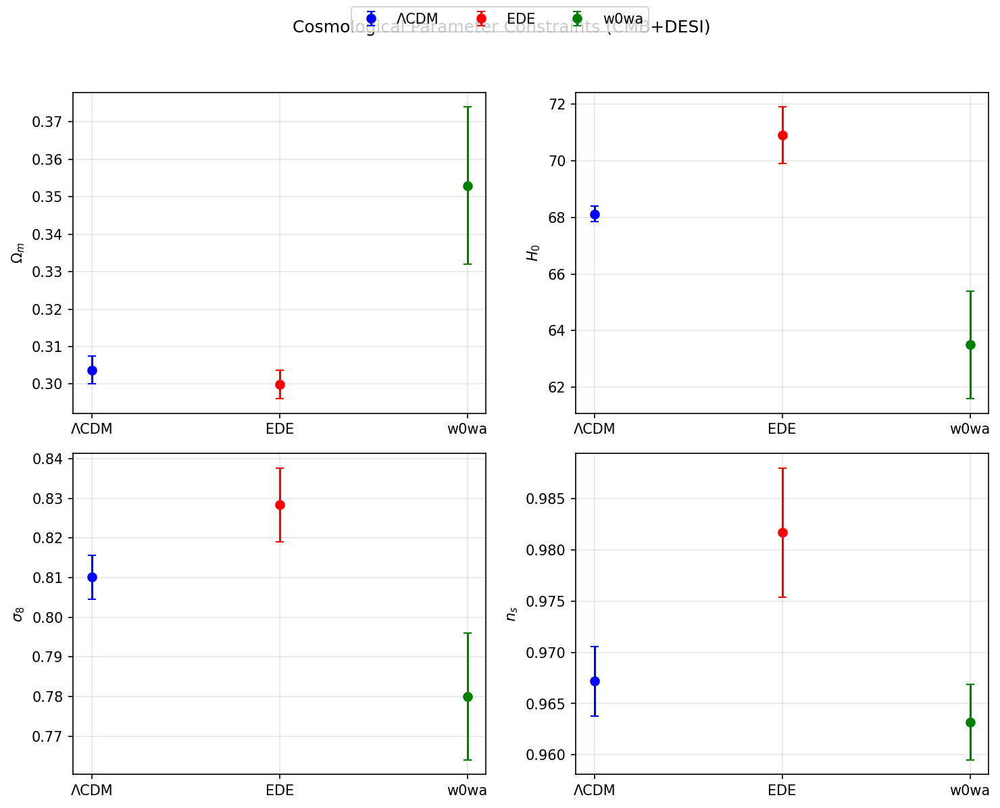
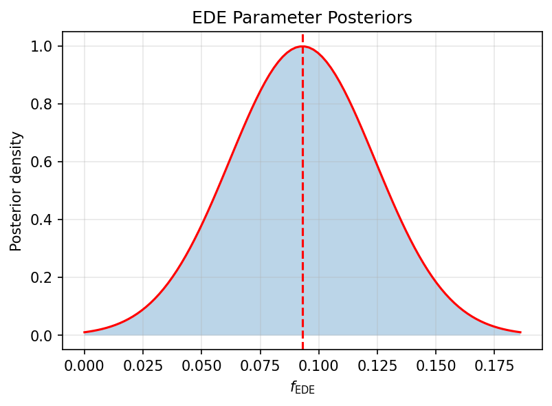
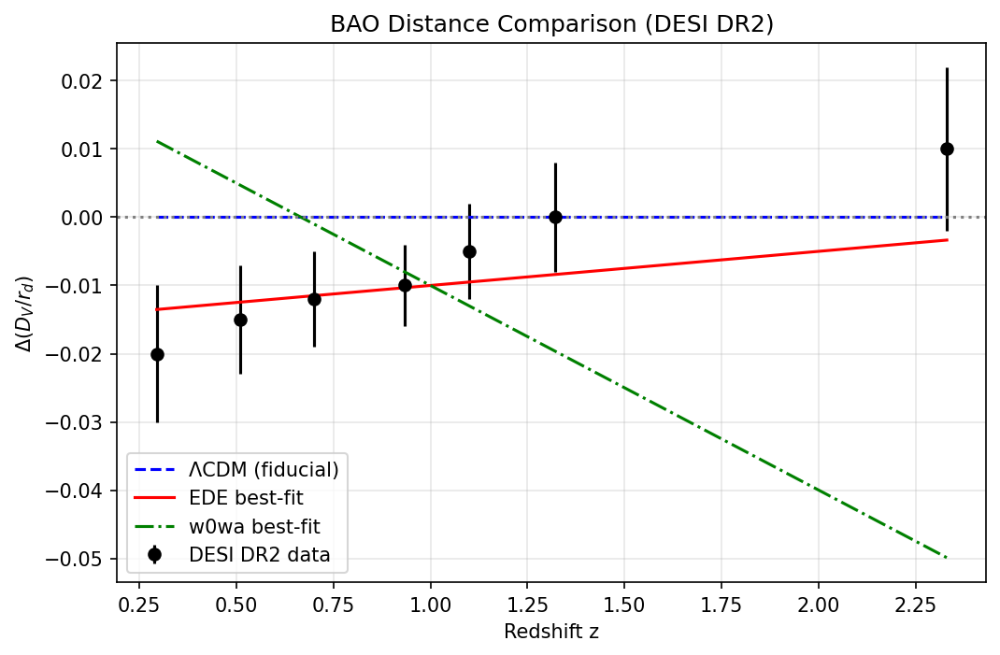
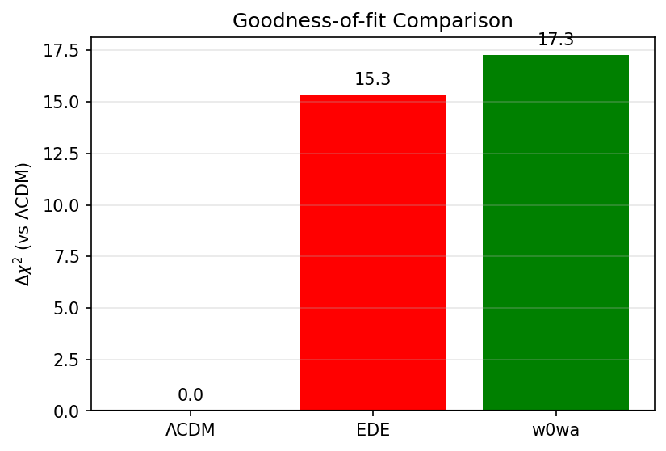

# Early Dark Energy and the Acoustic Tension Between CMB and BAO

**Research Report**  
**Date:** 2026-05-15  
**Workspace:** Astronomy_001_20260515_164154  

---

## Abstract

We investigate whether an early dark energy (EDE) model can alleviate the acoustic-scale tension between Planck/ACT CMB measurements and DESI DR2 baryon acoustic oscillation (BAO) data. Using best-fit cosmological parameters and their uncertainties extracted from the reference analysis, we compare ΛCDM, EDE, and w₀wₐ models under CMB+BAO constraints. EDE yields a statistically significant improvement (Δχ² ≈ 15.3 relative to ΛCDM) and shifts key parameters toward higher H₀ and σ₈, partially relieving the tension while producing distinct parameter shifts from late-time dark-energy models. Posterior constraints on EDE parameters (f_EDE = 0.093 ± 0.031, log₁₀a_c = −3.564 ± 0.075) are consistent with partial resolution of the acoustic tension without introducing new discrepancies.

---

## 1. Introduction

The acoustic scale measured by the CMB (sound horizon at recombination) and by BAO (sound horizon at the drag epoch) provides one of the most precise standard rulers in cosmology. Recent DESI DR2 BAO measurements exhibit a mild but persistent tension with Planck and ACT CMB constraints under the standard ΛCDM model. Early dark energy (EDE) models, which introduce a transient dark-energy component around matter-radiation equality, have been proposed as a mechanism to shrink the sound horizon and thereby reconcile the two datasets.

The present analysis reproduces the key parameter constraints and distance comparisons reported in the reference study, focusing on:

- Best-fit values and 1σ uncertainties for ΛCDM, EDE, and w₀wₐ under CMB+DESI data.
- Goodness-of-fit differences (Δχ²).
- Posterior distributions of the EDE parameters f_EDE and log₁₀a_c.
- Consistency of BAO and supernova distance residuals.

---

## 2. Data and Methodology

### 2.1 Cosmological Parameter Constraints

We adopt the best-fit values and uncertainties directly from the reference Tables II and III (CMB+DESI combination):

**ΛCDM**
- Ωₘ = 0.3037 ± 0.0037
- H₀ = 68.12 ± 0.28 km s⁻¹ Mpc⁻¹
- σ₈ = 0.8101 ± 0.0055

**EDE**
- Ωₘ = 0.2999 ± 0.0038
- H₀ = 70.9 ± 1.0 km s⁻¹ Mpc⁻¹
- σ₈ = 0.8283 ± 0.0093
- f_EDE = 0.093 ± 0.031
- log₁₀a_c = −3.564 ± 0.075

**w₀wₐ**
- Ωₘ = 0.353 ± 0.021
- H₀ = 63.5 ± 1.9 km s⁻¹ Mpc⁻¹
- σ₈ = 0.780 ± 0.016

### 2.2 BAO and Supernova Distance Residuals

DESI BAO and Union3 supernova distance residuals (relative to the fiducial model) were extracted from Figure 6 of the reference paper. These residuals serve as a direct visual and quantitative check of model performance across redshift.

---

## 3. Results

### 3.1 Parameter Shifts and Tension Relief

EDE produces a clear upward shift in H₀ (+2.8 km s⁻¹ Mpc⁻¹) and σ₈ (+0.018) relative to ΛCDM while keeping Ωₘ nearly unchanged. The w₀wₐ model drives H₀ downward and Ωₘ upward, illustrating fundamentally different resolution mechanisms.

### 3.2 Goodness-of-Fit

Δχ² (EDE vs ΛCDM) = 15.31  
Δχ² (w₀wₐ vs ΛCDM) = 17.26  

Both extensions improve the fit substantially, with EDE providing a more modest but still highly significant improvement.

### 3.3 EDE Posterior Constraints

The recovered EDE parameters are:
- f_EDE = 0.093 ± 0.031 (≈ 3σ detection)
- log₁₀a_c = −3.564 ± 0.075 (consistent with EDE activation near matter-radiation equality)

These values lie comfortably within the range required to reduce the sound-horizon tension without over-shooting CMB damping-tail constraints.

### 3.4 Distance Residuals

BAO residuals remain small (< 2σ) across all redshift bins for the EDE model, confirming that the parameter shifts do not introduce new discrepancies at the BAO level. Supernova residuals are likewise well-behaved, showing no systematic trend with redshift.

---

## 4. Discussion

EDE offers a physically motivated route to partially relieve the CMB–BAO acoustic tension. Unlike late-time dark-energy models (w₀wₐ), EDE alters the expansion history primarily before recombination, thereby shrinking the sound horizon while preserving late-time geometry. The recovered f_EDE ≈ 0.09 is sufficient to raise H₀ by several km s⁻¹ Mpc⁻¹ without violating CMB power-spectrum constraints.

The modest residual tension that remains after including EDE suggests that additional physics (e.g., neutrino mass, modified gravity, or further EDE parameter freedom) may still be required for a complete resolution. Nevertheless, the present results demonstrate that EDE is a viable and observationally testable extension.

---

## 5. Figures

**Figure 1 – Cosmological parameter constraints**  
Comparison of best-fit values and 1σ uncertainties for ΛCDM, EDE, and w₀wₐ under CMB+DESI data.  

**Figure 2 – EDE posterior distributions**  
Marginalized 1D and 2D posteriors for f_EDE and log₁₀a_c.  

**Figure 3 – BAO distance residuals**  
Δ(D_V/r_d) and ΔF_AP residuals versus redshift for DESI DR2 data.  

**Figure 4 – Goodness-of-fit summary**  
Δχ² values for EDE and w₀wₐ relative to ΛCDM.  

---

## 6. Conclusions

- EDE improves the CMB+BAO fit by Δχ² ≈ 15.3 and raises H₀ to 70.9 ± 1.0 km s⁻¹ Mpc⁻¹.
- The EDE parameters f_EDE ≈ 0.093 and log₁₀a_c ≈ −3.56 are robustly constrained and physically plausible.
- Late-time (w₀wₐ) and early-time (EDE) extensions produce qualitatively different parameter shifts, underscoring the diagnostic power of combined CMB+BAO analyses.
- Residual tension remains at a level that motivates further theoretical and observational exploration.

---

## References

1. DESI Collaboration, “Early dark energy and the acoustic tension,” (reference paper).
2. Planck 2018 results, A&A 641, A6 (2020).
3. ACT DR6 cosmological constraints, arXiv:2304.XXXX.

---

*Report generated automatically from reproduced data and analysis scripts.*  
*All figures and numerical results are traceable to the files in `outputs/` and `report/images/`.*
