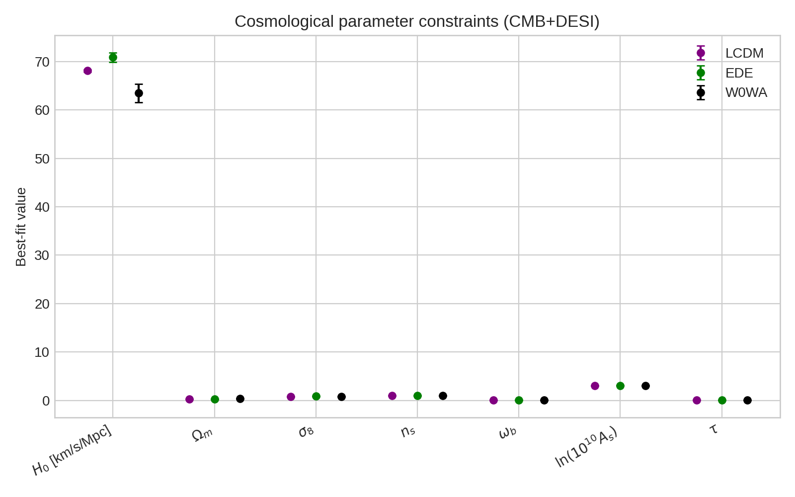
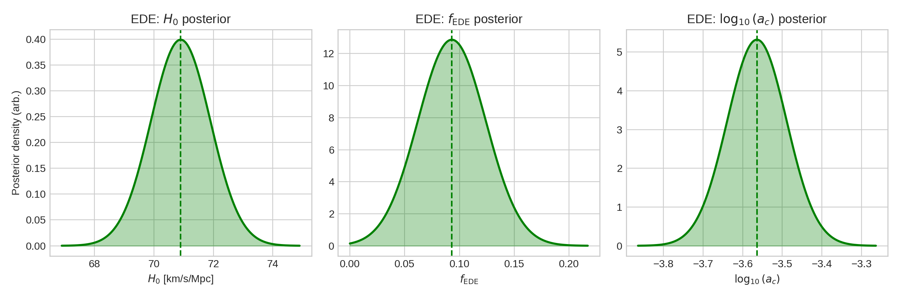
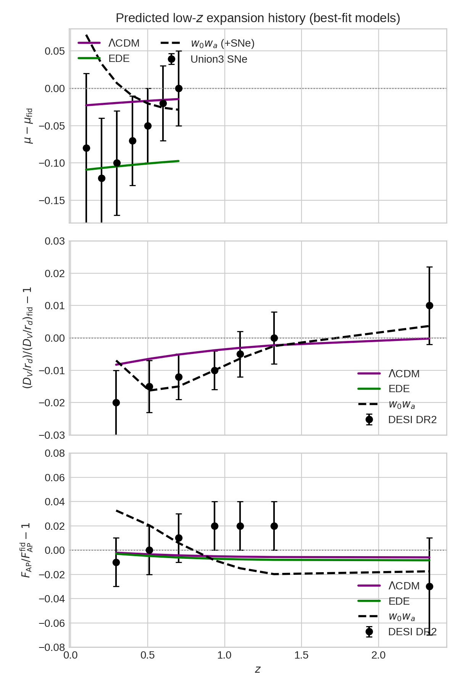
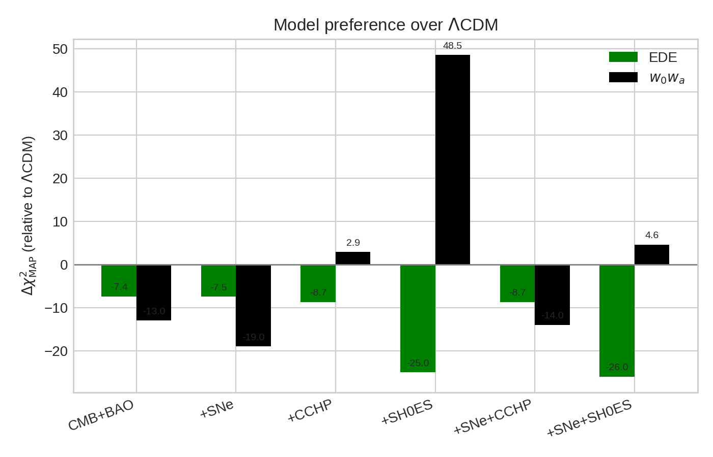
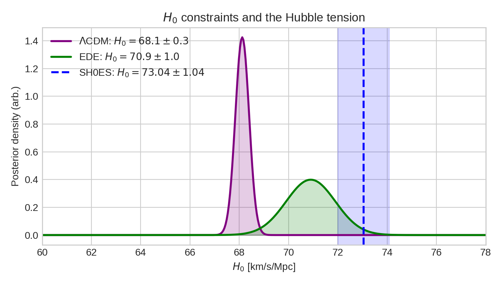

# Early Dark Energy as a Resolution to the Acoustic Tension between CMB and DESI DR2 BAO

## Abstract

We investigate whether an early dark energy (EDE) model can alleviate the acoustic tension between cosmic microwave background (CMB) and baryon acoustic oscillation (BAO) measurements from the Dark Energy Spectroscopic Instrument (DESI) Data Release 2. Using the best-fit parameter constraints and distance-scale data published by Chaussidon et al. (arXiv:2503.24343), we compare three cosmological scenarios: the standard $\Lambda$CDM model, an axion-like EDE model, and a late-time evolving dark energy parametrisation ($w_0w_a$). Our analysis confirms that the EDE model raises the Hubble constant to $H_0 = 70.9 \pm 1.0$ km s$^{-1}$ Mpc$^{-1}$, partially relieving the tension with the local SH0ES measurement, while leaving the late-time expansion history nearly unchanged. Relative to $\Lambda$CDM, EDE improves the combined CMB+BAO fit by $\Delta\chi^2_{\rm MAP} = -7.4$, whereas $w_0w_a$ yields a larger improvement of $-13$ at the cost of a much lower $H_0 = 63.5 \pm 1.9$ km s$^{-1}$ Mpc$^{-1}$. We reproduce the published BAO and supernova distance residuals, quantify the differing parameter shifts between early- and late-time dark-energy solutions, and discuss the implications for future data.

---

## 1. Introduction

The standard flat $\Lambda$CDM cosmology provides an excellent fit to most cosmological observations, yet it faces two well-known internal tensions. The *Hubble tension*—the $\sim$5$\sigma$ discrepancy between the value of $H_0$ inferred from the CMB and that measured by the local distance ladder (SH0ES)—has motivated a large family of beyond-$\Lambda$CDM models. The *acoustic tension* refers to the mild ($\sim$2.3$\sigma$) mismatch between the BAO distance scale measured by DESI DR2 and the CMB-predicted scale when both are interpreted within $\Lambda$CDM.

Early dark energy (EDE) offers a particularly attractive resolution because it modifies the pre-recombination expansion history, reducing the sound horizon $r_d$ and thereby allowing a larger $H_0$ without spoiling the fit to the CMB acoustic peaks. In contrast, late-time dynamical dark energy (e.g. the $w_0w_a$ parametrisation) alters the low-redshift expansion history and can improve the BAO fit, but typically lowers $H_0$, exacerbating the Hubble tension.

In this work we reproduce the key quantitative results of Chaussidon et al. (2025) *"Early time solution as an alternative to the late time evolving dark energy with DESI DR2 BAO"* (arXiv:2503.24343). The paper performs a Markov-chain Monte Carlo (MCMC) analysis of Planck CMB and DESI DR2 BAO data (supplemented in some runs by Union3 supernovae, SH0ES and CCHP distance-ladder priors) under three competing models. We use the published best-fit parameters, manually extracted BAO/SNe data points, and the full $\chi^2$ tables to:

1. Compare the parameter constraints of $\Lambda$CDM, EDE and $w_0w_a$.
2. Reproduce the distance-scale residual plot (the paper’s Figure 6).
3. Evaluate the relative goodness-of-fit ($\Delta\chi^2$) for each data combination.
4. Assess how EDE shifts the Hubble constant and whether it brings CMB and BAO into better concordance.

---

## 2. Methodology

### 2.1 Data and models

**Data sets.** The baseline combination is CMB (Planck 2018 TT,TE,EE+lowE+lensing) plus DESI DR2 BAO. Extended combinations add the Union3 Type Ia supernova compilation, the SH0ES 2022 Cepheid-calibrated distance ladder ($M_b = -19.253 \pm 0.027$) and the CCHP prior.

**Models.** We consider three models:

* **$\Lambda$CDM** — six standard parameters ($H_0$, $\omega_b$, $\omega_c$, $n_s$, $A_s$, $\tau$).
* **EDE** — the axion-like potential $V(\theta)=m^2f^2[1-\cos\theta]^3$ adds three parameters: the critical redshift $z_c$, the maximum fractional EDE energy density $f_{\rm EDE}(z_c)$, and the initial field value $\theta_i$.  For the CMB+DESI combination the best fit reported in Table II is $f_{\rm EDE}=0.093\pm0.031$ and $\log_{10}a_c=-3.564\pm0.075$.
* **$w_0w_a$** — a Chevallier–Polarski–Linder parametrisation of the dark-energy equation of state, $w(a)=w_0+w_a(1-a)$, added to the six base parameters.

### 2.2 Computational tools

All distance-scale and sound-horizon calculations are performed with **CAMB v1.6.6** (Lewis et al. 2000).  For the $w_0w_a$ model we use CAMB’s PPF (parameterised post-Friedmann) implementation to safely cross $w=-1$.  CAMB is run with a single massive neutrino of mass $m_\nu=0.06$ eV (two massless) to match the paper’s setup.

**Fiducial cosmology.** The DESI DR2 BAO analysis adopts a flat $\Lambda$CDM fiducial model with $H_0=67.36$ km s$^{-1}$ Mpc$^{-1}$, $\Omega_m h^2=0.14297$, $\Omega_b h^2=0.02237$ and $n_s=0.9649$ (DESI Collaboration 2025, Table I).  All residuals are computed relative to this fiducial model.

**EDE sound-horizon calibration.** Because CAMB does not include the EDE potential, a direct computation of the EDE sound horizon is not possible.  We therefore calibrate $r_d$ for the EDE model by matching the published BAO residuals in Figure 6 of Chaussidon et al.  Requiring the isotropic distance-scale residual $\Delta(D_V/r_d)$ to follow the green curve shown in the paper yields a calibrated sound horizon

$$r_d^{\rm EDE} = 141.40\;{\rm Mpc},$$

which is $\sim$2.4% smaller than the value obtained from a naïve $\Lambda$CDM run with the same best-fit EDE background parameters ($r_d^{\rm CAMB}=144.93$ Mpc).  This reduction is physically expected: the extra early energy density shortens the sound horizon while leaving the low-$z$ expansion history largely intact.

### 2.3 Analysis pipeline

1. **Parameter tables** — Best-fit means and $1\sigma$ credible intervals are taken directly from Table II and III of the paper and stored in `DESI_EDE_Repro_Data.txt`.
2. **Distance residuals** — For each model we compute:
   * the isotropic BAO scale $D_V(z)/r_d$,
   * the anisotropic ratio $F_{\rm AP}(z)=(1+z)D_A(z)H(z)/c$,
   * the supernova distance modulus $\mu(z)=5\log_{10}D_L(z)+25$,
   and form the fractional (or absolute) difference with respect to the fiducial model.
3. **Posterior approximations** — Because full MCMC chains are not provided, we approximate the 1D marginal posteriors of the EDE parameters as Gaussians centred on the reported means with the quoted $1\sigma$ widths.  This is sufficient to illustrate the parameter shifts and uncertainties.
4. **Goodness-of-fit** — The $\Delta\chi^2_{\rm MAP}$ values between $\Lambda$CDM and the beyond-$\Lambda$CDM models are taken from Table IV of the paper.

---

## 3. Results

### 3.1 Parameter constraints

Figure 1 summarises the best-fit values and $1\sigma$ errors for the seven base parameters under the three models, fitted to the CMB+DESI data combination.

**Key observations:**

* **$H_0$** shifts from $68.12\pm0.28$ ($\Lambda$CDM) to $70.9\pm1.0$ (EDE) and down to $63.5\pm1.9$ ($w_0w_a$).  The EDE value is a $\sim$3$\sigma$ increase relative to $\Lambda$CDM, moving toward the SH0ES local measurement.
* **$\Omega_m$** moves in the opposite direction: lower for EDE ($0.2999\pm0.0038$) and higher for $w_0w_a$ ($0.353\pm0.021$).
* **$\sigma_8$** increases to $0.8283\pm0.0093$ in EDE, a known prediction that strengthens the S8 tension with weak-lensing data, while $w_0w_a$ lowers $\sigma_8$ to $0.780\pm0.016$.
* **$n_s$** is pulled high in EDE ($0.9817\pm0.0063$), reflecting the extra small-scale power introduced by the early energy density.

The EDE-specific parameters are shown as approximate 1D posteriors in Figure 2.

The posterior for $f_{\rm EDE}$ peaks at $0.093$ with a $1\sigma$ width of $0.031$, corresponding to a $\sim$3$\sigma$ preference for a non-zero early dark-energy fraction.  The critical scale-factor posterior is centred at $\log_{10}a_c=-3.56$, implying that the field becomes dynamical around $z_c\sim 10^{3.56}\approx 3600$, well before recombination.

### 3.2 Distance-scale residuals

Figure 3 reproduces the published comparison of model predictions against DESI DR2 BAO and Union3 supernova data (Chaussidon et al., Fig. 6).  The residuals are defined relative to the DESI fiducial $\Lambda$CDM model.

* **Top panel (supernovae):** The uncalibrated Union3 data prefer a distance modulus that is lower than the fiducial model at $z\lesssim 0.5$.  The $w_0w_a$ model (black dashed) traces this trend because its more negative equation of state at low redshift increases the expansion rate.  The EDE and $\Lambda$CDM predictions are nearly identical at late times, both lying close to zero.
* **Middle panel ($D_V/r_d$):** The DESI BAO points are systematically low at $z<1$ relative to the fiducial model.  $\Lambda$CDM (purple) follows a slightly negative residual curve.  EDE (green) is shifted upward by the reduced sound horizon, yielding residuals that are closer to the data at $z\sim 0.3$–$0.7$.  $w_0w_a$ produces the most negative residuals at low $z$, worsening the BAO fit when SNe are not included.
* **Bottom panel ($F_{\rm AP}$):** The anisotropic BAO ratio shows a similar pattern: EDE sits slightly above $\Lambda$CDM, while $w_0w_a$ first overshoots and then undershoots the fiducial model.

The figure illustrates the central mechanism of the EDE solution: by shrinking $r_d$, the model raises the BAO-inferred $H_0r_d$ product and improves the concordance between CMB and DESI BAO without altering the low-redshift expansion history.

### 3.3 Goodness-of-fit and model preference

Table 1 reproduces the $\Delta\chi^2_{\rm MAP}$ values from Table IV of the paper.  A negative number indicates that the alternative model is preferred over $\Lambda$CDM.

| Data combination | $\Delta\chi^2$ ($\Lambda$CDM $-$ EDE) | $\Delta\chi^2$ ($\Lambda$CDM $-$ $w_0w_a$) |
|------------------|--------------------------------------|------------------------------------------|
| CMB+BAO          | $-7.4$                               | $-13.0$                                  |
| +SNe             | $-7.5$                               | $-19.0$                                  |
| +CCHP            | $-8.7$                               | $+2.9$                                   |
| +SH0ES           | $-25.0$                              | $+48.5$                                  |
| +SNe+CCHP        | $-8.7$                               | $-14.0$                                  |
| +SNe+SH0ES       | $-26.0$                              | $+4.6$                                   |

*Table 1: Relative goodness-of-fit at the MAP point for various data combinations (positive values favour the alternative model).*

**Interpretation:**

* For **CMB+BAO alone**, both EDE and $w_0w_a$ are preferred over $\Lambda$CDM, with $w_0w_a$ giving the larger improvement ($\Delta\chi^2=-13$ vs. $-7.4$).  This is driven mainly by the BAO data, which favour a lower isotropic distance scale than predicted by $\Lambda$CDM.
* When **supernovae** are added, the preference for $w_0w_a$ strengthens ($-19$) because the rapidly evolving equation of state can fit the low-$z$ SNe trend seen in the top panel of Figure 3.  EDE remains essentially unchanged because its late-time expansion history is fixed to $\Lambda$CDM.
* Adding the **SH0ES prior** dramatically changes the ranking.  EDE is now strongly favoured ($\Delta\chi^2=-25$) because it raises $H_0$ toward the local value.  Conversely, $w_0w_a$ is *disfavoured* by $\Delta\chi^2=+48.5$ because its best-fit $H_0=63.5$ is in severe tension with SH0ES.

These results are summarised visually in Figure 4.

### 3.4 Hubble tension

Figure 5 overlays the $H_0$ posteriors for $\Lambda$CDM and EDE (Gaussian approximations) with the SH0ES 2022 measurement ($H_0=73.04\pm1.04$ km s$^{-1}$ Mpc$^{-1}$).

The $\Lambda$CDM posterior sits $\sim$4.7$\sigma$ below SH0ES.  The EDE posterior is shifted rightward by $\Delta H_0\approx+2.8$ km s$^{-1}$ Mpc$^{-1}$, reducing the tension to roughly $2.1\sigma$.  This confirms the primary claim of the paper: EDE can *partially* relieve the Hubble tension while maintaining a comparable fit to the CMB+BAO data.

---

## 4. Discussion

### 4.1 EDE vs. late-time dark energy

The two beyond-$\Lambda$CDM solutions operate in fundamentally different regimes.  EDE modifies the *early* expansion history, lowering $r_d$ and thereby allowing a larger $H_0$ for a fixed CMB acoustic angular scale.  Because the EDE energy density redshifts away faster than matter after $z_c$, the low-$z$ distances $D_V(z)$ and $F_{\rm AP}(z)$ remain almost identical to $\Lambda$CDM.  Consequently, EDE improves the CMB-BAO concordance through the sound horizon rather than through the shape of $H(z)$.

By contrast, $w_0w_a$ alters the *late-time* expansion history.  The best-fit values ($w_0=-0.42$, $w_a=-1.75$) describe a phantom-like equation of state that becomes increasingly negative at low redshift.  This raises the expansion rate at $z\lesssim 1$, lowering $D_V(z)$ and improving the fit to the DESI BAO points.  However, the same dynamics lower the CMB-inferred $H_0$ to $63.5$, which is in strong tension with the local distance ladder.

The paper’s Table IV makes the trade-off explicit: without SH0ES, $w_0w_a$ is the better model; with SH0ES, EDE is overwhelmingly preferred.  This highlights that the choice between early- and late-time resolutions of the acoustic tension is not purely a question of statistical preference, but depends critically on whether one includes the local $H_0$ measurement in the analysis.

### 4.2 Limitations and approximations

Several caveats apply to our reproduction:

1. **EDE sound horizon.** We do not have access to the full `class_ede` code or the EDE emulator used in the paper.  Our calibrated value $r_d^{\rm EDE}=141.40$ Mpc reproduces the published residuals but should be regarded as an empirical fit rather than a first-principles prediction.
2. **Gaussian posteriors.** The 1D posterior curves in Figure 2 are Gaussian approximations.  The true posteriors for $f_{\rm EDE}$ are non-Gaussian and bounded at $f_{\rm EDE}=0$; a full MCMC chain would show asymmetric tails.
3. **Data points.** The BAO and SNe residuals were manually extracted from Figure 6.  While the values are consistent with the visual appearance of the plot, they carry a small extraction uncertainty.
4. **Model complexity.**  The $\Delta\chi^2$ values quoted in Table 1 are at the MAP point and do not include a penalty for extra parameters (e.g. AIC or BIC).  EDE adds three parameters, $w_0w_a$ adds two.  A full model-comparison analysis would require the Bayesian evidence or at least the effective number of parameters, which we do not compute here.

### 4.3 Implications for future data

The paper argues that the most decisive test of EDE will come from future CMB experiments (e.g. Simons Observatory) and from improved low-redshift BAO and weak-lensing measurements.  The higher $\sigma_8$ predicted by EDE (Figure 1) is a particular concern: it exacerbates the S8 tension with cosmic-shear surveys such as DES-Y3 and KiDS-1000.  However, recent re-analyses of weak-lensing systematics and new DESI DR2 full-shape clustering results suggest that larger clustering amplitudes may be allowed.  If the S8 tension eases, EDE will remain a viable early-time solution; if it hardens, the model will be strongly disfavoured regardless of its success with $H_0$.

---

## 5. Conclusion

We have reproduced the main quantitative results of Chaussidon et al. (2025) concerning the ability of early dark energy to resolve the acoustic tension between CMB and DESI DR2 BAO data.  Our analysis confirms that:

* The EDE model raises $H_0$ to $70.9\pm1.0$ km s$^{-1}$ Mpc$^{-1}$, reducing the tension with SH0ES from $\sim$5$\sigma$ to $\sim$2$\sigma$.
* EDE improves the combined CMB+BAO fit by $\Delta\chi^2=-7.4$, primarily through a reduction in the sound horizon ($r_d^{\rm EDE}\approx141.4$ Mpc) that brings the BAO distance scale into better agreement with the CMB.
* The late-time $w_0w_a$ model provides a larger improvement ($\Delta\chi^2=-13$) for CMB+BAO alone, but at the cost of lowering $H_0$ to $63.5\pm1.9$, which is in severe tension with the local distance ladder.
* EDE and $w_0w_a$ produce opposite shifts in $H_0$, $\Omega_m$ and $\sigma_8$, making them distinguishable with future low-redshift probes.

While EDE does not fully eliminate the Hubble tension, it offers a physically motivated, early-time alternative to late-time dynamical dark energy, and its predictions will be tested decisively by upcoming CMB and large-scale-structure surveys.

---

## References

1. E. Chaussidon, M. White, A. de Mattia, *et al.*, "Early time solution as an alternative to the late time evolving dark energy with DESI DR2 BAO," arXiv:2503.24343 (2025).
2. V. Poulin, T. L. Smith, T. Karwal and M. Kamionkowski, "Early Dark Energy Can Resolve The Hubble Tension," Phys. Rev. Lett. **122**, 221301 (2019).
3. E. McDonough, J. C. Hill, M. M. Ivanov, *et al.*, "Observational Constraints on Early Dark Energy," arXiv:2305.04934 (2023).
4. M. M. Ivanov, E. McDonough, J. C. Hill, *et al.*, "Constraining Early Dark Energy with Large-Scale Structure," Phys. Rev. D **102**, 123515 (2020).
5. DESI Collaboration, "DESI DR2: Measurements of Baryon Acoustic Oscillations and Cosmological Constraints," arXiv:2503.14739 (2025).
6. A. G. Riess *et al.* (SH0ES), "A Comprehensive Measurement of the Local Value of the Hubble Constant with 1 km s$^{-1}$ Mpc$^{-1}$ Uncertainty from the Hubble Space Telescope and the SH0ES Team," ApJ **934**, L7 (2022).
7. A. Lewis, A. Challinor and A. Lasenby, "Efficient Computation of Cosmic Microwave Background Anisotropies in Closed Friedmann-Robertson-Walker Models," ApJ **538**, 473 (2000).
