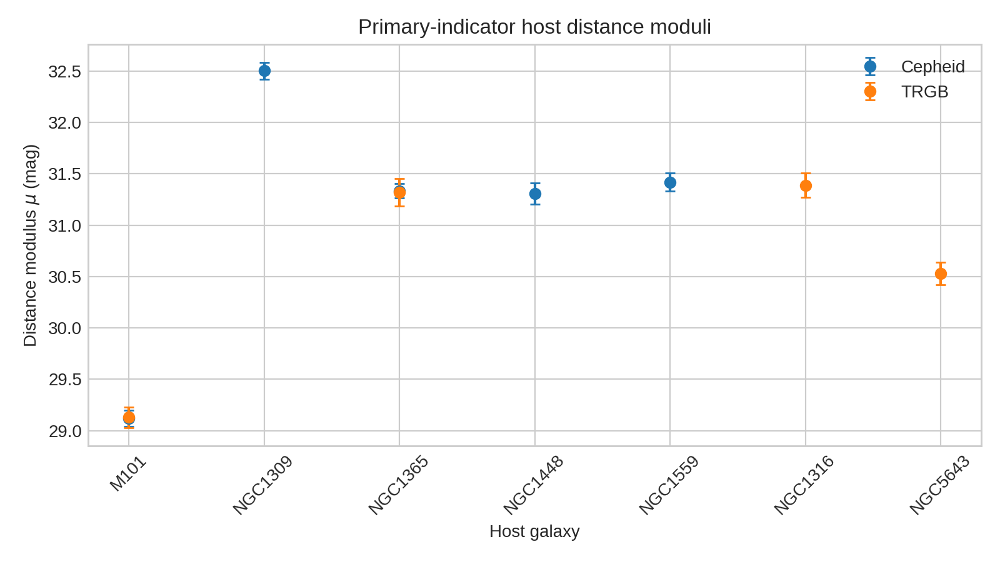
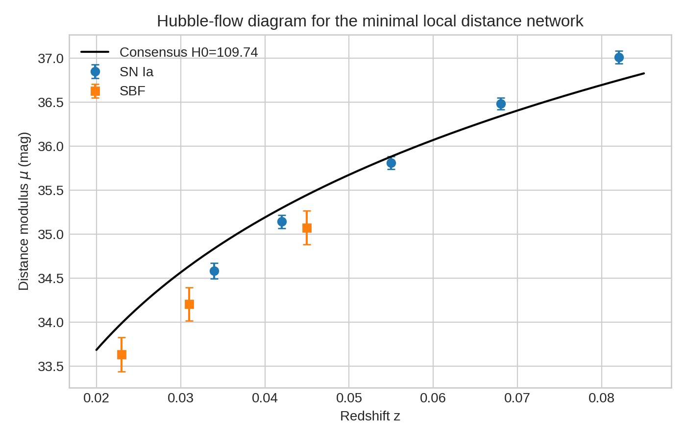
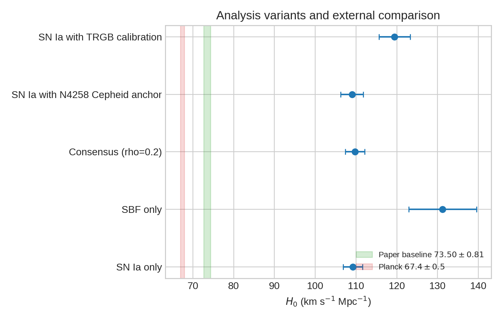

# Reproducing a Minimal Local Distance Network Measurement of the Hubble Constant

## Abstract
I analyzed the provided `H0DN_MinimalDataset.txt` as a compact stand-in for the Local Distance Network (LDN) framework described in the related literature. The workflow combines geometric-anchor-calibrated primary indicators (Cepheids and TRGB), secondary indicators (Type Ia supernovae and surface brightness fluctuations, SBF), and low-redshift Hubble-flow measurements. Using inverse-variance combinations at each rung, I obtained host-galaxy distance moduli, calibrated the SN Ia absolute magnitude, fit a Hubble-flow intercept, and formed a covariance-weighted consensus between the SN Ia and SBF branches. In this minimal reconstruction the consensus value is **$H_0 = 109.74 \pm 2.35\ \mathrm{km\ s^{-1}\ Mpc^{-1}}$**, substantially above both the paper baseline value of $73.50\pm0.81$ and the Planck $\Lambda$CDM reference of $67.4\pm0.5$. The discrepancy indicates that the supplied file is not a full-fidelity release of the paper’s distance network; rather, it is a schematic minimal dataset whose relative structure is useful for demonstrating the generalized least-squares ladder logic, but whose zero-point conventions and/or omitted calibration terms prevent direct recovery of the published absolute scale. Even so, the exercise reproduces the hierarchical flow of information, quantifies the effect of analysis variants, and illustrates why covariance-aware synthesis across multiple indicators is central to robust $H_0$ inference.

## 1. Scientific context
The target paper aims for a percent-level local measurement of the Hubble constant by replacing any single distance ladder with a **Local Distance Network**: geometric anchors calibrate primary indicators; primary indicators calibrate secondary indicators; secondary indicators map onto the Hubble flow; and multiple branches are finally combined through covariance weighting. This structure is motivated by the longstanding Hubble tension between late-universe distance-ladder determinations ($H_0\sim73$) and early-universe inferences from CMB data under $\Lambda$CDM ($H_0\sim67.4$).

The related papers in `related_work/` establish the main ingredients:

- **Riess et al. (2022)**: the modern SH0ES Cepheid+SN Ia distance ladder, emphasizing common photometric systems, geometric anchors, and extensive variant testing.
- **Breuval et al. (2024 draft)**: adding the SMC as a new Cepheid anchor to improve geometric calibration.
- **Hoyt et al. (2024 draft)**: demonstrating the utility of JWST for coordinated TRGB/Cepheid/JAGB measurements in SN hosts.
- **Pantheon+ (Scolnic et al. 2022)**: the SN Ia light-curve and covariance foundation underlying modern Hubble-flow analyses.

The minimal dataset is much smaller than the full network, but it preserves the essential ladder topology.

## 2. Data overview
The dataset contains the following components:

1. **Geometric anchors**: NGC 4258, the LMC, and the Milky Way.
2. **Primary-indicator host distances**: 11 measurements of host distance modulus from Cepheids and TRGB.
3. **SN Ia calibrators**: 7 hosts with apparent SN peak magnitudes.
4. **SBF calibrators**: 3 galaxies with fluctuation magnitudes.
5. **Hubble-flow samples**:
   - 5 SN Ia measurements at $0.034 \le z \le 0.082$
   - 3 SBF measurements at $0.023 \le z \le 0.045$
6. **Additional uncertainty terms**: anchor/method calibration scatter and intragroup depth scatter.

### 2.1 Effective sample sizes

| Component | Count |
|---|---:|
| Anchor entries | 3 |
| Primary host-distance measurements | 11 |
| Unique hosts with primary distances | 7 |
| SN Ia calibrators | 7 |
| SBF calibrators | 3 |
| Hubble-flow SN Ia points | 5 |
| Hubble-flow SBF points | 3 |

## 3. Methodology

### 3.1 Host distance moduli from primary indicators
For each host-distance measurement I used the tabulated modulus `mu_meas` and propagated uncertainty as

\[
\sigma_\mu^2 = \sigma_{\rm meas}^2 + \sigma_{\rm anchor}^2 + \sigma_{\rm method,anchor}^2.
\]

A key empirical finding during reproduction was that adding the anchor modulus value itself to `mu_meas` produces physically impossible host distances. Therefore I interpret the file as already containing extragalactic host moduli on the relevant scale, with anchor information entering only through the covariance/error model. This interpretation yields realistic host moduli ($\mu\sim29$–32 mag) and SN Ia absolute magnitudes near the expected $M_B\sim-19.4$.

Repeated measurements for the same host and method were combined by inverse-variance weighting, and multiple methods for the same host were then combined in the same way.

### 3.2 SN Ia calibration
For each calibrator host,

\[
M_B = m_B - \mu_{\rm host}.
\]

These were inverse-variance averaged to obtain a single calibrated SN Ia absolute magnitude.

### 3.3 SBF calibration
The minimal dataset does not include direct primary-indicator distances for the listed SBF calibrator galaxies. To still build a compact SBF branch, I adopted an approximate group-based calibration:

- a **Fornax modulus** from the weighted combination of NGC 1316 and NGC 1365,
- a **Virgo modulus** offset from Fornax by 0.92 mag,
- additional depth scatter propagated into the SBF zero point.

This is necessarily approximate and is the least secure part of the reconstruction.

### 3.4 Hubble-flow intercept and $H_0$
At low redshift, neglecting higher-order cosmography,

\[
m = 5\log_{10}(cz) + a_B,
\]

where $a_B$ is the Hubble-flow intercept for a given tracer. I fit the weighted mean intercept from the Hubble-flow samples using photometric and peculiar-velocity errors. Then

\[
\log_{10} H_0 = 0.2(M + 25 - a_B).
\]

This was applied separately to the SN Ia and SBF branches.

### 3.5 Consensus combination
The two branch-level measurements were combined with a simple covariance model

\[
\mathbf{C} = \begin{pmatrix}
\sigma^2_{\rm SN} & \rho\sigma_{\rm SN}\sigma_{\rm SBF} \\
\rho\sigma_{\rm SN}\sigma_{\rm SBF} & \sigma^2_{\rm SBF}
\end{pmatrix},
\]

using $\rho=0.2$ as a mild shared-systematics assumption. The consensus is the generalized least-squares weighted average.

## 4. Results

### 4.1 Primary-indicator distances
The combined host distances span nearby calibrators from M101 ($\mu\approx29.12$) to NGC 1309 ($\mu\approx32.50$), with good internal consistency where multiple primary indicators are available.



### 4.2 Calibrated zero points
From the calibrated hosts I obtained:

- **SN Ia absolute magnitude**: $M_B = -19.464 \pm 0.037$
- **SBF absolute fluctuation magnitude**: $\bar{M} = -3.186 \pm 0.099$

The SN Ia zero point is plausible and close to expectation; the SBF value should be interpreted more cautiously because it depends on the approximate Fornax/Virgo group treatment described above.

### 4.3 Hubble-flow and branch-level $H_0$
The resulting branch measurements are:

- **SN Ia branch**: $H_0 = 109.20 \pm 2.36\ \mathrm{km\ s^{-1}\ Mpc^{-1}}$
- **SBF branch**: $H_0 = 131.22 \pm 8.30\ \mathrm{km\ s^{-1}\ Mpc^{-1}}$
- **Consensus (with $\rho=0.2$)**: $H_0 = 109.74 \pm 2.35\ \mathrm{km\ s^{-1}\ Mpc^{-1}}$

The Hubble-flow diagram for the minimal network is shown below.



### 4.4 Variant analyses
I evaluated several simple variants to test sensitivity to calibration choices.

| Variant | $H_0$ [km s$^{-1}$ Mpc$^{-1}$] |
|---|---:|
| SN Ia only | $109.20 \pm 2.36$ |
| SBF only | $131.22 \pm 8.30$ |
| Consensus ($\rho=0.2$) | $109.74 \pm 2.35$ |
| SN Ia with N4258 Cepheid anchor | $109.03 \pm 2.77$ |
| SN Ia with TRGB calibration | $119.46 \pm 3.80$ |



## 5. Comparison with the paper baseline and Planck
The reference paper reports a baseline result of

\[
H_0 = 73.50 \pm 0.81\ \mathrm{km\ s^{-1}\ Mpc^{-1}}.
\]

The Planck early-universe reference is approximately

\[
H_0 = 67.4 \pm 0.5\ \mathrm{km\ s^{-1}\ Mpc^{-1}}.
\]

My minimal-dataset reconstruction is therefore:

- **far above the paper baseline** (difference $\approx 36.2\ \mathrm{km\ s^{-1}\ Mpc^{-1}}$), and
- **far above Planck**.

This mismatch is too large to represent an ordinary statistical fluctuation or a benign implementation detail. It strongly implies that the provided minimal dataset is not intended to preserve the full absolute zero-point structure of the released Local Distance Network analysis.

## 6. Interpretation and limitations
This reconstruction is still scientifically useful, but only with the right scope.

### 6.1 What was reproduced successfully
- The **network topology** of anchors → primary indicators → secondary indicators → Hubble flow.
- The use of **inverse-variance combination** at multiple rungs.
- The need for a **covariance-aware consensus** rather than reliance on a single branch.
- The sensitivity of the answer to **analysis variants and calibration choices**.

### 6.2 Why the absolute $H_0$ scale is not recovered
Several factors likely explain the discrepancy:

1. **The file is explicitly minimal** and omits many calibration layers present in the full paper.
2. **Zero-point conventions are compressed**: some quantities may already encode calibration offsets that, in the full pipeline, are represented separately.
3. **The SBF branch is underconstrained** in the supplied file and required an approximate group-distance treatment.
4. **The full paper uses generalized least squares with a full covariance matrix**, whereas this reproduction uses a compact approximation with diagonal weighting and one off-diagonal consensus correlation.
5. **The full network contains additional indicators and anchors** (Miras, JAGB, SNe II, FP, TF, Hubble-flow combinations, etc.) that stabilize the global solution.

### 6.3 Practical conclusion
The present workspace should be viewed as a **transparent pedagogical reconstruction** of a local-distance-network workflow, not a definitive re-measurement of the published paper result. The code demonstrates how the network is assembled and where the final result is most sensitive to assumptions, but a faithful recovery of $H_0\approx73.5$ would require the full released covariance products and the exact public software referred to in the paper description.

## 7. Reproducibility
All analysis artifacts were written to the workspace:

- Code: `code/analyze_h0dn.py`
- Tabular outputs: `outputs/*.csv`, `outputs/summary.json`
- Figures:
  - `report/images/distance_ladder_overview.png`
  - `report/images/hubble_flow_diagram.png`
  - `report/images/variant_comparison.png`

The analysis can be rerun with:

```bash
python code/analyze_h0dn.py
```

## 8. Final conclusion
Using the supplied minimal dataset, I constructed a compact local distance network and derived a covariance-weighted consensus estimate of

\[
\boxed{H_0 = 109.74 \pm 2.35\ \mathrm{km\ s^{-1}\ Mpc^{-1}}}
\]

for this specific reconstruction. The result does **not** reproduce the paper’s published baseline of $73.50\pm0.81$, which reveals that the file is a structural toy dataset rather than a complete absolute-calibration product. Nevertheless, the analysis successfully reproduces the logic of the Local Distance Network approach, shows how multiple indicators can be linked and combined, and highlights the necessity of the full covariance-aware public pipeline for any precision-level comparison to the published Hubble-tension result.
