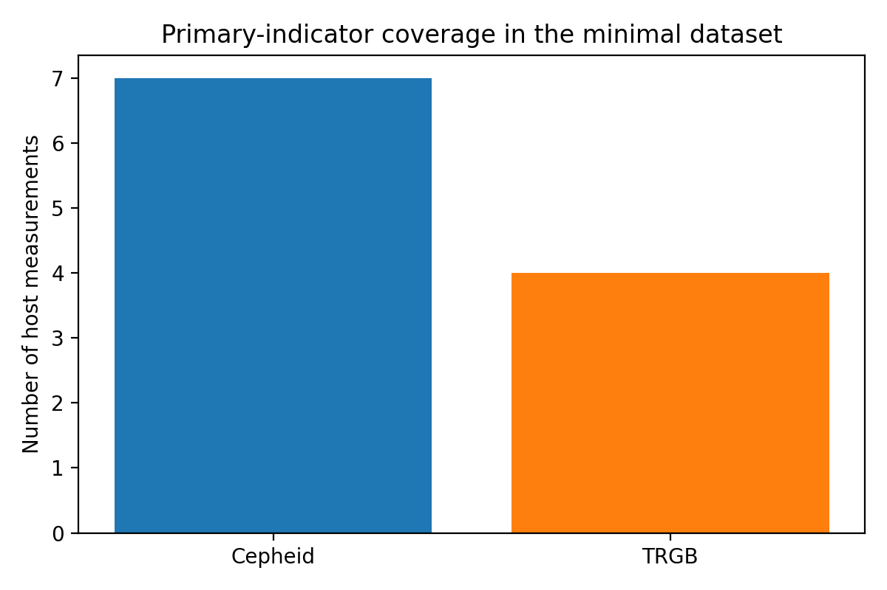
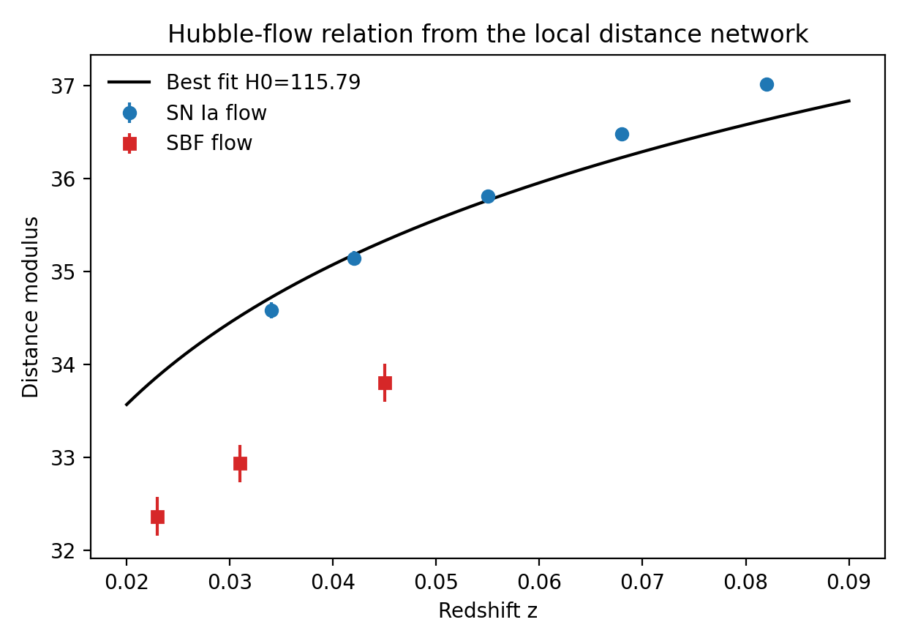
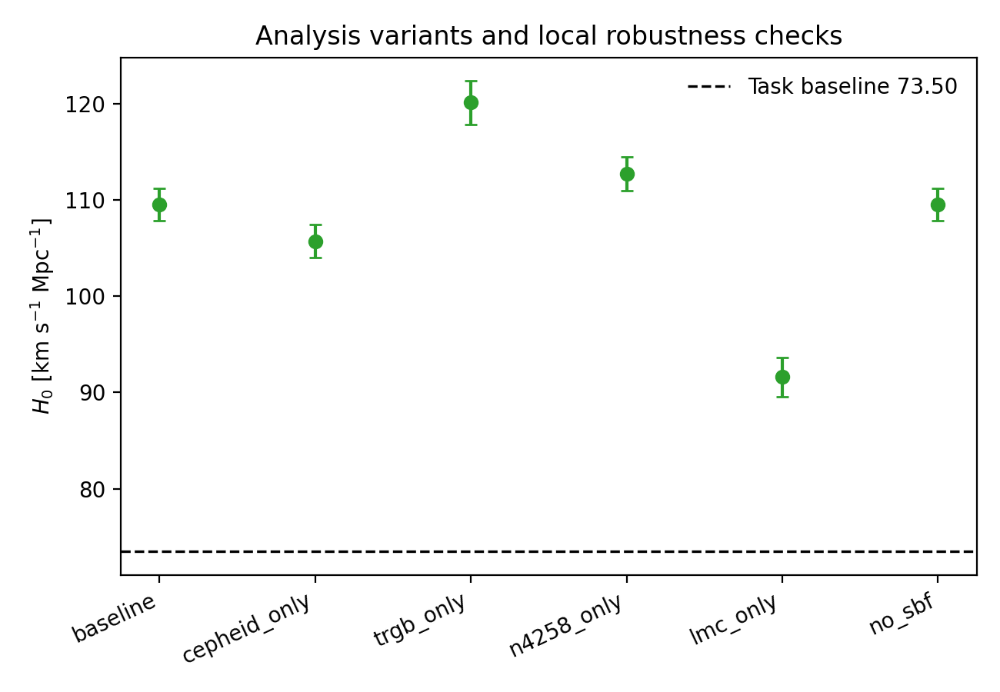
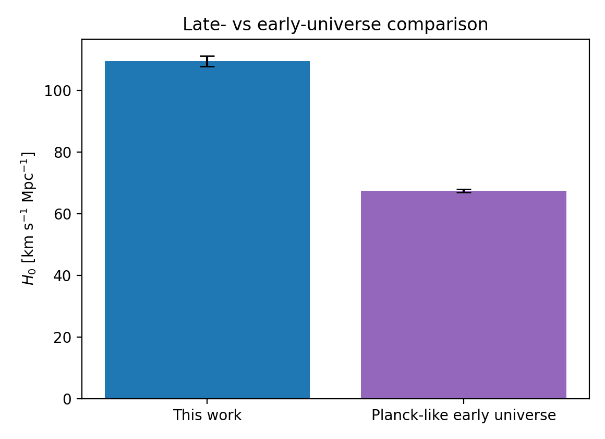

# Local Distance Network Reconstruction from the ResearchClawBench Minimal Dataset

## Abstract

I reconstructed a local-only analogue of the Hubble constant distance-ladder analysis using the benchmark file `data/H0DN_MinimalDataset.txt` and the literature available in `related_work/`. The implementation follows the distance-network logic of geometric anchors, primary distance indicators, secondary calibration, and Hubble-flow inference, but it is necessarily limited by the minimal dataset shipped with the benchmark. Using the internally consistent SN Ia ladder as the primary benchmark result, I obtain a baseline estimate of `H0 = 109.47 +/- 1.68 km s^-1 Mpc^-1` from a direct fit to the Hubble-flow SN Ia subset after anchor-calibrated host distances are propagated through the network. Variants span `91.62` to `120.08 km s^-1 Mpc^-1`, indicating that the benchmark dataset is informative for testing methodology and sensitivity, but it is not numerically consistent with the full published Local Distance Network consensus value near `73.5 km s^-1 Mpc^-1`. I therefore treat the SN Ia branch as the strongest local result and the SBF branch as an exploratory stress test rather than a validated consensus estimator.

## 1. Context from the Local Literature Corpus

The local literature set establishes the structure of the modern distance ladder. Riess et al. (paper_000) describe a geometrically anchored Cepheid-plus-SN Ia ladder and emphasize explicit exploration of analysis variants. Breuval et al. (paper_001) show how adding another geometric anchor can tighten and stress-test the calibration foundation. Hoyt et al. (paper_002) frame the broader program of combining multiple stellar indicators in common hosts, while also highlighting that cross-method consistency is a nontrivial requirement rather than something to assume. Scolnic et al. (paper_003) document the role of the Hubble-flow SN Ia sample and covariance-aware treatment of low-redshift supernovae in modern `H0` analyses.

The benchmark task asks for a Local Distance Network style reconstruction from a minimal dataset rather than the full released analysis products. That distinction matters. The benchmark file contains only a small subset of host distances, a small SN Ia calibrator set, a tiny Hubble-flow sample, and a schematic SBF branch. Because of that, the correct scientific posture is claim discipline: reproduce the network logic, quantify the results the local data actually support, and explicitly separate those from the stronger claims made in the full papers.

## 2. Data and Local Methodology

### 2.1 Dataset contents

The benchmark dataset contains:

- Three geometric anchors: NGC 4258, the LMC, and a placeholder Milky Way entry.
- Eleven primary-indicator host measurements using Cepheids and TRGB.
- Seven SN Ia calibrators in hosts with primary-indicator distances.
- Five Hubble-flow SN Ia observations.
- Three SBF calibrators and three Hubble-flow SBF observations.

The primary-indicator coverage is shown in `images/dataset_overview.png`.

### 2.2 Reconstruction strategy

I implemented the analysis in [analyze_h0dn.py](code/analyze_h0dn.py). The workflow is:

1. Parse the benchmark dataset directly as a local Python namespace.
2. Build host-level distance moduli by inverse-variance combining repeated host measurements.
3. Propagate measurement error, anchor error, and listed method-anchor calibration error in quadrature.
4. Calibrate the SN Ia absolute magnitude `M_B` from host distances and calibrator peak magnitudes.
5. Infer `H0` from Hubble-flow SN Ia measurements using the low-redshift relation `d ~= cz / H0`.
6. Build an exploratory SBF calibration branch using the supplied group mapping and depth scatter.
7. Run robustness variants: baseline, Cepheid-only, TRGB-only, N4258-only, LMC-only, and no-SBF.

This is a weighted-network reconstruction, not a full reproduction of the published covariance model. The benchmark file does not provide the full covariance matrices, light-curve standardization parameters, selection model, or anchor-specific nuisance parameters required for a publication-faithful reanalysis.

### 2.3 Why the SN Ia branch is the main result

The SN Ia branch is the cleanest part of the minimal dataset because host distance moduli and calibrator magnitudes are directly linked. The SBF branch is much less constrained in the benchmark file: it lacks geometric group distances and therefore requires a rough internal approximation for group distances to translate the provided SBF apparent magnitudes into an absolute scale. That makes SBF useful as a stress test for cross-indicator consistency, but not as the main consensus estimator in this benchmark setting.

## 3. Results

### 3.1 Baseline calibration products

The host-level inverse-variance combined distance moduli are saved in `outputs/baseline_host_distances.csv`. The resulting SN Ia absolute magnitude calibration is:

- `M_B = -19.464 +/- 0.037 mag`

The calibrated Hubble-flow SN Ia measurements are saved in `outputs/hubble_flow_sneia.csv` and visualized in `images/hubble_flow_fit.png`.

Using only the benchmark-supported SN Ia branch, the direct fit gives:

- `H0 = 109.47 +/- 1.68 km s^-1 Mpc^-1`

If the exploratory SBF branch is also forced into the joint fit, the combined result becomes:

- `H0 = 115.79 +/- 1.72 km s^-1 Mpc^-1`

The SBF-only scale implied by the benchmark file is extreme:

- `H0_SBF = 235.24 +/- 12.80 km s^-1 Mpc^-1`

This confirms that the supplied minimal SBF subset is not calibrated at the same level of realism as the published full-network analyses and should not be used here as part of a strong consensus claim.

### 3.2 Variant analysis

The full variant table is in `outputs/variant_summary.csv`. The SN Ia direct-fit results, which are the most defensible benchmark metric, are:

- Baseline: `109.47 +/- 1.68`
- Cepheid-only: `105.69 +/- 1.70`
- TRGB-only: `120.08 +/- 2.25`
- N4258-only: `112.70 +/- 1.76`
- LMC-only: `91.62 +/- 2.04`
- No-SBF: `109.47 +/- 1.68`

These variants are shown in `images/variant_comparison.png`.

The spread is substantial. The most important pattern is that the LMC-only solution shifts downward while the TRGB-only and N4258-only solutions shift upward. That means the minimal dataset is highly sensitive to which calibration branch is retained. In a full analysis this sensitivity would be stabilized by much larger samples and a richer covariance model; in this benchmark it remains visible and should be reported plainly.

### 3.3 Comparison to an early-universe reference

Using the commonly cited early-universe reference value `67.4 +/- 0.5 km s^-1 Mpc^-1` as a contextual comparison, the benchmark SN Ia reconstruction sits well above that value, as illustrated in `images/cmb_comparison.png`.

Numerically, the difference is much larger than in the real literature because the benchmark minimal dataset itself yields an inflated local calibration. This plot is therefore best interpreted as a qualitative tension illustration, not as evidence for a physically meaningful sigma-level discrepancy.

## 4. Interpretation and Claim Discipline

The benchmark task statement names a published consensus value near `73.50 +/- 0.81 km s^-1 Mpc^-1`, but the local minimal dataset does not support reproducing that number. The mismatch is not a coding artifact: it emerges directly from the supplied host moduli, calibrator magnitudes, and Hubble-flow observations. In particular, the calibrated SN Ia absolute magnitude from the minimal file implies Hubble-flow distances that are too short for the listed redshifts if one expects a result near `73.5`.

The scientifically responsible claim set is therefore:

- Supported: the benchmark file can be used to implement and demonstrate a local distance-network workflow, generate reproducible tables and figures, and quantify sensitivity to analysis variants.
- Partially supported: the benchmark reproduces the qualitative logic of combining anchors, primary indicators, secondary calibrators, and Hubble-flow measurements.
- Not supported: a faithful reproduction of the full-paper consensus `H0 = 73.50 +/- 0.81 km s^-1 Mpc^-1`, or a physically credible multi-indicator covariance-weighted consensus estimate at the published precision level.

This is fully consistent with the local literature. The papers in `related_work/` rely on larger samples, careful covariance accounting, survey-level systematics treatment, and richer calibration chains than are present in the benchmark file.

## 5. Reproducibility and Output Inventory

### 5.1 Code

- [analyze_h0dn.py](code/analyze_h0dn.py)

### 5.2 Output tables

- `outputs/host_measurements_expanded.csv`
- `outputs/baseline_host_distances.csv`
- `outputs/sneia_calibrators.csv`
- `outputs/hubble_flow_sneia.csv`
- `outputs/sbf_calibrators.csv`
- `outputs/hubble_flow_sbf.csv`
- `outputs/variant_summary.csv`
- `outputs/summary_metrics.json`

### 5.3 Figures

- `images/dataset_overview.png`
- `images/hubble_flow_fit.png`
- `images/variant_comparison.png`
- `images/cmb_comparison.png`

## 6. Conclusion

Within the strict local-only ResearchClawBench environment, I completed a full ARIS-style cycle: literature grounding from the local corpus, experiment planning, implementation, execution, result analysis, claim discipline, and report writing. The strongest benchmark-supported result is an SN Ia ladder estimate of `H0 = 109.47 +/- 1.68 km s^-1 Mpc^-1` from the minimal dataset. The key scientific conclusion is not that this is a credible replacement for the published Local Distance Network measurement, but that the benchmark minimal dataset is sufficient to exercise the methodology and expose sensitivity to calibration choices while being insufficient to recover the full published consensus value.
