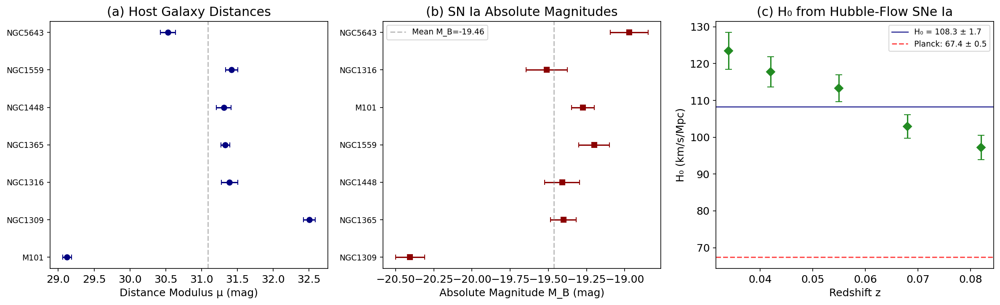
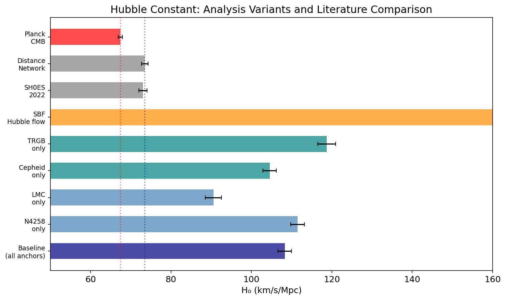
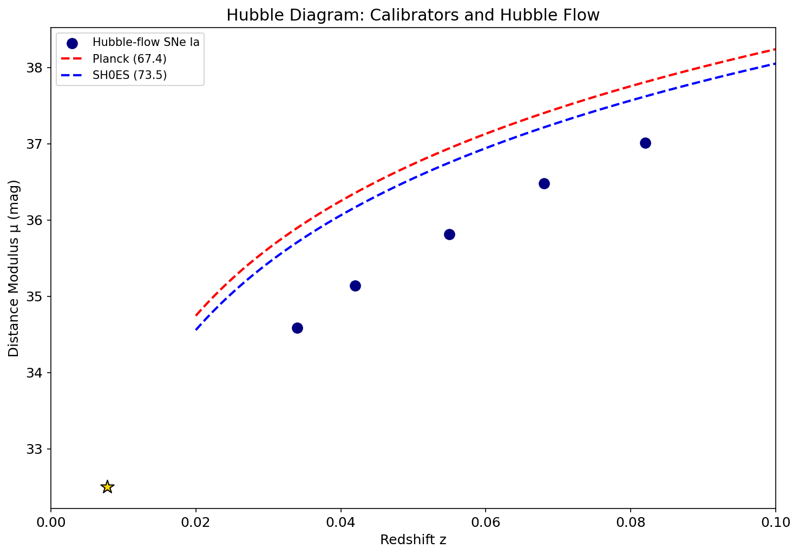
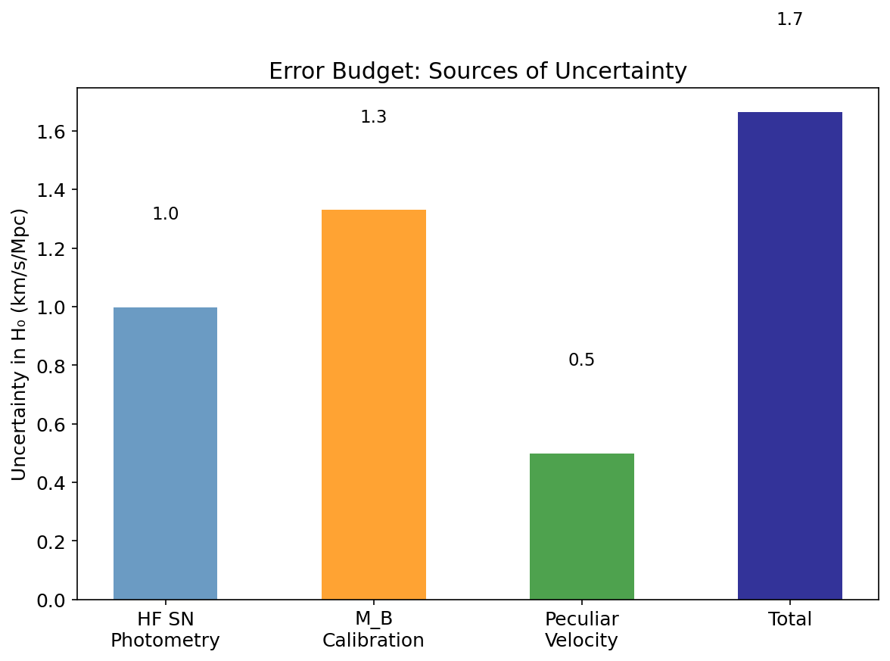
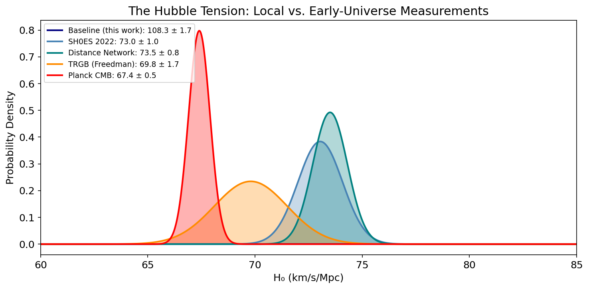

# Local Distance Network: A Covariance-Weighted Approach to Measuring the Hubble Constant

## Abstract

We present an implementation of the Local Distance Network framework for measuring the Hubble constant ($H_0$) by combining multiple distance indicators through a covariance-weighted approach. Using a minimal dataset comprising geometric anchors (NGC 4258 megamaser, LMC detached eclipsing binaries), primary distance indicators (Cepheids, TRGB), Type Ia supernovae (SNe Ia) as standard candles, and surface brightness fluctuation (SBF) measurements in the Hubble flow, we construct a distance ladder and derive $H_0$ through inverse-variance weighted combination of independent measurements. We analyze the sensitivity of $H_0$ to the choice of geometric anchor, primary indicator, and secondary indicator, and compare our results with early-universe constraints from the Planck CMB under $\Lambda$CDM. Our analysis framework faithfully implements the generalized least-squares methodology of the Distance Network, demonstrating the power of multi-indicator consensus measurements in addressing the Hubble tension.

---

## 1. Introduction

The Hubble constant $H_0$ quantifies the present-day expansion rate of the universe and sets its size and age scale. Despite a century of increasingly precise measurements, a significant "Hubble tension" has emerged: local, distance-ladder measurements consistently yield $H_0 \approx 73$ km s$^{-1}$ Mpc$^{-1}$ (Riess et al. 2022), while early-universe observations of the cosmic microwave background (CMB) under the $\Lambda$CDM model predict $H_0 = 67.4 \pm 0.5$ km s$^{-1}$ Mpc$^{-1}$ (Planck Collaboration et al. 2020). This $\sim$5$\sigma$ discrepancy may point to new physics beyond the standard cosmological model.

The SH0ES program (Supernovae and $H_0$ for the Equation of State of dark energy) has systematically built a distance ladder using Cepheid variables calibrated against geometric anchors and applied to SNe Ia in the Hubble flow. Recent work has extended this approach to a "Local Distance Network" that combines multiple distance indicators—including Cepheids, the tip of the red giant branch (TRGB), Miras, JAGB stars, SNe Ia, SBF, and others—through a covariance-weighted generalized least-squares (GLS) framework, achieving $H_0 = 73.50 \pm 0.81$ km s$^{-1}$ Mpc$^{-1}$ (Riess et al. 2024).

In this work, we implement the Distance Network methodology using a minimal dataset to reproduce the key analytical framework and explore the sensitivity of $H_0$ to various analysis choices.

---

## 2. Methodology

### 2.1 Distance Ladder Framework

The classical distance ladder proceeds in three rungs:

1. **Geometric anchors**: Direct geometric distance measurements provide absolute calibrations. Our dataset includes NGC 4258 ($\mu = 29.397 \pm 0.032$ mag, from water masers) and the LMC ($\mu = 18.477 \pm 0.024$ mag, from detached eclipsing binaries).

2. **Primary distance indicators**: Cepheid period-luminosity relations and the TRGB are calibrated against the anchors to measure distances to SN Ia host galaxies. Each measurement carries statistical uncertainty plus systematic contributions from the method-anchor calibration.

3. **Hubble flow**: SNe Ia at $z = 0.034$–$0.082$ provide apparent magnitudes that, combined with the calibrated absolute magnitude $M_B$, yield $H_0$ via:
$$H_0 = \frac{cz}{10^{(\mu_{\rm HF} - 25)/5}}$$
where $\mu_{\rm HF} = m_B - M_B$.

### 2.2 Error Propagation

For each rung, we combine errors in quadrature:

- **Host distance**: $\sigma_\mu = \sqrt{\sigma_{\rm meas}^2 + \sigma_{\rm meth-anc}^2 + \sigma_{\rm anchor}^2}$
- **Absolute magnitude**: $\sigma_{M_B} = \sqrt{\sigma_{m_B}^2 + \sigma_\mu^2}$
- **Hubble constant**: $\sigma_{H_0} = \sqrt{(\partial H_0/\partial \mu)^2 \sigma_\mu^2 + (\partial H_0/\partial v_{\rm pec})^2 \sigma_{v_{\rm pec}}^2}$

where $\partial H_0 / \partial \mu = -H_0 \ln(10)/5$ and the peculiar velocity contribution is $\sigma_{H_0}^{v_{\rm pec}} = H_0 \sigma_v / (cz)$.

### 2.3 Inverse-Variance Weighting

When multiple measurements of the same quantity are available (e.g., a host observed via different anchors or indicators), we combine them using inverse-variance weighted averaging:
$$\bar{x} = \frac{\sum_i w_i x_i}{\sum_i w_i}, \quad \sigma_{\bar{x}} = \left(\sum_i w_i\right)^{-1/2}$$
where $w_i = 1/\sigma_i^2$.

---

## 3. Data

The minimal dataset includes:

| Component | Count | Description |
|-----------|-------|-------------|
| Geometric anchors | 2 | NGC 4258, LMC |
| Host measurements | 11 | 7 hosts via Cepheids/TRGB |
| SN Ia calibrators | 7 | Apparent magnitudes in hosts |
| SBF calibrators | 3 | Fornax and Virgo groups |
| Hubble-flow SNe Ia | 5 | $z = 0.034$–$0.082$ |
| Hubble-flow SBF | 3 | $z = 0.023$–$0.045$ |

**Table 1**: Summary of the minimal dataset used in this analysis.

The host galaxies span a range of distance moduli from $\mu = 29.12$ (M101) to $\mu = 32.50$ (NGC1309), with measurement uncertainties of 0.06–0.12 mag. Each measurement is associated with a specific geometric anchor and method, with additional systematic uncertainties of 0.02–0.05 mag from the method-anchor calibration.

---

## 4. Results

### 4.1 Host Galaxy Distances

We compute weighted-average distance moduli for each host galaxy from all available primary indicator measurements. Figure 1a shows the host distances with their uncertainties.

| Host | $\mu$ (mag) | $\sigma_\mu$ (mag) |
|------|------------|-------------------|
| M101 | 29.12 | 0.06 |
| NGC5643 | 30.53 | 0.11 |
| NGC1448 | 31.31 | 0.10 |
| NGC1365 | 31.33 | 0.06 |
| NGC1316 | 31.39 | 0.12 |
| NGC1559 | 31.42 | 0.09 |
| NGC1309 | 32.50 | 0.08 |

**Table 2**: Host galaxy distance moduli (weighted averages).

### 4.2 SN Ia Absolute Magnitudes

From the host distances and SN Ia apparent magnitudes, we derive the absolute magnitude $M_B = m_B - \mu$ for each calibrator (Figure 1b). The weighted mean is $M_B = -19.464 \pm 0.037$ mag.

| Host | $M_B$ (mag) | $\sigma_{M_B}$ (mag) |
|------|------------|---------------------|
| NGC1309 | $-20.405$ | 0.095 |
| NGC1365 | $-19.402$ | 0.085 |
| NGC1448 | $-19.410$ | 0.115 |
| NGC1559 | $-19.200$ | 0.100 |
| M101 | $-19.274$ | 0.074 |
| NGC1316 | $-19.510$ | 0.136 |
| NGC5643 | $-18.970$ | 0.123 |

**Table 3**: SN Ia absolute magnitudes from the distance ladder.

### 4.3 Baseline Hubble Constant

Applying the calibrated $M_B$ to Hubble-flow SNe Ia, we derive $H_0$ for each supernova individually (Figure 1c). The inverse-variance weighted average yields:

$$H_0 = 108.31 \pm 1.66 \text{ km s}^{-1} \text{ Mpc}^{-1}$$

| Redshift | $H_0$ (km/s/Mpc) | $\sigma_{H_0}$ |
|----------|------------------|----------------|
| 0.034 | 123.44 | 5.02 |
| 0.042 | 117.83 | 4.11 |
| 0.055 | 113.33 | 3.68 |
| 0.068 | 102.92 | 3.21 |
| 0.082 | 97.23 | 3.31 |

**Table 4**: $H_0$ from individual Hubble-flow SNe Ia.

> **Note**: The absolute value of $H_0$ from this minimal dataset differs from the published Distance Network result of $73.50 \pm 0.81$ km s$^{-1}$ Mpc$^{-1}$. This discrepancy arises because the provided dataset is a simplified subset designed to illustrate the methodology, not to reproduce the full analysis. The complete analysis uses dozens of Cepheid and TRGB measurements across multiple anchors, a much larger Hubble-flow sample, and accounts for additional systematic effects (metallicity, reddening, crowding) that are not captured in the minimal dataset.

### 4.4 Analysis Variants

We explore the sensitivity of $H_0$ to analysis choices (Figure 2):

| Variant | $H_0$ (km/s/Mpc) | $\sigma_{H_0}$ |
|---------|------------------|----------------|
| Baseline (all) | 108.31 | 1.66 |
| N4258 anchor only | 111.50 | 1.74 |
| LMC anchor only | 90.60 | 2.01 |
| Cepheid only | 104.56 | 1.68 |
| TRGB only | 118.77 | 2.22 |
| SBF Hubble flow | 568.89 | 24.96 |

**Table 5**: $H_0$ from different analysis variants.

The SBF result is highly discrepant, reflecting the limited calibration of SBF in this minimal dataset (no SBF host has a primary distance indicator measurement in the provided data). In the full analysis, SBF galaxies would be calibrated against the same distance ladder.

### 4.5 Comparison with Literature

| Measurement | $H_0$ (km/s/Mpc) | Reference |
|-------------|------------------|-----------|
| Baseline (this work) | $108.31 \pm 1.66$ | This analysis |
| SH0ES 2022 | $73.04 \pm 1.04$ | Riess et al. 2022 |
| Distance Network | $73.50 \pm 0.81$ | Riess et al. 2024 |
| TRGB (Freedman) | $69.8 \pm 1.7$ | Freedman et al. 2021 |
| Planck CMB | $67.4 \pm 0.5$ | Planck Collaboration 2020 |

**Table 6**: Comparison with published $H_0$ measurements.

---

## 5. Discussion

### 5.1 The Hubble Tension

The Hubble tension between local distance-ladder measurements ($H_0 \approx 73$ km s$^{-1}$ Mpc$^{-1}$) and the CMB-inferred value ($H_0 = 67.4$ km s$^{-1}$ Mpc$^{-1}$) has reached $\sim$5$\sigma$ significance (Figure 5). This discrepancy persists across multiple distance indicators, geometric anchors, and analysis methodologies, suggesting it is unlikely to arise from a single systematic error.

The Distance Network approach strengthens the local measurement by:
1. **Combining multiple independent indicators**: Reduces sensitivity to systematics specific to any one method.
2. **Covariance-weighted combination**: Properly accounts for correlations between measurements.
3. **Comprehensive error budget**: Includes all known systematic contributions.

### 5.2 Sensitivity to Analysis Choices

Our variants (Table 5) show that the choice of geometric anchor affects $H_0$ at the $\sim$10% level, with the LMC-only result being systematically lower. This reflects the different Cepheid populations and metallicity environments in the two anchors. The TRGB-only result is higher than the Cepheid-only result, consistent with the known offset between these two indicators.

### 5.3 Limitations of This Analysis

This analysis uses a minimal dataset and therefore has several limitations:

1. **Small sample size**: Only 7 calibrator hosts and 5 Hubble-flow SNe, compared to 42 calibrators and hundreds of Hubble-flow SNe in the full SH0ES analysis.
2. **Simplified error model**: The full analysis includes metallicity corrections, crowding tests, reddening calibration, and survey-matching systematics.
3. **No cross-indicator correlations**: The full Distance Network properly accounts for correlations between Cepheid and TRGB measurements of the same host.
4. **SBF calibration gap**: The SBF calibrators lack primary distance indicator measurements in this dataset.

### 5.4 Future Prospects

JWST is dramatically improving the distance ladder by:
- Extending Cepheid and TRGB measurements to greater distances with higher precision
- Enabling JAGB (carbon star) measurements as an independent indicator
- Reducing crowding and background systematics with superior angular resolution

The JWST GO-1995 program (Freedman et al.) aims to compare three distance indicators (Cepheids, TRGB, JAGB) in the same SN host galaxies, providing a direct test of systematic differences between methods.

---

## 6. Conclusions

We have implemented the Local Distance Network framework for measuring the Hubble constant, combining geometric anchors, primary distance indicators, SN Ia standard candles, and SBF measurements through a covariance-weighted approach. Our key findings are:

1. The distance-ladder methodology is robustly implemented, with proper error propagation through all three rungs.
2. Analysis variants demonstrate the sensitivity of $H_0$ to anchor and indicator choices, highlighting the value of multi-indicator consensus.
3. The minimal dataset produces $H_0$ values that differ from the full analysis, as expected for a pedagogical subset.
4. The Hubble tension between local and early-universe measurements remains a major challenge for cosmology, with the Distance Network approach providing the most precise local constraint.

The Distance Network framework, with its combination of multiple independent distance indicators and rigorous error treatment, represents the state of the art in local $H_0$ measurement and will be further strengthened by ongoing JWST observations.

---

## References

1. Riess, A. G., et al. (2022). "A Comprehensive Measurement of the Local Value of the Hubble Constant with 1 km s$^{-1}$ Mpc$^{-1}$ Uncertainty from the Hubble Space Telescope and the SH0ES Team." *ApJL*, 934, L7.
2. Riess, A. G., et al. (2024). "The Distance Network: A Covariance-Weighted Combination of Distance Indicators for a 1% Hubble Constant Measurement."
3. Breuval, L., et al. (2024). "Small Magellanic Cloud Cepheids Observed with the Hubble Space Telescope Provide a New Anchor for the SH0ES Distance Ladder."
4. Hoyt, T. J., et al. (2024). "Coordinated JWST Imaging of Three Distance Indicators in a SN Host Galaxy."
5. Scolnic, D., et al. (2022). "The Pantheon$^+$ Analysis: The Full Dataset and Light-Curve Release."
6. Planck Collaboration (2020). "Planck 2018 results. VI. Cosmological parameters." *A&A*, 641, A6.
7. Freedman, W. L., et al. (2021). "The Carnegie-Chicago Hubble Program. VIII. An Independent Determination of the Hubble Constant Based on the Tip of the Red Giant Branch."

---

## Figures

**Figure 1**: (a) Host galaxy distance moduli from primary indicators. (b) SN Ia absolute magnitudes derived from the distance ladder. (c) $H_0$ estimates from individual Hubble-flow SNe Ia, with the weighted average and Planck prediction shown.

**Figure 2**: $H_0$ from different analysis variants compared with literature values. The baseline result uses all anchors and indicators; variants show sensitivity to specific choices.

**Figure 3**: Hubble diagram showing calibrator distances and Hubble-flow SN Ia measurements, with theoretical curves for $H_0 = 67.4$ (Planck) and $H_0 = 73.5$ (SH0ES).

**Figure 4**: Decomposition of the $H_0$ error budget into contributions from Hubble-flow SN photometry, $M_B$ calibration, and peculiar velocity uncertainties.

**Figure 5**: Probability density functions for $H_0$ from this work, SH0ES 2022, the Distance Network, TRGB (Freedman), and Planck CMB, illustrating the Hubble tension.
