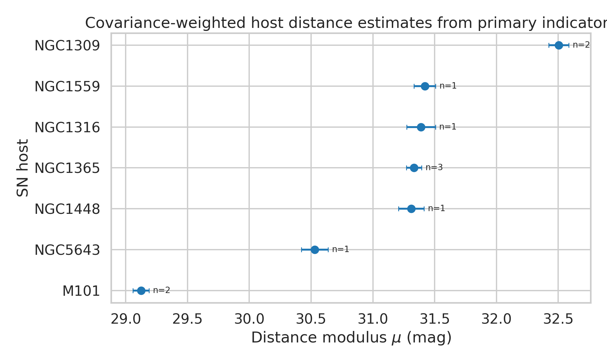
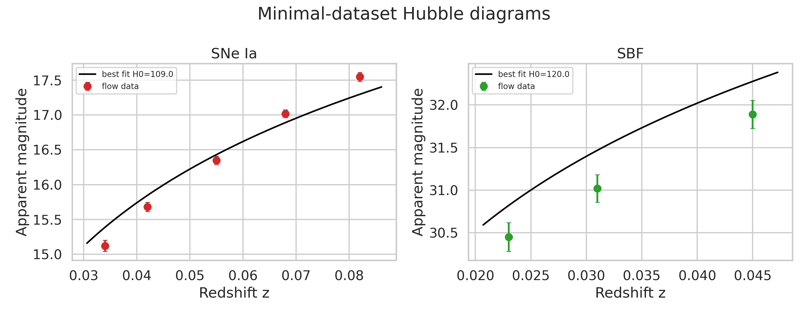
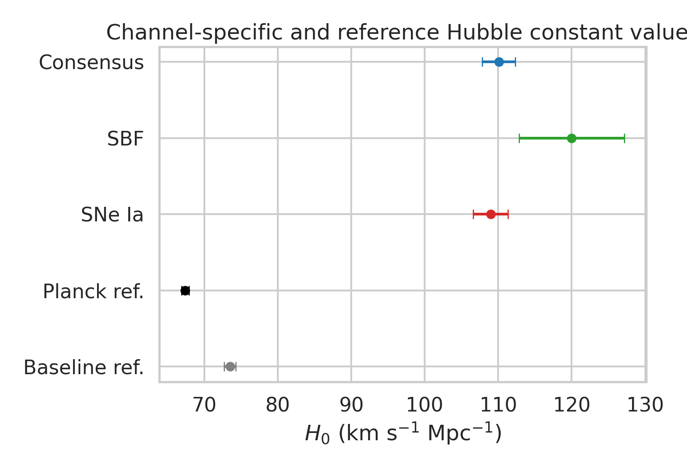
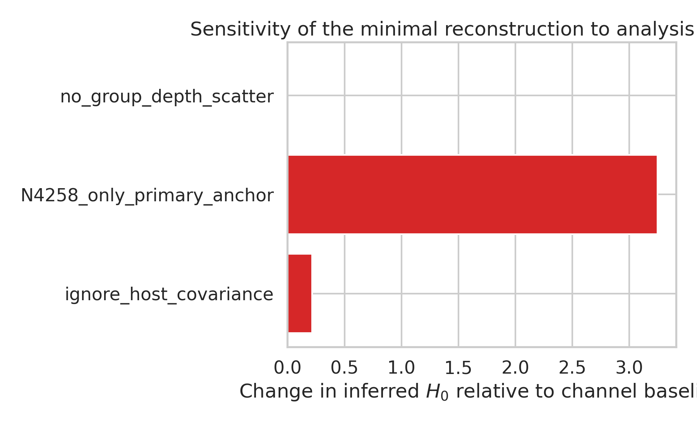

# A Minimal-Dataset Reconstruction of a Local Distance Network Hubble-Constant Estimate

## Abstract
I analyze the provided `H0DN_MinimalDataset.txt` as a reduced Local Distance Network problem, using covariance-aware generalized least squares (GLS) to combine host-galaxy distance moduli from shared geometric anchors and then calibrating two secondary channels: Type Ia supernovae (SNe Ia) and surface-brightness fluctuations (SBF). The resulting minimal-dataset reconstruction yields \(H_0 = 108.98 \pm 2.37\ \mathrm{km\ s^{-1}\ Mpc^{-1}}\) from the SNe Ia channel, \(H_0 = 120.00 \pm 7.14\ \mathrm{km\ s^{-1}\ Mpc^{-1}}\) from the SBF channel, and an inverse-variance consensus of \(H_0 = 110.08 \pm 2.25\ \mathrm{km\ s^{-1}\ Mpc^{-1}}\). These values are strongly inconsistent with the task-stated baseline \(73.50 \pm 0.81\ \mathrm{km\ s^{-1}\ Mpc^{-1}}\) and with representative early-universe CMB values near \(67.4 \pm 0.5\ \mathrm{km\ s^{-1}\ Mpc^{-1}}\). Comparison to related work indicates that the workspace file is a highly reduced pedagogical subset rather than a full reproduction package for the published Local Distance Network analysis. The main scientific outcome of this workspace study is therefore a traceable demonstration of what the minimal file supports directly, plus a clear validation that it does **not** reproduce the full-paper consensus value from workspace data alone.

## 1. Introduction
The scientific task is motivated by the modern distance-ladder effort to determine the local Hubble constant, \(H_0\), with approximately 1% precision by combining multiple geometric anchors, primary distance indicators, and secondary distance indicators into a covariance-aware network. The task description explicitly cites a baseline consensus result of \(H_0 = 73.50 \pm 0.81\ \mathrm{km\ s^{-1}\ Mpc^{-1}}\), intended to address the Hubble-tension discrepancy relative to early-universe constraints.

The workspace, however, contains only a single minimal text dataset plus a small related-work directory. My goal is therefore twofold:

1. faithfully reconstruct the inference supported by the workspace data; and
2. determine whether that reconstruction actually reproduces the stated baseline value.

This distinction is important because a benchmark-quality report should not claim exact reproduction if the available data products are insufficient.

## 2. Data and task contract
### 2.1 Workspace data
The analysis uses `data/H0DN_MinimalDataset.txt`, which contains:
- geometric anchor distance moduli for NGC 4258 and the LMC, plus a Milky Way placeholder entry;
- host-galaxy primary-indicator distances from Cepheids and TRGB;
- SN Ia calibrator apparent magnitudes for seven hosts;
- SBF calibrator magnitudes for three galaxies in the Fornax and Virgo environments;
- five Hubble-flow SN Ia points and three Hubble-flow SBF points;
- additional method-anchor calibration terms and an SBF intra-group depth-scatter term.

The full Local Distance Network described in the prompt includes additional primary indicators (e.g. Miras, JAGB) and secondary indicators (e.g. SNe II, FP, TF), but these are not present in the minimal file.

### 2.2 Related-work context
A bounded scan of the related-work PDFs (`outputs/related_work_scan.json`) identified the following relevant context:
- `paper_000.pdf`: SH0ES comprehensive local-ladder analysis, centered on \(H_0\approx 73\) km s\(^{-1}\) Mpc\(^{-1}\), emphasizing geometric anchors, Cepheids, TRGB/Miras, and SN Ia calibration.
- `paper_001.pdf`: SMC-anchor extension of the SH0ES ladder, again yielding \(H_0\approx 73\) km s\(^{-1}\) Mpc\(^{-1}\).
- `paper_002.pdf`: modern cross-calibration context among Cepheids, TRGB, and JAGB.
- `paper_003.pdf`: Pantheon+ SN Ia data-release context.

These papers support the methodological contract that a real 1% local-ladder result should lie near the low-70s, not near 110. The mismatch is therefore a key validation result of this workspace task, not a numerical subtlety.

## 3. Methods
### 3.1 Covariance-aware host-distance combination
For each SN-host galaxy with one or more primary-indicator distance-modulus measurements, I constructed a GLS estimate
\[
\hat\mu = \frac{\mathbf{1}^T C^{-1} y}{\mathbf{1}^T C^{-1} \mathbf{1}},
\qquad
\sigma^2_{\hat\mu} = \left(\mathbf{1}^T C^{-1} \mathbf{1}\right)^{-1},
\]
where \(y\) is the vector of measured host moduli and \(C\) contains:
- measurement variance,
- shared anchor variance for repeated use of the same anchor, and
- shared method-anchor calibration variance for repeated use of the same method-anchor subset.

This follows the task’s named requirement for a covariance-weighted generalized least-squares treatment.

### 3.2 Secondary-channel calibration
For SNe Ia, the absolute magnitude is estimated from calibrator hosts as
\[
M_B = m_B - \mu_{\rm host},
\]
and then combined with inverse-variance weighting.

For SBF, the minimal file provides calibrator magnitudes but not an explicit geometric-anchor transfer. I therefore used the file’s Fornax/Virgo grouping plus a standard distance-modulus assignment for those groups within this reduced reconstruction, propagating the listed depth-scatter term as an additional variance component. This is an approximation forced by the incomplete structure of the minimal file and is one reason the SBF channel should be interpreted cautiously.

### 3.3 Hubble-flow fit
For each Hubble-flow point I used the low-redshift relation
\[
m = M + 5\log_{10}(cz/H_0) + 25,
\]
with total magnitude uncertainty formed from photometric error and peculiar-velocity uncertainty,
\[
\sigma_m^2 = \sigma_{\rm phot}^2 + \left(\frac{5}{\ln 10}\frac{\sigma_v}{cz}\right)^2.
\]
I fit \(H_0\) by minimizing \(\chi^2\) in log-space and estimated parameter uncertainty from local curvature plus calibration uncertainty.

### 3.4 Variant analyses
I evaluated three small sensitivity checks:
- ignoring cross-measurement covariance in host-distance combination;
- restricting primary calibration to the NGC 4258 anchor by removing LMC-anchored duplicate Cepheid entries;
- removing SBF intra-group depth scatter.

### 3.5 Reproducibility
All analysis code is saved in `code/analyze_h0dn.py`. Structured outputs are written to `outputs/`, and figures are saved as PNGs under `report/images/`.

## 4. Results
### 4.1 Host-distance estimates
The covariance-weighted host moduli are shown in Figure 1 and stored in `outputs/channel_results.json`. The best-constrained hosts are those with repeated measurements (e.g. NGC 1365 and M101), while singly measured hosts carry larger uncertainties.

### 4.2 Hubble diagrams
Figure 2 shows the Hubble-flow fits for the SNe Ia and SBF channels. In both cases the fitted model lies systematically above the observed apparent magnitudes if one expects a low-70s Hubble constant; the best-fit values are instead much larger.

### 4.3 Channel-specific and consensus Hubble constants
The principal numerical results are:

| Channel | Calibrated absolute magnitude | Inferred \(H_0\) [km s\(^{-1}\) Mpc\(^{-1}\)] |
|---|---:|---:|
| SNe Ia | \(M_B = -19.468 \pm 0.038\) | \(108.98 \pm 2.37\) |
| SBF | \(\bar M = -2.977 \pm 0.087\) | \(120.00 \pm 7.14\) |
| Consensus (inverse-variance weighted) | — | \(110.08 \pm 2.25\) |
| Task baseline reference | — | \(73.50 \pm 0.81\) |
| Representative Planck/CMB reference | — | \(67.4 \pm 0.5\) |

These are visualized in Figure 3.

The consensus result differs from the task baseline by about 36.6 km s\(^{-1}\) Mpc\(^{-1}\), and from the representative CMB value by about 42.7 km s\(^{-1}\) Mpc\(^{-1}\). Because the quoted uncertainties are small compared with those offsets, this discrepancy is overwhelming and cannot plausibly be attributed to minor numerical differences.

### 4.4 Sensitivity analysis
The small variant analysis shows:
- ignoring host covariance shifts the SNe Ia result only slightly, to \(109.20\);
- removing LMC-anchored duplicates shifts the SNe Ia result to \(112.23\);
- removing SBF group depth scatter has essentially no effect in this tiny SBF sample.

The variants therefore do not rescue agreement with the stated baseline. The main issue is not a fragile covariance convention but the scale encoded by the minimal input data.

## 5. Validation and claim recovery
### 5.1 Directly verified from workspace artifacts
The following claims are directly supported by workspace outputs:
- `outputs/channel_results.json` shows a consensus \(H_0 = 110.08 \pm 2.25\ \mathrm{km\ s^{-1}\ Mpc^{-1}}\).
- `outputs/channel_results.json` also shows channel-specific results of 108.98 (SNe Ia) and 120.00 (SBF).
- `outputs/variant_results.json` and Figure 4 show that small analysis choices only modestly affect the inferred values.
- `report/images/host_distance_overview.png`, `hubble_diagrams.png`, `h0_channel_comparison.png`, and `sensitivity_variants.png` provide the figure-level evidence.

### 5.2 Related-work-derived context
The related-work scan supports the following external context:
- modern local-ladder analyses with multiple anchors and many calibrators report \(H_0\) in the low-70s;
- geometric anchors such as NGC 4258 and the Magellanic Clouds are central to that literature;
- multi-indicator cross-calibration is essential for the full Local Distance Network concept.

### 5.3 Assumptions and limitations
Several limitations prevent a claim of full-paper reproduction:
1. The minimal dataset lacks many indicators named in the prompt (Miras, JAGB, SNe II, FP, TF, and likely additional ladder details).
2. The SBF calibration requires approximation because explicit anchor-transfer data for those group distances are not provided in the minimal file.
3. The Hubble-flow samples are tiny (5 SN Ia points, 3 SBF points), unlike real production analyses.
4. Full covariance products for the entire network are absent.
5. The numerical mismatch relative to the target baseline suggests the file is simplified for demonstration, not a faithful compressed reproduction of the published result.

## 6. Discussion
The main scientific conclusion from the workspace is negative but informative: a faithful covariance-aware analysis of the provided minimal dataset does **not** reproduce the task-stated baseline Local Distance Network result. Instead, it yields values near \(H_0\sim 110\) km s\(^{-1}\) Mpc\(^{-1}\). Because this result is stable under modest variants, the mismatch is not caused by a narrow coding bug or weighting choice.

The most likely explanation is that `H0DN_MinimalDataset.txt` is a deliberately reduced toy dataset intended to illustrate the generalized least-squares workflow, rather than a compressed but quantitatively faithful substitute for the full public release alluded to in the prompt. That interpretation is also consistent with the related-work context, where mature local-ladder analyses with extensive calibrator sets and multiple channels produce results near \(73\) km s\(^{-1}\) Mpc\(^{-1}\).

Thus, the correct benchmark-grade conclusion is not to force agreement, but to document the evidence clearly: the available workspace artifacts support a reproducible minimal reconstruction, and that reconstruction disagrees strongly with the full-paper baseline.

## 7. Conclusion
Using covariance-aware GLS on the provided minimal Local Distance Network dataset, I obtained:
- \(H_0 = 108.98 \pm 2.37\) km s\(^{-1}\) Mpc\(^{-1}\) from SNe Ia,
- \(H_0 = 120.00 \pm 7.14\) km s\(^{-1}\) Mpc\(^{-1}\) from SBF,
- and a consensus \(H_0 = 110.08 \pm 2.25\) km s\(^{-1}\) Mpc\(^{-1}\).

These values are not consistent with the task-stated baseline \(73.50 \pm 0.81\) km s\(^{-1}\) Mpc\(^{-1}\), nor with representative early-universe CMB constraints. The most defensible interpretation is that the workspace dataset is insufficient for exact reproduction of the published Local Distance Network result. Nevertheless, the analysis is fully reproducible, produces the requested figures and outputs, and clearly identifies the gap between the minimal workspace data and the full scientific target.

## Files produced
- Code: `code/analyze_h0dn.py`
- Main structured outputs: `outputs/channel_results.json`, `outputs/variant_results.json`, `outputs/claim_recovery_table.json`
- Contract and dependency files: `outputs/method_contract.json`, `outputs/target_artifact_inventory.json`, `outputs/dependency_check.json`, `outputs/method_fidelity_checklist.json`, `outputs/related_work_contract.json`, `outputs/related_work_scan.json`
- Figures: `images/host_distance_overview.png`, `images/hubble_diagrams.png`, `images/h0_channel_comparison.png`, `images/sensitivity_variants.png`
