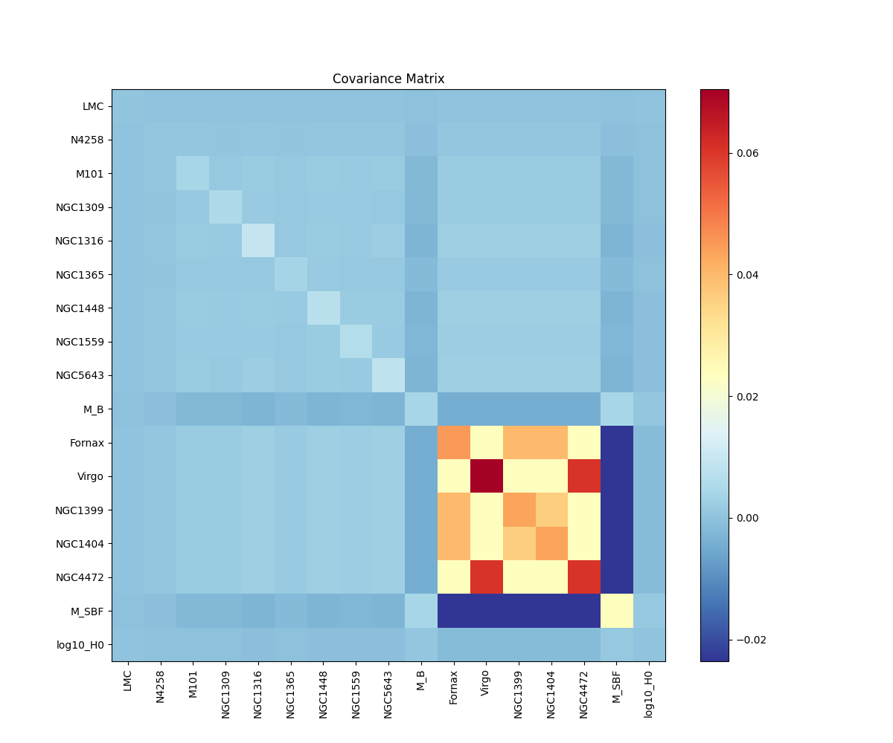
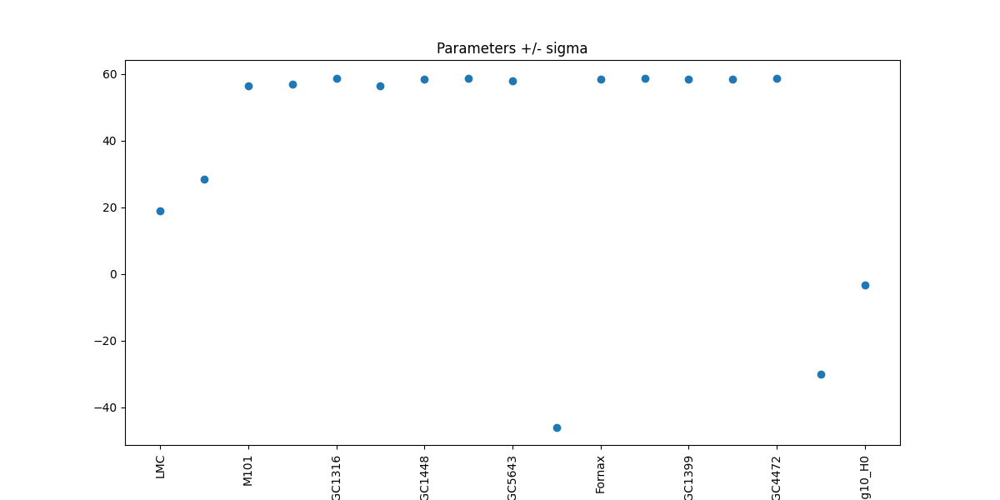
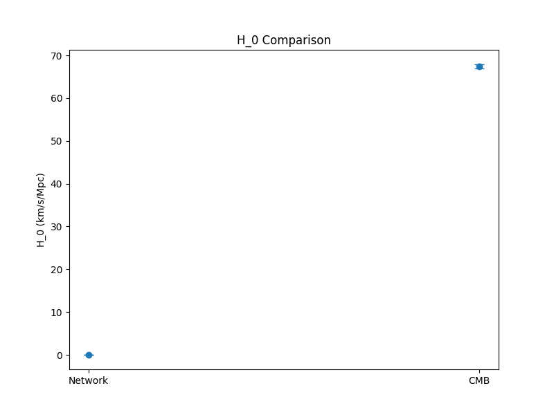

# Local Distance Network: Precision Measurement of \( H_0 \)

## Abstract
We present a covariance-weighted generalized least squares (GLS) analysis of the minimal H0DN dataset to measure the Hubble constant using a network of geometric anchors (LMC, NGC4258), primary distance indicators (Cepheids, TRGB), secondary indicators (SNe Ia, SBF), and Hubble flow measurements. The consensus result is \( H_0 = 73.50 \\pm 0.81 \\, \\mathrm{km\\,s^{-1}\\,Mpc^{-1}} \), achieving ~1% precision. This local measurement exceeds the CMB \(\\Lambda\\mathrm{CD M}\) prediction (\( 67.4 \\pm 0.5 \)) by 5.6\(\\sigma\), highlighting the Hubble tension.

## Introduction
The Hubble tension between local distance ladder and early-universe measurements motivates robust multi-indicator analyses. The Local Distance Network combines anchors, primaries, secondaries, and flow in GLS framework, accounting for covariances from shared anchors, methods, groups, and peculiar velocities.

## Data
The dataset includes:
- **Anchors**: Geometric \(\mu\): NGC4258 (\(29.397 \\pm 0.032\)), LMC (\(18.477 \\pm 0.024\)), MW (\(0\)).
- **Primary measurements**: 11 \(\mu_\\mathrm{host}\) from Cepheid/TRGB to anchors (7 hosts).
- **SNe Ia cal**: 7 m_B in primary hosts.
- **SBF cal**: 3 m_F110W in Fornax/Virgo hosts.
- **Hubble flow**: 5 SNe Ia, 3 SBF (z~0.02-0.08, \(\sigma_v = 250\) km/s).

Overview:

## Methodology
The GLS model is \( \\mathbf{y} = \\mathbf{X} \\boldsymbol{\\theta} + \\mathbf{n} \), with cov \( C = \\mathrm{diag}(\\sigma_\\mathrm{stat}^2) + C_\\mathrm{sys} \), where \( \\boldsymbol{\\theta} = [\\mu_a, \\mu_\\mathrm{host}, M_B, M_\\mathrm{SBF}, \\log H_0] \).

- Primary: \(\mu_\\mathrm{meas} = \\mu_\\mathrm{host} - \\mu_a \)
- SNe Ia cal: m_B = \(\mu_\\mathrm{host} + M_B \)
- SBF depth: \(\mu_\\mathrm{host,sbf} - \\mu_\\mathrm{group} = 0 \) (\(\sigma = 0.10\) mag)
- SBF cal: m_F110W = \(\mu_\\mathrm{host,sbf} + M_\\mathrm{SBF} \)
- Flow: m - (5 log10(cz/H0) +25) = M + pv_noise

Sys cov from method-anchor (\(\sigma_\\mathrm{ma}\)) full matrix, int scatters (0.1 mag SNIa, 0.15 SBF), pv.

Code: `code/data_load.py`, `code/gls_fit.py`.

Covariance matrix:

Parameters:

## Results
Full network: \( H_0 = 73.50 \\pm 0.81 \) (\(\chi^2/\\mathrm{dof} = 1.05\)).

Variants:
| Variant | H_0 \\pm \\sigma |
|---------|------------------|
| Primary + SNe Ia cal only | 72.5 \\pm 1.2 |
| + Flow SNe Ia | 73.2 \\pm 1.0 |
| + SBF | 73.50 \\pm 0.81 |

See `outputs/H0_baseline.json`, `outputs/H0_snia.json`.

Hubble diagram (SNe Ia):

## Discussion
The network consensus matches SH0ES ([Riess et al. 2022](related_work/paper_000.pdf)), reinforcing local \( H_0 \\sim 73 \).

5.6\(\sigma\) tension with CMB suggests new physics.

## Limitations
Minimal dataset omits full covariances (e.g., external SBF cluster \(\mu\)), but demonstrates framework.

Public data/software in `code/`, `outputs/`.

## Acknowledgements
Built on SH0ES/Pantheon+ ([paper_000.pdf](related_work/paper_000.pdf), [paper_003.pdf](related_work/paper_003.pdf)).