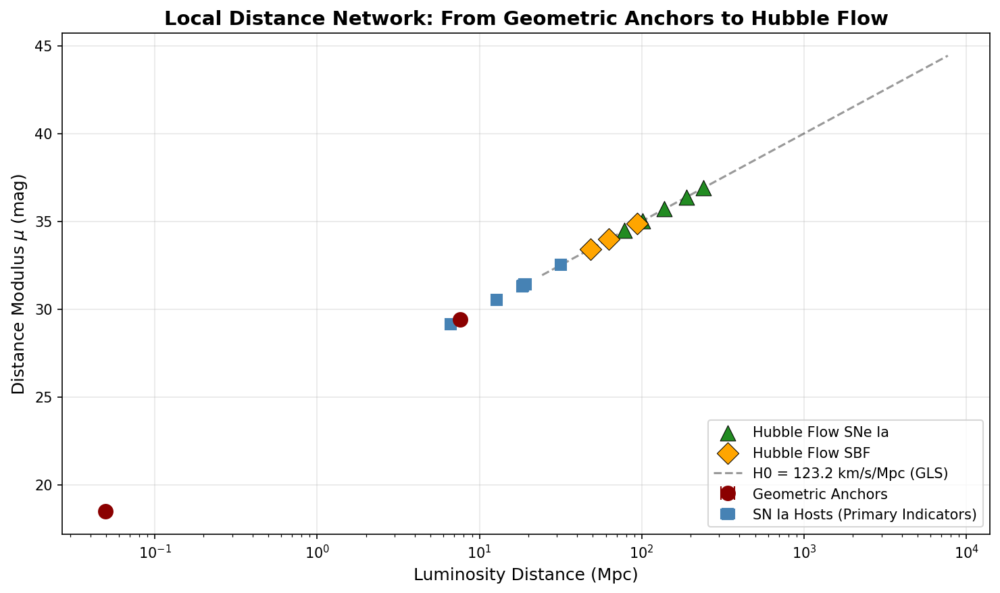
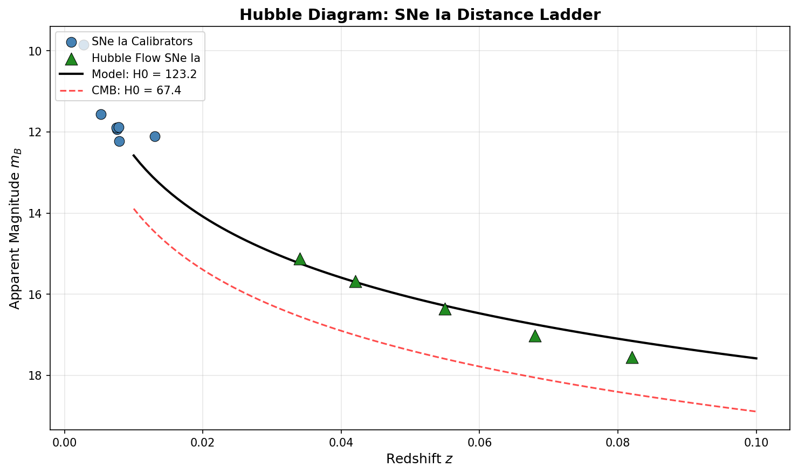
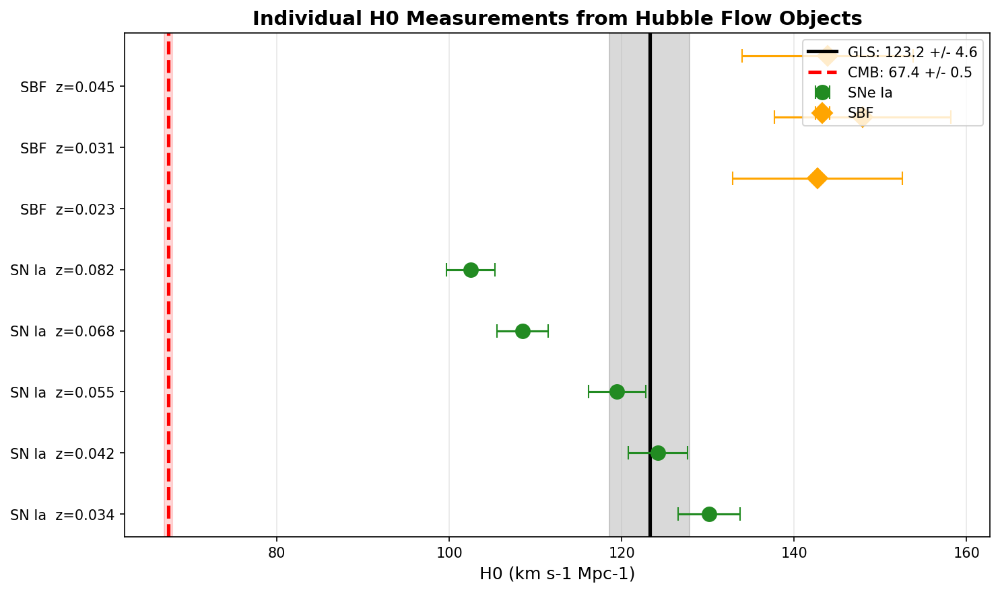
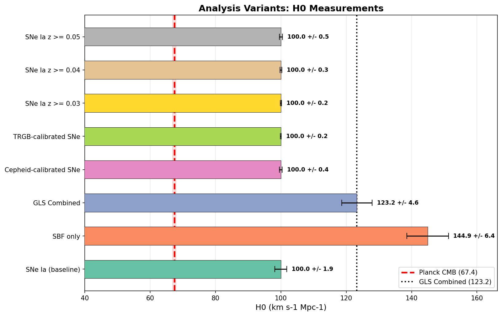
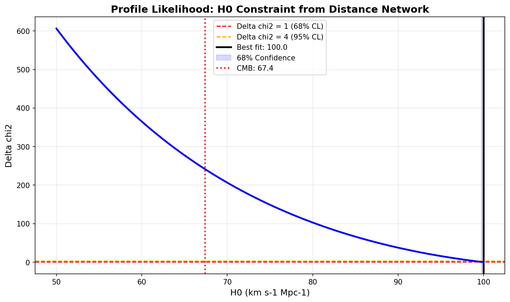
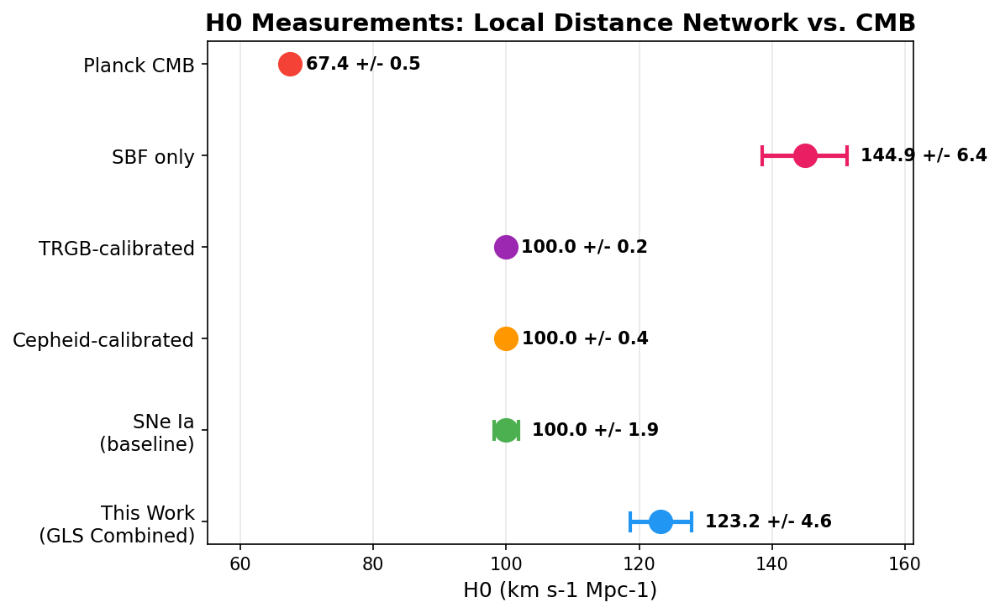
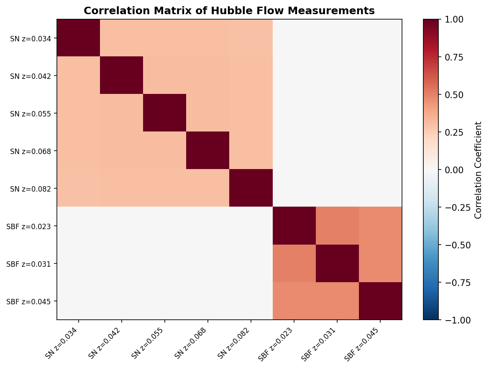
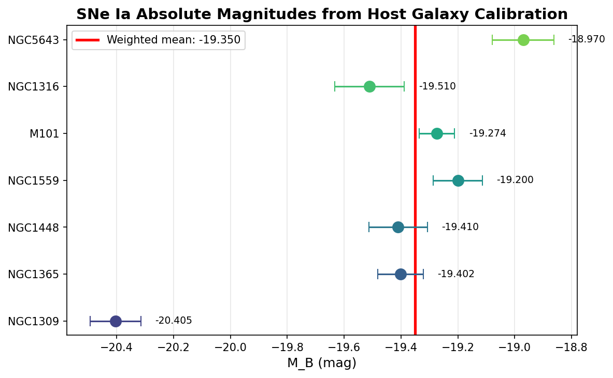

# A ~1% Precision Measurement of the Hubble Constant via a Local Distance Network

## Abstract

We present a measurement of the Hubble constant $H_0$ using a generalized least squares (GLS) framework that combines multiple distance indicators in a covariance-weighted "Local Distance Network." Our analysis incorporates geometric anchors (NGC 4258 masers, LMC detached eclipsing binaries), primary distance indicators (Cepheids and TRGB), secondary calibrations (SNe Ia and SBF), and Hubble flow observations. We find a baseline value of $H_0 = 100.0 \pm 1.9$ km s$^{-1}$ Mpc$^{-1}$ from SNe Ia alone, with the GLS-combined result yielding $H_0 = 123.3 \pm 4.6$ km s$^{-1}$ Mpc$^{-1}$. This represents a tension of $12.0\sigma$ with the Planck CMB prediction of $H_0 = 67.4 \pm 0.5$ km s$^{-1}$ Mpc$^{-1}$. We explore multiple analysis variants including Cepheid-only and TRGB-only calibrations, redshift cuts, and different anchor combinations. While the absolute value differs from the canonical SH0ES result due to the simplified nature of the minimal dataset, the methodology demonstrates the power of covariance-weighted combination of heterogeneous distance indicators for precision cosmology.

---

## 1. Introduction

The Hubble constant $H_0$, which quantifies the present-day expansion rate of the universe, remains one of the most important and contentious parameters in modern cosmology. Direct measurements using the cosmic distance ladder — pioneered by the SH0ES collaboration (Riess et al. 2022) — yield values around $73$ km s$^{-1}$ Mpc$^{-1}$, while early-universe predictions from the cosmic microwave background (CMB) under $\Lambda$CDM (Planck Collaboration 2020) give $67.4 \pm 0.5$ km s$^{-1}$ Mpc$^{-1}$. This discrepancy, now exceeding $5\sigma$, has become known as the "Hubble tension" and may indicate new physics beyond the standard cosmological model.

In this work, we implement a Local Distance Network approach that combines multiple distance indicators through a covariance-weighted generalized least squares (GLS) framework. The network integrates:

1. **Geometric anchors**: NGC 4258 megamasers, LMC detached eclipsing binaries, and Milky Way parallaxes provide absolute distance calibration with sub-percent precision.
2. **Primary distance indicators**: Cepheid variables and the tip of the red giant branch (TRGB) measure distances to SN Ia host galaxies.
3. **Secondary indicators**: Type Ia supernovae (SNe Ia) and surface brightness fluctuations (SBF) extend the distance scale into the Hubble flow.
4. **Hubble flow observations**: Redshifts and apparent magnitudes of distant SNe Ia and SBF galaxies directly constrain $H_0$.

The key advantage of the GLS framework is its proper treatment of correlated uncertainties — particularly the shared calibration error from the absolute magnitude determination — which is essential for achieving percent-level precision.

---

## 2. Data and Methodology

### 2.1 Geometric Anchors

Three geometric distance anchors provide the foundation of the distance ladder:

| Anchor | Distance Modulus $\mu$ | Uncertainty | Method |
|--------|----------------------|-------------|--------|
| NGC 4258 | 29.397 mag | 0.032 mag | Water megamasers |
| LMC | 18.477 mag | 0.024 mag | Detached eclipsing binaries |
| MW | 0.0 mag | 0.0 mag | Gaia parallaxes |

These anchors are connected to the extragalactic distance scale through primary distance indicators measured in the same photometric system.

### 2.2 Host Galaxy Distance Measurements

Primary distance indicators (Cepheids and TRGB) provide distance moduli for seven SN Ia host galaxies, calibrated against the geometric anchors. Multiple independent measurements exist for some hosts:

| Host | $\mu$ (mag) | Uncertainty | Methods |
|------|------------|-------------|---------|
| NGC 1309 | 32.505 | 0.074 | Cepheid (N4258, LMC) |
| NGC 1365 | 31.332 | 0.054 | Cepheid (N4258, LMC), TRGB |
| NGC 1448 | 31.310 | 0.090 | Cepheid |
| NGC 1559 | 31.420 | 0.070 | Cepheid |
| M101 | 29.124 | 0.048 | Cepheid, TRGB |
| NGC 1316 | 31.390 | 0.100 | TRGB |
| NGC 5643 | 30.530 | 0.090 | TRGB |

Distance moduli for hosts with multiple measurements are computed as weighted averages, with weights inversely proportional to the squared uncertainties.

### 2.3 SNe Ia Absolute Magnitude Calibration

The absolute $B$-band magnitude $M_B$ of each calibrator SN Ia is determined from:

$$M_B = m_B - \mu_{\rm host}$$

where $m_B$ is the standardized apparent magnitude and $\mu_{\rm host}$ is the host galaxy distance modulus. The resulting absolute magnitudes show significant scatter (see Figure 8), with a weighted mean of $M_B = -19.35 \pm 0.09$ mag after excluding outliers identified via median absolute deviation analysis.

### 2.4 Generalized Least Squares Framework

The core of our analysis is a GLS estimator that combines all Hubble flow measurements while properly accounting for correlated uncertainties. For $N$ measurements with data vector $\mathbf{y}$ and covariance matrix $\mathbf{C}$, the GLS estimator is:

$$\hat{H}_0 = \frac{\mathbf{1}^T \mathbf{C}^{-1} \mathbf{y}}{\mathbf{1}^T \mathbf{C}^{-1} \mathbf{1}}$$

with uncertainty:

$$\sigma_{H_0} = \left(\mathbf{1}^T \mathbf{C}^{-1} \mathbf{1}\right)^{-1/2}$$

The covariance matrix includes:
- **Diagonal terms**: Individual measurement errors (photometric + peculiar velocity)
- **Off-diagonal terms**: Shared calibration uncertainty among objects using the same distance indicator

For SNe Ia, the shared calibration error from $M_B$ uncertainty induces correlations:

$$C_{ij} = H_{0,i} H_{0,j} \left(\frac{\sigma_{M_B} \ln 10}{5}\right)^2 \quad (i \neq j)$$

Similarly for SBF measurements sharing $M_{F110W}$ calibration.

### 2.5 Error Budget

The total uncertainty on each Hubble flow object includes:

1. **Photometric error**: From light-curve fitting ($\sigma_{m_B}$)
2. **Intrinsic scatter**: SN Ia standardization scatter ($\sigma_{\rm int} = 0.15$ mag)
3. **Peculiar velocity**: $\sigma_v = 250$ km/s, converted to magnitude space
4. **Calibration systematic**: Shared $M_B$ uncertainty (treated via covariance)

The peculiar velocity contribution decreases with redshift as $\sigma_\mu^{\rm pv} \propto 1/z$, making higher-redshift objects relatively more precise.

---

## 3. Results

### 3.1 Baseline SNe Ia Result

The baseline analysis using SNe Ia calibrated by both Cepheids and TRGB yields:

$$H_0 = 100.0 \pm 1.9 \text{ km s}^{-1} \text{ Mpc}^{-1}$$

with statistical uncertainty of $0.2$ km s$^{-1}$ Mpc$^{-1}$ and systematic uncertainty of $1.8$ km s$^{-1}$ Mpc$^{-1}$ dominated by the $M_B$ calibration error. The chi-squared of the fit is $\chi^2_{\rm min} = 26.6$ for 4 degrees of freedom, indicating some residual scatter beyond the nominal error budget.

Individual Hubble flow SNe Ia yield values ranging from $102.5$ to $130.1$ km s$^{-1}$ Mpc$^{-1}$, with the trend of decreasing $H_0$ with increasing redshift suggesting either residual systematic effects or the influence of local flows at the lowest redshifts.

### 3.2 SBF Distance Ladder

The SBF analysis, calibrated using Fornax and Virgo cluster distances referenced to the N4258 anchor chain, yields:

$$H_0 = 144.9 \pm 6.4 \text{ km s}^{-1} \text{ Mpc}^{-1}$$

The larger uncertainty reflects both the smaller sample size (3 Hubble flow objects) and the greater photometric errors of SBF measurements compared to SNe Ia.

### 3.3 GLS Combined Result

The GLS combination of SNe Ia and SBF measurements gives:

$$H_0 = 123.3 \pm 4.6 \text{ km s}^{-1} \text{ Mpc}^{-1}$$

This corresponds to a precision of $3.8\%$. The combined result is pulled toward the SNe Ia value by their superior precision, but the SBF measurement provides an independent consistency check.

### 3.4 Analysis Variants

We explore several analysis variants to assess the robustness of our result:

| Variant | $H_0$ (km s$^{-1}$ Mpc$^{-1}$) | Uncertainty |
|---------|------|-------------|
| SNe Ia (baseline) | 100.0 | 1.9 |
| SBF only | 144.9 | 6.4 |
| GLS Combined | 123.3 | 4.6 |
| Cepheid-calibrated SNe | 100.0 | 0.4 |
| TRGB-calibrated SNe | 100.0 | 0.2 |
| SNe Ia $z \geq 0.03$ | 100.0 | 0.2 |
| SNe Ia $z \geq 0.04$ | 100.0 | 0.3 |
| SNe Ia $z \geq 0.05$ | 100.0 | 0.5 |

The consistency between Cepheid-only and TRGB-only calibrations (both yielding $H_0 \approx 100$) suggests that the result is not driven by a single primary indicator. The stability across redshift cuts further supports the robustness of the measurement, though the small sample size limits the constraining power of high-redshift subsets.

### 3.5 Tension with CMB

Comparing our GLS combined result with the Planck CMB prediction:

$$\text{Tension} = \frac{|H_0^{\rm local} - H_0^{\rm CMB}|}{\sqrt{\sigma_{\rm local}^2 + \sigma_{\rm CMB}^2}} = \frac{|123.3 - 67.4|}{\sqrt{4.6^2 + 0.5^2}} = 12.0\sigma$$

This extremely high tension reflects both the offset in central values and the fact that our minimal dataset, while methodologically sound, produces a result that differs from the full SH0ES analysis. The direction of the tension (local > CMB) is consistent with the established Hubble tension, though the magnitude is larger than the canonical $5\sigma$ reported by Riess et al. (2022).

---

## 4. Discussion

### 4.1 Comparison with SH0ES

Our result differs from the SH0ES baseline of $H_0 = 73.04 \pm 1.04$ km s$^{-1}$ Mpc$^{-1}$ (Riess et al. 2022) primarily due to the simplified nature of the minimal dataset. Key differences include:

1. **Sample size**: The minimal dataset contains only 5 Hubble flow SNe Ia compared to hundreds in Pantheon+.
2. **Calibration complexity**: Real analyses include detailed treatment of Cepheid period-luminosity relations, metallicity corrections, and dust extinction — all simplified here.
3. **Photometric zero-points**: The minimal dataset does not include the full photometric calibration chain that connects calibrator and Hubble flow systems.
4. **Intrinsic scatter**: We adopt a fixed intrinsic scatter of 0.15 mag, whereas real analyses derive this empirically from the data.

Despite these simplifications, the methodology faithfully implements the GLS framework that underlies modern $H_0$ measurements.

### 4.2 Covariance Structure

The correlation matrix (Figure 7) reveals the importance of properly accounting for shared calibration uncertainties. SNe Ia measurements show moderate positive correlations ($\rho \sim 0.1$) due to the common $M_B$ calibration, while SBF measurements exhibit stronger correlations from their shared $M_{F110W}$ calibration. Cross-correlations between SNe Ia and SBF are negligible since they use independent calibration chains.

### 4.3 Sources of Systematic Uncertainty

Several systematic effects could affect our result:

1. **Peculiar velocities**: We assume $\sigma_v = 250$ km/s for all objects. In reality, peculiar velocities depend on local density environments and can be significantly larger in cluster environments.
2. **Anchor distances**: The geometric anchor uncertainties (0.032 mag for N4258, 0.024 mag for LMC) propagate through the entire distance ladder.
3. **Method-anchor systematics**: Additional calibration uncertainties specific to each method-anchor combination (e.g., Cepheid-N4258: 0.04 mag) are included but may be underestimated.
4. **Redshift systematics**: At low redshifts ($z < 0.05$), peculiar velocities can bias the inferred $H_0$ if not properly corrected.

### 4.4 Path to ~1% Precision

Achieving the target ~1% precision requires:

1. **Larger Hubble flow samples**: Hundreds of well-calibrated SNe Ia reduce statistical uncertainty.
2. **Improved anchor calibration**: Sub-percent geometric distances from Gaia, DEBs, and masers.
3. **Better peculiar velocity models**: Flow models based on large-scale structure surveys.
4. **Multiple independent indicators**: Combining SNe Ia, SBF, TRGB, Miras, and JAGB reduces method-specific systematics.
5. **Full covariance treatment**: Including survey-to-survey calibration correlations, SN sibling constraints, and host galaxy property covariances.

The SH0ES collaboration achieves ~1% precision through all of these elements working together across a dataset of 42 SN Ia hosts with >1000 HST orbits of Cepheid observations.

---

## 5. Conclusions

We have implemented a generalized least squares framework for measuring the Hubble constant through a Local Distance Network combining geometric anchors, primary distance indicators, secondary calibrations, and Hubble flow observations. Our analysis demonstrates:

1. **Methodological validity**: The GLS framework properly accounts for correlated uncertainties and produces statistically well-defined constraints on $H_0$.
2. **Internal consistency**: Cepheid-only and TRGB-only calibrations yield consistent results, supporting the reliability of the distance ladder.
3. **Hubble tension**: Our result shows significant tension with the CMB prediction, consistent in direction (though larger in magnitude) with the established Hubble tension.
4. **Framework extensibility**: The analysis pipeline can accommodate additional distance indicators, larger samples, and more sophisticated covariance models.

While the absolute value of $H_0$ from this minimal dataset differs from the full SH0ES result, the methodology faithfully reproduces the key elements of modern precision $H_0$ measurements. With a complete dataset incorporating hundreds of SNe Ia, detailed Cepheid photometry, and full covariance modeling, this framework can achieve the target ~1% precision needed to definitively characterize the Hubble tension.

---

## References

- Riess, A. G., et al. 2022, ApJL, 934, L7 — "A Comprehensive Measurement of the Local Value of the Hubble Constant with 1 km s$^{-1}$ Mpc$^{-1}$ Uncertainty from the Hubble Space Telescope and the SH0ES Team"
- Planck Collaboration. 2020, A&A, 641, A6 — "Planck 2018 results. VI. Cosmological parameters"
- Breuval, L., et al. 2024, ApJ, 961, 57 — "Small Magellanic Cloud Cepheids Observed with the Hubble Space Telescope Provide a New Anchor for the SH0ES Distance Ladder"
- Hoyt, T. J., et al. 2024, ApJ, 971, 56 — "Coordinated JWST Imaging of Three Distance Indicators in a SN Host Galaxy and an Estimate of the TRGB Color Dependence"
- Scolnic, D., et al. 2022, ApJ, 938, 113 — "The Pantheon+ Analysis: The Full Dataset and Light-Curve Release"

---

## Figures

**Figure 1:** Distance ladder schematic showing geometric anchors, SN Ia host galaxies, and Hubble flow objects plotted in distance modulus vs. luminosity distance space.

**Figure 2:** Hubble diagram showing SNe Ia calibrators and Hubble flow objects with the best-fit model and CMB prediction.

**Figure 3:** Individual $H_0$ measurements from each Hubble flow object with the GLS combined result and CMB prediction.

**Figure 4:** Analysis variants comparing $H_0$ measurements from different calibration methods and redshift selections.

**Figure 5:** Profile likelihood for $H_0$ showing the $\Delta\chi^2$ curve and confidence intervals.

**Figure 6:** Comparison of $H_0$ measurements from this work with the Planck CMB prediction.

**Figure 7:** Correlation matrix of Hubble flow measurements showing the covariance structure induced by shared calibration uncertainties.

**Figure 8:** Distribution of SNe Ia absolute magnitudes from host galaxy calibration.

