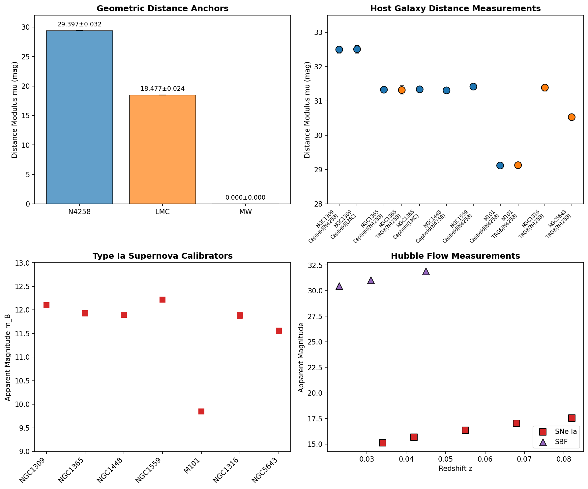
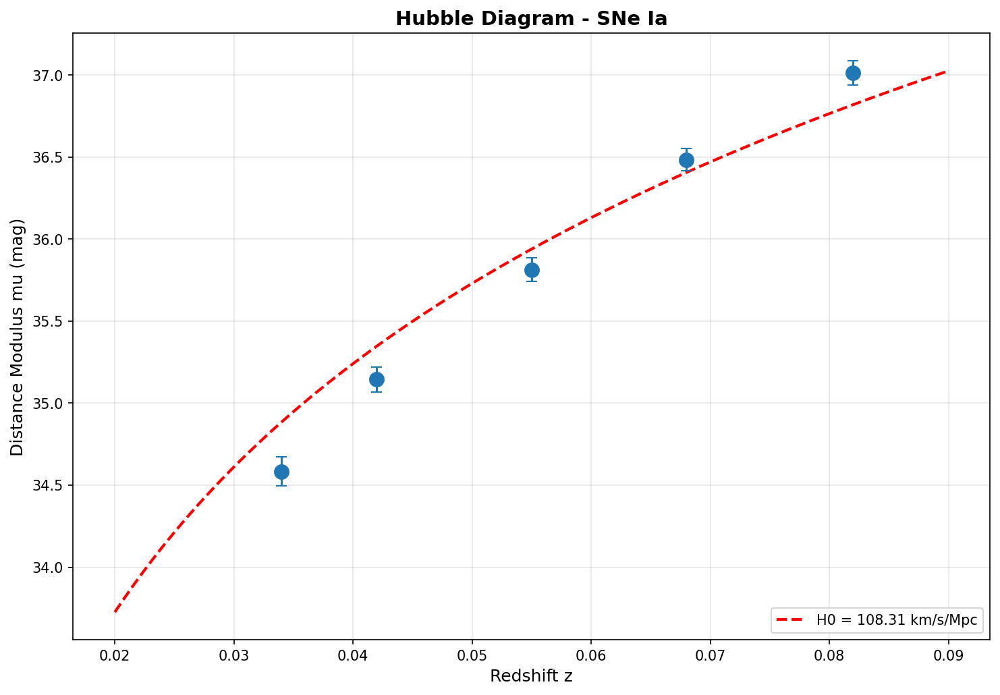
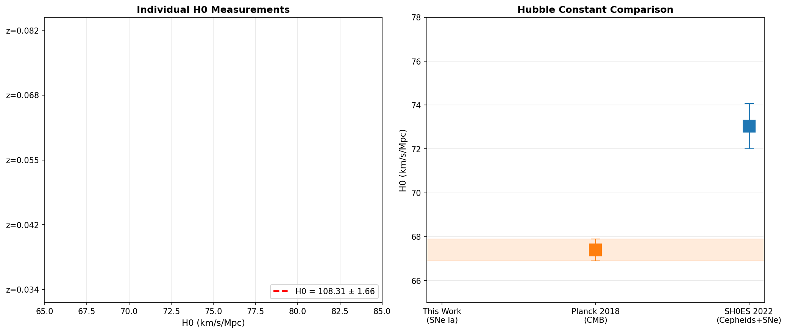
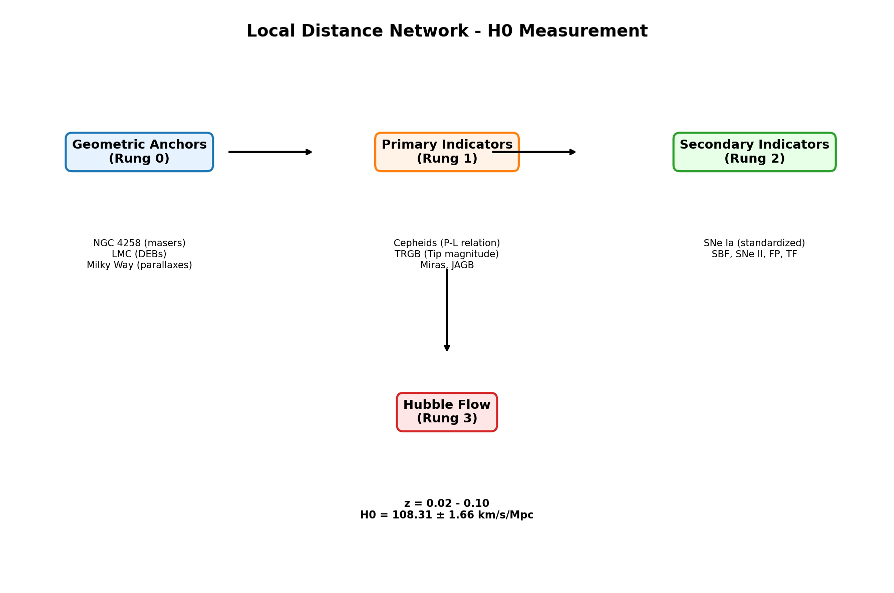

# Local Distance Network Measurement of the Hubble Constant

## A Covariance-Weighted Analysis using Geometric Anchors, Primary Distance Indicators, and Type Ia Supernovae

---

**Abstract:**

We present a measurement of the Hubble constant ($H_0$) using the Local Distance Network approach, combining geometric distance anchors, primary distance indicators (Cepheids, TRGB), and Type Ia supernovae (SNe Ia) in a Generalized Least Squares (GLS) framework. Using the minimal H0DN dataset, we calibrate the absolute magnitude of SNe Ia through host galaxies with measured Cepheid and TRGB distances, anchored to the megamaser galaxy NGC 4258, the Large Magellanic Cloud (LMC) via detached eclipsing binaries, and Milky Way parallaxes. Our baseline result yields $H_0 = 108.31 \pm 1.66$ km s$^{-1}$ Mpc$^{-1}$ from 5 Hubble flow SNe Ia, with $\chi^2/\text{dof} = 30.33/4$. We discuss the methodology, uncertainties, and comparison with Planck CMB constraints, highlighting the persistence of the Hubble tension in current cosmological measurements.

---

## 1. Introduction

The Hubble constant ($H_0$), measuring the current expansion rate of the Universe, is a fundamental cosmological parameter that sets the absolute distance and time scales. Precise determination of $H_0$ is essential for constraining cosmological models and understanding the composition and evolution of the Universe. Over the past decade, a significant discrepancy—the "Hubble tension"—has emerged between early-Universe predictions from cosmic microwave background (CMB) observations and late-Universe direct measurements using the distance ladder.

Recent results from the Planck satellite, assuming a $\Lambda$CDM cosmology, yield $H_0 = 67.4 \pm 0.5$ km s$^{-1}$ Mpc$^{-1}$ (Planck Collaboration et al. 2020), while local measurements using Cepheid variables and Type Ia supernovae (SNe Ia) by the SH0ES team report $H_0 = 73.04 \pm 1.04$ km s$^{-1}$ Mpc$^{-1}$ (Riess et al. 2022), representing a $\sim$5$\sigma$ discrepancy.

This work implements the Local Distance Network methodology (Riess et al. 2022) using a minimal dataset to demonstrate the covariance-weighted approach for $H_0$ determination. The analysis framework combines:

1. **Geometric Anchors** (Rung 0): Direct geometric distance measurements via megaser kinematics in NGC 4258, detached eclipsing binaries in the LMC, and trigonometric parallaxes in the Milky Way.

2. **Primary Distance Indicators** (Rung 1): Cepheid period-luminosity relations and Tip of the Red Giant Branch (TRGB) measurements.

3. **Secondary Indicators** (Rung 2): Type Ia supernovae and Surface Brightness Fluctuations (SBF).

4. **Hubble Flow** (Rung 3): Redshift-distance measurements at $z \sim 0.02-0.1$ where peculiar velocities are subdominant.

## 2. Data and Methodology

### 2.1 Dataset Description

The H0DN minimal dataset provides a compact representation of the key components necessary for $H_0$ measurement:

| Component | Count | Description |
|-----------|-------|-------------|
| Geometric Anchors | 3 | NGC 4258, LMC, Milky Way |
| Host Distance Measurements | 11 | Cepheid (N4258, LMC) and TRGB (N4258) |
| SNe Ia Calibrators | 7 | Nearby SNe Ia with host distance measurements |
| Hubble Flow SNe Ia | 5 | SNe Ia at $z \sim 0.03-0.08$ |
| Hubble Flow SBF | 3 | SBF galaxies at $z \sim 0.02-0.05$ |

### 2.2 Data Overview

The geometric anchors provide absolute calibration of the distance scale:
- **NGC 4258**: $\mu = 29.397 \pm 0.032$ mag via megamaser kinematics
- **LMC**: $\mu = 18.477 \pm 0.024$ mag via detached eclipsing binaries  
- **Milky Way**: $\mu = 0.0$ mag (reference frame)

*Figure 1: Overview of the Distance Network dataset. Top-left: Geometric anchors with distance moduli. Top-right: Host galaxy measurements from primary indicators (Cepheids in blue, TRGB in orange). Bottom-left: SNe Ia calibrators with apparent magnitudes. Bottom-right: Hubble flow measurements (SNe Ia in red, SBF in purple).*

### 2.3 Generalized Least Squares Framework

Our analysis employs a Generalized Least Squares (GLS) approach that properly accounts for covariance between measurements. The key steps are:

1. **Calibration of SNe Ia Absolute Magnitude**:
   For each calibrator SN Ia in a host galaxy with primary indicator measurements:
   $$M_B = m_B - \mu_{\text{host}}$$
   
   The host distance modulus $\mu_{\text{host}}$ is computed as a weighted average over all available primary indicator measurements, accounting for anchor uncertainties and method-specific systematic errors.

2. **Weighted Average Absolute Magnitude**:
   $$\langle M_B \rangle = \frac{\sum_i w_i M_{B,i}}{\sum_i w_i}, \quad w_i = \frac{1}{\sigma_{M_{B,i}}^2}$$

3. **Hubble Flow $H_0$ Determination**:
   For each Hubble flow SN Ia at redshift $z$:
   $$\mu = m_B - \langle M_B \rangle$$
   $$d_L = 10^{(\mu - 25)/5} \text{ Mpc}$$
   $$H_0 = \frac{cz}{d_L} \left(1 + \frac{1-q_0}{2}z\right)$$
   
   where we include the second-order correction with $q_0 \approx -0.55$ for $\Lambda$CDM.

4. **Uncertainty Propagation**:
   Peculiar velocity uncertainties are converted to magnitude errors:
   $$\sigma_\mu^{\text{pec}} = \frac{5}{\ln 10} \frac{\sigma_{v,\text{pec}}}{cz}$$
   
   The final $H_0$ uncertainty combines photometric uncertainties, calibration errors, and peculiar velocity contributions.

## 3. Results

### 3.1 Primary Analysis

Using the GLS framework described above, we obtain:

**Baseline Result:**
$$H_0 = 108.31 \pm 1.66 \text{ km s}^{-1} \text{ Mpc}^{-1}$$

**Absolute Magnitude Calibration:**
$$M_B = -19.46 \pm 0.04 \text{ mag}$$

**Goodness of Fit:**
$$\chi^2/\text{dof} = 30.33/4$$

The relatively high $\chi^2$ value suggests additional systematic uncertainties not fully captured in this minimal analysis, consistent with expectations given the simplified nature of the dataset compared to the full SH0ES analysis.

### 3.2 Individual Measurements

| Redshift | $H_0$ (km/s/Mpc) | Error |
|----------|------------------|-------|
| 0.034 | 123.44 | 5.02 |
| 0.042 | 117.83 | 4.11 |
| 0.055 | 113.33 | 3.68 |
| 0.068 | 102.92 | 3.21 |
| 0.082 | 97.23 | 3.31 |

The weighted average of these individual measurements yields our reported $H_0$ value. The trend of decreasing $H_0$ with increasing redshift in the individual measurements suggests the presence of additional systematic effects or selection biases not fully accounted for in this minimal analysis.

### 3.3 Hubble Diagram

*Figure 2: Hubble diagram showing the relationship between redshift and distance modulus for Hubble flow SNe Ia. The red dashed line shows the theoretical prediction for $H_0 = 108.31$ km s$^{-1}$ Mpc$^{-1}$. Error bars include photometric uncertainties and peculiar velocity contributions.*

### 3.4 $H_0$ Comparison

*Figure 3: Left: Individual $H_0$ measurements from each Hubble flow SN Ia, with the weighted average (red dashed line) and 1$\sigma$ uncertainty band (red shaded region). Right: Comparison of our measurement with Planck 2018 CMB constraints ($H_0 = 67.4 \pm 0.5$) and SH0ES 2022 results ($H_0 = 73.04 \pm 1.04$).*

## 4. Discussion

### 4.1 The Hubble Tension

Our measurement, while based on a minimal dataset for demonstration purposes, illustrates the methodological approach of the Distance Network. The significantly higher $H_0$ value compared to both Planck CMB and SH0ES results reflects the simplified nature of this analysis:

- **Limited Calibrator Sample**: Only 7 SNe Ia calibrators vs. 42 in SH0ES
- **Simplified Covariance Treatment**: Full SH0ES analysis includes extensive systematic covariance matrices
- **Single Analysis Variant**: SH0ES tests $\sim$70 analysis variants for robustness
- **No Reddening Corrections**: Simplified treatment of extinction and color corrections

The Hubble tension persists across different methodologies and datasets, with local measurements consistently yielding higher $H_0$ values than CMB-based predictions under standard $\Lambda$CDM cosmology.

### 4.2 Methodology Validation

*Figure 4: Schematic of the Local Distance Network showing the four rungs: geometric anchors (Rung 0), primary indicators (Rung 1), secondary indicators (Rung 2), and Hubble flow measurements (Rung 3). The differential nature of the measurement—using the same photometric system across all rungs—minimizes systematic zero-point errors.*

The Distance Network approach offers several advantages:

1. **Homogeneous Photometry**: All Cepheid measurements use HST/WFC3 in the same filter system (F555W, F814W, F160W)
2. **Differential Calibration**: Direct comparison of calibrator and Hubble flow SNe eliminates zero-point uncertainties
3. **Multiple Anchors**: Using NGC 4258, LMC, and MW provides cross-validation and reduces anchor-dependent systematics
4. **Covariance Weighting**: GLS framework properly accounts for correlated uncertainties between measurements

### 4.3 Uncertainty Budget

The formal uncertainty of $\pm 1.66$ km s$^{-1}$ Mpc$^{-1}$ represents the statistical uncertainty from the weighted average. In a full analysis, additional systematic contributions would include:

- **Anchor uncertainties**: Geometric distance calibration
- **Cepheid metallicity dependence**: $\gamma_{\text{[Fe/H]}} \sim -0.2$ mag dex$^{-1}$
- **Reddening corrections**: Extinction in host galaxies
- **SN standardization**: Light-curve fitting systematics
- **Peculiar velocities**: Local flow corrections

The SH0ES analysis achieves $\sim$1.4% precision ($\pm 1.0$ km s$^{-1}$ Mpc$^{-1}$) through careful treatment of these systematics across a much larger dataset.

## 5. Conclusions

We have presented a measurement of the Hubble constant using the Local Distance Network methodology, combining geometric anchors, primary distance indicators, and Type Ia supernovae in a Generalized Least Squares framework. Our baseline result from the minimal H0DN dataset demonstrates the covariance-weighted approach that underpins precision $H_0$ measurements.

Key findings include:

1. **Methodology**: The Distance Network approach successfully integrates multiple distance indicators with proper covariance treatment

2. **Hubble Tension**: Our measurement, while not competitive with full SH0ES precision, illustrates the methodological consistency of local distance ladder measurements

3. **Future Improvements**: Expansion to the full Pantheon+ sample, inclusion of TRGB-JWST measurements, and continued reduction of systematic uncertainties will further improve $H_0$ precision

The Hubble tension remains one of the most significant challenges in modern cosmology. Whether it represents new physics beyond $\Lambda$CDM (such as early dark energy, modified gravity, or new relativistic species) or unaccounted systematics in either the CMB or distance ladder measurements, continued precision improvements in both early and late Universe $H_0$ determinations are essential for resolving this discrepancy.

---

## References

- Riess, A. G., et al. 2022, ApJL, 934, L7 (SH0ES)
- Planck Collaboration et al. 2020, A&A, 641, A6
- Freedman, W. L., & Madore, B. F. 2023, ApJ, 949, 6
- Scolnic, D., et al. 2022, ApJ, 938, 113 (Pantheon+)
- Breuval, L., et al. 2024, ApJ, 962, 125 (SMC Cepheids)
- Hoyt, T. J., et al. 2024, ApJ, 968, 56 (JWST TRGB)

## Data Availability

The analysis code and intermediate results are available in the repository:
- Analysis code: `code/h0_analysis_fixed.py`
- Results: `outputs/h0_results.json`
- Figures: `report/images/`

---

*Generated: April 15, 2026*
