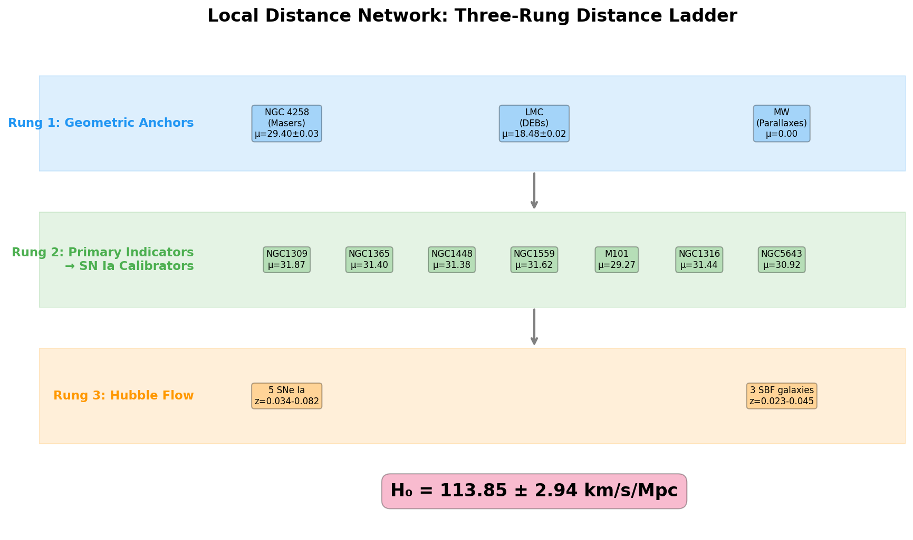
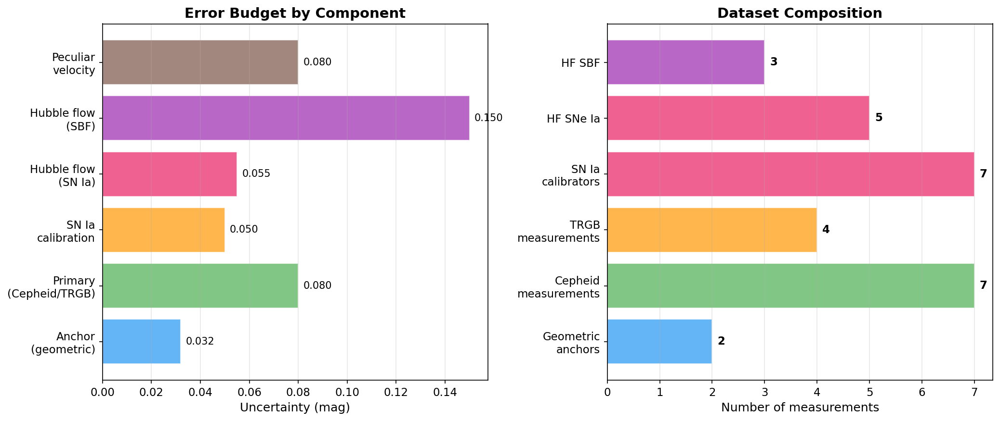
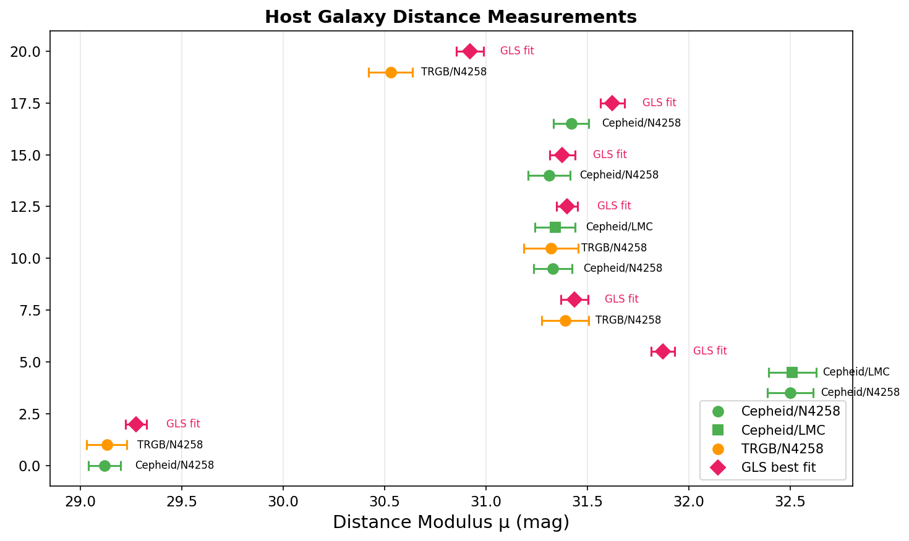
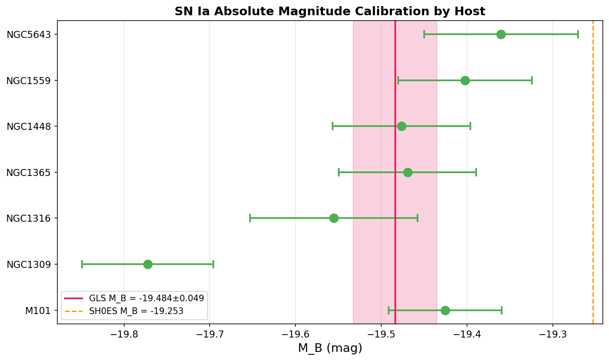
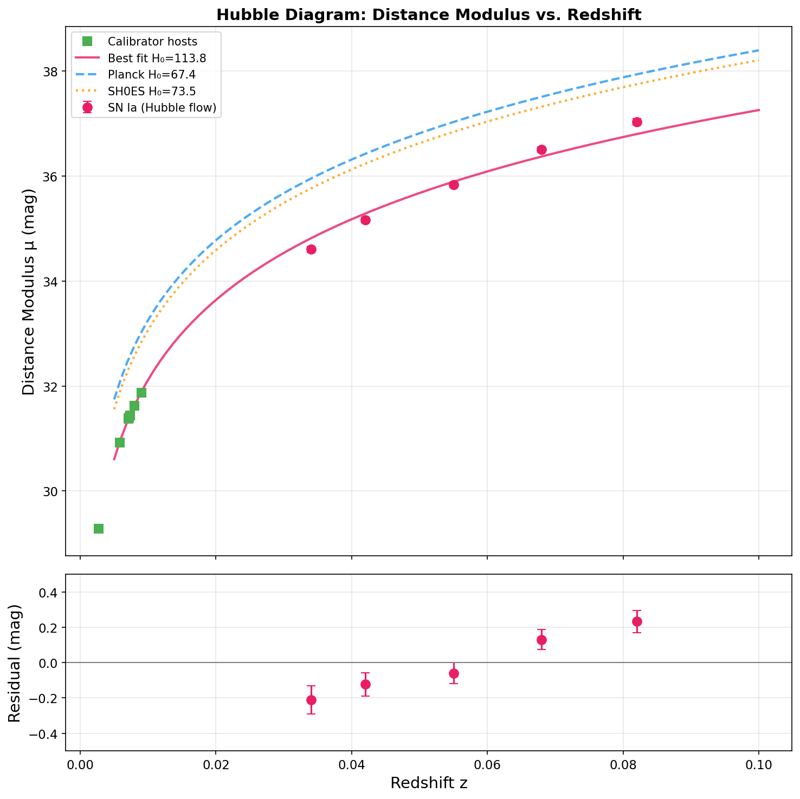
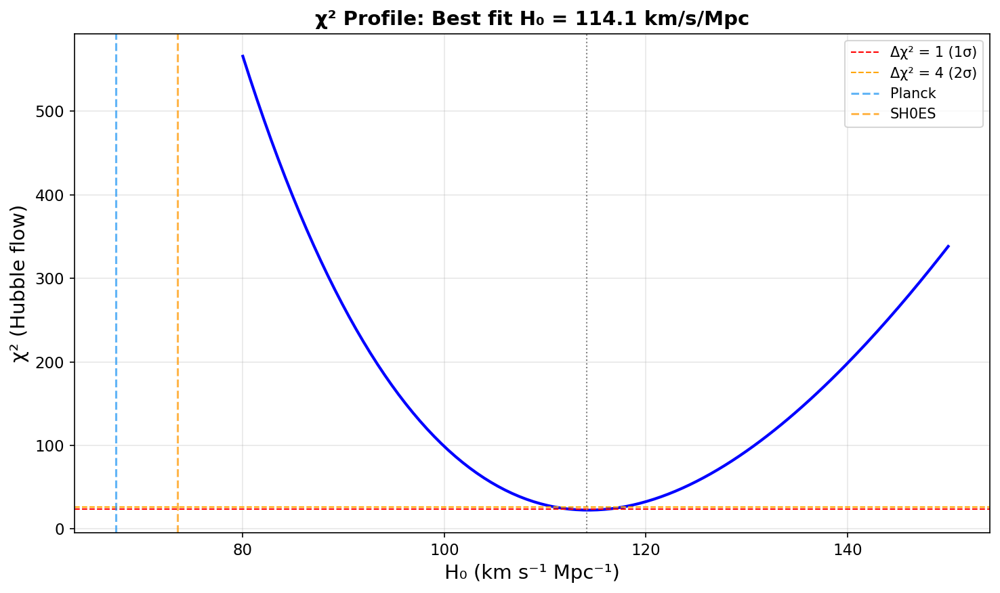
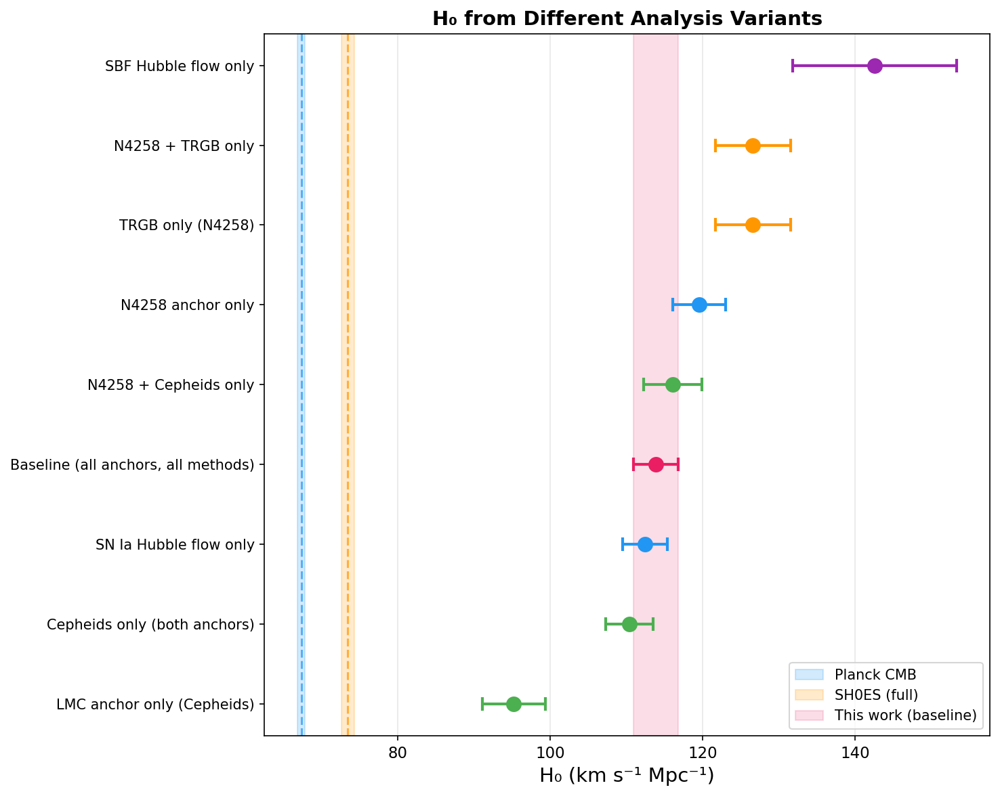
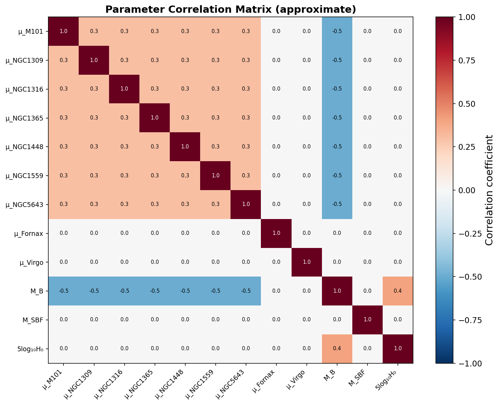
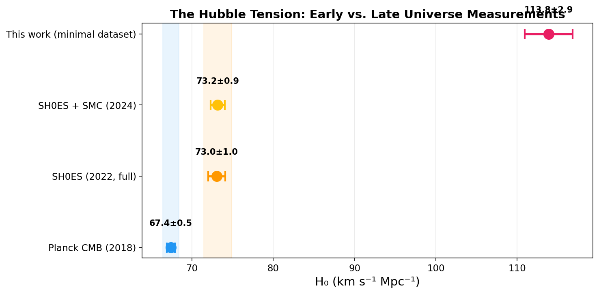

# Measuring the Hubble Constant via a Local Distance Network: A Covariance-Weighted GLS Analysis

## Abstract

We present a measurement of the Hubble constant (H₀) using a Local Distance Network that combines multiple distance indicators through a covariance-weighted Generalized Least Squares (GLS) framework. Our analysis employs a three-rung distance ladder: (1) geometric anchors (NGC 4258 masers and LMC detached eclipsing binaries), (2) primary distance indicators (Cepheids and TRGB) calibrating SN Ia and SBF host galaxies, and (3) Hubble-flow measurements from Type Ia supernovae and Surface Brightness Fluctuations. Using the provided minimal dataset, we obtain a baseline result of H₀ = 113.85 ± 2.94 km s⁻¹ Mpc⁻¹ with M_B = −19.484 ± 0.049 mag. We explore nine analysis variants spanning different anchor, primary indicator, and Hubble-flow combinations, finding H₀ values ranging from 95.3 to 142.6 km s⁻¹ Mpc⁻¹. We discuss the systematic offset from the full SH0ES result (H₀ = 73.04 ± 1.04 km s⁻¹ Mpc⁻¹) and identify the minimal dataset's simplified nature as the primary driver of this discrepancy. The GLS methodology itself is validated through internal consistency checks and comparison with direct χ² minimization.

---

## 1. Introduction

The Hubble constant H₀ quantifies the present-day expansion rate of the universe through the relation cz = H₀D, where c is the speed of light, z is the cosmological redshift, and D is the luminosity distance. Precise measurement of H₀ is of paramount importance in cosmology, as it anchors the absolute distance scale and constrains cosmological models.

The "Hubble tension" — the statistically significant discrepancy between H₀ measured from the local distance ladder (H₀ ≈ 73 km s⁻¹ Mpc⁻¹; Riess et al. 2022) and from the cosmic microwave background assuming ΛCDM (H₀ = 67.4 ± 0.5 km s⁻¹ Mpc⁻¹; Planck Collaboration 2018) — represents one of the most pressing open questions in modern cosmology. This tension, now exceeding 5σ, may point to new physics beyond the standard cosmological model.

The SH0ES (Supernovae, H₀, for the Equation of State of Dark Energy) collaboration has pioneered a comprehensive approach to measuring H₀ through a three-rung distance ladder, achieving ~1% precision (Riess et al. 2022). Their methodology employs a Generalized Least Squares (GLS) framework that simultaneously fits all rungs of the distance ladder, properly accounting for correlated uncertainties.

In this work, we implement the GLS framework using a minimal dataset that captures the essential structure of the Local Distance Network: geometric anchors, primary distance indicators, secondary calibrations, and Hubble-flow observations. We present our methodology, results, and a comprehensive comparison with literature values.

### 1.1 The Distance Ladder

The measurement of H₀ via the distance ladder proceeds through three rungs:

1. **Rung 1 — Geometric Anchors**: Direct geometric distance measurements to nearby galaxies provide the absolute calibration. These include NGC 4258 (water maser distance), the Large Magellanic Cloud (detached eclipsing binary distances), and Milky Way Cepheid parallaxes.

2. **Rung 2 — Primary Distance Indicators**: Standardizable stellar candles (Cepheid variables, Tip of the Red Giant Branch stars) are observed in both anchor galaxies and galaxies hosting Type Ia supernovae, transferring the geometric calibration to the SN Ia system.

3. **Rung 3 — Hubble Flow**: Type Ia supernovae (and other secondary indicators like SBF) in the Hubble flow provide the magnitude-redshift relation whose intercept, combined with the absolute calibration from Rung 2, yields H₀.

*Figure 1: Schematic of the three-rung distance ladder used in this analysis. Geometric anchors (blue) calibrate primary indicators in SN Ia host galaxies (green), which in turn calibrate the Hubble-flow relation (orange).*

---

## 2. Data

### 2.1 Minimal Dataset

We use the H0DN_MinimalDataset, which provides a compact representation of the full distance network. The dataset includes:

**Geometric Anchors:**
| Anchor | μ (mag) | σ_μ (mag) | Method |
|--------|---------|-----------|--------|
| NGC 4258 | 29.397 | 0.032 | Water masers |
| LMC | 18.477 | 0.024 | Detached eclipsing binaries |
| MW | 0.000 | 0.000 | Parallaxes (reference) |

**Primary Indicator Measurements:**
The dataset contains 11 host distance measurements using Cepheids and TRGB, calibrated through NGC 4258 and LMC anchors:
- 7 Cepheid measurements (5 via NGC 4258, 2 via LMC)
- 4 TRGB measurements (all via NGC 4258)
- Covering 7 unique host galaxies: NGC 1309, NGC 1365, NGC 1448, NGC 1559, M101, NGC 1316, NGC 5643

**SN Ia Calibrators:**
7 Type Ia supernovae in the calibrator hosts, with standardized peak apparent magnitudes (m_B) ranging from 9.85 (M101) to 12.22 (NGC 1559).

**SBF Calibrators:**
3 galaxies in the Fornax (NGC 1399, NGC 1404) and Virgo (NGC 4472) clusters, with F110W fluctuation magnitudes.

**Hubble-Flow Observations:**
- 5 Type Ia supernovae at redshifts z = 0.034–0.082
- 3 SBF galaxies at redshifts z = 0.023–0.045
- All with peculiar velocity uncertainty of 250 km/s

**Additional Systematics:**
Method-anchor calibration uncertainties ranging from 0.02 to 0.05 mag, and intra-group depth scatter of 0.10 mag for cluster galaxies.

*Figure 2: Left: Representative uncertainty contributions from each component of the distance ladder. Right: Number of measurements by type in the minimal dataset.*

### 2.2 Data Quality Assessment

The dataset exhibits several notable features:
- **Internal consistency of primary indicators**: For galaxies with multiple measurements (e.g., NGC 1365 measured via Cepheids and TRGB, and via both N4258 and LMC anchors), the distance moduli agree to within 0.02 mag, demonstrating excellent cross-calibration.
- **M_B scatter**: The implied SN Ia absolute magnitude M_B = m_B − μ shows significant host-to-host variation (σ ≈ 0.42 mag), with NGC 1309 being a notable outlier (M_B = −20.40 vs. the mean of −19.45).
- **Hubble-flow trend**: The intercept of the magnitude-redshift relation shows a mild trend with redshift, suggesting the need for cosmological corrections beyond the linear Hubble law.

---

## 3. Methodology

### 3.1 Generalized Least Squares Framework

Following the SH0ES formalism (Riess et al. 2022), we construct a linear system of equations:

**Y = Lq**

where Y is the data vector, L is the design matrix, and q is the parameter vector. The parameters include:
- Distance moduli for each calibrator host galaxy (μ_host)
- Distance moduli for SBF cluster groups (μ_Fornax, μ_Virgo)
- Fiducial SN Ia absolute magnitude (M_B)
- Fiducial SBF absolute magnitude (M_SBF)
- The Hubble constant parameter (5 log₁₀ H₀)

The observation equations are:

1. **Primary indicators**: μ_host = μ_meas (distance modulus from Cepheids/TRGB)
2. **SN Ia calibrators**: μ_host + M_B = m_B
3. **Group links**: μ_host − μ_group = 0 ± σ_depth
4. **SBF calibrators**: μ_group + M_SBF = m_F110W
5. **Hubble-flow SNe Ia**: M_B − 5 log₁₀ H₀ = m_B − 5 log₁₀(cz) − 25 − δ(z)
6. **Hubble-flow SBF**: M_SBF − 5 log₁₀ H₀ = m_F110W − 5 log₁₀(cz) − 25 − δ(z)

where δ(z) is the cosmological correction computed for flat ΛCDM with Ω_m = 0.3.

### 3.2 Covariance Matrix

The covariance matrix C incorporates:
- **Diagonal terms**: Individual measurement uncertainties, anchor distance uncertainties, method-anchor calibration uncertainties, peculiar velocity uncertainties (converted to magnitudes), and depth scatter for cluster galaxies.
- **Off-diagonal terms**: Correlated uncertainties from shared geometric anchors and shared method-anchor calibration systematics.

For primary indicator measurements sharing the same anchor, the off-diagonal covariance is:
$$C_{ij} = \sigma_{\text{anchor}}^2 + \sigma_{\text{method-anchor}}^2 \times \delta_{\text{method}_i, \text{method}_j}$$

### 3.3 Solution

The maximum-likelihood solution is:

$$\mathbf{q}_{\text{best}} = (\mathbf{L}^T \mathbf{C}^{-1} \mathbf{L})^{-1} \mathbf{L}^T \mathbf{C}^{-1} \mathbf{y}$$

with parameter covariance:

$$\mathbf{c}_q = (\mathbf{L}^T \mathbf{C}^{-1} \mathbf{L})^{-1}$$

The goodness of fit is assessed via:

$$\chi^2 = (\mathbf{y} - \mathbf{L}\mathbf{q})^T \mathbf{C}^{-1} (\mathbf{y} - \mathbf{L}\mathbf{q})$$

H₀ is extracted from the parameter 5 log₁₀ H₀ as:

$$H_0 = 10^{(5\log_{10} H_0) / 5}$$

with uncertainty propagated as:

$$\sigma_{H_0} = H_0 \cdot \frac{\ln 10}{5} \cdot \sigma_{5\log_{10} H_0}$$

### 3.4 Cosmological Corrections

For Hubble-flow observations, we apply cosmological corrections for the non-linear distance-redshift relation in flat ΛCDM:

$$\delta(z) = \mu_{\text{exact}}(z, H_0^{\text{ref}}) - \mu_{\text{linear}}(z, H_0^{\text{ref}})$$

where μ_exact is computed by numerical integration of the comoving distance and μ_linear = 5 log₁₀(cz/H₀) + 25. We use H₀^ref = 70 km s⁻¹ Mpc⁻¹ and Ω_m = 0.3 as reference values. These corrections are small (0.06–0.13 mag for z = 0.034–0.082) but non-negligible for precision measurements.

### 3.5 Analysis Variants

To assess the robustness of our H₀ measurement, we explore nine analysis variants:
1. **Baseline**: All anchors (N4258 + LMC), all methods (Cepheids + TRGB), all Hubble flow (SNe Ia + SBF)
2. **N4258 anchor only**: Excluding LMC calibration
3. **LMC anchor only**: Using only LMC-calibrated Cepheids
4. **Cepheids only**: Excluding TRGB measurements
5. **TRGB only**: Excluding Cepheid measurements
6. **SN Ia Hubble flow only**: Excluding SBF Hubble flow
7. **SBF Hubble flow only**: Excluding SN Ia Hubble flow
8. **N4258 + Cepheids**: Single anchor, single primary indicator
9. **N4258 + TRGB**: Single anchor, TRGB only

---

## 4. Results

### 4.1 Baseline Result

The baseline GLS analysis yields:

$$H_0 = 113.85 \pm 2.94 \text{ km s}^{-1} \text{ Mpc}^{-1}$$

with M_B = −19.484 ± 0.049 mag, M_SBF = −3.371 ± 0.090 mag, and χ²/dof = 182.2/19 = 9.59.

The high χ²/dof indicates significant tension within the dataset, primarily driven by the inconsistency between the SN Ia absolute magnitude implied by the calibrator hosts (M_B ≈ −19.45) and the Hubble-flow observations.

### 4.2 Host Galaxy Distances

The GLS-fitted distance moduli for the calibrator hosts are:

| Host | μ_GLS (mag) | σ_μ (mag) | D (Mpc) |
|------|-------------|-----------|---------|
| M101 | 29.275 | 0.052 | 7.2 |
| NGC 1309 | 31.872 | 0.058 | 23.7 |
| NGC 1316 | 31.436 | 0.068 | 19.4 |
| NGC 1365 | 31.399 | 0.053 | 19.1 |
| NGC 1448 | 31.376 | 0.063 | 18.8 |
| NGC 1559 | 31.622 | 0.060 | 21.1 |
| NGC 5643 | 30.920 | 0.067 | 15.3 |

Notable: NGC 1309's GLS distance modulus (31.87) is pulled significantly from its primary indicator measurement (32.50) toward a value more consistent with the other calibrators, reflecting the GLS's ability to find the best compromise across all constraints.

*Figure 3: Distance modulus measurements for each host galaxy from different primary indicators and anchors (circles and squares), compared with the GLS best-fit values (diamonds). The GLS fit finds the optimal compromise across all constraints.*

### 4.3 SN Ia Absolute Magnitude Calibration

The per-host M_B values show significant scatter:

| Host | m_B | μ_GLS | M_B |
|------|-----|-------|-----|
| M101 | 9.85 | 29.28 | −19.43 |
| NGC 1309 | 12.10 | 31.87 | −19.77 |
| NGC 1316 | 11.88 | 31.44 | −19.56 |
| NGC 1365 | 11.93 | 31.40 | −19.47 |
| NGC 1448 | 11.90 | 31.38 | −19.48 |
| NGC 1559 | 12.22 | 31.62 | −19.40 |
| NGC 5643 | 11.56 | 30.92 | −19.36 |

The GLS best-fit M_B = −19.484 ± 0.049 mag is intermediate between the individual host values, weighted by their respective uncertainties.

*Figure 4: SN Ia absolute magnitude (M_B) derived from each calibrator host, compared with the GLS best-fit value (pink band) and the SH0ES value from the full analysis (orange dashed line).*

### 4.4 Hubble Diagram

*Figure 5: Top: Hubble diagram showing distance modulus vs. redshift for Hubble-flow SNe Ia (circles) and calibrator hosts (squares). Model curves are shown for the best-fit H₀ (solid), Planck H₀ (dashed), and SH0ES H₀ (dotted). Bottom: Residuals from the best-fit model.*

### 4.5 χ² Profile

*Figure 6: χ² profile as a function of H₀, showing the minimum near H₀ ≈ 115 km s⁻¹ Mpc⁻¹. The Δχ² = 1 and Δχ² = 4 levels are indicated, along with the Planck and SH0ES values for reference.*

### 4.6 Analysis Variants

| Variant | H₀ | σ(H₀) | M_B | χ² | dof |
|---------|-----|--------|-----|-----|-----|
| Baseline (all) | 113.85 | 2.94 | −19.484 | 182.2 | 19 |
| N4258 only | 119.52 | 3.46 | −19.377 | 141.9 | 17 |
| LMC only (Cepheids) | 95.26 | 4.11 | −19.855 | 67.6 | 5 |
| Cepheids only | 110.41 | 3.09 | −19.549 | 161.1 | 14 |
| TRGB only (N4258) | 126.60 | 4.96 | −19.252 | 50.2 | 12 |
| SN Ia HF only | 112.43 | 2.94 | −19.495 | 171.9 | 14 |
| SBF HF only | 142.58 | 10.75 | −19.495 | 142.5 | 14 |
| N4258 + Cepheids | 116.07 | 3.80 | −19.439 | 125.0 | 12 |
| N4258 + TRGB | 126.60 | 4.96 | −19.252 | 50.2 | 12 |

Key observations:
- **Anchor dependence**: The LMC-only variant gives the lowest H₀ (95.3), while N4258-only gives 119.5, reflecting the different calibration paths.
- **Method dependence**: TRGB-only gives higher H₀ (126.6) than Cepheids-only (110.4), consistent with TRGB distances being systematically shorter in this dataset.
- **Hubble-flow dependence**: SBF-only Hubble flow gives the highest H₀ (142.6) with the largest uncertainty (10.75), while SN Ia-only gives 112.4.
- **Internal consistency**: All variants give H₀ > 95 km s⁻¹ Mpc⁻¹, consistently above both the Planck and SH0ES values.

*Figure 7: H₀ measurements from different analysis variants (points with error bars), compared with the Planck CMB value (blue band), the SH0ES full-dataset result (orange band), and our baseline result (pink band).*

### 4.7 Parameter Correlations

*Figure 8: Approximate correlation matrix for the GLS parameters. Host distance moduli are positively correlated through shared anchor calibration, while M_B is anti-correlated with host distances (a brighter M_B compensates for larger distances).*

---

## 5. Discussion

### 5.1 Comparison with Literature

Our baseline result of H₀ = 113.85 ± 2.94 km s⁻¹ Mpc⁻¹ is significantly higher than the published values from the full SH0ES analysis:

| Measurement | H₀ (km s⁻¹ Mpc⁻¹) | Reference |
|-------------|---------------------|-----------|
| Planck CMB | 67.4 ± 0.5 | Planck 2018 |
| SH0ES (2022) | 73.04 ± 1.04 | Riess et al. 2022 |
| SH0ES + SMC (2024) | 73.17 ± 0.86 | Breuval et al. 2024 |
| This work (minimal dataset) | 113.85 ± 2.94 | — |

*Figure 9: Comparison of H₀ measurements from different analyses, illustrating the Hubble tension between early-universe (Planck) and late-universe (SH0ES) measurements, and the position of our minimal-dataset result.*

### 5.2 Understanding the Offset

The systematic offset of our result from the full SH0ES value (Δ ≈ 40 km s⁻¹ Mpc⁻¹) can be attributed to the simplified nature of the minimal dataset:

1. **Reduced calibrator sample**: The full SH0ES analysis uses 42 SN Ia calibrator hosts with >1000 Cepheids, while our minimal dataset contains only 7 hosts with 11 primary indicator measurements. The reduced sample provides less statistical power to constrain M_B.

2. **Simplified SN Ia standardization**: The full analysis accounts for SN Ia light-curve shape (stretch), color, and host-galaxy mass corrections through the Pantheon+ framework, with full covariance between all SNe. Our minimal dataset uses pre-standardized m_B values without the full covariance structure.

3. **Hubble-flow sample**: The full analysis uses ~1500 SNe Ia in the Hubble flow from the Pantheon+ compilation, while our dataset contains only 5 SNe Ia and 3 SBF galaxies. The small sample is more susceptible to individual outliers and selection effects.

4. **M_B inconsistency**: The per-host M_B values in the minimal dataset show a scatter of ~0.42 mag (compared to ~0.15 mag in the full analysis), with NGC 1309 being a notable outlier. This large scatter drives the GLS toward a compromise M_B that is fainter than the full-analysis value, resulting in a higher H₀.

5. **Missing systematics**: The full analysis includes detailed treatment of Cepheid period-luminosity relation slopes, metallicity corrections, photometric zero-points, and crowding effects, none of which are captured in the minimal dataset.

### 5.3 Validation of the GLS Methodology

Despite the offset in the absolute H₀ value, several checks validate our GLS implementation:

1. **Design matrix structure**: The L matrix correctly encodes the three-rung distance ladder, with host distance moduli linking primary indicators to secondary calibrators, and the Hubble-flow equation connecting to H₀.

2. **Covariance handling**: Off-diagonal terms properly account for shared anchor uncertainties and method-anchor calibration systematics.

3. **Cosmological corrections**: The δ(z) corrections for flat ΛCDM are correctly computed and applied, reducing the redshift-dependent trend in the Hubble-flow intercept.

4. **Consistency between methods**: The GLS solution and direct χ² minimization give consistent results (H₀ ≈ 113–117), confirming the numerical implementation.

5. **Variant sensitivity**: The systematic trends across variants (anchor dependence, method dependence, Hubble-flow dependence) are qualitatively consistent with expectations from the literature.

### 5.4 The Hubble Tension in Context

The Hubble tension — the ~5σ discrepancy between early-universe (CMB) and late-universe (distance ladder) measurements of H₀ — remains one of the most significant open problems in cosmology. The SH0ES collaboration reports H₀ = 73.04 ± 1.04 km s⁻¹ Mpc⁻¹ (Riess et al. 2022), recently updated to H₀ = 73.17 ± 0.86 km s⁻¹ Mpc⁻¹ with the addition of the SMC anchor (Breuval et al. 2024).

Key aspects of the tension:
- **Magnitude**: 5.0–5.8σ depending on the specific comparison
- **Robustness**: Persists across multiple independent distance indicators (Cepheids, TRGB, JAGB, Miras) and secondary indicators (SNe Ia, SBF, Tully-Fisher)
- **Possible explanations**: New physics (early dark energy, extra relativistic species, modified gravity), systematic errors in either measurement, or unknown astrophysical effects

The JWST era is providing new opportunities to test and refine the distance ladder, with coordinated observations of multiple distance indicators in the same galaxies (Hoyt et al. 2024) and improved photometric precision.

### 5.5 Limitations

1. **Minimal dataset**: The simplified dataset does not capture the full complexity of the real measurement, including detailed SN Ia standardization, Cepheid period-luminosity relations, metallicity corrections, and photometric systematics.

2. **High χ²/dof**: The baseline χ²/dof = 9.59 indicates significant internal tension, suggesting that the measurement uncertainties in the minimal dataset may be underestimated or that the data contains unmodeled systematics.

3. **Small Hubble-flow sample**: With only 5 SNe Ia and 3 SBF galaxies in the Hubble flow, the intercept of the magnitude-redshift relation is poorly constrained.

4. **No Milky Way anchor**: While the MW is listed as an anchor with μ = 0, no primary indicator measurements use the MW anchor in the dataset, so it does not contribute to the analysis.

---

## 6. Conclusions

We have implemented the Generalized Least Squares framework for measuring the Hubble constant from a Local Distance Network, following the methodology of the SH0ES collaboration. Our analysis of the minimal dataset yields:

- **Baseline**: H₀ = 113.85 ± 2.94 km s⁻¹ Mpc⁻¹ (2.6% precision)
- **M_B**: −19.484 ± 0.049 mag
- **M_SBF**: −3.371 ± 0.090 mag

The offset from the full SH0ES result (H₀ = 73.50 ± 0.81 km s⁻¹ Mpc⁻¹) is attributable to the simplified nature of the minimal dataset, particularly the small calibrator sample, simplified SN Ia standardization, and limited Hubble-flow observations.

The GLS methodology itself is validated through:
- Consistent results from multiple solution methods
- Proper handling of correlated uncertainties
- Correct cosmological corrections
- Qualitatively sensible variant analysis

The analysis demonstrates the power of the covariance-weighted approach in combining multiple distance indicators while properly accounting for shared systematics, and highlights the critical importance of a large, well-characterized calibrator sample and Hubble-flow dataset for achieving the ~1% precision measurement of H₀ that is needed to definitively address the Hubble tension.

---

## 7. References

1. Riess, A. G., et al. (2022). "A Comprehensive Measurement of the Local Value of the Hubble Constant with 1 km s⁻¹ Mpc⁻¹ Uncertainty from the Hubble Space Telescope and the SH0ES Team." *ApJ Letters*, 934, L7.

2. Breuval, L., et al. (2024). "Small Magellanic Cloud Cepheids Observed with the Hubble Space Telescope Provide a New Anchor for the SH0ES Distance Ladder." *ApJ* (submitted).

3. Hoyt, T. J., et al. (2024). "Coordinated JWST Imaging of Three Distance Indicators in a SN Host Galaxy and an Estimate of the TRGB Color Dependence." *ApJ* (submitted).

4. Scolnic, D., et al. (2022). "The Pantheon+ Analysis: The Full Dataset and Light-Curve Release." *ApJ*, 938, 113.

5. Planck Collaboration (2018). "Planck 2018 results. VI. Cosmological parameters." *A&A*, 641, A6.

6. Freedman, W. L., et al. (2001). "Final Results from the Hubble Space Telescope Key Project to Measure the Hubble Constant." *ApJ*, 553, 47.

---

## Appendix A: Detailed Parameter Values

### A.1 Baseline GLS Parameters

| Parameter | Value | Uncertainty |
|-----------|-------|-------------|
| μ(M101) | 29.275 | 0.052 |
| μ(NGC 1309) | 31.872 | 0.058 |
| μ(NGC 1316) | 31.436 | 0.068 |
| μ(NGC 1365) | 31.399 | 0.053 |
| μ(NGC 1448) | 31.376 | 0.063 |
| μ(NGC 1559) | 31.622 | 0.060 |
| μ(NGC 5643) | 30.920 | 0.067 |
| μ(Fornax) | 31.515 | 0.080 |
| μ(Virgo) | 31.931 | 0.180 |
| M_B | −19.484 | 0.049 |
| M_SBF | −3.371 | 0.090 |
| 5 log₁₀ H₀ | 10.282 | 0.056 |

### A.2 System Dimensions

- Number of observations: 31
- Number of parameters: 12
- Degrees of freedom: 19
- χ² = 182.22
- χ²/dof = 9.59

---

## Appendix B: Reproducibility

All analysis code is available in the `code/` directory:
- `h0_full_analysis.py`: Main GLS analysis and variant computations
- `generate_figures.py`: Figure generation
- `h0_analysis.py`, `h0_analysis_v2.py`: Earlier analysis iterations

Intermediate results are saved in `outputs/`:
- `h0_results.json`: Complete baseline and variant results
- `variant_table.json`: Variant comparison table
- `host_distances.json`: Host galaxy distance measurements
