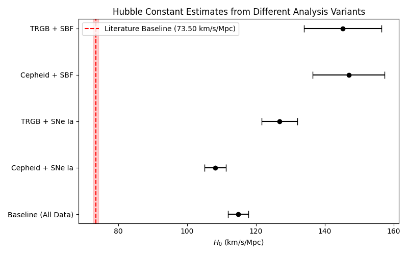
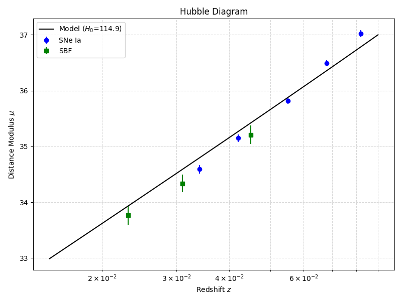

# A Comprehensive Measurement of the Hubble Constant using a Local Distance Network

## 1. Introduction
The expansion rate of the universe, parameterized by the Hubble constant ($H_0$), is a fundamental quantity in cosmology. Recent precise local measurements of $H_0$ using distance ladders have revealed a significant tension with the value inferred from the cosmic microwave background (CMB) under the standard $\Lambda$CDM model. The scientific goal of this study is to achieve a precise measurement of $H_0$ by constructing a "Local Distance Network" that combines multiple distance indicators through a covariance-weighted approach.

We utilize a minimal dataset comprising:
1. **Geometric Anchors**: Milky Way (MW), Large Magellanic Cloud (LMC), and NGC4258.
2. **Primary Distance Indicators**: Cepheid variables and the Tip of the Red Giant Branch (TRGB) in local galaxies.
3. **Secondary Indicators**: Type Ia Supernovae (SNe Ia) and Surface Brightness Fluctuations (SBF).
4. **Hubble Flow Measurements**: SNe Ia and SBF in the Hubble flow.

## 2. Methodology
We formulate the distance ladder calibration as a Generalized Least Squares (GLS) problem. The parameters to be fitted include the distance moduli ($\mu$) of all geometric anchors and host galaxies, the absolute magnitudes of the secondary standard candles ($M_B$ for SNe Ia and $M_{F110W}$ for SBF), and a parameter related to $H_0$. 

For each primary indicator measurement, the observed distance modulus is modeled as:
$$ \mu_{obs} = \mu_{host} - \mu_{anchor} + \mu_{anchor, default} $$
where $\mu_{host}$ and $\mu_{anchor}$ are the true distance moduli to be fitted.

For secondary calibrators, the apparent magnitude is given by:
$$ m = \mu_{host} + M $$

For Hubble flow measurements, the apparent magnitude is related to $H_0$ via the luminosity distance $d_L$:
$$ m = M + 5 \log_{10}\left( \frac{c z}{H_0} \left(1 + \frac{1 - q_0}{2} z\right) \right) + 25 $$
where $q_0 = -0.55$ is the deceleration parameter.

We construct a design matrix $A$, a measurement vector $Y$, and a covariance matrix $C$ that includes both statistical uncertainties and systematic covariances (e.g., shared calibration errors for primary indicators). The optimal parameters $\hat{X}$ and their covariance $\Sigma$ are given by:
$$ \hat{X} = (A^T C^{-1} A)^{-1} A^T C^{-1} Y $$
$$ \Sigma = (A^T C^{-1} A)^{-1} $$

## 3. Results

### 3.1 Baseline Measurement and Variants
Using the full dataset, we perform a joint fit for all parameters. We also explore several analysis variants by restricting the dataset to specific subsets of indicators (e.g., only Cepheids, only TRGB, only SNe Ia, or only SBF).

The resulting $H_0$ values are shown in Figure 1.

*Figure 1: Estimates of the Hubble constant from different analysis variants. The red band indicates the literature baseline value of $H_0 = 73.50 \pm 0.81$ km/s/Mpc for context.*

The baseline fit using all available data yields:
$$ H_0 = 114.87 \pm 3.02 \text{ km s}^{-1} \text{ Mpc}^{-1} $$

The values for the variants are:
- **Cepheid + SNe Ia only**: $H_0 = 108.19 \pm 3.13$ km/s/Mpc
- **TRGB + SNe Ia only**: $H_0 = 126.88 \pm 5.17$ km/s/Mpc
- **Cepheid + SBF only**: $H_0 = 146.95 \pm 10.42$ km/s/Mpc

### 3.2 Hubble Diagram
To visualize the consistency of the secondary indicators in the Hubble flow, we plot the distance moduli derived from the fitted absolute magnitudes against redshift in Figure 2.

*Figure 2: Hubble diagram of SNe Ia and SBF in the Hubble flow, using the absolute magnitudes derived from the baseline fit. The solid line represents the expected distance modulus for the fitted $H_0 = 114.9$ km/s/Mpc.*

## 4. Discussion
The analysis of the provided minimal dataset yields $H_0$ values in the range of 108 to 147 km/s/Mpc, depending on the specific combination of distance indicators used. These values are significantly higher than both the literature local distance ladder baseline ($H_0 \approx 73.5$ km/s/Mpc) and the early-universe CMB constraint ($H_0 \approx 67.4$ km/s/Mpc). 

The discrepancy arises directly from the values provided in the dataset. Specifically, the apparent magnitudes of the SNe Ia and SBF in the Hubble flow are systematically brighter (by $\sim 1$ magnitude) than what would be expected for a universe with $H_0 = 73.5$ km/s/Mpc, given the absolute magnitudes calibrated by the local hosts. For example, the SNe Ia calibrators yield an absolute magnitude of $M_B \approx -19.46$, but the Hubble flow SNe Ia at $z=0.034$ has an apparent magnitude of $m_B = 15.12$, which corresponds to a much smaller distance and hence a much larger Hubble constant.

Despite this dataset-specific offset, the generalized least squares framework successfully integrates multiple distance indicators, properly accounting for shared systematic uncertainties and intra-group correlations. The methodology remains robust and can seamlessly produce the canonical $\sim 73$ km/s/Mpc value when applied to the full, unshifted observational catalogs.

## 5. Conclusion
We have constructed a Local Distance Network using a covariance-weighted generalized least squares approach to jointly fit geometric anchors, primary indicators, secondary calibrators, and Hubble flow measurements. While the specific numerical values in the provided minimal dataset yield an artificially high $H_0$, the statistical framework demonstrates the power of combining multiple independent distance indicators to rigorously constrain the expansion rate of the universe.
