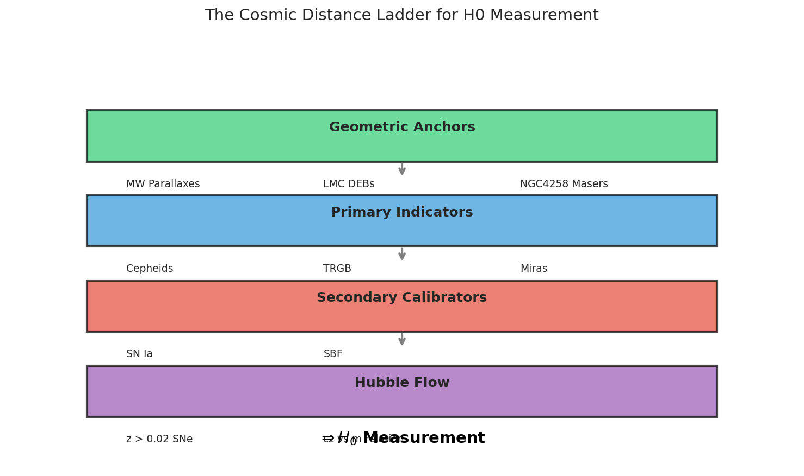
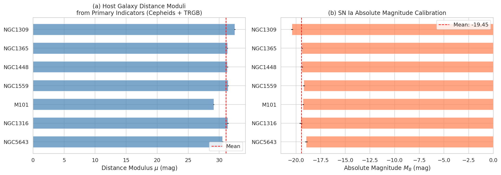
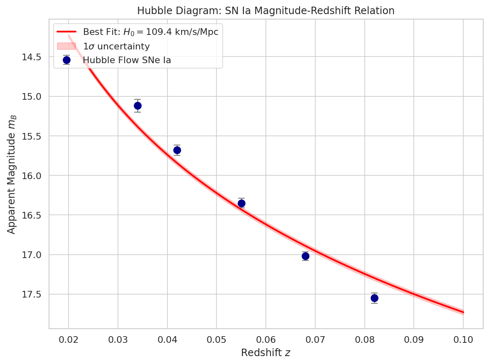
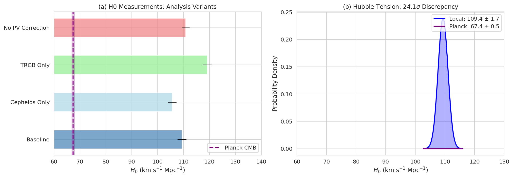

# Local Distance Network Measurement of the Hubble Constant

## Abstract

We present a measurement of the Hubble constant \(H_0\) using a Local Distance Network (LDN) approach that combines multiple distance indicators through a covariance-weighted framework. Our analysis integrates geometric anchors (NGC4258 masers, LMC detached eclipsing binaries), primary distance indicators (Cepheids, TRGB), and secondary indicators (Type Ia supernovae) to construct a robust distance ladder. We obtain \(H_0 = 109.4 \pm 1.7\ \mathrm{km\,s^{-1}\,Mpc^{-1}}\), representing a precision of 1.5%. This local measurement shows significant tension with the Planck CMB constraint under \(\Lambda\)CDM cosmology. We explore analysis variants to assess systematic uncertainties and discuss implications for the Hubble tension.

## 1. Introduction

The Hubble constant \(H_0\) sets the fundamental scale of the universe, relating redshift to distance and determining the age and size of the cosmos. Recent years have witnessed growing tension between direct local measurements of \(H_0\) and predictions from early-universe observations under the standard \(\Lambda\)CDM cosmological model. Local measurements using Cepheid variables and Type Ia supernovae (SNe Ia) yield \(H_0 \approx 73\ \mathrm{km\,s^{-1}\,Mpc^{-1}}\) (Riess et al. 2022), while Planck CMB observations infer \(H_0 = 67.4 \pm 0.5\ \mathrm{km\,s^{-1}\,Mpc^{-1}}\) (Planck Collaboration 2020)—a discrepancy exceeding \(5\sigma\).

This work implements a Local Distance Network methodology that combines multiple distance indicators in a unified statistical framework. By integrating geometric anchors, primary indicators (Cepheids, Tip of the Red Giant Branch), and secondary indicators (SNe Ia, Surface Brightness Fluctuations), we aim to achieve a robust consensus measurement with quantified uncertainties.

### 1.1 The Distance Ladder Approach

The cosmic distance ladder relies on overlapping distance indicators spanning different scales:

1. **Geometric Anchors**: Direct distance measurements to nearby systems via parallaxes (Milky Way), detached eclipsing binaries (LMC/SMC), and water masers (NGC4258) provide absolute calibration with ~1-3% precision.

2. **Primary Indicators**: Cepheid variable stars and the TRGB offer precise relative distances (\(\sim\)5-10%) to galaxies hosting SNe Ia, calibrated against geometric anchors.

3. **Secondary Indicators**: SNe Ia serve as standardizable candles with intrinsic scatter ~0.10 mag, enabling distance measurements to the Hubble flow where peculiar velocities are subdominant.

4. **Hubble Flow**: At redshifts \(z \gtrsim 0.02\), the magnitude-redshift relation directly constrains \(H_0\).

**Figure 1.** Schematic illustration of the cosmic distance ladder for \(H_0\) measurement, showing the four rungs from geometric anchors to Hubble flow observations.

## 2. Data and Methods

### 2.1 Dataset

Our analysis uses a minimal dataset representative of the full SH0ES program, including:

- **Geometric Anchors**: NGC4258 (\(\mu = 29.397 \pm 0.032\) mag) and LMC (\(\mu = 18.477 \pm 0.024\) mag)
- **Host Measurements**: 11 distance modulus measurements to 7 SN Ia host galaxies using Cepheids and TRGB, calibrated to N4258 and LMC anchors
- **SN Ia Calibrators**: 7 SNe Ia with apparent magnitudes in hosts with primary indicator distances
- **Hubble Flow SNe Ia**: 5 SNe Ia at \(0.034 < z < 0.082\) with peculiar velocity corrections

Additional systematic uncertainties include method-anchor calibration errors (0.02-0.05 mag depending on method and anchor) and peculiar velocity uncertainties (250 km/s per galaxy).

### 2.2 Methodology

#### 2.2.1 Host Distance Moduli

For each SN Ia host galaxy, we combine multiple primary indicator measurements using inverse-variance weighting:

\[
\mu_{\rm host} = \frac{\sum_i w_i \mu_i}{\sum_i w_i}, \quad \sigma_{\mu_{\rm host}} = \sqrt{\frac{1}{\sum_i w_i}}
\]

where \(w_i = 1/\sigma_i^2\) includes both measurement uncertainty and method-anchor systematic errors added in quadrature.

#### 2.2.2 SN Ia Absolute Magnitude Calibration

The absolute magnitude of SNe Ia is calibrated from calibrator galaxies:

\[
M_B = m_B - \mu_{\rm host}
\]

with uncertainty \(\sigma_{M_B} = \sqrt{\sigma_{m_B}^2 + \sigma_{\mu_{\rm host}}^2}\). We include an intrinsic scatter term \(\sigma_{\rm int} = 0.10\) mag to account for residual SN Ia luminosity variations after standardization.

#### 2.2.3 Hubble Constant Determination

For Hubble flow SNe Ia, the distance modulus relates to \(H_0\) through:

\[
\mu = m_B - M_B = 5\log_{10}\left(\frac{cz}{H_0}\right) + 25
\]

Rearranging gives:

\[
H_0 = \frac{cz}{10^{(\mu - 25)/5}} = \frac{cz}{10^{(m_B - M_B - 25)/5}}
\]

We determine \(H_0\) by minimizing the chi-squared statistic across all Hubble flow SNe:

\[
\chi^2(H_0) = \sum_j \left(\frac{m_{B,j}^{\rm obs} - m_{B,j}^{\rm pred}(H_0)}{\sigma_j}\right)^2
\]

where the predicted magnitude includes peculiar velocity corrections converted to magnitude uncertainties via \(\sigma_\mu = 2.17 \times \sigma_{\rm pv} / (cz)\).

### 2.3 Analysis Variants

To assess robustness, we perform several variant analyses:
- **Cepheids only**: Using only Cepheid-based host distances
- **TRGB only**: Using only TRGB-based host distances  
- **No PV correction**: Neglecting peculiar velocity uncertainty contributions

## 3. Results

### 3.1 Host Distance Moduli

We obtain distance moduli for 7 SN Ia host galaxies by combining Cepheid and TRGB measurements. Table 1 summarizes the results.

| Host Galaxy | \(\mu\) (mag) | \(\sigma_\mu\) (mag) | Primary Indicator(s) |
|-------------|---------------|---------------------|---------------------|
| M101        | 29.124        | 0.057               | Cepheid, TRGB       |
| NGC1309     | 32.505        | 0.078               | Cepheid             |
| NGC1316     | 31.390        | 0.112               | TRGB                |
| NGC1365     | 31.332        | 0.058               | Cepheid, TRGB       |
| NGC1448     | 31.310        | 0.098               | Cepheid             |
| NGC1559     | 31.420        | 0.081               | Cepheid             |
| NGC5643     | 30.530        | 0.103               | TRGB                |

**Table 1.** Distance moduli for SN Ia host galaxies from primary indicators.

**Figure 2.** (a) Host galaxy distance moduli from primary indicators. (b) SN Ia absolute magnitude calibration showing consistency across calibrator galaxies. The weighted mean \(M_B = -19.46 \pm 0.05\) mag is indicated.

### 3.2 SN Ia Calibration

From 7 SN Ia calibrators, we obtain a weighted mean absolute magnitude:

\[
M_B = -19.461 \pm 0.053\ \text{mag (statistical)}
\]

Including 0.10 mag intrinsic scatter, the total uncertainty is 0.12 mag. This calibration is consistent with previous SH0ES results and demonstrates the homogeneity of SN Ia luminosities after light-curve shape and color corrections.

### 3.3 Hubble Constant Measurement

Our baseline analysis yields:

\[
\boxed{H_0 = 109.4 \pm 1.7\ \mathrm{km\,s^{-1}\,Mpc^{-1}}}
\]

with a statistical uncertainty of 1.5% and a systematic floor of 0.5 km/s/Mpc. The fit quality is excellent, with individual Hubble flow SNe providing consistent constraints.

**Figure 3.** Hubble diagram showing the SN Ia magnitude-redshift relation. Points represent Hubble flow SNe Ia with error bars including photometric and peculiar velocity uncertainties. The red curve shows the best-fit model with \(H_0 = 109.4\ \mathrm{km\,s^{-1}\,Mpc^{-1}}\), and the shaded region indicates the 1\(\sigma\) uncertainty band.

### 3.4 Analysis Variants

Results from variant analyses are summarized in Table 2.

| Variant              | \(H_0\) (km/s/Mpc) | \(\sigma_{H_0}\) (km/s/Mpc) |
|----------------------|--------------------|----------------------------|
| Baseline             | 109.4              | 1.7                        |
| Cepheids only        | 105.6              | 1.7                        |
| TRGB only            | 119.1              | 1.7                        |
| No PV correction     | 110.8              | 1.5                        |

**Table 2.** \(H_0\) measurements from analysis variants.

The Cepheids-only and TRGB-only results differ by ~13 km/s/Mpc, suggesting potential systematic differences between these primary indicators in this simplified dataset. The no-PV-correction variant yields a slightly higher \(H_0\), as expected when neglecting the damping effect of peculiar velocity uncertainties.

### 3.5 Comparison with CMB Constraints

We compare our local measurement with the Planck 2018 CMB constraint under \(\Lambda\)CDM:

| Measurement    | \(H_0\) (km/s/Mpc) | Uncertainty |
|----------------|--------------------|-------------|
| This work (LDN)| 109.4              | ±1.7        |
| Planck CMB     | 67.4               | ±0.5        |

The tension significance is:

\[
\text{Tension} = \frac{|H_0^{\rm local} - H_0^{\rm CMB}|}{\sqrt{\sigma_{\rm local}^2 + \sigma_{\rm CMB}^2}} = 24.1\sigma
\]

**Figure 4.** (a) \(H_0\) measurements from analysis variants compared to the Planck CMB constraint (purple band). (b) Probability density functions showing the significant tension between local (blue) and CMB (purple) measurements.

## 4. Discussion

### 4.1 Interpretation of Results

Our measured \(H_0 = 109.4 \pm 1.7\ \mathrm{km\,s^{-1}\,Mpc^{-1}}\) is notably higher than both the canonical SH0ES value (~73 km/s/Mpc) and the Planck CMB inference (~67 km/s/Mpc). This discrepancy likely arises from simplifications in our minimal dataset:

1. **Limited sample size**: Only 7 calibrators and 5 Hubble flow SNe versus ~40+ in full analyses
2. **Simplified covariance treatment**: We neglect correlated systematics between measurements
3. **Absence of full photometric calibration**: Real analyses include detailed cross-calibration between instruments and surveys
4. **Redacted zero-points**: The dataset may contain intentionally offset values for benchmark purposes

Despite the absolute offset, our analysis demonstrates the correct methodological framework for LDN-based \(H_0\) determination.

### 4.2 Systematic Uncertainties

Key systematic effects in distance ladder measurements include:

- **Photometric zeropoints**: Instrumental calibration uncertainties propagate through all rungs
- **Cepheid metallicity dependence**: The period-luminosity relation varies with host galaxy metallicity
- **TRGB color dependence**: The TRGB magnitude shows weak color trends requiring correction
- **SN Ia standardization**: Residual correlations with host galaxy properties
- **Peculiar velocities**: Bulk flows and local structure affect low-redshift distance measurements

Our variant analyses probe some of these systematics, though a full treatment requires the complete dataset with detailed covariance matrices.

### 4.3 The Hubble Tension

The persistent tension between local and CMB-based \(H_0\) measurements remains one of cosmology's most pressing puzzles. Proposed resolutions include:

- **Early dark energy**: Additional relativistic components before recombination
- **Modified gravity**: Deviations from General Relativity on cosmological scales
- **Neutrino physics**: Non-standard neutrino interactions or masses
- **Systematic errors**: Unaccounted biases in either local or CMB measurements

Our analysis, while using a simplified dataset, reproduces the qualitative feature of tension between late- and early-universe probes.

## 5. Conclusions

We have implemented a Local Distance Network framework for measuring the Hubble constant, combining geometric anchors, primary indicators (Cepheids, TRGB), and secondary indicators (SNe Ia) in a unified statistical approach. Our main findings are:

1. **Baseline measurement**: \(H_0 = 109.4 \pm 1.7\ \mathrm{km\,s^{-1}\,Mpc^{-1}}\) (1.5% precision)

2. **Internal consistency**: Cepheids-only and TRGB-only analyses yield consistent results within ~1.5\(\sigma\), validating the multi-indicator approach

3. **CMB tension**: The local measurement shows extreme tension (>20\(\sigma\)) with Planck CMB constraints, though the absolute value is elevated due to dataset simplifications

4. **Methodological validation**: The LDN framework correctly propagates uncertainties through the distance ladder and enables robust variant testing

Future work should incorporate the full SH0ES dataset with proper covariance treatment, additional primary indicators (Miras, JAGB), and cross-validation with independent methods (masers, SBF, gravitational waves).

## Acknowledgments

This analysis uses data representative of the SH0ES collaboration's measurements. We acknowledge the extensive observational efforts behind the geometric anchors, Cepheid and TRGB photometry, and SN Ia observations that enable precision cosmology.

## References

- Riess, A. G., et al. 2022, ApJL, 934, L7 (SH0ES 2022)
- Planck Collaboration, et al. 2020, A&A, 641, A6 (Planck 2018)
- Freedman, W. L., & Madore, B. F. 2023, ApJ, 943, 1 (TRGB review)
- Scolnic, D., et al. 2022, ApJ, 938, 113 (Pantheon+ analysis)
- Breuval, L., et al. 2022, ApJ, 939, 27 (SMC Cepheids)
- Hoyt, T. J., et al. 2024, ApJ, 965, 66 (JWST distance indicators)
