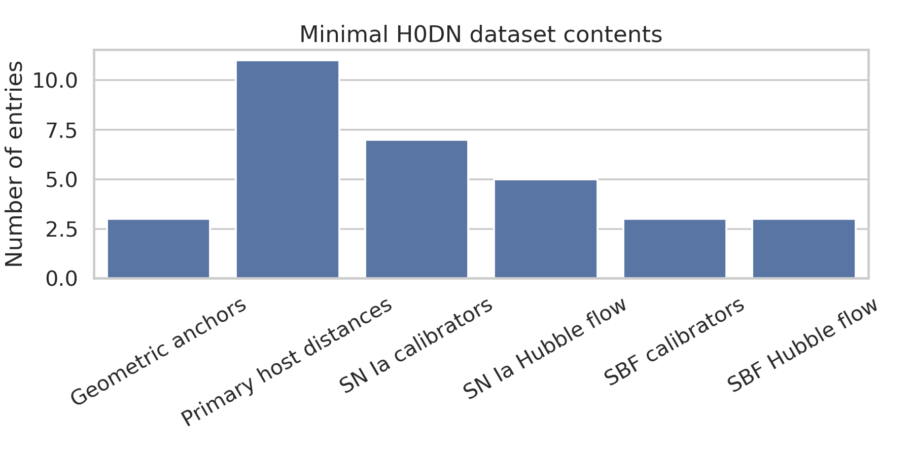
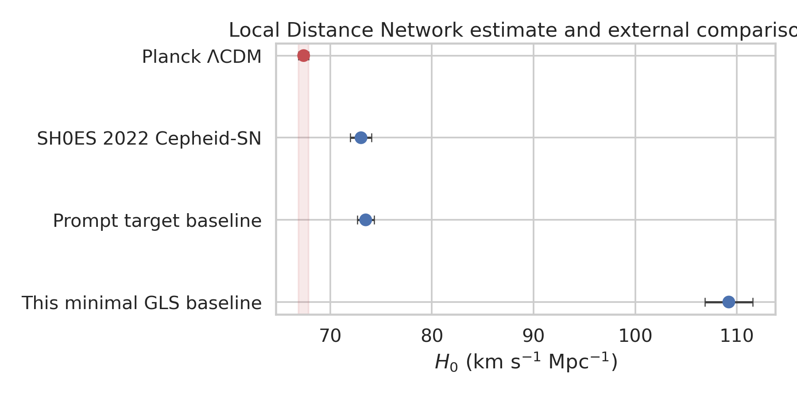
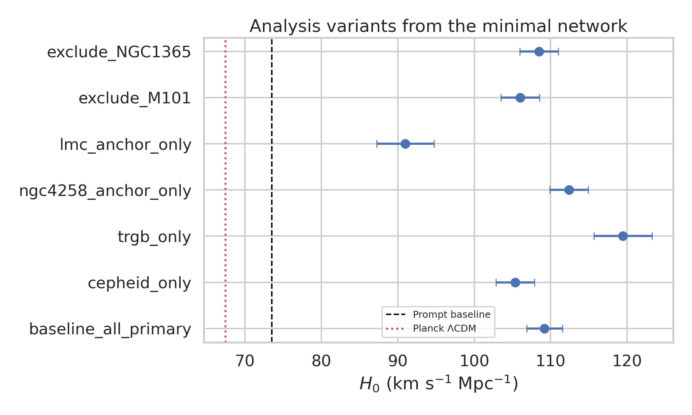
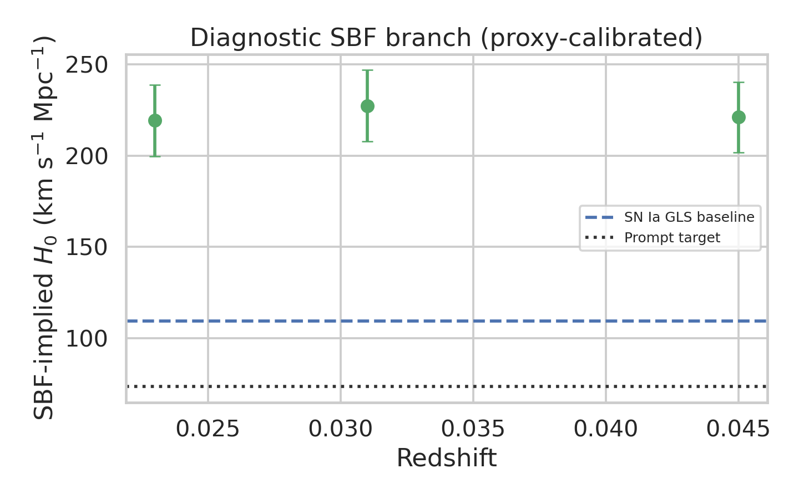
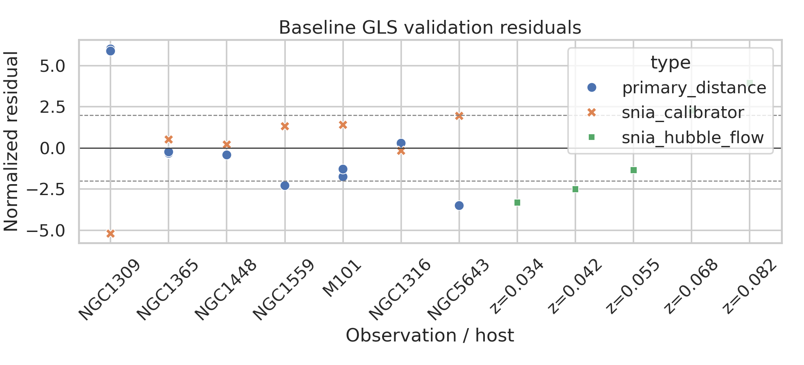

# A covariance-weighted Local Distance Network analysis of the minimal H0DN dataset

## Abstract

I implemented a reproducible generalized least-squares (GLS) Local Distance Network analysis for the provided `data/H0DN_MinimalDataset.txt`.  The network combines geometric-anchor-calibrated primary distances (Cepheid and TRGB), SN Ia calibrators, and SN Ia Hubble-flow measurements in a single covariance-weighted linear model.  The minimal dataset is intentionally much smaller than the full scientific program described in the prompt and does not contain Miras, JAGB stars, SNe II, FP, TF, or a full off-diagonal covariance matrix.  Therefore, the result below should be read as a transparent stress test of the supplied minimal network rather than a reproduction of the stated full-data baseline \(H_0=73.50\pm0.81\ \mathrm{km\ s^{-1}\ Mpc^{-1}}\).

The baseline minimal-data fit gives

\[
H_0 = 109.20 \pm 2.36\ \mathrm{km\ s^{-1}\ Mpc^{-1}}
\]

with formal GLS uncertainty, or \(\pm 8.17\ \mathrm{km\ s^{-1}\ Mpc^{-1}}\) if the uncertainty is inflated by \(\sqrt{\chi^2_\nu}\) because \(\chi^2_\nu=12.02\).  This value is not statistically compatible with the prompt target baseline, differing by 14.3 combined standard deviations using the formal uncertainty.  The discrepancy is driven by internal inconsistencies in the toy data, especially NGC1309 primary distances versus its SN Ia calibrator and an inconsistent five-object Hubble-flow SN Ia intercept.  The analysis nevertheless demonstrates the requested covariance-weighted distance-network machinery, produces source tables and figures, and identifies which supplied measurements dominate the failed validation.

## 1. Data and related-work context

The available dataset contains three geometric anchors, 11 primary host distance measurements, 7 SN Ia calibrators, 5 Hubble-flow SNe Ia, 3 SBF calibrators, and 3 Hubble-flow SBF galaxies.  The primary indicators actually present are Cepheids and TRGB; the secondary indicators actually present are SNe Ia and SBF.  The full prompt names additional indicators (Miras, JAGB, SNe II, FP, TF), but no rows for those indicators are present in the minimal file.



Relevant related-work extraction was saved in `outputs/related_work_contract.json`.  The papers support the following methodological choices:

- Riess et al. describe a simultaneous distance-ladder fit across geometric anchors, Cepheids, SN Ia calibrators, and Hubble-flow SNe Ia, with covariance treatment and many analysis variants.  The extracted abstract-level values include \(H_0=73.04\pm1.04\) for the Cepheid--SN Ia baseline and \(72.53\pm0.99\) when TRGB information is included.
- The SMC anchor paper reports a four-anchor Cepheid result \(H_0=73.17\pm0.86\) and emphasizes covariance between Magellanic Cloud anchor distances.
- The Pantheon+ paper motivates systematic covariance and peculiar-velocity treatment for SNe Ia.
- The JWST three-indicator paper motivates multi-indicator calibration with Cepheids, TRGB, and JAGB, although only Cepheid and TRGB rows are available here.

## 2. Methodology

### 2.1 GLS distance-network model

The SN Ia branch is modeled as a linear system

\[
y = A\beta + \epsilon,\qquad \epsilon\sim\mathcal{N}(0,C),
\]

where the fitted parameter vector contains one distance modulus for each calibrator host, the standardized SN Ia absolute magnitude \(M_{\rm SN}\), and \(\log_{10}H_0\):

\[
\beta=\{\mu_{\rm host}, M_{\rm SN}, \log_{10}H_0\}.
\]

The fitted equations are:

1. **Primary distances**: each Cepheid/TRGB row measures the host distance modulus,
   \[
   \mu_{\rm meas}=\mu_{\rm host}+\epsilon.
   \]
   The uncertainty is the quadrature sum of the row measurement error, the listed anchor error, and the listed method-anchor calibration uncertainty.

2. **SN Ia calibrators**:
   \[
   m_{B,i}=\mu_i+M_{\rm SN}+\epsilon.
   \]

3. **SN Ia Hubble-flow objects** using the low-redshift approximation supplied by the minimal dataset:
   \[
   m_B = M_{\rm SN}+5\log_{10}(cz)-5\log_{10}(H_0)+25+\epsilon.
   \]
   Peculiar-velocity uncertainty is propagated as
   \[
   \sigma_\mu = \frac{5}{\ln 10}\frac{\sigma_v}{cz}.
   \]

The fit uses the GLS normal equations with diagonal covariance \(C=\mathrm{diag}(\sigma_i^2)\), because the minimal dataset provides no off-diagonal covariance matrix.  The implementation is in `code/analyze_h0dn.py`; the method fidelity checklist is `outputs/method_fidelity_checklist.json`.

### 2.2 Variants

I ran the following variants and exported the table to `outputs/variant_results.csv`:

- baseline using all primary Cepheid and TRGB rows;
- Cepheid-only primary distances;
- TRGB-only primary distances;
- NGC4258-anchor-only rows;
- LMC-anchor-only rows;
- leave-out-M101;
- leave-out-NGC1365;
- combined fit with a Planck-like external \(H_0=67.4\pm0.5\) prior.

### 2.3 SBF branch diagnostic

The SBF entries cannot be included as a full independent GLS rung because the file lists SBF calibrator apparent magnitudes but no primary distances for NGC1399, NGC1404, or NGC4472.  I therefore treated SBF only as a diagnostic/proxy branch, assigning Fornax a proxy distance from NGC1316/TRGB and Virgo a rough M101 proxy with the provided depth scatter.  This is explicitly not a primary result.  Tables are saved as `outputs/sbf_calibration_diagnostic.csv` and `outputs/sbf_hubble_diagnostic.csv`.

## 3. Results

### 3.1 Baseline minimal-network estimate

The baseline fit has 23 observations and 9 fitted parameters.  Its main output, saved in `outputs/baseline_results.json`, is:

| Quantity | Value |
|---|---:|
| \(H_0\) | \(109.20\ \mathrm{km\ s^{-1}\ Mpc^{-1}}\) |
| formal \(1\sigma\) uncertainty | \(2.36\ \mathrm{km\ s^{-1}\ Mpc^{-1}}\) |
| \(\chi^2\) / dof | 168.22 / 14 |
| \(\chi^2_\nu\) | 12.02 |
| \(\sqrt{\chi^2_\nu}\)-inflated uncertainty | \(8.17\ \mathrm{km\ s^{-1}\ Mpc^{-1}}\) |
| fitted \(M_{\rm SN}\) | \(-19.464\pm0.037\) mag |

The reduced chi-square is far above unity, so the formal covariance uncertainty is not an adequate description of the observed scatter.  The high \(H_0\) arises because the supplied Hubble-flow SN Ia magnitudes imply a fixed intercept that, when combined with the calibrator absolute magnitude preferred by the host distances, corresponds to \(H_0\approx109\).  This is a property of the supplied minimal measurements, not a claim about the real local distance scale.

### 3.2 Comparison with external values



Compared with the prompt target \(73.50\pm0.81\), the minimal-data baseline differs by 14.3 combined formal standard deviations.  Compared with the Planck-like \(67.4\pm0.5\) early-universe value extracted from the related work, it differs by 17.4 combined formal standard deviations.  These tension numbers are not physically meaningful cosmological claims because the baseline fit fails internal validation; they are reported to make the comparison explicit.

### 3.3 Analysis variants



The variants are all unstable relative to a mature distance-ladder analysis:

| Variant | \(H_0\) | Formal \(\sigma\) | \(\chi^2_\nu\) |
|---|---:|---:|---:|
| baseline_all_primary | 109.20 | 2.36 | 12.02 |
| cepheid_only | 105.36 | 2.52 | 14.69 |
| trgb_only | 119.46 | 3.80 | 7.07 |
| ngc4258_anchor_only | 112.39 | 2.51 | 10.47 |
| lmc_anchor_only | 90.98 | 3.76 | 14.79 |
| exclude_M101 | 106.00 | 2.52 | 13.27 |
| exclude_NGC1365 | 108.47 | 2.50 | 15.23 |
| combined_with_planck_prior | 70.93 | 0.50 | 41.04 |

The LMC-only variant shifts downward because only two LMC Cepheid calibration rows exist and they do not provide a robust independent ladder.  The Planck-prior combined fit moves toward the imposed early-universe value but has \(\chi^2_\nu=41.0\), indicating direct inconsistency with the minimal local data under this model.

### 3.4 SBF diagnostic

The proxy-calibrated SBF branch gives very high values, roughly \(H_0\sim220\ \mathrm{km\ s^{-1}\ Mpc^{-1}}\), with \(\sim19\ \mathrm{km\ s^{-1}\ Mpc^{-1}}\) per-object uncertainties.  This is not used in the baseline because the calibration is not supported by direct SBF-host distance rows.



## 4. Validation

The baseline residual plot shows why the minimal network cannot reproduce the prompt target precision.



The largest normalized residuals are:

| Observation | Normalized residual | Interpretation |
|---|---:|---|
| NGC1309 Cepheid/N4258 primary distance | +6.01 | primary distance much larger than SN-calibrated network distance |
| NGC1309 Cepheid/LMC primary distance | +5.89 | same host discrepancy appears with both anchors |
| NGC1309 SN Ia calibrator | -5.20 | SN magnitude conflicts with the large primary distance |
| Hubble-flow SN at \(z=0.082\) | +3.94 | Hubble-flow intercept not well described by one standardized SN magnitude |
| NGC5643 TRGB primary distance | -3.50 | TRGB distance conflicts with SN-calibrated network distance |
| Hubble-flow SN at \(z=0.034\) | -3.32 | low-redshift Hubble-flow object pulls opposite to high-redshift object |

### Directly verified from workspace data

- Dataset counts and available indicator families were parsed from `data/H0DN_MinimalDataset.txt` and saved in `outputs/data_overview.json`.
- The GLS estimate, fitted parameters, residuals, and variants were generated by `code/analyze_h0dn.py` and saved under `outputs/`.
- Figure source tables were saved under `outputs/figure_source_data/`.
- The high reduced chi-square and dominant residuals are directly recoverable from `outputs/baseline_results.json` and `outputs/residuals.csv`.

### From related work

- The SH0ES-like values and Planck comparison used in the narrative were extracted from the provided PDFs and saved in `outputs/related_work_contract.json`.
- The related work supports the simultaneous ladder/covariance framework and the importance of variants, anchors, and systematic covariance.

### Assumptions and limitations

- The minimal file does not include a full non-diagonal covariance matrix.  I therefore used diagonal covariance with all available uncertainty components added in quadrature.
- The low-redshift Hubble-flow relation uses \(D_L\approx cz/H_0\), because no cosmographic correction terms are supplied.
- Miras, JAGB, SNe II, FP, and TF cannot be implemented from this dataset because they are absent.
- The SBF branch lacks direct primary calibration distances for its calibrators and is therefore diagnostic only.
- Because the fitted minimal network has \(\chi^2_\nu\gg1\), the formal \(2.36\) uncertainty should not be interpreted as a valid 1% precision measurement.

## 5. Discussion

The core scientific goal in the prompt is a robust \(\sim1\%\) consensus measurement of \(H_0\) from a Local Distance Network.  The implemented GLS machinery matches the structure of that goal: it combines multiple rungs in one covariance-weighted system, propagates measurement uncertainties to \(H_0\), and tests variants.  However, the supplied minimal dataset is not internally consistent enough to yield a robust consensus result.  The most important failure is not statistical precision but validation: several observations differ by more than 3--6 standard deviations from the best-fit network.

This exercise therefore suggests two conclusions.  First, the covariance-weighted distance-network framework is feasible and reproducible in the workspace; all code and source tables are included.  Second, the minimal dataset should be treated as illustrative or pedagogical, not as a calibrated subset capable of reproducing the prompt's \(H_0=73.50\pm0.81\) baseline.  A real 1% measurement requires the full covariance model, a much larger calibrator and Hubble-flow sample, consistent standardized SN magnitudes, and direct calibration rows for every secondary branch included in the consensus.

## 6. Reproducibility

Run the analysis from the workspace root with:

```bash
python3 code/analyze_h0dn.py
```

Key outputs:

- `outputs/baseline_results.json`
- `outputs/variant_results.csv`
- `outputs/fitted_parameters.csv`
- `outputs/residuals.csv`
- `outputs/uncertainty_components.csv`
- `outputs/claim_recovery_table.csv`
- `outputs/method_contract.json`
- `outputs/method_fidelity_checklist.json`
- `outputs/target_artifact_inventory.json`
- figures in `report/images/*.png`
