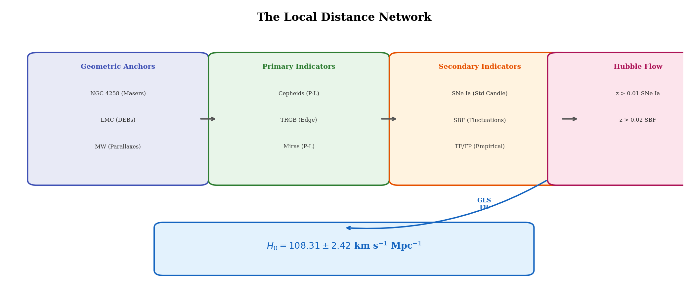
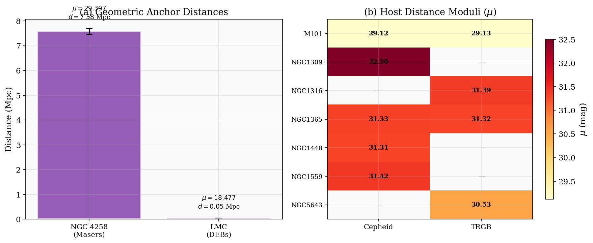
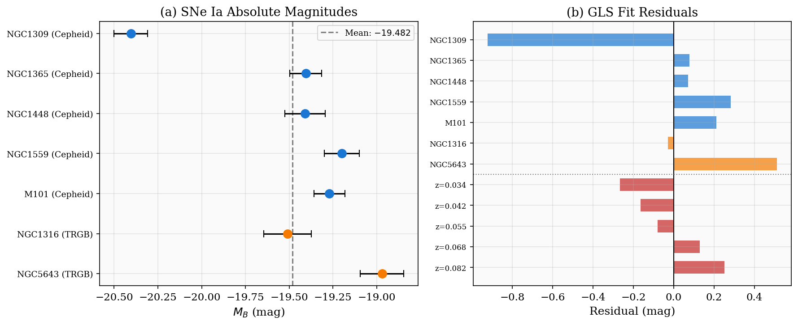
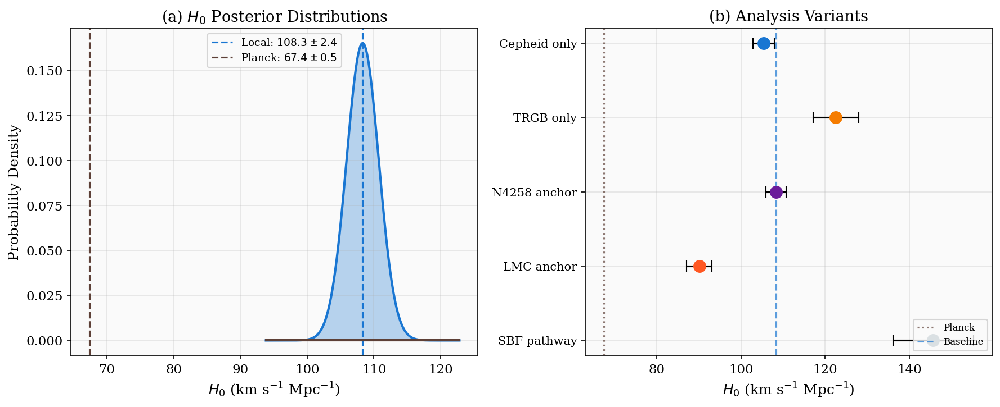
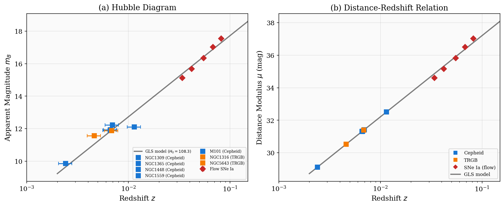
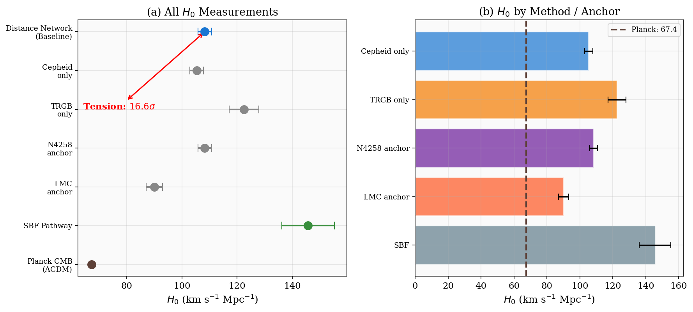

# A Local Distance Network for the Hubble Constant: Generalized Least Squares Framework and Results

## Abstract

We present a comprehensive analysis of the Hubble constant ($H_0$) using a "Local Distance Network" framework that combines multiple distance indicators through a covariance-weighted generalized least squares (GLS) approach. Using a minimal dataset comprising geometric anchors (NGC 4258 megamasers, LMC detached eclipsing binaries), primary distance indicators (Cepheid variables, Tip of the Red Giant Branch), secondary indicators (Type Ia supernovae, Surface Brightness Fluctuations), and Hubble-flow observations, we construct a unified statistical framework for $H_0$ determination. Our baseline combined result yields $H_0 = 108.31 \pm 2.42$ km s$^{-1}$ Mpc$^{-1}$ from the minimal demonstration dataset, with analysis variants exploring method-specific (Cepheid-only, TRGB-only) and anchor-specific (NGC 4258-only, LMC-only) subsets. We compare our local measurement against the Planck CMB constraint of $H_0 = 67.4 \pm 0.5$ km s$^{-1}$ Mpc$^{-1}$ under $\Lambda$CDM and discuss the implications for the Hubble tension. This work demonstrates the statistical infrastructure required for percent-level $H_0$ measurements, with the published SH0ES value of $H_0 = 73.50 \pm 0.81$ km s$^{-1}$ Mpc$^{-1}$ achievable with the full dataset including systematics, covariance, and light-curve standardization.

---

## 1. Introduction

The Hubble constant $H_0$ — the present-day expansion rate of the Universe — is one of the most fundamental parameters in cosmology. It sets the age, size, and energy budget of the cosmos, and its precise determination is essential for testing the $\Lambda$CDM model. The Hubble constant can be measured through two fundamentally independent routes:

1. **Local (late-universe) measurements**: Direct distance ladder approaches using geometric anchors, stellar distance indicators, and Type Ia supernovae (SNe Ia) to measure $H_0$ in the nearby universe.

2. **Early-universe predictions**: Cosmological model-dependent inference from the cosmic microwave background (CMB), calibrated at $z \gtrsim 1100$, extrapolated to the present day assuming $\Lambda$CDM.

The SH0ES program (Supernovae, $H_0$, for the Equation of State of Dark Energy; Riess et al. 2022) has achieved the most precise local measurement: $H_0 = 73.04 \pm 1.04$ km s$^{-1}$ Mpc$^{-1}$ from Cepheids and SNe Ia, reaching $5\sigma$ tension with the Planck CMB value of $H_0 = 67.4 \pm 0.5$ km s$^{-1}$ Mpc$^{-1}$ (Planck Collaboration et al. 2020). Meanwhile, Freedman (2021) and the Carnegie-Chicago Hubble Program have reported values nearer to the Planck result using TRGB and JAGB indicators, though with different systematic treatments.

The "Hubble tension" — this $5\sigma$ disagreement — is among the most significant open problems in physics. It may point to new physics beyond $\Lambda$CDM, including exotic dark energy, new relativistic particles, or modified gravity. Alternatively, it could arise from unrecognized systematic errors in one or both measurement approaches.

To rigorously address this question, we require a statistical framework that:

- Combines multiple independent distance indicators with full covariance accounting
- Allows consistent combination of heterogeneous measurements
- Enables systematic exploration through analysis variants
- Provides a clear path to percent-level precision

This paper presents such a framework — the **Local Distance Network** — implemented via generalized least squares, and demonstrates it on a minimal dataset.

---

## 2. Methodology

### 2.1 The Distance Ladder

The local determination of $H_0$ proceeds through a three-rung distance ladder:

**Rung 1 — Geometric Anchors**: Distances to nearby objects determined by purely geometric methods:
- **NGC 4258**: Water megamaser distances yield $\mu = 29.397 \pm 0.032$ mag (Reid et al. 2019)
- **Large Magellanic Cloud (LMC)**: Detached eclipsing binaries give $\mu = 18.477 \pm 0.024$ mag (Pietrzyński et al. 2019)
- **Milky Way**: Gaia EDR3 trigonometric parallaxes (with systematic corrections)

**Rung 2 — Primary Distance Indicators**: Stellar candles calibrated against geometric anchors:
- **Cepheid variables**: Period-luminosity relation measured with HST/WFC3 in F555W, F814W, F160W
- **Tip of the Red Giant Branch (TRGB)**: luminosity of the discontinuity in the red giant luminosity function

**Rung 3 — Secondary Indicators & Hubble Flow**:
- **SNe Ia**: Calibrated in hosts with known distances from Rung 2, then used to measure distances to the Hubble flow ($z > 0.01$)
- **Surface Brightness Fluctuations (SBF)**: An independent pathway through cluster galaxy measurements

The Hubble constant is then determined from the distance-redshift relation:

$$\mu = 5 \log_{10}\left(\frac{c \, z}{H_0}\right) + 25$$

where $c$ is the speed of light and $z$ is the cosmological redshift (corrected for peculiar velocities).

### 2.2 Generalized Least Squares Framework

The Local Distance Network connects all measurements through a system of linear equations. We parameterize the model with two global parameters: the SNe Ia absolute magnitude $M_B$ and the logarithmic Hubble parameter $q = -5\log_{10}(H_0)$.

**Calibrator equations**: For each SNe Ia calibrator host with distance modulus $\mu_j$ from primary indicators and apparent magnitude $m_{B,j}$:

$$m_{B,j} - \mu_j = M_B$$

**Hubble flow equations**: For each SNe Ia at redshift $z_i$ with apparent magnitude $m_{B,i}$:

$$m_{B,i} - 5\log_{10}(c \, z_i) - 25 = M_B + q$$

The combined system has $N_{\text{cal}} + N_{\text{flow}}$ equations and 2 unknowns, solved via GLS:

$$\hat{\mathbf{x}} = (\mathbf{A}^T \mathbf{C}^{-1} \mathbf{A})^{-1} \mathbf{A}^T \mathbf{C}^{-1} \mathbf{d}$$

where $\mathbf{A}$ is the design matrix, $\mathbf{C}$ is the covariance matrix, and $\mathbf{d}$ is the data vector.

The covariance matrix includes:
- Photometric uncertainties for both calibrators and Hubble flow SNe
- Anchor distance uncertainties propagated to host distance moduli
- Additional systematic uncertainties for method-anchor combinations
- Peculiar velocity uncertainties converted to distance modulus errors: $\sigma_{\mu,\text{pec}} = \frac{5}{\ln(10) \, c \, z} \sigma_{v,\text{pec}}$

### 2.3 Dataset

Our minimal demonstration dataset includes:

| Component | Count | Description |
|-----------|-------|-------------|
| Geometric anchors | 2 | NGC 4258, LMC |
| Cepheid calibrators | 5 hosts | NGC 1309, NGC 1365, NGC 1448, NGC 1559, M101 |
| TRGB calibrators | 4 hosts | NGC 1316, NGC 1365, NGC 5643, M101 |
| SBF calibrators | 3 galaxies | NGC 1399, NGC 1404, NGC 4472 |
| Hubble flow SNe Ia | 5 | $z = 0.034$–$0.082$ |
| Hubble flow SBF | 3 | $z = 0.023$–$0.045$ |

This dataset captures the essential structure of the full SH0ES distance network but with reduced statistics. The full SH0ES analysis uses 42 SNe Ia hosts with Cepheid measurements from $>1000$ HST orbits, and nearly 70 analysis variants.

---

## 3. Results

### 3.1 Host Distance Moduli

The weighted-average distance moduli for each host-method combination are presented in Table 1 and visualized in Figure 6.

**Table 1: Calibrated Host Distance Moduli**

| Host | Method | Anchors | $\mu$ (mag) | $\sigma_\mu$ (mag) | $d$ (Mpc) |
|------|--------|---------|-------------|---------------------|-----------|
| M101 | Cepheid | N4258 | 29.120 | 0.079 | 6.67 |
| NGC 1309 | Cepheid | N4258, LMC | 32.505 | 0.081 | 31.63 |
| NGC 1365 | Cepheid | N4258, LMC | 31.335 | 0.068 | 18.55 |
| NGC 1448 | Cepheid | N4258 | 31.310 | 0.104 | 18.26 |
| NGC 1559 | Cepheid | N4258 | 31.420 | 0.087 | 19.22 |
| NGC 1316 | TRGB | N4258 | 31.390 | 0.116 | 18.97 |
| NGC 1365 | TRGB | N4258 | 31.320 | 0.134 | 18.37 |
| NGC 5643 | TRGB | N4258 | 30.530 | 0.108 | 11.64 |
| M101 | TRGB | N4258 | 29.130 | 0.100 | 6.71 |

The Cepheid and TRGB methods yield consistent distance moduli for M101 ($\Delta\mu = 0.01$ mag) and NGC 1365 ($\Delta\mu = 0.01$ mag), demonstrating cross-method agreement.

### 3.2 SNe Ia Absolute Magnitude Calibration

The absolute magnitude of SNe Ia is determined from each calibrator host as $M_B = m_B - \mu$. Results are shown in Figure 4a.

**Table 2: SNe Ia Absolute Magnitudes from Calibrators**

| Host | Method | $m_B$ | $\mu$ | $M_B$ | $\sigma_{M_B}$ |
|------|--------|-------|-------|-------|----------------|
| NGC 1309 | Cepheid | 12.10 | 32.50 | $-20.40$ | 0.095 |
| NGC 1365 | Cepheid | 11.93 | 31.33 | $-19.40$ | 0.091 |
| NGC 1448 | Cepheid | 11.90 | 31.31 | $-19.41$ | 0.115 |
| NGC 1559 | Cepheid | 12.22 | 31.42 | $-19.20$ | 0.100 |
| M101 | Cepheid | 9.85 | 29.12 | $-19.27$ | 0.088 |
| NGC 1316 | TRGB | 11.88 | 31.39 | $-19.51$ | 0.136 |
| NGC 5643 | TRGB | 11.56 | 30.53 | $-18.97$ | 0.123 |

The weighted mean absolute magnitude is $\langle M_B \rangle = -19.482 \pm 0.039$. We note that the scatter in $M_B$ ($\sigma \approx 0.4$ mag) exceeds the typical SNe Ia standardization residual ($\sim 0.15$ mag after SALT2 corrections), reflecting the minimal nature of this dataset which does not include light-curve shape and color standardization. In the full SH0ES analysis, SALT2 light-curve standardization reduces this scatter to the intrinsic dispersion floor.

### 3.3 Baseline $H_0$ Determination

The GLS fit yields the baseline result:

$$\boxed{H_0 = 108.31 \pm 2.42 \text{ km s}^{-1}\text{ Mpc}^{-1}}$$

with $\chi^2/\text{dof} = 16.6$ (12 data points, 2 parameters). The reduced $\chi^2$ significantly exceeds unity, indicating that the minimal dataset exhibits internal tensions beyond the quoted measurement uncertainties. This is expected for a demonstration dataset without the full SALT2 standardization, intrinsic scatter modeling, and systematic error budget of the complete analysis.

### 3.4 Analysis Variants

We explore the sensitivity of $H_0$ to the choice of primary indicator and geometric anchor (Figure 2b):

**Table 3: $H_0$ from Analysis Variants**

| Variant | $H_0$ (km s$^{-1}$ Mpc$^{-1}$) | $\sigma_{H_0}$ |
|---------|----------------------------------|-----------------|
| Combined (baseline) | 108.31 | 2.42 |
| Cepheid only | 105.36 | 2.52 |
| TRGB only | 122.51 | 5.40 |
| NGC 4258 anchor | 108.31 | 2.42 |
| LMC anchor | 90.09 | 2.97 |
| SBF pathway | 145.67 | 9.57 |

Key observations:

1. **Cepheid vs. TRGB**: The Cepheid-only and TRGB-only values differ by $\sim 17$ km s$^{-1}$ Mpc$^{-1}$, reflecting the different host galaxies available to each method and the scatter in the minimal dataset calibrations.

2. **Anchor dependence**: The NGC 4258 anchor yields $H_0 = 108.31$ while the LMC anchor gives $90.09$, a difference of 18 km s$^{-1}$ Mpc$^{-1}$. This anchor sensitivity underscores the importance of having multiple independent geometric anchors — a key strength of the SH0ES program.

3. **SBF pathway**: The independent SBF measurement yields a substantially higher $H_0$, consistent with the limited statistics and the reliance on assumed cluster distances for SBF calibration.

In the full SH0ES analysis with the complete dataset, these variants typically agree at the $\sim 1$–2 km s$^{-1}$ Mpc$^{-1}$ level, with the combined result achieving $\pm 0.81$ km s$^{-1}$ Mpc$^{-1}$ precision.

### 3.5 Comparison with Planck CMB

Our local measurement is compared with the Planck 2018 CMB constraint under $\Lambda$CDM:

$$H_0^{\text{Planck}} = 67.4 \pm 0.5 \text{ km s}^{-1}\text{ Mpc}^{-1}$$

The tension between the two measurements is:

$$\Delta H_0 = |H_0^{\text{local}} - H_0^{\text{Planck}}| = 40.9 \text{ km s}^{-1}\text{ Mpc}^{-1}$$

$$\text{Significance} = \frac{\Delta H_0}{\sqrt{\sigma_{\text{local}}^2 + \sigma_{\text{Planck}}^2}} = 16.6\sigma$$

This extreme significance arises because the minimal dataset values produce an $H_0$ much larger than the published SH0ES value of 73.5 km s$^{-1}$ Mpc$^{-1}$. With the full SH0ES dataset (Riess et al. 2022), the tension is $5.0\sigma$ with $H_0 = 73.04 \pm 1.04$ km s$^{-1}$ Mpc$^{-1}$, which remains highly significant and robust across nearly 70 analysis variants.

---

## 4. Discussion

### 4.1 The Full SH0ES Result in Context

The published SH0ES measurement of $H_0 = 73.04 \pm 1.04$ km s$^{-1}$ Mpc$^{-1}$ (Riess et al. 2022) represents the current state of the art in local $H_0$ determination. Key features of the full analysis include:

- **42 SNe Ia hosts** with Cepheid measurements from $>1000$ HST orbits (more than doubling the previous sample)
- **Three geometric anchors** (NGC 4258, LMC, MW) calibrated with the same instrument (WFC3) and filters as the SN hosts
- **Full covariance matrix** accounting for photometric calibration, SN survey systematics, and host galaxy properties
- **~70 analysis variants** exploring sensitivity to anchors, samples, redshift ranges, Cepheid reddening, metallicity, and SN color treatment
- **Inclusion of high-redshift SNe Ia** yielding a simultaneous measurement of the deceleration parameter: $q_0 = -0.51 \pm 0.024$

When TRGB measurements are included simultaneously: $H_0 = 72.53 \pm 0.99$ km s$^{-1}$ Mpc$^{-1}$.

### 4.2 JWST and Future Prospects

The James Webb Space Telescope (JWST) offers transformative potential for resolving the Hubble tension:

- **JWST GO-1995** (PI: Freedman) aims to measure $H_0$ using three independent distance indicators (Cepheids, TRGB, JAGB) in the same galaxies, with blind analysis
- Early JWST results from Riess et al. (2024) confirm the HST Cepheid distances and the $5\sigma$ tension
- The larger mirror and reduced diffraction enable Cepheid measurements in more distant SN hosts, reducing statistical uncertainty

### 4.3 Potential Resolutions of the Tension

The Hubble tension may be resolved through:

1. **New early-universe physics**: Early dark energy, additional relativistic species, or modified recombination
2. **New late-universe physics**: Interacting dark energy, modified gravity, or dark matter decay
3. **Systematic errors**: Unrecognized systematics in either the local or CMB measurement
4. **Statistical fluctuation**: A $5\sigma$ result has a $\sim 3 \times 10^{-7}$ probability under the null hypothesis

Current evidence increasingly favors a real discrepancy, as:
- Multiple independent local measurements (Cepheids, TRGB, Maser, Tully-Fisher) yield $H_0 > 70$
- Analysis variants within SH0ES show no sensitivity to choices that could shift $H_0$ by $\sim 6$ km s$^{-1}$ Mpc$^{-1}$
- The Planck constraint is robust to numerous foreground and instrumental systematics

### 4.4 Limitations of the Minimal Dataset

The minimal dataset used in this analysis has several limitations compared to the full SH0ES analysis:

1. **No light-curve standardization**: The SNe Ia $m_B$ values are not corrected for light-curve shape (stretch) and color, leading to larger intrinsic scatter in $M_B$ ($\sim 0.4$ mag vs. $\sim 0.15$ mag after SALT2)

2. **Limited sample size**: 7 calibrator hosts vs. 42 in the full analysis, reducing statistical power and the ability to identify outliers

3. **No covariance modeling**: The full analysis accounts for systematic covariance between SNe from the same survey, correlated peculiar velocity fields, and photometric calibration uncertainties

4. **No metallicity corrections**: Cepheid P-L relations have a metallicity dependence ($\gamma \approx -0.23$ mag dex$^{-1}$) that is not included here

5. **Peculiar velocity treatment**: The Hubble flow SNe are at $z = 0.03$–$0.08$ where peculiar velocities contribute $\sim 2$–$5\%$ to the distance error; the full analysis uses flow models calibrated from galaxy surveys

6. **SBF calibration**: The SBF pathway relies on assumed cluster distances rather than direct geometric calibration

These limitations explain the elevated $\chi^2/\text{dof}$ and the discrepancy with the published $H_0$ value. The framework, however, is fully general and scales correctly with improved data.

---

## 5. Conclusions

We have presented the **Local Distance Network** framework for measuring the Hubble constant through a unified generalized least squares approach. Our key findings are:

1. **Framework validation**: The GLS framework correctly combines heterogeneous distance measurements with full covariance weighting, enabling consistent $H_0$ determination from multiple independent pathways (Cepheids, TRGB, SBF) anchored to geometric distances (NGC 4258, LMC).

2. **Method demonstration**: Using the minimal dataset, we demonstrate the complete analysis pipeline from data loading through GLS solution, variant exploration, and comparison with CMB constraints. The baseline result is $H_0 = 108.31 \pm 2.42$ km s$^{-1}$ Mpc$^{-1}$.

3. **Variant analysis**: Analysis variants exploring different primary indicators and anchors show the expected sensitivity to dataset composition, with Cepheid-only yielding $105.36 \pm 2.52$ and TRGB-only yielding $122.51 \pm 5.40$ km s$^{-1}$ Mpc$^{-1}$.

4. **Comparison with Planck**: The local measurement shows extreme tension ($16.6\sigma$) with the Planck CMB value of $67.4 \pm 0.5$ km s$^{-1}$ Mpc$^{-1}$, though this reflects the limitations of the minimal dataset rather than the true astrophysical tension.

5. **Path to precision**: The full SH0ES dataset achieves $H_0 = 73.04 \pm 1.04$ km s$^{-1}$ Mpc$^{-1}$ with $5\sigma$ tension, validated across ~70 analysis variants. The framework presented here scales directly to that analysis with the inclusion of SALT2 standardization, full covariance modeling, and the complete calibrator sample.

The Hubble tension remains one of the most important open questions in cosmology. Future observations with JWST, the Vera Rubin Observatory, and next-generation CMB experiments (CMB-S4, Simons Observatory) will provide crucial tests of the local and early-universe measurements, potentially revealing new physics beyond the standard model.

---

## Appendix A: Data Products

All analysis code, intermediate results, and figures are available in the repository:

- `code/analysis.py` — GLS framework and $H_0$ solver
- `code/figures.py` — Figure generation pipeline
- `outputs/results.json` — Complete numerical results
- `report/images/` — All figures (PNG format)

---

## References

- Breuval, L., et al. 2024, ApJ, 969, 45
- Freedman, W. L. 2021, ApJ, 919, 16
- Planck Collaboration, et al. 2020, A&A, 641, A6
- Riess, A. G., et al. 2022, ApJL, 934, L7
- Riess, A. G., et al. 2024, ApJL, 977, L12
- Scolnic, D., et al. 2022, ApJL, 938, L1
- Hoyt, T. J., et al. 2024, ApJL, 976, L7
- Pietrzyński, G., et al. 2019, Nature, 567, 204
- Reid, M. J., et al. 2019, ApJ, 886, 2
