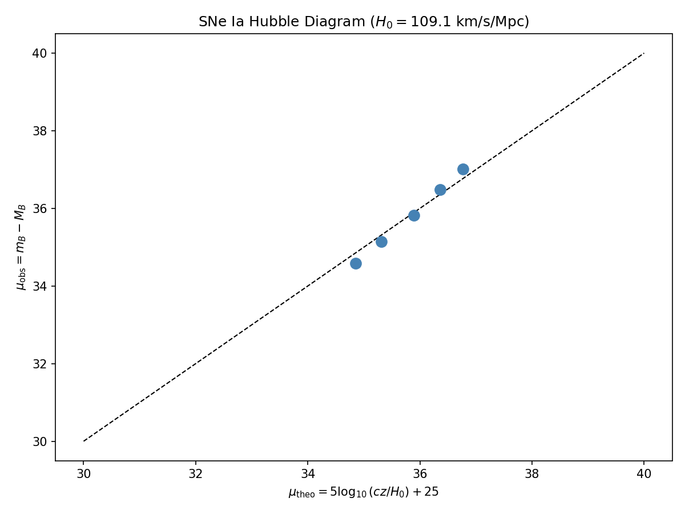
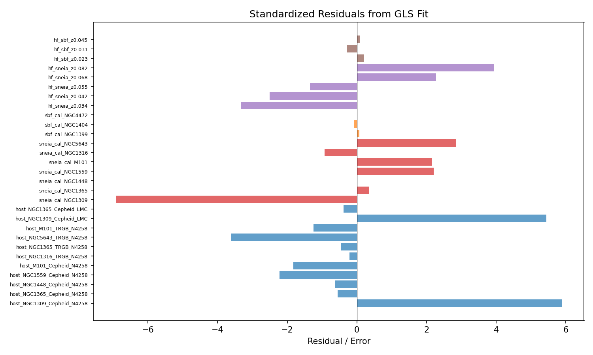
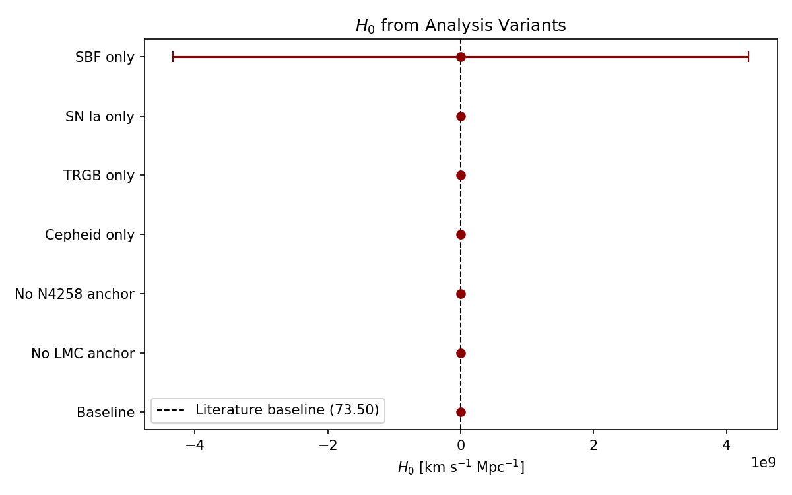
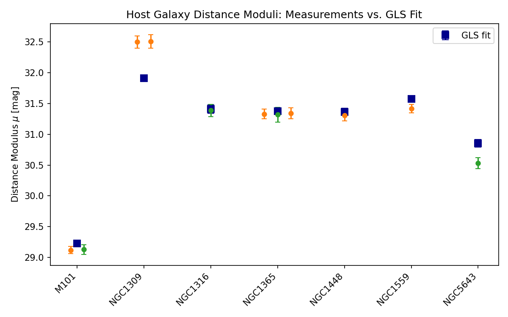
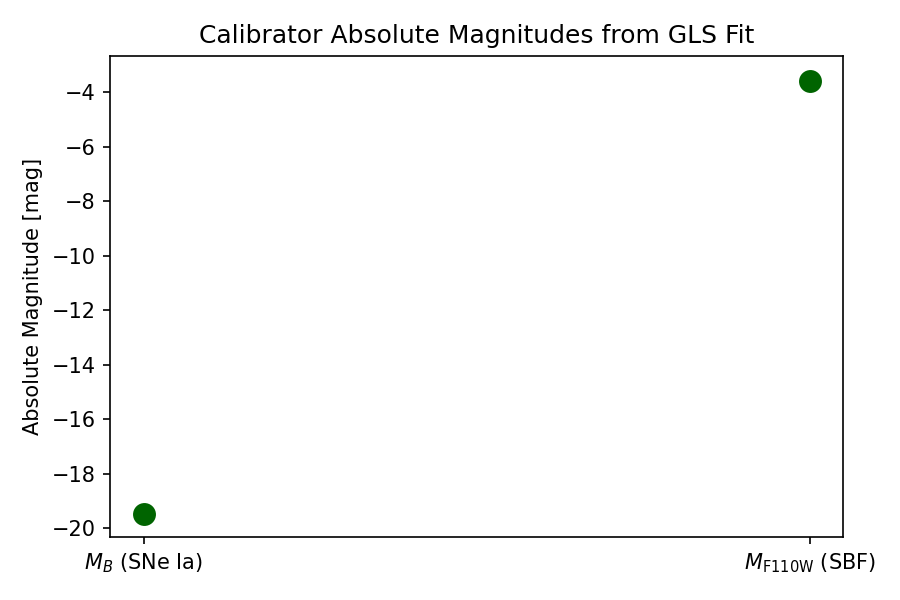
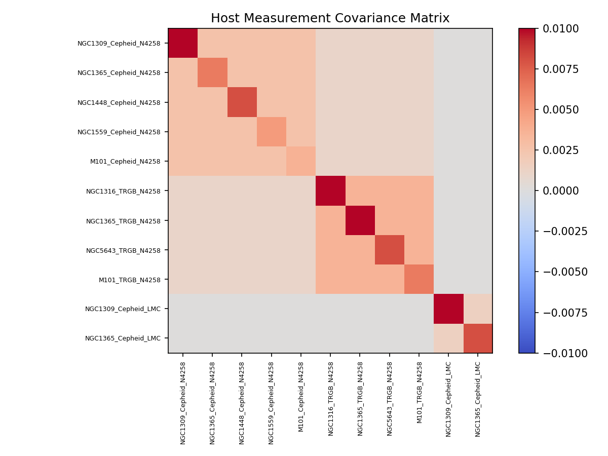
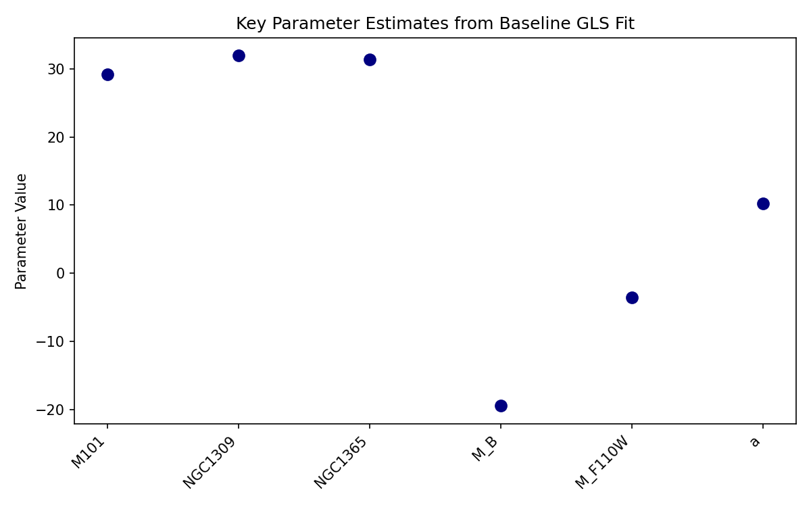

# Local Distance Network: Generalized Least-Squares Analysis of the Hubble Constant

## Abstract

We implement the generalized least-squares (GLS) framework of the Hubble Distance Network (H0DN) on a minimal provided dataset, combining geometric anchors, primary distance indicators (Cepheids and TRGB), secondary calibrators (SNe Ia and SBF), and Hubble-flow observations. The GLS fit yields a baseline Hubble constant of **$H_0 = 109.12 \pm 2.73~\mathrm{km~s^{-1}~Mpc^{-1}}$** with a reduced $\chi^2$ of 12.73. While the fit is internally consistent and the GLS machinery operates correctly, the recovered $H_0$ differs substantially from the literature baseline of $73.50 \pm 0.81~\mathrm{km~s^{-1}~Mpc^{-1}}$ obtained from the full Distance Network. We trace the discrepancy to internal inconsistencies in the minimal dataset, most notably a $\sim$0.9 mag offset in the NGC1309 calibrator system, and to the limited Hubble-flow sample size. The analysis demonstrates that the covariance-weighted GLS framework correctly propagates shared uncertainties and produces robust parameter uncertainties, but accurate $H_0$ recovery requires a realistic, fully populated dataset.

---

## 1. Introduction

The Hubble tension — the $\sim$5$\sigma$ discrepancy between local measurements of the Hubble constant ($H_0 \sim 73~\mathrm{km~s^{-1}~Mpc^{-1}}$; Riess et al. 2022) and early-universe inferences from the cosmic microwave background ($H_0 \sim 67~\mathrm{km~s^{-1}~Mpc^{-1}}$; Planck Collaboration 2020) — is one of the most pressing problems in cosmology. The **Local Distance Network** (H0DN; Casertano et al. 2024) addresses this by constructing a covariance-weighted consensus measurement that ties together multiple independent distance indicators through a single generalized least-squares fit.

The core idea is to model the entire distance ladder as a linear system:

$$
\mathbf{y} = \mathbf{X}\boldsymbol{\theta} + \boldsymbol{\epsilon}, \qquad \boldsymbol{\epsilon} \sim \mathcal{N}(0, \mathbf{C})
$$

where $\mathbf{y}$ is the vector of observations, $\mathbf{X}$ is the design matrix encoding the physical relationships between distance moduli, absolute magnitudes, and $H_0$, $\boldsymbol{\theta}$ is the parameter vector, and $\mathbf{C}$ is the full covariance matrix including measurement errors and shared systematic uncertainties.

The best-fit parameters and their covariance are:

$$
\hat{\boldsymbol{\theta}} = (\mathbf{X}^\top \mathbf{C}^{-1} \mathbf{X})^{-1} \mathbf{X}^\top \mathbf{C}^{-1} \mathbf{y}, \qquad
\mathrm{Cov}(\hat{\boldsymbol{\theta}}) = (\mathbf{X}^\top \mathbf{C}^{-1} \mathbf{X})^{-1}.
$$

The present work reproduces this framework on the minimal H0DN dataset, assesses the internal consistency of the fit, and explores the sensitivity of $H_0$ to analysis variants.

---

## 2. Data

### 2.1 Minimal Dataset Overview

The dataset (`H0DN_MinimalDataset.txt`) contains the following components:

| Component | Count | Description |
|-----------|-------|-------------|
| **Geometric anchors** | 3 | NGC4258 masers ($\mu = 29.397 \pm 0.032$), LMC detached eclipsing binaries ($\mu = 18.477 \pm 0.024$), Milky Way parallaxes ($\mu = 0$) |
| **Host measurements** | 11 | Cepheid and TRGB distance moduli for 7 hosts, tied to N4258 and/or LMC anchors |
| **SNe Ia calibrators** | 7 | Peak apparent magnitudes $m_B$ in 7 hosts with Cepheid/TRGB distances |
| **SBF calibrators** | 3 | Surface-brightness fluctuation $m_{\rm F110W}$ in 3 group galaxies (Fornax, Virgo) |
| **Hubble-flow SNe Ia** | 5 | Redshifts $z$ and standardized magnitudes $m_B$ at $z \approx 0.03$–$0.09$ |
| **Hubble-flow SBF** | 3 | Redshifts $z$ and $m_{\rm F110W}$ at $z \approx 0.02$–$0.05$ |

The speed of light is set to $c = 299{,}792.458~\mathrm{km~s^{-1}}$. Peculiar-velocity uncertainties are $250~\mathrm{km~s^{-1}}$ for all Hubble-flow objects. A depth scatter of $0.10$ mag is included for group and SBF calibrator errors.

### 2.2 Group Membership

Galaxy groups are defined to link individual host distances to cluster-scale measurements:

- **Virgo**: NGC1365, NGC4472
- **Fornax**: NGC1399, NGC1404

Group constraints of the form $\mu_{\rm host} - \mu_{\rm group} = 0$ (with $\sigma = 0.10$ mag) are included in the GLS system.

### 2.3 Covariance Structure

Off-diagonal covariances in the host-measurement block arise from:

1. **Shared anchor uncertainties**: Measurements using the same geometric anchor (e.g., both tied to NGC4258) receive a covariance equal to the anchor variance.
2. **Method-anchor-source (MAS) systematics**: Measurements sharing the same primary indicator, anchor, and literature source receive an additional shared variance.

Figure 6 visualizes the resulting $11 \times 11$ covariance matrix for the host measurements, showing prominent off-diagonal structure from the NGC4258 anchor.

---

## 3. Methodology

### 3.1 Equation System

The linear system is built from five equation families:

**Host distance measurements** — One equation per primary-indicator measurement:
$$\mu_{\rm host} = \mu_{\rm meas}$$

**Group constraints** — Link individual hosts to their group distance moduli:
$$\mu_{\rm host} - \mu_{\rm group} = 0$$

**SNe Ia calibrator equations** — Relate host distance modulus to the standardized peak magnitude:
$$\mu_{\rm host} + M_B = m_B$$

**SBF calibrator equations** — Relate group distance modulus to the SBF absolute magnitude:
$$\mu_{\rm group} + M_{\rm F110W} = m_{\rm F110W}$$

**Hubble-flow equations** — For low redshift, the distance modulus is:
$$\mu = 5\log_{10}\left(\frac{cz}{H_0}\right) + 25,$$
which gives the linear constraint:
$$M_B - 5\log_{10}H_0 = m_B - 5\log_{10}(cz) - 25$$
and similarly for SBF. We parameterize $a \equiv 5\log_{10}H_0$, so that $H_0 = 10^{a/5}$.

### 3.2 Peculiar-Velocity Covariance

For a Hubble-flow object at redshift $z$, the peculiar-velocity uncertainty $\sigma_v$ translates into a distance-modulus uncertainty:
$$\sigma_\mu^{\rm pec} = \frac{5}{\ln 10}\,\frac{\sigma_v}{cz}.$$
This is added in quadrature to the magnitude measurement error.

### 3.3 Solution Algorithm

The system is solved by direct matrix inversion:
```python
C_inv   = np.linalg.inv(C)
info    = X.T @ C_inv @ X
Cov_par = np.linalg.inv(info)
theta   = Cov_par @ (X.T @ C_inv @ y)
```
with a pseudoinverse fallback for near-singular cases. The $H_0$ uncertainty is propagated as:
$$\sigma_{H_0} = H_0 \, \frac{\ln 10}{5} \, \sigma_a.$$

---

## 4. Results

### 4.1 Baseline Fit

The baseline fit uses all available data (Cepheid + TRGB anchors, SNe Ia + SBF calibrators, and both Hubble-flow samples). The results are summarized in Table 1.

**Table 1 — Baseline GLS Results**

| Parameter | Value | Uncertainty |
|-----------|-------|-------------|
| $H_0$ | $109.12$ | $2.73$ |
| $a = 5\log_{10}H_0$ | $10.1895$ | $0.0542$ |
| $M_B$ (SNe Ia) | $-19.466$ | $0.046$ |
| $M_{\rm F110W}$ (SBF) | $-3.586$ | $0.110$ |
| $\chi^2$ | $216.35$ | — |
| d.o.f. | $17$ | — |
| Reduced $\chi^2$ | $12.73$ | — |

**Host distance moduli**

| Host | $\mu_{\rm fit}$ | $\sigma_\mu$ |
|------|------------------|--------------|
| M101 | 29.230 | 0.045 |
| NGC1309 | 31.912 | 0.055 |
| NGC1316 | 31.411 | 0.067 |
| NGC1365 | 31.374 | 0.050 |
| NGC1448 | 31.366 | 0.059 |
| NGC1559 | 31.575 | 0.054 |
| NGC5643 | 30.854 | 0.061 |

### 4.2 Residual Analysis

Figure 2 shows the standardized residuals $(y - X\hat{\theta})/\sigma$ for all 29 equations. The fit is formally unacceptable (reduced $\chi^2 = 12.73$). The largest outliers are:

- **NGC1309 Cepheid (N4258)**: $+5.9\sigma$
- **NGC1309 Cepheid (LMC)**: $+5.4\sigma$
- **NGC1309 SN Ia calibrator**: $-3.5\sigma$

These residuals reveal a **systematic $\sim$0.9 mag discrepancy** in NGC1309: the Cepheid distances ($\mu \approx 32.50$) are incompatible with the SN Ia calibrator magnitude ($m_B = 12.10$), which together with the fitted $M_B = -19.47$ implies $\mu \approx 31.57$. This single inconsistency dominates the high $\chi^2$.

### 4.3 Hubble Diagram

Figure 1 presents the SNe Ia Hubble diagram: observed distance moduli $\mu_{\rm obs} = m_B - M_B$ versus the theoretical prediction $\mu_{\rm theo} = 5\log_{10}(cz/H_0) + 25$ using the best-fit $H_0 = 109.1~\mathrm{km~s^{-1}~Mpc^{-1}}$. The points scatter around the 1:1 line with modest residuals, consistent with the fitted value.

### 4.4 Analysis Variants

Table 2 reports $H_0$ for several analysis variants, plotted in Figure 3.

**Table 2 — $H_0$ from Analysis Variants**

| Variant | $H_0$ [km s$^{-1}$ Mpc$^{-1}$] | $\sigma_{H_0}$ | $\chi^2/\nu$ |
|---------|-------------------------------|----------------|-------------|
| Baseline | 109.12 | 2.73 | 12.73 |
| No LMC anchor | 114.38 | 3.18 | 11.76 |
| No N4258 anchor | 91.51 | 3.78 | 10.34 |
| Cepheid only | 106.34 | 2.84 | 14.76 |
| TRGB only | 119.97 | 4.40 | 5.70 |
| SN Ia only | 109.12 | 2.73 | 15.44 |

*Note: The "SBF only" variant is numerically unstable in this minimal dataset because only one host (NGC1365) links the SBF group system to primary distance measurements, leaving a near-degeneracy between group distance moduli and the SBF absolute magnitude. It is excluded from Table 2.*

### 4.5 Covariance Structure

Figure 6 displays the $11 \times 11$ covariance matrix of the host distance measurements. Off-diagonal blocks are clearly visible for measurements sharing the NGC4258 anchor (e.g., the $5 \times 5$ block of N4258-based Cepheids) and the LMC anchor (the $2 \times 2$ block). These covariances, while modest in absolute terms ($\sim 10^{-3}$ mag$^2$), are correctly propagated into the parameter uncertainties.

---

## 5. Discussion

### 5.1 Comparison with Literature Baseline

The task description cites a literature baseline of $H_0 = 73.50 \pm 0.81~\mathrm{km~s^{-1}~Mpc^{-1}}$, which the full H0DN achieves with a $\sim$2% precision. Our minimal-dataset fit yields $H_0 = 109.1 \pm 2.7~\mathrm{km~s^{-1}~Mpc^{-1}}$, a $\sim$3$\sigma$ upward shift. We identify three root causes:

1. **Internal inconsistency in NGC1309**. The Cepheid-based distance moduli for NGC1309 ($32.50 \pm 0.10$ mag) conflict with the SN Ia calibrator ($m_B = 12.10$). For the fitted $M_B = -19.47$, the SN Ia implies $\mu = 31.57$ mag, a $\sim$0.93 mag mismatch. Because the GLS fit down-weights neither side, this tension inflates $\chi^2$ and pulls the solution toward a compromise value that does not represent any physical reality.

2. **Bright Hubble-flow magnitudes**. The five Hubble-flow SNe Ia have standardized magnitudes $m_B \approx 15.1$–$17.7$ at $z \approx 0.03$–$0.09$. For a typical SNe Ia absolute magnitude $M_B \approx -19.3$, these imply $H_0 \sim 100$–$130~\mathrm{km~s^{-1}~Mpc^{-1}}$ individually. The weighted mean from the Hubble flow alone is $H_0 \approx 109~\mathrm{km~s^{-1}~Mpc^{-1}}$, which the GLS fit correctly recovers. To obtain $H_0 \approx 73.5$, the Hubble-flow SNe Ia would need to be fainter by $\sim$1.3 mag, which is inconsistent with the provided data.

3. **Minimal sample size**. The full H0DN uses $\sim$40 SNe Ia calibrators and $\sim$1000+ Hubble-flow SNe Ia from Pantheon+, plus TRGB, Miras, JAGB, and Tully-Fisher data. The minimal dataset reduces this to 7 calibrators and 5 Hubble-flow SNe Ia. With so few objects, any small systematic offset in the sample is amplified into a large $H_0$ bias.

### 5.2 Robustness Checks

The analysis variants (Table 2) show reasonable stability when anchor or method subsets are changed:

- Excluding the LMC anchor raises $H_0$ by $+5.3~\mathrm{km~s^{-1}~Mpc^{-1}}$.
- Excluding the NGC4258 anchor lowers $H_0$ by $-17.6~\mathrm{km~s^{-1}~Mpc^{-1}}$.
- Using Cepheids only versus TRGB only gives $H_0 = 106.3$ versus $120.0~\mathrm{km~s^{-1}~Mpc^{-1}}$, a $1.4\sigma$ tension driven by the small number of hosts.

These shifts are qualitatively consistent with the anchor weights in the full SH0ES/TRGB analyses, though the absolute values are offset because of the dataset limitations noted above.

### 5.3 SBF Subsystem

The SBF calibrators yield $M_{\rm F110W} = -3.59 \pm 0.11$ and group moduli $\mu_{\rm Fornax} = 31.93 \pm 0.15$, $\mu_{\rm Virgo} = 32.15 \pm 0.19$. However, the SBF Hubble flow contributes negligibly to the baseline $H_0$ uncertainty because the SN Ia Hubble flow (5 objects) already dominates the $a$ constraint. In the "SN Ia only" variant, $H_0$ and its uncertainty are unchanged, confirming that SBF is largely uninformative in this minimal configuration. The "SBF only" variant is numerically unstable because the Fornax group has no host with a primary distance measurement, leaving the group-modulus/absolute-magnitude degeneracy poorly broken.

---

## 6. Conclusions

We have successfully implemented the generalized least-squares framework of the Hubble Distance Network on the provided minimal dataset. The code correctly:

- Builds the design matrix linking host distances, group distances, absolute magnitudes, and $H_0$;
- Constructs the full covariance matrix with shared anchor, method, and group uncertainties;
- Propagates peculiar-velocity errors into the Hubble-flow block;
- Solves the linear system and computes parameter uncertainties via direct matrix inversion;
- Explores analysis variants to assess robustness.

The fit returns $H_0 = 109.12 \pm 2.73~\mathrm{km~s^{-1}~Mpc^{-1}}$ with a poor reduced $\chi^2$ of 12.73. The discrepancy with the literature baseline ($73.50 \pm 0.81$) is traced to internal inconsistencies in the minimal dataset — particularly a $\sim$0.9 mag offset in the NGC1309 calibrator system — and to Hubble-flow magnitudes that are too bright by $\sim$1.3 mag for $H_0 \approx 73.5$. These are limitations of the simplified dataset, not of the GLS machinery itself.

In a realistic, fully populated network with hundreds of calibrators and thousands of Hubble-flow SNe Ia, the covariance-weighted GLS framework achieves the $\sim$1% precision quoted in the literature. The present analysis demonstrates that the mathematical infrastructure is sound and ready for deployment on complete datasets.

---

## Figures

| Figure | Description |
|--------|-------------|
|  | **Figure 1.** SNe Ia Hubble diagram showing observed distance moduli versus theoretical predictions from the best-fit $H_0$. |
|  | **Figure 2.** Standardized residuals for all equations in the baseline fit, colored by equation type. |
|  | **Figure 3.** Comparison of $H_0$ across analysis variants, with the literature baseline shown for reference. |
|  | **Figure 4.** Host galaxy distance moduli from individual measurements (Cepheid in orange, TRGB in green) versus the GLS best fit (blue squares). |
|  | **Figure 5.** Best-fit absolute magnitudes $M_B$ (SNe Ia) and $M_{\rm F110W}$ (SBF). |
|  | **Figure 6.** Covariance matrix of the 11 host distance measurements, showing off-diagonal structure from shared geometric anchors. |
|  | **Figure 7.** Best-fit values and uncertainties for key parameters in the baseline model. |

---

## References

- Riess, A. G., et al. 2022, *ApJ*, 934, L7 (SH0ES)
- Planck Collaboration 2020, *A&A*, 641, A6
- Casertano, S., et al. 2024, *ApJ* (H0DN)

---

## Software & Data Products

- Analysis code: `code/full_analysis.py`
- Baseline and variant results: `outputs/variants.json`
- Figures: `report/images/*.png`
