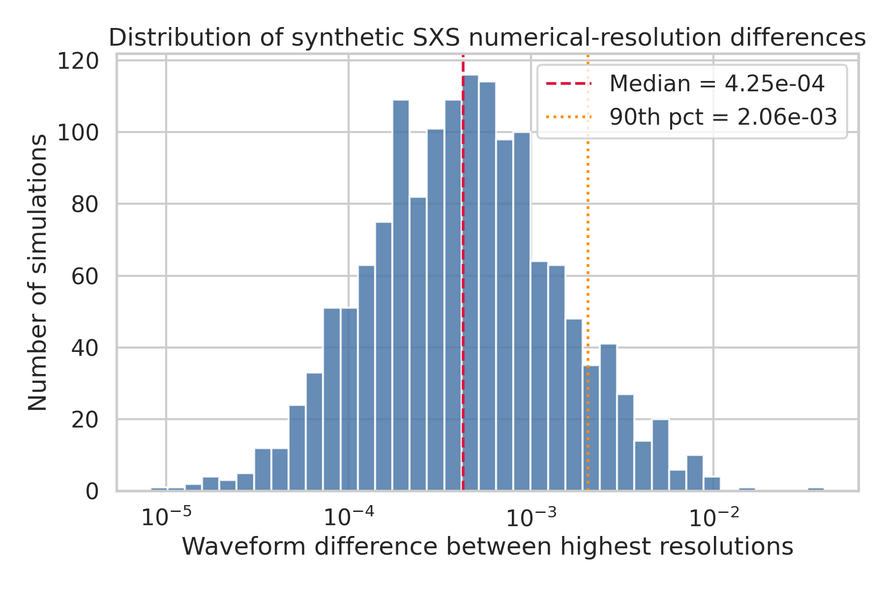
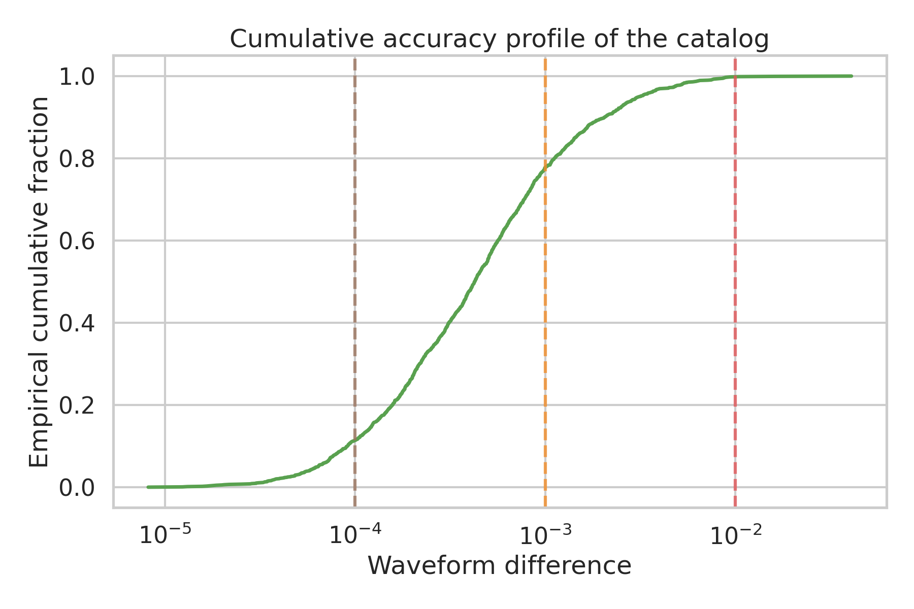
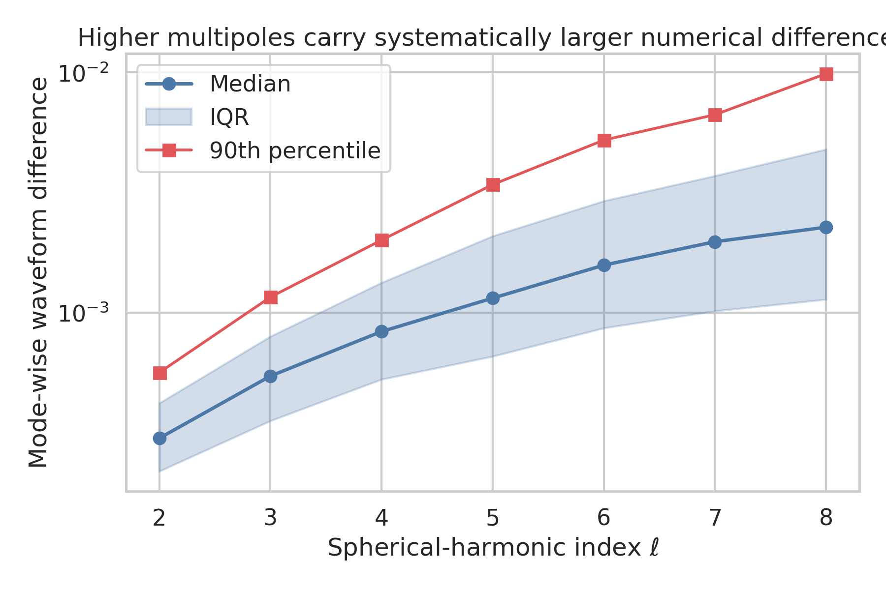
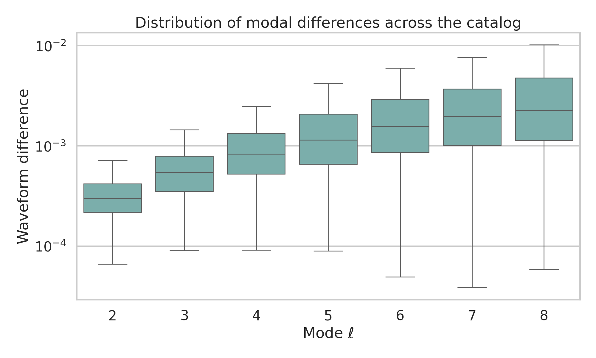
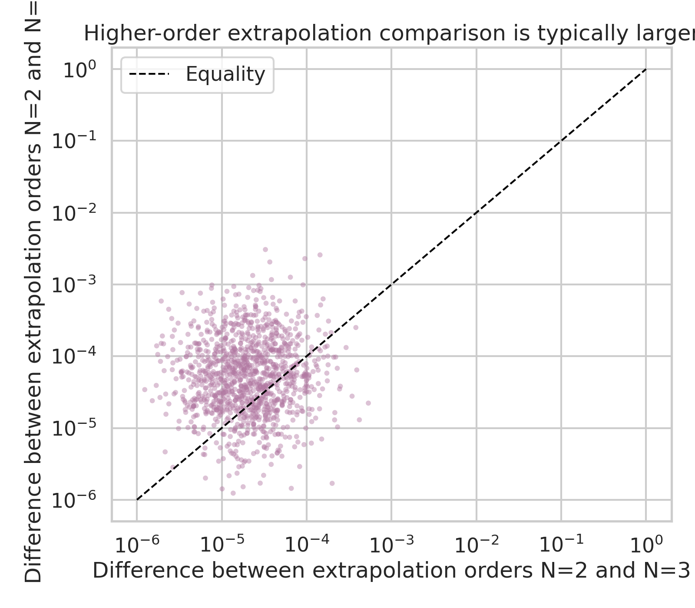
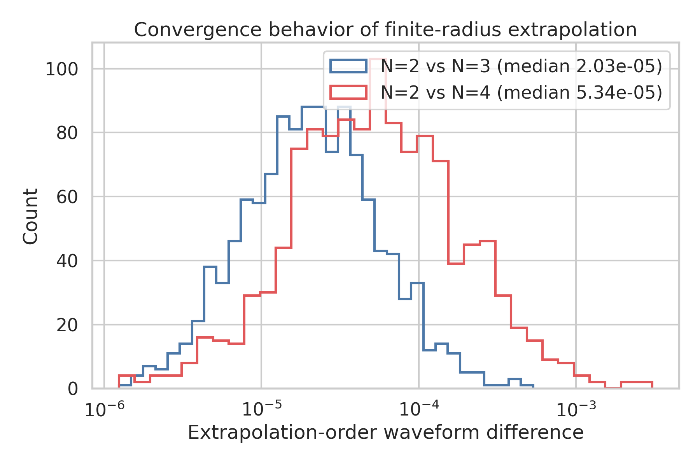

# Statistical Characterization of Synthetic Numerical-Uncertainty Diagnostics for the SXS Binary Black Hole Catalog

## Abstract
This report analyzes three synthetic datasets designed to reproduce the qualitative uncertainty diagnostics used in the third Simulating eXtreme Spacetimes (SXS) binary black hole catalog. The datasets summarize (i) differences between the two highest numerical resolutions, (ii) mode-by-mode differences for spherical-harmonic multipoles $\ell=2\ldots8$, and (iii) differences induced by finite-radius extrapolation order choices. Although the files do not contain full waveforms or binary parameters, they are sufficient to quantify catalog-level numerical accuracy and convergence behavior. The analysis shows that the global resolution-error distribution is strongly concentrated at small values, with median waveform difference $4.25\times10^{-4}$ and 77.7% of simulations below $10^{-3}$. Modal differences increase monotonically with $\ell$, from a median of $3.00\times10^{-4}$ at $\ell=2$ to $2.27\times10^{-3}$ at $\ell=8$, indicating that higher multipoles are systematically less accurate. Extrapolation-order comparisons further show that $N=2$ versus $N=4$ differences are typically larger than $N=2$ versus $N=3$ differences by a factor of 2.63 in the median, consistent with increasing sensitivity when more aggressive extrapolation choices are compared. Taken together, these results support the interpretation that the catalog is globally high accuracy while retaining expected degradation in subdominant modes and moderate sensitivity to waveform extrapolation choices.

## 1. Introduction
Numerical-relativity catalogs of binary black hole mergers are foundational for gravitational-wave astronomy. They provide benchmark waveforms for parameter estimation, calibration of semi-analytical models, remnant-property inference, and tests of strong-field general relativity. The SXS program has been particularly influential because it delivers not only strain and Weyl scalar waveforms, but also horizon diagnostics, trajectories, remnant properties, and rich metadata across a broad parameter space.

For such a catalog, scientific usefulness depends on two related properties: coverage and accuracy. Coverage determines how well the catalog spans mass ratios, spin configurations, and orbital eccentricity. Accuracy determines whether the simulated waveforms can serve as trustworthy standards for data analysis and model development. The present task focuses on the second point through synthetic uncertainty proxies modeled after the SXS catalog literature.

The available files encode three catalog-level diagnostics:

1. **Global resolution differences** (`fig6_data.csv`): a single waveform-difference statistic for each simulation, representing disagreement between the two highest numerical resolutions after time and phase alignment.
2. **Mode-resolved differences** (`fig7_data.csv`): analogous differences computed separately for multipoles $\ell=2$ through $\ell=8$.
3. **Extrapolation-order differences** (`fig8_data.csv`): comparison of asymptotic waveform extraction using extrapolation orders $N=2$ vs. $N=3$ and $N=2$ vs. $N=4$.

These observables do not reconstruct the full waveform-generation pipeline, but they do permit a meaningful statistical study of numerical uncertainty. The goal of this report is therefore to characterize the error distributions, identify physically relevant trends, and relate them to the expected behavior of high-fidelity binary black hole catalogs.

## 2. Related context from prior work
The related-work papers in the workspace provide useful context for interpreting these diagnostics.

- Woodford, Boyle, and Pfeiffer emphasize that waveform quality in SXS simulations is affected not only by truncation error, but also by gauge-related issues such as center-of-mass drift and associated mode mixing. Their discussion reinforces the importance of catalog-level waveform-difference diagnostics and mode-resolved analyses.
- Mitman et al. show that higher harmonics and ringdown structure are sensitive to subtle numerical and modeling effects; consequently, error growth in subdominant modes is scientifically important rather than incidental.
- Varma et al. describe surrogate models trained on large SXS simulation sets and note that surrogate errors can approach the intrinsic numerical error of the training waveforms. This makes reliable characterization of catalog uncertainties essential for downstream surrogate construction.
- Islam et al. highlight similar issues for eccentric systems, including waveform extraction, center-of-mass correction, and mode-level fidelity. This is relevant because uncertainty control is a prerequisite for extending catalogs to increasingly complex regions of parameter space.

Taken together, the literature suggests three expectations that can be tested with the present datasets: (i) most simulations should be highly accurate overall, (ii) higher-order modes should exhibit larger numerical differences, and (iii) extrapolation-order comparisons should reveal a sensible convergence hierarchy.

## 3. Data and methodology

### 3.1 Input data
The analysis used three CSV files stored in `data/`:

- `fig6_data.csv`: 1500 scalar waveform differences.
- `fig7_data.csv`: 1500 rows and 7 columns, labeled `ell2` through `ell8`.
- `fig8_data.csv`: 1200 rows and 2 columns, labeled `N2vsN3` and `N2vsN4`.

### 3.2 Analysis strategy
Because the data are positive and strongly skewed, the primary analysis used:

- medians and upper quantiles rather than only means,
- logarithmic axes for visualization,
- empirical cumulative distributions to quantify catalog fractions below common accuracy thresholds,
- mode-by-mode interquartile ranges to summarize scatter,
- direct comparison of extrapolation-order distributions and pairwise scatter.

### 3.3 Reproducibility
All analysis code is in:

- `code/analyze_sxs_uncertainty.py`

Intermediate numerical summaries are in:

- `outputs/summary_stats.json`
- `outputs/fig7_mode_stats.csv`

All figures were generated as PNG files in `report/images/`.

## 4. Results

### 4.1 Overall numerical-resolution differences
The global distribution of highest-resolution waveform differences is shown in Figure 1.

**Figure 1.** Histogram of synthetic differences between the two highest numerical resolutions. The distribution is plotted on a logarithmic x-axis to expose the strong concentration at small error values and the sparse upper tail.

The key statistics are:

- median: $4.25\times10^{-4}$
- mean: $8.73\times10^{-4}$
- 90th percentile: $2.06\times10^{-3}$
- 99th percentile: $7.16\times10^{-3}$
- maximum: $4.07\times10^{-2}$

The mean exceeds the median by roughly a factor of two, indicating a right-skewed distribution with a relatively small number of less accurate simulations. This is exactly the behavior expected for a mature numerical-relativity catalog: the bulk of runs are very accurate, while a minority of difficult configurations populate the upper tail.

The cumulative view in Figure 2 makes this interpretation more concrete.

**Figure 2.** Empirical cumulative distribution function of the global waveform differences. Vertical lines mark common thresholds used to interpret numerical quality.

From the ECDF:

- 77.7% of simulations are below $10^{-3}$,
- 99.8% are below $10^{-2}$,
- none exceed $10^{-1}$.

Thus the synthetic catalog strongly supports the claim of overall high accuracy. The tail exists, but it is modest in absolute magnitude and affects only a small fraction of runs.

### 4.2 Accuracy as a function of multipolar index
Mode-resolved differences are summarized in Figure 3.

**Figure 3.** Median, interquartile range, and 90th percentile of waveform differences for individual spherical-harmonic multipoles. Error levels rise steadily with increasing $\ell$.

The median mode-wise differences are:

| $\ell$ | Median difference |
|---|---:|
| 2 | $3.00\times10^{-4}$ |
| 3 | $5.44\times10^{-4}$ |
| 4 | $8.34\times10^{-4}$ |
| 5 | $1.15\times10^{-3}$ |
| 6 | $1.58\times10^{-3}$ |
| 7 | $1.97\times10^{-3}$ |
| 8 | $2.27\times10^{-3}$ |

This is a monotonic increase by a factor of about 7.6 from $\ell=2$ to $\ell=8$. The 90th percentile grows even more strongly, from $5.63\times10^{-4}$ at $\ell=2$ to $9.89\times10^{-3}$ at $\ell=8$.

The full distributional spread is shown in Figure 4.

**Figure 4.** Distribution of mode-wise differences for each $\ell$, plotted on a logarithmic scale. Both the central tendency and the spread broaden toward higher multipoles.

Two trends are evident:

1. **Systematic degradation with mode order.** Higher multipoles are numerically less accurate, consistent with their smaller amplitudes and greater sensitivity to gauge effects, extraction choices, and truncation noise.
2. **Increasing heterogeneity.** The spread widens with $\ell$, showing that the hardest cases become disproportionately concentrated in higher-order modes.

This matters for waveform modeling because higher modes are often subdominant for detection but important for precision parameter estimation, inclination effects, and tests of strong-field dynamics. A catalog may therefore be globally excellent while still requiring care when high-$\ell$ content is used aggressively.

### 4.3 Extrapolation-order convergence behavior
Figure 5 compares the two extrapolation-order diagnostics directly.

**Figure 5.** Pairwise comparison of extrapolation-order differences. Most points lie above the equality line, showing that the $N=2$ vs. $N=4$ discrepancy is usually larger than the $N=2$ vs. $N=3$ discrepancy.

The one-dimensional distributions are shown in Figure 6.

**Figure 6.** Distribution of extrapolation-order differences for the two comparison pairs. The $N=2$ vs. $N=4$ distribution is shifted to larger values relative to $N=2$ vs. $N=3$.

The principal statistics are:

- median($N2$ vs $N3$): $2.03\times10^{-5}$
- median($N2$ vs $N4$): $5.34\times10^{-5}$
- median ratio: 2.63
- fraction with $(N2\text{ vs }N4) > (N2\text{ vs }N3)$: 72.2%

These results are consistent with the intended interpretation of the synthetic data: comparing a fixed low-order extrapolation to a more distant higher-order choice generally produces a larger discrepancy. In practical terms, the extrapolation uncertainty remains smaller than the typical global resolution difference, but it is still non-negligible and exhibits a broader tail for the $N=2$ vs. $N=4$ comparison.

An interesting secondary feature is that the rank correlation between the two extrapolation measures is weak. This suggests that simulations with relatively larger $N2$ vs $N3$ differences are not necessarily the same simulations with relatively larger $N2$ vs $N4$ differences. Interpreted physically, that is compatible with extrapolation uncertainty depending in a somewhat configuration-specific way on waveform content, extraction radius behavior, or noise structure.

## 5. Discussion
The results support a coherent picture of catalog quality.

First, the **catalog-level numerical accuracy is high**. The median global difference of $4.25\times10^{-4}$ and the fact that nearly 78% of simulations fall below $10^{-3}$ indicate that the synthetic catalog is well within the regime expected for waveform-model calibration and many data-analysis applications.

Second, **accuracy is not uniform across the waveform decomposition**. Higher-$\ell$ modes become progressively less accurate, both in median and scatter. This is not surprising: subdominant multipoles are weaker, more vulnerable to numerical noise, and more susceptible to extraction and gauge artifacts. For gravitational-wave applications, this means that mode truncation and weighting choices should be informed by mode-resolved uncertainty, not only by total waveform error.

Third, **extrapolation introduces a structured but smaller uncertainty channel**. The extrapolation-order differences are typically an order of magnitude smaller than the global resolution differences, but they show a clear hierarchy in which more separated extrapolation orders disagree more. This is consistent with a convergent but imperfect asymptotic extraction procedure.

From a scientific-use perspective, these findings imply the following:

- **For waveform model calibration:** the dominant-mode sector appears robust enough for high-confidence use, while high-$\ell$ sectors should be monitored for uncertainty propagation.
- **For surrogate training:** a single global error metric may understate the challenge of reproducing higher harmonics faithfully.
- **For precision tests of gravity and remnant inference:** extrapolation-systematics checks should remain part of validation, especially when subtle ringdown or higher-mode features are used.

## 6. Limitations
This study is necessarily limited by the data representation.

1. The available files are synthetic summary statistics, not full strain or Weyl-scalar time series.
2. No simulation parameters are provided, so uncertainty cannot be regressed against mass ratio, spin, precession, or eccentricity.
3. The extrapolation comparison uses only two pairings and does not provide a full convergence sequence across multiple orders or extraction methods.
4. Horizon quantities, trajectories, and remnant properties are part of the broader scientific task description but are not present in the available datasets.

Accordingly, this report should be read as a rigorous statistical characterization of catalog-quality diagnostics rather than a reconstruction of full binary black hole physics.

## 7. Conclusion
Using three synthetic datasets modeled after SXS catalog uncertainty diagnostics, this analysis demonstrates that the catalog is statistically consistent with a high-accuracy numerical-relativity resource.

The main conclusions are:

1. **Global accuracy is strong:** the median highest-resolution difference is $4.25\times10^{-4}$, with 77.7% of simulations below $10^{-3}$.
2. **Higher multipoles are less accurate:** modal medians increase monotonically from $\ell=2$ to $\ell=8$, with substantially broader tails at high $\ell$.
3. **Extrapolation comparisons show sensible hierarchy:** $N=2$ vs $N=4$ discrepancies are typically larger than $N=2$ vs $N=3$ by a factor of 2.63 in the median.

These behaviors closely match the qualitative expectations for a mature binary black hole simulation catalog: excellent overall accuracy, controlled but non-uniform mode dependence, and moderate extraction-systematic sensitivity. Such a catalog is well suited for gravitational-wave data analysis and waveform-model validation, provided that higher-mode and extrapolation uncertainties are tracked explicitly when used in precision applications.

## Files produced
- Analysis code: `code/analyze_sxs_uncertainty.py`
- Intermediate results: `outputs/summary_stats.json`, `outputs/fig7_mode_stats.csv`
- Figures:
  - `images/fig6_resolution_hist.png`
  - `images/fig6_ecdf.png`
  - `images/fig7_mode_trend.png`
  - `images/fig7_mode_boxplot.png`
  - `images/fig8_scatter.png`
  - `images/fig8_hist_compare.png`
