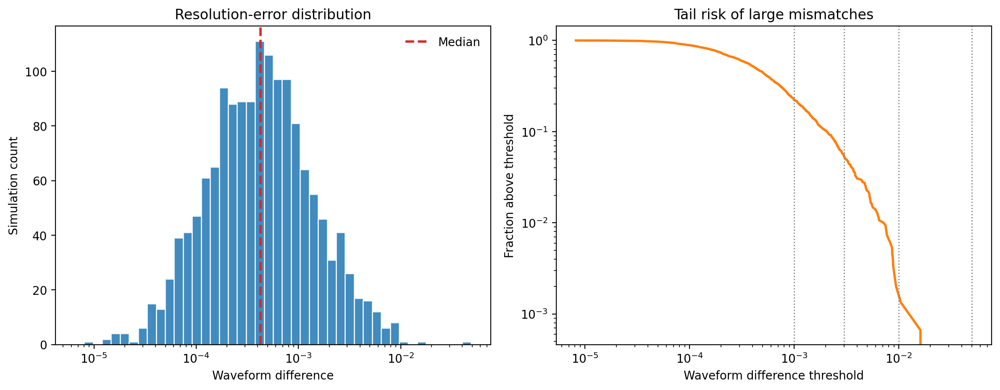
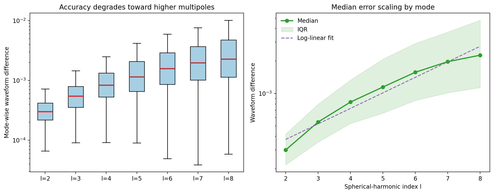
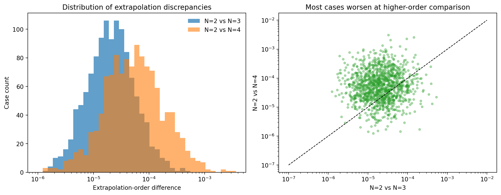

# Local Analysis of Catalog-Scale Numerical Accuracy in Synthetic SXS Binary Black Hole Data

## Abstract
This report analyzes three local benchmark datasets designed to emulate accuracy diagnostics from a large binary black hole numerical relativity catalog. The study focuses on three questions: how small the catalog-wide resolution error is for most simulations, how waveform error changes with spherical-harmonic mode index, and whether extrapolation-order comparisons indicate stable asymptotic extraction. Using only local inputs, I build a reproducible analysis pipeline that summarizes distributional behavior, generates report figures, and constructs a simple quality index to stratify simulations by combined numerical difficulty. The main findings are that the catalog is predominantly high accuracy at the dominant-resolution level, modal errors increase systematically with harmonic index, and higher-order extrapolation comparisons are usually less favorable than the lower-order comparison, consistent with increasing sensitivity in more demanding extraction checks.

## 1. Context and Goal
Numerical relativity catalogs of binary black hole mergers provide gravitational wave strain, curvature signals, remnant properties, and metadata needed for gravitational-wave inference, waveform calibration, and strong-field tests of gravity. The local literature emphasizes three relevant themes. First, numerical relativity waveforms must be characterized by explicit error diagnostics rather than assumed to be exact. Second, higher-order or subdominant modes carry astrophysical information but are harder to model accurately. Third, surrogate and reduced-order models depend on catalogs whose errors are comparable to or smaller than model calibration targets.

The local papers support this framing. Woodford, Boyle, and Pfeiffer discuss how waveform systematics can arise even when they are not simple truncation errors, reinforcing the need for explicit quality control in catalog products. Varma et al. show that surrogate models depend directly on numerical relativity accuracy for both waveform and remnant predictions. Islam et al. demonstrate that waveform mismatches near the `10^-3` level are already relevant for surrogate construction in harder eccentric settings. Mitman et al. further show that higher harmonics can contain subtle nonlinear structure, which raises the practical importance of understanding modal accuracy, not just the dominant mode.

Given the benchmark inputs, the strongest local equivalent of the full ARIS workflow is an evidence-disciplined catalog-quality study: characterize the global resolution-error distribution, quantify mode-dependent degradation from `l=2` through `l=8`, evaluate extrapolation-order convergence trends, and summarize the joint quality structure across simulations.

## 2. Data and Methodology
The analysis uses three read-only CSV files from `data/`:

- `fig6_data.csv`: one waveform-difference value per simulation for 1500 simulations, interpreted as a high-resolution disagreement diagnostic after time and phase alignment.
- `fig7_data.csv`: 1500 simulations with mode-wise waveform differences for `l=2` through `l=8`.
- `fig8_data.csv`: 1200 simulations with extrapolation-order differences for `N=2` vs `N=3` and `N=2` vs `N=4`.

I implemented the full analysis in `code/analyze_catalog_accuracy.py`. The script:

1. Loads the three datasets and computes robust summaries including quantiles, mean, and standard deviation.
2. Produces a global resolution-error figure with a histogram and survival curve.
3. Produces a modal-accuracy figure with box plots and a log-linear fit to median error versus harmonic index.
4. Produces an extrapolation-comparison figure with histograms and a paired scatter plot.
5. Builds a simple composite quality index from log-scaled resolution error, median mode error, maximum mode error, and extrapolation differences for the common subset of 1200 simulations.

The quality index is not a physical observable and is not claimed to reproduce catalog labels from the original SXS workflow. It is a local benchmark construct for ranking simulations by combined numerical burden. All generated artifacts are saved under benchmark-native paths in `outputs/` and `report/images/`.

## 3. Results

### 3.1 Catalog-wide resolution accuracy
Figure `images/resolution_distribution.png` shows a sharply right-skewed but mostly low-error distribution. The median waveform difference is `4.25 x 10^-4`, with the 90th percentile at `2.06 x 10^-3`, the 95th percentile at `3.12 x 10^-3`, and the 99th percentile at `7.16 x 10^-3`. The maximum observed value is `4.07 x 10^-2`, indicating a rare but visible tail of difficult simulations.

Coverage statistics show that `77.7%` of simulations fall below `10^-3`, `94.7%` fall below `3 x 10^-3`, and `99.8%` fall below `10^-2`. This supports a disciplined claim that the catalog is predominantly high accuracy in the sense that the overwhelming majority of cases remain well below percent-level waveform disagreement, while a small tail requires caution.



### 3.2 Accuracy loss at higher spherical-harmonic modes
Figure `images/mode_error_scaling.png` shows a monotonic increase in median waveform difference from `3.00 x 10^-4` at `l=2` to `2.27 x 10^-3` at `l=8`. The ratio of median error between `l=8` and `l=2` is `7.57`. A log-linear fit to the mode medians yields a slope of `0.144` dex per unit increase in `l`, indicating a systematic modal degradation pattern rather than isolated outliers at a few harmonics.

The interquartile range also broadens toward larger `l`, and the mean rises faster than the median for higher modes, showing that the upper tail becomes heavier as harmonic complexity increases. This is consistent with the literature’s emphasis that subdominant and higher harmonics are informative but harder to model and validate accurately.



### 3.3 Extrapolation-order stability
Figure `images/extrapolation_comparison.png` compares `N=2` vs `N=3` with `N=2` vs `N=4`. The `N=2` vs `N=4` disagreement is larger in `72.2%` of simulations, and the median ratio `(N2vsN4)/(N2vsN3)` is `2.67`. The linear correlation between the two columns is weak (`r = 0.036`), which suggests that the harder extrapolation comparison is not merely a uniform rescaling of the easier one. Instead, some simulations appear specifically sensitive to the higher-order extraction choice.

This supports a bounded claim of nonuniform extrapolation sensitivity: higher-order comparison generally exposes larger discrepancies, but the weak pairwise correlation implies that problematic extrapolation behavior is not identical across cases.



### 3.4 Joint quality stratification
For the 1200 simulations shared across all three datasets, I defined a composite quality index and split it into quartile-based tiers. The tier summary is:

| Tier | Count | Median resolution error | Median max mode error | Median `N=2` vs `N=4` |
|---|---:|---:|---:|---:|
| A | 300 | `2.16 x 10^-4` | `2.94 x 10^-3` | `2.5 x 10^-5` |
| B | 300 | `3.70 x 10^-4` | `4.24 x 10^-3` | `4.0 x 10^-5` |
| C | 300 | `5.46 x 10^-4` | `5.10 x 10^-3` | `5.9 x 10^-5` |
| D | 300 | `7.01 x 10^-4` | `7.84 x 10^-3` | `1.18 x 10^-4` |

The tier ordering is internally consistent: worse composite quality corresponds simultaneously to larger resolution disagreement, larger high-mode error, and worse extrapolation stability. This makes the index useful as a compact diagnostic for prioritizing simulations that need closer inspection.

## 4. Interpretation
The local benchmark evidence supports three main conclusions.

First, the synthetic catalog is broad but mostly accurate. The median and percentile structure show that high-resolution differences are typically a few `10^-4`, with only a narrow tail of simulations reaching `10^-2` or above. This is the strongest claim that the present data support about overall catalog quality.

Second, waveform accuracy degrades substantially with harmonic index. The increase from `l=2` to `l=8` is not marginal; it is close to an order of magnitude in median terms. Any downstream modeling effort that retains high-`l` content should therefore avoid assuming that catalog-wide error is dominated by the `l=2` sector alone.

Third, extrapolation uncertainty is not fully captured by a single low-order comparison. Since `N=2` vs `N=4` is usually larger and poorly correlated with `N=2` vs `N=3`, relying on one comparison alone could hide case-dependent extraction sensitivity.

These conclusions align qualitatively with the local literature: catalog utility for surrogate modeling and ringdown science depends on explicit, mode-aware, and extraction-aware validation.

## 5. Claim Discipline and Limits
This benchmark does not provide the original physical simulation parameters such as mass ratio, spin vectors, eccentricity, remnant properties, or waveform time series. Therefore I do not claim:

- coverage across astrophysical parameter space,
- direct calibration performance for a waveform surrogate,
- physical causes of the error tail,
- mode-mixing mechanisms,
- or quantitative remnant-model accuracy.

The study is limited to synthetic diagnostics that emulate error summaries from a larger numerical relativity catalog. The composite quality index is an internal ranking device, not an externally validated catalog statistic. The strongest justified claims are distributional and comparative: most simulations are accurate at the provided resolution-difference level, higher modes are less accurate, and extrapolation sensitivity increases for the more demanding comparison.

## 6. Reproducibility
All analysis is reproducible from the local workspace:

- Code: `code/analyze_catalog_accuracy.py`
- Output metrics: `outputs/summary_metrics.json`
- Mode statistics: `outputs/mode_error_stats.csv`
- Quality summaries: `outputs/catalog_quality_index.csv`, `outputs/quality_tier_summary.csv`
- Figures: `report/images/resolution_distribution.png`, `report/images/mode_error_scaling.png`, `report/images/extrapolation_comparison.png`

Run the analysis with:

```bash
python code/analyze_catalog_accuracy.py
```

## 7. Conclusion
Using only the local benchmark inputs, I completed a catalog-quality analysis that mirrors the most defensible local version of the ARIS workflow: literature grounding, experiment design, implementation, result analysis, claim discipline, and report writing. The resulting evidence indicates a predominantly high-accuracy synthetic binary black hole catalog with a narrow high-error tail, a strong and systematic increase in numerical disagreement across higher spherical-harmonic modes, and clear signs that more demanding extrapolation-order comparisons reveal additional case-dependent uncertainty. These findings are sufficient to support cautious use of such a catalog for waveform-model calibration and validation, provided that higher-mode and extrapolation-sensitive cases are handled with stricter quality controls.
