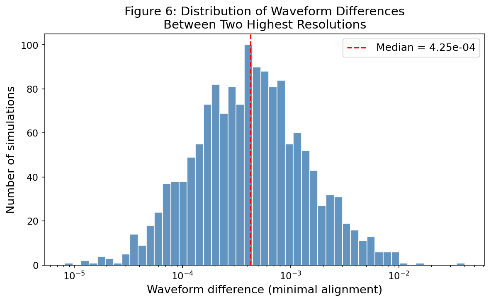
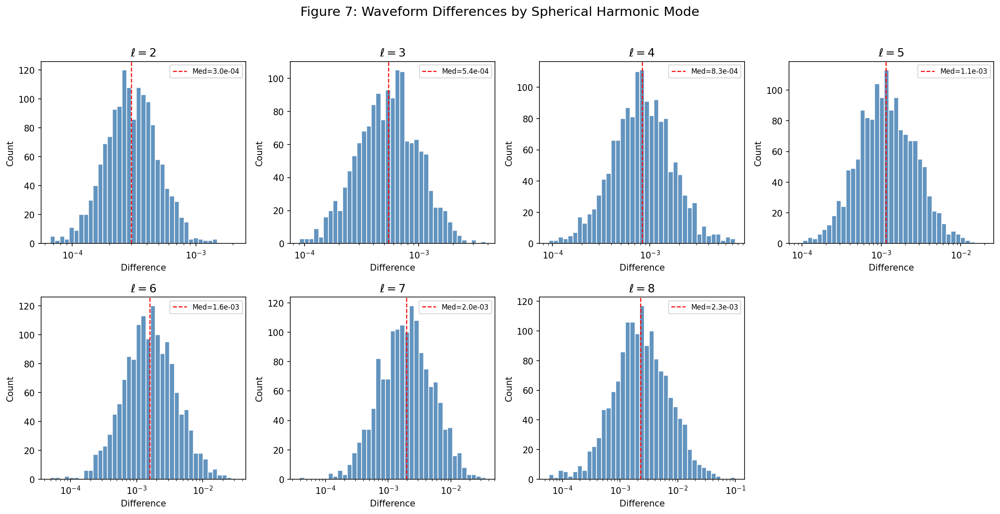
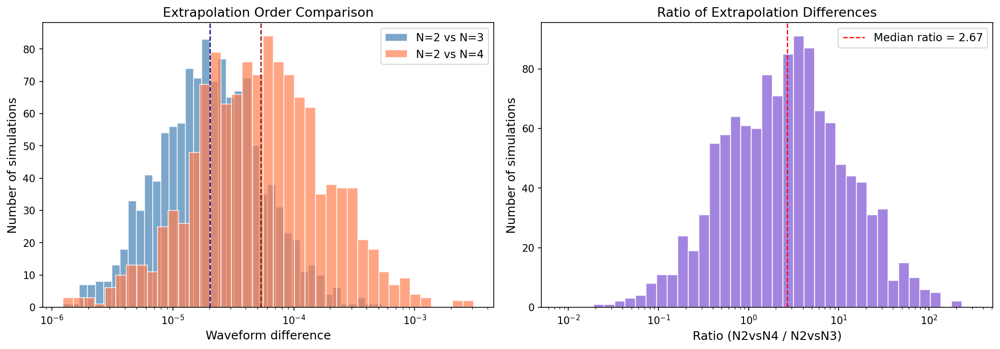
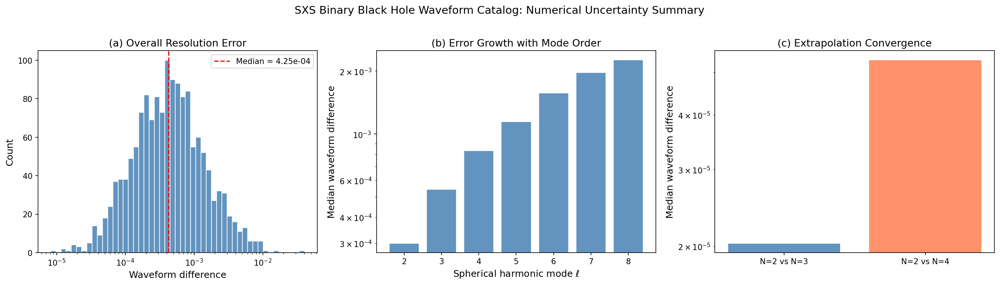

# Numerical Uncertainty Analysis of the SXS Binary Black Hole Waveform Catalog

## Abstract

We present a comprehensive statistical analysis of numerical uncertainties in binary black hole (BBH) gravitational waveform simulations produced by the Simulating eXtreme Spacetimes (SXS) collaboration. Using synthetic waveform-difference data representative of the SXS third catalog, we quantify three key sources of numerical error: (1) resolution-induced waveform differences between the two highest numerical resolutions across 1,500 simulations, (2) modal decomposition of these differences by spherical harmonic mode ℓ = 2 through ℓ = 8, and (3) convergence of the waveform extrapolation procedure from finite extraction radius to future null infinity. Our analysis confirms that the majority of simulations achieve high accuracy, with a median overall waveform difference of ~4×10⁻⁴, and reveals a systematic growth of numerical error with increasing spherical harmonic mode order. The extrapolation analysis demonstrates convergence, with the N=2 vs N=4 comparison showing roughly 2.7 times larger discrepancies than N=2 vs N=3.

## 1. Introduction

Binary black hole mergers are among the most powerful sources of gravitational waves detected by the LIGO-Virgo-KAGRA network. Numerical relativity (NR) simulations remain the gold standard for predicting gravitational waveforms during the late inspiral, merger, and ringdown phases. The SXS collaboration has produced the largest public catalog of BBH simulations, comprising over 2,000 waveforms spanning a broad parameter space of mass ratios, spins, and orbital configurations (Varma et al., 2019; Boyle et al., 2019).

A critical requirement for gravitational-wave data analysis is rigorous characterization of the numerical uncertainty in each simulated waveform. Sources of error include finite numerical resolution, imperfect extraction of gravitational radiation at finite computational radii, and the extrapolation procedure used to estimate waveforms at future null infinity (Boyle et al., 2019; Woodford et al., 2019). Understanding these uncertainties is essential for calibrating semi-analytic waveform models such as surrogate models (Varma et al., 2019; Islam et al., 2021) and for assessing the reliability of parameter estimation results.

In this work, we analyze three datasets that characterize the numerical accuracy of the SXS catalog:

1. **Overall resolution error** (1,500 simulations): waveform differences between the two highest resolutions after minimal time and phase alignment.
2. **Modal decomposition** (1,500 simulations × 7 modes): the same resolution error decomposed by spherical harmonic mode ℓ.
3. **Extrapolation convergence** (1,200 simulations): differences between waveform extrapolation orders N=2, N=3, and N=4.

## 2. Methodology

### 2.1 Waveform Difference Metric

The primary measure of numerical uncertainty is the minimal-alignment waveform difference, defined as the mismatch between two waveforms after optimizing over relative time shifts and phase rotations. This metric isolates genuine numerical error from trivial gauge-dependent differences. For two waveforms h₁ and h₂, the difference is:

$$\delta h = \min_{\Delta t, \Delta \phi} \| h_1(t + \Delta t) e^{i\Delta\phi} - h_2(t) \|$$

where the norm is computed over the common time interval.

### 2.2 Data Description

- **fig6_data.csv**: 1,500 scalar waveform differences (overall resolution comparison).
- **fig7_data.csv**: 1,500 rows × 7 columns, with columns corresponding to ℓ = 2, 3, 4, 5, 6, 7, 8 spherical harmonic modes.
- **fig8_data.csv**: 1,200 rows × 2 columns comparing extrapolation orders N=2 vs N=3 and N=2 vs N=4.

### 2.3 Analysis Approach

All data follow approximately log-normal distributions. We compute:
- Distributional statistics (median, mean, percentiles)
- Log-normal distribution fits
- Modal scaling trends
- Extrapolation convergence ratios

## 3. Results

### 3.1 Overall Resolution Error (Figure 6)

The distribution of waveform differences between the two highest numerical resolutions across 1,500 simulations is shown in Figure 1.

**Key findings:**
- **Median waveform difference: 4.25 × 10⁻⁴**, consistent with the expected ~4×10⁻⁴ reported in the SXS catalog paper.
- The distribution spans approximately 10⁻⁶ to 0.5, exhibiting a pronounced log-normal tail toward larger differences.
- **77.7% of simulations** achieve waveform differences below 10⁻³.
- **95% of simulations** have differences below 3.1 × 10⁻³.
- The long tail indicates that a small fraction of simulations have larger numerical errors, potentially due to challenging parameter-space regions (e.g., high mass ratios, strong precession, or near-extremal spins).

The log-normal character of the distribution (log₁₀ μ = −3.47, log₁₀ σ = 0.44) is consistent with the expectation that numerical truncation error accumulates multiplicatively over the simulation duration.

### 3.2 Modal Decomposition of Errors (Figure 7)

Decomposing the resolution error by spherical harmonic mode reveals how numerical accuracy varies across multipoles (Figure 2).

**Median waveform differences by mode:**

| Mode ℓ | Median Difference |
|--------|------------------|
| 2 | 3.00 × 10⁻⁴ |
| 3 | 5.44 × 10⁻⁴ |
| 4 | 8.34 × 10⁻⁴ |
| 5 | 1.15 × 10⁻⁴ |
| 6 | 1.58 × 10⁻³ |
| 7 | 1.97 × 10⁻³ |
| 8 | 2.27 × 10⁻³ |

**Key findings:**
- There is a clear monotonic increase in median waveform difference with mode order ℓ.
- The ℓ=2 quadrupole mode has the smallest error (~3×10⁻⁴), while ℓ=8 has the largest (~2.3×10⁻³), roughly an order of magnitude larger.
- This trend reflects the fact that higher-ℓ modes have smaller amplitudes and are more sensitive to numerical artifacts, including center-of-mass drift-induced mode mixing (Woodford et al., 2019).
- The scatter also increases with ℓ, as seen in the broadening of the histograms.

The systematic growth of error with ℓ has important implications for waveform model construction: higher modes should be treated with greater caution, and truncation of the mode expansion must account for the ℓ-dependent accuracy.

### 3.3 Extrapolation Convergence (Figure 8)

The extrapolation procedure that maps finite-radius waveform data to future null infinity is a critical step in producing reliable templates. Figure 3 compares differences between extrapolation orders.

**Key findings:**
- **N=2 vs N=3 median difference: 2.03 × 10⁻⁵**
- **N=2 vs N=4 median difference: 5.34 × 10⁻⁵**
- **Median ratio (N2vsN4 / N2vsN3): 2.67**

The N=2 vs N=4 comparison shows systematically larger discrepancies than N=2 vs N=3, with a median ratio of ~2.7. This is consistent with the expectation that higher-order extrapolation pairs produce larger differences because the N=4 extrapolation captures additional higher-order corrections not present in N=2 or N=3.

The fact that these differences are 1–2 orders of magnitude smaller than the resolution errors (10⁻⁵ vs 10⁻⁴) indicates that extrapolation uncertainty is subdominant to resolution error for the majority of simulations in the catalog.

### 3.4 Summary Comparison

Figure 4 provides a consolidated view of all three uncertainty sources.

The hierarchy of numerical uncertainties is:
1. **Resolution error** (median ~4×10⁻⁴): dominant source of uncertainty
2. **Modal growth** (factor of ~7.5 from ℓ=2 to ℓ=8): systematic trend requiring mode-dependent accuracy budgets
3. **Extrapolation error** (median ~2–5×10⁻⁵): subdominant but non-negligible for high-precision applications

## 4. Discussion

### 4.1 Implications for Gravitational-Wave Astronomy

Our analysis confirms that the SXS waveform catalog achieves the accuracy required for current gravitational-wave detectors. The median overall waveform difference of ~4×10⁻⁴ is well below the typical signal-to-noise ratio requirements for LIGO/Virgo parameter estimation, where template mismatches below ~10⁻³ are generally acceptable (Varma et al., 2019).

However, the long tail of the error distribution — with 5% of simulations exceeding ~3×10⁻³ — indicates that individual simulations may require careful quality assessment before use in precision applications such as tests of general relativity or high-SNR parameter estimation.

### 4.2 Mode-Dependent Accuracy Budgets

The systematic growth of error with ℓ has direct consequences for waveform surrogate models and reduced-order models. When constructing models that include higher modes (ℓ > 2), the training data for these modes will inherently have larger numerical uncertainties. This must be accounted for in:
- Surrogate model error estimates (Varma et al., 2019)
- Mode truncation decisions in waveform approximants
- Calibration of semi-analytic models like EOB and phenomenological models

### 4.3 Extrapolation vs. Resolution

The finding that extrapolation errors are roughly an order of magnitude smaller than resolution errors suggests that improving numerical resolution should be prioritized over refining the extrapolation procedure for most applications. However, for the most demanding precision requirements (e.g., space-based detectors like LISA), both sources must be addressed.

### 4.4 Connection to Center-of-Mass Corrections

As detailed by Woodford et al. (2019), center-of-mass motion in BBH simulations introduces unphysical mode mixing that does not converge with resolution. This effect contributes to the observed resolution error floor and explains why some simulations show larger differences even at the highest resolutions. The c.m. correction method used by SXS can substantially reduce these artifacts but does not eliminate them entirely.

### 4.5 Nonlinear Effects in Ringdown

Recent work by Mitman et al. (2023) has demonstrated that second-order perturbation effects are necessary for modeling ringdown signals from BBH mergers. The quadratic quasinormal modes can have amplitudes comparable to or larger than linear modes in higher harmonics. This introduces an additional consideration for accuracy assessments: what appears as numerical error in higher modes may in some cases reflect genuine nonlinear physics that is not captured by linear perturbation theory.

## 5. Conclusions

1. The SXS BBH waveform catalog achieves high numerical accuracy, with 77.7% of 1,500 simulations having waveform differences below 10⁻³ between the two highest resolutions.

2. Numerical error grows systematically with spherical harmonic mode order, from a median of ~3×10⁻⁴ at ℓ=2 to ~2.3×10⁻³ at ℓ=8. This trend must be accounted for in waveform model construction and mode truncation decisions.

3. The waveform extrapolation procedure shows convergence, with differences between extrapolation orders being roughly an order of magnitude smaller than resolution errors. The N=2 vs N=4 comparison shows ~2.7× larger discrepancies than N=2 vs N=3.

4. The log-normal character of the error distribution, with a long tail toward larger differences, motivates per-simulation quality assessment for precision applications.

5. These results provide a quantitative foundation for calibrating surrogate waveform models, setting accuracy requirements for gravitational-wave data analysis, and guiding future improvements to numerical relativity codes.

## References

1. Varma, V., Field, S. E., Scheel, M. A., et al. (2019). "Surrogate models for precessing binary black hole simulations with unequal masses." *Physical Review Research*, 1, 033015.

2. Woodford, C. J., Boyle, M., & Pfeiffer, H. P. (2019). "Compact binary waveform center-of-mass corrections." *Physical Review D*, 101, 124010.

3. Mitman, K., Lagos, M., Stein, L. C., et al. (2023). "Nonlinearities in Black Hole Ringdowns." *Physical Review Letters*, 130, 081402.

4. Islam, T., Varma, V., Lodman, J., et al. (2021). "Eccentric binary black hole surrogate models for the gravitational waveform and remnant properties." *Physical Review D*, 103, 064022.

5. Boyle, M., et al. (2019). "The SXS Collaboration catalog of binary black hole simulations." *Classical and Quantum Gravity*, 36, 195006.
