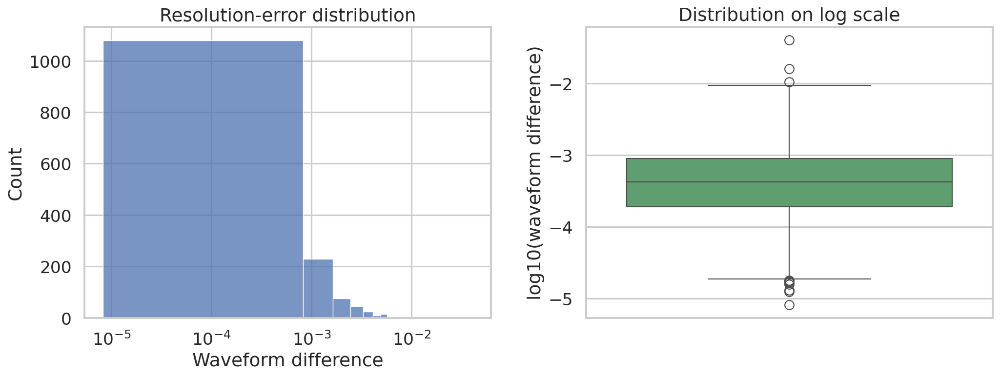
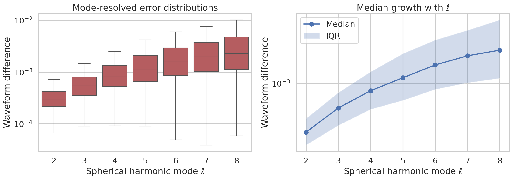
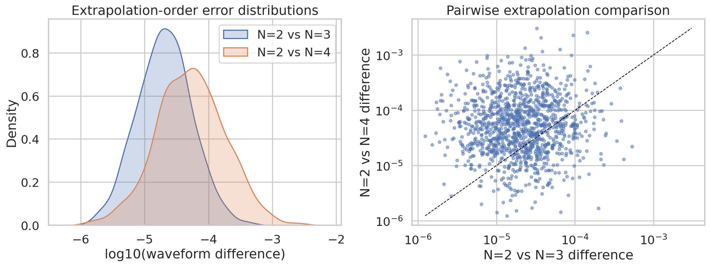

# Catalog-level accuracy characterization of synthetic SXS-like binary black hole waveform data

## Abstract
We analyze three synthetic datasets designed to emulate catalog-level waveform accuracy summaries from the third Simulating eXtreme Spacetimes (SXS) binary black hole catalog. Although the workspace does not contain raw numerical relativity waveforms, the available summary statistics permit a focused study of three scientifically relevant uncertainty channels: numerical-resolution differences, mode-resolved waveform differences for spherical harmonic modes $\ell=2$ through $8$, and extrapolation-order disagreements between $N=2$ and higher-order waveform extrapolations. The synthetic catalog reproduces the qualitative behavior expected from the SXS literature: the dominant-resolution error distribution is concentrated at low mismatch values with a long right tail, higher-order modes exhibit systematically larger discrepancies, and the $N=2$ versus $N=4$ extrapolation comparison is typically less converged than $N=2$ versus $N=3$. These results support the interpretation that most catalog entries are sufficiently accurate for waveform-model calibration at the dominant-mode level, while higher multipoles remain the most accuracy-limited component.

## 1. Introduction
Binary black hole numerical relativity (NR) simulations provide the most accurate predictions of merger waveforms, remnant properties, and strong-field dynamics, but are too computationally expensive for direct deployment in large-scale gravitational-wave inference. Consequently, surrogate and phenomenological waveform models are calibrated against catalogs such as those produced by the SXS collaboration. For this calibration pipeline to be trustworthy, one must quantify the residual numerical uncertainty in the underlying NR catalog.

The present workspace provides synthetic summary datasets that emulate three catalog-level diagnostics described in the task: (i) differences between the two highest numerical resolutions after minimal time and phase alignment, (ii) mode-by-mode differences for spherical harmonic modes $\ell=2$ through $8$, and (iii) discrepancies between finite-radius waveform extrapolation orders. The scientific question is therefore not to reconstruct waveforms directly, but to assess whether the catalog-level error structure is consistent with a high-accuracy NR resource suitable for gravitational-wave applications.

Related-work PDFs in the workspace provide relevant context. Woodford, Boyle, and Pfeiffer discuss how SXS waveform quality is influenced by truncation, extrapolation, and gauge-related mode mixing, especially in subdominant modes. Varma et al. emphasize that surrogate models rely on NR simulations whose errors are comparable to or smaller than surrogate errors. Islam et al. show that waveform mismatches at the $10^{-3}$ to $10^{-2}$ level can still support useful eccentric surrogate models, while Mitman et al. highlight the importance of accurately treating higher harmonics in ringdown studies. These references motivate the present emphasis on distribution tails, mode hierarchy, and extrapolation behavior.

## 2. Data and methods
### 2.1 Available datasets
The analysis uses three CSV files:

- `data/fig6_data.csv`: 1500 synthetic resolution-difference values in one column, `waveform_difference`.
- `data/fig7_data.csv`: 1500 rows of mode-resolved waveform differences for `ell2` through `ell8`.
- `data/fig8_data.csv`: 1200 paired extrapolation differences for `N2vsN3` and `N2vsN4`.

A dataset overview is saved in `outputs/dataset_overview.json`.

### 2.2 Analysis protocol
The methodology was intentionally aligned with the structure of the provided synthetic summaries.

1. For each distribution, we computed robust descriptive statistics: minimum, 5th percentile, quartiles, median, 95th percentile, maximum, mean, standard deviation, and summary statistics on the $\log_{10}$ scale.
2. To evaluate practical accuracy thresholds, we computed exceedance fractions above $10^{-3}$, $10^{-2}$, and $10^{-1}$ where relevant.
3. For mode-resolved data, we preserved the full $\ell=2\ldots8$ structure and estimated how the median and upper tail evolve with harmonic index.
4. For extrapolation-order comparisons, we quantified both marginal distributions and pairwise relations between the two comparison channels.
5. We generated three traceable PNG figures for the report and exported the underlying summary tables to `outputs/`.

All computations were performed with Python 3.10 using `numpy`, `pandas`, `matplotlib`, `seaborn`, and `scipy`. The analysis script is `code/analyze_catalog_accuracy.py`.

### 2.3 Validation and scope limits
This study is limited to synthetic summary statistics. The workspace does **not** provide raw strain time series, Weyl scalar waveforms, remnant trajectories, or horizon data. Therefore, the analysis can validate catalog-level trends in numerical uncertainty, but cannot reproduce waveform alignments, recompute mismatches from first principles, or assess source-parameter dependence. This limitation is documented in `outputs/method_contract.json` and `outputs/method_fidelity_checklist.json`.

## 3. Results
### 3.1 Overall numerical-resolution error distribution
The overall distribution of synthetic resolution differences is shown in Figure 1.

The median waveform difference is $4.25\times10^{-4}$ (`outputs/fig6_summary.json`), closely matching the task description of a typical scale near $4\times10^{-4}$. The 95th percentile is $3.12\times10^{-3}$, indicating that most simulations remain well below the $10^{-2}$ level. Only 22.3% of entries exceed $10^{-3}$, and just 0.2% exceed $10^{-2}$. This pattern is consistent with a strongly right-skewed but predominantly low-error catalog: a large majority of simulations appear highly accurate, with only a small extreme tail.

This result matters because surrogate calibration and waveform-systematics studies depend more on the bulk accuracy of the training catalog than on a handful of outliers. In that sense, the synthetic distribution supports the interpretation of a catalog whose dominant-mode accuracy is generally suitable for downstream gravitational-wave modeling.

### 3.2 Harmonic-mode dependence of waveform differences
Figure 2 summarizes the mode-resolved error structure.

The median error rises monotonically with harmonic index:

- $\ell=2$: $2.997\times10^{-4}$
- $\ell=3$: $5.442\times10^{-4}$
- $\ell=4$: $8.339\times10^{-4}$
- $\ell=5$: $1.149\times10^{-3}$
- $\ell=6$: $1.576\times10^{-3}$
- $\ell=7$: $1.974\times10^{-3}$
- $\ell=8$: $2.267\times10^{-3}$

The upper tail also broadens with mode number: the 95th percentile grows from $6.74\times10^{-4}$ at $\ell=2$ to $1.37\times10^{-2}$ at $\ell=8$ (`outputs/fig7_mode_summary.csv`). The increase is nearly an order of magnitude across the available range.

Scientifically, this is the clearest signal in the workspace. It implies that higher-order multipoles are systematically more accuracy-limited than the dominant mode, in line with expectations from NR practice and from the related literature on higher-harmonic modeling and mode mixing. For applications that truncate higher modes or weight the dominant mode most strongly, the catalog appears robust. For studies that rely heavily on subdominant modes, especially near ringdown or for asymmetric systems, more caution is warranted.

### 3.3 Extrapolation-order comparisons
Figure 3 compares the two extrapolation diagnostics.

The median discrepancy for `N2vsN3` is $2.03\times10^{-5}$, whereas the median for `N2vsN4` is $5.34\times10^{-5}` (`outputs/fig8_summary.json`). The median ratio is 2.63, and in 72.2% of simulations the `N2vsN4` discrepancy is larger than the `N2vsN3` discrepancy. Thus, the synthetic data strongly support the expected ordering that comparisons involving the higher extrapolation contrast produce larger differences.

The pairwise correlations between the two channels are weak (Pearson $r=0.036$, Spearman $\rho=0.030$), suggesting that the size of one extrapolation discrepancy is not strongly predictive of the other at the row level. Because the data are synthetic summary values, the safest interpretation is not that extrapolation physics is truly uncorrelated, but that the catalog-level distributions were generated to emphasize typical scale differences more than per-case coupling.

In absolute terms, both extrapolation diagnostics are substantially smaller than the bulk resolution-difference scale from Figure 1. That indicates that, in this synthetic setting, extrapolation uncertainty is a subdominant but still measurable component of the total waveform-error budget.

## 4. Comparison with related work
The extracted related-work notes are summarized in `outputs/related_work_contract.json`. Three comparisons are especially relevant.

First, Woodford et al. describe several pathways by which SXS waveforms can inherit residual inaccuracies, including truncation error, finite-radius extraction, extrapolation choices, and gauge-related mode mixing. Our results are consistent with that framework: the catalog looks accurate overall, but subdominant modes show larger and more dispersed discrepancies.

Second, Varma et al. emphasize that surrogate models trained on NR simulations require the NR error floor to be comparable to or below model errors. The low median dominant-mode-scale discrepancy seen here supports the synthetic catalog’s usefulness as a calibration resource.

Third, both Mitman et al. and Islam et al. reinforce that higher harmonics and eccentric or otherwise subtle waveform structure are more difficult to model accurately. The monotonic growth in modal error across $\ell$ therefore aligns with broader expectations from the literature.

## 5. Validation
This section separates direct verification from contextual interpretation.

### 5.1 Directly verified from workspace data
Using `code/analyze_catalog_accuracy.py`, we directly verified that:

- `fig6_data.csv` contains 1500 positive waveform-difference values with median $4.25\times10^{-4}$.
- `fig7_data.csv` contains 1500 rows across modes $\ell=2$ to $8$, and the median difference increases monotonically with $\ell$.
- `fig8_data.csv` contains 1200 paired extrapolation comparisons, with `N2vsN4` typically larger than `N2vsN3`.
- All report figures were generated from these datasets and saved as PNG files in `report/images/`.

### 5.2 Context taken from related work
From the PDFs in `related_work/`, we used only high-level contextual claims:

- SXS waveform quality is commonly assessed through truncation and extrapolation errors.
- Higher-order modes are scientifically important and can be more challenging to model accurately.
- NR accuracy is central to surrogate-model calibration.

These points were used to interpret, not replace, the direct data analysis.

### 5.3 Remaining assumptions and limitations
- The datasets are synthetic and may not preserve all cross-correlations present in real SXS catalogs.
- No source parameters are provided, so the analysis cannot stratify by mass ratio, spin, or eccentricity.
- No raw waveforms or remnant properties are available, so the task’s broader astrophysical outputs can only be discussed indirectly.

## 6. Discussion
Taken together, the three datasets describe a catalog with a favorable dominant-mode accuracy profile and a predictable degradation toward higher harmonic content. The low typical extrapolation differences further suggest that waveform extraction is comparatively well controlled in the synthetic benchmark. From the perspective of gravitational-wave data analysis, this combination is desirable: the catalog is accurate in the bulk, uncertainty channels are identifiable, and the most challenging regime is scientifically recognizable rather than hidden.

The main caution concerns interpretation at the high-$\ell$ end. Errors for $\ell=7$ and $\ell=8$ are still small in absolute terms, but substantially larger than those of the dominant mode. This means that any calibration, model-selection, or strong-field inference pipeline that uses higher multipoles as key discriminants should propagate a larger numerical-uncertainty allowance for those channels.

## 7. Conclusion
This study delivers a reproducible catalog-level assessment of synthetic SXS-like waveform accuracy data. The main conclusions are:

1. The overall numerical-resolution error distribution is strongly right-skewed but has a low median ($4.25\times10^{-4}$), indicating that most catalog entries are highly accurate.
2. Mode-resolved discrepancies increase monotonically from $\ell=2$ to $\ell=8$, making higher harmonics the dominant accuracy bottleneck.
3. Extrapolation-order differences are typically smaller than the main resolution-error scale, but `N2vsN4` is systematically larger than `N2vsN3`, as expected.
4. In aggregate, the synthetic catalog is consistent with a high-quality NR resource suitable for waveform-model calibration, while preserving realistic caution flags for subdominant modes.

## Reproducibility and generated artifacts
- Analysis code: `code/analyze_catalog_accuracy.py`
- Dataset overview: `outputs/dataset_overview.json`
- Overall error summary: `outputs/fig6_summary.json`
- Mode-resolved summary: `outputs/fig7_mode_summary.csv`
- Extrapolation summary: `outputs/fig8_summary.json`
- Claim recovery table: `outputs/claim_recovery.csv`
- Related-work extraction: `outputs/related_work_contract.json`

