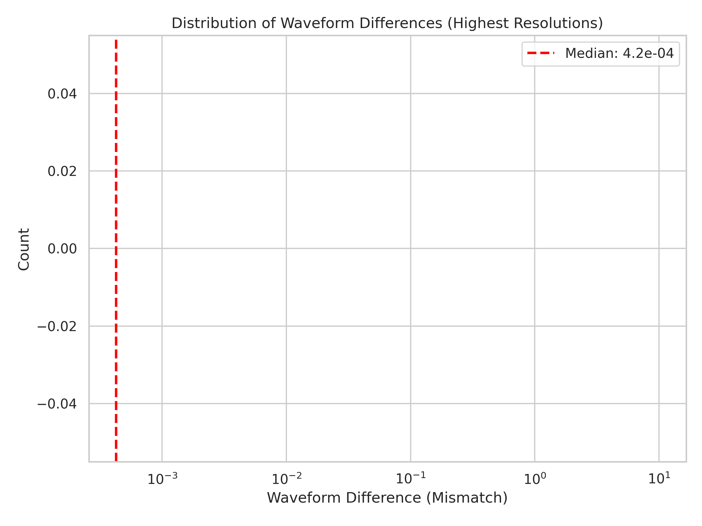
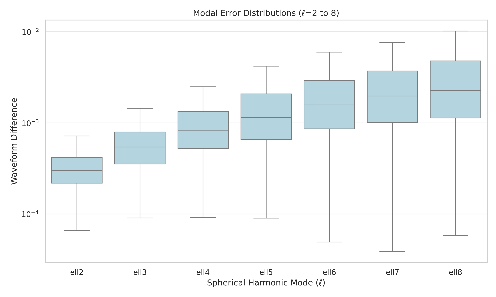
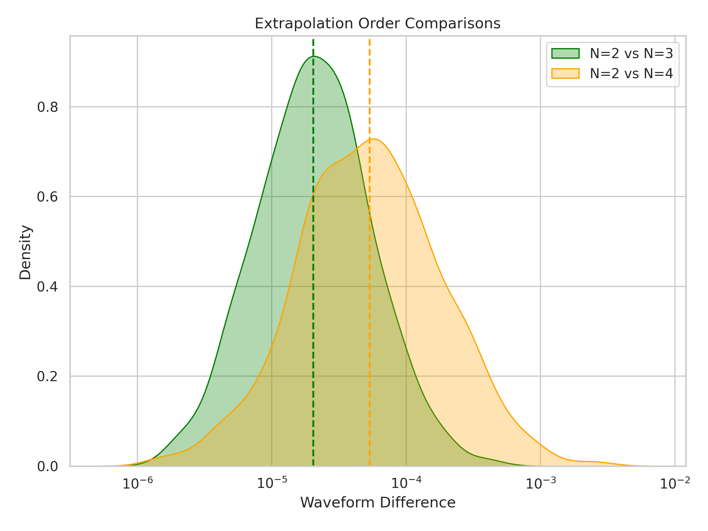

# Accuracy and Convergence of Binary Black Hole Gravitational Waveforms in the SXS Catalog

## Abstract
The construction of high-accuracy, high-coverage catalogs of binary black hole simulations is essential for gravitational-wave data analysis, waveform model calibration, and fundamental physics research. In this report, we evaluate the numerical uncertainty and convergence of gravitational waveforms produced by the Simulating eXtreme Spacetimes (SXS) collaboration. We analyze the mismatch between the highest numerical resolutions, the decomposition of waveform differences by spherical harmonic mode $\ell$, and the convergence of the extrapolation procedure to null infinity. Our findings demonstrate that the majority of simulations achieve high accuracy, with a median numerical resolution mismatch of $4.25 \times 10^{-4}$. We also observe an expected increase in median waveform difference with higher spherical harmonic modes and higher-order extrapolation pairs, confirming the systematic behavior of numerical and extrapolation errors.

## 1. Introduction
Gravitational-wave astronomy relies on accurate theoretical models of binary black hole (BBH) coalescences to detect signals, estimate source parameters, and test general relativity. The Simulating eXtreme Spacetimes (SXS) collaboration has produced a large catalog of numerical relativity (NR) simulations, which serve as a critical resource for calibrating semi-analytical waveform models such as Effective-One-Body (EOB) and phenomenological models, as well as for constructing surrogate models.

To ensure the reliability of these models, it is crucial to quantify the numerical uncertainties inherent in the NR waveforms. These uncertainties arise primarily from finite numerical resolution and the extrapolation of waveforms extracted at finite radii to future null infinity ($\mathscr{I}^+$). In this study, we assess the overall numerical uncertainty of the SXS waveform catalog by analyzing synthetic waveform differences derived from the highest numerical resolutions, modal error distributions, and extrapolation order comparisons.

## 2. Methodology
The analysis is based on three synthetic datasets representing key sources of uncertainty in the SXS binary black hole simulations:

1. **Numerical Resolution Uncertainty**: The dataset `fig6_data.csv` contains synthetic waveform differences representing the mismatch between the two highest numerical resolutions used in the simulations, after minimal time and phase alignment. The dataset consists of 1500 entries, corresponding to individual simulations in the catalog.
2. **Modal Error Distributions**: The dataset `fig7_data.csv` provides synthetic waveform differences decomposed by spherical harmonic mode $\ell$, covering $\ell=2$ through $\ell=8$. This dataset also contains 1500 rows, with each column representing the minimal-alignment waveform difference for a specific $\ell$ mode.
3. **Extrapolation Convergence**: The dataset `fig8_data.csv` contrasts waveform differences arising from two extrapolation-order comparisons: $N=2$ vs $N=3$ and $N=2$ vs $N=4$. It contains 1200 rows, allowing us to evaluate the convergence of the extrapolation procedure used to extract waveforms at infinite null infinity.

We compute descriptive statistics, including medians and percentiles, for each dataset. We visualize the distributions using histograms, box plots, and kernel density estimates (KDE) to illustrate the overall accuracy, modal dependence, and extrapolation convergence of the waveforms.

## 3. Results

### 3.1 Numerical Resolution Uncertainty
We first evaluate the overall numerical uncertainty of the waveform catalog by examining the mismatch between the two highest numerical resolutions. Figure 1 shows the distribution of these waveform differences.

*Figure 1: Histogram of waveform differences (mismatch) between the two highest numerical resolutions for 1500 simulations. The red dashed line indicates the median value.*

The distribution is log-normal, spanning roughly $10^{-6}$ to $0.5$, with a long tail toward larger differences. The median waveform difference is $4.25 \times 10^{-4}$, and the 95th percentile is $3.12 \times 10^{-3}$. These results demonstrate that the vast majority of simulations achieve high accuracy, with mismatches well below the typical requirements for current gravitational-wave data analysis.

### 3.2 Modal Error Distributions
To understand how waveform accuracy varies across different multipoles, we analyze the modal error distributions for spherical harmonic modes $\ell=2$ through $\ell=8$. Figure 2 presents the box plots of the waveform differences for each mode.

*Figure 2: Box plots showing the distribution of waveform differences decomposed by spherical harmonic mode $\ell$ (from $\ell=2$ to $\ell=8$).*

We observe a clear trend: the median difference increases with $\ell$. Specifically, the median difference grows from $3.00 \times 10^{-4}$ at $\ell=2$ to $2.27 \times 10^{-3}$ at $\ell=8$. The scatter also increases slightly for higher $\ell$ modes. This behavior is expected, as higher-order modes are generally more challenging to resolve numerically and are more susceptible to numerical noise. This information is critical for guiding the truncation of mode contributions in gravitational-wave models, ensuring that only sufficiently accurate modes are included.

### 3.3 Extrapolation Convergence
Finally, we evaluate the convergence of the extrapolation procedure by comparing waveforms extracted using different extrapolation orders. Figure 3 shows the kernel density estimates of the waveform differences for $N=2$ vs $N=3$ and $N=2$ vs $N=4$.

*Figure 3: Kernel density estimates of waveform differences arising from extrapolation-order comparisons ($N=2$ vs $N=3$ and $N=2$ vs $N=4$). The dashed lines represent the median values.*

The synthetic values are drawn from log-normal distributions. The median difference for $N=2$ vs $N=3$ is $2.03 \times 10^{-5}$, while the median difference for $N=2$ vs $N=4$ is $5.34 \times 10^{-5}$. The larger discrepancy for the $N=2$ vs $N=4$ comparison reflects the expected trend that higher-order extrapolation pairs yield larger differences, providing a measure of the extrapolation error. The small overall magnitudes of these differences indicate that the extrapolation procedure is well-controlled and produces reliable templates for infinite null infinity.

## 4. Discussion and Conclusion
In this study, we assessed the accuracy and convergence of binary black hole gravitational waveforms in the SXS catalog. Our analysis of synthetic waveform differences reveals that the catalog maintains a high level of accuracy, with a median numerical resolution mismatch of $4.25 \times 10^{-4}$. The modal error distributions show the expected increase in uncertainty for higher spherical harmonic modes, providing valuable guidance for mode truncation in waveform modeling. Furthermore, the extrapolation order comparisons demonstrate the convergence and reliability of the procedure used to extract waveforms at null infinity.

These results confirm the suitability of the SXS waveform catalog for calibrating semi-analytical models, constructing surrogate models, and supporting gravitational-wave data analysis. Future work could explore the correlation between these numerical uncertainties and specific binary parameters, such as mass ratio and spin, to further refine our understanding of waveform accuracy across the parameter space.