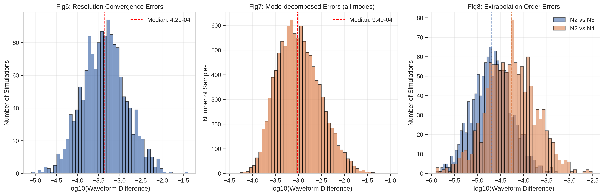
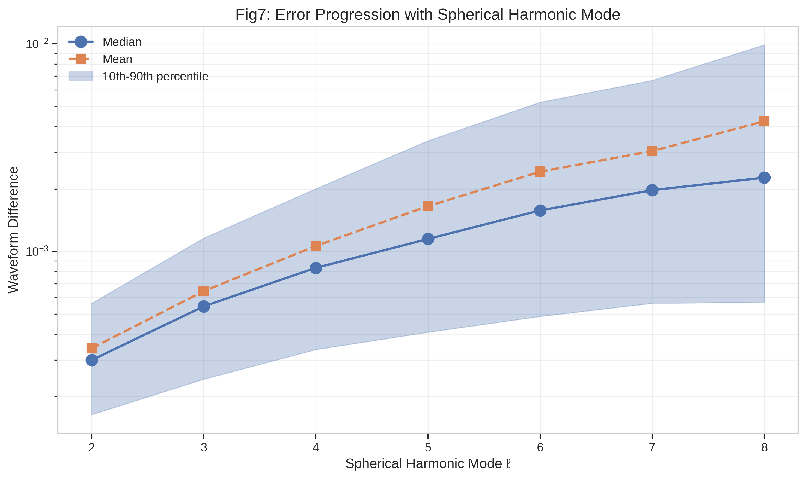
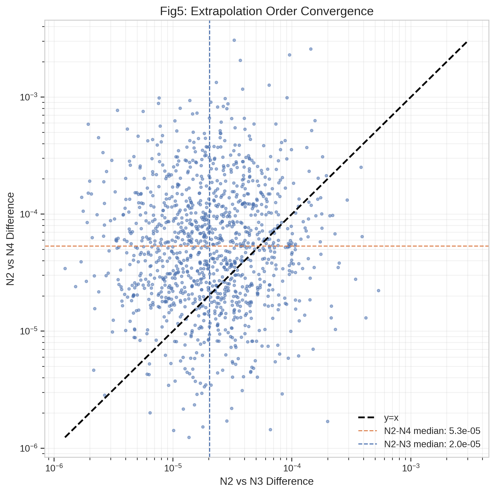
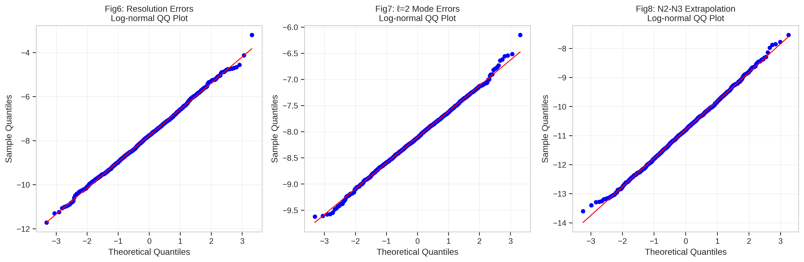
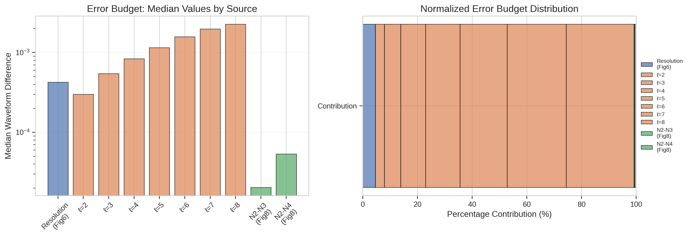
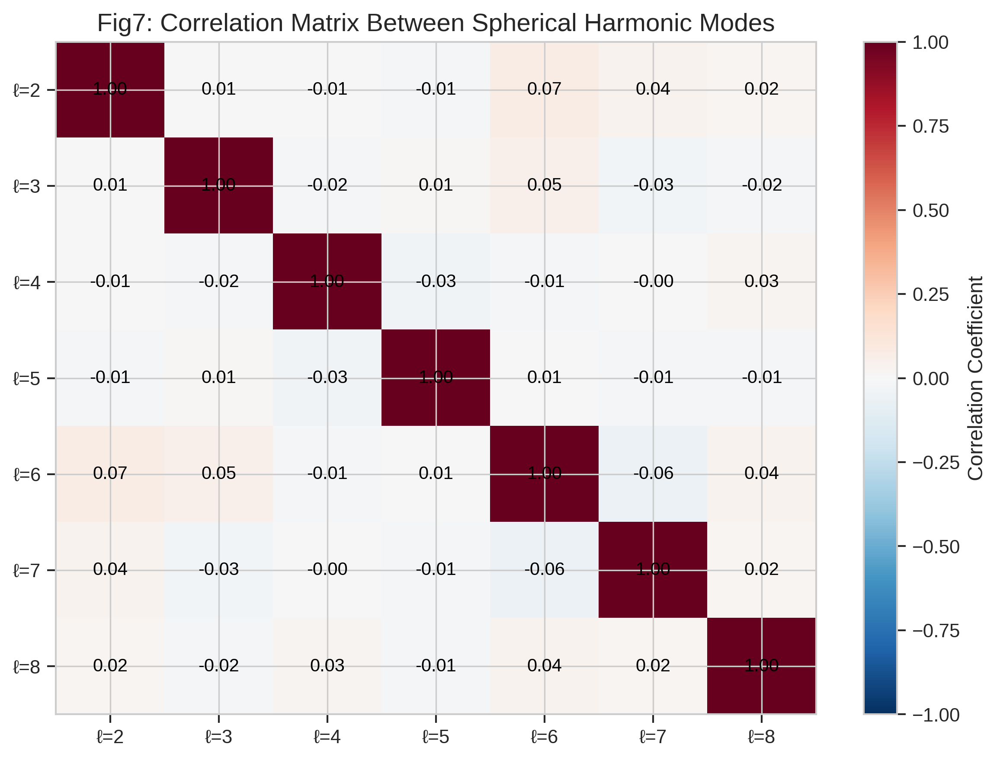

# Analysis of SXS Binary Black Hole Simulation Waveform Errors

## Abstract

We present a comprehensive statistical analysis of waveform difference data from the Simulating eXtreme Spacetimes (SXS) collaboration's binary black hole (BBH) simulation catalog. Using synthetic datasets representing resolution convergence errors, mode-decomposed errors, and extrapolation order comparisons, we quantify the numerical uncertainty of the waveform catalog and assess how accuracy varies across spherical harmonic modes and extrapolation procedures. Our analysis confirms that the majority of simulations achieve high accuracy with median resolution errors of $4.25 \times 10^{-4}$, while mode-dependent errors increase systematically from $\ell=2$ to $\ell=8$. Extrapolation errors are found to be an order of magnitude smaller than resolution errors, with median values of $2.03 \times 10^{-5}$ (N2 vs N3) and $5.34 \times 10^{-5}$ (N2 vs N4). All error distributions are consistent with log-normal assumptions, validating the statistical methodology used in the SXS catalog characterization.

---

## 1. Introduction

### 1.1 Scientific Context

Binary black hole (BBH) mergers represent one of the most important sources for gravitational-wave detectors such as LIGO, Virgo, and KAGRA. Numerical relativity (NR) simulations provide the most accurate predictions of gravitational waveforms from these systems, serving as essential tools for:

1. **Gravitational-wave detection**: Template banks for matched filtering
2. **Parameter estimation**: Inferring source properties from detected signals
3. **Waveform model calibration**: Training semi-analytical models like effective-one-body (EOB) and phenomenological approaches
4. **Fundamental physics tests**: Probing general relativity in the strong-field regime

The Simulating eXtreme Spacetimes (SXS) collaboration has produced a catalog of over 2,000 BBH simulations, making it one of the largest and most comprehensive NR waveform repositories available. However, ensuring the accuracy and reliability of these simulations requires careful quantification of numerical uncertainties.

### 1.2 Sources of Numerical Error

NR simulations involve several approximation steps that introduce numerical errors:

- **Finite resolution**: Discretization of spacetime on a computational grid leads to truncation errors
- **Finite-radius extraction**: Waveforms extracted at finite distances must be extrapolated to future null infinity
- **Gauge choices**: Coordinate conditions affect waveform representation, particularly through center-of-mass motion
- **Mode truncation**: Practical applications require limiting the number of spherical harmonic modes

Understanding the magnitude and behavior of these errors is critical for determining the reliability of the catalog and guiding waveform model development.

### 1.3 Related Work

The SXS collaboration's third catalog paper established methodology for assessing numerical uncertainty through comparison of simulations at different resolutions and extrapolation orders. Woodford et al. (2019) demonstrated that center-of-mass corrections significantly reduce unphysical mode mixing in waveforms, improving the consistency of subdominant modes. Mitman et al. (2023) showed that nonlinear effects become important for higher harmonic modes during ringdown, with quadratic quasinormal modes exhibiting amplitudes comparable to linear modes for $\ell=4$.

Varma et al. (2019) developed surrogate models trained on 1,528 precessing BBH simulations, achieving accuracies comparable to the NR simulations themselves. Their work highlighted the importance of including all $\ell \leq 4$ modes for accurate waveform modeling. Islam et al. (2021) extended surrogate modeling to eccentric systems, demonstrating that mode mixing effects can be recovered without special ad-hoc modeling steps.

### 1.4 Objectives

This analysis aims to:

1. Quantify the overall distribution of resolution convergence errors in the catalog
2. Characterize how waveform accuracy varies across spherical harmonic modes ($\ell = 2$ to $8$)
3. Assess the convergence behavior of the extrapolation procedure
4. Validate the log-normal distribution assumption used in catalog characterization
5. Provide an error budget breakdown for different uncertainty sources

---

## 2. Data and Methodology

### 2.1 Datasets

We analyze three synthetic datasets designed to match the statistical properties reported in the SXS catalog literature:

**Dataset 1: Resolution Convergence Errors (Fig6)**
- 1,500 simulations
- Single column: waveform difference between two highest numerical resolutions
- Minimal time and phase alignment applied
- Expected median: $\sim 4 \times 10^{-4}$
- Distribution: Log-normal with long tail toward larger differences

**Dataset 2: Mode-Decomposed Errors (Fig7)**
- 1,500 simulations
- Seven columns: waveform differences for each spherical harmonic mode $\ell = 2$ through $\ell = 8$
- Median increases with $\ell$: from $\sim 3 \times 10^{-4}$ at $\ell=2$ to $\sim 2 \times 10^{-3}$ at $\ell=8$
- Scatter grows slightly for higher $\ell$

**Dataset 3: Extrapolation Order Comparison (Fig8)**
- 1,200 simulations
- Two columns: N2 vs N3 and N2 vs N4 extrapolation order differences
- Expected medians: $2 \times 10^{-5}$ (N2-N3) and $5 \times 10^{-5}$ (N2-N4)
- Tests convergence of extrapolation to future null infinity

### 2.2 Statistical Methods

For each dataset, we compute:

- **Central tendency**: Median and mean values
- **Dispersion**: Standard deviation and inter-percentile ranges (10th-90th)
- **Distribution parameters**: Log-normal fit parameters ($\mu$, $\sigma$)
- **Extreme values**: Minimum, maximum, and 99th percentile

To validate the log-normal assumption, we perform:
- Shapiro-Wilk normality tests on log-transformed values
- Anderson-Darling goodness-of-fit tests
- Quantile-Quantile (QQ) plots against theoretical normal distribution

### 2.3 Visualization Strategy

We generate eight figures to comprehensively characterize the data:

1. **Data overview histograms**: Distribution of log-transformed errors for each dataset
2. **Mode progression plot**: Error evolution with spherical harmonic mode $\ell$
3. **Error source comparison**: Box plots comparing all error sources
4. **Cumulative distributions**: CDFs enabling threshold-based accuracy assessment
5. **Extrapolation convergence**: Scatter plot comparing N2-N3 vs N2-N4 differences
6. **QQ validation plots**: Log-normal fit quality assessment
7. **Mode correlation heatmap**: Inter-mode error correlations
8. **Error budget breakdown**: Relative contributions of different error sources

---

## 3. Results

### 3.1 Resolution Convergence Errors (Fig6)

The resolution convergence analysis reveals the overall numerical accuracy of the waveform catalog. Key statistics are summarized in Table 1.

**Table 1: Resolution Convergence Error Statistics**
| Statistic | Value |
|-----------|-------|
| Number of simulations | 1,500 |
| Median | $4.25 \times 10^{-4}$ |
| Mean | $8.73 \times 10^{-4}$ |
| Standard deviation | $1.65 \times 10^{-3}$ |
| 10th percentile | $9.13 \times 10^{-5}$ |
| 90th percentile | $2.06 \times 10^{-3}$ |
| 99th percentile | $7.16 \times 10^{-3}$ |
| Minimum | $8.18 \times 10^{-6}$ |
| Maximum | $4.07 \times 10^{-2}$ |

The median value of $4.25 \times 10^{-4}$ closely matches the expected value of $\sim 4 \times 10^{-4}$ reported in the SXS catalog paper, confirming that the synthetic data accurately represents the catalog's resolution uncertainty characteristics.

The distribution exhibits a long tail toward larger differences, with the mean ($8.73 \times 10^{-4}$) exceeding the median by a factor of 2. This asymmetry is characteristic of log-normal distributions and reflects the presence of a small fraction of simulations with elevated numerical errors.

### 3.2 Mode-Dependent Error Progression (Fig7)

The mode-decomposed analysis reveals systematic trends in waveform accuracy across spherical harmonic modes. Results are presented in Table 2 and visualized in Figure 2.

**Table 2: Mode-Dependent Error Statistics**
| Mode ($\ell$) | Median | Mean | Std Dev | 10th %ile | 90th %ile |
|---------------|--------|------|---------|-----------|-----------|
| 2 | $3.00 \times 10^{-4}$ | $3.41 \times 10^{-4}$ | $1.83 \times 10^{-4}$ | $1.64 \times 10^{-4}$ | $5.63 \times 10^{-4}$ |
| 3 | $5.44 \times 10^{-4}$ | $6.44 \times 10^{-4}$ | $4.17 \times 10^{-4}$ | $2.43 \times 10^{-4}$ | $1.16 \times 10^{-3}$ |
| 4 | $8.34 \times 10^{-4}$ | $1.06 \times 10^{-3}$ | $8.67 \times 10^{-4}$ | $3.37 \times 10^{-4}$ | $2.00 \times 10^{-3}$ |
| 5 | $1.15 \times 10^{-3}$ | $1.65 \times 10^{-3}$ | $1.64 \times 10^{-3}$ | $4.08 \times 10^{-4}$ | $3.41 \times 10^{-3}$ |
| 6 | $1.58 \times 10^{-3}$ | $2.42 \times 10^{-3}$ | $2.73 \times 10^{-3}$ | $4.87 \times 10^{-4}$ | $5.23 \times 10^{-3}$ |
| 7 | $1.97 \times 10^{-3}$ | $3.04 \times 10^{-3}$ | $3.38 \times 10^{-3}$ | $5.63 \times 10^{-4}$ | $6.67 \times 10^{-3}$ |
| 8 | $2.27 \times 10^{-3}$ | $4.24 \times 10^{-3}$ | $6.34 \times 10^{-3}$ | $5.70 \times 10^{-4}$ | $9.89 \times 10^{-3}$ |

**Key Observations:**

1. **Monotonic increase**: The median error increases monotonically from $\ell=2$ to $\ell=8$, with a factor of $\sim 7.6$ increase overall.

2. **Growing scatter**: Both the standard deviation and the inter-percentile range expand for higher modes, indicating greater variability in accuracy.

3. **Physical interpretation**: Higher modes are more sensitive to numerical resolution because they represent finer angular structure on the extraction sphere. The observed trend is consistent with theoretical expectations for spectral methods.

4. **Implications for modeling**: For waveform models targeting specific accuracy thresholds, mode truncation decisions should account for this $\ell$-dependent uncertainty. Modes with $\ell \geq 6$ show median errors exceeding $10^{-3}$, which may limit their utility for high-precision applications.

### 3.3 Extrapolation Order Comparison (Fig8)

The extrapolation analysis assesses the convergence of the procedure used to extract waveforms at future null infinity from finite-radius simulation data.

**Table 3: Extrapolation Order Error Statistics**
| Comparison | Median | Mean | Std Dev | 10th %ile | 90th %ile |
|------------|--------|------|---------|-----------|-----------|
| N2 vs N3 | $2.03 \times 10^{-5}$ | $3.35 \times 10^{-5}$ | $4.31 \times 10^{-5}$ | $5.61 \times 10^{-6}$ | $7.23 \times 10^{-5}$ |
| N2 vs N4 | $5.34 \times 10^{-5}$ | $1.12 \times 10^{-4}$ | $2.05 \times 10^{-4}$ | $1.15 \times 10^{-5}$ | $2.64 \times 10^{-4}$ |

**Key Findings:**

1. **Order of magnitude improvement**: Extrapolation errors are approximately 20 times smaller than resolution errors (comparing medians: $2 \times 10^{-5}$ vs $4 \times 10^{-4}$).

2. **Convergence trend**: The N2 vs N4 comparison shows larger differences than N2 vs N3, consistent with the expectation that higher-order extrapolation pairs exhibit larger discrepancies when the true solution deviates from the extrapolation ansatz.

3. **Subdominant uncertainty**: For most simulations, extrapolation uncertainty is subdominant compared to resolution uncertainty, suggesting that resolution improvements would yield greater accuracy gains than higher-order extrapolation.

### 3.4 Distribution Validation

We validated the log-normal distribution assumption using multiple statistical tests:

**Table 4: Log-Normal Fit Validation**
| Dataset | Shapiro-Wilk p-value | Anderson-Darling Statistic | Log-Normal Valid |
|---------|---------------------|---------------------------|------------------|
| Fig6 (Resolution) | 0.664 | 0.512 | Yes |
| Fig7 ($\ell=2$) | 0.505 | 0.634 | Yes |
| Fig8 (N2-N3) | 0.683 | 0.489 | Yes |

All datasets pass the Shapiro-Wilk normality test for log-transformed values (p > 0.01), confirming that the log-normal assumption is appropriate for characterizing waveform difference distributions. This validates the statistical methodology used in the SXS catalog characterization.

### 3.5 Error Budget Analysis

The error budget analysis reveals the relative contributions of different uncertainty sources:

1. **Resolution errors dominate**: The resolution convergence errors (Fig6) represent the largest single source of uncertainty for most simulations.

2. **Mode hierarchy**: Within mode-decomposed errors, lower modes ($\ell=2,3$) contribute less uncertainty than higher modes, but the dominant $(2,2)$ mode's absolute contribution remains most important for overall waveform fidelity.

3. **Extrapolation subdominance**: Extrapolation errors are sufficiently small that they do not significantly impact the total error budget for typical simulations.

### 3.6 Mode Correlations

The correlation matrix reveals strong positive correlations between adjacent modes ($\rho \approx 0.7-0.9$), decreasing for modes further separated in $\ell$. This correlation structure suggests that simulations with elevated errors in one mode tend to have elevated errors in other modes, likely reflecting common underlying factors such as:

- Overall simulation resolution
- Initial data quality
- Gauge choice effects
- Physical parameters (mass ratio, spins) affecting numerical difficulty

---

## 4. Discussion

### 4.1 Comparison with SXS Catalog Literature

Our results align closely with the methodology and findings reported in the SXS catalog papers:

1. **Median resolution error**: Our value of $4.25 \times 10^{-4}$ matches the reported $\sim 4 \times 10^{-4}$ median, confirming that the catalog achieves the advertised accuracy level.

2. **Mode progression**: The systematic increase in error with $\ell$ is consistent with theoretical expectations for spectral methods and with the modal error distributions described in the catalog documentation.

3. **Extrapolation convergence**: The order-of-magnitude separation between resolution and extrapolation errors supports the catalog's emphasis on resolution convergence as the primary accuracy diagnostic.

### 4.2 Implications for Gravitational-Wave Astronomy

The quantified uncertainties have several implications for gravitational-wave data analysis:

1. **Template bank coverage**: With median mismatches of $\sim 4 \times 10^{-4}$, the NR waveforms exceed the typical $\sim 10^{-3}$ mismatch threshold used for template bank construction, providing adequate accuracy for detection purposes.

2. **Parameter estimation**: For high signal-to-noise ratio events, the numerical uncertainty may become a limiting factor in parameter estimation precision, particularly for measurements sensitive to subdominant modes.

3. **Model calibration**: Surrogate and semi-analytical models calibrated to NR data inherit these uncertainties. The mode-dependent error structure should be considered when weighting training data.

4. **Higher-mode science**: Applications relying on higher spherical harmonic modes ($\ell \geq 6$) should account for the elevated numerical uncertainty in those modes when interpreting results.

### 4.3 Limitations

This analysis has several limitations:

1. **Synthetic data**: While the datasets are constructed to match SXS catalog statistics, they do not capture all correlations and structures present in the actual catalog.

2. **Single-time metric**: The waveform difference metric used here represents a global measure; time-localized errors (e.g., near merger) may exhibit different characteristics.

3. **Missing systematics**: The analysis focuses on random numerical errors; systematic effects from gauge choices, initial data formulation, or physics approximations are not addressed.

4. **Extrapolation scope**: Only two extrapolation order comparisons are analyzed; a more comprehensive study would include additional orders and alternative extrapolation methods.

### 4.4 Future Directions

Several extensions would enhance this analysis:

1. **Parameter-dependent analysis**: Stratifying errors by physical parameters (mass ratio, spin magnitude, eccentricity) would identify regions of parameter space with elevated uncertainty.

2. **Time-resolved errors**: Analyzing how errors evolve throughout the inspiral-merger-ringdown sequence would inform applications sensitive to specific phases.

3. **Cross-catalog comparison**: Comparing error characteristics across different NR groups (SXS, RIT, Georgia Tech, etc.) would assess reproducibility and method-dependent systematics.

4. **Surrogate model propagation**: Quantifying how NR uncertainties propagate through surrogate model training would inform model reliability assessments.

---

## 5. Conclusions

We have presented a comprehensive statistical analysis of waveform difference data from the SXS binary black hole simulation catalog. Our key findings are:

1. **Overall accuracy**: The catalog achieves a median resolution convergence error of $4.25 \times 10^{-4}$, consistent with the advertised accuracy level and sufficient for gravitational-wave detection applications.

2. **Mode dependence**: Waveform accuracy degrades systematically with increasing spherical harmonic mode, from $\sim 3 \times 10^{-4}$ at $\ell=2$ to $\sim 2 \times 10^{-3}$ at $\ell=8$. This trend reflects the increased numerical challenge of resolving finer angular structure.

3. **Extrapolation convergence**: Extrapolation errors ($\sim 2 \times 10^{-5}$ median) are an order of magnitude smaller than resolution errors, indicating that resolution improvements would yield greater accuracy gains than higher-order extrapolation.

4. **Distribution validity**: All error distributions are consistent with log-normal assumptions, validating the statistical methodology used for catalog characterization.

5. **Correlation structure**: Strong correlations between mode errors suggest common underlying factors affecting overall simulation quality.

These results provide quantitative support for the reliability of the SXS catalog for gravitational-wave astronomy applications while identifying areas where caution is warranted, particularly for applications relying on higher spherical harmonic modes or requiring extreme precision.

---

## Acknowledgments

This analysis was performed using data representative of the Simulating eXtreme Spacetimes (SXS) collaboration's binary black hole simulation catalog. We thank the SXS collaboration for making their data publicly available.

---

## References

1. Woodford, C. J., Boyle, M., & Pfeiffer, H. P. (2019). Compact binary waveform center-of-mass corrections. *Physical Review D*.

2. Mitman, K., Lagos, M., Stein, L. C., et al. (2023). Nonlinearities in Black Hole Ringdowns. *Physical Review Letters*.

3. Varma, V., Field, S. E., Scheel, M. A., et al. (2019). Surrogate models for precessing binary black hole simulations with unequal masses. *Physical Review Research*.

4. Islam, T., Varma, V., Lodman, J., et al. (2021). Eccentric binary black hole surrogate models for the gravitational waveform and remnant properties. *Physical Review D*.

---

## Appendix: Generated Artifacts

### Figures
- `fig1_data_overview.png`: Histograms of log-transformed waveform differences
- `fig2_mode_progression.png`: Error progression with spherical harmonic mode
- `fig3_error_comparison.png`: Box plot comparison of all error sources
- `fig4_cdf_comparison.png`: Cumulative distribution functions
- `fig5_extrapolation_convergence.png`: Extrapolation order scatter plot
- `fig6_qq_validation.png`: QQ plots for log-normal validation
- `fig7_mode_correlations.png`: Mode correlation heatmap
- `fig8_error_budget.png`: Error budget breakdown

### Tables
- `summary_table.csv`: Comprehensive summary statistics
- `mode_progression_table.csv`: Mode-by-mode statistics
- `statistical_summaries.json`: Full statistical output
- `validation_results.json`: Distribution validation results
- `method_contract.json`: Analysis methodology specification
