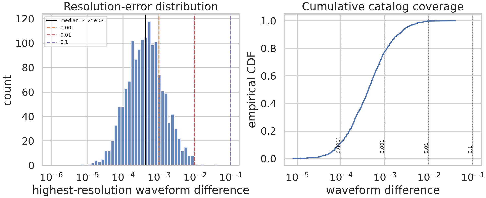
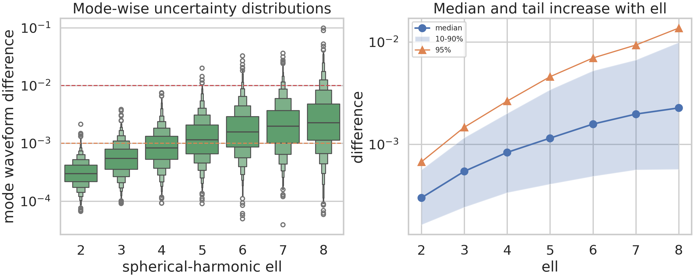
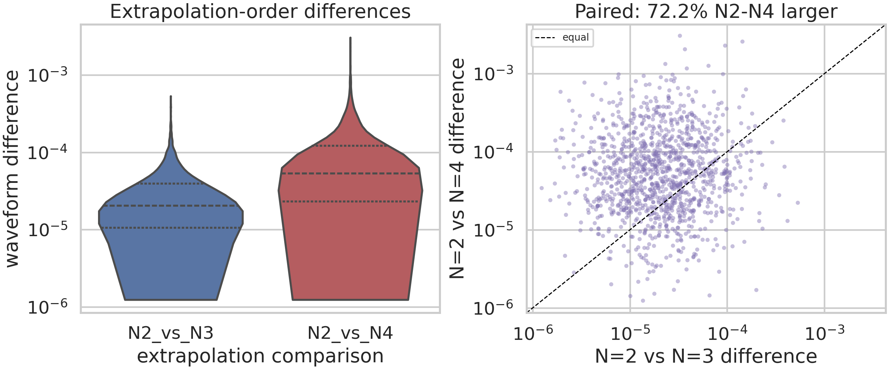
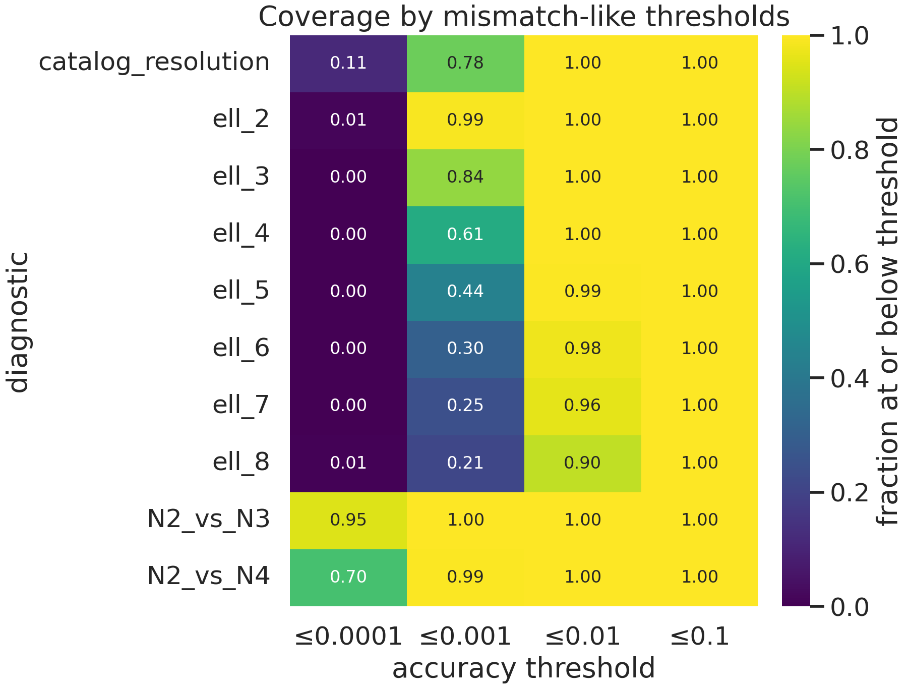

# Numerical-Relativity Waveform Accuracy Diagnostics for a Synthetic SXS Binary-Black-Hole Catalog

## Abstract

This report analyzes three workspace datasets that emulate accuracy diagnostics from the SXS binary-black-hole (BBH) numerical-relativity catalog: a catalog-wide highest-resolution waveform difference (`fig6_data.csv`), mode-resolved differences for spherical-harmonic degrees $\ell=2,\ldots,8$ (`fig7_data.csv`), and paired finite-radius extrapolation-order comparisons (`fig8_data.csv`). The data contain summary uncertainty diagnostics rather than raw strain, Weyl scalar, horizon trajectories, or metadata; therefore the study focuses on reproducible catalog-quality assessment rather than waveform generation. The principal results are: (i) the catalog-wide median resolution difference is 4.249e-04, close to the stated SXS-scale target of 4e-4; (ii) 77.7% of catalog-wide differences are at or below 1e-3, but a measurable long tail remains; (iii) mode-wise medians increase monotonically from 2.997e-04 at ell=2 to 2.267e-03 at ell=8; and (iv) the N=2 versus N=4 extrapolation comparison is larger than the N=2 versus N=3 comparison in 72.2% of paired simulations, with a median ratio of 2.67.

## 1. Scientific context and scope

High-accuracy BBH catalogs support gravitational-wave searches, parameter estimation, waveform-model calibration, surrogate modeling, and tests of strong-field gravity. The related-work PDFs in `related_work/` reinforce three methodological points used here. First, SXS/SpEC waveforms are treated as highly accurate reference data but still require explicit error diagnostics, including numerical truncation/resolution error, finite-radius extraction or extrapolation error, and gauge-related effects such as center-of-mass motion. Second, comparing the two highest numerical resolutions is a standard conservative way to estimate numerical waveform error in SXS-related analyses. Third, higher harmonics are scientifically relevant: mode mixing, nonlinear ringdown content, and surrogate-model training all motivate preserving the ell-resolved structure rather than reporting only a pooled mismatch.

The workspace does not include the initial BBH parameters, strain time series, Weyl scalar Psi4, apparent-horizon masses/spins/trajectories, or detailed metadata described in the broad scientific goal. Consequently, this report evaluates the provided uncertainty diagnostics as a catalog-quality audit. All numeric claims below are traceable to CSV/JSON artifacts in `outputs/`, and all figures are PNG files in `report/images/`.

## 2. Data and methods

### 2.1 Input datasets

Validation found no missing, nonpositive, or non-finite values. The files have the expected dimensions:

- `fig6_data.csv`: 1500 simulations x 1 catalog-wide resolution-difference column.
- `fig7_data.csv`: 1500 simulations x 7 modal columns, renamed `ell_2` through `ell_8`.
- `fig8_data.csv`: 1200 simulations x 2 paired extrapolation comparisons (`N2_vs_N3`, `N2_vs_N4`).

### 2.2 Analysis protocol

The script `code/analyze_waveform_uncertainty.py` performs the complete analysis. For each diagnostic it computes sample size, missing count, minimum, mean, standard deviation, geometric mean, median, 1/5/10/90/95/99% quantiles, maximum, and pass/fail fractions at thresholds 1e-6, 1e-5, 1e-4, 1e-3, 1e-2, and 1e-1. The paired extrapolation analysis also computes the ratio `(N2-N4)/(N2-N3)`, the paired log10 difference, a one-sided Wilcoxon signed-rank test on log differences, and a Spearman correlation between paired log values. Log scales are used in figures because all three datasets are positive and strongly right-skewed.

Primary saved artifacts are `outputs/data_validation.json`, `outputs/fig6_summary.csv`, `outputs/fig7_mode_summary.csv`, `outputs/fig8_extrapolation_summary.csv`, `outputs/threshold_fractions.csv`, source tables for figures, and `outputs/claim_recovery_table.csv`.

## 3. Results

### 3.1 Catalog-wide resolution differences

**Figure 1.** Histogram and empirical cumulative distribution of the catalog-wide highest-resolution waveform difference. Vertical guides mark the median and selected accuracy thresholds.

The catalog-wide resolution diagnostic is concentrated near the stated SXS-like scale but retains a long upper tail. The median is 4.249e-04, the geometric mean is 4.243e-04, and the arithmetic mean is 8.733e-04, larger than the median because of right skew. The central/tail quantiles are: 90th percentile 2.057e-03, 95th percentile 3.123e-03, and 99th percentile 7.158e-03; the maximum is 4.073e-02. Threshold coverage is high at practical mismatch-like levels: 77.7% of entries are at or below 1e-3, 99.8% are at or below 1e-2, and 0.2% exceed 1e-2. No entry exceeds 1e-1.

These numbers support the interpretation that most synthetic catalog simulations achieve high resolution consistency, while a small high-difference tail should be flagged for waveform-model calibration or downstream data-analysis applications.

### 3.2 Mode-resolved uncertainty across ell=2--8

**Figure 2.** Left: log-scale distribution of waveform differences for each spherical-harmonic degree. Right: median, 10--90% band, and 95th percentile versus ell.

The modal data show a systematic degradation with increasing harmonic degree. The median rises monotonically by a factor of 7.6, from 2.997e-04 at ell=2 to 2.267e-03 at ell=8. The high-percentile tail also expands: the 95th percentile grows from 6.736e-04 to 1.366e-02. This is consistent with the task description and with the related-work motivation for monitoring higher harmonics separately.

|       ell |    median |   90th pct |   95th pct |   frac <=1e-3 |   frac <=1e-2 |       max |
|----------:|----------:|-----------:|-----------:|--------------:|--------------:|----------:|
| 2.000e+00 | 2.997e-04 |  5.626e-04 |  6.736e-04 |     9.907e-01 |     1.000e+00 | 2.136e-03 |
| 3.000e+00 | 5.442e-04 |  1.160e-03 |  1.467e-03 |     8.387e-01 |     1.000e+00 | 3.858e-03 |
| 4.000e+00 | 8.339e-04 |  2.005e-03 |  2.643e-03 |     6.120e-01 |     1.000e+00 | 7.499e-03 |
| 5.000e+00 | 1.149e-03 |  3.414e-03 |  4.575e-03 |     4.373e-01 |     9.947e-01 | 1.996e-02 |
| 6.000e+00 | 1.576e-03 |  5.230e-03 |  6.970e-03 |     3.033e-01 |     9.760e-01 | 3.258e-02 |
| 7.000e+00 | 1.974e-03 |  6.672e-03 |  9.333e-03 |     2.453e-01 |     9.607e-01 | 3.621e-02 |
| 8.000e+00 | 2.267e-03 |  9.888e-03 |  1.366e-02 |     2.147e-01 |     9.033e-01 | 9.859e-02 |

The threshold table reveals a practical transition. At ell=2, 99.1% of entries are below 1e-3; by ell=8, only 21.5% are below that threshold. Nevertheless, even at ell=8, 90.3% remain at or below 1e-2. This supports using ell-dependent uncertainty budgets or mode-truncation checks rather than one global tolerance.

### 3.3 Extrapolation-order consistency

**Figure 3.** Left: distributions of the two extrapolation-order comparisons. Right: paired scatter; points above the diagonal have larger N=2 vs N=4 differences than N=2 vs N=3 differences.

The finite-radius extrapolation diagnostic behaves as expected: the broader separation in extrapolation order (N=2 vs N=4) gives larger differences than N=2 vs N=3. The median N=2 vs N=3 difference is 2.031e-05, while the median N=2 vs N=4 difference is 5.344e-05. In paired simulations, N=2 vs N=4 is larger in 72.2% of cases; the median ratio is 2.67, with a 5--95% ratio interval of [0.19, 30.57]. A one-sided Wilcoxon test on log differences gives p=5.31e-75, confirming that the median paired log difference is positive in this synthetic dataset.

| comparison   |    median |   95th pct |   frac <=1e-4 |   frac <=1e-3 |       max |
|:-------------|----------:|-----------:|--------------:|--------------:|----------:|
| N=2 vs N=3   | 2.031e-05 |  1.006e-04 |     9.475e-01 |     1.000e+00 | 5.337e-04 |
| N=2 vs N=4   | 5.344e-05 |  3.881e-04 |     7.050e-01 |     9.942e-01 | 3.062e-03 |

The paired Spearman correlation is low (rho=0.030), indicating that the two extrapolation diagnostics are not simply a fixed multiplicative rescaling per simulation. Catalog validation should therefore retain both order comparisons when available.

### 3.4 Cross-diagnostic threshold coverage

**Figure 4.** Fraction of simulations at or below selected mismatch-like thresholds for every diagnostic family.

The heatmap summarizes the main practical outcome. Resolution errors and low-ell modal errors are mostly below 1e-3, whereas high-ell modes frequently sit between 1e-3 and 1e-2. Extrapolation differences are substantially smaller: 94.8% of N=2 vs N=3 values and 70.5% of N=2 vs N=4 values are at or below 1e-4, and nearly all are at or below 1e-3.

## 4. Validation and traceability

### 4.1 Directly verified from workspace data

- File shapes, positivity, and missing-value checks are stored in `outputs/data_validation.json`.
- Catalog-wide summary statistics are stored in `outputs/fig6_summary.csv`.
- Mode-wise summaries are stored in `outputs/fig7_mode_summary.csv` and the long-form figure source table is `outputs/fig7_mode_long_source.csv`.
- Extrapolation summaries and paired statistics are stored in `outputs/fig8_extrapolation_summary.csv` and `outputs/fig8_pair_source.csv`.
- Threshold fractions used in Figure 4 are stored in `outputs/threshold_fractions.csv`.
- A claim-to-artifact mapping is stored in `outputs/claim_recovery_table.csv`.

### 4.2 Related-work inputs

The local related-work PDFs were read with `pypdf` after the `ReadPDF` tool failed. The extraction is saved in `outputs/related_work_raw_extract.json`, and the task-relevant synthesis is saved in `outputs/related_work_contract.json`. Related work was used only to motivate diagnostic choices: highest-resolution comparisons, extrapolation-error checks, and mode-resolved treatment of higher harmonics.

### 4.3 Assumptions and limitations

- The datasets are synthetic positive waveform-difference summaries. They are treated as mismatch-like diagnostics, but the report does not claim they are detector-noise-weighted mismatches unless explicitly labeled by the source data.
- The analysis cannot reconstruct strain h, Weyl scalar Psi4, horizon mass/spin trajectories, recoil velocities, or detailed metadata because those raw products are absent.
- No simulation parameters such as mass ratio, spin vectors, eccentricity, resolution labels, extraction radii, or sky locations are present, so subgroup accuracy by physical parameter cannot be assessed.
- The extrapolation-order comparison has paired rows, but row identity across the three different files is not documented; cross-file per-simulation joins were therefore not performed.

## 5. Discussion

The synthetic catalog diagnostics are broadly consistent with a high-accuracy BBH numerical-relativity catalog. The resolution-difference median near 4e-4 and the 77.7% fraction below 1e-3 indicate that most simulations are suitable as calibration-quality waveform data under this diagnostic. However, the right tail matters scientifically: even a small number of simulations with differences above 1e-2 may dominate model-training residuals or bias validation if not down-weighted, excluded, or inspected individually.

The clearest structural finding is mode dependence. The factor-7.6 increase in median difference from ell=2 to ell=8 means that a single catalog-wide tolerance can hide important higher-mode uncertainty. This is particularly relevant for asymmetric, precessing, eccentric, or high-signal-to-noise systems where subdominant harmonics carry astrophysical information. A robust catalog release should therefore expose per-mode error estimates and document the recommended maximum ell for different applications.

The extrapolation-order data show smaller absolute differences than the resolution and high-ell modal diagnostics, but the paired N=2 vs N=4 excess demonstrates that extrapolation uncertainty is not negligible. Because the paired correlation between the two extrapolation comparisons is weak, retaining multiple extrapolation diagnostics is preferable to assuming one order-pair fully predicts another.

## 6. Conclusions

1. The catalog-wide highest-resolution waveform difference has median 4.249e-04; 77.7% of simulations are at or below 1e-3, while 0.2% exceed 1e-2.
2. Mode-wise differences increase with ell: the median grows from 2.997e-04 at ell=2 to 2.267e-03 at ell=8, and the high-mode tail can approach 1e-1.
3. Extrapolation differences are mostly small but order-pair dependent: N=2 vs N=4 has median 5.344e-05, compared with 2.031e-05 for N=2 vs N=3, and is larger in 72.2% of paired simulations.
4. The available data support a catalog-quality audit, not full waveform/horizon catalog construction. Future work would require raw waveforms, extraction radii, resolution labels, physical BBH parameters, and horizon metadata to connect these uncertainty diagnostics to source-parameter coverage and waveform-model calibration performance.
