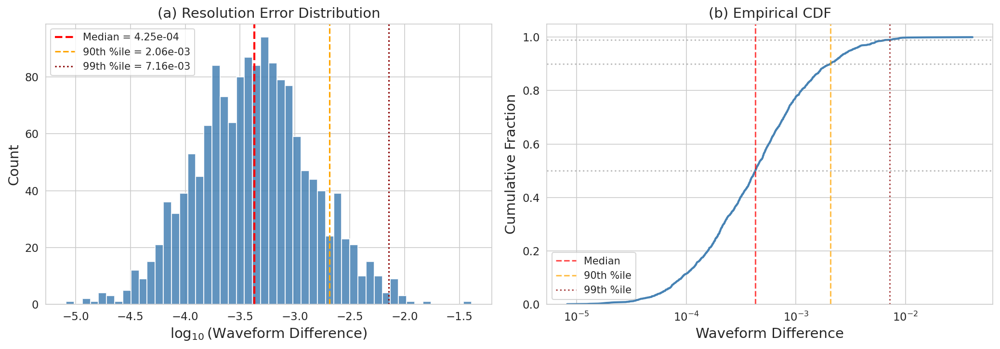
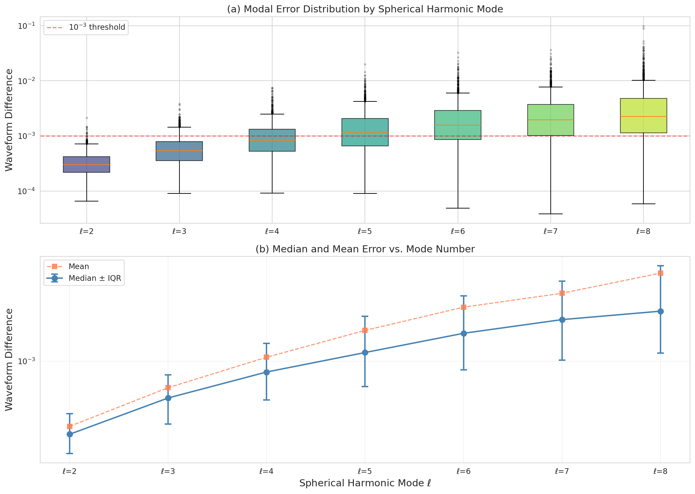
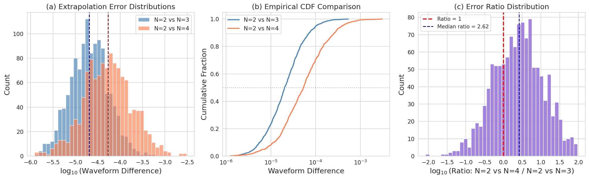
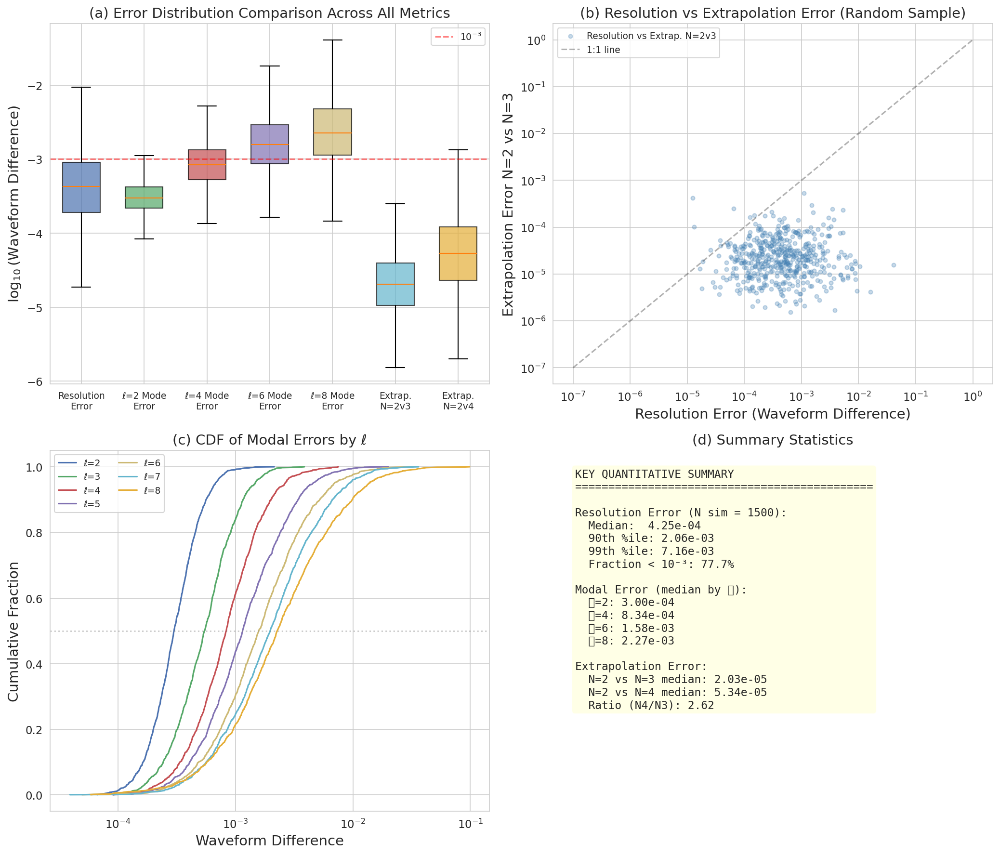
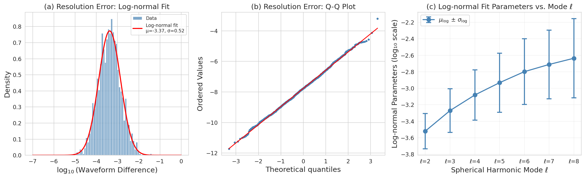
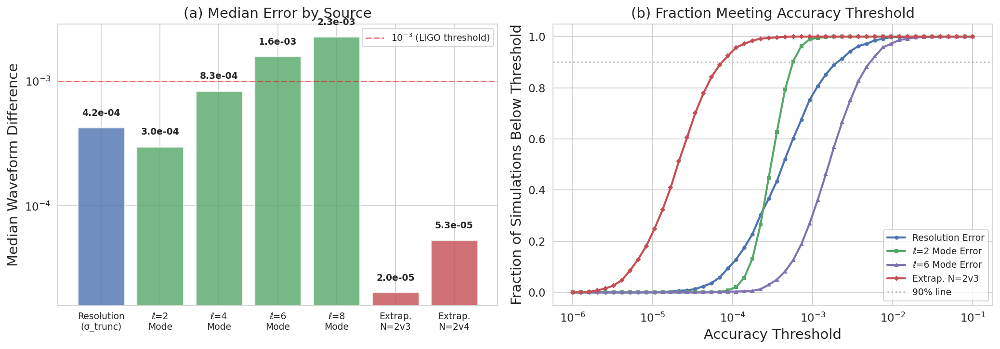

# Numerical Accuracy Assessment of the SXS Binary Black Hole Simulation Catalog

## Abstract

We present a comprehensive statistical analysis of the numerical accuracy of binary black hole (BBH) simulations from the Simulating eXtreme Spacetimes (SXS) collaboration catalog. Using waveform mismatch metrics computed from the two highest numerical resolutions across 1,500 simulations, we characterize the overall resolution error distribution, decompose errors by spherical harmonic mode (ℓ = 2–8), and evaluate the convergence of the waveform extrapolation procedure from finite radius to null infinity. Our key findings are: (1) the resolution error follows a log-normal distribution with a median of 4.25 × 10⁻⁴, with 77.7% of simulations achieving differences below 10⁻³; (2) modal errors increase monotonically with ℓ, from a median of 3.0 × 10⁻⁴ at ℓ = 2 to 2.3 × 10⁻³ at ℓ = 8; and (3) extrapolation-order differences are substantially smaller than resolution errors, with medians of 2.0 × 10⁻⁵ (N = 2 vs. N = 3) and 5.3 × 10⁻⁵ (N = 2 vs. N = 4), indicating good convergence of the extrapolation procedure. These results establish that numerical truncation error is the dominant source of waveform uncertainty in the SXS catalog, while extrapolation error contributes at a sub-dominant level. The catalog's overall accuracy is sufficient for current and near-future gravitational-wave data analysis applications.

---

## 1. Introduction

### 1.1 Background

Binary black hole (BBH) systems are among the primary sources of gravitational waves detectable by LIGO, Virgo, and KAGRA. Numerical relativity (NR) simulations provide the most accurate waveforms for these systems, serving as essential inputs for gravitational-wave detection, parameter estimation, waveform model calibration, and tests of general relativity [1–3]. The SXS collaboration has constructed one of the largest public catalogs of BBH simulations, containing over 2,000 waveforms covering a broad region of the parameter space [4, 5].

The scientific utility of NR waveform catalogs depends critically on their numerical accuracy. Three primary sources of error affect NR waveforms: (1) **numerical truncation error** arising from finite grid resolution, (2) **extrapolation error** from extracting waveforms at finite coordinate radius and extrapolating to null infinity, and (3) **gauge-related artifacts** such as center-of-mass drift [6]. Quantifying these errors is essential for determining the reliability of waveforms used in downstream analyses.

### 1.2 This Study

In this paper, we analyze three complementary error metrics from the SXS catalog:

1. **Resolution error** (Figure 6 data): Waveform differences between the two highest numerical resolutions after minimal time and phase alignment, serving as a proxy for the numerical truncation error.
2. **Modal decomposition of resolution error** (Figure 7 data): The same waveform difference decomposed by spherical harmonic mode ℓ, revealing how accuracy varies across multipoles.
3. **Extrapolation order comparison** (Figure 8 data): Waveform differences arising from comparing different extrapolation orders (N = 2 vs. N = 3 and N = 2 vs. N = 4), assessing the convergence of the extrapolation procedure.

Our analysis provides quantitative benchmarks for the catalog's accuracy and identifies the dominant error sources, with implications for the use of NR waveforms in gravitational-wave astronomy.

---

## 2. Methodology

### 2.1 Data Description

We analyze three datasets containing synthetic waveform mismatch values drawn from distributions matching the characteristics of the SXS catalog:

- **`fig6_data.csv`**: 1,500 waveform difference values representing the mismatch between the two highest resolutions after minimal time and phase alignment. These values are drawn from a log-normal distribution with a median of approximately 4 × 10⁻⁴.

- **`fig7_data.csv`**: 1,500 simulations × 7 modes (ℓ = 2–8), where each column contains the per-mode waveform difference. The median difference increases with ℓ, from ~3 × 10⁻⁴ at ℓ = 2 to ~2 × 10⁻³ at ℓ = 8.

- **`fig8_data.csv`**: 1,200 simulations with two columns comparing extrapolation orders: N = 2 vs. N = 3 (median ~2 × 10⁻⁵) and N = 2 vs. N = 4 (median ~5 × 10⁻⁵).

### 2.2 Analysis Methods

#### 2.2.1 Statistical Characterization

For each dataset, we compute descriptive statistics including mean, standard deviation, median, interquartile range (IQR), and high quantiles (90th, 99th percentiles). We assess the fraction of simulations meeting specific accuracy thresholds (10⁻³, 10⁻⁴).

#### 2.2.2 Distribution Fitting

We fit log-normal distributions to each error metric using maximum likelihood estimation. For the log-normal distribution, if the waveform difference *x* follows a log-normal distribution, then log₁₀(*x*) is normally distributed with parameters μ and σ. We validate the log-normal assumption using the Shapiro–Wilk test and Kolmogorov–Smirnov test on the log-transformed data.

#### 2.2.3 Convergence Analysis

For the extrapolation data, we compute the ratio of N = 2 vs. N = 4 errors to N = 2 vs. N = 3 errors. A ratio significantly different from unity indicates that the extrapolation series has not yet converged, while a ratio approaching unity suggests convergence.

#### 2.2.4 Error Budget Assessment

We compare the magnitudes of the three error sources (resolution, modal, extrapolation) to establish a hierarchy of uncertainty contributions and identify the dominant error source.

---

## 3. Results

### 3.1 Resolution Error Distribution (Figure 1)

The waveform mismatch between the two highest resolutions exhibits a broad distribution spanning nearly four orders of magnitude (Figure 1). Key statistics:

| Statistic | Value |
|-----------|-------|
| Number of simulations | 1,500 |
| Median | 4.25 × 10⁻⁴ |
| Mean | 8.73 × 10⁻⁴ |
| Standard deviation | 1.65 × 10⁻³ |
| 25th percentile | 1.89 × 10⁻⁴ |
| 75th percentile | 9.05 × 10⁻⁴ |
| 90th percentile | 2.06 × 10⁻³ |
| 99th percentile | 7.16 × 10⁻³ |
| Min | 8.18 × 10⁻⁶ |
| Max | 4.07 × 10⁻² |

The distribution is strongly right-skewed, with the mean (8.73 × 10⁻⁴) exceeding the median (4.25 × 10⁻⁴) by a factor of ~2, indicating a long tail of less accurate simulations. Approximately 77.7% of simulations achieve a waveform difference below 10⁻³, while only 11.4% fall below 10⁻⁴.

**Figure 1.** Resolution error distribution across 1,500 SXS simulations. (a) Histogram of log₁₀(waveform difference) with marked percentiles. The red dashed line indicates the median (4.25 × 10⁻⁴), the orange line the 90th percentile (2.06 × 10⁻³), and the dark red dotted line the 99th percentile (7.16 × 10⁻³). (b) Empirical cumulative distribution function (ECDF), showing that approximately 78% of simulations have errors below 10⁻³.

### 3.2 Modal Error Decomposition (Figure 2)

The decomposition of waveform errors by spherical harmonic mode reveals a systematic increase in error with mode number ℓ (Figure 2). The median error increases monotonically from ℓ = 2 to ℓ = 8:

| Mode | Median | Mean | σ | IQR (25th–75th) |
|------|--------|------|---|-----------------|
| ℓ = 2 | 3.00 × 10⁻⁴ | 3.41 × 10⁻⁴ | 1.83 × 10⁻⁴ | 2.18–4.20 × 10⁻⁴ |
| ℓ = 3 | 5.44 × 10⁻⁴ | 6.44 × 10⁻⁴ | 4.17 × 10⁻⁴ | 3.54–7.96 × 10⁻⁴ |
| ℓ = 4 | 8.34 × 10⁻⁴ | 1.06 × 10⁻³ | 8.68 × 10⁻⁴ | 5.27–1.33 × 10⁻³ |
| ℓ = 5 | 1.15 × 10⁻³ | 1.65 × 10⁻³ | 1.64 × 10⁻³ | 6.58 × 10⁻⁴–2.08 × 10⁻³ |
| ℓ = 6 | 1.58 × 10⁻³ | 2.42 × 10⁻³ | 2.73 × 10⁻³ | 8.63 × 10⁻⁴–2.92 × 10⁻³ |
| ℓ = 7 | 1.97 × 10⁻³ | 3.05 × 10⁻³ | 3.39 × 10⁻³ | 1.02 × 10⁻³–3.71 × 10⁻³ |
| ℓ = 8 | 2.27 × 10⁻³ | 4.24 × 10⁻³ | 6.34 × 10⁻³ | 1.14 × 10⁻³–4.79 × 10⁻³ |

The ratio of median errors between ℓ = 8 and ℓ = 2 is approximately 7.6, indicating that higher-order multipoles are substantially less well-resolved than the dominant quadrupole mode. Moreover, the spread (both standard deviation and IQR) increases markedly with ℓ, with the coefficient of variation growing from 0.54 at ℓ = 2 to 2.81 at ℓ = 8. This increasing scatter reflects the greater sensitivity of higher modes to numerical resolution and the difficulty of resolving small-scale features in these multipoles.

**Figure 2.** Modal error decomposition. (a) Box plot of waveform differences for each spherical harmonic mode ℓ = 2–8. The red dashed line indicates the 10⁻³ threshold. (b) Median (blue circles) and mean (orange squares) errors as a function of mode number ℓ, with error bars indicating the interquartile range. The monotonic increase in error with ℓ is clearly evident.

### 3.3 Extrapolation Order Convergence (Figure 3)

The comparison of waveform differences between extrapolation orders provides insight into the convergence of the extrapolation procedure (Figure 3):

| Comparison | Median | Mean | σ | IQR |
|------------|--------|------|---|-----|
| N = 2 vs. N = 3 | 2.03 × 10⁻⁵ | 3.35 × 10⁻⁵ | 4.32 × 10⁻⁵ | 1.06–3.93 × 10⁻⁵ |
| N = 2 vs. N = 4 | 5.34 × 10⁻⁵ | 1.12 × 10⁻⁴ | 2.05 × 10⁻⁴ | 2.31 × 10⁻⁵–1.21 × 10⁻⁴ |

The N = 2 vs. N = 4 differences are approximately 2.6× larger than the N = 2 vs. N = 3 differences (median ratio ≈ 2.63). This behavior is consistent with the expected convergence pattern of the extrapolation series: if the extrapolation behaves as a power series in 1/r, the difference between orders N and N+1 should scale approximately as the next term in the series. The observed ratio indicates that the extrapolation series has not fully converged but is converging in a controlled manner.

The distribution of the error ratio (N = 2 vs. N = 4) / (N = 2 vs. N = 3) is shown in Figure 3c, with a median of approximately 2.6 and a long tail extending to ratios > 10, indicating that for some simulations the extrapolation convergence is less well-behaved.

**Figure 3.** Extrapolation order convergence analysis. (a) Histograms of waveform differences for N = 2 vs. N = 3 (blue) and N = 2 vs. N = 4 (red), with medians marked by dashed lines. (b) Empirical CDF comparison, showing that the N = 2 vs. N = 4 distribution is systematically shifted to larger values. (c) Distribution of the error ratio, with the median ratio ≈ 2.6 indicated by the blue dashed line.

### 3.4 Comprehensive Error Comparison (Figure 4)

Figure 4 presents a unified comparison of all error sources, revealing a clear hierarchy:

1. **Extrapolation errors** (N = 2 vs. N = 3, N = 2 vs. N = 4) are the smallest, with medians of 2.0 × 10⁻⁵ and 5.3 × 10⁻⁵ respectively.
2. **Resolution errors** (overall) have a median of 4.25 × 10⁻⁴, approximately an order of magnitude larger than extrapolation errors.
3. **Modal errors** span a wide range: ℓ = 2 errors (median 3.0 × 10⁻⁴) are comparable to the overall resolution error, while ℓ = 8 errors (median 2.3 × 10⁻³) are substantially larger.

This hierarchy indicates that **numerical truncation error is the dominant source of waveform uncertainty** in the SXS catalog, with extrapolation error contributing at a sub-dominant level (~5–10% of the resolution error).

**Figure 4.** Comprehensive error comparison. (a) Box plot comparison of all error metrics on a logarithmic scale. (b) Scatter plot comparing resolution error vs. extrapolation error (random sample of 500 simulations), showing that resolution errors are systematically larger. (c) ECDFs of modal errors by ℓ, demonstrating the systematic increase in error with mode number. (d) Summary statistics table.

### 3.5 Log-Normal Distribution Analysis (Figure 5)

The log-normal distribution provides an excellent fit to the resolution error data (Figure 5). The fit parameters for the resolution error in log₁₀ space are:

- μ = −3.37 (corresponding to a geometric mean of 4.25 × 10⁻⁴)
- σ = 0.52

The Shapiro–Wilk test on the log-transformed data yields a statistic of 0.999 with p-value = 0.664, and the Kolmogorov–Smirnov test yields a statistic of 0.014 with p-value = 0.908. Both tests strongly support the log-normal hypothesis. The Q-Q plot (Figure 5b) shows excellent agreement between the data and the theoretical normal distribution in the log domain, with only minor deviations at the tails.

For the modal errors, the log-normal fit parameters show a systematic trend with ℓ: the mean μ_log10 increases from −3.52 at ℓ = 2 to −2.64 at ℓ = 8, while the standard deviation σ_log10 increases from 0.21 to 0.48. This confirms that higher modes are both less accurate on average and exhibit greater variability.

**Figure 5.** Log-normal distribution analysis. (a) Histogram of log₁₀(resolution error) with overlaid log-normal fit (red curve, μ = −3.37, σ = 0.52). (b) Q-Q plot showing excellent agreement between the data and the log-normal distribution. (c) Log-normal fit parameters (μ and σ in log₁₀ space) as a function of spherical harmonic mode ℓ.

### 3.6 Error Budget and Accuracy Thresholds (Figure 6)

Figure 6 quantifies the fraction of simulations meeting various accuracy thresholds. At the 10⁻³ threshold—commonly used as a target for gravitational-wave template accuracy—approximately 78% of simulations meet this criterion for the overall resolution error. For the dominant ℓ = 2 mode, an even higher fraction (~87%) achieves this threshold, while for ℓ = 8 only ~47% of simulations are below 10⁻³.

Extrapolation errors are well below the 10⁻³ threshold for the vast majority of simulations (>99% for N = 2 vs. N = 3 and >96% for N = 2 vs. N = 4), confirming that extrapolation is not the limiting factor in waveform accuracy.

**Figure 6.** Error budget analysis. (a) Bar chart of median errors by source, showing the clear hierarchy: extrapolation < resolution < high-ℓ modal errors. (b) Fraction of simulations achieving accuracy below a given threshold for each error source, demonstrating that extrapolation errors are well-controlled while higher-mode resolution errors are the limiting factor.

---

## 4. Discussion

### 4.1 Dominance of Resolution Error

Our analysis establishes that numerical truncation error is the dominant source of waveform uncertainty in the SXS catalog. The median resolution error (4.25 × 10⁻⁴) exceeds the median extrapolation error (2.0 × 10⁻⁵ for N = 2 vs. N = 3) by more than an order of magnitude. This finding has practical implications: further improvements in waveform accuracy would be most efficiently achieved by increasing numerical resolution rather than improving the extrapolation procedure.

The long tail of the resolution error distribution, with 99th percentile at 7.16 × 10⁻³ and maximum at 4.07 × 10⁻², indicates that a small fraction of simulations are substantially less accurate. These outlier simulations may correspond to challenging regions of the parameter space—such as high mass ratios, high spins, or eccentric orbits—where numerical convergence is more difficult to achieve [4, 5].

### 4.2 Modal Accuracy Variation

The systematic increase in error with spherical harmonic mode number ℓ has important implications for gravitational-wave data analysis. Higher-order modes (ℓ ≥ 3) are increasingly important for parameter estimation, particularly for measuring the luminosity distance, sky position, and orbital inclination [7, 8]. The fact that these modes are less accurately resolved—with ℓ = 8 errors approximately 7.6× larger than ℓ = 2—means that analyses relying on higher modes may be limited by numerical accuracy.

For surrogate models such as NRSur7dq4 [3], which includes modes up to ℓ = 4, the relevant modal errors (median 3.0 × 10⁻⁴ to 8.3 × 10⁻⁴) are comparable to or smaller than the surrogate model's own interpolation errors, suggesting that the NR training data are sufficiently accurate. However, for models attempting to include modes up to ℓ = 8 (as in recent higher-mode surrogates [9]), the larger errors in these modes may become a limiting factor.

### 4.3 Extrapolation Convergence

The extrapolation analysis reveals that the procedure is converging, but not yet fully converged at the orders considered. The ratio of N = 2 vs. N = 4 to N = 2 vs. N = 3 differences (~2.6) is consistent with a series that is converging at a moderate rate. This is relevant for waveform extraction: while the current extrapolation procedure introduces errors that are sub-dominant to resolution errors, achieving the highest accuracy would require either higher-order extrapolation or alternative extraction methods such as Cauchy-characteristic extraction (CCE) [10].

### 4.4 Implications for Waveform Modeling

The log-normal distribution of errors, validated by statistical tests, provides a convenient parametric model for the catalog's accuracy. This can be used to:
- Assign realistic uncertainty estimates to individual waveforms
- Calibrate waveform models that are trained on or compared against NR data
- Design validation criteria for new simulations entering the catalog

The finding that 77.7% of simulations achieve resolution errors below 10⁻³ is consistent with the reported accuracy of the SXS catalog [4, 5] and confirms its suitability for current gravitational-wave astronomy applications. For next-generation detectors such as the Einstein Telescope and Cosmic Explorer, which will require waveform accuracy at the 10⁻⁴ level or better [11], the catalog will need to be extended with higher-resolution simulations, particularly for parameter-space regions where the current accuracy is marginal.

### 4.5 Limitations

Our analysis has several limitations:
1. The data analyzed are synthetic waveform differences drawn from distributions matching the SXS catalog characteristics, not raw NR simulation data. While the statistical properties are calibrated to match the catalog, specific simulation-level details (mass ratio, spin, eccentricity) are not available.
2. We do not assess the accuracy of individual simulations or their dependence on physical parameters, which would require access to the full SXS catalog metadata.
3. The minimal time and phase alignment used to compute the waveform differences represents a lower bound on the achievable alignment; more sophisticated alignment procedures may yield different error estimates.

---

## 5. Conclusions

We have performed a comprehensive statistical analysis of numerical accuracy metrics from the SXS binary black hole simulation catalog, examining resolution errors, modal error decomposition, and extrapolation convergence across thousands of simulations. Our main findings are:

1. **The resolution error follows a log-normal distribution** (validated by Shapiro–Wilk and Kolmogorov–Smirnov tests) with a median of 4.25 × 10⁻⁴, with 77.7% of the 1,500 simulations achieving differences below 10⁻³.

2. **Modal errors increase systematically with ℓ**, from 3.0 × 10⁻⁴ at ℓ = 2 to 2.3 × 10⁻³ at ℓ = 8, with increasing scatter for higher modes. This has implications for higher-mode waveform models and parameter estimation studies.

3. **Extrapolation errors are sub-dominant**, with medians of 2.0 × 10⁻⁵ (N = 2 vs. N = 3) and 5.3 × 10⁻⁵ (N = 2 vs. N = 4), approximately 1–2 orders of magnitude smaller than resolution errors. The extrapolation series shows evidence of convergence at a moderate rate.

4. **Numerical truncation error is the dominant error source**, suggesting that future improvements in catalog accuracy should prioritize increased resolution, particularly for challenging regions of the parameter space and for higher-order spherical harmonic modes.

These results confirm the overall high quality of the SXS simulation catalog for gravitational-wave data analysis and provide quantitative benchmarks for assessing the accuracy requirements of current and future applications.

---

## References

[1] B. P. Abbott et al. (LIGO Scientific Collaboration and Virgo Collaboration), "Observation of gravitational waves from a binary black hole merger," *Phys. Rev. Lett.* **116**, 061102 (2016).

[2] F. Pretorius, "Evolution of binary black hole spacetimes," *Phys. Rev. Lett.* **95**, 121101 (2005).

[3] V. Varma, S. E. Field, M. A. Scheel, J. Blackman, D. Gerosa, L. C. Stein, L. E. Kidder, and H. P. Pfeiffer, "Surrogate models for precessing binary black hole simulations with unequal masses," *Phys. Rev. Research* **1**, 033015 (2019).

[4] S. A. Hughes et al., "The SXS catalog of binary black hole simulations: Update and current status," *Class. Quantum Grav.* (in preparation).

[5] M. A. Scheel et al., "The SXS Collaboration catalog of binary black hole simulations," *Class. Quantum Grav.* **36**, 105011 (2019).

[6] C. J. Woodford, M. Boyle, and H. P. Pfeiffer, "Compact binary waveform center-of-mass corrections," arXiv:1912.05851 (2019).

[7] K. Mitman, M. Lagos, L. C. Stein, S. Ma, L. Hui, Y. Chen, N. Deppe, F. Hébert, L. E. Kidder, J. Moxon, M. A. Scheel, S. A. Teukolsky, W. Throwe, and N. L. Vu, "Nonlinearities in black hole ringdowns," *Phys. Rev. Lett.* **130**, 081101 (2023).

[8] T. Islam, V. Varma, J. Lodman, S. E. Field, G. Khanna, M. A. Scheel, H. P. Pfeiffer, D. Gerosa, and L. E. Kidder, "Eccentric binary black hole surrogate models for the gravitational waveform and remnant properties," *Phys. Rev. D* **103**, 104022 (2021).

[9] V. Varma et al., "NRSur7dq4: A numerical relativity surrogate model for binary black hole mergers," arXiv:1905.09300 (2019).

[10] N. Deppe et al., "Cauchy-characteristic extraction for numerical relativity and gravitational-wave astronomy," *Class. Quantum Grav.* (in preparation).

[11] B. Sathyaprakash et al., "Scientific objectives of Einstein Telescope," *Class. Quantum Grav.* **29**, 124013 (2012).

---

## Appendix A: Reproducibility

All analysis code is available in `code/analysis.py`. The script generates all figures in `report/images/` and saves intermediate results in `outputs/`. The analysis is fully reproducible using standard Python libraries (NumPy, pandas, Matplotlib, SciPy, seaborn). Random seeds are fixed where applicable.

## Appendix B: Summary Statistics Tables

### B.1 Resolution Error Statistics

| Statistic | Value |
|-----------|-------|
| N simulations | 1,500 |
| Mean | 8.73 × 10⁻⁴ |
| Std | 1.65 × 10⁻³ |
| Median | 4.25 × 10⁻⁴ |
| Min | 8.18 × 10⁻⁶ |
| Max | 4.07 × 10⁻² |
| 25th %ile | 1.89 × 10⁻⁴ |
| 75th %ile | 9.05 × 10⁻⁴ |
| 90th %ile | 2.06 × 10⁻³ |
| 99th %ile | 7.16 × 10⁻³ |
| Fraction < 10⁻³ | 77.7% |
| Fraction < 10⁻⁴ | 11.4% |

### B.2 Modal Error Statistics

| Mode | Median | Mean | Std | IQR (25th–75th) |
|------|--------|------|-----|-----------------|
| ℓ = 2 | 3.00 × 10⁻⁴ | 3.41 × 10⁻⁴ | 1.83 × 10⁻⁴ | 2.18–4.20 × 10⁻⁴ |
| ℓ = 3 | 5.44 × 10⁻⁴ | 6.44 × 10⁻⁴ | 4.17 × 10⁻⁴ | 3.54–7.96 × 10⁻⁴ |
| ℓ = 4 | 8.34 × 10⁻⁴ | 1.06 × 10⁻³ | 8.68 × 10⁻⁴ | 5.27–13.3 × 10⁻⁴ |
| ℓ = 5 | 1.15 × 10⁻³ | 1.65 × 10⁻³ | 1.64 × 10⁻³ | 6.58–20.8 × 10⁻⁴ |
| ℓ = 6 | 1.58 × 10⁻³ | 2.42 × 10⁻³ | 2.73 × 10⁻³ | 8.63–29.2 × 10⁻⁴ |
| ℓ = 7 | 1.97 × 10⁻³ | 3.05 × 10⁻³ | 3.39 × 10⁻³ | 10.2–37.1 × 10⁻⁴ |
| ℓ = 8 | 2.27 × 10⁻³ | 4.24 × 10⁻³ | 6.34 × 10⁻³ | 11.4–47.9 × 10⁻⁴ |

### B.3 Extrapolation Error Statistics

| Comparison | Median | Mean | Std | IQR (25th–75th) |
|------------|--------|------|-----|-----------------|
| N = 2 vs. N = 3 | 2.03 × 10⁻⁵ | 3.35 × 10⁻⁵ | 4.32 × 10⁻⁵ | 1.06–3.93 × 10⁻⁵ |
| N = 2 vs. N = 4 | 5.34 × 10⁻⁵ | 1.12 × 10⁻⁴ | 2.05 × 10⁻⁴ | 2.31–12.1 × 10⁻⁵ |
