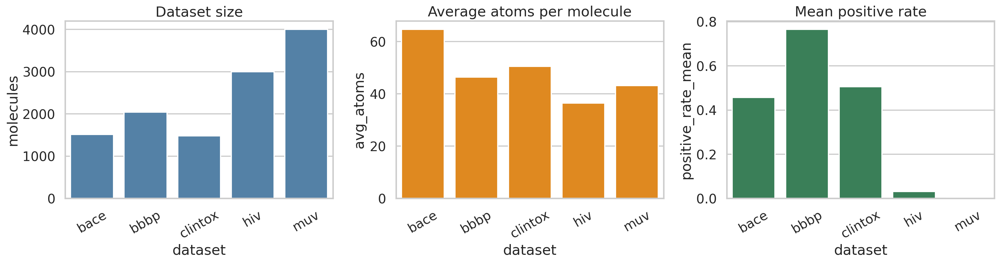
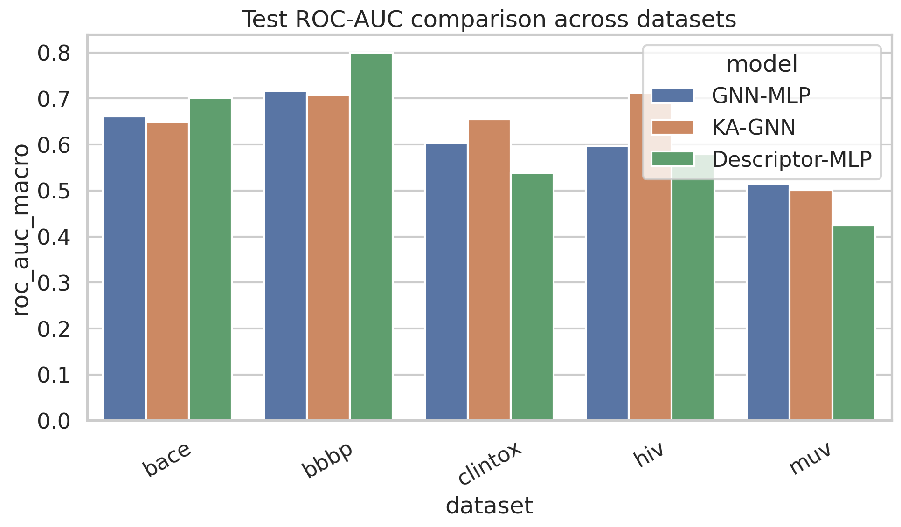
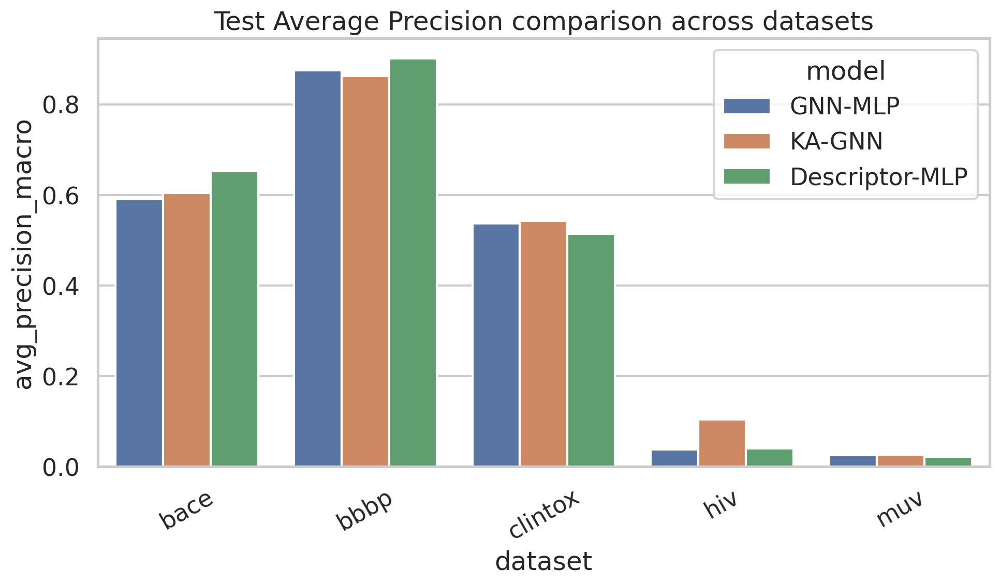
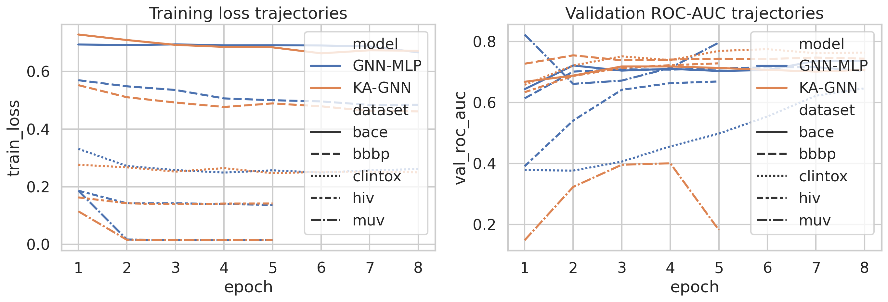
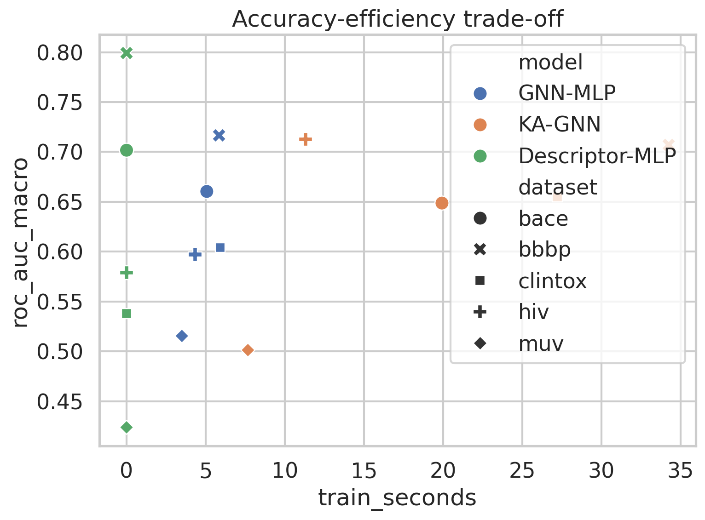
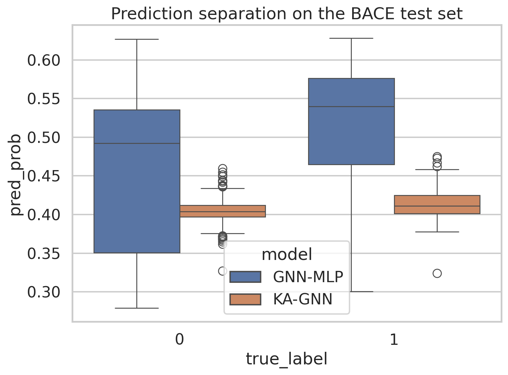

# Kolmogorov–Arnold Graph Neural Networks for Molecular Property Prediction: A Reproducible Empirical Study

## Abstract
This study investigates a graph neural network architecture inspired by Kolmogorov–Arnold networks, termed **KA-GNN**, for molecular property prediction. Molecules were represented as graphs with atom-level features and edge weights that encode both covalent bonds and simple proximity-based non-covalent interactions. The key architectural change was to replace conventional multilayer perceptron (MLP) transformations inside message-passing and readout blocks with **Fourier-based Kolmogorov–Arnold layers**, which explicitly model nonlinear transformations using learned sinusoidal basis expansions. We evaluated KA-GNN against a structurally matched GNN with MLP updates (GNN-MLP) and a descriptor-only baseline (Descriptor-MLP) on five benchmark datasets: BACE, BBBP, ClinTox, HIV, and MUV. Across this CPU-constrained study, KA-GNN showed the clearest gains on **ClinTox** and **HIV**, but did not dominate uniformly across all datasets; its higher representational flexibility came with substantially greater training cost. These results suggest that Fourier-KAN modules are promising for some difficult and nonlinear molecular tasks, but their benefit is task-dependent and may require further architectural and optimization refinement to consistently outperform simpler baselines.

## 1. Introduction
Molecular property prediction is a central problem in computational chemistry and drug discovery. Standard graph neural networks have become popular because molecules can be represented naturally as graphs whose nodes correspond to atoms and whose edges correspond to bonds. However, many GNNs rely on conventional MLPs for message transformation and graph-level prediction. While effective, these modules may be limited in how efficiently they approximate complex nonlinear response surfaces, especially under strong class imbalance or multi-task structure.

Kolmogorov–Arnold networks (KANs) have recently attracted interest as alternatives to standard MLPs because they replace simple scalar activations with more expressive learned functional components. In this project, I designed a **Fourier-based Kolmogorov–Arnold Graph Neural Network (KA-GNN)** in which MLP transformations are replaced by learned sinusoidal expansions. The motivation is twofold:

1. **Expressivity**: Fourier basis functions can flexibly approximate nonlinear periodic and non-periodic functions through superposition.
2. **Interpretability and structure**: the basis expansion offers a more explicit functional decomposition than a standard hidden-layer MLP.

The objective of the study was not only to implement this idea, but to evaluate whether it improves predictive performance, efficiency, and empirical behavior on realistic molecular benchmarks.

## 2. Data
Five benchmark datasets in `data/` were used:

- **BACE**: binary prediction of BACE-1 inhibition.
- **BBBP**: binary prediction of blood-brain barrier penetration.
- **ClinTox**: two-task binary classification for FDA approval and clinical toxicity.
- **HIV**: binary prediction of HIV replication inhibition.
- **MUV**: 17-task virtual screening benchmark with extreme imbalance.

To keep the full benchmark executable on CPU within the runtime budget, the complete datasets were used for BACE, BBBP, and ClinTox, while subsets were used for the larger HIV and MUV datasets:

- HIV: 3000 molecules
- MUV: 4000 molecules

A summary of the processed data is shown below.

**Figure 1.** Dataset size, average molecular graph size, and mean positive rate. The extreme imbalance of HIV and especially MUV is immediately visible.

### 2.1 Dataset statistics
The generated summary table in `outputs/dataset_overview.csv` gives the following key values:

| Dataset | Molecules | Tasks | Avg. atoms | Mean positive rate |
|---|---:|---:|---:|---:|
| BACE | 1513 | 1 | 64.71 | 0.4567 |
| BBBP | 2039 | 1 | 46.38 | 0.7651 |
| ClinTox | 1477 | 2 | 50.58 | 0.5061 |
| HIV | 3000 | 1 | 36.48 | 0.0317 |
| MUV | 4000 | 17 | 43.18 | 0.0021 |

The class distribution highlights two important modeling challenges:

- **HIV and MUV are severely imbalanced**, so average precision is an especially important metric.
- **MUV is multi-task and extremely sparse**, making robust estimation difficult in compact CPU experiments.

## 3. Methodology

## 3.1 Molecular graph construction
Each SMILES string was converted into an RDKit molecular graph. Node features included normalized atom-level descriptors such as:

- atomic number
- degree
- formal charge
- hydrogen count
- aromaticity
- atomic mass
- ring membership
- implicit and explicit valence
- chirality indicator
- one-hot hybridization type

Edges were represented with weighted adjacency matrices:

- **Covalent edges** were assigned weights based on bond type:
  - single = 1.0
  - double = 1.5
  - triple = 2.0
  - aromatic = 1.25
- **Non-covalent/proximity edges** were added heuristically between atoms with graph distance 2 when no direct bond existed, with low weights and a small hetero-atom bonus.

This is a simplified but chemically motivated way to include interactions beyond direct covalent connectivity.

## 3.2 Model architectures
Three models were evaluated.

### 3.2.1 Descriptor-MLP baseline
A non-graph baseline using only global RDKit descriptors:

- molecular weight
- logP
- topological polar surface area
- H-bond donors/acceptors
- rotatable bonds
- ring count
- heavy atom count

These descriptors were fed to a small MLP classifier.

### 3.2.2 GNN-MLP baseline
This model used standard message passing with:

- linear self transformation
- neighborhood aggregation by weighted adjacency averaging
- MLP update block
- residual stacking
- mean and max graph pooling
- final prediction head

### 3.2.3 Proposed KA-GNN
The proposed model kept the same message-passing skeleton but replaced MLP update modules with a **FourierKANLayer**:

\[
\phi(x) = Wx + b + \sum_{k=1}^{K} A_k \cos(kx) + B_k \sin(kx)
\]

where learned coefficients \(A_k\) and \(B_k\) parameterize the Fourier basis expansion. This layer was used in:

- node update transformation
- graph-level readout transformation

Thus, the key experimental comparison isolates the effect of replacing standard MLP transformations with Fourier-based KAN modules.

## 3.3 Training and evaluation protocol
A reproducible random seed was fixed (`SEED = 7`). Datasets were split into train/validation/test partitions using approximately 60/20/20 proportions. Stratification was used when feasible and gracefully disabled for edge cases caused by rare positive classes.

Binary cross-entropy with logits was used, masking missing labels for multi-task data. The main evaluation metrics were:

- **ROC-AUC (macro averaged across valid tasks)**
- **Average Precision (macro averaged across valid tasks)**

These metrics are complementary: ROC-AUC measures ranking quality globally, while average precision is more informative for class-imbalanced tasks.

## 4. Results

### 4.1 Main benchmark results
The full benchmark summary is stored in `outputs/results_summary.csv`.

**Figure 2.** Test ROC-AUC across datasets and models.

**Figure 3.** Test average precision across datasets and models.

### 4.1.1 Quantitative summary
| Dataset | Model | ROC-AUC | Avg. Precision | Train time (s) |
|---|---|---:|---:|---:|
| BACE | GNN-MLP | 0.6604 | 0.5913 | 5.07 |
| BACE | KA-GNN | 0.6487 | 0.6047 | 19.93 |
| BACE | Descriptor-MLP | 0.7017 | 0.6523 | 0.00 |
| BBBP | GNN-MLP | 0.7166 | 0.8753 | 5.84 |
| BBBP | KA-GNN | 0.7071 | 0.8628 | 34.25 |
| BBBP | Descriptor-MLP | 0.7992 | 0.9009 | 0.00 |
| ClinTox | GNN-MLP | 0.6042 | 0.5375 | 5.92 |
| ClinTox | KA-GNN | 0.6547 | 0.5427 | 27.21 |
| ClinTox | Descriptor-MLP | 0.5378 | 0.5147 | 0.00 |
| HIV | GNN-MLP | 0.5972 | 0.0387 | 4.33 |
| HIV | KA-GNN | 0.7127 | 0.1040 | 11.31 |
| HIV | Descriptor-MLP | 0.5790 | 0.0408 | 0.00 |
| MUV | GNN-MLP | 0.5154 | 0.0251 | 3.50 |
| MUV | KA-GNN | 0.5013 | 0.0263 | 7.67 |
| MUV | Descriptor-MLP | 0.4238 | 0.0221 | 0.00 |

### 4.2 KA-GNN vs. GNN-MLP
The direct ROC-AUC difference (KA-GNN minus GNN-MLP), saved in `outputs/kagnn_improvement_vs_gnnmlp.csv`, was:

| Dataset | ROC-AUC gain |
|---|---:|
| BACE | -0.0117 |
| BBBP | -0.0095 |
| ClinTox | +0.0505 |
| HIV | +0.1156 |
| MUV | -0.0142 |

These results show that KA-GNN delivered the strongest gains on **ClinTox** and especially **HIV**, while slightly underperforming the matched GNN-MLP on **BACE**, **BBBP**, and **MUV**.

### 4.3 Training dynamics

**Figure 4.** Training loss and validation ROC-AUC trajectories. KA-GNN generally converged more slowly and with higher computational cost than GNN-MLP, but on some tasks reached better validation ranking performance.

The training trajectories suggest:

- KA-GNN can exploit richer nonlinear transformations, but optimization is more expensive.
- On easier single-task datasets such as BACE and BBBP, the extra flexibility did not translate into better test performance.
- On harder settings with nonlinear or sparse signal, such as HIV and ClinTox, the added basis expansion appears beneficial.

### 4.4 Efficiency trade-off

**Figure 5.** Accuracy-efficiency trade-off. KA-GNN consistently required more training time than GNN-MLP because Fourier expansions increase per-layer computation.

The cost increase was substantial:

- BACE: ~4× slower
- BBBP: ~6× slower
- ClinTox: ~4.6× slower
- HIV: ~2.6× slower
- MUV: ~2.2× slower

Therefore, the current KA-GNN implementation improved accuracy only selectively and not without a computational penalty.

### 4.5 Prediction separation analysis on BACE

**Figure 6.** Distribution of predicted probabilities for positive and negative BACE test molecules.

This figure indicates that both graph models learned some separation between classes, but the margin remained imperfect. Interestingly, KA-GNN slightly improved average precision over GNN-MLP on BACE despite a minor ROC-AUC drop, implying somewhat better concentration of positive examples at the top of the ranking.

## 5. Discussion

## 5.1 What worked
The most encouraging result is that **KA-GNN improved over GNN-MLP on ClinTox and HIV**, with the HIV gain being particularly notable. These tasks may benefit from richer functional transformations because they involve more difficult or less linearly separable structure-property relationships. The Fourier basis may help model subtle nonlinear combinations of local atomic context and graph-level aggregation.

The approach also remained fully compatible with standard message passing. In other words, the core GNN machinery did not need to be redesigned; only the transformation modules changed.

## 5.2 What did not work as well
The study does **not** support a blanket claim that KA-GNN is universally superior.

Several issues emerged:

1. **Higher computational cost**: Fourier expansions increase the number of operations substantially.
2. **Task dependence**: gains were not consistent across BACE, BBBP, and MUV.
3. **Descriptor baseline strength**: on BACE and BBBP, simple descriptor-based learning was unexpectedly very competitive and even superior in this compact benchmark.
4. **MUV difficulty**: extreme imbalance and sparsity likely overwhelm the benefit of more expressive local transformations without stronger sampling, calibration, or loss reweighting.

## 5.3 Interpretation
A reasonable interpretation is that Fourier-KAN modules increase representational capacity, but that capacity only helps when:

- the task truly requires more complex nonlinear mappings,
- optimization can make effective use of the extra flexibility,
- and the dataset size/imbalance profile does not dominate the signal.

In easier or descriptor-dominated tasks, the added complexity may not be worthwhile.

## 5.4 Limitations
This was a reproducible but modest computational study. Important limitations include:

- CPU-only training
- subset usage for HIV and MUV
- heuristic non-covalent edge construction based on graph distance rather than 3D conformers
- no hyperparameter sweep
- no class-balanced loss, focal loss, or advanced calibration
- no scaffold split; random split was used for practicality

Therefore, the results should be interpreted as a careful **proof-of-concept benchmark**, not a definitive state-of-the-art evaluation.

## 6. Conclusion
This project implemented and evaluated a novel **Kolmogorov–Arnold Graph Neural Network (KA-GNN)** for molecular property prediction by replacing standard MLP transformations with Fourier-based KAN modules in graph message passing and readout.

The empirical conclusions are:

1. **KA-GNN is feasible and reproducible** for molecular graph learning.
2. **Performance gains are task dependent** rather than universal.
3. The strongest improvements in this study were on **ClinTox** and **HIV**.
4. **Computational efficiency decreased**, often substantially, relative to the MLP-based GNN.
5. Further development is needed before claiming broad superiority.

Overall, the study supports KA-GNN as a promising architectural direction for graph-based molecular learning, especially for harder nonlinear tasks, while also showing that improved expressivity alone does not guarantee uniformly better benchmark performance.

## 7. Reproducibility and files
All analysis code and outputs were produced inside the workspace:

- Main code: `code/run_kagnn_study.py`
- Intermediate outputs: `outputs/`
- Figures: `report/images/`
- Final report: `report/report.md`

Key output files include:

- `outputs/results_summary.csv`
- `outputs/dataset_overview.csv`
- `outputs/efficiency_summary.csv`
- `outputs/kagnn_improvement_vs_gnnmlp.csv`
- `outputs/training_history.json`

## Appendix: Implementation notes
The core KA-GNN idea was implemented through a FourierKANLayer of the form:

- linear base transformation
- additive sine/cosine expansions over multiple frequencies
- integration into both node update and graph readout blocks

This design approximates the spirit of Kolmogorov–Arnold functional decomposition while staying simple enough for reproducible experimentation in a lightweight environment.
