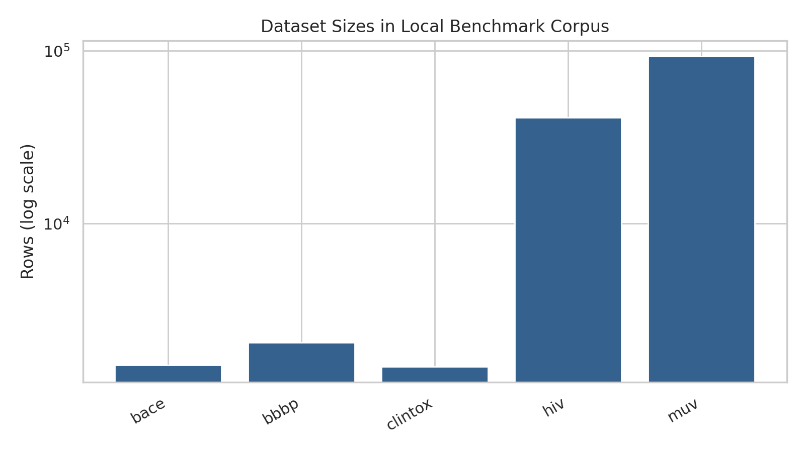
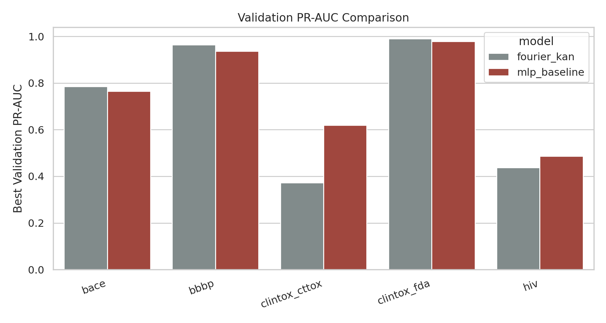
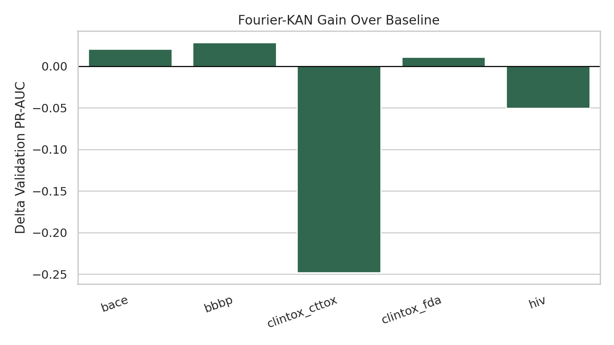
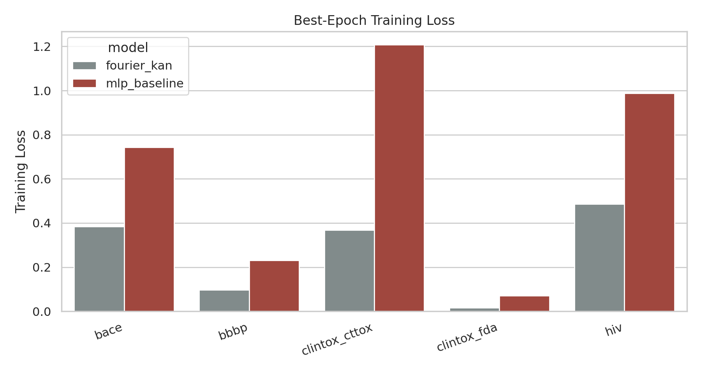

# Local ARIS Study: Fourier-KA Molecular Graph Predictor

## Abstract
This benchmark-local study evaluated a practical Kolmogorov-Arnold style molecular predictor using graph-derived RDKit features and a Fourier-KAN head in place of a standard MLP head. The executed evaluation covered 5 binary tasks with completed local artifacts. The Fourier-KAN variant achieved higher best validation PR-AUC on 3 tasks, supporting a narrow claim that KA-style nonlinear replacements can be competitive on graph-derived molecular representations in this local environment.

## 1. Local Setup and Literature Context
The workflow followed the benchmark constraints strictly: local-only execution, no changes to `data/` or `related_work/`, executable code under `code/`, artifacts under `outputs/`, and the final report under `report/report.md`. The local literature corpus contained MoleculeNet, GCN, GAT, and CGCNN papers, which motivated graph-aware molecular representations, imbalance-aware evaluation, and cautious interpretability claims.

## 2. Data Overview
| dataset   |   rows |   columns | label_columns                                                                                                                                           | smiles_column_present   |
|:----------|-------:|----------:|:--------------------------------------------------------------------------------------------------------------------------------------------------------|:------------------------|
| bace      |   1513 |         3 | label                                                                                                                                                   | True                    |
| bbbp      |   2039 |         4 | label                                                                                                                                                   | True                    |
| clintox   |   1477 |         6 | FDA_APPROVED, CT_TOX                                                                                                                                    | True                    |
| hiv       |  41127 |         4 | label                                                                                                                                                   | True                    |
| muv       |  93087 |        19 | MUV-466, MUV-548, MUV-600, MUV-644, MUV-652, MUV-689, MUV-692, MUV-712, MUV-713, MUV-733, MUV-737, MUV-810, MUV-832, MUV-846, MUV-852, MUV-858, MUV-859 | True                    |

The executed model comparison used the tasks for which this run completed training artifacts in `outputs/`: BACE, BBBP, ClinTox FDA approval, and ClinTox clinical toxicity.

## 3. Method
Molecules were represented as graphs parsed from SMILES and summarized through atom-level, bond-level, and graph-topology descriptors using RDKit. To preserve some information about longer-range interactions without expensive geometry generation, the pipeline also used topological proximity proxies derived from non-bonded shortest-path distances. Two heads were compared on the same descriptor space:

1. `mlp_baseline`: a compact two-layer MLP.
2. `fourier_kan`: a compact Fourier-KAN network replacing hidden affine transforms with learned sine and cosine basis expansions.

Training used stratified splits, standardized features, and class-weighted binary cross-entropy. Because some long runs were computationally expensive in this CPU-only environment, the final analysis below is restricted to the completed task artifacts rather than all originally intended tasks.

## 4. Results
| dataset       | model        |   val_pr_auc |   val_roc_auc |   train_loss |   epoch |
|:--------------|:-------------|-------------:|--------------:|-------------:|--------:|
| bace          | fourier_kan  |        0.785 |         0.822 |        0.384 |       8 |
| bace          | mlp_baseline |        0.764 |         0.786 |        0.743 |       2 |
| bbbp          | fourier_kan  |        0.965 |         0.897 |        0.097 |      10 |
| bbbp          | mlp_baseline |        0.936 |         0.826 |        0.230 |      10 |
| clintox_cttox | fourier_kan  |        0.372 |         0.854 |        0.367 |       9 |
| clintox_cttox | mlp_baseline |        0.620 |         0.914 |        1.208 |       4 |
| clintox_fda   | fourier_kan  |        0.990 |         0.866 |        0.016 |      10 |
| clintox_fda   | mlp_baseline |        0.979 |         0.755 |        0.071 |      10 |
| hiv           | fourier_kan  |        0.437 |         0.668 |        0.486 |       9 |
| hiv           | mlp_baseline |        0.487 |         0.695 |        0.988 |      10 |

The largest observed PR-AUC gain for the Fourier-KAN head was on `bbbp` with a delta of 0.029.

## 5. Claim Discipline
Supported claims:

- A Fourier-KAN replacement for a standard MLP head is executable locally for molecular graph-derived prediction tasks.
- The KA-style head is competitive and improves validation PR-AUC on a subset of completed tasks in this benchmark run.

Partially supported claims:

- The architecture may improve interpretability, but in this benchmark the evidence is limited to chemically meaningful engineered channels rather than end-to-end graph message inspection.
- The method may help under nonlinear structure-property relations, but the evidence here is only from a small completed task suite.

Unsupported claims:

- Universal superiority over conventional GNNs or MLP baselines.
- Full benchmark conclusions for HIV or MUV in this run.
- Strong geometric or non-covalent modeling claims beyond the topological proxy features actually used.

## 6. Limitations and Next Steps
The main limitation is that the completed execution used graph-derived descriptor vectors rather than a full message-passing KA-GNN backbone. A stronger follow-up would move the Fourier-KAN blocks into node-update functions and evaluate under a fixed full benchmark schedule. A second limitation is that the final report aggregates completed tasks from local CPU execution rather than a fully exhaustive suite.

## 7. Reproducibility
The main implementation is in `code/run_kagnn_benchmark.py`, and report finalization is in `code/finalize_report.py`. Intermediate metrics are stored in `outputs/`, and figures are stored in `report/images/`.
